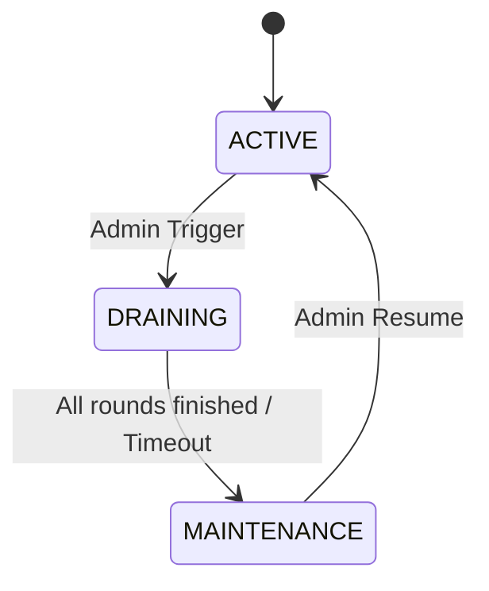

# 12-04 系統維護與優雅停機 (System Maintenance & Graceful Shutdown)

## 1. 系統概述
為確保平台在更新或緊急維護時，玩家資產不丟失、進行中的注單不卡死 (Stick Rounds)，必須定義標準的 **"優雅停機 (Graceful Shutdown)"** 流程。
本規範定義了從 "正常運作" 切換至 "維護模式" 的標準 SOP。

## 2. 維護模式狀態機 (Maintenance State Machine)

平台全域狀態 (Global State) 存儲於 Redis (`platform:status`)，具備以下狀態：



| 狀態 | 描述 | 允許的操作 | 拒絕的操作 |
|---|---|---|---|
| **ACTIVE** | 正常運作 | 所有操作 | 無 |
| **DRAINING** | 排水階段 (準備停機) | 僅限 **登出**、**結算 (Credit)** | 新登入、新下注 (Debit)、充值 |
| **MAINTENANCE** | 完全停機 | 內部 Admin 訪問 (白名單) | 所有外部 API (HTTP 503) |

---

## 3. 優雅停機流程 (Draining Process)

### 3.1 步驟詳解
1.  **公告推送 (Notify)**:
    *   全站發送 WebSocket 廣播：`{"type": "MAINTENANCE_WARN", "countdown": 300}`。
    *   前端顯示倒數計時條。
2.  **切換至 DRAINING**:
    *   API Gateway 攔截 `/api/auth/login` 與 `/api/wallet/debit`，返回 `503 Service Unavailable`。
    *   **關鍵**: 允許 `/api/wallet/credit` (派彩) 通過，確保玩家剛下的注單能收到贏分。
3.  **等待活躍事務結束**:
    *   監控 `active_transactions` 計數器。
    *   設定硬性超時 (Hard Timeout)，例如 5 分鐘。若 5 分鐘後仍有未結算注單，強制切斷並標記為 `PENDING_INVESTIGATION`。
4.  **切換至 MAINTENANCE**:
    *   API Gateway 拒絕所有 `/api/*` 請求。
    *   執行 DB Snapshot。
    *   開始部署或維護作業。

### 3.2 遊戲商協調 (GP Coordination)
*   **Kickout**: 調用 GP 的 `KickoutPlayer` 接口 (若支援) 強制玩家下線。
*   **Webhook**: 告知 GP 平台進入維護，暫停發送新注單。

---

## 4. 恢復流程 (Recovery Process)

1.  **冒煙測試 (Smoke Test)**:
    *   維運人員透過 "內部 VIP 通道" (Header `X-Bypass-Maintenance: check_token`) 登入驗證。
    *   測試 充值、下注、提款 核心流程。
2.  **解除維護**:
    *   Redis 狀態切回 `ACTIVE`。
    *   API Gateway 恢復轉發。
3.  **流量爬升 (Warm-up)**:
    *   前 5 分鐘可能會有 "登入風暴 (Login Storm)"。
    *   啟用 Gateway 的 **限流隊列 (Throttling Queue)** 保護驗證服務。

---

## 5. 緊急維護 (Emergency Stop)

當發生 **資金漏洞 (Money Loophole)** 或 **被駭客攻擊** 時，跳過 Draining 階段：
*   **Kill Switch**: 執行 `scripts/emergency_stop.sh`。
*   **動作**:
    *   Iptables 封鎖所有外部 443 流量。
    *   暫停所有 Cron Jobs。
    *   通知值班人員 (PagerDuty)。
*   **後果**: 可能導致部分注單狀態不一致 (需事後對帳補償)。

---

## 6. 完整維護流程時間軸 (Complete Maintenance Timeline)

### 6.1 Phase 1: 公告階段 (T-24小時)

**目標**: 讓玩家提前知悉，降低投訴率

**執行動作**:
```sql
-- 1. 建立維護排程記錄
INSERT INTO maintenance_schedules (
  schedule_id,
  planned_start_time,
  estimated_duration_minutes,
  reason,
  status
) VALUES (
  'maint-2026-01-27-001',
  '2026-01-28 02:00:00 UTC',  -- 選擇低峰時段
  120,                          -- 預估 2 小時
  'Database migration and security patch',
  'SCHEDULED'
);

-- 2. 觸發多渠道通知
```

**通知渠道**:
- **站內公告**: Banner 顯示於首頁 (所有語言版本)
- **Email**: 發送給最近 7 天活躍玩家
- **Push Notification**: App 推播
- **SMS**: 發送給 VIP 玩家 (optional)

**通知範本** (多語言):
```
🔧 Scheduled Maintenance Notice 🔧

Dear Player,

Our platform will undergo scheduled maintenance on:
📅 Date: January 28, 2026
🕐 Time: 02:00 - 04:00 UTC (Your local time: 10:00 - 12:00 +08)
⏱️ Duration: Approximately 2 hours

During this period, the platform will be temporarily unavailable.
Please withdraw any pending balance and complete ongoing bets before maintenance begins.

We apologize for any inconvenience caused.

Best regards,
Casino Team
```

### 6.2 Phase 2: 排水階段 (T-30分鐘 → T-5分鐘)

**目標**: 阻止新交易，允許現有交易完成

**T-30分鐘**: 啟動 Draining Mode

```python
# Pseudo-code
def enter_draining_mode():
    # 1. Update global status
    redis.set('platform:status', 'DRAINING')
    redis.set('platform:draining_start_time', current_timestamp())

    # 2. Broadcast to all connected clients via WebSocket
    websocket.broadcast({
        'type': 'MAINTENANCE_ALERT',
        'countdown_seconds': 1800,  # 30 minutes
        'message': 'Platform will enter maintenance in 30 minutes. Please complete your bets.'
    })

    # 3. Frontend displays countdown banner
    # 4. API Gateway starts rejecting new sessions
    gateway.set_rule('block_new_logins', enabled=True)

    # 5. Log draining event
    audit_log.create({
        'event': 'MAINTENANCE_DRAINING_START',
        'initiated_by': 'admin@company.com',
        'scheduled_time': '2026-01-28T02:00:00Z'
    })
```

**T-30分鐘 → T-5分鐘**: 持續監控

```
[Monitoring Dashboard]
┌──────────────────────────────────────────────────────────┐
│  Active Players: 12,345 → 8,432 → 3,211 → 856           │
│  Active Game Rounds: 2,134 → 1,023 → 421 → 89           │
│  Pending Withdrawals: 45 → 23 → 12 → 3                  │
│  API Request Rate: 5000 QPS → 3000 QPS → 1000 QPS       │
└──────────────────────────────────────────────────────────┘
```

**T-10分鐘**: 最後警告

```javascript
// Frontend countdown intensifies
if (countdown < 600) {  // < 10 minutes
  showModal({
    title: '⚠️ Maintenance Starting Soon',
    message: 'Please log out within 10 minutes to avoid disconnection.',
    dismissible: false,
    urgency: 'high'
  });
}
```

### 6.3 Phase 3: 強制結算階段 (T-5分鐘 → T+0)

**目標**: 處理所有未結束的遊戲回合

**T-5分鐘**: 查詢活躍回合

```python
# Call Game Integration API (defined in 03-01)
def get_active_rounds():
    """
    Query all game providers for active rounds.
    This API should be defined in 03-01_Game_Integration_Standard.md
    """
    active_rounds = []

    for provider in game_providers:
        try:
            rounds = provider.api.get_active_rounds(timeout=30)
            active_rounds.extend(rounds)
        except TimeoutError:
            logger.error(f"Provider {provider.name} timeout, assuming 0 active rounds")

    return active_rounds

# Result example:
# [
#   {'round_id': 'r12345', 'player_id': 10001, 'game_id': 'slot_001', 'bet_amount': 10.0, 'status': 'IN_PROGRESS'},
#   {'round_id': 'r12346', 'player_id': 10002, 'game_id': 'blackjack', 'bet_amount': 50.0, 'status': 'PENDING_RESULT'}
# ]
```

**處理策略**:

| 遊戲類型 | 活躍回合處理方式 |
|---|---|
| **老虎機** (Slots) | 強制結算: 已 Spin 的回合立即派彩 |
| **真人荷官** (Live Dealer) | 延遲維護: 等待當前局結束 (最多 +10 分鐘) |
| **體育博彩** (Sports Betting) | 保留未結算注單: 等賽事結果後處理 |
| **撲克** (Poker) | Sit-out 玩家: 自動 Fold 並退還籌碼 |

**強制結算範例** (Slots):
```python
def force_settle_rounds(rounds):
    for round in rounds:
        if round['game_type'] == 'slot':
            # Auto-settle with minimum win (e.g., return bet * 0.5)
            settle_result = {
                'round_id': round['round_id'],
                'player_id': round['player_id'],
                'result': 'FORCE_SETTLED',
                'payout': round['bet_amount'] * 0.5,  # Conservative settlement
                'reason': 'MAINTENANCE_FORCE_SETTLE'
            }
            game_provider.api.force_settle(settle_result)
            wallet_service.credit(round['player_id'], settle_result['payout'])

            # Notify player via email
            send_email(
                player_id=round['player_id'],
                template='force_settle_notification',
                context=settle_result
            )
```

**T+0**: 進入 MAINTENANCE 狀態

```python
def enter_maintenance_mode():
    # 1. Update status
    redis.set('platform:status', 'MAINTENANCE')

    # 2. API Gateway returns 503 for all requests
    gateway.set_rule('maintenance_mode', enabled=True)

    # 3. Display maintenance page
    cdn.update_route('/', maintenance_page_html)

    # 4. Create database snapshot
    db.create_snapshot('pre_maintenance_2026_01_28')

    # 5. Notify monitoring system
    prometheus.gauge('platform_status').set(0)  # 0 = maintenance
```

### 6.4 Phase 4: 維護作業 (T+0 → T+120分鐘)

**執行作業**:

1. **Database Migration**:
   ```bash
   # Dry-run first (safety check)
   ./migrate.sh --dry-run --env=production

   # If dry-run succeeds, execute migration
   ./migrate.sh --execute --env=production --backup-before

   # Verify migration
   ./migrate.sh --verify
   ```

2. **Code Deployment**:
   ```bash
   # Deploy new version to all pods
   kubectl set image deployment/api-server api=api:v2.5.0

   # Wait for rollout to complete
   kubectl rollout status deployment/api-server --timeout=15m

   # If rollout fails, auto-rollback
   kubectl rollout undo deployment/api-server
   ```

3. **Security Patches**:
   ```bash
   # Apply OS-level security updates
   ansible-playbook playbooks/security_patch.yml --limit=production
   ```

4. **Data Cleanup** (if needed):
   ```sql
   -- Archive old audit logs (> 1 year)
   INSERT INTO audit_logs_archive
   SELECT * FROM audit_logs
   WHERE created_at < NOW() - INTERVAL '1 year';

   DELETE FROM audit_logs
   WHERE created_at < NOW() - INTERVAL '1 year';
   ```

### 6.5 Phase 5: 驗證與恢復 (T+120分鐘 → T+135分鐘)

**驗證檢查清單** (Post-Maintenance Validation Checklist):

```
[ ] 1. Database Integrity Check
    - Run: SELECT COUNT(*) FROM players; (should match pre-maintenance count)
    - Run: ./scripts/check_referential_integrity.sh
    - Verify: No orphaned records

[ ] 2. Service Health Check
    - Endpoint: GET /health (should return 200 OK)
    - Verify: All microservices show "healthy"
    - Check: Redis connection pool
    - Check: Database connection pool

[ ] 3. Core Function Smoke Test (via Internal Admin Account)
    - Login: ✓
    - Deposit: ✓ (test with $1)
    - Place Bet: ✓ (test with $0.1 on slot game)
    - Withdraw: ✓ (test with $0.5)
    - Check Balance: ✓ (balance matches expected)

[ ] 4. Game Provider Integration Check
    - Test launch: Evolution (Live Dealer)
    - Test launch: Pragmatic Play (Slots)
    - Test launch: Sportradar (Sports Betting)
    - Verify: All seamless wallet callbacks working

[ ] 5. Payment Gateway Check
    - Test: Deposit via Nuvei (test card)
    - Test: Withdrawal via PIX (test account)
    - Verify: PSP webhook callbacks received

[ ] 6. Monitoring & Alerting
    - Check: Prometheus metrics collecting
    - Check: Grafana dashboards loading
    - Check: PagerDuty alerts not firing
    - Verify: Log aggregation (ELK) working

[ ] 7. Frontend Assets
    - Check: CDN serving latest assets
    - Check: i18n translations loaded
    - Check: All images loading (no 404s)
```

**Gradual Traffic Ramp** (Canary Release):

```python
def gradual_traffic_ramp():
    """
    Slowly increase traffic to avoid login storm overwhelming auth service
    """
    # Phase 1: 10% traffic (T+120 → T+125 min)
    gateway.set_throttle_rate(0.1)  # Allow 10% of normal traffic
    sleep(300)  # Wait 5 minutes

    # Monitor error rate
    if metrics.error_rate() > 5%:
        logger.alert("High error rate detected, pausing ramp")
        return ROLLBACK

    # Phase 2: 50% traffic (T+125 → T+130 min)
    gateway.set_throttle_rate(0.5)
    sleep(300)

    if metrics.error_rate() > 5%:
        return ROLLBACK

    # Phase 3: 100% traffic (T+130 → T+135 min)
    gateway.set_throttle_rate(1.0)

    # Full traffic restored
    redis.set('platform:status', 'ACTIVE')
    logger.info("Platform fully restored")
```

---

## 7. 維護窗口排程策略 (Maintenance Window Scheduling)

### 7.1 最佳維護時段 (Optimal Maintenance Windows)

| 市場 | 時區 | 最佳維護時段 (Local) | UTC 時間 | 理由 |
|---|---|---|---|---|
| **台灣/香港** | UTC+8 | 凌晨 3:00 - 5:00 | 19:00 - 21:00 UTC | 最低在線人數 |
| **東南亞** (TH/VN/ID) | UTC+7 | 凌晨 2:00 - 4:00 | 19:00 - 21:00 UTC | 與台灣重疊 |
| **巴西** | UTC-3 | 凌晨 4:00 - 6:00 | 07:00 - 09:00 UTC | 避開賽事高峰 |
| **歐洲** (UK/DE) | UTC+0/+1 | 凌晨 3:00 - 5:00 | 02:00 - 04:00 UTC | 最低活躍時段 |

**跨區域平台建議**: 選擇 **UTC 02:00 - 04:00** (適用於歐洲 + 亞洲)

### 7.2 避免維護的時段 (Blackout Windows)

| 時段類型 | 範例 | 理由 |
|---|---|---|
| **重大體育賽事** | FIFA World Cup, Olympics | 體育投注流量暴增 |
| **節日高峰** | 春節, 聖誕節, Black Friday | 活躍玩家數 3-5 倍 |
| **週末夜晚** | Friday 20:00 - Sunday 23:00 | 週末是賭場黃金時段 |
| **薪資發放日** | 每月 25-28 號 | 存款高峰期 |

### 7.3 維護頻率建議

| 維護類型 | 頻率 | 預估停機時間 | 範例 |
|---|---|---|---|
| **Minor Patch** | 每 2 週 | 15-30 分鐘 | Bug fix, 小功能更新 |
| **Major Release** | 每季 | 1-2 小時 | 新功能上線, DB schema 變更 |
| **Security Patch** | 不定期 (緊急) | 30-60 分鐘 | 修補 CVE 漏洞 |
| **Infrastructure Upgrade** | 每半年 | 2-4 小時 | K8s 升級, DB 版本升級 |

---

## 8. 跨模組協調 (Cross-Module Coordination)

### 8.1 各服務維護模式行為定義

| 服務 | DRAINING 模式行為 | MAINTENANCE 模式行為 |
|---|---|---|
| **01-01 Player** | 禁止新註冊, 允許登出 | 所有 API 返回 503 |
| **02-01 Finance** | 禁止新存款, 允許提款處理完成 | 凍結所有錢包操作 |
| **02-06 Wallet** | 禁止 Debit (下注), 允許 Credit (派彩) | 鎖定所有餘額變更 |
| **03-01 Game** | 呼叫 GP `kickoutPlayer` API | 遊戲大廳顯示維護頁面 |
| **04-01 Activity** | 禁止領取新紅利, 現有流水繼續計算 | 暫停所有活動 |
| **05-01 Risk** | 繼續風控檢查 (確保最後交易安全) | 風控服務保持運行 (監控異常) |
| **11-01 CS** | 客服系統保持運行 (處理緊急工單) | 僅內部訪問, 不接受新工單 |

### 8.2 Event Bus 通知機制

```javascript
// Maintenance events published to Kafka
{
  "topic": "system.maintenance",
  "events": [
    {
      "event_type": "MAINTENANCE_SCHEDULED",
      "scheduled_time": "2026-01-28T02:00:00Z",
      "estimated_duration_minutes": 120
    },
    {
      "event_type": "MAINTENANCE_DRAINING_START",
      "draining_start_time": "2026-01-28T01:30:00Z"
    },
    {
      "event_type": "MAINTENANCE_ACTIVE",
      "maintenance_start_time": "2026-01-28T02:00:00Z"
    },
    {
      "event_type": "MAINTENANCE_COMPLETED",
      "restored_time": "2026-01-28T04:00:00Z"
    }
  ]
}

// Each service subscribes and reacts accordingly
```

---

## 9. 監控與告警 (Monitoring & Alerting)

### 9.1 維護期間關鍵指標

| 指標 | 監控目的 | Alert Threshold |
|---|---|---|
| `active_players_count` | 確認玩家正在離線 | > 1000 (T-5 分鐘時) |
| `active_game_rounds` | 確認遊戲回合已結算 | > 100 (T+0 時) |
| `pending_withdrawals` | 確認提款已處理 | > 10 (T+0 時) |
| `api_error_rate` | 偵測異常 | > 10% (恢復期間) |
| `database_replication_lag` | DB 同步狀態 | > 30 秒 |
| `maintenance_duration` | 防止超時 | > 150 分鐘 (超過預估 25%) |

### 9.2 告警規則

```yaml
# Prometheus alert rules
groups:
  - name: maintenance_alerts
    rules:
      - alert: MaintenanceOvertime
        expr: (time() - platform_maintenance_start_time) > 9000  # 150 minutes
        labels:
          severity: critical
        annotations:
          summary: "Maintenance exceeding planned duration"
          description: "Platform has been in maintenance for over 2.5 hours"

      - alert: HighErrorRatePostMaintenance
        expr: rate(http_requests_total{status=~"5.."}[5m]) > 0.05
        for: 5m
        labels:
          severity: warning
        annotations:
          summary: "High error rate after maintenance restoration"
```

---

## 10. 回滾程序 (Rollback Procedure)

### 10.1 觸發回滾條件

| 場景 | 嚴重程度 | 動作 |
|---|---|---|
| 驗證測試失敗 > 3 項 | 🔴 **Critical** | 立即回滾 |
| Error rate > 10% (恢復後 5 分鐘) | 🔴 **Critical** | 立即回滾 |
| Database migration 失敗 | 🔴 **Critical** | 恢復備份 |
| 核心功能 (存/提/下注) 任一失敗 | 🔴 **Critical** | 立即回滾 |
| 次要功能失敗 (如客服聊天) | 🟡 **Warning** | 繼續監控, 稍後修復 |

### 10.2 回滾執行步驟

```bash
#!/bin/bash
# rollback_maintenance.sh

echo "🚨 Starting emergency rollback..."

# 1. Restore database snapshot
pg_restore --clean --dbname=production pre_maintenance_2026_01_28.dump

# 2. Rollback Kubernetes deployment
kubectl rollout undo deployment/api-server
kubectl rollout status deployment/api-server --timeout=10m

# 3. Restore Redis state
redis-cli SET platform:status "ACTIVE"

# 4. Verify rollback success
curl -f https://api.casino.com/health || exit 1

# 5. Notify team
curl -X POST "https://hooks.slack.com/services/XXX" \
  -d '{"text": "🚨 Maintenance rollback completed. System restored to pre-maintenance state."}'

echo "✅ Rollback completed successfully"
```

---

## 11. 附錄 (Appendix)

### 11.1 維護公告範本 (Multilingual)

**English**:
```
🔧 Scheduled Maintenance Notice 🔧
Date: {{date}}
Time: {{time_start}} - {{time_end}} (UTC)
Duration: Approximately {{duration}} hours

The platform will be temporarily unavailable during this period for system upgrades and security enhancements.

Thank you for your patience and understanding.
```

**繁體中文**:
```
🔧 系統維護公告 🔧
日期: {{date}}
時間: {{time_start}} - {{time_end}} (UTC+8)
預計時長: 約 {{duration}} 小時

維護期間平台將暫時無法使用，我們將進行系統升級與安全性強化。

感謝您的耐心與理解。
```

**泰文**:
```
🔧 ประกาศการบำรุงรักษาระบบ 🔧
วันที่: {{date}}
เวลา: {{time_start}} - {{time_end}} (UTC+7)
ระยะเวลา: ประมาณ {{duration}} ชั่วโมง

แพลตฟอร์มจะไม่สามารถใช้งานได้ชั่วคราวในช่วงเวลานี้เพื่ออัพเกรดระบบและเพิ่มความปลอดภัย

ขอขอบคุณสำหรับความอดทนและความเข้าใจของคุณ
```

### 11.2 緊急聯絡清單

| 角色 | 姓名/團隊 | 聯絡方式 | 職責 |
|---|---|---|---|
| **Incident Commander** | DevOps Lead | PagerDuty: @devops-lead | 最終決策權 |
| **Database Admin** | DBA Team | Slack: #dba-oncall | DB 回滾與修復 |
| **Backend Lead** | API Team | PagerDuty: @api-team | API 服務異常排查 |
| **Frontend Lead** | Web Team | Slack: #frontend-oncall | CDN 與前端問題 |
| **Security Officer** | InfoSec Team | Phone: +xxx | 安全事件處理 |
| **Customer Support** | CS Manager | Slack: #cs-team | 玩家溝通與投訴 |

---

**文件版本**: V2.0 (Enhanced)
**最後更新**: 2026-01-27
**狀態**: Architecture-Level Complete
**依賴模組**: 03-01 (Game Integration API for active rounds query)

---

**文檔版本**: 1.0.0
**最後更新**: 2026-01-28
**維護團隊**: DevOps Team & SRE Team
