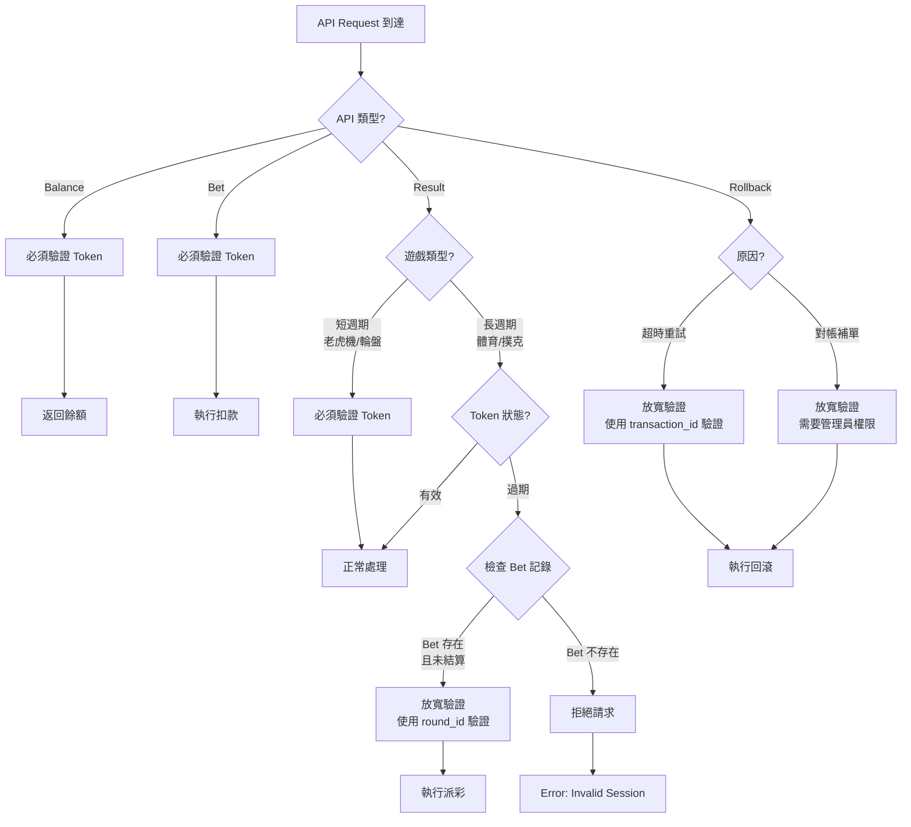

# Token 驗證邏輯決策樹

## 問題來源
文檔在第 2.2.2 節「Bet 請求處理邏輯」中混淆了不同 API 的 Token 驗證策略。

## 業務場景分析

### 場景 1: 短生命週期遊戲（老虎機、輪盤）
```
遊戲特徵:
- 回合時間: 數秒到數分鐘
- Token 有效期: 通常 15-30 分鐘
- 風險: Token 在遊戲過程中過期的機率極低

結論: 所有 API 都應該驗證 Token
```

### 場景 2: 長生命週期遊戲（體育賽事、撲克錦標賽）
```
遊戲特徵:
- 回合時間: 數小時到數天
- Token 有效期: 15-30 分鐘
- 風險: Token 必然會在遊戲過程中過期

結論: Result API 需要特殊處理
```

## 決策樹



## 推薦方案

### API Token 驗證矩陣

| API 類型 | 預設策略 | 特殊情況處理 | 驗證欄位 |
|---------|---------|------------|---------|
| **Balance** | ✅ 嚴格驗證 | 無例外 | `token` |
| **Bet** | ✅ 嚴格驗證 | 無例外 | `token` + `user_id` |
| **Result** | ⚠️ 條件驗證 | Token 過期時檢查 `round_id` | `token` OR `round_id` + `bet_tx_id` |
| **Rollback** | ⚠️ 條件驗證 | 對帳場景允許管理員 Token | `token` OR `admin_token` |

### 實現邏輯

```java
public class TokenVerificationService {

    /**
     * Bet 請求的 Token 驗證（嚴格模式）
     */
    public TokenValidationResult validateBetToken(String token, Long userId) {
        // 步驟 1: 解析 Token
        TokenClaims claims = jwtService.parseToken(token);

        // 步驟 2: 檢查過期
        if (claims.isExpired()) {
            return TokenValidationResult.failed("TOKEN_EXPIRED");
        }

        // 步驟 3: 檢查用戶匹配
        if (!claims.getUserId().equals(userId)) {
            return TokenValidationResult.failed("USER_MISMATCH");
        }

        // 步驟 4: 檢查黑名單（Redis）
        if (redisService.isTokenBlacklisted(token)) {
            return TokenValidationResult.failed("TOKEN_REVOKED");
        }

        return TokenValidationResult.success(claims);
    }

    /**
     * Result 請求的 Token 驗證（寬鬆模式）
     */
    public TokenValidationResult validateResultToken(
        String token,
        String roundId,
        String betTransactionId,
        GameType gameType
    ) {
        // 短週期遊戲：嚴格驗證
        if (gameType.isShortLived()) {
            return validateBetToken(token, extractUserId(token));
        }

        // 長週期遊戲：嘗試驗證 Token
        TokenClaims claims = jwtService.parseToken(token);

        if (!claims.isExpired()) {
            // Token 仍然有效 → 正常驗證
            return validateBetToken(token, claims.getUserId());
        }

        // Token 已過期 → 使用備用驗證
        log.warn("Token expired for Result API, fallback to round verification");

        // 步驟 1: 檢查 Bet 記錄是否存在
        BetTransaction betTx = transactionRepository
            .findByTransactionId(betTransactionId)
            .orElse(null);

        if (betTx == null) {
            return TokenValidationResult.failed("BET_NOT_FOUND");
        }

        // 步驟 2: 驗證 round_id 匹配
        if (!betTx.getRoundId().equals(roundId)) {
            return TokenValidationResult.failed("ROUND_MISMATCH");
        }

        // 步驟 3: 檢查 Bet 狀態（必須是未結算）
        if (betTx.getStatus() != TransactionStatus.UNSETTLED) {
            return TokenValidationResult.failed("BET_ALREADY_SETTLED");
        }

        // 步驟 4: 重建用戶上下文
        return TokenValidationResult.successWithContext(
            betTx.getUserId(),
            betTx.getCurrency(),
            "FALLBACK_VERIFICATION"
        );
    }
}
```

## 安全性分析

### 嚴格驗證的必要性（Bet API）

**攻擊場景 1: Token 重放攻擊**
```
攻擊者獲取合法用戶的 Token（例如通過中間人攻擊）

T0: 用戶正常登入，獲得 Token (token_abc123)
T1: 攻擊者攔截 Token
T2: 攻擊者使用 Token 發起 Bet 請求
    - 如果不驗證 Token 過期 → 攻擊成功
    - 如果驗證 Token 過期 → 攻擊被阻止

結論: Bet API 必須嚴格驗證 Token 有效期
```

**攻擊場景 2: 會話固定攻擊**
```
攻擊者誘導用戶使用攻擊者控制的 Token

T0: 攻擊者生成 Token (token_evil)
T1: 誘導用戶使用此 Token 登入
T2: 攻擊者使用相同 Token 進行操作
    - 如果不驗證 Token 所有者 → 攻擊成功
    - 如果驗證 user_id 匹配 → 攻擊被阻止

結論: 必須驗證 Token 中的 user_id 與請求中的 user_id 一致
```

### 寬鬆驗證的合理性（Result API）

**合理場景: 體育賽事延遲結算**
```
正常流程:
T0 (週一 10:00): 玩家投注足球賽事，Token 有效期 30 分鐘
T1 (週一 10:01): Bet 成功，創建注單
T2 (週一 10:30): Token 過期
T3 (週三 22:00): 比賽結束，GP 發送 Result 請求

問題: Token 已經過期 60 小時

選項 A（嚴格驗證）:
→ 拒絕 Result 請求
→ 玩家贏錢無法入帳
→ 需要人工介入
→ 用戶體驗極差

選項 B（寬鬆驗證）:
→ 使用 round_id + bet_tx_id 驗證
→ 確認 Bet 存在且未結算
→ 自動完成派彩
→ ✅ 推薦方案
```

## 實現建議

### 配置管理

```yaml
# application.yml
token:
  verification:
    # 預設策略
    default_mode: STRICT

    # 各 API 的策略
    api_modes:
      balance: STRICT
      bet: STRICT
      result: CONDITIONAL
      rollback: CONDITIONAL

    # 長週期遊戲配置
    long_lived_games:
      - SPORTS_BETTING
      - POKER_TOURNAMENT
      - LIVE_DEALER_MULTI_TABLE

    # Result API 的 Token 過期容忍度
    result:
      allow_expired_token: true
      fallback_verification:
        - round_id
        - bet_transaction_id
      max_age_hours: 168  # 7 天（體育賽事最長結算時間）
```

### 監控指標

```java
// 需要監控的指標
metrics:
  - token_validation_failures_total{api_type, reason}
  - token_expired_fallback_success{game_type}
  - suspicious_token_patterns{user_id, ip_address}
```

## 決策總結

✅ **推薦決策**:

1. **Bet API**: 必須嚴格驗證 Token（無例外）
   - 原因: 涉及資金扣款，安全優先級最高

2. **Result API**: 條件驗證（根據遊戲類型）
   - 短週期遊戲: 嚴格驗證
   - 長週期遊戲: Token 過期時使用 round_id 備用驗證

3. **Balance API**: 嚴格驗證 Token
   - 原因: 防止未授權的餘額查詢

4. **Rollback API**: 條件驗證（根據原因）
   - 超時重試: 使用 transaction_id 驗證
   - 對帳補單: 需要管理員 Token

## 需要確認的需求

- [ ] Token 的有效期應該設置為多長？（建議: 15-30 分鐘）
- [ ] 是否需要支持 Token 刷新機制？
- [ ] Result API 的最大容忍過期時間？（建議: 7 天）
- [ ] 是否需要在 Token 中包含遊戲類型信息？
- [ ] Rollback API 是否需要支持管理員手動補單？
