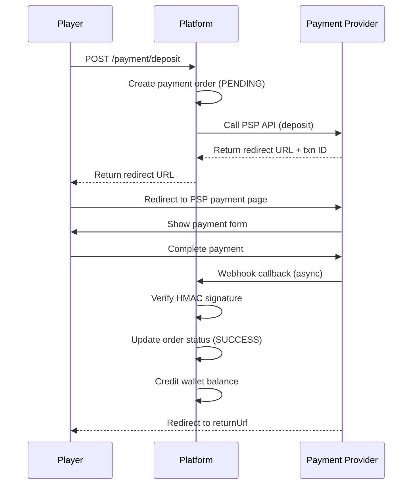
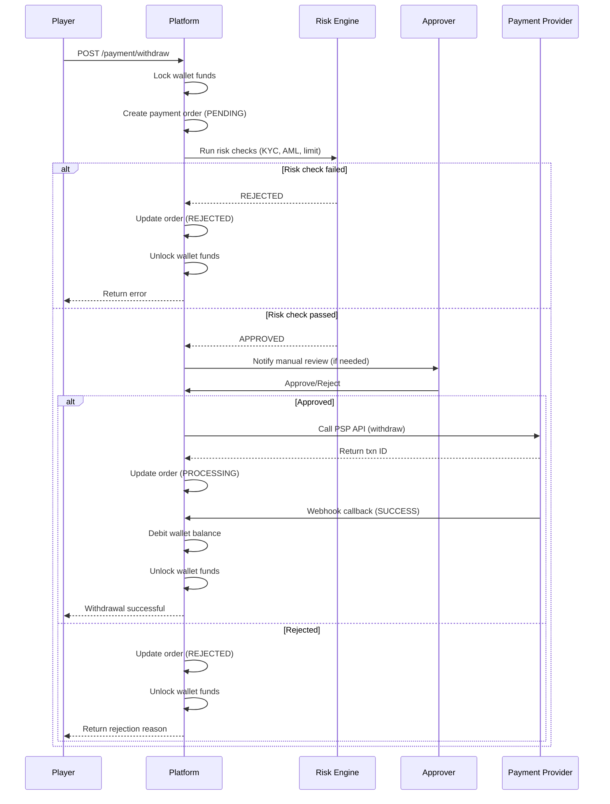
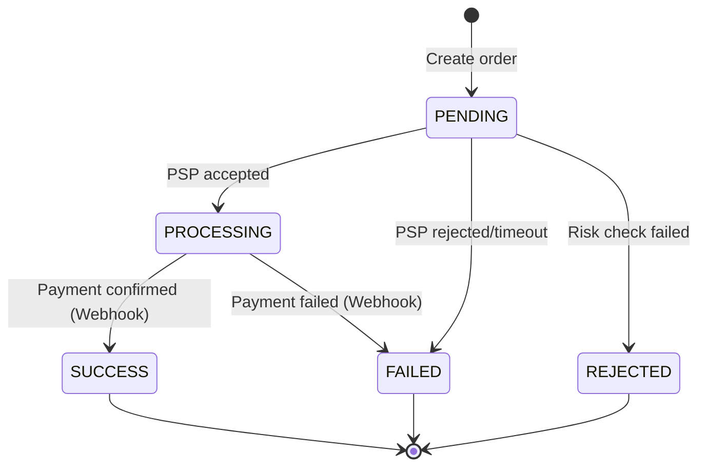

# 支付 API 文檔

**版本**: v4.1.0
**基礎路徑**: `/igaming/payment`
**認證**: 需要 Access Token (Header: `Authorization`)

---

## 1. 存款（Deposit）

**端點**: `POST /igaming/payment/deposit`
**描述**: 發起存款請求，返回支付廠商重定向 URL

### 請求體 (DepositForm)
```json
{
  "walletId": 100001,
  "amount": "500.00",
  "pspCode": "mock",
  "paymentMethod": "bank_card",
  "returnUrl": "https://example.com/deposit/return",
  "callbackUrl": "https://example.com/api/payment/callback"
}
```

### 參數說明
| 字段 | 類型 | 必填 | 說明 |
|------|------|------|------|
| walletId | Long | ✅ | 錢包 ID |
| amount | BigDecimal | ✅ | 存款金額（必須 > 0）|
| pspCode | String | ✅ | 支付廠商代碼（mock, stripe, paypal）|
| paymentMethod | String | ✅ | 支付方式（bank_card, e_wallet, crypto）|
| returnUrl | String | ✅ | 支付完成後返回 URL |
| callbackUrl | String | ✅ | 異步回調 URL（Webhook）|

### 響應
```json
{
  "code": 0,
  "msg": "success",
  "data": {
    "paymentOrderId": 800001,
    "orderNo": "PAY_20260311_1234567890",
    "walletId": 100001,
    "amount": "500.00",
    "currency": "CNY",
    "pspCode": "mock",
    "pspTransactionId": "mock_txn_abc123",
    "redirectUrl": "https://mock-psp.example.com/pay?token=xyz789",
    "status": "PENDING",
    "createTime": "2026-03-11T12:00:00"
  }
}
```

### 業務流程


---

## 2. 提款（Withdraw）

**端點**: `POST /igaming/payment/withdraw`
**描述**: 發起提款請求（需審核）

### 請求體 (WithdrawForm)
```json
{
  "walletId": 100001,
  "amount": "300.00",
  "pspCode": "mock",
  "withdrawMethod": "bank_transfer",
  "bankAccountNo": "6222021234567890",
  "bankAccountName": "張三"
}
```

### 參數說明
| 字段 | 類型 | 必填 | 說明 |
|------|------|------|------|
| walletId | Long | ✅ | 錢包 ID |
| amount | BigDecimal | ✅ | 提款金額（必須 > 0）|
| pspCode | String | ✅ | 支付廠商代碼 |
| withdrawMethod | String | ✅ | 提款方式（bank_transfer, e_wallet）|
| bankAccountNo | String | ✅ | 銀行帳號（提款方式為 bank_transfer 時）|
| bankAccountName | String | ✅ | 帳戶名稱 |

### 響應
```json
{
  "code": 0,
  "msg": "success",
  "data": {
    "paymentOrderId": 800002,
    "orderNo": "WITH_20260311_9876543210",
    "walletId": 100001,
    "amount": "300.00",
    "currency": "CNY",
    "pspCode": "mock",
    "status": "PENDING",
    "lockId": 700002,
    "createTime": "2026-03-11T13:00:00"
  }
}
```

### 業務流程


---

## 3. 查詢訂單詳情

**端點**: `GET /igaming/payment/get/{paymentOrderId}`
**描述**: 根據訂單 ID 查詢支付訂單詳情

### 路徑參數
| 參數 | 類型 | 說明 |
|------|------|------|
| paymentOrderId | Long | 支付訂單 ID |

### 響應
```json
{
  "code": 0,
  "msg": "success",
  "data": {
    "paymentOrderId": 800001,
    "orderNo": "PAY_20260311_1234567890",
    "walletId": 100001,
    "playerId": 10001,
    "orderType": "DEPOSIT",
    "amount": "500.00",
    "currency": "CNY",
    "pspCode": "mock",
    "pspTransactionId": "mock_txn_abc123",
    "paymentMethod": "bank_card",
    "status": "SUCCESS",
    "redirectUrl": "https://mock-psp.example.com/pay?token=xyz789",
    "returnUrl": "https://example.com/deposit/return",
    "callbackUrl": "https://example.com/api/payment/callback",
    "lockId": null,
    "createTime": "2026-03-11T12:00:00",
    "updateTime": "2026-03-11T12:05:00",
    "completedTime": "2026-03-11T12:05:00"
  }
}
```

---

## 4. 分頁查詢訂單

**端點**: `POST /igaming/payment/query`
**描述**: 根據條件分頁查詢支付訂單列表

### 請求體 (PaymentOrderQueryForm)
```json
{
  "walletId": 100001,
  "orderType": "DEPOSIT",
  "status": "SUCCESS",
  "startTime": "2026-03-11T00:00:00",
  "endTime": "2026-03-11T23:59:59",
  "pageNum": 1,
  "pageSize": 20,
  "searchCount": true
}
```

### 參數說明
| 字段 | 類型 | 必填 | 說明 |
|------|------|------|------|
| walletId | Long | ❌ | 錢包 ID（篩選條件）|
| orderType | String | ❌ | 訂單類型（DEPOSIT, WITHDRAW）|
| status | String | ❌ | 訂單狀態（PENDING, SUCCESS, FAILED, REJECTED）|
| startTime | LocalDateTime | ❌ | 開始時間 |
| endTime | LocalDateTime | ❌ | 結束時間 |
| pageNum | Integer | ✅ | 頁碼 |
| pageSize | Integer | ✅ | 每頁數量 |

### 響應
```json
{
  "code": 0,
  "msg": "success",
  "data": {
    "total": 50,
    "list": [
      {
        "paymentOrderId": 800001,
        "orderNo": "PAY_20260311_1234567890",
        "walletId": 100001,
        "orderType": "DEPOSIT",
        "amount": "500.00",
        "pspCode": "mock",
        "status": "SUCCESS",
        "createTime": "2026-03-11T12:00:00",
        "completedTime": "2026-03-11T12:05:00"
      }
    ],
    "pageNum": 1,
    "pageSize": 20
  }
}
```

---

## 5. Webhook 回調（PSP → Platform）

**端點**: `POST /igaming/payment/callback/{pspCode}`
**描述**: 支付廠商異步通知支付結果（僅供 PSP 調用）

### 路徑參數
| 參數 | 類型 | 說明 |
|------|------|------|
| pspCode | String | 支付廠商代碼（mock, stripe, paypal）|

### 請求頭
| Header | 說明 | 示例 |
|--------|------|------|
| X-Signature | HMAC-SHA256 簽名 | `abc123def456...` |
| X-Timestamp | 請求時間戳（毫秒）| `1710131234567` |

### 請求體 (PSP 廠商格式，以 Mock PSP 為例)
```json
{
  "orderNo": "PAY_20260311_1234567890",
  "pspTransactionId": "mock_txn_abc123",
  "status": "success",
  "amount": "500.00",
  "currency": "CNY",
  "timestamp": 1710131234567
}
```

### 響應（返回給 PSP）
```json
{
  "code": 0,
  "msg": "success",
  "data": "Callback processed successfully"
}
```

### 安全驗證流程
```java
// 1. 提取簽名和時間戳
String signature = request.getHeader("X-Signature");
long timestamp = Long.parseLong(request.getHeader("X-Timestamp"));

// 2. 驗證時間戳（5 分鐘容忍度）
long now = System.currentTimeMillis();
if (Math.abs(now - timestamp) > 300000) {
    return ResponseDTO.userErrorParam("Timestamp expired");
}

// 3. 驗證 HMAC-SHA256 簽名
String payload = request.getBody();
String secret = pspSecretService.getSecret(pspCode);
String computedSignature = HmacUtils.hmacSha256Hex(secret, payload);

// 4. 常數時間比較（防止時序攻擊）
boolean valid = MessageDigest.isEqual(
    computedSignature.getBytes(),
    signature.getBytes()
);

if (!valid) {
    return ResponseDTO.userErrorParam("Invalid signature");
}
```

### 冪等性保證
相同的 `orderNo` 重複回調將返回已處理的結果，不會重複更新訂單狀態或錢包餘額。

---

## 支付廠商適配器

目前支持的支付廠商：

| PSP Code | 廠商名稱 | 支持方式 | 狀態 |
|----------|---------|---------|------|
| `mock` | Mock PSP（測試用）| 存款、提款 | ✅ 已實現 |
| `stripe` | Stripe | 存款、提款 | ⏳ 計劃中 (Phase 1.5) |
| `paypal` | PayPal | 存款、提款 | ⏳ 計劃中 (Phase 1.5) |

### Mock PSP 測試規則
- **金額 ending `.01`**: 返回失敗（模擬支付失敗）
- **金額 ending `.02`**: 返回超時（模擬網絡超時）
- **其他金額**: 返回成功

**測試示例**：
```json
// 成功案例
{ "amount": "100.00" } → SUCCESS

// 失敗案例
{ "amount": "100.01" } → FAILED

// 超時案例
{ "amount": "100.02" } → TIMEOUT
```

---

## 訂單狀態機



### 狀態說明
| 狀態 | 說明 | 是否最終狀態 |
|------|------|-------------|
| PENDING | 訂單已創建，等待處理 | ❌ |
| PROCESSING | PSP 已接受，處理中 | ❌ |
| SUCCESS | 支付成功，已完成 | ✅ |
| FAILED | 支付失敗（PSP 拒絕或超時）| ✅ |
| REJECTED | 風控拒絕（KYC/AML 檢查失敗）| ✅ |

---

## 錯誤碼參考

| 錯誤碼 | 錯誤訊息 | 說明 |
|-------|---------|------|
| 40001 | Payment order not found | 支付訂單不存在 |
| 40002 | PSP not supported | 不支持的支付廠商 |
| 40003 | Invalid payment method | 無效的支付方式 |
| 40004 | Amount below minimum | 金額低於最小限額 |
| 40005 | Amount above maximum | 金額超過最大限額 |
| 40006 | Insufficient balance for withdrawal | 提款餘額不足 |
| 40007 | Withdrawal blocked by risk check | 提款被風控阻止 |
| 40008 | PSP API error | 支付廠商 API 錯誤 |
| 40009 | Invalid signature | Webhook 簽名驗證失敗 |
| 40010 | Timestamp expired | Webhook 時間戳過期 |
| 40011 | Duplicate callback | 重複的回調請求 |
| 40012 | Order already processed | 訂單已處理（冪等性檢查）|

---

## 安全機制

### 1. Webhook 四層防護
- **Layer 1**: HMAC-SHA256 簽名驗證
- **Layer 2**: 時間戳驗證（5 分鐘容忍度）
- **Layer 3**: 常數時間比較（防止時序攻擊）
- **Layer 4**: 冪等性檢查（狀態驗證）

### 2. 風控檢查（提款）
- **KYC 驗證**: 身份證明文件驗證
- **AML 檢查**: 反洗錢規則（單筆限額、每日限額）
- **風險評分**: 多維度風險評估（IP、設備指紋、行為模式）
- **人工審核**: 高風險提款需人工審批

### 3. 金額限制
| 類型 | 最小金額 | 最大金額 | 每日限額 |
|------|---------|---------|---------|
| 存款 | 10 CNY | 50,000 CNY | 無限制 |
| 提款 | 100 CNY | 50,000 CNY | 100,000 CNY |

---

## 對帳系統

### 自動對帳流程
1. **實時交易驗證**: 每筆交易完成時驗證金額一致性
2. **定期輪詢遺失結算**: 每 10 分鐘查詢未完成訂單，向 PSP 查詢實際狀態
3. **每日批次對帳**: 每日凌晨 2:00 執行，按 PSP 和日期聚合統計

**對帳記錄示例**：
```json
{
  "reconciliationId": 900001,
  "pspCode": "mock",
  "reconciliationDate": "2026-03-11",
  "totalOrders": 1000,
  "matchedCount": 998,
  "mismatchCount": 1,
  "missingCount": 1,
  "platformAmount": "500000.00",
  "pspAmount": "499950.00",
  "variance": "-50.00",
  "status": "MISMATCH"
}
```

---

## 測試數據

**測試 Access Token**:
```
7e775f88a6fd47be91f8854a43ff4eac
```

**測試請求示例**（使用 curl）：
```bash
# 發起存款（100 元，成功案例）
curl -X POST "http://localhost:1024/igaming/payment/deposit" \
  -H "Authorization: 7e775f88a6fd47be91f8854a43ff4eac" \
  -H "Content-Type: application/json" \
  -d '{
    "walletId": 1,
    "amount": "100.00",
    "pspCode": "mock",
    "paymentMethod": "bank_card",
    "returnUrl": "https://example.com/return",
    "callbackUrl": "https://example.com/callback"
  }'

# 發起提款（50 元）
curl -X POST "http://localhost:1024/igaming/payment/withdraw" \
  -H "Authorization: 7e775f88a6fd47be91f8854a43ff4eac" \
  -H "Content-Type: application/json" \
  -d '{
    "walletId": 1,
    "amount": "50.00",
    "pspCode": "mock",
    "withdrawMethod": "bank_transfer",
    "bankAccountNo": "6222021234567890",
    "bankAccountName": "測試用戶"
  }'

# 查詢訂單詳情
curl -X GET "http://localhost:1024/igaming/payment/get/800001" \
  -H "Authorization: 7e775f88a6fd47be91f8854a43ff4eac"
```

---

## 性能指標

**支付模塊性能目標**:
- **存款響應時間**: P95 < 200ms（含 PSP API 調用）
- **提款審核時間**: 人工審核 < 30 分鐘，自動審核 < 5 分鐘
- **Webhook 處理時間**: P95 < 50ms
- **訂單查詢時間**: P95 < 30ms
- **對帳準確率**: 99.9%（偏差 < 0.1%）

---

**文檔版本**: v1.0.0
**最後更新**: 2026-03-11
**維護者**: iGaming Team
