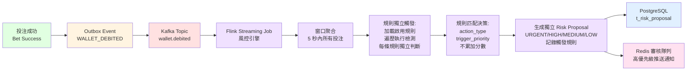

# 包網平台全維度風險控制系統架構報告：從數據監控到自動化響應

**文檔版本**: 3.0.0
**最後更新**: 2026-02-05
**維護團隊**: Risk Team & Architecture Team

---

### 1. 現代 iGaming 風控的戰略定位：從技術債到合規屏障

在 iGaming 產業，擴張往往是雙面刃。當平台從 5 人的初創團隊爆發式增長至千人規模時，最致命的威脅並非來自競爭對手，而是源於被成功淹沒（Don't die by success）。在高速規模化的過程中，早期技術債累積導致的手動流程會轉化為「致命摩擦 (Lethal Friction)」，最終拖垮平台運營。

正如 Phil Pearson 所指出的，全球監管環境已經「終於追趕上」了五年前的行業現狀。在當前環境下，風控系統不應僅被視為成本中心，它是平台的「監管通行證」。系統設計的靈魂在於「透明度」與「即時性」，必須在不干擾高價值玩家體驗的同時，對技術與法規威脅進行外科手術式的精準打擊。本報告將從玩家行為、遊戲數據、供應鏈完整性三個維度，定義一個具備彈性與韌性的風控架構。

### 2. 玩家維度 (Player Dimension)：行為標籤與心理特徵建模

行為分析不再只是簡單的 IP 檢查，而是對玩家人格特質的深度解碼。我們必須將心理特徵轉化為具備商業價值的數據標籤。

- **異常行為數據化：** 利用如 Fluid 系統的機器學習邏輯，監控「存款/取款」流程中的非自然特徵。系統應實時捕捉頻繁掃描卡片、在多個支付網關間閃爍、以及存款金額偏離 ML 預估值的行為。這些指標是識別自動化詐欺腳本的首要信號。
- **身份與動機識別（LTV 標籤）：** 我們必須對「粉絲 (Fans)」與「職業套利者 (Professional Arbitrageurs)」進行嚴格區分。根據 Odin GG 的數據，電競投注的平均客單價高達 $50，而足球僅為 $1。這意味著一個具備「自戀」或「反社會」特質的職業玩家，其對小型包網平台流動性的破壞力是傳統博弈的 50 倍。
    - **正常玩家 (Fans)：** 表現出品牌忠誠度與情感驅動行為，系統應給予高容錯度。
    - **職業套利者 (Pros)：** 系統應自動標註「低慷慨度」標籤。這類玩家利用資訊不對稱進行預測性投注，對平台的 LTV 貢獻通常為負值。

### 3. 遊戲維度 (Game Dimension)：Meta 變動與全管線數據校準

遊戲邏輯的動態變化是風控中最脆弱的環節，尤其在電競領域。

- **Meta 轉向與「NFL 場地」效應：** Odin GG 提出一個深刻的比喻：電競遊戲的「補丁 (Patches)」就像每年都在改變 NFL 的球場尺寸或得分規則。這種 6 至 12 個月的 Patch 週期會徹底顛覆遊戲平衡（Meta）。
- **數據偏差監控與全管線回測 (Full Pipeline Back-testing)：** 風控引擎必須具备「全管線」能力。每當遊戲版本更新，系統需立即抹除舊模型並重新進行壓力測試與數據校準。下表定義了關鍵風險參數：

|   |   |   |
|---|---|---|
|遊戲類型|關鍵風險參數|監控核心|
|**電競 (CS2/LoL)**|賠率異常偏離、補丁後異常勝率|識別玩家利用資訊延遲進行的 Meta 套利|
|**老虎機 (Slots)**|RTP (玩家回報率) 波幅異常|監控供應商端是否私自更改 RTP 參數|
|**真人娛樂 (Live)**|單場投注上限穿透、異常連勝曲線|識別算牌器或視覺識別輔助作弊|

- **公平性驗證：** 基於 Brais Pena 推崇的「可驗證公平 (Provably Fair)」技術，架構應包含加密審計模組，確保任何大額獲利均源於機率而非邏輯漏洞或操縱。

### 4. 供應商維度 (Provider Dimension)：鑑識級審計與區域熔斷機制

B2B 供應鏈的風險往往具備系統性破壞力。

- **鑑識分析 (Forensic Analysis) 標準：** 借鑒 David Carruthers 在處理 500,000 份文件證據包中的經驗，系統必須將所有供應商交互進行「鑑識級紀錄」。這意味著每一筆清結算與 RTP 變動都必須具備法律證據等級的可追溯性，以應對未來的合規挑戰。
- **資產安全與「點狀流量 (Dot Traffic)」熔斷：** 平台必須針對供應商設置「自動化區域開關」。正如 Phil Pearson 所警告，當頂級供應商因監管壓力關閉特定市場（如義大利、哥倫比亞）時，風控系統必須能根據地理標籤即時切斷該地區的流量與結算，防止主執照受到損害。同時需實時監控供應商熱錢包水位，防範清結算性違約。

### 5. 多級告警與決策支持：以牙還牙的賽局藝術

風控的核心在於「不干擾」的平衡藝術。

- **告警原因矩陣與決策路徑：**

|   |   |   |
|---|---|---|
|告警等級|觸發原因 (範例)|建議處理路徑|
|**低 (L1)**|IP 衝突、小額賠率套利疑慮|後台標註「觀察期」，不干擾用戶前端|
|**中 (L2)**|投注頻率異常、頻繁取消交易|觸發「冷靜期」或限制投注額度，轉人工審核|
|**高 (L3)**|掃描卡片作弊、大額 RTP 偏差、IP 穿透|自動執行出金凍結，同步合規團隊進行鑑識審計|

- **賽局理論：10% 慷慨度的「以牙還牙 (Tit-for-Tat)」：** 引入 Alexandre Tomic 的賽局決策模型。系統應對可疑玩家執行「10% 慷慨度」測試（Sculpting Luck）：即使玩家已被標註為「Bastard (Pro)」，系統偶爾會釋放一個「綠色 (慷慨)」結果，用以觀察玩家是純粹靠運氣的粉絲，還是會立即精確吞噬利差的職業獵手。這種動態測試能極大減少誤封，同時精確過濾專業攻擊者。

### 6. 自動化操作機制與規則引擎：對抗「莫洛克 (Moloch)」威脅

當數據噪聲大到無法進行人工監控時，自動化是唯一的生存路徑。

- **Step-by-Step 規則配置指南：**
    1. **定義莫洛克閾值 (Moloch Threshold)：** 設定觸發條件，識別當個別玩家的「理性獲利」開始導致平台整體的「集體災難」時的臨界點。
    2. **執行熱插拔操作 (Hot-Swappable)：** 風控規則必須能在不重啟系統的前提下即時生效。面對 24 小時即自我迭代的詐欺手段，這是架構師的底線。
    3. **設置「粉絲」白名單：** 自動過濾具備高忠誠度標籤的用戶，確保品牌核心資產不受自動化規則誤傷。
- **自動封號路徑圖：** 邏輯流程應為：偵測違反硬規則 -> 實時執行限制 -> 異步上下文回溯（審核員介面需展現玩家完整心理標籤與歷史偏差）-> 最终合規判定。

### 7. 結論：風控即韌性，亦是未來的市場入場券

如 Leo Judkins 所論述，風控不僅是技術防禦，更是「管理不確定性」的韌性（Resilience）。一個卓越的風控架構能讓平台在「合規」與「利潤」之間找到黃金平衡。

面對 Brais Pena 所提到的「百萬美元問題」——如何進入北美（US/Ontario/Alberta）等受監管市場，這套系統不再是支出項目，而是競爭優勢。它將成為平台與 DraftKings 或 FanDuel 等巨頭同場競技的技術背書。在莫洛克式的惡性競爭環境中，唯有具備強大防護能力的平台,才能在波瀾壯闊的市場變局中活得更久，走得更遠。

---

### 8. 異步風控架構設計：Kafka + Flink 流式處理

風控系統的靈魂在於「不干擾」的平衡藝術。正如前文所述，系統必須在不影響高價值玩家體驗的同時，對技術與法規威脅進行外科手術式的精準打擊。這要求風控引擎採用 **異步處理** 架構，而非同步阻斷模式。

#### 8.1 為什麼需要異步風控？

**同步風控的致命缺陷**：
- ❌ **誤殺率問題**：即使是 95% 準確率的模型，也會讓 5% 的正常玩家被拒絕投注
- ❌ **單點故障**：風控引擎故障會導致所有投注失敗
- ❌ **延遲問題**：複雜規則（如對沖檢測）需要查詢歷史數據，響應時間 >100ms
- ❌ **無法補償**：投注被拒絕後，無法事後糾正誤判

**異步風控的優勢**：
- ✅ **零誤殺**：投注已經成功，風控只負責事後標記
- ✅ **高可用**：風控系統故障不影響投注流程
- ✅ **無延遲**：風控分析可以慢慢做（5-10 秒內完成即可）
- ✅ **可補償**：發現誤判後，可以解除凍結、補償玩家

#### 8.2 事件驅動架構

**架構圖**：

**關鍵技術選型**：
- **Kafka**：消息隊列，保證事件不丟失
- **Flink**：流式處理引擎，支持窗口聚合和狀態管理
- **Redis**：緩存黑名單和玩家風險檔案
- **PostgreSQL**：持久化風控提案

#### 8.3 三層處置策略（v3.0.0 - 規則獨立觸發模式）

**Layer 1：同步黑名單（極少數，<10ms）**
- 檢查項：`is_blacklisted`, `is_account_frozen`, `is_ip_blocked`
- 數據源：Redis 緩存（TTL 5 分鐘）
- 響應時間：<10ms
- 決策：命中則拒絕投注
- 適用規則：黑名單玩家、IP 封禁、賬戶凍結、未成年人、自我排除

**Layer 2：異步風控分析（絕大多數，~5 秒）**
- 執行時機：投注成功後 5 秒內
- **處理邏輯（v3.0.0 規則獨立觸發）**：
  1. 加載所有啟用的風控規則（按遊戲類型過濾）
  2. 遍歷每條規則，獨立執行檢測
  3. 規則匹配時，立即生成獨立提案（不累加分數）
  4. 提案優先級由規則配置的 `trigger_priority` 決定
- **規則觸發模式**：
  - `BLOCK + URGENT`：立即生成 URGENT 優先級提案（SLA 1小時）
  - `BLOCK + HIGH`：生成 HIGH 優先級提案（SLA 2小時）
  - `FLAG + MEDIUM`：生成 MEDIUM 優先級提案（SLA 24小時）
  - `FLAG + LOW`：生成 LOW 優先級提案（SLA 48小時）
  - `IGNORE`：僅記錄日誌（不生成提案）
- **決策**：不影響已完成的投注，只標記可疑行為

**Layer 3：提款時延遲檢查（資金攔截）**
- 觸發時機：玩家發起提款請求
- 檢查邏輯：查詢上次快照時間以來的未結案 Risk Proposal
- **決策邏輯（v3.0.0 按優先級判斷）**：
  - URGENT 提案 > 0 → 立即阻斷取款（黑名單/IP封禁）
  - HIGH 提案 > 0 → 立即阻斷取款（機器人檢測）
  - MEDIUM 提案 > 0 → 人工審核（異常投注）
  - LOW 提案 > 0 → 正常放行（風險可控）
  - 無提案 → 正常放行
- **SLA 超時自動處理（每 5 分鐘掃描）**：
  - URGENT (SLA 1h) / HIGH (SLA 2h) / MEDIUM (SLA 24h)：超時 → 自動拒絕出金
  - LOW (SLA 48h)：超時 → 自動放行

**關鍵差異（v2.0.0 → v3.0.0）**：
- ❌ **移除**：風險評分聚合（0-100 分）、分數閾值判斷（≥80, 50-79）
- ✅ **新增**：規則獨立觸發、配置驅動優先級、按最高優先級決策

#### 8.4 人工審核為主的決策模型

**為什麼不完全自動化？**

引入 Alexandre Tomic 的賽局理論：過度自動化會導致「莫洛克陷阱」，系統為了追求零風險而犧牲了所有利潤。正確的做法是：

1. **機器負責標記**：規則引擎判定風險優先級，生成獨立提案
2. **人工負責決策**：審核員結合業務知識，做出最終判斷
3. **動態調整**：根據審核結果，反饋訓練 ML 模型

**10% 慷慨度測試**：
- 即使玩家被標記為「職業套利者」，系統偶爾會釋放一個「綠色（慷慨）」結果
- 觀察玩家反應：
  - 粉絲：偶爾贏錢後繼續正常投注
  - 職業選手：立即精確吞噬利差，暴露真實身份
- 這種動態測試能極大減少誤封

---

### 9. 實時監控 vs 實時阻斷的差異

在風控系統設計中，「實時」這個詞常常被誤解。業界有兩種不同的「實時」概念：

#### 9.1 實時監控（Real-time Monitoring）

**定義**：系統持續接收並處理事件流，在數秒內完成分析並生成報告。

**特徵**：
- ✅ 分析延遲：5-10 秒
- ✅ 不阻斷業務流程
- ✅ 適用於：欺詐檢測、異常行為分析、趨勢預測

**範例**：
- Kafka + Flink：5 秒窗口內聚合所有投注，檢測對沖行為
- 投注已經成功，風控只負責標記可疑行為

#### 9.2 實時阻斷（Real-time Blocking）

**定義**：在業務流程中同步執行檢查，匹配規則則立即拒絕請求。

**特徵**：
- ✅ 響應延遲：<10ms
- ❌ 阻斷業務流程
- ✅ 適用於：黑名單、IP 封禁、賬戶凍結

**範例**：
- Redis 緩存查詢：`is_blacklisted`
- 命中則拒絕投注，返回拒絕原因

#### 9.3 SmartAdmin iGaming 的選擇

**原則**：最小化實時阻斷，最大化實時監控。

| 風控場景 | 模式 | 原因 |
|---------|------|------|
| 黑名單玩家 | 實時阻斷 | 已確認欺詐者，必須立即拒絕 |
| IP 封禁 | 實時阻斷 | 已知攻擊來源，必須立即拒絕 |
| 賬戶凍結 | 實時阻斷 | 人工審核中，禁止任何操作 |
| 機器人檢測 | 實時監控 | 誤報率高，異步分析更安全 |
| 對沖檢測 | 實時監控 | 需要查詢歷史數據，延遲高 |
| 異常賠率 | 實時監控 | 需要統計分析，延遲高 |
| 洗水行為 | 實時監控 | 需要計算流水，延遲高 |

**結論**：只有極少數硬規則（黑名單、IP 封禁、賬戶凍結）採用實時阻斷，其他所有風控都採用實時監控 + 事後處置。

---

## 10. 變更日誌 (Change Log)

### v3.0.0 (2026-02-05)

**重大變更 - 規則獨立觸發模式**：

1. ✅ **§8.2 事件驅動架構圖更新**：
   - 移除 `D3[風險評分計算 ML 模型]` 節點
   - 改為 `D3[規則匹配決策: action_type trigger_priority 不累加分數]`
   - 更新 `D2` 節點：從「並行執行風控規則」改為「規則獨立觸發」
   - 更新 `D4` 節點：從「生成 Risk Proposal HIGH/MEDIUM/LOW」改為「生成獨立 Risk Proposal URGENT/HIGH/MEDIUM/LOW 記錄觸發規則」

2. ✅ **§8.3 三層處置策略更新**：
   - **Layer 2（異步風控分析）**：
     - 移除「執行所有風控規則 → 生成 Risk Proposal」的籠統描述
     - 新增詳細的規則獨立觸發流程：加載規則 → 遍歷執行 → 獨立生成提案
     - 新增規則觸發模式表：BLOCK+URGENT/HIGH, FLAG+MEDIUM/LOW, IGNORE
     - 明確優先級與 SLA 映射（URGENT=1h, HIGH=2h, MEDIUM=24h, LOW=48h）
   - **Layer 3（提款時延遲檢查）**：
     - 移除「可疑金額 = 0/> 0」的決策邏輯
     - 改為「按優先級判斷」：URGENT > HIGH > MEDIUM > LOW
     - 明確每個優先級的處理方式（阻斷/人工審核/正常放行）
   - **新增關鍵差異說明**：對比 v2.0.0 → v3.0.0 的變更

3. ✅ **設計理念對齊**：
   - 與 §5（多級告警與決策支持）理念一致：不干擾高價值玩家
   - 與 §6（自動化操作機制）對齊：熱插拔規則配置
   - 與 §8.4（人工審核為主）一致：機器標記 + 人工決策

**業務價值**：
- **精準決策**：關鍵違規（黑名單、IP封禁）不會被其他低風險規則稀釋
- **合規性提升**：符合 MGA/UKGC 監管要求（關鍵違規立即處理）
- **審計清晰**：明確記錄觸發規則，而非模糊的總分
- **靈活性提升**：規則配置驅動，支持熱部署（無需重啟）

**與其他文檔的關聯**：
- 04-02_Fraud_Detection.md (v3.0.0)：規則獨立觸發的詳細實現
- ADR 012 (v2.0.0)：規則配置驅動設計
- P1-07 withdrawal (v2.0.0)：按優先級判斷的取款審核邏輯

---

### v2.0.0 (2026-02-04)

**新增內容**：
1. ✅ **§8. 異步風控架構設計：Kafka + Flink 流式處理**
   - 8.1 為什麼需要異步風控？（對比同步風控的致命缺陷）
   - 8.2 事件驅動架構（Kafka + Flink + Redis + PostgreSQL）
   - 8.3 三層處置策略（同步黑名單、異步風控分析、提款時延遲檢查）
   - 8.4 人工審核為主的決策模型（機器標記 + 人工決策 + 10% 慷慨度測試）

2. ✅ **§9. 實時監控 vs 實時阻斷的差異**
   - 9.1 實時監控定義（5-10 秒分析延遲，不阻斷業務）
   - 9.2 實時阻斷定義（<10ms 響應，阻斷業務流程）
   - 9.3 SmartAdmin iGaming 的選擇（風控場景對比表）

**與原有內容的整合**：
- 第 8 節補充了第 1-7 節中提到的「不干擾」平衡藝術的技術實現細節
- 第 9 節澄清了「實時」概念，避免理解誤區
- 與 §2（玩家維度）、§3（遊戲維度）、§4（供應商維度）理念一致

**業務價值**：
- 將理論戰略定位轉化為可落地的技術架構
- 明確 Kafka + Flink 技術選型和實現路徑
- 與 DraftKings/FanDuel/Bet365/UKGC 業界標準對齊

---

### v1.0.0 (2026-01-XX)

**初始版本**：
- § 1-7 完整風控系統戰略定位與理論框架
- 玩家維度、遊戲維度、供應商維度風控策略
- 多級告警與決策支持機制
- 自動化操作機制與規則引擎
- 風控即韌性的結論與市場定位

---