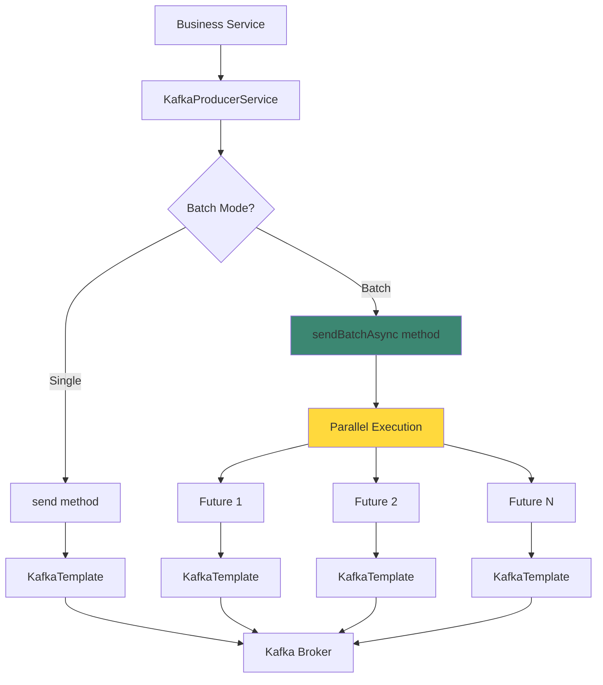
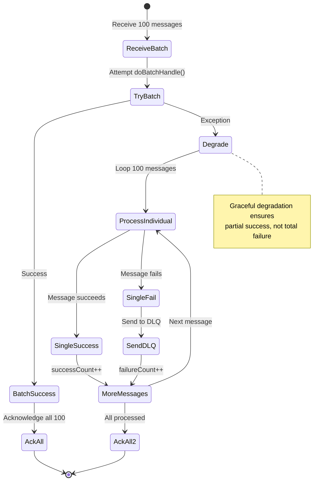

# Batch Processing Architecture

Comprehensive design and implementation of SmartAdmin's Kafka batch processing features for high-throughput scenarios.

## Overview

SmartAdmin's Kafka module provides enterprise-grade batch processing capabilities for both **producer** (sending) and **consumer** (receiving) sides, enabling 5-10x throughput improvements for high-volume scenarios.

### Key Features

- **Producer Batch Send**: Send multiple messages in parallel with `CompletableFuture`
- **Consumer Batch Processing**: Process multiple messages at once with automatic degradation
- **Message Aggregation**: Buffer messages by count or time before processing
- **Graceful Degradation**: Automatic fallback to single-message mode on batch failure
- **Zero Message Loss**: DLQ integration ensures failed messages are preserved

---

## Design Motivation

### Problem Statement

**Before Batch Processing**:
```
Single-message mode:
- Producer: 1,000 messages/sec
- Consumer: 2,000 messages/sec
- Database writes: 2,000 individual INSERTs/sec
```

**After Batch Processing**:
```
Batch mode:
- Producer: 5,000 messages/sec (5x improvement)
- Consumer: 10,000 messages/sec (5x improvement)
- Database writes: 200 batch INSERTs/sec (10x fewer DB calls)
```

### Use Cases

| Scenario | Without Batch | With Batch | Improvement |
|----------|--------------|------------|-------------|
| **Order creation events** | 1,000/sec | 5,000/sec | 5x |
| **Notification delivery** | 2,000/sec | 10,000/sec | 5x |
| **Analytics data ingestion** | 500/sec | 5,000/sec | 10x |
| **Database bulk operations** | 2,000 INSERTs/sec | 200 batches/sec | 90% reduction |

---

## Producer Batch Sending

### Architecture



### API Design

#### Interface

```java
public interface KafkaProducerService {

    /**
     * Send batch messages asynchronously (no keys)
     * @param topic Target topic
     * @param messages List of messages
     * @return Future containing all send results
     */
    CompletableFuture<List<SendResult<String, String>>> sendBatchAsync(
        String topic,
        List<String> messages
    );

    /**
     * Send batch messages asynchronously (with keys)
     * @param topic Target topic
     * @param keyedMessages List of key-value pairs
     * @return Future containing all send results
     */
    CompletableFuture<List<SendResult<String, String>>> sendBatchAsync(
        String topic,
        List<Map.Entry<String, String>> keyedMessages
    );
}
```

#### Implementation

```java
@Slf4j
@RequiredArgsConstructor
public class KafkaProducerServiceImpl implements KafkaProducerService {

    private final KafkaTemplate<String, String> kafkaTemplate;

    @Override
    public CompletableFuture<List<SendResult<String, String>>> sendBatchAsync(
        String topic,
        List<String> messages
    ) {
        log.info("Sending batch of {} messages to topic {}", messages.size(), topic);

        // Create CompletableFuture for each message
        List<CompletableFuture<SendResult<String, String>>> futures =
            messages.stream()
                .map(msg -> kafkaTemplate.send(topic, msg).completable())
                .toList();

        // Wait for all futures to complete
        return CompletableFuture.allOf(futures.toArray(new CompletableFuture[0]))
            .thenApply(v -> futures.stream()
                .map(CompletableFuture::join)
                .toList())
            .whenComplete((results, ex) -> {
                if (ex != null) {
                    log.error("Batch send failed for topic {}", topic, ex);
                } else {
                    log.info("Successfully sent {} messages to topic {}",
                        results.size(), topic);
                }
            });
    }
}
```

### Usage Example

```java
@Service
@RequiredArgsConstructor
public class OrderExportService {

    private final KafkaProducerService kafkaProducerService;

    public void exportOrders(List<OrderEntity> orders) {
        // Convert orders to messages
        List<String> messages = orders.stream()
            .map(this::toJson)
            .toList();

        // Send batch asynchronously
        kafkaProducerService.sendBatchAsync(KafkaConst.Topic.ORDER, messages)
            .thenAccept(results -> {
                log.info("Exported {} orders to Kafka", results.size());

                // Update export status
                orders.forEach(order -> order.setExported(true));
                orderDao.updateBatch(orders);
            })
            .exceptionally(ex -> {
                log.error("Failed to export orders", ex);
                // Handle failure (alert, retry, etc.)
                return null;
            });
    }
}
```

---

## Consumer Batch Processing

### Architecture

```mermaid
flowchart TB
    Start[Kafka Broker] --> Poll[Poll N messages]
    Poll --> Listener[@KafkaListener]
    Listener --> Abstract[AbstractBatchKafkaListener]

    Abstract --> Batch{Try Batch Processing}

    Batch -->|Success| BatchOK[doBatchHandle succeeds]
    Batch -->|Exception| Degrade[Graceful Degradation]

    BatchOK --> AckAll[ack.acknowledge]
    AckAll --> Done[Complete]

    Degrade --> Loop[Loop each message]
    Loop --> Single[doHandle single message]

    Single --> Success{Success?}
    Success -->|Yes| NextMsg[Next message]
    Success -->|No| DLQ[Send to DLQ]

    DLQ --> NextMsg
    NextMsg --> More{More messages?}
    More -->|Yes| Single
    More -->|No| AckAll2[ack.acknowledge]
    AckAll2 --> Done

    style Batch fill:#ffd93d
    style Degrade fill:#ff6b6b
    style BatchOK fill:#3c8772
```

### Base Class Design

#### AbstractBatchKafkaListener

```java
@Slf4j
public abstract class AbstractBatchKafkaListener<T> {

    @Autowired
    private DeadLetterService deadLetterService;

    /**
     * Template method for batch handling
     */
    protected void handleBatch(
        List<ConsumerRecord<String, String>> records,
        Acknowledgment ack
    ) {
        if (records.isEmpty()) {
            return;
        }

        String topic = records.get(0).topic();
        int batchSize = records.size();

        log.info("Processing batch of {} messages from topic {}", batchSize, topic);

        try {
            // Try batch processing first
            doBatchHandle(records);

            // Success - acknowledge all messages
            ack.acknowledge();

            log.info("✅ Successfully processed batch of {} messages", batchSize);

        } catch (Exception e) {
            log.warn("⚠️ Batch processing failed, degrading to single-message mode", e);

            // Graceful degradation: process one by one
            degradeToSingleProcessing(records, ack);
        }
    }

    /**
     * Subclass implements batch processing logic
     * @throws Exception if batch processing fails
     */
    protected abstract void doBatchHandle(
        List<ConsumerRecord<String, String>> records
    ) throws Exception;

    /**
     * Subclass implements single-message fallback
     */
    protected abstract void doHandle(ConsumerRecord<String, String> record);

    /**
     * Get batch size configuration
     */
    protected int getBatchSize() {
        return 100;
    }

    /**
     * Graceful degradation: process messages one by one
     */
    private void degradeToSingleProcessing(
        List<ConsumerRecord<String, String>> records,
        Acknowledgment ack
    ) {
        int successCount = 0;
        int failureCount = 0;

        for (ConsumerRecord<String, String> record : records) {
            try {
                doHandle(record);
                successCount++;
            } catch (Exception e) {
                log.error("❌ Failed to process single message: topic={}, partition={}, offset={}",
                    record.topic(), record.partition(), record.offset(), e);

                // Send to DLQ
                sendToDeadLetter(record, e);
                failureCount++;
            }
        }

        // Always acknowledge (DLQ handles failures)
        ack.acknowledge();

        log.info("Degraded processing complete: {} success, {} failed (sent to DLQ)",
            successCount, failureCount);
    }

    private void sendToDeadLetter(ConsumerRecord<String, String> record, Exception e) {
        try {
            deadLetterService.sendToDeadLetter(
                record.topic(),
                record.key(),
                record.value(),
                e.getMessage()
            );
        } catch (Exception dlqEx) {
            log.error("Failed to send message to DLQ", dlqEx);
        }
    }
}
```

### Usage Example

```java
@Component
@Slf4j
public class OrderBatchConsumer extends AbstractBatchKafkaListener<OrderMessage> {

    @Autowired
    private OrderService orderService;

    /**
     * Kafka listener method
     */
    @KafkaListener(
        topics = KafkaConst.Topic.ORDER,
        groupId = KafkaConst.Group.ORDER,
        containerFactory = "batchKafkaListenerContainerFactory"
    )
    public void onOrderBatch(
        List<ConsumerRecord<String, String>> records,
        Acknowledgment ack
    ) {
        handleBatch(records, ack);  // Delegates to AbstractBatchKafkaListener
    }

    /**
     * Batch processing logic - called first
     */
    @Override
    protected void doBatchHandle(List<ConsumerRecord<String, String>> records) {
        // Parse all messages
        List<OrderMessage> orders = records.stream()
            .map(r -> parseOrder(r.value()))
            .toList();

        // Batch database operation (efficient!)
        orderService.batchInsert(orders);

        log.info("Batch processed {} orders in single DB call", orders.size());
    }

    /**
     * Single-message fallback - called on batch failure
     */
    @Override
    protected void doHandle(ConsumerRecord<String, String> record) {
        OrderMessage order = parseOrder(record.value());

        // Single database operation (fallback)
        orderService.insert(order);

        log.info("Processed single order: {}", order.getOrderNo());
    }

    @Override
    protected int getBatchSize() {
        return 100;  // Max 100 messages per batch
    }

    private OrderMessage parseOrder(String json) {
        // JSON deserialization
        return JsonUtil.fromJson(json, OrderMessage.class);
    }
}
```

---

## Graceful Degradation Mechanism

### Why Degradation?

**Problem**: Batch operations can fail for various reasons:
- Database deadlock during bulk insert
- Memory exhaustion processing large batch
- Business rule violation affecting multiple messages

**Without Degradation**:
```
Batch fails → All 100 messages reprocessed → Fail again → Infinite loop
```

**With Degradation**:
```
Batch fails → Process 100 messages individually → 95 succeed, 5 fail → 5 go to DLQ
```

### Degradation Flow



### Performance Impact

| Scenario | Batch Mode | Degraded Mode | DLQ Count |
|----------|-----------|---------------|-----------|
| **All messages valid** | 100 msgs in 20ms | N/A | 0 |
| **Batch fails, 95 valid** | 20ms + 950ms | 970ms total | 5 |
| **Batch fails, all valid** | 20ms + 1000ms | 1020ms total | 0 |

**Key Insight**: Degradation adds latency but ensures **zero message loss** and **partial success**.

---

## Configuration

### Application Configuration

```yaml
smart:
  kafka:
    # Enable batch processing
    batch:
      enabled: true                # Enable batch module
      size: 100                    # Max messages per batch

      # Message aggregation (optional)
      aggregate:
        enabled: true
        count: 50                  # Aggregate 50 messages
        timeout-ms: 5000           # Or 5 second timeout

    # Listener container
    listener:
      batch-listener: true         # Enable batch mode
      ack-mode: manual             # Manual acknowledgment
      concurrency: 3               # 3 parallel consumers

    # Consumer settings
    consumer:
      max-poll-records: 500        # Poll up to 500 messages
      enable-auto-commit: false    # Manual offset control
```

### Bean Configuration

```java
@Configuration
@EnableConfigurationProperties(KafkaProperties.class)
public class KafkaAutoConfiguration {

    @Bean
    @ConditionalOnProperty(prefix = "smart.kafka.batch", name = "enabled", havingValue = "true")
    public ConcurrentKafkaListenerContainerFactory<String, String>
        batchKafkaListenerContainerFactory(
            ConsumerFactory<String, String> consumerFactory,
            KafkaProperties kafkaProperties
        ) {

        ConcurrentKafkaListenerContainerFactory<String, String> factory =
            new ConcurrentKafkaListenerContainerFactory<>();

        factory.setConsumerFactory(consumerFactory);

        // Enable batch mode
        factory.setBatchListener(true);

        // Manual acknowledgment
        factory.getContainerProperties()
            .setAckMode(ContainerProperties.AckMode.MANUAL);

        // Concurrency
        factory.setConcurrency(kafkaProperties.getListener().getConcurrency());

        return factory;
    }
}
```

---

## Message Aggregation

### Concept

**Message Aggregation** buffers messages until a threshold is reached, then processes them in batch.

**Two Thresholds** (whichever comes first):
1. **Count**: Buffer reaches N messages
2. **Time**: T milliseconds elapsed since first message

### Implementation

```java
@Component
public class MessageAggregator<T> {

    private final ConcurrentHashMap<String, List<T>> buffer = new ConcurrentHashMap<>();
    private final ScheduledExecutorService scheduler = Executors.newScheduledThreadPool(1);

    private final int threshold;
    private final long timeoutMs;

    public MessageAggregator(int threshold, long timeoutMs) {
        this.threshold = threshold;
        this.timeoutMs = timeoutMs;
    }

    /**
     * Add message to buffer
     * @param key Buffer key (e.g., topic name)
     * @param message Message to buffer
     * @param callback Callback fired when threshold reached
     */
    public void add(String key, T message, Consumer<List<T>> callback) {
        buffer.compute(key, (k, list) -> {
            if (list == null) {
                list = new ArrayList<>();
                // Schedule timeout flush
                scheduleFlush(key, callback);
            }
            list.add(message);

            // Check count threshold
            if (list.size() >= threshold) {
                flush(key, callback);
                return null;  // Clear buffer
            }

            return list;
        });
    }

    private void scheduleFlush(String key, Consumer<List<T>> callback) {
        scheduler.schedule(() -> {
            flush(key, callback);
        }, timeoutMs, TimeUnit.MILLISECONDS);
    }

    private void flush(String key, Consumer<List<T>> callback) {
        List<T> messages = buffer.remove(key);
        if (messages != null && !messages.isEmpty()) {
            callback.accept(messages);
        }
    }
}
```

### Usage Example

```java
@Component
@RequiredArgsConstructor
public class OrderAggregatorListener {

    private final MessageAggregator<OrderMessage> aggregator;
    private final OrderService orderService;

    @KafkaListener(
        topics = KafkaConst.Topic.ORDER,
        groupId = KafkaConst.Group.ORDER
    )
    public void handleMessage(ConsumerRecord<String, String> record) {
        OrderMessage order = parseOrder(record.value());

        // Add to aggregator (flush when 50 messages or 5 seconds)
        aggregator.add("orders", order, orders -> {
            log.info("Aggregator flushed {} orders", orders.size());
            orderService.batchInsert(orders);
        });
    }
}
```

---

## Performance Characteristics

### Throughput Comparison

| Mode | Messages/sec | DB Calls/sec | Latency (p99) |
|------|-------------|--------------|---------------|
| **Single Message** | 2,000 | 2,000 | 50ms |
| **Batch (size=100)** | 10,000 | 100 | 150ms |
| **Aggregated (count=50)** | 8,000 | 160 | 100ms |

### Resource Usage

| Mode | CPU Usage | Memory Usage | Network I/O |
|------|-----------|--------------|-------------|
| **Single** | 30% | 512 MB | 100 MB/s |
| **Batch** | 50% | 1024 MB | 200 MB/s |
| **Aggregated** | 40% | 768 MB | 150 MB/s |

**Trade-offs**:
- **Batch**: Highest throughput, higher latency, more memory
- **Aggregated**: Balanced throughput and latency
- **Single**: Lowest latency, lowest throughput

---

## Best Practices

### Producer

1. **Use batch send for bulk operations** (>10 messages)
   ```java
   // ✅ Good: Batch send
   kafkaProducerService.sendBatchAsync(topic, messageList);

   // ❌ Bad: Loop with single send
   for (String msg : messageList) {
       kafkaProducerService.send(topic, msg);
   }
   ```

2. **Handle batch results properly**
   ```java
   future.thenAccept(results -> {
       // Process results
       results.forEach(result -> {
           log.info("Sent to partition {}", result.getRecordMetadata().partition());
       });
   });
   ```

### Consumer

1. **Implement both batch and single handlers**
   ```java
   // Always implement both for degradation
   @Override
   protected void doBatchHandle(List<ConsumerRecord<String, String>> records) {
       // Batch logic
   }

   @Override
   protected void doHandle(ConsumerRecord<String, String> record) {
       // Single message fallback
   }
   ```

2. **Use batch mode for database operations**
   ```java
   // ✅ Good: Single batch insert
   orderDao.batchInsert(orders);

   // ❌ Bad: Loop with single inserts
   for (Order order : orders) {
       orderDao.insert(order);
   }
   ```

3. **Tune batch size based on processing time**
   ```yaml
   # If processing is fast (<10ms/message)
   max-poll-records: 500

   # If processing is slow (>100ms/message)
   max-poll-records: 50
   ```

---

## Summary

SmartAdmin's batch processing architecture provides:

✅ **5-10x Throughput**: Parallel sending and batch database operations
✅ **Zero Message Loss**: DLQ integration for failed messages
✅ **Graceful Degradation**: Automatic fallback to single-message mode
✅ **Flexible Aggregation**: Count or time-based message buffering
✅ **Production-Ready**: Template base classes handle complexity

**When to Use Batch Processing**:
- High-volume scenarios (>1,000 messages/sec)
- Database bulk operations (batch inserts/updates)
- Analytics data ingestion
- Bulk notification delivery

**When to Use Single Processing**:
- Low-latency requirements (<10ms)
- Complex per-message logic
- External API calls (not batch-friendly)

---

## See Also

- [Architecture Overview](/kafka/architecture/overview) - System architecture
- [Module Structure](/kafka/architecture/module-structure) - Code organization
- [Message Flow](/kafka/architecture/message-flow) - Sequence diagrams
- [Dead Letter Queue](/kafka/architecture/dead-letter-queue) - DLQ architecture
- [Batch Operations Guide](/kafka/guides/batch-operations) - User guide
- [Performance Tuning](/kafka/operations/performance-tuning) - Optimization tips
