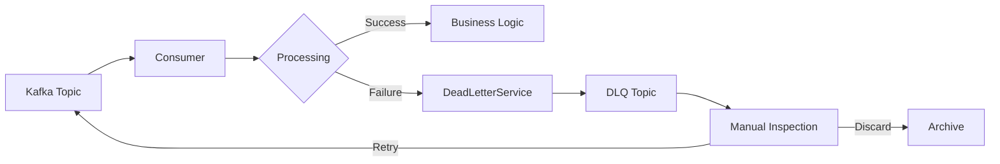
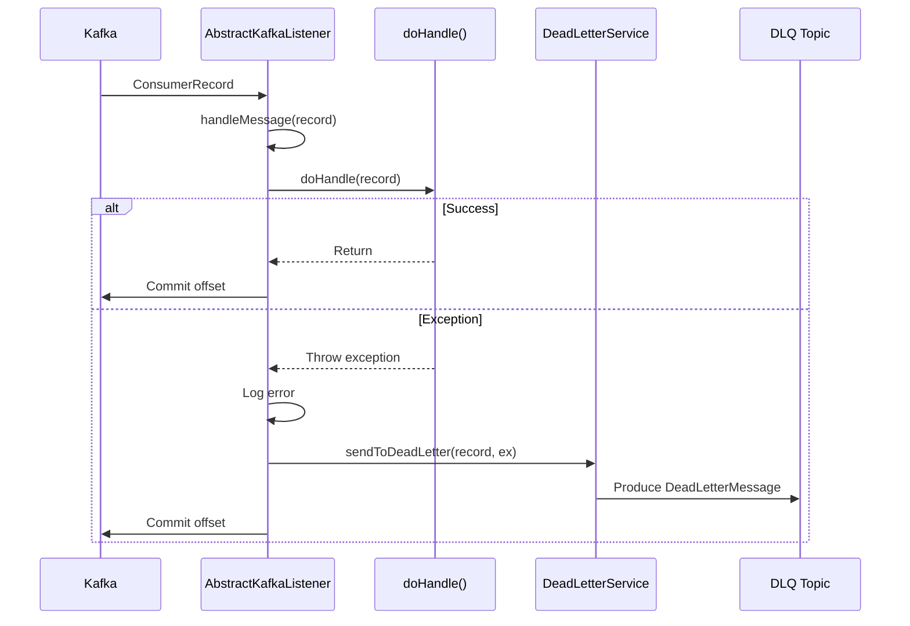

# Dead Letter Queue

Comprehensive guide to SmartAdmin's Dead Letter Queue (DLQ) architecture, automatic error routing, and retry strategies.

## Overview

The Dead Letter Queue (DLQ) is a critical component for handling failed message processing in SmartAdmin's Kafka integration. It ensures:

- **No Message Loss**: Failed messages are preserved for later analysis
- **Automatic Routing**: Exceptions automatically route to DLQ
- **Manual Intervention**: Operators can inspect and retry failed messages
- **Error Categorization**: Distinguish transient from permanent failures
- **Audit Trail**: Complete failure history with stack traces

---

## Architecture

### DLQ Flow



### Topic Naming Convention

DLQ topics follow a predictable naming pattern:

```
Original Topic: smart-admin-order
DLQ Topic:      smart-admin-order-dlq

Original Topic: payment-events
DLQ Topic:      payment-events-dlq
```

**Pattern**: `{original-topic}-dlq`

---

## DeadLetterMessage Structure

### Data Model

```java
@Data
@NoArgsConstructor
@AllArgsConstructor
public class DeadLetterMessage {
    /**
     * Original topic name
     */
    private String originalTopic;

    /**
     * Original message key
     */
    private String originalKey;

    /**
     * Original message value (JSON)
     */
    private String originalValue;

    /**
     * Error message
     */
    private String errorMessage;

    /**
     * Exception stack trace
     */
    private String stackTrace;

    /**
     * Failure timestamp
     */
    private Long timestamp;

    /**
     * Retry attempt count
     */
    private Integer attemptCount;

    /**
     * Additional metadata
     */
    private Map<String, String> metadata;
}
```

### JSON Example

```json
{
  "originalTopic": "smart-admin-order",
  "originalKey": "ORDER-20260121-001",
  "originalValue": "{\"orderId\": 12345, \"amount\": 199.99, \"userId\": 100}",
  "errorMessage": "Database connection timeout after 30s",
  "stackTrace": "java.sql.SQLException: Connection timeout\n\tat com.zaxxer.hikari.pool...",
  "timestamp": 1706745600000,
  "attemptCount": 1,
  "metadata": {
    "consumerGroup": "order-consumer-group",
    "partition": "2",
    "offset": "12345",
    "host": "consumer-pod-1"
  }
}
```

---

## Automatic DLQ Routing

### AbstractKafkaListener Integration

SmartAdmin's `AbstractKafkaListener` automatically routes failed messages to DLQ:

```java
@Component
@Slf4j
public class OrderListener extends AbstractKafkaListener {

    @KafkaListener(
        topics = KafkaConst.Topic.ORDER,
        groupId = KafkaConst.Group.ORDER
    )
    public void onOrderMessage(ConsumerRecord<String, String> record) {
        handleMessage(record);  // Delegates to AbstractKafkaListener
    }

    @Override
    protected void doHandle(ConsumerRecord<String, String> record) {
        // Your business logic
        String message = record.value();
        processOrder(message);  // If this throws, auto-DLQ
    }
}
```

**What Happens on Exception**:
1. `doHandle()` throws exception
2. `AbstractKafkaListener.handleMessage()` catches it
3. Calls `sendToDeadLetter(record, exception)`
4. DLQ message created with full context
5. Sent to `{topic}-dlq` topic
6. Original offset committed (message handled)

### Sequence Diagram



---

## Manual DLQ Processing

### Inspecting DLQ Messages

**Kafka Console Consumer**:

```bash
# Consume all DLQ messages
kafka-console-consumer.sh \
  --bootstrap-server localhost:9092 \
  --topic smart-admin-order-dlq \
  --from-beginning \
  --property print.key=true \
  --property print.value=true

# Pretty print JSON
kafka-console-consumer.sh \
  --bootstrap-server localhost:9092 \
  --topic smart-admin-order-dlq \
  --from-beginning | jq .
```

**Programmatic Consumer**:

```java
@Component
@Slf4j
public class DLQInspector {

    @KafkaListener(
        topics = "smart-admin-order-dlq",
        groupId = "dlq-inspector-group",
        containerFactory = "kafkaListenerContainerFactory"
    )
    public void inspectDLQ(ConsumerRecord<String, String> record) {
        String dlqJson = record.value();
        DeadLetterMessage dlqMsg = JSON.parseObject(dlqJson, DeadLetterMessage.class);

        log.error("DLQ Message - Topic: {}, Key: {}, Error: {}, Attempts: {}",
            dlqMsg.getOriginalTopic(),
            dlqMsg.getOriginalKey(),
            dlqMsg.getErrorMessage(),
            dlqMsg.getAttemptCount());

        // Categorize error
        ErrorCategory category = categorizeError(dlqMsg);

        // Route to appropriate handler
        switch (category) {
            case TRANSIENT -> scheduleRetry(dlqMsg);
            case DATA_ERROR -> notifyDataTeam(dlqMsg);
            case PERMANENT -> archiveMessage(dlqMsg);
        }
    }
}
```

### Retry Strategies

#### 1. Immediate Retry (Transient Errors)

```java
@Service
@RequiredArgsConstructor
public class DLQRetryService {

    private final KafkaProducerService kafkaProducerService;

    public void retryTransientFailures(String dlqTopic) {
        List<DeadLetterMessage> messages = fetchDLQMessages(dlqTopic);

        for (DeadLetterMessage dlqMsg : messages) {
            if (isTransientError(dlqMsg)) {
                // Republish to original topic
                kafkaProducerService.send(
                    dlqMsg.getOriginalTopic(),
                    dlqMsg.getOriginalKey(),
                    dlqMsg.getOriginalValue()
                );

                log.info("Retried message: {} from DLQ", dlqMsg.getOriginalKey());
            }
        }
    }

    private boolean isTransientError(DeadLetterMessage msg) {
        String error = msg.getErrorMessage();
        return error.contains("timeout")
            || error.contains("connection")
            || error.contains("unavailable");
    }
}
```

#### 2. Delayed Retry (Exponential Backoff)

```java
@Service
public class ExponentialBackoffRetry {

    public void scheduleRetry(DeadLetterMessage dlqMsg) {
        int attemptCount = dlqMsg.getAttemptCount();
        long delayMs = calculateBackoff(attemptCount);

        ScheduledExecutorService scheduler = Executors.newSingleThreadScheduledExecutor();
        scheduler.schedule(() -> {
            dlqMsg.setAttemptCount(attemptCount + 1);
            kafkaProducerService.send(
                dlqMsg.getOriginalTopic(),
                dlqMsg.getOriginalKey(),
                dlqMsg.getOriginalValue()
            );
        }, delayMs, TimeUnit.MILLISECONDS);
    }

    private long calculateBackoff(int attemptCount) {
        // 1s, 2s, 4s, 8s, 16s, 32s (max)
        return Math.min(1000L * (1L << attemptCount), 32000L);
    }
}
```

#### 3. Manual Approval Workflow

```java
@RestController
@RequestMapping("/admin/dlq")
@RequiredArgsConstructor
public class DLQManagementController {

    private final DLQRetryService retryService;

    @PostMapping("/retry/{messageId}")
    @SaCheckPermission("dlq:retry")
    public ResponseDTO<Void> retryMessage(@PathVariable String messageId) {
        retryService.retryById(messageId);
        return ResponseDTO.ok();
    }

    @PostMapping("/discard/{messageId}")
    @SaCheckPermission("dlq:discard")
    public ResponseDTO<Void> discardMessage(@PathVariable String messageId) {
        retryService.archiveById(messageId);
        return ResponseDTO.ok();
    }

    @GetMapping("/list")
    @SaCheckPermission("dlq:view")
    public ResponseDTO<List<DeadLetterMessage>> listDLQMessages(
        @RequestParam String topic,
        @RequestParam(defaultValue = "1") Integer pageNum,
        @RequestParam(defaultValue = "20") Integer pageSize
    ) {
        return ResponseDTO.ok(retryService.listMessages(topic, pageNum, pageSize));
    }
}
```

---

## Error Categorization

### Error Types

```java
public enum ErrorCategory {
    /**
     * Transient errors - retry immediately after issue resolved
     * Examples: DB connection timeout, network errors, service unavailable
     */
    TRANSIENT,

    /**
     * Data errors - fix data and retry
     * Examples: Invalid JSON, constraint violations, missing fields
     */
    DATA_ERROR,

    /**
     * Business rule violations - manual decision required
     * Examples: Insufficient balance, duplicate order, authorization failed
     */
    BUSINESS_ERROR,

    /**
     * Permanent errors - cannot be retried
     * Examples: Record not found (deleted), archived data, unsupported operation
     */
    PERMANENT
}
```

### Classification Logic

```java
@Component
public class ErrorClassifier {

    public ErrorCategory categorize(DeadLetterMessage dlqMsg) {
        String errorMsg = dlqMsg.getErrorMessage();
        String stackTrace = dlqMsg.getStackTrace();

        // Transient errors
        if (errorMsg.matches(".*(timeout|connection|unavailable|overload).*")) {
            return ErrorCategory.TRANSIENT;
        }

        // Data errors
        if (stackTrace.contains("JsonParseException")
            || stackTrace.contains("ValidationException")
            || errorMsg.contains("constraint violation")) {
            return ErrorCategory.DATA_ERROR;
        }

        // Business errors
        if (stackTrace.contains("BusinessException")) {
            return ErrorCategory.BUSINESS_ERROR;
        }

        // Default: permanent
        return ErrorCategory.PERMANENT;
    }
}
```

---

## Monitoring DLQ Topics

### Metrics to Track

1. **DLQ Message Count**: Total messages in DLQ
2. **DLQ Growth Rate**: Messages/hour entering DLQ
3. **Error Distribution**: By error type
4. **Retry Success Rate**: Percentage of successful retries
5. **DLQ Age**: Oldest message timestamp

### Prometheus Metrics

```java
@Component
@RequiredArgsConstructor
public class DLQMetrics {

    private final MeterRegistry meterRegistry;

    public void recordDLQMessage(String topic, ErrorCategory category) {
        meterRegistry.counter("kafka.dlq.messages.total",
            "topic", topic,
            "category", category.name()
        ).increment();
    }

    public void recordRetrySuccess(String topic) {
        meterRegistry.counter("kafka.dlq.retry.success",
            "topic", topic
        ).increment();
    }

    public void recordRetryFailure(String topic) {
        meterRegistry.counter("kafka.dlq.retry.failure",
            "topic", topic
        ).increment();
    }
}
```

### Alerting Rules

**Grafana Alert Conditions**:

```yaml
# High DLQ growth rate
- alert: HighDLQGrowthRate
  expr: rate(kafka_dlq_messages_total[5m]) > 10
  for: 5m
  annotations:
    summary: "DLQ receiving >10 messages/sec for 5 minutes"

# Old messages in DLQ
- alert: StaleDLQMessages
  expr: (time() - kafka_dlq_oldest_message_timestamp) > 86400
  for: 1h
  annotations:
    summary: "DLQ has messages older than 24 hours"
```

---

## Best Practices

### 1. DLQ Topic Configuration

```yaml
# Create DLQ topics with appropriate retention
kafka-topics.sh --create \
  --topic smart-admin-order-dlq \
  --partitions 3 \
  --replication-factor 3 \
  --config retention.ms=604800000    # 7 days
  --config cleanup.policy=delete
```

### 2. Regular DLQ Review

**Daily Review Checklist**:
- [ ] Check DLQ message count (should be near zero)
- [ ] Identify recurring error patterns
- [ ] Retry transient failures
- [ ] Escalate data/business errors
- [ ] Archive resolved messages

### 3. Root Cause Analysis

```java
@Service
public class DLQAnalyzer {

    public Map<String, Long> analyzeErrorPatterns(String dlqTopic) {
        List<DeadLetterMessage> messages = fetchAllDLQMessages(dlqTopic);

        return messages.stream()
            .collect(Collectors.groupingBy(
                msg -> extractRootCause(msg.getStackTrace()),
                Collectors.counting()
            ))
            .entrySet().stream()
            .sorted(Map.Entry.<String, Long>comparingByValue().reversed())
            .collect(Collectors.toMap(
                Map.Entry::getKey,
                Map.Entry::getValue,
                (e1, e2) -> e1,
                LinkedHashMap::new
            ));
    }

    private String extractRootCause(String stackTrace) {
        // Extract first exception class name
        Pattern pattern = Pattern.compile("([\\w.]+Exception)");
        Matcher matcher = pattern.matcher(stackTrace);
        return matcher.find() ? matcher.group(1) : "Unknown";
    }
}
```

### 4. Prevent DLQ Accumulation

**Proactive Measures**:
- Implement comprehensive input validation
- Add circuit breakers for external dependencies
- Use idempotent operations
- Set appropriate timeouts
- Monitor upstream service health
- Implement graceful degradation

### 5. DLQ Retention Policy

```yaml
smart:
  kafka:
    dlq:
      retention-days: 7           # Keep DLQ messages for 7 days
      auto-archive: true          # Move to cold storage after retention
      archive-location: s3://bucket/dlq-archives/
      max-retry-attempts: 3       # Max automatic retries
```

---

## Common DLQ Scenarios

### Scenario 1: Database Connection Failure

**Symptom**: All messages going to DLQ with "Connection timeout"

**Root Cause**: Database unavailable or connection pool exhausted

**Solution**:
1. Verify database health
2. Check connection pool configuration
3. Wait for recovery
4. Batch retry all DLQ messages

### Scenario 2: Invalid Message Format

**Symptom**: Sporadic DLQ messages with "JsonParseException"

**Root Cause**: Producer sending malformed JSON

**Solution**:
1. Identify producer source from metadata
2. Fix producer validation
3. Transform or discard malformed messages
4. Do not retry without fixing data

### Scenario 3: Business Rule Changes

**Symptom**: Sudden spike in "BusinessException" DLQ messages

**Root Cause**: Deployed new business rules affecting old messages

**Solution**:
1. Review business rule changes
2. Decide: adapt messages or discard
3. Update consumers to handle legacy formats
4. Selective retry with data transformation

---

## See Also

- [Architecture Overview](/kafka/architecture/overview) - System architecture
- [Module Structure](/kafka/architecture/module-structure) - Code organization
- [Message Flow](/kafka/architecture/message-flow) - Sequence diagrams
- [Batch Processing](/kafka/architecture/batch-processing) - Batch design
- [Error Handling Guide](/kafka/guides/error-handling) - Error strategies
- [Monitoring Guide](/kafka/operations/monitoring) - Metrics and alerts
- [Troubleshooting](/kafka/troubleshooting/common-issues) - Common problems

---

**Last Updated**: 2026-01-21
