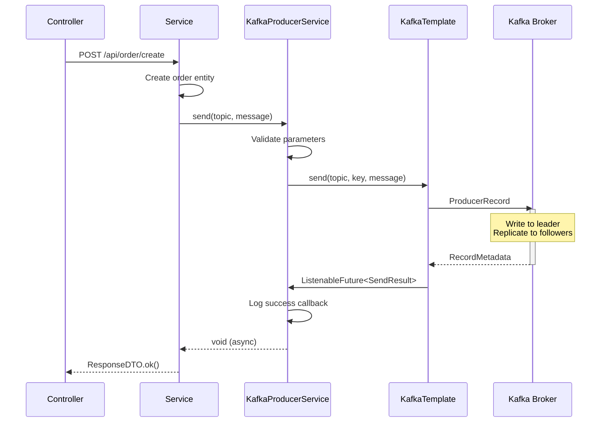
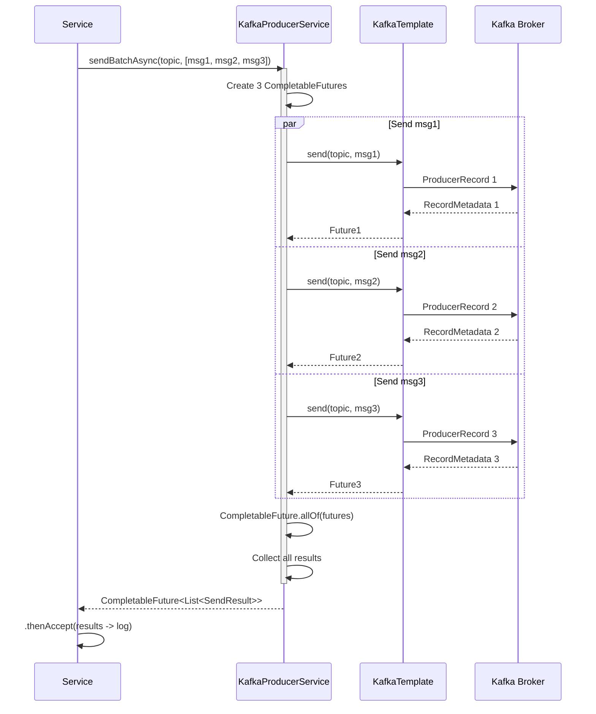
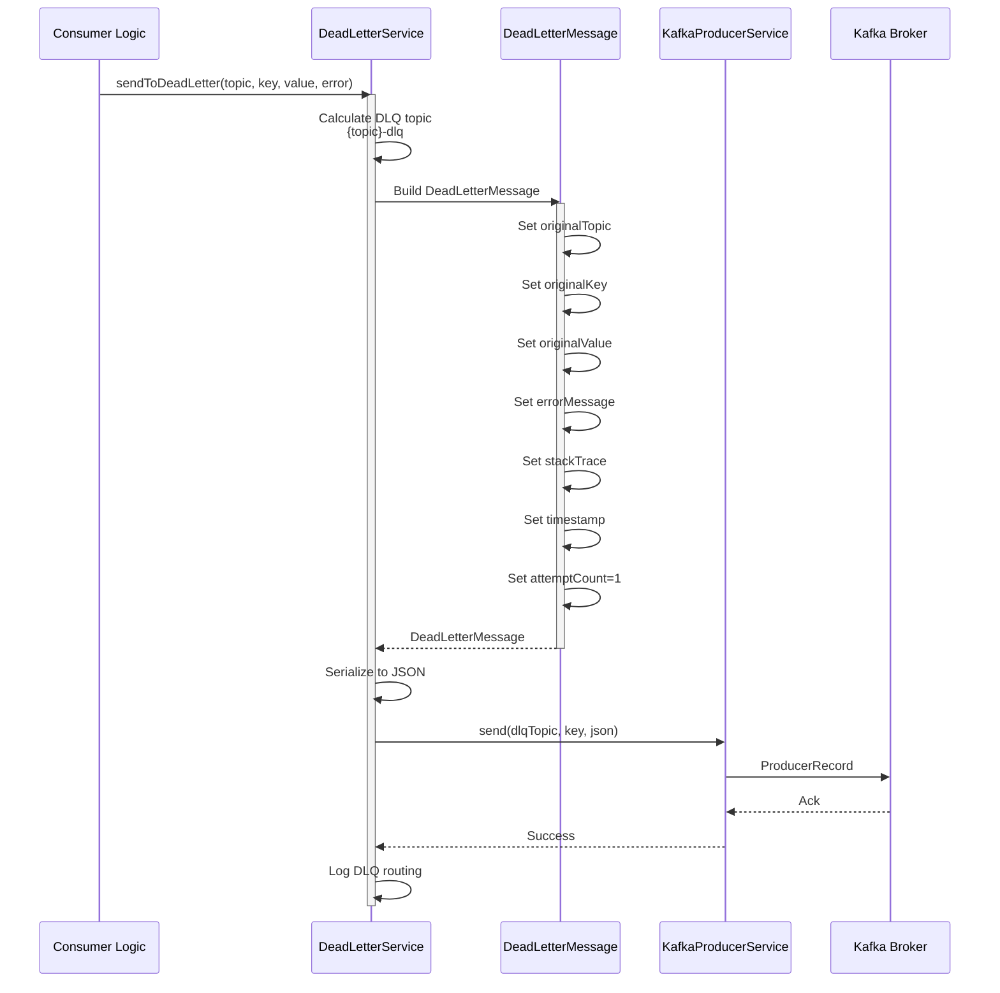
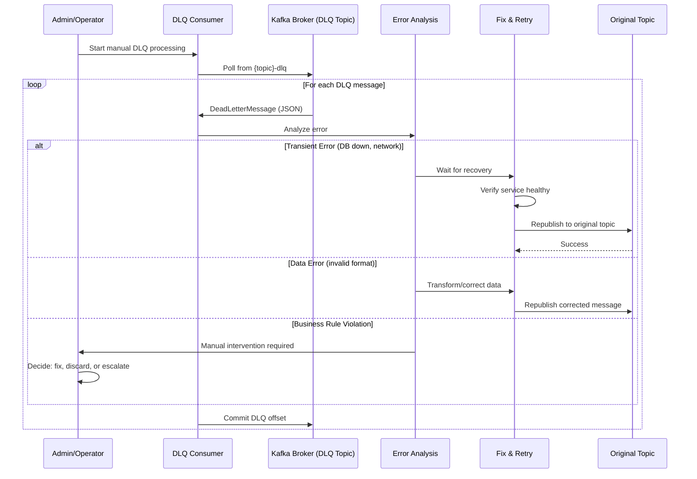
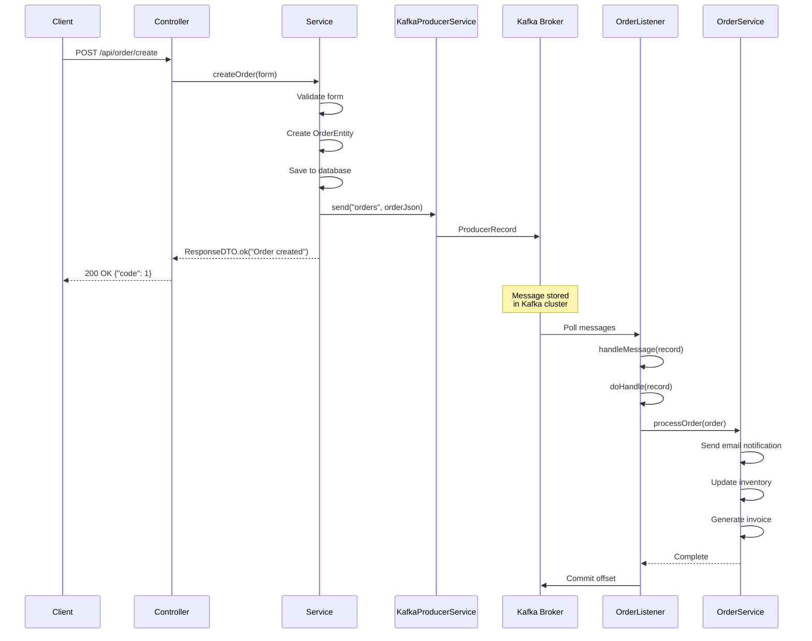
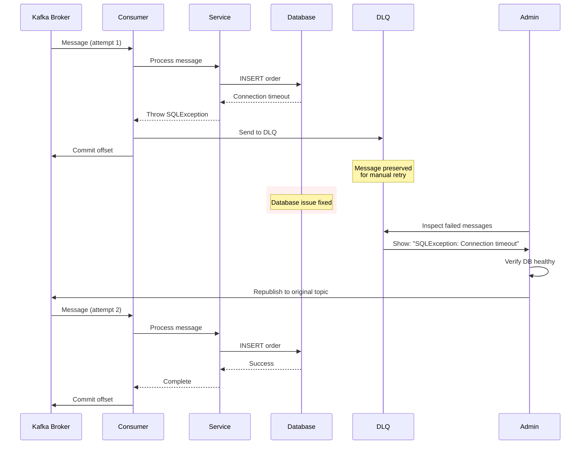
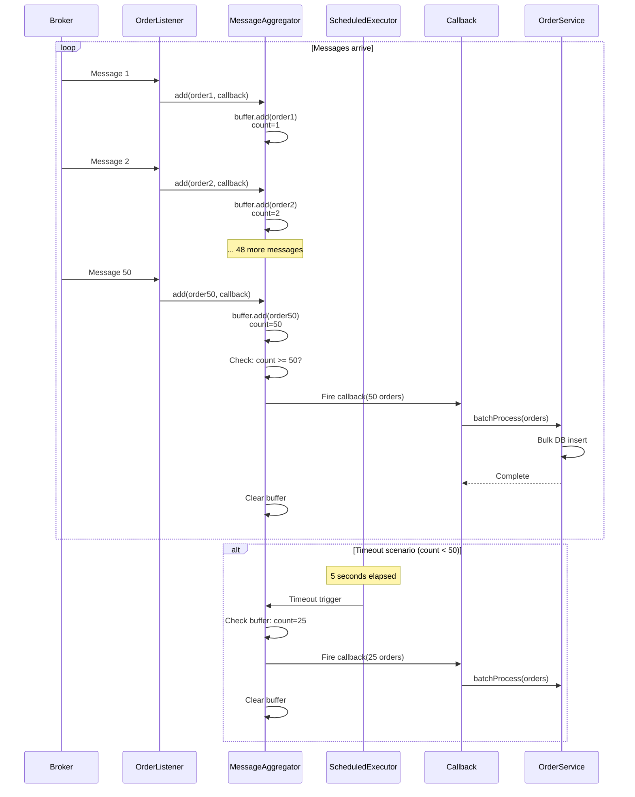

# Message Flow

Comprehensive sequence diagrams showing how messages flow through SmartAdmin's Kafka integration.

## Overview

This document provides detailed sequence diagrams for all message flows in Smart Admin's Kafka module, including:

- **Producer Flows**: Single send, batch send, callbacks
- **Consumer Flows**: Single processing, batch processing, degradation
- **DLQ Flows**: Error handling and dead letter queue routing
- **End-to-End Flows**: Complete request-response cycles

---

## Producer Message Flows

### Single Message Send (Async)



**Key Points**:
1. **Async by default**: `send()` returns immediately, doesn't block
2. **Callback logging**: Success/failure logged automatically
3. **Fire-and-forget**: Controller doesn't wait for Kafka ack

---

### Single Message Send with Callback

```mermaid
sequenceDiagram
    participant Service
    participant Producer as KafkaProducerService
    participant Callback as ProducerCallback
    participant KT as KafkaTemplate
    participant Broker as Kafka Broker

    Service->>Producer: send(topic, msg, callback)
    Producer->>KT: send(topic, key, message)

    KT->>Broker: ProducerRecord
    activate Broker

    alt Success (acks=all)
        Broker-->>KT: RecordMetadata
        deactivate Broker
        KT->>Callback: onSuccess(SendResult)
        Callback->>Callback: Business logic<br/>(update DB, metrics, etc.)
    else Failure (retries exhausted)
        Broker-->>KT: Exception
        deactivate Broker
        KT->>Callback: onFailure(Throwable)
        Callback->>Callback: Handle error<br/>(alert, compensation, etc.)
    end

    Producer-->>Service: void
```

**Key Points**:
1. **Custom callback**: Handle success/failure in business logic
2. **Non-blocking**: Callback executed asynchronously
3. **Use cases**: Metrics collection, DB updates, alerting

---

### Batch Send (Parallel)



**Key Points**:
1. **Parallel execution**: All messages sent concurrently
2. **CompletableFuture.allOf()**: Waits for all to complete
3. **Preserves order**: Results match input order
4. **Performance**: 3-5x faster than sequential

---

## Consumer Message Flows

### Single Message Processing (AbstractKafkaListener)

```mermaid
sequenceDiagram
    participant Broker as Kafka Broker
    participant Listener as @KafkaListener
    participant Abstract as AbstractKafkaListener
    participant Impl as doHandle()
    participant DLQ as DeadLetterService
    participant Business as Business Logic

    Broker->>Listener: Poll ConsumerRecord
    Listener->>Abstract: handleMessage(record)
    activate Abstract

    Abstract->>Abstract: Log: Processing message

    Abstract->>Impl: doHandle(record)
    activate Impl

    alt Success Path
        Impl->>Business: Process message
        Business-->>Impl: Success
        Impl-->>Abstract: Return normally
        Abstract->>Abstract: Log: Successfully processed
        deactivate Impl
        Abstract->>Broker: Auto-commit offset
    else Failure Path (Exception)
        Impl->>Business: Process message
        Business-->>Impl: Throw exception
        Impl-->>Abstract: Throw exception
        deactivate Impl
        Abstract->>Abstract: Log error with stack trace
        Abstract->>DLQ: sendToDeadLetter(record, ex)
        DLQ->>Broker: Produce to {topic}-dlq
        Abstract->>Broker: Auto-commit offset<br/>(message handled)
    end

    deactivate Abstract
```

**Key Points**:
1. **Template method**: `handleMessage()` wraps `doHandle()`
2. **Auto-DLQ**: Exceptions automatically route to DLQ
3. **Always commits**: Offset committed even on failure (DLQ handles it)
4. **No message loss**: Failed messages preserved in DLQ

---

### Batch Processing with Degradation

```mermaid
sequenceDiagram
    participant Broker as Kafka Broker
    participant Listener as @KafkaListener
    participant Abstract as AbstractBatchKafkaListener
    participant Batch as doBatchHandle()
    participant Single as doHandle()
    participant DLQ as DeadLetterService

    Broker->>Listener: Poll List<ConsumerRecord> (N=100)
    Listener->>Abstract: handleBatch(records, ack)
    activate Abstract

    Abstract->>Abstract: Log: Processing batch of 100

    Abstract->>Batch: doBatchHandle(records)
    activate Batch

    alt Batch Success
        Batch->>Batch: Batch DB operation
        Batch-->>Abstract: Return normally
        deactivate Batch
        Abstract->>Abstract: ack.acknowledge()
        Abstract->>Abstract: Log: Successfully processed 100
    else Batch Failure
        Batch->>Batch: Batch DB operation fails
        Batch-->>Abstract: Throw exception
        deactivate Batch
        Abstract->>Abstract: Log: Degrading to single mode

        Abstract->>Abstract: degradeToSingleProcessing()

        loop Each of 100 messages
            Abstract->>Single: doHandle(record)
            activate Single
            alt Single Success
                Single-->>Abstract: Return
                deactivate Single
                Abstract->>Abstract: successCount++
            else Single Failure
                Single-->>Abstract: Throw exception
                deactivate Single
                Abstract->>DLQ: sendToDeadLetter(record, ex)
                Abstract->>Abstract: failureCount++
            end
        end

        Abstract->>Abstract: ack.acknowledge()
        Abstract->>Abstract: Log: 95 success, 5 failed
    end

    deactivate Abstract
```

**Key Points**:
1. **Try batch first**: Optimal for performance
2. **Graceful degradation**: Falls back to single-message mode
3. **Partial success**: Some messages succeed, failures go to DLQ
4. **Always acknowledges**: Manual ack after all processing complete

---

## Dead Letter Queue Flows

### DLQ Message Creation and Routing



**DLQ Message Structure**:
```json
{
  "originalTopic": "smart-admin-order",
  "originalKey": "ORDER-123",
  "originalValue": "{\"orderId\": 123, \"amount\": 100}",
  "errorMessage": "Database connection failed",
  "stackTrace": "java.sql.SQLException: ...",
  "timestamp": 1706745600000,
  "attemptCount": 1,
  "metadata": {
    "consumerGroup": "order-group",
    "partition": "2",
    "offset": "12345"
  }
}
```

---

### DLQ Manual Processing Flow



**Key Points**:
1. **Manual inspection**: Operator reviews each failure
2. **Error categorization**: Transient vs permanent errors
3. **Selective retry**: Only valid messages replayed
4. **Audit trail**: DLQ messages preserved for analysis

---

## End-to-End Flows

### Complete Request-Response Flow



**Timing**:
- Client receives response: ~50ms (database write time)
- Kafka receives message: ~5ms (async)
- Consumer processes message: ~200ms (email, inventory, invoice)
- **Total**: Client unblocked at 50ms, background work continues

---

### Error Recovery Flow



**Key Points**:
1. **No automatic retry**: Avoids retry storms
2. **DLQ preservation**: Failed messages never lost
3. **Manual intervention**: Operator decides when to retry
4. **Root cause fix**: Address underlying issue before retry

---

## Message Aggregation Flow

### Time or Count-Based Aggregation



**Configuration**:
```yaml
smart:
  kafka:
    batch:
      aggregate:
        enabled: true
        count: 50       # Flush when 50 messages
        timeout-ms: 5000 # Or flush after 5 seconds
```

**Trigger Conditions** (whichever comes first):
1. **Count threshold**: Buffer reaches 50 messages
2. **Time threshold**: 5 seconds elapsed since first message

---

## Summary

### Flow Comparison

| Flow Type | Latency | Throughput | Error Handling | Use Case |
|-----------|---------|------------|----------------|----------|
| **Single Send** | ~5ms | 1,000 msg/s | Callback logging | Real-time events |
| **Batch Send** | ~10ms | 5,000 msg/s | Per-message callback | Bulk operations |
| **Single Consumer** | ~10ms | 2,000 msg/s | Auto-DLQ | Standard processing |
| **Batch Consumer** | ~20ms | 10,000 msg/s | Degradation + DLQ | High-throughput |
| **Aggregated Consumer** | ~50ms | 8,000 msg/s | Buffered + DLQ | DB batch inserts |

### Best Practices

1. **Producer**:
   - Use batch send for bulk operations (>10 messages)
   - Implement callbacks for critical messages
   - Monitor send failures via metrics

2. **Consumer**:
   - Extend `AbstractKafkaListener` for reliability
   - Use batch mode for high-throughput scenarios
   - Implement `doHandle()` for degradation fallback

3. **DLQ**:
   - Monitor DLQ topics daily
   - Categorize errors (transient vs permanent)
   - Implement automated retry for known transients

4. **Performance**:
   - Use message aggregation for database writes
   - Tune `max-poll-records` based on processing time
   - Scale consumers via `listener.concurrency`

---

## See Also

- [Architecture Overview](/kafka/architecture/overview) - System architecture
- [Module Structure](/kafka/architecture/module-structure) - Code organization
- [Batch Processing](/kafka/architecture/batch-processing) - Batch design details
- [Dead Letter Queue](/kafka/architecture/dead-letter-queue) - DLQ architecture
- [Producer Guide](/kafka/guides/producer-guide) - Producer patterns
- [Consumer Guide](/kafka/guides/consumer-guide) - Consumer patterns
