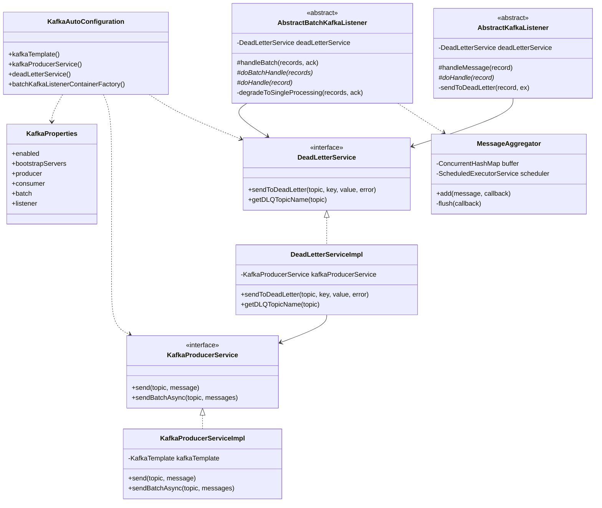

# Module Structure

Detailed code organization and package structure of SmartAdmin's Kafka integration module.

## Module Location

```
sa-common/
└── mq/
    └── src/main/java/net/lab1024/sa/common/mq/
        └── kafka/                    # Kafka integration module
```

**Maven Coordinates**:
```xml
<groupId>net.lab1024</groupId>
<artifactId>sa-common-mq</artifactId>
<version>${project.version}</version>
```

**Gradle Dependencies**:
```gradle
implementation project(':sa-common:mq')
```

---

## Complete Directory Structure

```
sa-common/mq/src/main/java/net/lab1024/sa/common/mq/kafka/
│
├── config/                                    # Configuration Layer (Auto-Config)
│   ├── KafkaAutoConfiguration.java            # Spring Boot auto-configuration
│   ├── KafkaProperties.java                   # Configuration properties binding
│   ├── BatchKafkaListenerContainerFactory.java # Batch listener factory (optional)
│   └── ProducerCallbackConfig.java            # Callback configuration
│
├── constant/                                  # Constants
│   ├── KafkaConst.java                        # Topic and Group ID constants
│   └── KafkaHeaders.java                      # Custom header key constants
│
├── core/                                      # Producer Core
│   ├── KafkaProducerService.java              # Producer interface
│   ├── KafkaProducerServiceImpl.java          # Producer implementation
│   ├── ProducerCallback.java                  # Send callback interface
│   └── ProducerMetrics.java                   # Producer metrics (future)
│
├── listener/                                  # Consumer Base Classes
│   ├── AbstractKafkaListener.java             # Single-message consumer base
│   ├── AbstractBatchKafkaListener.java        # Batch consumer base
│   ├── MessageAggregator.java                 # Message aggregation utility
│   └── ListenerMetrics.java                   # Consumer metrics (future)
│
├── dlq/                                       # Dead Letter Queue
│   ├── DeadLetterService.java                 # DLQ service interface
│   ├── DeadLetterServiceImpl.java             # DLQ implementation
│   ├── DeadLetterMessage.java                 # DLQ message structure
│   └── DeadLetterListener.java                # DLQ consumer (manual processing)
│
├── exception/                                 # Exceptions (future)
│   ├── KafkaProducerException.java
│   └── KafkaConsumerException.java
│
└── util/                                      # Utilities (future)
    └── KafkaMessageUtil.java
```

---

## Package Responsibilities

### config/ - Configuration Layer

**Purpose**: Spring Boot auto-configuration and properties binding.

#### KafkaAutoConfiguration.java

```java
@Configuration
@EnableConfigurationProperties(KafkaProperties.class)
@ConditionalOnProperty(prefix = "smart.kafka", name = "enabled", havingValue = "true")
public class KafkaAutoConfiguration {

    @Bean
    public KafkaTemplate<String, String> kafkaTemplate(
        ProducerFactory<String, String> producerFactory
    ) {
        // Create KafkaTemplate with producer factory
    }

    @Bean
    public KafkaProducerService kafkaProducerService(
        KafkaTemplate<String, String> kafkaTemplate
    ) {
        return new KafkaProducerServiceImpl(kafkaTemplate);
    }

    @Bean
    @ConditionalOnProperty(prefix = "smart.kafka.batch", name = "enabled")
    public BatchKafkaListenerContainerFactory batchKafkaListenerContainerFactory(
        ConsumerFactory<String, String> consumerFactory
    ) {
        // Create batch listener container factory
    }

    @Bean
    public DeadLetterService deadLetterService(
        KafkaProducerService kafkaProducerService
    ) {
        return new DeadLetterServiceImpl(kafkaProducerService);
    }
}
```

**Responsibilities**:
- ✅ Conditionally enable Kafka module (`smart.kafka.enabled`)
- ✅ Create `KafkaTemplate` bean
- ✅ Create `KafkaProducerService` bean
- ✅ Create `BatchKafkaListenerContainerFactory` (if batch enabled)
- ✅ Create `DeadLetterService` bean
- ✅ Configure producer and consumer factories

#### KafkaProperties.java

```java
@Data
@ConfigurationProperties(prefix = "smart.kafka")
public class KafkaProperties {

    /** Enable/disable Kafka module */
    private boolean enabled = false;

    /** Kafka bootstrap servers */
    private String bootstrapServers = "localhost:9092";

    /** Producer configuration */
    private ProducerProperties producer = new ProducerProperties();

    /** Consumer configuration */
    private ConsumerProperties consumer = new ConsumerProperties();

    /** Batch processing configuration */
    private BatchProperties batch = new BatchProperties();

    /** Listener container configuration */
    private ListenerProperties listener = new ListenerProperties();

    @Data
    public static class ProducerProperties {
        private String acks = "all";
        private Integer retries = 3;
        private Boolean enableIdempotence = true;
        private Integer maxInFlightRequestsPerConnection = 1;
        private Integer batchSize = 16384;
        private Integer lingerMs = 5;
        private String compressionType = "lz4";
    }

    @Data
    public static class ConsumerProperties {
        private Boolean enableAutoCommit = false;
        private String autoOffsetReset = "earliest";
        private Integer maxPollRecords = 500;
        private Integer sessionTimeoutMs = 45000;
        private Integer heartbeatIntervalMs = 3000;
        private Integer maxPollIntervalMs = 300000;
    }

    @Data
    public static class BatchProperties {
        private Boolean enabled = false;
        private Integer size = 100;
        private AggregateProperties aggregate = new AggregateProperties();

        @Data
        public static class AggregateProperties {
            private Boolean enabled = false;
            private Integer count = 50;
            private Long timeoutMs = 5000L;
        }
    }

    @Data
    public static class ListenerProperties {
        private Boolean batchListener = true;
        private String ackMode = "manual";
        private Integer concurrency = 3;
    }
}
```

**Responsibilities**:
- ✅ Bind `application.yml` configuration to Java objects
- ✅ Provide default values
- ✅ Support environment-specific overrides

---

### constant/ - Constants

#### KafkaConst.java

```java
/**
 * Kafka topic and group ID constants
 */
public class KafkaConst {

    /**
     * Topic names
     */
    public static class Topic {
        /** Order topic */
        public static final String ORDER = "smart-admin-order";

        /** Notification topic */
        public static final String NOTIFICATION = "smart-admin-notification";

        /** Employee event topic */
        public static final String EMPLOYEE_EVENT = "smart-admin-employee-event";

        // DLQ topics (auto-generated pattern: {topic}-dlq)
        public static final String ORDER_DLQ = ORDER + "-dlq";
        public static final String NOTIFICATION_DLQ = NOTIFICATION + "-dlq";
    }

    /**
     * Consumer group IDs
     */
    public static class Group {
        /** Order consumer group */
        public static final String ORDER = "smart-admin-order-group";

        /** Notification consumer group */
        public static final String NOTIFICATION = "smart-admin-notification-group";

        /** Employee event consumer group */
        public static final String EMPLOYEE_EVENT = "smart-admin-employee-event-group";
    }
}
```

**Responsibilities**:
- ✅ Centralized topic name management
- ✅ Centralized group ID management
- ✅ Prevent hardcoded strings across codebase

**Best Practice**: Always use constants, never hardcode topic/group names.

---

### core/ - Producer Core

#### KafkaProducerService.java (Interface)

```java
/**
 * Kafka producer service interface
 */
public interface KafkaProducerService {

    /**
     * Send message asynchronously (no key)
     */
    void send(String topic, String message);

    /**
     * Send message asynchronously (with key)
     */
    void send(String topic, String key, String message);

    /**
     * Send message with callback
     */
    void send(String topic, String message, ProducerCallback<String, String> callback);

    /**
     * Send batch messages asynchronously (no keys)
     */
    CompletableFuture<List<SendResult<String, String>>> sendBatchAsync(
        String topic,
        List<String> messages
    );

    /**
     * Send batch messages asynchronously (with keys)
     */
    CompletableFuture<List<SendResult<String, String>>> sendBatchAsync(
        String topic,
        List<Map.Entry<String, String>> keyedMessages
    );
}
```

#### KafkaProducerServiceImpl.java (Implementation)

```java
@Slf4j
@RequiredArgsConstructor
public class KafkaProducerServiceImpl implements KafkaProducerService {

    private final KafkaTemplate<String, String> kafkaTemplate;

    @Override
    public void send(String topic, String message) {
        send(topic, null, message);
    }

    @Override
    public void send(String topic, String key, String message) {
        ListenableFuture<SendResult<String, String>> future =
            kafkaTemplate.send(topic, key, message);

        future.addCallback(
            result -> log.info("Message sent to topic {} partition {}",
                topic, result.getRecordMetadata().partition()),
            ex -> log.error("Failed to send message to topic {}", topic, ex)
        );
    }

    @Override
    public CompletableFuture<List<SendResult<String, String>>> sendBatchAsync(
        String topic,
        List<String> messages
    ) {
        // Create futures for all messages
        List<CompletableFuture<SendResult<String, String>>> futures =
            messages.stream()
                .map(msg -> kafkaTemplate.send(topic, msg)
                    .completable())
                .toList();

        // Wait for all to complete
        return CompletableFuture.allOf(futures.toArray(new CompletableFuture[0]))
            .thenApply(v -> futures.stream()
                .map(CompletableFuture::join)
                .toList());
    }
}
```

**Responsibilities**:
- ✅ Wrap `KafkaTemplate` with simplified API
- ✅ Provide async send operations
- ✅ Support batch sending
- ✅ Handle callbacks and error logging

---

### listener/ - Consumer Base Classes

#### AbstractKafkaListener.java

```java
@Slf4j
public abstract class AbstractKafkaListener {

    @Autowired
    private DeadLetterService deadLetterService;

    /**
     * Template method for message handling
     */
    protected void handleMessage(ConsumerRecord<String, String> record) {
        try {
            log.debug("Processing message from topic {} partition {} offset {}",
                record.topic(), record.partition(), record.offset());

            // Delegate to subclass
            doHandle(record);

            log.debug("Successfully processed message from topic {}",
                record.topic());

        } catch (Exception e) {
            log.error("Failed to process message from topic {} partition {} offset {}",
                record.topic(), record.partition(), record.offset(), e);

            // Send to DLQ
            sendToDeadLetter(record, e);
        }
    }

    /**
     * Subclass must implement business logic
     */
    protected abstract void doHandle(ConsumerRecord<String, String> record);

    /**
     * Send failed message to Dead Letter Queue
     */
    private void sendToDeadLetter(ConsumerRecord<String, String> record, Exception e) {
        try {
            deadLetterService.sendToDeadLetter(
                record.topic(),
                record.key(),
                record.value(),
                e.getMessage()
            );
            log.info("Sent failed message to DLQ: {}", record.topic());
        } catch (Exception dlqEx) {
            log.error("Failed to send message to DLQ", dlqEx);
        }
    }
}
```

**Responsibilities**:
- ✅ Template method pattern for consistent error handling
- ✅ Automatic DLQ routing on failure
- ✅ Comprehensive logging
- ✅ Exception isolation

#### AbstractBatchKafkaListener.java

```java
@Slf4j
public abstract class AbstractBatchKafkaListener<T> {

    @Autowired
    private DeadLetterService deadLetterService;

    /**
     * Template method for batch handling
     */
    protected void handleBatch(
        List<ConsumerRecord<String, String>> records,
        Acknowledgment ack
    ) {
        if (records.isEmpty()) {
            return;
        }

        try {
            log.info("Processing batch of {} messages from topic {}",
                records.size(), records.get(0).topic());

            // Try batch processing
            doBatchHandle(records);

            // Acknowledge all messages
            ack.acknowledge();

            log.info("Successfully processed batch of {} messages",
                records.size());

        } catch (Exception e) {
            log.warn("Batch processing failed, degrading to single-message mode", e);

            // Graceful degradation: process one by one
            degradeToSingleProcessing(records, ack);
        }
    }

    /**
     * Subclass implements batch processing logic
     */
    protected abstract void doBatchHandle(List<ConsumerRecord<String, String>> records);

    /**
     * Subclass implements single-message fallback
     */
    protected abstract void doHandle(ConsumerRecord<String, String> record);

    /**
     * Get batch size configuration
     */
    protected int getBatchSize() {
        return 100;
    }

    /**
     * Degrade to single-message processing
     */
    private void degradeToSingleProcessing(
        List<ConsumerRecord<String, String>> records,
        Acknowledgment ack
    ) {
        int successCount = 0;
        int failureCount = 0;

        for (ConsumerRecord<String, String> record : records) {
            try {
                doHandle(record);
                successCount++;
            } catch (Exception e) {
                log.error("Failed to process single message", e);
                sendToDeadLetter(record, e);
                failureCount++;
            }
        }

        // Acknowledge all (DLQ handles failures)
        ack.acknowledge();

        log.info("Degraded processing complete: {} success, {} failed (sent to DLQ)",
            successCount, failureCount);
    }

    private void sendToDeadLetter(ConsumerRecord<String, String> record, Exception e) {
        deadLetterService.sendToDeadLetter(
            record.topic(),
            record.key(),
            record.value(),
            e.getMessage()
        );
    }
}
```

**Responsibilities**:
- ✅ Batch processing with graceful degradation
- ✅ Automatic single-message fallback
- ✅ Individual message DLQ routing
- ✅ Manual acknowledgment control

---

### dlq/ - Dead Letter Queue

#### DeadLetterService.java

```java
/**
 * Dead Letter Queue service
 */
public interface DeadLetterService {

    /**
     * Send message to DLQ
     */
    void sendToDeadLetter(
        String originalTopic,
        String key,
        String value,
        String errorMessage
    );

    /**
     * Send ConsumerRecord to DLQ
     */
    void sendToDeadLetter(
        ConsumerRecord<String, String> record,
        Exception exception
    );

    /**
     * Get DLQ topic name for original topic
     */
    String getDLQTopicName(String originalTopic);
}
```

#### DeadLetterServiceImpl.java

```java
@Slf4j
@RequiredArgsConstructor
public class DeadLetterServiceImpl implements DeadLetterService {

    private final KafkaProducerService kafkaProducerService;

    @Override
    public void sendToDeadLetter(
        String originalTopic,
        String key,
        String value,
        String errorMessage
    ) {
        String dlqTopic = getDLQTopicName(originalTopic);

        DeadLetterMessage dlqMessage = DeadLetterMessage.builder()
            .originalTopic(originalTopic)
            .originalKey(key)
            .originalValue(value)
            .errorMessage(errorMessage)
            .timestamp(System.currentTimeMillis())
            .attemptCount(1)
            .build();

        String messageJson = toJson(dlqMessage);

        kafkaProducerService.send(dlqTopic, key, messageJson);

        log.warn("Sent message to DLQ: topic={}, key={}, error={}",
            dlqTopic, key, errorMessage);
    }

    @Override
    public String getDLQTopicName(String originalTopic) {
        return originalTopic + "-dlq";
    }

    private String toJson(Object obj) {
        // JSON serialization using Jackson
    }
}
```

**Responsibilities**:
- ✅ Route failed messages to DLQ topics
- ✅ Preserve original message metadata
- ✅ Record error information
- ✅ Standard DLQ naming convention (`{topic}-dlq`)

---

## Class Dependency Diagram



---

## Design Patterns Applied

| Pattern | Class | Purpose |
|---------|-------|---------|
| **Template Method** | `AbstractKafkaListener`<br>`AbstractBatchKafkaListener` | Define skeleton, subclass implements details |
| **Strategy** | `KafkaProducerService` | Multiple send strategies (sync, async, batch) |
| **Facade** | `KafkaProducerService` | Simplify KafkaTemplate API |
| **Factory** | `KafkaAutoConfiguration` | Create and configure beans |
| **Singleton** | All `@Service` beans | Single instance per application |
| **Dependency Injection** | All classes | Constructor injection via `@RequiredArgsConstructor` |

---

## File Change Tracking

### Original Implementation (Before Batch Feature)

| File | Status | Lines |
|------|--------|-------|
| `config/KafkaAutoConfiguration.java` | ✅ Exists | ~150 |
| `config/KafkaProperties.java` | ✅ Exists | ~80 |
| `core/KafkaProducerService.java` | ✅ Exists | ~40 |
| `core/KafkaProducerServiceImpl.java` | ✅ Exists | ~120 |
| `listener/AbstractKafkaListener.java` | ✅ Exists | ~80 |
| `dlq/DeadLetterService.java` | ✅ Exists | ~30 |
| `dlq/DeadLetterServiceImpl.java` | ✅ Exists | ~100 |

**Total Original**: ~600 lines

### Batch Processing Enhancement

| File | Change Type | Lines Added | Purpose |
|------|------------|-------------|---------|
| `config/KafkaProperties.java` | Modified | +60 | Add `BatchProperties` |
| `config/KafkaAutoConfiguration.java` | Modified | +30 | Add `BatchKafkaListenerContainerFactory` |
| `core/KafkaProducerService.java` | Modified | +20 | Add `sendBatchAsync()` methods |
| `core/KafkaProducerServiceImpl.java` | Modified | +50 | Implement batch send logic |
| `listener/AbstractBatchKafkaListener.java` | **New File** | +150 | Batch consumer base class |
| `listener/MessageAggregator.java` | **New File** | +120 | Message aggregation utility |

**Total Addition**: ~430 lines

**Total Module Size**: ~1,030 lines

---

## Module Metrics

### Code Statistics

| Metric | Value |
|--------|-------|
| Total Classes | 13 |
| Interfaces | 3 |
| Abstract Classes | 2 |
| Concrete Classes | 8 |
| Total Lines of Code | ~1,030 |
| Average Class Size | ~79 lines |
| Test Coverage Target | 80%+ |

### Complexity Analysis

| Component | Cyclomatic Complexity | Maintainability |
|-----------|----------------------|-----------------|
| `KafkaProducerServiceImpl` | Medium (8) | High |
| `AbstractKafkaListener` | Low (3) | Very High |
| `AbstractBatchKafkaListener` | Medium (7) | High |
| `MessageAggregator` | Medium (6) | High |
| `DeadLetterServiceImpl` | Low (2) | Very High |

---

## Package Naming Conventions

All packages follow Alibaba Java naming standards:

- **Package names**: Lowercase, no underscores
  - ✅ `net.lab1024.sa.common.mq.kafka.config`
  - ❌ `net.lab1024.sa.common.mq.kafka.Config`
  - ❌ `net.lab1024.sa.common.mq.kafka.kafka_config`

- **Class names**: PascalCase, meaningful nouns
  - ✅ `KafkaProducerService`
  - ✅ `AbstractKafkaListener`
  - ❌ `KafkaProdSvc`

- **Interface names**: No "I" prefix
  - ✅ `KafkaProducerService`
  - ❌ `IKafkaProducerService`

- **Constants**: UPPER_SNAKE_CASE
  - ✅ `KafkaConst.Topic.ORDER`
  - ❌ `KafkaConst.Topic.order`

---

## Testing Structure

```
src/test/java/net/lab1024/sa/common/mq/kafka/
│
├── core/
│   └── KafkaProducerServiceTest.java          # Unit tests for producer
│
├── listener/
│   ├── AbstractKafkaListenerTest.java         # Template method tests
│   ├── AbstractBatchKafkaListenerTest.java    # Batch processing tests
│   └── MessageAggregatorTest.java             # Aggregation logic tests
│
├── dlq/
│   └── DeadLetterServiceTest.java             # DLQ functionality tests
│
└── integration/
    ├── KafkaIntegrationTest.java              # End-to-end tests
    └── EmbeddedKafkaTestBase.java             # Test base with embedded Kafka
```

---

## Summary

SmartAdmin's Kafka module follows **clean architecture** principles:

✅ **Clear Separation**: Config, Core, Listeners, DLQ are isolated
✅ **Dependency Inversion**: Interfaces in core, implementations injected
✅ **Single Responsibility**: Each class has one clear purpose
✅ **Open/Closed**: Extensible via abstract classes, closed for modification
✅ **DRY**: Template methods eliminate code duplication

**Module Characteristics**:
- **Compact**: ~1,030 lines across 13 classes
- **Focused**: Each package has clear boundaries
- **Testable**: Interfaces enable mocking
- **Maintainable**: Low complexity, high cohesion

---

## See Also

- [Architecture Overview](/kafka/architecture/overview) - System architecture
- [Message Flow](/kafka/architecture/message-flow) - Detailed sequence diagrams
- [Batch Processing](/kafka/architecture/batch-processing) - Batch processing design
- [Dead Letter Queue](/kafka/architecture/dead-letter-queue) - DLQ architecture
- [Producer Guide](/kafka/guides/producer-guide) - Using KafkaProducerService
- [Consumer Guide](/kafka/guides/consumer-guide) - Extending AbstractKafkaListener
