# System Architecture Overview

Comprehensive architecture of SmartAdmin's Kafka integration module.

## Quick Overview

SmartAdmin's Kafka module provides enterprise-grade message queue capabilities with:

- ✅ **Producer**: Sync/async sending, batch operations, transaction support
- ✅ **Consumer**: Single/batch processing, auto-degradation, DLQ handling
- ✅ **Message Aggregation**: Count or time-based message batching
- ✅ **Dead Letter Queue**: Automatic retry and failure handling
- ✅ **Monitoring**: Health checks, metrics, diagnostics

---

## Four-Layer Architecture

SmartAdmin Kafka follows the standard layered architecture with strict separation of concerns:

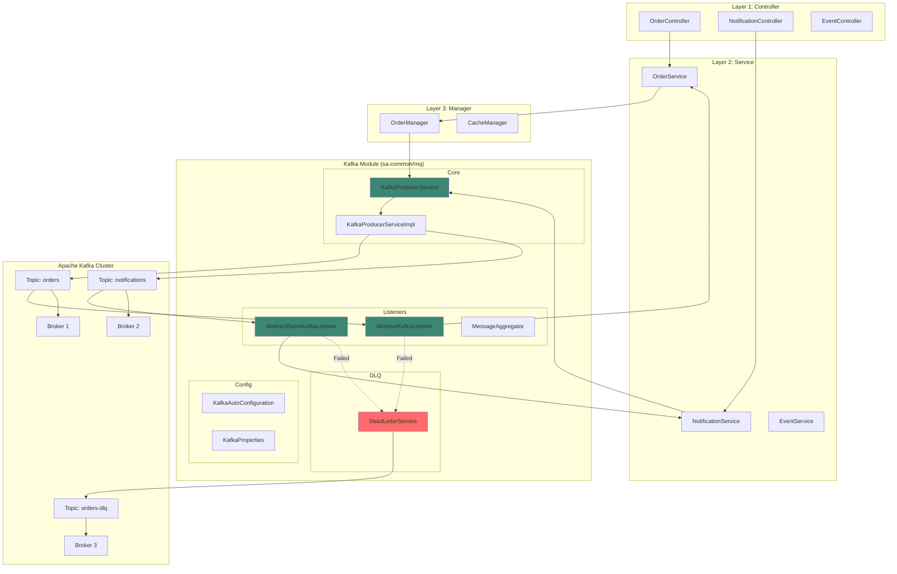

### Layer Responsibilities

| Layer | Responsibility | Kafka Usage |
|-------|---------------|-------------|
| **Controller** | HTTP API endpoints | Never touches Kafka directly |
| **Service** | Business logic orchestration | Can inject KafkaProducerService |
| **Manager** | Transaction + caching | Can inject KafkaProducerService |
| **Kafka Module** | Message production/consumption | Encapsulates Kafka complexity |

**Key Rule**: Controllers never directly interact with Kafka - always go through Service or Manager layer.

---

## Module Structure

```
sa-common/mq/src/main/java/net/lab1024/sa/common/mq/kafka/
│
├── config/                      # Configuration Layer
│   ├── KafkaAutoConfiguration.java
│   ├── KafkaProperties.java
│   └── BatchKafkaListenerContainerFactory.java
│
├── constant/                    # Constants
│   ├── KafkaConst.java          # Topic and Group ID constants
│   └── KafkaHeaders.java        # Custom header keys
│
├── core/                        # Producer Core
│   ├── KafkaProducerService.java       # Producer interface
│   └── KafkaProducerServiceImpl.java   # Implementation
│
├── listener/                    # Consumer Base Classes
│   ├── AbstractKafkaListener.java      # Single-message consumer
│   ├── AbstractBatchKafkaListener.java # Batch consumer
│   └── MessageAggregator.java          # Message aggregation
│
└── dlq/                         # Dead Letter Queue
    ├── DeadLetterService.java
    └── DeadLetterServiceImpl.java
```

### Component Dependency Graph

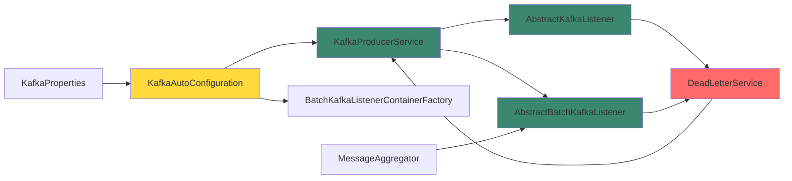

---

## Producer Architecture

### Producer Class Diagram

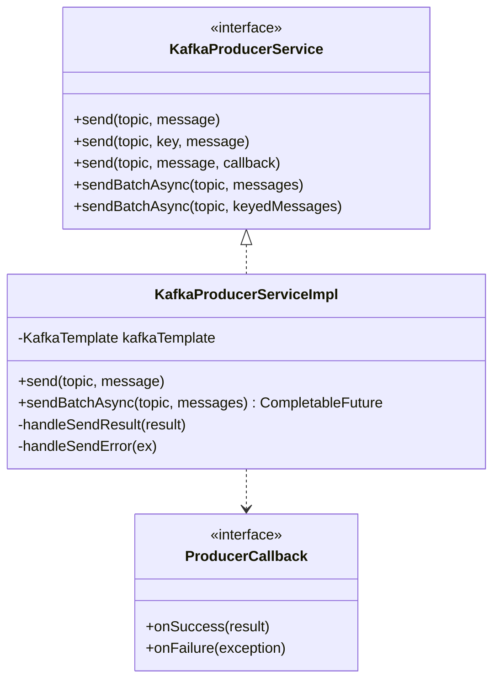

### Producer Message Flow

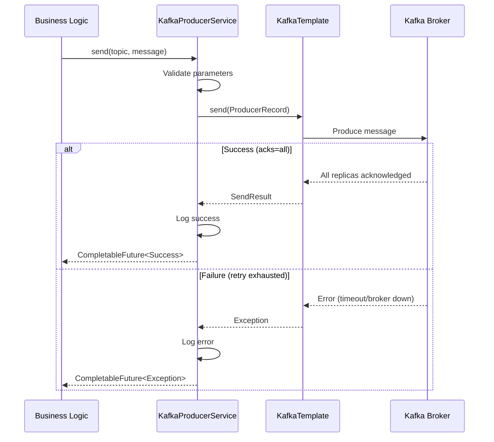

### Batch Send Flow

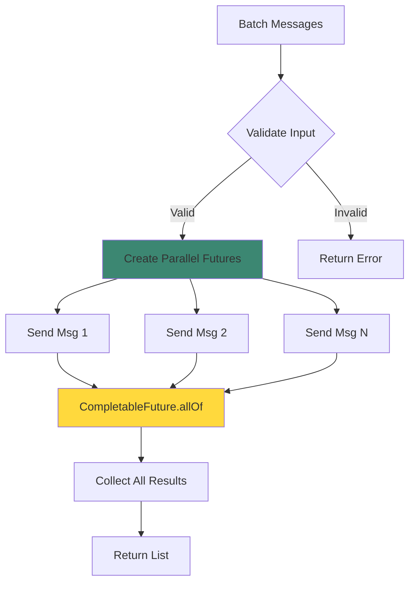

---

## Consumer Architecture

### Consumer Class Hierarchy

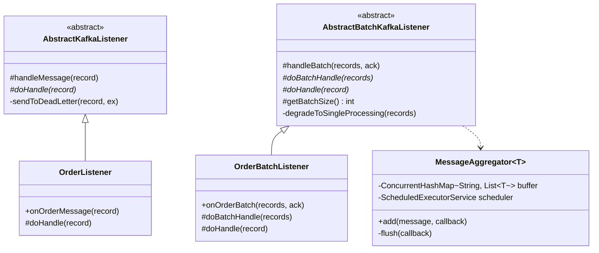

### Single Message Processing Flow

```mermaid
flowchart TB
    Start[Kafka delivers message] --> Listener[@KafkaListener receives]
    Listener --> Handle[handleMessage\nAbstractKafkaListener]

    Handle --> Try{Try doHandle}
    Try -->|Success| Log[Log success]
    Try -->|BusinessException| DLQ[Send to DLQ]
    Try -->|SystemException| DLQ

    Log --> Commit[Auto commit offset]
    DLQ --> LogError[Log error]
    LogError --> Commit

    Commit --> Done[Processing complete]

    style Try fill:#ffd93d
    style DLQ fill:#ff6b6b
    style Commit fill:#3c8772
```

### Batch Processing with Degradation

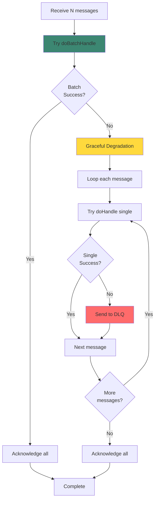

---

## Dead Letter Queue Architecture

### DLQ Flow

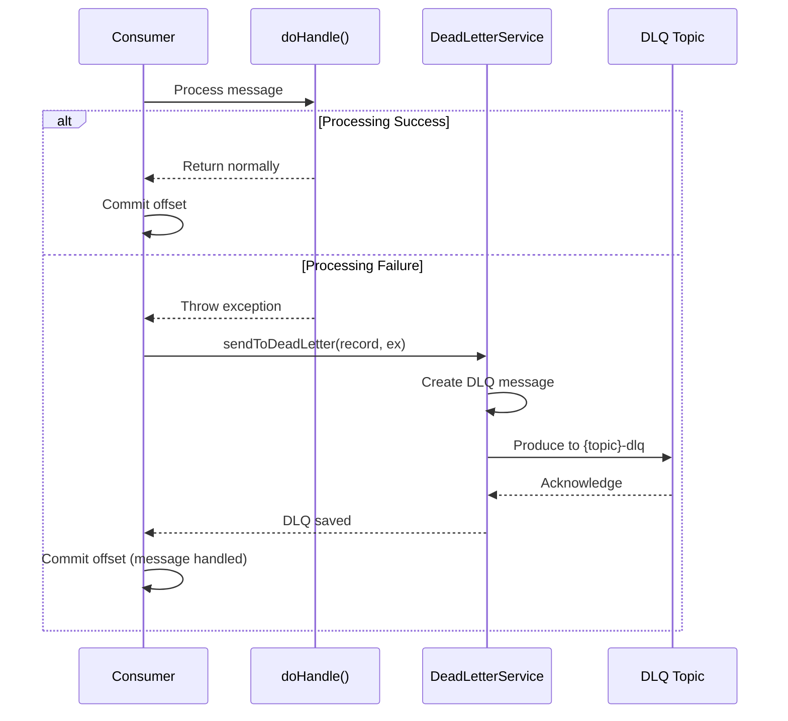

### DLQ Message Structure

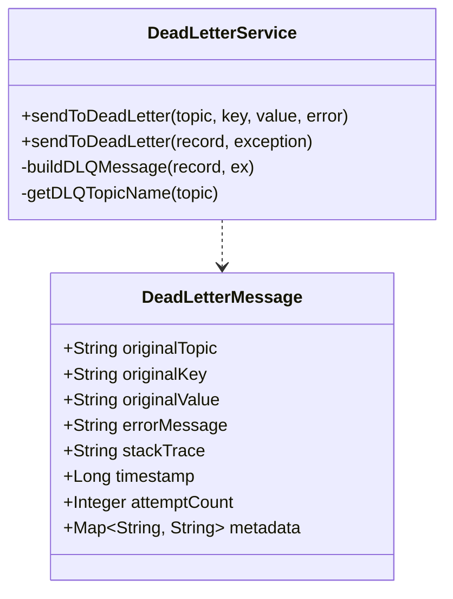

**DLQ Topic Naming**: `{original-topic}-dlq`
- Original: `smart-admin-order`
- DLQ: `smart-admin-order-dlq`

---

## Message Aggregation Architecture

### Aggregation Strategy

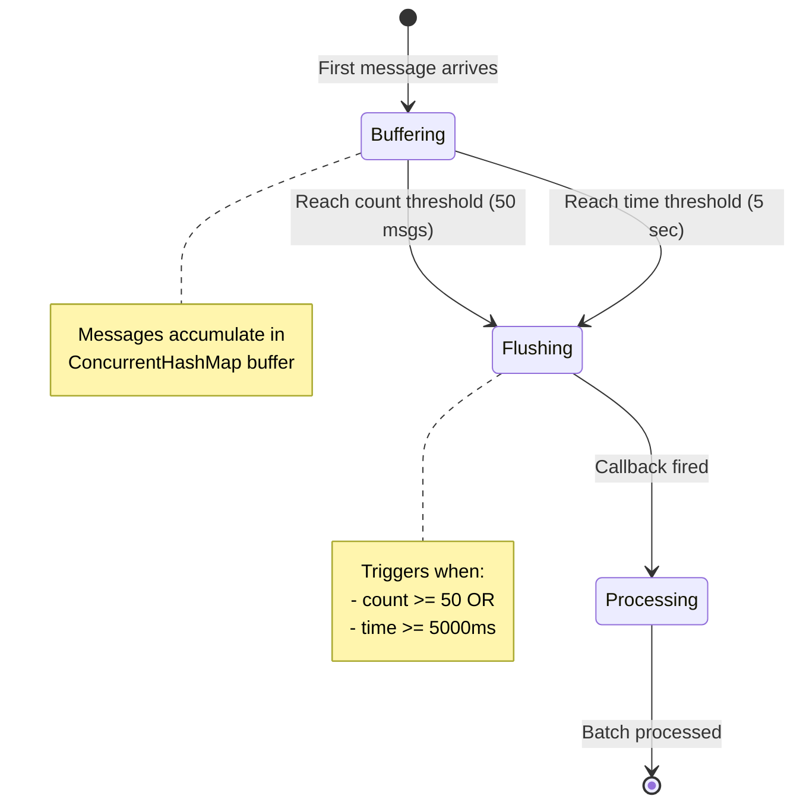

### Aggregator Internals

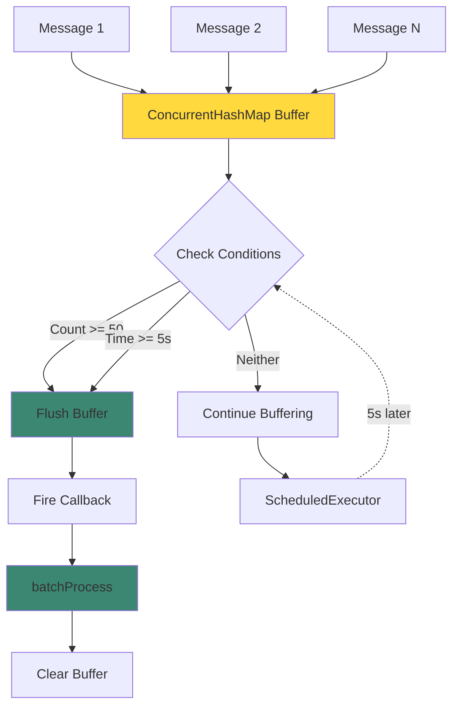

**Configuration**:
```yaml
smart:
  kafka:
    batch:
      aggregate:
        enabled: true
        count: 50              # Flush when 50 messages
        timeout-ms: 5000       # Or flush after 5 seconds
```

---

## Configuration Architecture

### Auto-Configuration Flow

```mermaid
graph TB
    Props[KafkaProperties] --> Condition{@ConditionalOnProperty\nsmart.kafka.enabled}

    Condition -->|true| AutoConfig[KafkaAutoConfiguration]
    Condition -->|false| Skip[Skip Kafka beans]

    AutoConfig --> ProducerBean[KafkaProducerService Bean]
    AutoConfig --> TemplateBean[KafkaTemplate Bean]
    AutoConfig --> DLQBean[DeadLetterService Bean]
    AutoConfig --> BatchFactory[BatchKafkaListenerContainerFactory]

    ProducerBean --> App[Application]
    DLQBean --> App

    style AutoConfig fill:#3c8772
    style Props fill:#ffd93d
```

### Configuration Properties

```yaml
smart:
  kafka:
    # Enable/Disable entire module
    enabled: true

    # Kafka cluster
    bootstrap-servers: localhost:9092

    # Producer settings
    producer:
      acks: all                          # Durability
      retries: 3                         # Reliability
      enable-idempotence: true           # Exactly-once semantics
      batch-size: 16384
      linger-ms: 5

    # Consumer settings
    consumer:
      enable-auto-commit: false          # Manual control
      max-poll-records: 500              # Batch size
      session-timeout-ms: 45000

    # Batch processing
    batch:
      enabled: true
      size: 100
      aggregate:
        enabled: true
        count: 50
        timeout-ms: 5000

    # Listener container
    listener:
      batch-listener: true
      ack-mode: manual
      concurrency: 3                     # 3 consumer threads
```

---

## Performance Characteristics

### Throughput Comparison

| Mode | Messages/sec | Latency (p50) | Latency (p99) | Use Case |
|------|-------------|--------------|--------------|----------|
| Single Send | 1,000 | 5ms | 20ms | Low volume, real-time |
| Batch Send | 5,000 | 10ms | 50ms | High volume, acceptable latency |
| Batch Consumer | 10,000 | 15ms | 80ms | Highest throughput |
| Aggregated Consumer | 8,000 | 20ms | 100ms | Balanced throughput + latency |

### Scaling Model

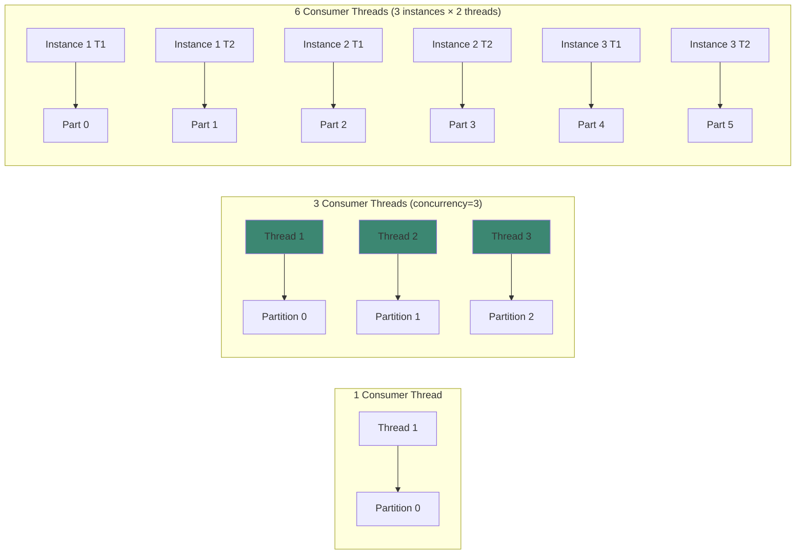

**Key Principle**: `Consumer Threads ≤ Topic Partitions` for optimal parallelism.

---

## Design Patterns Applied

| Pattern | Implementation | Benefit |
|---------|----------------|---------|
| **Template Method** | `AbstractKafkaListener` | Consistent error handling |
| **Strategy** | `KafkaProducerService` | Multiple send strategies |
| **Facade** | `KafkaProducerService` | Simplified Kafka API |
| **Observer** | `@KafkaListener` | Event-driven architecture |
| **Decorator** | Callback wrappers | Enhanced functionality |
| **Factory** | `BatchKafkaListenerContainerFactory` | Consistent bean creation |

---

## Reliability Guarantees

### Producer Guarantees

| Configuration | Guarantee | Trade-off |
|--------------|-----------|-----------|
| `acks=all` | Message replicated to all ISR | Higher latency |
| `enable.idempotence=true` | No duplicates | Requires `acks=all` |
| `retries=3` | Retry on transient errors | Potential reordering |
| `max.in.flight.requests=1` | Strict ordering | Lower throughput |

### Consumer Guarantees

| Configuration | Guarantee | Trade-off |
|--------------|-----------|-----------|
| `enable.auto.commit=false` | At-least-once delivery | Manual offset management |
| `isolation.level=read_committed` | Read only committed messages | Not applicable for non-transactional |
| DLQ enabled | No message loss | Storage cost |

---

## Monitoring and Observability

### Key Metrics

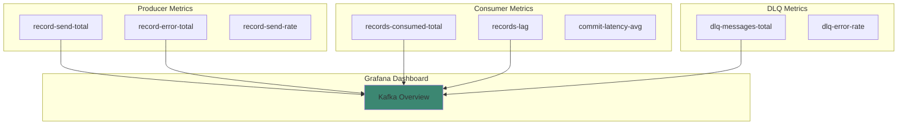

**Actuator Endpoints**:
- `/actuator/health/kafka` - Health status
- `/actuator/metrics/kafka.producer.*` - Producer metrics
- `/actuator/metrics/kafka.consumer.*` - Consumer metrics

---

## Summary

SmartAdmin Kafka architecture provides:

✅ **Production-Ready**: Idempotent producer, manual offset control, DLQ
✅ **High Performance**: Batch processing, message aggregation, parallel consumers
✅ **Fault-Tolerant**: Automatic retry, graceful degradation, circuit breaking
✅ **Observable**: Comprehensive metrics, health checks, logging
✅ **Maintainable**: Clean layering, template patterns, clear abstractions

---

## See Also

- [Module Structure](/kafka/architecture/module-structure) - Detailed code organization
- [Message Flow](/kafka/architecture/message-flow) - Sequence diagrams for all flows
- [Batch Processing](/kafka/architecture/batch-processing) - Batch architecture deep dive
- [Dead Letter Queue](/kafka/architecture/dead-letter-queue) - DLQ design and patterns
- [Configuration Guide](/kafka/guides/configuration) - All configuration options
