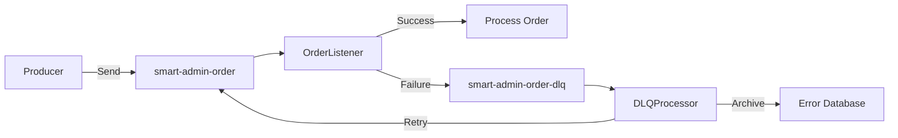

# DLQ Example

Complete example of Dead Letter Queue (DLQ) handling and recovery.

## Overview

This example demonstrates:
- Automatic DLQ routing on processing failures
- DLQ message structure and metadata
- DLQ consumer for analyzing failures
- Retry logic for recoverable errors
- Manual intervention workflow

**Use case**: Order processing with error recovery

---

## DLQ Flow



---

## Step 1: Domain Objects

**Order DTO**:
```java
package net.lab1024.sa.admin.module.business.sample.domain.dto;

import lombok.AllArgsConstructor;
import lombok.Builder;
import lombok.Data;
import lombok.NoArgsConstructor;

import java.math.BigDecimal;

@Data
@Builder
@NoArgsConstructor
@AllArgsConstructor
public class OrderDTO {
    private String orderId;
    private String customerId;
    private String productId;
    private Integer quantity;
    private BigDecimal amount;
    private String status;  // PENDING, CONFIRMED, FAILED
}
```

**Dead Letter Message** (auto-created by framework):
```java
package net.lab1024.sa.common.mq.kafka.domain;

import lombok.AllArgsConstructor;
import lombok.Builder;
import lombok.Data;
import lombok.NoArgsConstructor;

import java.time.LocalDateTime;

@Data
@Builder
@NoArgsConstructor
@AllArgsConstructor
public class DeadLetterMessage {
    private String originalTopic;
    private Integer originalPartition;
    private Long originalOffset;
    private String originalKey;
    private String originalValue;
    private String errorMessage;
    private String errorStackTrace;
    private LocalDateTime failedAt;
}
```

---

## Step 2: Order Processor (Main Consumer)

**File**: `sa-admin/src/main/java/net/lab1024/sa/admin/module/business/sample/listener/OrderListener.java`

```java
package net.lab1024.sa.admin.module.business.sample.listener;

import com.alibaba.fastjson2.JSON;
import lombok.RequiredArgsConstructor;
import lombok.extern.slf4j.Slf4j;
import net.lab1024.sa.admin.module.business.sample.domain.dto.OrderDTO;
import net.lab1024.sa.admin.module.business.sample.service.OrderService;
import net.lab1024.sa.base.common.exception.BusinessException;
import net.lab1024.sa.common.mq.kafka.listener.AbstractKafkaListener;
import org.apache.kafka.clients.consumer.ConsumerRecord;
import org.springframework.kafka.annotation.KafkaListener;
import org.springframework.stereotype.Component;

@Component
@Slf4j
@RequiredArgsConstructor
public class OrderListener extends AbstractKafkaListener {

    private final OrderService orderService;

    @KafkaListener(
        topics = "smart-admin-order",
        groupId = "order-processor"
    )
    public void onMessage(ConsumerRecord<String, String> record) {
        handleMessage(record);
    }

    @Override
    protected void doHandle(ConsumerRecord<String, String> record) {
        log.info("📥 Received order | Key: {}", record.key());

        OrderDTO order = JSON.parseObject(record.value(), OrderDTO.class);

        // Validate order
        validateOrder(order);

        // Process order
        orderService.processOrder(order);

        log.info("✅ Order processed successfully | OrderId: {}", order.getOrderId());
    }

    private void validateOrder(OrderDTO order) {
        // Simulate validation errors for testing
        if (order.getQuantity() <= 0) {
            throw new BusinessException("Invalid quantity: " + order.getQuantity());
        }

        if (order.getAmount().compareTo(BigDecimal.ZERO) <= 0) {
            throw new BusinessException("Invalid amount: " + order.getAmount());
        }

        if ("INVALID".equals(order.getStatus())) {
            throw new BusinessException("Invalid order status");
        }
    }
}
```

---

## Step 3: DLQ Consumer

**File**: `sa-admin/src/main/java/net/lab1024/sa/admin/module/business/sample/listener/OrderDLQListener.java`

```java
package net.lab1024.sa.admin.module.business.sample.listener;

import com.alibaba.fastjson2.JSON;
import lombok.RequiredArgsConstructor;
import lombok.extern.slf4j.Slf4j;
import net.lab1024.sa.admin.module.business.sample.domain.dto.OrderDTO;
import net.lab1024.sa.admin.module.business.sample.service.OrderDLQService;
import net.lab1024.sa.common.mq.kafka.domain.DeadLetterMessage;
import net.lab1024.sa.common.mq.kafka.service.KafkaProducerService;
import org.apache.kafka.clients.consumer.ConsumerRecord;
import org.springframework.kafka.annotation.KafkaListener;
import org.springframework.stereotype.Component;

@Component
@Slf4j
@RequiredArgsConstructor
public class OrderDLQListener {

    private final OrderDLQService orderDLQService;
    private final KafkaProducerService kafkaProducerService;

    @KafkaListener(
        topics = "smart-admin-order-dlq",
        groupId = "order-dlq-processor"
    )
    public void onDLQMessage(ConsumerRecord<String, String> record) {
        log.warn("⚠️ Processing DLQ message | Key: {}", record.key());

        try {
            DeadLetterMessage dlqMessage = JSON.parseObject(record.value(), DeadLetterMessage.class);

            // Log DLQ details
            log.error("DLQ Message Details | OriginalTopic: {} | Partition: {} | Offset: {} | Error: {}",
                dlqMessage.getOriginalTopic(),
                dlqMessage.getOriginalPartition(),
                dlqMessage.getOriginalOffset(),
                dlqMessage.getErrorMessage());

            // Parse original order
            OrderDTO order = JSON.parseObject(dlqMessage.getOriginalValue(), OrderDTO.class);

            // Analyze and decide action
            DLQAction action = analyzeError(dlqMessage, order);

            switch (action) {
                case RETRY -> retryOrder(dlqMessage, order);
                case ARCHIVE -> archiveError(dlqMessage, order);
                case ALERT -> alertTeam(dlqMessage, order);
            }

        } catch (Exception e) {
            log.error("❌ Failed to process DLQ message | Key: {}", record.key(), e);
            // Prevent infinite loop - don't rethrow
        }
    }

    private DLQAction analyzeError(DeadLetterMessage dlqMessage, OrderDTO order) {
        String errorMsg = dlqMessage.getErrorMessage();

        // Retriable errors
        if (errorMsg.contains("timeout") || errorMsg.contains("connection")) {
            return DLQAction.RETRY;
        }

        // Validation errors - archive
        if (errorMsg.contains("Invalid")) {
            return DLQAction.ARCHIVE;
        }

        // Unknown errors - alert team
        return DLQAction.ALERT;
    }

    private void retryOrder(DeadLetterMessage dlqMessage, OrderDTO order) {
        log.info("🔁 Retrying order | OrderId: {}", order.getOrderId());

        // Fix order if possible
        if ("INVALID".equals(order.getStatus())) {
            order.setStatus("PENDING");
        }

        // Republish to original topic
        String orderJson = JSON.toJSONString(order);
        kafkaProducerService.send("smart-admin-order", dlqMessage.getOriginalKey(), orderJson);

        log.info("✅ Order republished for retry | OrderId: {}", order.getOrderId());
    }

    private void archiveError(DeadLetterMessage dlqMessage, OrderDTO order) {
        log.warn("📁 Archiving error | OrderId: {}", order.getOrderId());

        // Save to error database for manual review
        orderDLQService.archiveError(dlqMessage, order);

        log.info("✅ Error archived | OrderId: {}", order.getOrderId());
    }

    private void alertTeam(DeadLetterMessage dlqMessage, OrderDTO order) {
        log.error("🚨 Alerting team | OrderId: {}", order.getOrderId());

        // Send alert (email, Slack, PagerDuty, etc.)
        orderDLQService.sendAlert(dlqMessage, order);

        // Also archive for investigation
        archiveError(dlqMessage, order);
    }

    enum DLQAction {
        RETRY,    // Retry processing
        ARCHIVE,  // Save for manual review
        ALERT     // Alert team
    }
}
```

---

## Step 4: DLQ Service

**File**: `sa-admin/src/main/java/net/lab1024/sa/admin/module/business/sample/service/OrderDLQService.java`

```java
package net.lab1024.sa.admin.module.business.sample.service;

import com.alibaba.fastjson2.JSON;
import lombok.RequiredArgsConstructor;
import lombok.extern.slf4j.Slf4j;
import net.lab1024.sa.admin.module.business.sample.domain.dto.OrderDTO;
import net.lab1024.sa.admin.module.business.sample.domain.entity.OrderErrorEntity;
import net.lab1024.sa.admin.module.business.sample.manager.OrderErrorManager;
import net.lab1024.sa.common.mq.kafka.domain.DeadLetterMessage;
import org.springframework.stereotype.Service;

@Service
@Slf4j
@RequiredArgsConstructor
public class OrderDLQService {

    private final OrderErrorManager orderErrorManager;

    /**
     * Archive error to database
     */
    public void archiveError(DeadLetterMessage dlqMessage, OrderDTO order) {
        OrderErrorEntity errorEntity = new OrderErrorEntity();
        errorEntity.setOrderId(order.getOrderId());
        errorEntity.setOriginalTopic(dlqMessage.getOriginalTopic());
        errorEntity.setOriginalMessage(dlqMessage.getOriginalValue());
        errorEntity.setErrorMessage(dlqMessage.getErrorMessage());
        errorEntity.setErrorStackTrace(dlqMessage.getErrorStackTrace());
        errorEntity.setFailedAt(dlqMessage.getFailedAt());
        errorEntity.setStatus("ARCHIVED");

        orderErrorManager.save(errorEntity);
    }

    /**
     * Send alert to monitoring system
     */
    public void sendAlert(DeadLetterMessage dlqMessage, OrderDTO order) {
        String alertMessage = String.format(
            "Order processing failed: OrderId=%s, Error=%s",
            order.getOrderId(),
            dlqMessage.getErrorMessage()
        );

        log.error("🚨 ALERT: {}", alertMessage);

        // Integrate with your alerting system:
        // - Email
        // - Slack webhook
        // - PagerDuty
        // - Custom monitoring
    }
}
```

---

## Step 5: Test DLQ Flow

### Send Valid Order

```bash
curl -X POST http://localhost:1024/business/sample/kafka/basic/send \
  -H "Content-Type: application/json" \
  -d '{
    "orderId": "ORD-001",
    "customerId": "CUST-123",
    "productId": "PROD-456",
    "quantity": 2,
    "amount": 199.99,
    "status": "PENDING"
  }'
```

**Expected**: Processed successfully, no DLQ message

---

### Send Invalid Order (Triggers DLQ)

```bash
curl -X POST http://localhost:1024/business/sample/kafka/basic/send \
  -H "Content-Type: application/json" \
  -d '{
    "orderId": "ORD-002",
    "customerId": "CUST-456",
    "productId": "PROD-789",
    "quantity": -1,
    "amount": 99.99,
    "status": "PENDING"
  }'
```

**Expected logs**:

**OrderListener**:
```
INFO  OrderListener - 📥 Received order | Key: ORD-002
ERROR OrderListener - ❌ Message processing failed | Topic: smart-admin-order | Key: ORD-002
WARN  AbstractKafkaListener - ⚠️ Message sent to DLQ | Topic: smart-admin-order-dlq | Key: ORD-002
```

**OrderDLQListener**:
```
WARN  OrderDLQListener - ⚠️ Processing DLQ message | Key: ORD-002
ERROR OrderDLQListener - DLQ Message Details | OriginalTopic: smart-admin-order | Error: Invalid quantity: -1
WARN  OrderDLQListener - 📁 Archiving error | OrderId: ORD-002
INFO  OrderDLQListener - ✅ Error archived | OrderId: ORD-002
```

---

## Step 6: View DLQ Messages

### Using Kafka Console Consumer

```bash
docker exec smart-admin-kafka kafka-console-consumer \
  --bootstrap-server localhost:9092 \
  --topic smart-admin-order-dlq \
  --from-beginning \
  --max-messages 1 \
  --property print.key=true \
  --property key.separator=":"
```

**Example output**:
```json
ORD-002:{
  "originalTopic": "smart-admin-order",
  "originalPartition": 1,
  "originalOffset": 42,
  "originalKey": "ORD-002",
  "originalValue": "{\"orderId\":\"ORD-002\",\"quantity\":-1,...}",
  "errorMessage": "Invalid quantity: -1",
  "errorStackTrace": "net.lab1024.sa.base.common.exception.BusinessException: Invalid quantity: -1\n\tat ...",
  "failedAt": "2026-01-22T14:30:15"
}
```

---

## Step 7: Monitor DLQ Metrics

**Query DLQ message count**:
```bash
docker exec smart-admin-kafka kafka-run-class \
  kafka.tools.GetOffsetShell \
  --broker-list localhost:9092 \
  --topic smart-admin-order-dlq
```

**Check consumer lag**:
```bash
docker exec smart-admin-kafka kafka-consumer-groups \
  --bootstrap-server localhost:9092 \
  --describe --group order-dlq-processor
```

---

## Best Practices Demonstrated

1. ✅ **Automatic DLQ routing** - Framework handles routing on exceptions
2. ✅ **Error analysis** - Categorize errors (retriable vs. permanent)
3. ✅ **Retry logic** - Automatically retry recoverable errors
4. ✅ **Error archiving** - Save to database for manual review
5. ✅ **Alerting** - Notify team of critical errors
6. ✅ **No infinite loops** - DLQ consumer doesn't rethrow exceptions

---

## Common DLQ Patterns

### Pattern 1: Scheduled Retry with Delay

```java
@Scheduled(fixedDelay = 300000)  // Every 5 minutes
public void retryDLQMessages() {
    List<OrderErrorEntity> errors = orderErrorManager.findRetryable();

    errors.forEach(error -> {
        try {
            kafkaProducerService.send("smart-admin-order", error.getOrderId(), error.getOriginalMessage());
            orderErrorManager.markRetried(error.getId());
        } catch (Exception e) {
            log.error("Retry failed for: {}", error.getOrderId(), e);
        }
    });
}
```

### Pattern 2: Manual Review Dashboard

Create admin UI to:
- View DLQ messages
- Filter by error type
- Manually retry selected messages
- Mark as resolved/ignored

---

## See Also

- [Error Handling](/kafka/guides/error-handling) - Error handling strategies
- [Dead Letter Queue Architecture](/kafka/architecture/dead-letter-queue) - DLQ design
- [Monitoring](/kafka/operations/monitoring) - Monitor DLQ metrics

---

**Last Updated**: 2026-01-22
