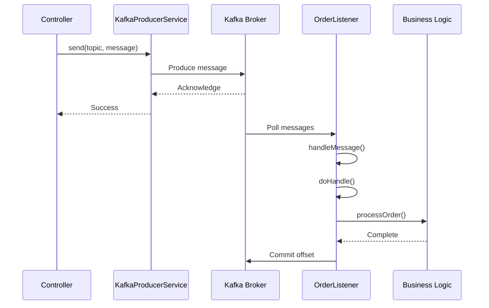

# Quick Start

Get up and running with SmartAdmin Kafka in 5 minutes.

::: tip
This guide will help you send and receive your first Kafka message in the SmartAdmin framework.
:::

## Prerequisites

- Java 21+
- Kafka 3.x running locally or remotely
- SmartAdmin project setup

## Step 1: Module Structure

SmartAdmin's Kafka integration is located in:

```
sa-common/mq/src/main/java/net/lab1024/sa/common/mq/kafka/
├── config/          # Auto-configuration
├── constant/        # Topic and Group constants
├── core/            # KafkaProducerService
├── listener/        # AbstractKafkaListener base class
└── dlq/             # Dead Letter Queue handling
```

No additional dependencies needed - the module is included in SmartAdmin.

## Step 2: Configure Kafka

Add configuration to `application.yml`:

```yaml
smart:
  kafka:
    # Connection settings
    bootstrap-servers: localhost:9092

    # Producer configuration
    producer:
      acks: all                          # Wait for all replicas
      retries: 3                         # Retry failed sends
      enable-idempotence: true           # Avoid duplicates
      batch-size: 16384                  # Batch size in bytes
      linger-ms: 5                       # Low latency

    # Consumer configuration
    consumer:
      enable-auto-commit: false          # Manual acknowledgment
      auto-offset-reset: earliest        # Start from beginning
      max-poll-records: 500              # Batch size per poll
```

## Step 3: Define Topic Constants

Create Kafka constants (best practice):

```java
package com.smartadmin.module.business.kafka;

public class KafkaConst {

    public static class Topic {
        public static final String ORDER = "smart-admin-order";
        public static final String NOTIFICATION = "smart-admin-notification";
    }

    public static class Group {
        public static final String ORDER = "smart-admin-order-group";
        public static final String NOTIFICATION = "smart-admin-notification-group";
    }
}
```

## Step 4: Send Messages (Producer)

Inject `KafkaProducerService` in your controller or service:

```java
@RestController
@RequestMapping("/api/order")
@RequiredArgsConstructor
public class OrderController {

    private final KafkaProducerService kafkaProducerService;

    @PostMapping("/create")
    public ResponseDTO<Void> createOrder(@RequestBody OrderForm form) {
        // Business logic...

        // Send message to Kafka
        kafkaProducerService.send(
            KafkaConst.Topic.ORDER,
            "Order created: " + form.getOrderNo()
        );

        return ResponseDTO.ok();
    }
}
```

## Step 5: Consume Messages (Consumer)

Extend `AbstractKafkaListener` for automatic error handling and DLQ support:

```java
@Component
@Slf4j
public class OrderListener extends AbstractKafkaListener {

    @KafkaListener(
        topics = KafkaConst.Topic.ORDER,
        groupId = KafkaConst.Group.ORDER
    )
    public void onOrderMessage(ConsumerRecord<String, String> record) {
        handleMessage(record);  // Delegates to AbstractKafkaListener
    }

    @Override
    protected void doHandle(ConsumerRecord<String, String> record) {
        String message = record.value();
        log.info("Processing order message: {}", message);

        // Your business logic here
        processOrder(message);
    }

    private void processOrder(String message) {
        // Business processing logic
        log.info("Order processed successfully");
    }
}
```

## Step 6: Test End-to-End

### 6.1 Start Kafka

Using Docker Compose (recommended):

```bash
cd docker
docker-compose up -d kafka
```

### 6.2 Start Application

```bash
cd smart-admin-api-java21-springboot3
./gradlew :sa-admin:bootRun
```

### 6.3 Send Test Message

```bash
curl -X POST "http://localhost:1024/api/order/create" \
  -H "Content-Type: application/json" \
  -d '{
    "orderNo": "ORD-2026-001",
    "productName": "SmartAdmin License",
    "amount": 999.00
  }'
```

### 6.4 Verify

Check application logs for:

```
📨 Processing order message: Order created: ORD-2026-001
✅ Order processed successfully
```

## Message Flow Diagram



## What's Happening?

1. **Producer Side**:
   - Controller receives HTTP request
   - Calls `KafkaProducerService.send()` to publish message
   - Message is sent to Kafka broker with `acks=all` guarantee

2. **Consumer Side**:
   - `@KafkaListener` polls messages from Kafka
   - `AbstractKafkaListener.handleMessage()` provides error handling wrapper
   - Your `doHandle()` method contains business logic
   - On success: offset is committed automatically
   - On failure: message sent to Dead Letter Queue (DLQ)

## Key Features Enabled

- ✅ **Idempotent Producer**: No duplicate messages (`enable-idempotence: true`)
- ✅ **At-Least-Once Delivery**: Messages won't be lost (`acks: all`)
- ✅ **Manual Offset Control**: Precise message acknowledgment
- ✅ **Automatic DLQ**: Failed messages go to Dead Letter Queue
- ✅ **Retry Logic**: Producer retries 3 times on failure

## Next Steps

- [Quick Reference](/kafka/getting-started/quick-reference) - API cheat sheet and common patterns
- [Hello World Example](/kafka/getting-started/hello-world) - Complete runnable project
- [Architecture Overview](/kafka/architecture/overview) - Understand the design
- [Producer Guide](/kafka/guides/producer-guide) - Advanced producer patterns
- [Consumer Guide](/kafka/guides/consumer-guide) - Advanced consumer patterns
- [Batch Processing](/kafka/guides/batch-operations) - High-throughput scenarios
