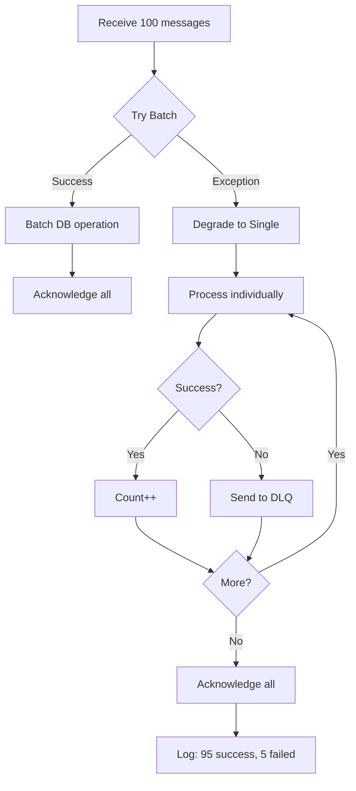

# Batch Operations

Comprehensive guide to batch sending and consuming patterns in SmartAdmin's Kafka integration for maximum throughput.

## Overview

Batch operations dramatically improve Kafka performance by reducing network overhead and enabling efficient bulk processing:

| Operation | Single | Batch | Improvement |
|-----------|--------|-------|-------------|
| **Producer** | 1,000 msg/s | 5,000 msg/s | 5x throughput |
| **Consumer** | 2,000 msg/s | 10,000 msg/s | 5x throughput |
| **Network calls** | 1 per message | 1 per batch | 100x fewer |
| **DB operations** | 1 per message | 1 per batch | 100x fewer |

---

## Batch Sending

### Parallel Batch Send API

```java
@Service
@RequiredArgsConstructor
@Slf4j
public class OrderBatchProducer {

    private final KafkaProducerService kafkaProducerService;

    public void sendOrderBatch(List<OrderEntity> orders) {
        // Convert to messages
        List<String> messages = orders.stream()
            .map(order -> JSON.toJSONString(order))
            .toList();

        // Send batch asynchronously
        CompletableFuture<List<SendResult<String, String>>> future =
            kafkaProducerService.sendBatchAsync(KafkaConst.Topic.ORDER, messages);

        // Handle results
        future.thenAccept(results -> {
            log.info("Sent {} orders successfully", results.size());
            updateOrderStatuses(orders, results);
        }).exceptionally(ex -> {
            log.error("Batch send failed", ex);
            handleFailure(orders);
            return null;
        });
    }
}
```

### Batch Send with Keys

```java
public void sendKeyedBatch(List<UserEvent> events) {
    // Create keyed messages
    List<Map.Entry<String, String>> keyedMessages = events.stream()
        .map(event -> Map.entry(
            "USER-" + event.getUserId(),     // Key for partitioning
            JSON.toJSONString(event)         // Value
        ))
        .toList();

    // Send batch with keys
    CompletableFuture<List<SendResult<String, String>>> future =
        kafkaProducerService.sendBatchAsync(KafkaConst.Topic.USER_EVENTS, keyedMessages);

    future.thenAccept(results ->
        log.info("Sent {} keyed events to {} partitions",
            results.size(),
            results.stream()
                .map(r -> r.getRecordMetadata().partition())
                .distinct()
                .count())
    );
}
```

### Accumulator Pattern

For continuous streams, accumulate messages and flush periodically:

```java
@Service
@RequiredArgsConstructor
@Slf4j
public class AccumulatingProducer {

    private final KafkaProducerService kafkaProducerService;
    private final List<String> messageBuffer = new CopyOnWriteArrayList<>();

    private static final int BATCH_SIZE = 100;
    private static final long FLUSH_INTERVAL_MS = 5000;

    @PostConstruct
    public void init() {
        // Schedule periodic flush
        ScheduledExecutorService scheduler = Executors.newSingleThreadScheduledExecutor();
        scheduler.scheduleAtFixedRate(
            this::flushBuffer,
            FLUSH_INTERVAL_MS,
            FLUSH_INTERVAL_MS,
            TimeUnit.MILLISECONDS
        );
    }

    public void send(String message) {
        messageBuffer.add(message);

        // Flush immediately when batch size reached
        if (messageBuffer.size() >= BATCH_SIZE) {
            flushBuffer();
        }
    }

    private void flushBuffer() {
        if (messageBuffer.isEmpty()) {
            return;
        }

        // Copy and clear buffer atomically
        List<String> batch = new ArrayList<>(messageBuffer);
        messageBuffer.clear();

        // Send batch
        kafkaProducerService.sendBatchAsync(KafkaConst.Topic.ORDER, batch)
            .thenAccept(results ->
                log.info("Flushed batch of {} messages", results.size())
            )
            .exceptionally(ex -> {
                log.error("Batch flush failed", ex);
                // Re-add failed messages or log for retry
                return null;
            });
    }
}
```

**Trigger Conditions**:
- **Count threshold**: Buffer reaches 100 messages
- **Time threshold**: 5 seconds elapsed since last flush
- **Whichever comes first**: Ensures low latency + high throughput

---

## Batch Consuming

### AbstractBatchKafkaListener

The recommended pattern for batch consumption:

```java
@Component
@Slf4j
public class OrderBatchConsumer extends AbstractBatchKafkaListener<OrderDTO> {

    @Autowired
    private OrderService orderService;

    @KafkaListener(
        topics = KafkaConst.Topic.ORDER,
        groupId = KafkaConst.Group.ORDER_BATCH,
        containerFactory = "batchKafkaListenerContainerFactory"
    )
    public void onOrderBatch(
        List<ConsumerRecord<String, String>> records,
        Acknowledgment ack
    ) {
        handleBatch(records, ack);
    }

    @Override
    protected void doBatchHandle(List<ConsumerRecord<String, String>> records) {
        // Parse batch
        List<OrderDTO> orders = records.stream()
            .map(r -> JSON.parseObject(r.value(), OrderDTO.class))
            .toList();

        log.info("Processing batch of {} orders", orders.size());

        // Efficient batch DB operation
        orderService.batchInsert(orders);

        log.info("Batch processed successfully");
    }

    @Override
    protected void doHandle(ConsumerRecord<String, String> record) {
        // Single-message fallback (auto-degradation)
        OrderDTO order = JSON.parseObject(record.value(), OrderDTO.class);
        orderService.insert(order);
    }

    @Override
    protected int getBatchSize() {
        return 100;  // Max messages per batch
    }
}
```

### Batch Configuration

```yaml
smart:
  kafka:
    consumer:
      max-poll-records: 500        # Fetch up to 500 messages per poll

    listener:
      batch-listener: true         # Enable batch mode
      ack-mode: manual             # Manual acknowledgment
      concurrency: 3               # 3 concurrent consumers

    batch:
      enabled: true
      size: 100                    # Max batch size for processing
```

---

## Message Aggregation

### Time or Count-Based Aggregation

`MessageAggregator` accumulates messages and triggers callbacks based on count or timeout:

```java
@Component
@RequiredArgsConstructor
@Slf4j
public class OrderAggregationConsumer {

    private final MessageAggregator<OrderDTO> aggregator;
    private final OrderService orderService;

    @KafkaListener(
        topics = KafkaConst.Topic.ORDER,
        groupId = KafkaConst.Group.ORDER_AGGREGATED
    )
    public void handleMessage(ConsumerRecord<String, String> record) {
        OrderDTO order = JSON.parseObject(record.value(), OrderDTO.class);

        // Add to aggregator
        aggregator.add(order, this::processBatch);
    }

    private void processBatch(List<OrderDTO> orders) {
        log.info("Processing aggregated batch of {} orders", orders.size());

        // Efficient batch database operation
        orderService.batchInsert(orders);

        log.info("Aggregated batch processed successfully");
    }
}
```

### Aggregator Configuration

```yaml
smart:
  kafka:
    batch:
      aggregate:
        enabled: true
        count: 50                  # Aggregate 50 messages
        timeout-ms: 5000           # Or 5 seconds timeout
```

**Callback Triggers**:
1. **Count threshold**: 50 messages accumulated
2. **Time threshold**: 5 seconds since first message
3. **Whichever comes first**: Callback fires

### Key-Based Aggregation

Aggregate by partition key for related messages:

```java
@Component
@RequiredArgsConstructor
@Slf4j
public class UserEventAggregator {

    private final Map<String, List<UserEvent>> userBuffers = new ConcurrentHashMap<>();
    private final UserEventService userEventService;

    @KafkaListener(
        topics = KafkaConst.Topic.USER_EVENTS,
        groupId = KafkaConst.Group.USER_EVENTS
    )
    public void handleEvent(ConsumerRecord<String, String> record) {
        String userId = record.key();  // USER-12345
        UserEvent event = JSON.parseObject(record.value(), UserEvent.class);

        // Add to user-specific buffer
        userBuffers.computeIfAbsent(userId, k -> new ArrayList<>()).add(event);

        // Flush if user's buffer reaches threshold
        List<UserEvent> userEvents = userBuffers.get(userId);
        if (userEvents.size() >= 20) {
            flushUserEvents(userId, userEvents);
        }
    }

    @Scheduled(fixedDelay = 10000)  // Flush every 10 seconds
    public void flushAll() {
        userBuffers.forEach(this::flushUserEvents);
        userBuffers.clear();
    }

    private void flushUserEvents(String userId, List<UserEvent> events) {
        if (events.isEmpty()) {
            return;
        }

        log.info("Processing {} events for user {}", events.size(), userId);
        userEventService.batchProcess(userId, events);
        userBuffers.remove(userId);
    }
}
```

---

## Performance Optimization

### Database Batch Insert

**MyBatis Plus Batch Insert**:

```java
@Service
@RequiredArgsConstructor
public class OrderService {

    private final OrderDao orderDao;

    public void batchInsert(List<OrderDTO> orders) {
        // Convert to entities
        List<OrderEntity> entities = SmartBeanUtil.copyList(orders, OrderEntity.class);

        // Batch insert (MyBatis Plus)
        orderDao.insertBatch(entities);

        log.info("Batch inserted {} orders", entities.size());
    }
}

// Dao layer
@Mapper
public interface OrderDao extends BaseMapper<OrderEntity> {

    @Insert("<script>" +
        "INSERT INTO t_order (order_no, amount, user_id, create_time) VALUES " +
        "<foreach collection='list' item='item' separator=','>" +
        "(#{item.orderNo}, #{item.amount}, #{item.userId}, #{item.createTime})" +
        "</foreach>" +
        "</script>")
    void insertBatch(List<OrderEntity> entities);
}
```

**Performance Comparison**:

| Method | 1,000 Orders | Network Calls | Time |
|--------|--------------|---------------|------|
| **Single Insert** | 1,000 INSERTs | 1,000 | ~10s |
| **Batch Insert** | 1 INSERT | 1 | ~0.2s |
| **Improvement** | - | 1000x fewer | 50x faster |

### Batch Size Guidelines

```java
@Override
protected int getBatchSize() {
    // Consider:
    // 1. Message processing time
    // 2. Available memory
    // 3. max-poll-interval-ms timeout

    return 100;  // Recommended starting point
}
```

**Tuning Formula**:
```
batch_size * avg_processing_time < max_poll_interval_ms

Example:
100 messages * 100ms/msg = 10,000ms = 10s
(must be < 300,000ms default timeout)
```

**Guidelines by Processing Speed**:
- **Fast (<10ms/msg)**: Batch size 500-1000
- **Medium (10-100ms/msg)**: Batch size 100-500
- **Slow (>100ms/msg)**: Batch size 10-100

---

## Graceful Degradation

### Degradation Flow



### Implementation

Built into `AbstractBatchKafkaListener`:

```java
private void degradeToSingleProcessing(
    List<ConsumerRecord<String, String>> records,
    Acknowledgment ack
) {
    int successCount = 0;
    int failureCount = 0;

    log.warn("Degrading to single-message processing for {} messages", records.size());

    for (ConsumerRecord<String, String> record : records) {
        try {
            doHandle(record);  // Your single-message logic
            successCount++;
        } catch (Exception e) {
            log.error("Single processing failed: key={}", record.key(), e);
            sendToDeadLetter(record, e);  // Auto-DLQ
            failureCount++;
        }
    }

    ack.acknowledge();  // Always acknowledge
    log.info("Degradation complete: {} success, {} failed", successCount, failureCount);
}
```

**Benefits**:
- ✅ **Partial success**: Some messages succeed even if batch fails
- ✅ **No message loss**: Failed messages go to DLQ
- ✅ **Always commits**: Offset committed after degradation
- ✅ **Automatic**: No manual intervention required

---

## Best Practices

### 1. Transaction Boundaries

```java
@Service
@RequiredArgsConstructor
public class TransactionalBatchService {

    private final OrderDao orderDao;
    private final InventoryService inventoryService;

    @Transactional(rollbackFor = Throwable.class)
    public void processBatch(List<OrderDTO> orders) {
        // All operations in one transaction
        List<OrderEntity> entities = convertToEntities(orders);

        // Batch insert orders
        orderDao.insertBatch(entities);

        // Batch update inventory
        inventoryService.batchDecrement(orders);

        // Both commit or rollback together
    }
}
```

### 2. Memory Management

```java
@Override
protected void doBatchHandle(List<ConsumerRecord<String, String>> records) {
    // Process in sub-batches to manage memory
    int subBatchSize = 50;

    for (int i = 0; i < records.size(); i += subBatchSize) {
        int end = Math.min(i + subBatchSize, records.size());
        List<ConsumerRecord<String, String>> subBatch = records.subList(i, end);

        // Process sub-batch
        List<OrderDTO> orders = subBatch.stream()
            .map(r -> JSON.parseObject(r.value(), OrderDTO.class))
            .toList();

        orderService.batchInsert(orders);

        log.info("Processed sub-batch {}-{} of {}", i, end, records.size());
    }
}
```

### 3. Error Isolation

```java
@Override
protected void doBatchHandle(List<ConsumerRecord<String, String>> records) {
    // Separate parsing from processing
    List<OrderDTO> validOrders = new ArrayList<>();
    List<ConsumerRecord<String, String>> invalidRecords = new ArrayList<>();

    // Step 1: Parse and validate
    for (ConsumerRecord<String, String> record : records) {
        try {
            OrderDTO order = JSON.parseObject(record.value(), OrderDTO.class);
            if (isValid(order)) {
                validOrders.add(order);
            } else {
                invalidRecords.add(record);
            }
        } catch (JSONException e) {
            invalidRecords.add(record);
        }
    }

    // Step 2: Process valid orders
    if (!validOrders.isEmpty()) {
        orderService.batchInsert(validOrders);
    }

    // Step 3: Send invalid to DLQ
    for (ConsumerRecord<String, String> record : invalidRecords) {
        sendToDeadLetter(record, new BusinessException("Invalid message"));
    }

    log.info("Batch: {} valid, {} invalid", validOrders.size(), invalidRecords.size());
}
```

### 4. Monitoring

```java
@Component
@RequiredArgsConstructor
public class BatchMetrics {

    private final MeterRegistry meterRegistry;

    public void recordBatchSend(int batchSize, long durationMs) {
        meterRegistry.timer("kafka.batch.send.duration").record(durationMs, TimeUnit.MILLISECONDS);
        meterRegistry.counter("kafka.batch.send.messages").increment(batchSize);
    }

    public void recordBatchConsume(int batchSize, long durationMs, int failures) {
        meterRegistry.timer("kafka.batch.consume.duration").record(durationMs, TimeUnit.MILLISECONDS);
        meterRegistry.counter("kafka.batch.consume.messages.total").increment(batchSize);
        meterRegistry.counter("kafka.batch.consume.messages.failed").increment(failures);
    }

    public void recordDegradation(int batchSize) {
        meterRegistry.counter("kafka.batch.degradation.total").increment();
        meterRegistry.counter("kafka.batch.degradation.messages").increment(batchSize);
    }
}
```

---

## Common Pitfalls

### 1. Batch Too Large

```java
// ❌ Bad: Batch size exceeds processing timeout
@Override
protected int getBatchSize() {
    return 1000;  // Processing takes 5 minutes, exceeds max-poll-interval-ms
}

// ✅ Good: Batch size fits within timeout
@Override
protected int getBatchSize() {
    return 100;   // Processing takes 10 seconds, well within 5 min timeout
}
```

### 2. Forgetting Container Factory

```java
// ❌ Bad: Missing batch container factory
@KafkaListener(topics = KafkaConst.Topic.ORDER, groupId = "group")
public void onBatch(List<ConsumerRecord<String, String>> records, Acknowledgment ack) {
    // Won't work correctly
}

// ✅ Good: Specify batch container factory
@KafkaListener(
    topics = KafkaConst.Topic.ORDER,
    groupId = "group",
    containerFactory = "batchKafkaListenerContainerFactory"
)
public void onBatch(List<ConsumerRecord<String, String>> records, Acknowledgment ack) {
    handleBatch(records, ack);
}
```

### 3. Partial Transaction Commits

```java
// ❌ Bad: No transaction boundary
public void processBatch(List<OrderDTO> orders) {
    for (OrderDTO order : orders) {
        orderDao.insert(order);  // Each insert is separate transaction
    }
    // If failure midway, partial data committed
}

// ✅ Good: Single transaction
@Transactional(rollbackFor = Throwable.class)
public void processBatch(List<OrderDTO> orders) {
    orderDao.insertBatch(orders);  // All-or-nothing
}
```

### 4. Memory Leaks in Aggregators

```java
// ❌ Bad: Unbounded accumulation
private final List<String> messageBuffer = new ArrayList<>();

public void send(String message) {
    messageBuffer.add(message);  // Grows indefinitely if not flushed
}

// ✅ Good: Periodic flush + size limit
private final List<String> messageBuffer = new CopyOnWriteArrayList<>();

public void send(String message) {
    messageBuffer.add(message);

    if (messageBuffer.size() >= 100) {
        flushBuffer();  // Flush when limit reached
    }
}

@Scheduled(fixedDelay = 5000)
public void flushBuffer() {
    // Periodic flush prevents unbounded growth
}
```

---

## Performance Benchmarks

### Batch Send Performance

| Batch Size | Throughput | Latency | Network Calls |
|------------|------------|---------|---------------|
| 1 | 1,000 msg/s | 5ms | 1,000/s |
| 10 | 3,000 msg/s | 10ms | 300/s |
| 50 | 4,500 msg/s | 20ms | 90/s |
| 100 | 5,000 msg/s | 30ms | 50/s |
| 500 | 5,200 msg/s | 100ms | 10/s |

**Sweet Spot**: Batch size 50-100 for optimal balance.

### Batch Consume Performance

| Batch Size | Throughput | Processing Time | DB Calls |
|------------|------------|-----------------|----------|
| 1 | 2,000 msg/s | 0.5ms | 2,000/s |
| 50 | 8,000 msg/s | 10ms | 160/s |
| 100 | 10,000 msg/s | 20ms | 100/s |
| 500 | 11,000 msg/s | 100ms | 22/s |

**Sweet Spot**: Batch size 100-200 for database-heavy workloads.

---

## See Also

- [Producer Guide](/kafka/guides/producer-guide) - Producer patterns
- [Consumer Guide](/kafka/guides/consumer-guide) - Consumer patterns
- [Batch Processing Architecture](/kafka/architecture/batch-processing) - Batch design
- [Configuration](/kafka/guides/configuration) - Batch configuration
- [Best Practices](/kafka/guides/best-practices) - Production patterns

---

**Last Updated**: 2026-01-21
