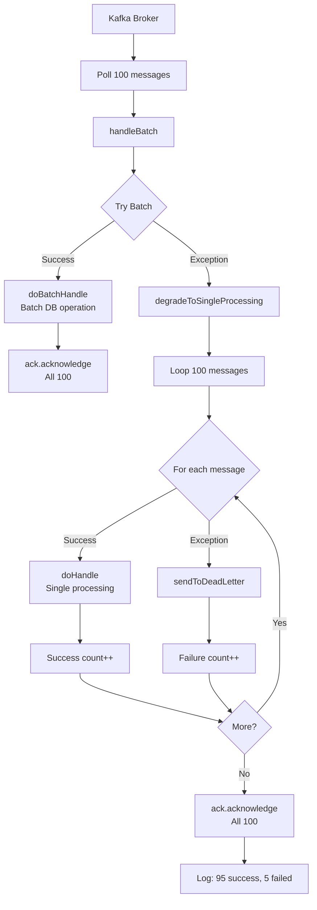

# Consumer Guide

Complete guide to consuming messages with SmartAdmin's Kafka integration, covering listener patterns, configuration, and best practices.

## Overview

SmartAdmin provides two abstract base classes for consuming Kafka messages:

1. **AbstractKafkaListener**: Single-message processing with automatic DLQ
2. **AbstractBatchKafkaListener**: Batch processing with graceful degradation

Both patterns provide:
- ✅ **Automatic error handling**: Exceptions route to DLQ
- ✅ **Template method pattern**: Override `doHandle()` for business logic
- ✅ **Logging**: Built-in success/failure logging
- ✅ **Metrics**: Integrated performance metrics

---

## Single Message Consumer

### AbstractKafkaListener Pattern

The recommended pattern for standard message processing:

```java
@Component
@Slf4j
public class OrderListener extends AbstractKafkaListener {

    @Autowired
    private OrderService orderService;

    @KafkaListener(
        topics = KafkaConst.Topic.ORDER,
        groupId = KafkaConst.Group.ORDER
    )
    public void onOrderMessage(ConsumerRecord<String, String> record) {
        handleMessage(record);  // Delegates to AbstractKafkaListener
    }

    @Override
    protected void doHandle(ConsumerRecord<String, String> record) {
        // Extract message
        String message = record.value();
        String key = record.key();

        log.info("Processing order: key={}, message={}", key, message);

        // Your business logic
        OrderDTO order = JSON.parseObject(message, OrderDTO.class);
        orderService.processOrder(order);

        // If exception thrown, automatically sent to DLQ
    }
}
```

### What Happens Under the Hood

```mermaid
flowchart TD
    A[Kafka Broker] --> B[@KafkaListener]
    B --> C[handleMessage<br/>AbstractKafkaListener]
    C --> D{Try}
    D -->|Success| E[doHandle<br/>Your Business Logic]
    E --> F[Log Success]
    F --> G[Commit Offset]
    D -->|Exception| H[Log Error]
    H --> I[sendToDeadLetter]
    I --> J[DLQ Topic]
    J --> G
```

**Key Points**:
1. `@KafkaListener` receives message from Kafka
2. Calls `handleMessage(record)` provided by `AbstractKafkaListener`
3. `handleMessage()` wraps your `doHandle()` in try-catch
4. On success: logs and commits offset
5. On failure: logs error, sends to DLQ, commits offset
6. **No message loss**: Failed messages preserved in DLQ

---

## Batch Consumer

### AbstractBatchKafkaListener Pattern

For high-throughput scenarios requiring batch processing:

```java
@Component
@Slf4j
public class OrderBatchListener extends AbstractBatchKafkaListener<OrderDTO> {

    @Autowired
    private OrderService orderService;

    @KafkaListener(
        topics = KafkaConst.Topic.ORDER,
        groupId = KafkaConst.Group.ORDER_BATCH,
        containerFactory = "batchKafkaListenerContainerFactory"
    )
    public void onOrderBatch(
        List<ConsumerRecord<String, String>> records,
        Acknowledgment ack
    ) {
        handleBatch(records, ack);  // Delegates to AbstractBatchKafkaListener
    }

    @Override
    protected void doBatchHandle(List<ConsumerRecord<String, String>> records) {
        // Batch processing logic (efficient)
        List<OrderDTO> orders = records.stream()
            .map(r -> JSON.parseObject(r.value(), OrderDTO.class))
            .toList();

        // Efficient batch DB operation
        orderService.batchProcessOrders(orders);

        log.info("Batch processed {} orders", orders.size());
    }

    @Override
    protected void doHandle(ConsumerRecord<String, String> record) {
        // Single-message fallback (auto-degradation on batch failure)
        OrderDTO order = JSON.parseObject(record.value(), OrderDTO.class);
        orderService.processSingleOrder(order);
    }

    @Override
    protected int getBatchSize() {
        return 100;  // Max batch size
    }
}
```

### Graceful Degradation Flow



**Graceful Degradation Benefits**:
- ✅ **Try batch first**: Maximum performance
- ✅ **Automatic fallback**: On batch failure, process individually
- ✅ **Partial success**: Some messages succeed, failures to DLQ
- ✅ **Always commits**: Manual ack after all processing complete
- ✅ **No message loss**: Failed messages preserved in DLQ

---

## @KafkaListener Configuration

### Basic Configuration

```java
@KafkaListener(
    topics = "smart-admin-order",              // Topic name
    groupId = "order-consumer-group",          // Consumer group
    containerFactory = "kafkaListenerContainerFactory"  // Optional
)
```

### Multiple Topics

```java
@KafkaListener(
    topics = {
        KafkaConst.Topic.ORDER,
        KafkaConst.Topic.PAYMENT,
        KafkaConst.Topic.REFUND
    },
    groupId = KafkaConst.Group.TRANSACTION_GROUP
)
public void handleTransactions(ConsumerRecord<String, String> record) {
    String topic = record.topic();

    switch (topic) {
        case KafkaConst.Topic.ORDER -> processOrder(record);
        case KafkaConst.Topic.PAYMENT -> processPayment(record);
        case KafkaConst.Topic.REFUND -> processRefund(record);
    }
}
```

### Topic Pattern Matching

```java
@KafkaListener(
    topicPattern = "smart-admin-.*",           // Regex pattern
    groupId = "wildcard-consumer-group"
)
public void handleAnySmartAdminTopic(ConsumerRecord<String, String> record) {
    log.info("Topic: {}, Message: {}", record.topic(), record.value());
}
```

### Partition Assignment

```java
@KafkaListener(
    topics = KafkaConst.Topic.ORDER,
    groupId = KafkaConst.Group.ORDER,
    topicPartitions = @TopicPartition(
        topic = KafkaConst.Topic.ORDER,
        partitions = {"0", "1"}                 // Only partitions 0 and 1
    )
)
public void handleSpecificPartitions(ConsumerRecord<String, String> record) {
    log.info("Partition: {}, Offset: {}", record.partition(), record.offset());
}
```

---

## Message Metadata Access

### Accessing Record Properties

```java
@Override
protected void doHandle(ConsumerRecord<String, String> record) {
    // Message content
    String key = record.key();
    String value = record.value();

    // Metadata
    String topic = record.topic();
    int partition = record.partition();
    long offset = record.offset();
    long timestamp = record.timestamp();

    // Headers
    Headers headers = record.headers();
    Header correlationIdHeader = headers.lastHeader("correlationId");
    String correlationId = correlationIdHeader != null
        ? new String(correlationIdHeader.value())
        : null;

    log.info("Topic: {}, Partition: {}, Offset: {}, Key: {}, CorrelationId: {}",
        topic, partition, offset, key, correlationId);

    // Process message
    processMessage(value);
}
```

### Reading Custom Headers

```java
@Override
protected void doHandle(ConsumerRecord<String, String> record) {
    Headers headers = record.headers();

    // Extract headers
    String messageType = getHeader(headers, "messageType");
    String version = getHeader(headers, "version");
    String source = getHeader(headers, "source");

    log.info("MessageType: {}, Version: {}, Source: {}",
        messageType, version, source);

    // Route based on headers
    if ("ORDER_CREATED".equals(messageType)) {
        handleOrderCreated(record.value());
    } else if ("ORDER_CANCELLED".equals(messageType)) {
        handleOrderCancelled(record.value());
    }
}

private String getHeader(Headers headers, String key) {
    Header header = headers.lastHeader(key);
    return header != null ? new String(header.value()) : null;
}
```

---

## Manual Offset Control

### Auto vs Manual Commit

**Auto Commit** (default for AbstractKafkaListener):
```yaml
smart:
  kafka:
    consumer:
      enable-auto-commit: true      # Spring Kafka commits automatically
```

**Manual Commit** (required for AbstractBatchKafkaListener):
```yaml
smart:
  kafka:
    consumer:
      enable-auto-commit: false     # Manual control
```

### Manual Acknowledgment Pattern

```java
@KafkaListener(
    topics = KafkaConst.Topic.ORDER,
    groupId = KafkaConst.Group.ORDER,
    containerFactory = "manualAckKafkaListenerContainerFactory"
)
public void handleOrderManualAck(
    ConsumerRecord<String, String> record,
    Acknowledgment ack
) {
    try {
        // Process message
        processOrder(record.value());

        // Manually commit offset
        ack.acknowledge();
        log.info("Committed offset: {}", record.offset());
    } catch (Exception e) {
        log.error("Processing failed, offset NOT committed", e);
        // Offset not committed, message will be reprocessed
    }
}
```

**When to Use Manual Ack**:
- ✅ Batch processing (commit after all messages processed)
- ✅ External system integration (commit only after external call succeeds)
- ✅ Exactly-once processing (precise control over commits)
- ❌ High-volume simple processing (auto-commit is simpler)

---

## Consumer Groups

### Group Management

```java
// Consumer Group 1: Real-time processing
@Component
public class OrderRealtimeListener extends AbstractKafkaListener {
    @KafkaListener(
        topics = KafkaConst.Topic.ORDER,
        groupId = "order-realtime-group"    // Group 1
    )
    public void handleRealtime(ConsumerRecord<String, String> record) {
        handleMessage(record);
    }

    @Override
    protected void doHandle(ConsumerRecord<String, String> record) {
        // Real-time order processing
        processOrderRealtime(record.value());
    }
}

// Consumer Group 2: Analytics processing (same topic, different group)
@Component
public class OrderAnalyticsListener extends AbstractKafkaListener {
    @KafkaListener(
        topics = KafkaConst.Topic.ORDER,
        groupId = "order-analytics-group"   // Group 2
    )
    public void handleAnalytics(ConsumerRecord<String, String> record) {
        handleMessage(record);
    }

    @Override
    protected void doHandle(ConsumerRecord<String, String> record) {
        // Analytics processing
        collectOrderMetrics(record.value());
    }
}
```

**Consumer Group Benefits**:
- ✅ **Independent processing**: Each group maintains its own offset
- ✅ **Multiple consumers**: Same message consumed by multiple groups
- ✅ **Load balancing**: Partitions distributed across group members
- ✅ **Scalability**: Add consumers to group for parallel processing

### Scaling with Concurrency

```yaml
smart:
  kafka:
    listener:
      concurrency: 3    # 3 concurrent consumers per @KafkaListener
```

```java
@KafkaListener(
    topics = KafkaConst.Topic.ORDER,
    groupId = KafkaConst.Group.ORDER,
    concurrency = "3"    # Or configure per listener
)
```

**Concurrency Rules**:
- **Concurrency ≤ Partition Count**: 3 consumers for 3+ partitions (optimal)
- **Concurrency > Partition Count**: Some consumers idle (wasteful)
- **Example**: 6 partitions → set concurrency=6 for maximum throughput

---

## Error Handling

### Automatic DLQ with AbstractKafkaListener

```java
@Component
@Slf4j
public class OrderListener extends AbstractKafkaListener {

    @KafkaListener(topics = KafkaConst.Topic.ORDER, groupId = KafkaConst.Group.ORDER)
    public void onOrderMessage(ConsumerRecord<String, String> record) {
        handleMessage(record);  // Auto-DLQ on exception
    }

    @Override
    protected void doHandle(ConsumerRecord<String, String> record) {
        // If this throws, message automatically goes to DLQ
        OrderDTO order = JSON.parseObject(record.value(), OrderDTO.class);

        if (order.getAmount() == null) {
            throw new BusinessException("Order amount is null");  // → DLQ
        }

        orderService.processOrder(order);
    }
}
```

### Custom Error Handling

```java
@Component
@Slf4j
public class CustomErrorListener extends AbstractKafkaListener {

    @Autowired
    private AlertService alertService;

    @Override
    protected void doHandle(ConsumerRecord<String, String> record) {
        try {
            processOrder(record.value());
        } catch (BusinessException e) {
            // Custom handling for business exceptions
            log.warn("Business exception, sending alert: {}", e.getMessage());
            alertService.sendAlert("Order processing failed: " + e.getMessage());

            // Still sent to DLQ (rethrow)
            throw e;
        } catch (Exception e) {
            // Log technical exceptions
            log.error("Technical exception processing order", e);
            throw e;
        }
    }
}
```

---

## Performance Tuning

### Consumer Configuration

```yaml
smart:
  kafka:
    consumer:
      # Polling behavior
      max-poll-records: 500          # Fetch up to 500 messages per poll
      fetch-min-size: 1              # Min bytes to fetch (1 byte = no wait)
      fetch-max-wait: 500            # Max wait time for fetch-min-size (ms)

      # Session management
      session-timeout-ms: 45000      # 45s session timeout
      heartbeat-interval-ms: 3000    # 3s heartbeat
      max-poll-interval-ms: 300000   # 5min max processing time

      # Offset management
      auto-offset-reset: earliest    # Start from beginning if no offset
      enable-auto-commit: false      # Manual commit for reliability

    # Listener concurrency
    listener:
      concurrency: 3                 # 3 concurrent consumers
      ack-mode: manual               # Manual acknowledgment
```

### Batch Size Tuning

```java
@Override
protected int getBatchSize() {
    return 100;  // Adjust based on:
                 // - Message processing time
                 // - Available memory
                 // - max-poll-interval-ms timeout
}
```

**Guidelines**:
- **Fast processing (<10ms/msg)**: Batch size 500-1000
- **Medium processing (10-100ms/msg)**: Batch size 100-500
- **Slow processing (>100ms/msg)**: Batch size 10-100
- **Rule**: `batch_size * avg_processing_time < max-poll-interval-ms`

---

## Best Practices

### 1. Idempotent Processing

```java
@Component
@Slf4j
public class IdempotentOrderListener extends AbstractKafkaListener {

    @Autowired
    private RedisTemplate<String, String> redisTemplate;
    @Autowired
    private OrderService orderService;

    @Override
    protected void doHandle(ConsumerRecord<String, String> record) {
        String messageId = record.key();  // Unique message ID

        // Check if already processed
        String cacheKey = "processed:order:" + messageId;
        if (Boolean.TRUE.equals(redisTemplate.hasKey(cacheKey))) {
            log.info("Message already processed: {}", messageId);
            return;  // Skip duplicate
        }

        // Process message
        OrderDTO order = JSON.parseObject(record.value(), OrderDTO.class);
        orderService.processOrder(order);

        // Mark as processed (24h TTL)
        redisTemplate.opsForValue().set(cacheKey, "1", 24, TimeUnit.HOURS);
    }
}
```

### 2. Deserialization Pattern

```java
@Override
protected void doHandle(ConsumerRecord<String, String> record) {
    try {
        // Safe deserialization
        OrderDTO order = JSON.parseObject(record.value(), OrderDTO.class);

        // Validate
        if (order == null || order.getOrderId() == null) {
            log.error("Invalid message format: {}", record.value());
            return;  // Message goes to DLQ (throw exception if needed)
        }

        // Process
        orderService.processOrder(order);
    } catch (JSONException e) {
        log.error("JSON parsing failed for message: {}", record.value(), e);
        throw new BusinessException("Invalid JSON format");  // → DLQ
    }
}
```

### 3. Logging Best Practices

```java
@Override
protected void doHandle(ConsumerRecord<String, String> record) {
    long startTime = System.currentTimeMillis();

    try {
        log.info("Processing message - Key: {}, Partition: {}, Offset: {}",
            record.key(), record.partition(), record.offset());

        OrderDTO order = JSON.parseObject(record.value(), OrderDTO.class);
        orderService.processOrder(order);

        long duration = System.currentTimeMillis() - startTime;
        log.info("Processed successfully - Key: {}, Duration: {}ms",
            record.key(), duration);
    } catch (Exception e) {
        long duration = System.currentTimeMillis() - startTime;
        log.error("Processing failed - Key: {}, Duration: {}ms, Error: {}",
            record.key(), duration, e.getMessage(), e);
        throw e;
    }
}
```

### 4. Graceful Shutdown

```java
@Component
@Slf4j
public class KafkaShutdownHandler {

    @Autowired
    private KafkaListenerEndpointRegistry registry;

    @PreDestroy
    public void onShutdown() {
        log.info("Gracefully shutting down Kafka consumers...");

        registry.getAllListenerContainers().forEach(container -> {
            container.stop(() ->
                log.info("Stopped container: {}", container.getListenerId())
            );
        });

        log.info("All Kafka consumers stopped");
    }
}
```

---

## Common Pitfalls

### 1. Long Processing Blocking Rebalance

```java
// ❌ Bad: Long processing without timeout consideration
@Override
protected void doHandle(ConsumerRecord<String, String> record) {
    processOrderSlowly(record.value());  // Takes 10 minutes
    // Consumer kicked out of group (max-poll-interval-ms exceeded)
}

// ✅ Good: Async processing for slow operations
@Override
protected void doHandle(ConsumerRecord<String, String> record) {
    // Quick processing
    OrderDTO order = JSON.parseObject(record.value(), OrderDTO.class);

    // Offload slow work to thread pool
    CompletableFuture.runAsync(() ->
        processOrderSlowly(order)
    );

    // Consumer remains responsive
}
```

### 2. Forgetting Batch Container Factory

```java
// ❌ Bad: Batch listener without proper factory
@KafkaListener(topics = "topic", groupId = "group")  // Wrong factory!
public void onBatch(List<ConsumerRecord<String, String>> records, Acknowledgment ack) {
    // This won't work as expected
}

// ✅ Good: Specify batch container factory
@KafkaListener(
    topics = "topic",
    groupId = "group",
    containerFactory = "batchKafkaListenerContainerFactory"  // Correct!
)
public void onBatch(List<ConsumerRecord<String, String>> records, Acknowledgment ack) {
    // Works correctly
}
```

### 3. Ignoring Exceptions

```java
// ❌ Bad: Swallowing exceptions
@Override
protected void doHandle(ConsumerRecord<String, String> record) {
    try {
        processOrder(record.value());
    } catch (Exception e) {
        log.error("Error processing", e);
        // Exception swallowed, offset committed, message lost!
    }
}

// ✅ Good: Let AbstractKafkaListener handle exceptions
@Override
protected void doHandle(ConsumerRecord<String, String> record) {
    processOrder(record.value());
    // If exception thrown, automatically sent to DLQ
}
```

---

## See Also

- [Quick Reference](/kafka/getting-started/quick-reference) - API cheat sheet
- [Producer Guide](/kafka/guides/producer-guide) - Producer patterns
- [Batch Operations](/kafka/guides/batch-operations) - Batch processing
- [Error Handling](/kafka/guides/error-handling) - Error strategies
- [Dead Letter Queue](/kafka/architecture/dead-letter-queue) - DLQ architecture
- [Configuration](/kafka/guides/configuration) - Consumer configuration

---

**Last Updated**: 2026-01-21
