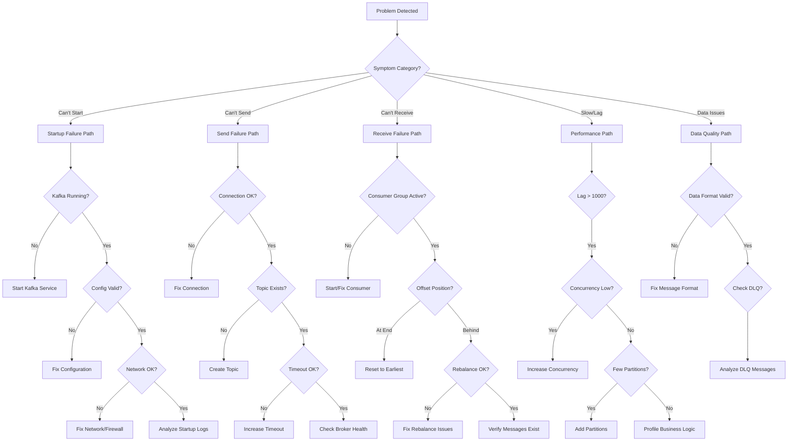

# Diagnostic Guide

Systematic troubleshooting procedures for diagnosing Kafka integration issues in SmartAdmin.

## Overview

This guide provides step-by-step diagnostic workflows for:
- Identifying the root cause of Kafka issues
- Gathering diagnostic information efficiently
- Making data-driven troubleshooting decisions

**Diagnostic Workflow**:
1. **Symptom categorization** - What is the observed behavior?
2. **Layer isolation** - Kafka, network, application, or business logic?
3. **Evidence collection** - Gather logs, metrics, and state
4. **Root cause analysis** - Correlate evidence to identify cause
5. **Solution application** - Fix and verify

---

## Diagnostic Decision Tree



---

## Layer-by-Layer Diagnosis

### Layer 1: Kafka Infrastructure

**Objective**: Verify Kafka brokers are healthy and accessible

**Checks**:
```bash
# 1. Kafka broker status
docker ps | grep kafka
# Expected: smart-admin-kafka   Up (healthy)

# 2. Kafka logs (last 50 lines)
docker logs smart-admin-kafka --tail 50
# Look for: "Kafka Server started"
# Avoid: ERROR, Exception, OutOfMemoryError

# 3. Broker API version
docker exec smart-admin-kafka kafka-broker-api-versions \
  --bootstrap-server localhost:9092
# Expected: Lists API versions for each broker

# 4. Cluster metadata
docker exec smart-admin-kafka kafka-metadata \
  --bootstrap-server localhost:9092 \
  --describe --cluster
# Expected: Cluster ID, controller ID, broker list
```

**Pass Criteria**:
- ✅ Kafka container healthy
- ✅ No ERROR in logs
- ✅ API versions endpoint responds
- ✅ Cluster metadata complete

---

### Layer 2: Network Connectivity

**Objective**: Verify network path from application to Kafka

**Checks**:
```bash
# 1. Port connectivity
nc -zv localhost 9092
# Expected: "Connection to localhost 9092 port [tcp/*] succeeded!"

# 2. DNS resolution (Docker)
docker exec smart-admin-app nslookup kafka
# Expected: Returns Kafka container IP

# 3. Network route test
docker exec smart-admin-app ping -c 3 kafka
# Expected: 3 packets transmitted, 3 received

# 4. Application can reach Kafka
docker exec smart-admin-app curl -v telnet://kafka:9092
# Expected: "Connected to kafka"
```

**Pass Criteria**:
- ✅ Port 9092 accessible
- ✅ DNS resolves correctly
- ✅ Ping succeeds
- ✅ Telnet connects

---

### Layer 3: Topic Configuration

**Objective**: Verify topics exist and are properly configured

**Checks**:
```bash
# 1. List all topics
docker exec smart-admin-kafka kafka-topics \
  --bootstrap-server localhost:9092 --list

# 2. Describe specific topic
docker exec smart-admin-kafka kafka-topics \
  --bootstrap-server localhost:9092 \
  --describe --topic smart-admin-order

# Expected output:
# Topic: smart-admin-order  PartitionCount: 3  ReplicationFactor: 1
# Topic: smart-admin-order  Partition: 0  Leader: 1  Replicas: 1  Isr: 1

# 3. Check topic configuration
docker exec smart-admin-kafka kafka-configs \
  --bootstrap-server localhost:9092 \
  --describe --entity-type topics \
  --entity-name smart-admin-order

# 4. Get topic offsets
docker exec smart-admin-kafka kafka-run-class \
  kafka.tools.GetOffsetShell \
  --broker-list localhost:9092 \
  --topic smart-admin-order

# Output: smart-admin-order:0:150  (150 messages in partition 0)
```

**Pass Criteria**:
- ✅ Topic exists
- ✅ Has leader for all partitions
- ✅ ISR (In-Sync Replicas) = Replicas
- ✅ No under-replicated partitions

---

### Layer 4: Producer Health

**Objective**: Verify producer can send messages successfully

**Checks**:
```bash
# 1. Test with console producer
docker exec -it smart-admin-kafka kafka-console-producer \
  --bootstrap-server localhost:9092 \
  --topic smart-admin-order
# Type message, press Enter
# Expected: Message accepted (no error)

# 2. Check producer metrics (if actuator enabled)
curl http://localhost:1024/actuator/metrics/kafka.producer.record-send-total

# 3. Producer performance test
docker exec smart-admin-kafka kafka-producer-perf-test \
  --topic smart-admin-order \
  --num-records 1000 \
  --record-size 100 \
  --throughput 100 \
  --producer-props bootstrap.servers=localhost:9092

# Expected: 1000 records sent, X records/sec

# 4. Application producer log
grep "Message sent successfully" logs/smart-admin.log | tail -10
```

**Pass Criteria**:
- ✅ Console producer succeeds
- ✅ Perf test completes
- ✅ Send metrics increasing
- ✅ Application logs show sends

---

### Layer 5: Consumer Health

**Objective**: Verify consumer is subscribed and consuming messages

**Checks**:
```bash
# 1. List consumer groups
docker exec smart-admin-kafka kafka-consumer-groups \
  --bootstrap-server localhost:9092 --list

# 2. Describe consumer group (critical!)
docker exec smart-admin-kafka kafka-consumer-groups \
  --bootstrap-server localhost:9092 \
  --describe --group smart-admin-order-group

# Expected output:
# GROUP                TOPIC           PARTITION  CURRENT-OFFSET  LOG-END-OFFSET  LAG
# smart-admin-order... smart-admin-... 0          100             100             0

# 3. Check consumer state
docker exec smart-admin-kafka kafka-consumer-groups \
  --bootstrap-server localhost:9092 \
  --describe --group smart-admin-order-group --state

# Expected: STABLE (not Rebalancing)

# 4. Check member details
docker exec smart-admin-kafka kafka-consumer-groups \
  --bootstrap-server localhost:9092 \
  --describe --group smart-admin-order-group --members

# Expected: Shows active consumer instances

# 5. Application consumer log
grep "Assigned to partitions" logs/smart-admin.log
```

**Pass Criteria**:
- ✅ Consumer group exists
- ✅ State is STABLE
- ✅ Has active members
- ✅ LAG is reasonable (< 1000)
- ✅ Application logs show partition assignment

---

### Layer 6: Application Logic

**Objective**: Verify business logic processes messages correctly

**Checks**:
```bash
# 1. Check message processing logs
grep "Processing message" logs/smart-admin.log | tail -20

# 2. Check for exceptions
grep "ERROR" logs/smart-admin.log | grep -i kafka | tail -20

# 3. Check DLQ messages
docker exec smart-admin-kafka kafka-console-consumer \
  --bootstrap-server localhost:9092 \
  --topic smart-admin-order-dlq \
  --from-beginning \
  --max-messages 10

# 4. Monitor processing rate
tail -f logs/smart-admin.log | grep "Processing message" | wc -l
# Count messages processed per minute

# 5. Check business metrics
curl http://localhost:1024/actuator/metrics/kafka.processing.duration
```

**Pass Criteria**:
- ✅ Messages being processed
- ✅ No exceptions in logs
- ✅ DLQ is empty or low
- ✅ Processing rate matches send rate

---

## Symptom-Specific Workflows

### Workflow 1: Application Won't Start

**Symptom**: Application fails during startup with Kafka errors

**Diagnostic Steps**:

**Step 1**: Check Kafka availability
```bash
docker ps | grep kafka
# If not running:
docker-compose up -d kafka
```

**Step 2**: Verify bootstrap servers
```bash
cat sa-admin/src/main/resources/dev/sa-base.yaml | grep bootstrap-servers
# Must match Kafka's advertised listeners
```

**Step 3**: Test connection
```bash
telnet localhost 9092
# If connection refused:
# - Check port mapping in docker-compose.yml
# - Check firewall rules
```

**Step 4**: Check startup logs
```bash
./gradlew :sa-admin:bootRun 2>&1 | grep -i kafka
# Look for connection errors
```

**Resolution Checklist**:
- [ ] Kafka service started
- [ ] Bootstrap servers correct
- [ ] Network connectivity verified
- [ ] Application starts successfully

---

### Workflow 2: Messages Not Being Sent

**Symptom**: Producer send() calls fail or timeout

**Diagnostic Steps**:

**Step 1**: Verify topic exists
```bash
docker exec smart-admin-kafka kafka-topics \
  --bootstrap-server localhost:9092 \
  --list | grep smart-admin-order

# If not found, create it:
docker exec smart-admin-kafka kafka-topics \
  --bootstrap-server localhost:9092 \
  --create --topic smart-admin-order \
  --partitions 3 --replication-factor 1
```

**Step 2**: Test with curl
```bash
curl -X POST http://localhost:1024/business/sample/kafka/send \
  -H "Content-Type: application/json" \
  -d '{"message": "test"}'

# Check response and logs
```

**Step 3**: Check producer logs
```bash
grep "Failed to send" logs/smart-admin.log
# Analyze exception type
```

**Step 4**: Verify Kafka broker health
```bash
docker logs smart-admin-kafka | tail -50
# Look for errors or high load
```

**Resolution Checklist**:
- [ ] Topic created
- [ ] Send test passes
- [ ] No errors in logs
- [ ] Kafka broker healthy

---

### Workflow 3: Consumer Lag Growing

**Symptom**: Consumer lag increasing over time

**Diagnostic Steps**:

**Step 1**: Measure current lag
```bash
docker exec smart-admin-kafka kafka-consumer-groups \
  --bootstrap-server localhost:9092 \
  --describe --group smart-admin-order-group

# Note LAG column value
```

**Step 2**: Calculate processing rate
```bash
# Count messages in 1 minute
grep "Processing message" logs/smart-admin.log | \
  grep "$(date '+%Y-%m-%d %H:%M')" | wc -l

# Compare to producer rate
grep "Message sent" logs/smart-admin.log | \
  grep "$(date '+%Y-%m-%d %H:%M')" | wc -l
```

**Step 3**: Analyze processing time
```bash
# Extract processing times
grep "Processing time:" logs/smart-admin.log | \
  awk '{sum+=$4; count++} END {print "Average:", sum/count, "ms"}'
```

**Step 4**: Check concurrency
```bash
cat sa-admin/src/main/resources/dev/sa-base.yaml | grep concurrency
# Current concurrency level
```

**Resolution Options**:
- [ ] Increase concurrency
- [ ] Add partitions
- [ ] Optimize business logic
- [ ] Use batch processing

---

## Diagnostic Commands Reference

### Quick Health Check

**One-liner to check everything**:
```bash
#!/bin/bash
echo "=== Kafka Status ===" && \
docker ps | grep kafka && \
echo "=== Topics ===" && \
docker exec smart-admin-kafka kafka-topics --bootstrap-server localhost:9092 --list && \
echo "=== Consumer Groups ===" && \
docker exec smart-admin-kafka kafka-consumer-groups --bootstrap-server localhost:9092 --list && \
echo "=== Consumer Lag ===" && \
docker exec smart-admin-kafka kafka-consumer-groups --bootstrap-server localhost:9092 --describe --group smart-admin-order-group && \
echo "=== Application Health ===" && \
curl -s http://localhost:1024/actuator/health | jq .
```

### Kafka Service Commands

```bash
# Start Kafka
docker-compose up -d kafka

# Stop Kafka
docker-compose stop kafka

# Restart Kafka
docker-compose restart kafka

# View Kafka logs (live)
docker logs -f smart-admin-kafka

# View last 100 lines
docker logs smart-admin-kafka --tail 100
```

### Topic Commands

```bash
# List topics
docker exec smart-admin-kafka kafka-topics --bootstrap-server localhost:9092 --list

# Create topic
docker exec smart-admin-kafka kafka-topics --bootstrap-server localhost:9092 \
  --create --topic TOPIC_NAME --partitions 3 --replication-factor 1

# Describe topic
docker exec smart-admin-kafka kafka-topics --bootstrap-server localhost:9092 \
  --describe --topic TOPIC_NAME

# Delete topic
docker exec smart-admin-kafka kafka-topics --bootstrap-server localhost:9092 \
  --delete --topic TOPIC_NAME

# Increase partitions
docker exec smart-admin-kafka kafka-topics --bootstrap-server localhost:9092 \
  --alter --topic TOPIC_NAME --partitions 10
```

### Consumer Group Commands

```bash
# List consumer groups
docker exec smart-admin-kafka kafka-consumer-groups --bootstrap-server localhost:9092 --list

# Describe group (with lag)
docker exec smart-admin-kafka kafka-consumer-groups --bootstrap-server localhost:9092 \
  --describe --group GROUP_NAME

# Check group state
docker exec smart-admin-kafka kafka-consumer-groups --bootstrap-server localhost:9092 \
  --describe --group GROUP_NAME --state

# Check members
docker exec smart-admin-kafka kafka-consumer-groups --bootstrap-server localhost:9092 \
  --describe --group GROUP_NAME --members

# Reset offset to earliest
docker exec smart-admin-kafka kafka-consumer-groups --bootstrap-server localhost:9092 \
  --group GROUP_NAME --reset-offsets --to-earliest --topic TOPIC_NAME --execute

# Reset offset to specific timestamp
docker exec smart-admin-kafka kafka-consumer-groups --bootstrap-server localhost:9092 \
  --group GROUP_NAME --reset-offsets --to-datetime 2026-01-21T10:00:00.000 \
  --topic TOPIC_NAME --execute
```

### Message Commands

```bash
# Consume messages from beginning
docker exec -it smart-admin-kafka kafka-console-consumer \
  --bootstrap-server localhost:9092 \
  --topic TOPIC_NAME \
  --from-beginning

# Consume latest messages
docker exec -it smart-admin-kafka kafka-console-consumer \
  --bootstrap-server localhost:9092 \
  --topic TOPIC_NAME

# Consume with key
docker exec -it smart-admin-kafka kafka-console-consumer \
  --bootstrap-server localhost:9092 \
  --topic TOPIC_NAME \
  --property print.key=true \
  --property key.separator=":"

# Produce message
docker exec -it smart-admin-kafka kafka-console-producer \
  --bootstrap-server localhost:9092 \
  --topic TOPIC_NAME
```

---

## Best Practices

### 1. Follow the Diagnostic Flow

✅ **DO**: Start with infrastructure, work up to application
```
Kafka → Network → Topics → Producer → Consumer → Business Logic
```

❌ **DON'T**: Jump to application code without checking infrastructure

### 2. Collect Evidence Systematically

✅ **DO**: Gather all diagnostics before making changes
```bash
# Save diagnostic snapshot
./diagnostic-snapshot.sh > issue-2026-01-21.txt
```

❌ **DON'T**: Make random configuration changes hoping to fix

### 3. Document Your Steps

✅ **DO**: Keep a log of what you tried
```
Checked Kafka status: OK
Checked topic exists: FAILED - creating topic
Created topic: SUCCESS
Retested send: SUCCESS
```

❌ **DON'T**: Forget what you've already checked

### 4. Test One Change at a Time

✅ **DO**: Change one thing, verify, then proceed
```
Step 1: Increased concurrency to 3 → lag improved 30%
Step 2: Added 2 more partitions → lag improved another 50%
```

❌ **DON'T**: Change multiple things simultaneously

---

## See Also

- [Common Issues](/kafka/troubleshooting/common-issues) - Issue symptoms and solutions
- [FAQ](/kafka/troubleshooting/faq) - Frequently asked questions
- [Debugging Tips](/kafka/troubleshooting/debugging-tips) - Advanced techniques
- [Monitoring](/kafka/operations/monitoring) - Monitoring setup
- [Health Checks](/kafka/operations/health-checks) - Health check configuration

---

**Last Updated**: 2026-01-21
