# ADR-001: 雙式記帳保障財務完整性

**狀態**: ✅ 已採納

**日期**: 2026-01-20

**作者**: 架構團隊

**審查者**: 財務團隊、安全團隊

**相關文檔**: [P0-01: 雙式記帳數據庫架構](../technical-specs/P0-critical/01-double-entry-ledger-schema.md)

---

## 情境 (Context)

iGaming 平台每日處理數百萬美元的玩家資金，涉及充值、投注、贏獎、提款和優惠等操作。財務差異會帶來嚴重後果：
- **監管風險**: MGA/Curacao 牌照要求提供資金安全的數學證明
- **業務風險**: 競爭對手因未檢測到帳本失衡造成 $50K 營收損失（真實案例）
- **信任風險**: 餘額錯誤會導致玩家失去信心

**當前狀況**:
- backend_project.md 提到「錢包系統」但未提供帳本架構
- 無法數學保證 借方總額 = 貸方總額
- 缺乏財務交易審計追蹤
- 無每日對帳流程

**限制條件**:
- 必須處理峰值 10K 筆/秒 (TPS) 的交易量
- 100% 準確度要求（財務系統不容錯誤）
- 監管審計要求：7 年交易歷史保留
- 多幣種支持（USD, EUR, BTC, ETH）

**成功標準**:
- 零餘額差異（每日對帳通過）
- <200ms p95 延遲（錢包操作）
- 所有資金流動的完整審計追蹤

---

## 決策 (Decision)

**我們將實施基於 Account-LedgerEntry-Transaction 模式的雙式記帳系統。**

### 關鍵組件

**1. 帳戶科目表 (Account Chart)**:

### 圖 1.1: 帳戶科目體系樹狀圖

> **說明**: 此圖展示雙式記帳系統的完整帳戶科目體系，包括資產、負債、權益、收入和費用五大類別，以及每類別下的具體科目及其借貸規則。

```mermaid
graph TB
    ROOT[帳戶科目表<br>Chart of Accounts]

    subgraph "資產類 ASSET<br>(借方+ 貸方-)"
        A1[玩家錢包<br>Player Wallets]
        A2[公司銀行帳戶<br>Company Bank Accounts]
        A3[加密貨幣熱錢包<br>Crypto Hot Wallets]
        A4[加密貨幣冷錢包<br>Crypto Cold Wallets]

        A1_1[玩家 USD 錢包]
        A1_2[玩家 EUR 錢包]
        A1_3[玩家 BTC 錢包]
        A1_4[玩家 ETH 錢包]
    end

    subgraph "負債類 LIABILITY<br>(借方- 貸方+)"
        L1[玩家負債<br>Player Liabilities]
        L2[優惠負債<br>Bonus Liabilities]

        L1_1[待處理提款]
        L2_1[未使用優惠]
    end

    subgraph "權益類 EQUITY"
        E1[留存收益<br>Retained Earnings]
    end

    subgraph "收入類 REVENUE<br>(貸方+)"
        R1[遊戲總收益 GGR<br>Gross Gaming Revenue]
        R2[交易手續費<br>Transaction Fees]
    end

    subgraph "費用類 EXPENSE<br>(借方+)"
        X1[支付處理費<br>Payment Processing Fees]
        X2[遊戲供應商費用<br>Provider Fees]
    end

    ROOT --> A1
    ROOT --> A2
    ROOT --> A3
    ROOT --> A4
    ROOT --> L1
    ROOT --> L2
    ROOT --> E1
    ROOT --> R1
    ROOT --> R2
    ROOT --> X1
    ROOT --> X2

    A1 --> A1_1
    A1 --> A1_2
    A1 --> A1_3
    A1 --> A1_4

    L1 --> L1_1
    L2 --> L2_1

    classDef asset fill:#51cf66,stroke:#37b24d,color:#fff
    classDef liability fill:#ff6b6b,stroke:#c92a2a,color:#fff
    classDef equity fill:#ffd93d,stroke:#f59f00,color:#000
    classDef revenue fill:#74c0fc,stroke:#339af0,color:#000
    classDef expense fill:#f783ac,stroke:#e64980,color:#000

    class A1,A2,A3,A4,A1_1,A1_2,A1_3,A1_4 asset
    class L1,L2,L1_1,L2_1 liability
    class E1 equity
    class R1,R2 revenue
    class X1,X2 expense
```



**帳戶科目說明**:

```
資產類帳戶 ASSET (借方+, 貸方-)
  - 玩家錢包（每位玩家、每個幣種）
  - 公司銀行帳戶
  - 加密貨幣熱錢包
  - 加密貨幣冷錢包

負債類帳戶 LIABILITY (借方-, 貸方+)
  - 玩家負債（待處理提款）
  - 優惠負債（未兌換優惠）

權益類帳戶 EQUITY
  - 留存收益

收入類帳戶 REVENUE (貸方+)
  - 遊戲總收益 GGR (Gross Gaming Revenue)
  - 交易手續費

費用類帳戶 EXPENSE (借方+)
  - 支付處理費
  - 遊戲供應商費用
```

**2. 帳本分錄 (Ledger Entries)**:

每筆財務交易創建成對的帳本分錄，滿足：
```
Σ(借方) = Σ(貸方)
```

**範例**: 玩家通過信用卡充值 $100
```
借方 DEBIT  $100  公司銀行帳戶        (資產增加)
貸方 CREDIT $100  玩家錢包 (Player123) (資產增加，內部轉帳)
```

**3. 每日對帳 (Daily Reconciliation)**:

自動化任務（UTC 午夜執行）驗證：
```sql
SELECT SUM(CASE WHEN entry_type = 'DEBIT' THEN amount ELSE -amount END) AS balance
FROM t_ledger_entry
WHERE created_at >= CURRENT_DATE AND created_at < CURRENT_DATE + INTERVAL '1 day';
-- 必須等於 0.00
```

### 實施方法

**1. 數據庫架構** (PostgreSQL):
   - `t_account`: 帳戶科目表（5 種類型 × N 個幣種 × M 位玩家）
   - `t_ledger_entry`: 所有財務流動（僅追加，append-only）
   - `t_transaction`: 分組相關分錄（例如投注交易包含 2 個分錄）

**2. 過帳規則** (Java 服務層):
   - **充值**: 銀行帳戶 (借) / 玩家錢包 (貸)
   - **投注**: 玩家錢包 (貸) / GGR 收入 (貸) + 賭場負債 (借)
   - **贏獎**: 賭場負債 (貸) / 玩家錢包 (借)
   - **提款**: 玩家錢包 (貸) / 銀行帳戶 (借)

### 圖 1.2: 交易過帳流程

> **說明**: 此圖展示從用戶發起交易到完成雙式記帳的完整流程，包括冪等性檢查、分佈式事務處理和最終對帳驗證。

```mermaid
flowchart TD
    Start([用戶發起交易]) --> ValidateReq[驗證請求參數]
    ValidateReq --> CheckIdempotency{檢查冪等性 Key<br>Redis}

    CheckIdempotency -->|已處理過| ReturnCached[返回快取結果]
    CheckIdempotency -->|首次處理| DetermineType{判斷交易類型}

    DetermineType -->|充值 Deposit| DepositPosting[過帳規則:<br>銀行帳戶 DR / 玩家錢包 CR]
    DetermineType -->|投注 Bet| BetPosting[過帳規則:<br>玩家錢包 CR / GGR CR + 負債 DR]
    DetermineType -->|贏獎 Win| WinPosting[過帳規則:<br>負債 CR / 玩家錢包 DR]
    DetermineType -->|提款 Withdrawal| WithdrawPosting[過帳規則:<br>玩家錢包 CR / 銀行帳戶 DR]

    DepositPosting --> BeginTx[開始數據庫事務<br>BEGIN TRANSACTION]
    BetPosting --> BeginTx
    WinPosting --> BeginTx
    WithdrawPosting --> BeginTx

    BeginTx --> InsertTx[插入交易記錄<br>t_transaction]
    InsertTx --> InsertDebit[插入借方分錄<br>t_ledger_entry DR]
    InsertDebit --> InsertCredit[插入貸方分錄<br>t_ledger_entry CR]

    InsertCredit --> ValidateBalance{驗證餘額<br>Σ(DR) = Σ(CR)?}

    ValidateBalance -->|不相等| Rollback[回滾事務<br>ROLLBACK]
    ValidateBalance -->|相等| Commit[提交事務<br>COMMIT]

    Commit --> CacheResult[快取結果到 Redis<br>60s TTL]
    CacheResult --> UpdateWalletCache[更新錢包餘額快取]
    UpdateWalletCache --> PublishEvent[發布事件到 Kafka<br>TransactionCompletedEvent]

    PublishEvent --> Success([返回成功結果])
    Rollback --> Error([返回錯誤])
    ReturnCached --> Success

    classDef processNode fill:#74c0fc,stroke:#339af0,color:#000
    classDef decisionNode fill:#ffd93d,stroke:#f59f00,color:#000
    classDef successNode fill:#51cf66,stroke:#37b24d,color:#fff
    classDef errorNode fill:#ff6b6b,stroke:#c92a2a,color:#fff

    class ValidateReq,InsertTx,InsertDebit,InsertCredit,CacheResult,UpdateWalletCache,PublishEvent processNode
    class CheckIdempotency,DetermineType,ValidateBalance decisionNode
    class Success successNode
    class Error,Rollback errorNode
```

**3. 對帳任務** (Snail-Job 排程):
   - 每日 00:00 UTC 執行
   - 驗證 Σ(借方) = Σ(貸方)
   - 若差額 >$0.01 觸發警報

---

## 結果 (Consequences)

### 正面影響

- ✅ **數學確定性**: 雙式記帳保證餘額準確（500 年歷史驗證的方法）
- ✅ **完整審計追蹤**: 每一分錢的流動都有時間戳、用戶、原因記錄
- ✅ **監管合規**: MGA/Curacao 審計員可以用數學方法驗證資金安全
- ✅ **欺詐檢測**: 帳本分錄異常會觸發警報（例如有貸方但無對應借方）
- ✅ **多幣種支持**: 每個幣種擁有獨立帳戶集（天然隔離）
- ✅ **可擴展性**: 僅追加的帳本分錄可水平擴展（按日期分區）

### 負面影響

- ❌ **複雜度**: 開發人員必須理解會計原則（學習曲線）
- ❌ **存儲開銷**: 每筆交易需 2 個帳本分錄（相比簡單餘額更新增加一倍存儲）
- ❌ **寫入放大**: 每個錢包操作寫入 2+ 行（vs 簡單模型的 1 行）
- ❌ **查詢複雜度**: 餘額計算需要 SUM(帳本分錄) vs SELECT balance
- ❌ **遷移工作量**: 無法使用現有簡單錢包表，需要完整遷移

### 風險

- ⚠️ **性能下降**: 帳本表每月增長至 1 億+ 行
  - **緩解措施**: 按月分區、歸檔舊數據至冷存儲、索引優化

- ⚠️ **對帳失敗**: 每日對帳檢測到差異但不會自動修復
  - **緩解措施**: 斷路器暫停所有交易，需要人工調查

- ⚠️ **並發事務競爭**: 兩筆交易同時修改同一帳戶
  - **緩解措施**: 使用版本字段樂觀鎖，衝突時重試邏輯

### 成效指標

- **餘額準確度**: 100% (Σ(借方) - Σ(貸方) = $0.00 每日)
- **錢包 API 延遲**: <200ms p95（包含帳本寫入）
- **對帳通過率**: 100%（零失敗）
- **存儲增長**: ~1GB/天（100 萬交易 × 2 分錄 × 500 字節）

---

## 替代方案 (Alternatives Considered)

### 替代方案 1: 簡單餘額表

**描述**: 在 `wallet_account.balance` 字段存儲運行餘額，每筆交易更新

```sql
CREATE TABLE wallet_account (
    player_id BIGINT,
    currency VARCHAR(3),
    balance DECIMAL(20, 4),  -- 運行餘額
    updated_at TIMESTAMP
);

-- 充值時:
UPDATE wallet_account SET balance = balance + 100 WHERE player_id = 123;
```

**優點**:
- ✅ 實施簡單（無需會計知識）
- ✅ 快速餘額查詢（SELECT balance vs SUM(帳本分錄)）
- ✅ 低存儲開銷（每位玩家每個幣種 1 行）

**缺點**:
- ❌ 無審計追蹤（無法回答「為何餘額改變？」）
- ❌ 無數學保證（餘額可能因程式錯誤漂移）
- ❌ 監管不合規（MGA 要求完整交易歷史）
- ❌ 難以調試（無法從歷史重建餘額）

**拒絕理由**:
監管要求的完整審計追蹤是不可妥協的。MGA 審計員明確要求博彩牌照必須使用雙式記帳。簡單餘額模型無法通過合規檢查。

---

### 替代方案 2: 事件溯源 (Event Sourcing)

**描述**: 存儲所有事件（DepositedEvent, BetPlacedEvent, WonEvent）並通過重放事件重建餘額

```java
// 事件存儲
List<WalletEvent> events = List.of(
    new DepositedEvent(playerId, 100, timestamp),
    new BetPlacedEvent(playerId, -10, timestamp),
    new WonEvent(playerId, 50, timestamp)
);

// 重建餘額
BigDecimal balance = events.stream()
    .map(WalletEvent::getAmount)
    .reduce(BigDecimal.ZERO, BigDecimal::add);
```

**優點**:
- ✅ 完整審計追蹤（每個事件不可變）
- ✅ 時間旅行查詢（任意時間點的餘額）
- ✅ 事件重放用於調試

**缺點**:
- ❌ 餘額計算慢（必須為 100 萬+ 玩家重放所有事件）
- ❌ 無內建對帳（事件不驗證 Σ(借方) = Σ(貸方)）
- ❌ 複雜度高（需要 Kafka + 狀態重建等事件存儲基礎設施）
- ❌ 非標準會計實踐（審計員不熟悉事件溯源）

**拒絕理由**:
事件溯源無法提供雙式記帳的數學保證。審計員接受過會計原則訓練，期望看到帳本分錄而非事件流。大規模情況下重放事件計算餘額的性能開銷令人望而卻步。

---

### 替代方案 3: 基於區塊鏈的帳本

**描述**: 使用區塊鏈（Ethereum, Hyperledger）作為不可變帳本

**優點**:
- ✅ 保證不可變性（區塊鏈無法篡改）
- ✅ 透明度（所有交易在鏈上可見）

**缺點**:
- ❌ 極高延遲（Ethereum: ~15 秒出塊時間，<200ms SLA 無法接受）
- ❌ 高成本（Gas 費用使微交易不經濟）
- ❌ 監管不確定性（基於加密貨幣的帳本可能不符合 MGA 要求）
- ❌ 仍需中心化控制（私有鏈失去透明度優勢）

**拒絕理由**:
區塊鏈解決的是不同問題（無需信任的分佈式共識）。iGaming 平台是中心化運營的，我們控制數據庫。區塊鏈的延遲和成本使其無法滿足 10K TPS 要求。傳統雙式記帳通過僅追加約束 + 審計日誌提供相同的不可變性。

---

## 相關決策

- [ADR-002: 基於 Redis 的冪等性](./002-redis-based-idempotency.md) - 防止重複帳本分錄
- [ADR-003: Saga 模式處理分佈式事務](./003-saga-pattern-distributed-transactions.md) - 確保跨服務帳本一致性
- [ADR-006: 多租戶行級隔離](./006-multi-tenant-row-level-isolation.md) - 所有帳本表包含 tenant_id

---

## 實施備註

### 時間線

- **提案日期**: 2026-01-20
- **採納日期**: 2026-01-22
- **實施開始**: 2026-01-27（路線圖第 1 週）
- **目標完成**: 2026-02-10（路線圖第 2 週）

### 受影響組件

- **數據庫**: 新表（t_account, t_ledger_entry, t_transaction）
- **錢包服務**: 重寫為使用帳本過帳而非餘額更新
- **報表系統**: 餘額查詢現改為 SUM(帳本分錄) + 快取
- **對帳任務**: 新增 Snail-Job 任務進行每日驗證
- **遷移**: 從舊錢包表到帳本的一次性數據遷移

### 遷移策略

**1. 並行運行**（第 1 週）:
   - 保持舊 wallet_account 表運行
   - 雙寫到舊表和新帳本（dual-write）
   - 每日比較餘額確保一致性

**2. 切換**（第 2 週）:
   - 切換讀取到基於帳本的餘額計算
   - 停止寫入舊 wallet_account 表
   - 歸檔舊表以備回滾

**3. 回滾計劃**:
   - 若發現嚴重錯誤，回滾讀取到舊 wallet_account
   - 修復帳本實施
   - 恢復雙寫直到確信無誤

---

## 參考資料

- [雙式記帳（維基百科）](https://en.wikipedia.org/wiki/Double-entry_bookkeeping)
- [開發人員的會計學](https://www.moderntreasury.com/journal/accounting-for-developers-part-i)
- [MGA 牌照要求](https://www.mga.org.mt/licensee-hub/)
- [P0-01: 雙式記帳數據庫架構](../technical-specs/P0-critical/01-double-entry-ledger-schema.md)
- Martin Fowler: [「會計模式」](https://martinfowler.com/apsupp/accounting.pdf)

---

## 審查歷史

| 日期 | 審查者 | 評論 | 結果 |
|------|----------|---------|---------|
| 2026-01-21 | 財務團隊 | 確認帳戶科目表符合行業標準 | ✅ 批准 |
| 2026-01-22 | 安全團隊 | 驗證僅追加帳本滿足審計要求 | ✅ 批准 |
| 2026-01-22 | CTO | 有條件接受：生產前需基準測試 10K TPS | ✅ 批准 |

---

## 備註

**歷史背景**: 雙式記帳由數學家修士 Luca Pacioli 於 1494 年發明。530 年來被所有銀行、證券交易所和博彩運營商使用。業界驗證的可靠性。

**未來考慮**: 若我們擴展到 DeFi（去中心化金融），可能重新評估基於區塊鏈的帳本。當前中心化模型足以滿足受監管的 iGaming 市場。

---

**文檔版本**: 2.0
**最後更新**: 2026-01-23
**變更說明**: 翻譯為繁體中文，添加帳戶科目樹狀圖與交易過帳流程圖
