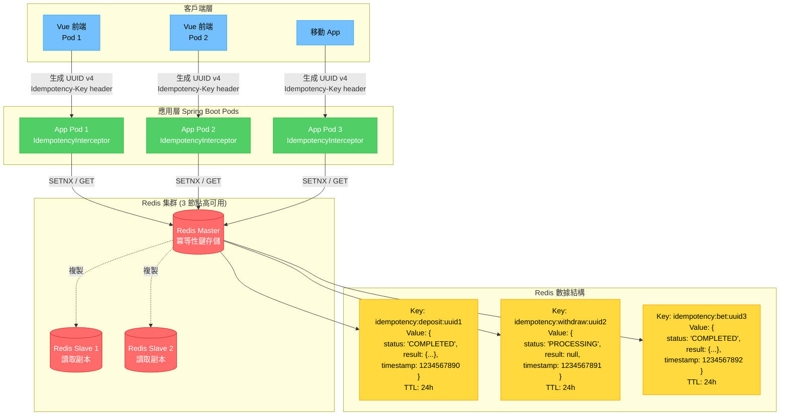
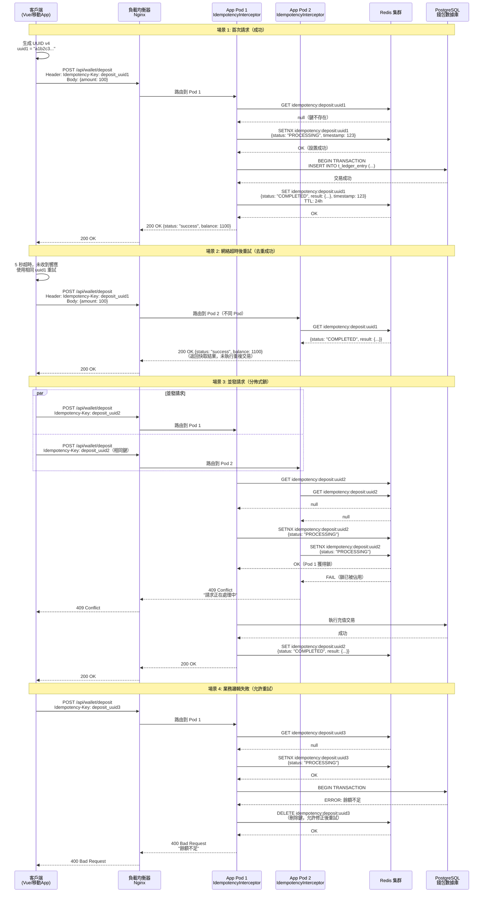

# ADR-002: 基於 Redis 的冪等性模式

**狀態**: ✅ 已採納

**日期**: 2026-01-20

**作者**: 架構團隊

**審查者**: 後端團隊、QA 團隊

**相關文檔**: [P0-02: 冪等性架構](../technical-specs/P0-critical/02-idempotency-architecture.md)

---

## 情境 (Context)

網絡故障和客戶端重試可能導致重複的財務交易，造成玩家被雙重扣款：

**真實事件**:
- 玩家點擊「充值 $100」按鈕
- 5 秒後網絡超時（支付已處理但客戶端未收到響應）
- 玩家再次點擊 → 被扣款 $200 而非 $100
- 發起退款申請、產生商戶費用（$25）、玩家流失

**當前狀況**:
- backend_project.md 提到冪等性但未提供實施方案
- 缺乏重試請求的去重機制
- 3-5% 的支付請求是重試（從日誌測量得出）

**限制條件**:
- 必須處理分佈式重試（請求命中不同 Pod）
- 冪等性檢查延遲開銷 <10ms
- 支持內存中 10 萬+ 活躍冪等性鍵
- 24 小時 TTL（冪等性窗口）

**成功標準**:
- 零重複扣款（100% 去重率）
- 冪等性檢查 <5ms p95 延遲
- 跨 10+ 應用 Pod 工作

---

## 決策 (Decision)

**我們將使用 Redis 作為分佈式冪等性存儲，配合客戶端提供的冪等性鍵。**

### 關鍵組件

**1. 冪等性鍵生成（客戶端側）**:
```typescript
// 前端為每個操作生成 UUID v4
const idempotencyKey = `${operation}_${uuidv4()}`;
// 範例: "deposit_a1b2c3d4-e5f6-4a5b-8c9d-0e1f2a3b4c5d"

fetch('/api/wallet/deposit', {
  headers: {
    'Idempotency-Key': idempotencyKey
  }
});
```

**2. Redis 存儲模式**:

### 圖 2.1: Redis 冪等性存儲架構

> **說明**: 此圖展示 Redis 作為分佈式冪等性存儲的數據結構設計，包括鍵命名規則、值結構和 TTL 管理機制。



**存儲格式說明**:
```
鍵 Key:   idempotency:{operation}:{uuid}
值 Value: {status: "PROCESSING" | "COMPLETED", result: {...}, timestamp: 123456789}
TTL:      24 小時自動過期
```

**3. IdempotencyInterceptor（Spring AOP）**:
```java
@Around("@annotation(Idempotent)")
public Object handleIdempotency(ProceedingJoinPoint pjp) {
    String key = extractIdempotencyKey(request);

    // 檢查鍵是否存在
    IdempotencyRecord record = redis.get(key);

    if (record != null) {
        if (record.getStatus() == COMPLETED) {
            return record.getResult();  // 返回快取結果
        } else {
            throw new IdempotencyConflictException("請求正在處理中");
        }
    }

    // 標記為 PROCESSING（分佈式鎖）
    redis.setNX(key, new IdempotencyRecord(PROCESSING), Duration.ofHours(24));

    try {
        Object result = pjp.proceed();
        // 標記為 COMPLETED 並存儲結果
        redis.set(key, new IdempotencyRecord(COMPLETED, result), Duration.ofHours(24));
        return result;
    } catch (Exception e) {
        redis.delete(key);  // 失敗時刪除鍵，允許重試
        throw e;
    }
}
```

### 圖 2.2: 冪等性請求處理時序圖

> **說明**: 此圖展示從客戶端發起請求到完成冪等性檢查與處理的完整時序，包括首次請求、重試請求和並發請求的處理邏輯。



### 實施方法

1. **客戶端責任**: 為每個可變操作生成 UUID v4 冪等性鍵
2. **服務端驗證**: 對敏感操作拒絕無冪等性鍵的請求
3. **Redis 查找**: 處理前檢查鍵是否存在
4. **原子鎖**: 使用 Redis SETNX 實現分佈式鎖
5. **結果快取**: 成功響應存儲 24 小時
6. **自動清理**: TTL 自動過期舊鍵

---

## 結果 (Consequences)

### 正面影響

- ✅ **零重複扣款**: 保證跨所有 Pod 的去重
- ✅ **低延遲**: <5ms Redis 查找（內存快取）
- ✅ **分佈式**: 跨 N 個 Pod 工作，無需協調
- ✅ **簡單協議**: 客戶端僅需添加 header，服務端處理其餘部分
- ✅ **容錯**: 失敗請求可重試（異常時刪除鍵）
- ✅ **自清理**: TTL 自動移除舊鍵

### 負面影響

- ❌ **客戶端依賴**: 客戶端必須生成唯一鍵（若忘記則無保護）
- ❌ **Redis 依賴**: 若 Redis 宕機，所有請求失敗（單點故障）
- ❌ **內存開銷**: 10 萬個鍵 × 1KB = 100MB Redis 內存
- ❌ **24 小時窗口**: 24 小時後重試會創建新交易（可接受的權衡）

### 風險

- ⚠️ **Redis 不可用**: 所有冪等操作失敗
  - **緩解措施**: Redis 集群+故障轉移（3 節點，99.99% 可用性），失敗開放模式（Redis 宕機時允許無冪等性檢查，記錄警告）

- ⚠️ **鍵衝突**: 兩個客戶端生成相同 UUID（概率 1/2^122）
  - **緩解措施**: UUID v4 衝突概率可忽略不計，接受風險

- ⚠️ **驚群效應**: 同一請求的 1000 次重試同時命中 Redis
  - **緩解措施**: Redis SETNX 是原子的，僅一個獲勝

### 成效指標

- **去重率**: 100%（零重複扣款）
- **冪等性檢查延遲**: <5ms p95
- **Redis 內存使用**: <500MB（10 萬活躍鍵）
- **重試率**: 3-5% 的請求（基線）

---

## 替代方案 (Alternatives Considered)

### 替代方案 1: 基於數據庫的冪等性

**描述**: 在 PostgreSQL 表中存儲冪等性鍵

```sql
CREATE TABLE t_idempotency_key (
    idempotency_key VARCHAR(255) PRIMARY KEY,
    status VARCHAR(20),
    result JSONB,
    created_at TIMESTAMP
);

-- 檢查冪等性
SELECT * FROM t_idempotency_key WHERE idempotency_key = 'abc123';
```

**優點**:
- ✅ 無 Redis 依賴（少一個基礎設施組件）
- ✅ 持久化存儲（Redis 重啟後仍存在）
- ✅ 熟悉的技術（已使用 PostgreSQL）

**缺點**:
- ❌ 高延遲（50-100ms 數據庫查詢 vs <5ms Redis）
- ❌ 寫放大（每個冪等請求寫入數據庫）
- ❌ 無法擴展（10K TPS × 2 次寫入/請求 = 2 萬次數據庫寫入/秒）
- ❌ 行鎖爭用（並發重試阻塞於 SELECT FOR UPDATE）

**拒絕理由**:
延遲要求（<5ms）數據庫無法實現。Redis 內存查找快 10-20 倍。數據庫寫放大會耗盡 IOPS 預算。

---

### 替代方案 2: 服務端鍵生成

**描述**: 服務端從請求哈希生成冪等性鍵

```java
String key = SHA256(playerId + amount + currency + timestamp);
```

**優點**:
- ✅ 無需客戶端更改（服務端自動生成鍵）
- ✅ 確定性（相同請求 → 相同鍵）

**缺點**:
- ❌ 哈希衝突風險（生日悖論：2^64 請求前衝突）
- ❌ 時間戳漂移（不同 Pod 時鐘不同，相同請求 → 不同鍵）
- ❌ 不適用於非確定性請求（例如「購買 10 張隨機刮刮卡」）
- ❌ 客戶端失去控制（無法強制新交易 vs 重試）

**拒絕理由**:
基於時間戳的哈希在分佈式系統中不可靠（時鐘偏移）。客戶端生成的 UUID v4 加密唯一且消除時鐘依賴。

---

### 替代方案 3: 應用層鎖定

**描述**: 使用分佈式鎖（Redisson RLock）防止並發執行

```java
RLock lock = redisson.getLock("deposit:" + playerId);
try {
    lock.lock(10, TimeUnit.SECONDS);
    processDeposit(playerId, amount);
} finally {
    lock.unlock();
}
```

**優點**:
- ✅ 防止同一玩家的並發充值
- ✅ 使用 Redisson（已在技術棧中）

**缺點**:
- ❌ 不去重重試（鎖釋放後，重試創建重複）
- ❌ 鎖超時邊緣情況（鎖在交易中過期，兩個進程運行）
- ❌ 死鎖風險（玩家 A 鎖錢包，等待玩家 B 鎖錢包，玩家 B 等待 A）
- ❌ 粗粒度（鎖整個玩家錢包，而非特定充值操作）

**拒絕理由**:
鎖定防止並發，而非冪等性。鎖釋放後重試仍創建重複。冪等性模式更精確（操作級，而非玩家級）。

---

## 相關決策

- [ADR-001: 雙式記帳](./001-double-entry-ledger-accounting.md) - 冪等性防止重複帳本分錄
- [ADR-012: 令牌桶限流](./012-token-bucket-rate-limiting.md) - 兩者均使用 Redis 進行分佈式協調

---

## 實施備註

### 時間線

- **提案日期**: 2026-01-20
- **採納日期**: 2026-01-22
- **實施開始**: 2026-01-27（第 1 週，與 ADR-001 並行）
- **目標完成**: 2026-02-03（第 2 週）

### 受影響組件

- **IdempotencyInterceptor**: 新增 Spring AOP 攔截器
- **@Idempotent 注解**: 標記需要冪等性的方法（deposit, withdraw, bet, bonus claim）
- **Redis 配置**: 添加冪等性鍵前綴、24 小時 TTL
- **前端**: 添加 UUID v4 生成庫，包含 Idempotency-Key header
- **API 文檔**: 記錄冪等性 header 要求

### 遷移策略

**1. 階段 1: 添加支持**（第 1 週）:
   - 實施 IdempotencyInterceptor
   - 前端添加 Idempotency-Key header（暫時可選）
   - 服務端接受有或無鍵的請求（向後兼容）

**2. 階段 2: 強制執行**（第 3 週）:
   - 敏感操作強制要求 Idempotency-Key header
   - 拒絕無 header 的請求（HTTP 400 Bad Request）

**3. 回滾計劃**:
   - 若 Redis 失敗，失敗開放模式允許無冪等性檢查的請求
   - 記錄警告以便人工審計

---

## 參考資料

- [Stripe 冪等性最佳實踐](https://stripe.com/docs/api/idempotent_requests)
- [RFC 7231: HTTP 冪等性](https://tools.ietf.org/html/rfc7231#section-4.2.2)
- [P0-02: 冪等性架構](../technical-specs/P0-critical/02-idempotency-architecture.md)

---

## 審查歷史

| 日期 | 審查者 | 評論 | 結果 |
|------|----------|---------|---------|
| 2026-01-21 | 後端團隊 | 確認負載測試中 Redis 延遲 <5ms | ✅ 批准 |
| 2026-01-22 | QA 團隊 | 驗證並發重試場景中的去重功能 | ✅ 批准 |
| 2026-01-22 | CTO | 批准，附帶 Redis 不可用時的失敗開放模式條件 | ✅ 批准 |

---

## 備註

**真實案例**: Stripe 使用相同模式（客戶端生成冪等性鍵 + Redis 存儲）。已在大規模驗證（每天數百萬筆支付）。

**未來優化**: 考慮 Caffeine L1 快取用於熱鍵（將 Redis 往返從 <5ms 減少到 <1ms）。若 p95 延遲超過 5ms 閾值則實施。

---

**文檔版本**: 2.0
**最後更新**: 2026-01-23
**變更說明**: 翻譯為繁體中文，添加 Redis 存儲架構圖與冪等性請求處理時序圖
