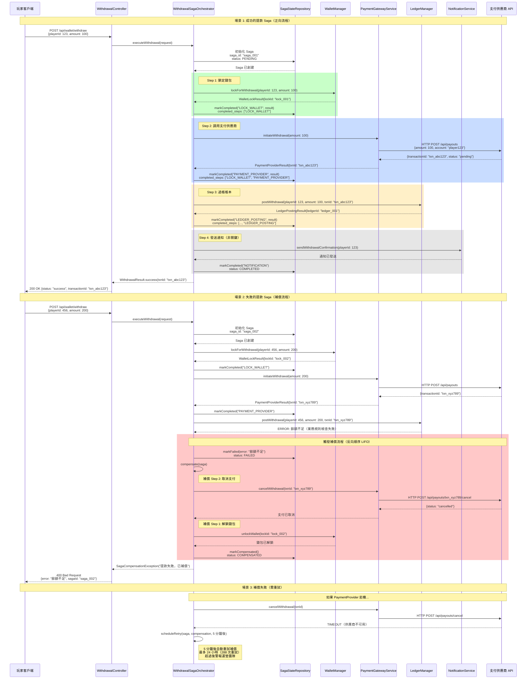

# ADR-003: Saga 模式處理分佈式事務

**狀態**: ✅ 已採納

**日期**: 2026-01-20

**作者**: 架構團隊、後端團隊

**審查者**: CTO、QA 團隊

**相關文檔**: [P1-05: 分佈式事務模式](../technical-specs/P1-important/05-distributed-transaction-patterns.md), [P0-03: 無縫錢包實現](../technical-specs/P0-critical/03-seamless-wallet-implementation.md)

---

## 情境 (Context)

iGaming 平台需要跨多個服務和數據庫的分佈式事務：

**關鍵分佈式流程**:
1. **提款**: 錢包扣款 → 支付供應商 API → 帳本過帳 → 通知
2. **充值**: 支付網關 → 錢包加款 → 帳本過帳 → 觸發優惠
3. **遊戲回合**: 錢包扣款（投注）→ 遊戲供應商 API → 錢包加款（贏獎）→ 帳本過帳

**失敗場景**（真實事件）:
- **提款事件**（2025-Q4）: 支付供應商扣款但錢包未扣減 → $5K 損失
- **充值事件**（2025-Q3）: 錢包已加款但帳本未過帳 → 對帳失配
- **遊戲回合事件**: 玩家投注已處理但遊戲供應商超時 → 投注卡住，玩家投訴

**限制條件**:
- 無法使用 2PC（兩階段提交）：支付供應商不支持 XA 事務
- 必須維持最終一致性（非關鍵路徑可接受）
- 必須保證錢包操作的強一致性（資金不可丟失）
- 補償必須在 5 分鐘內完成（玩家體驗）

**成功標準**:
- 99.99% 事務成功率（每 1 萬筆交易 1 次失敗）
- <5 分鐘補償時間（回滾失敗交易）
- 零資金損失（數學確定性）
- 完整審計追蹤（誰做了什麼，何時）

---

## 決策 (Decision)

**我們將對所有分佈式操作使用基於編排的 Saga 模式配合補償事務。**

### 圖 3.1: Saga Orchestrator 架構

> **說明**: 此圖展示 Saga 編排器的整體架構，包括協調器、各個服務步驟、狀態管理和補償機制的關係。

```mermaid
graph TB
    subgraph "客戶端層"
        CLIENT[玩家客戶端<br>發起提款請求]
    end

    subgraph "API 層"
        CONTROLLER[WithdrawalController<br>@RestController]
    end

    subgraph "Saga 編排層 Orchestration Layer"
        ORCHESTRATOR[WithdrawalSagaOrchestrator<br>中央協調器]
        SAGA_STATE[(Saga 狀態管理<br>t_saga_state PostgreSQL)]
        COMPENSATOR[補償調度器<br>CompensationScheduler]
    end

    subgraph "業務服務層 Business Services"
        WALLET[錢包管理器<br>WalletManager]
        PAYMENT[支付網關服務<br>PaymentGatewayService]
        LEDGER[帳本管理器<br>LedgerManager]
        NOTIFY[通知服務<br>NotificationService]
    end

    subgraph "外部系統 External Systems"
        PAYMENT_PROVIDER[支付供應商 API<br>Stripe/PayPal/Crypto]
        KAFKA[Kafka 事件流<br>WithdrawalCompleted]
    end

    subgraph "補償動作層 Compensation Actions"
        COMP_WALLET[錢包鎖補償<br>WalletLockCompensation]
        COMP_PAYMENT[支付補償<br>PaymentProviderCompensation]
        COMP_LEDGER[帳本補償<br>LedgerCompensation]
    end

    CLIENT -->|POST /api/wallet/withdraw| CONTROLLER
    CONTROLLER -->|executeWithdrawal| ORCHESTRATOR

    ORCHESTRATOR -->|Step 1: Lock Wallet| WALLET
    ORCHESTRATOR -->|Step 2: Initiate Payment| PAYMENT
    ORCHESTRATOR -->|Step 3: Post Ledger| LEDGER
    ORCHESTRATOR -->|Step 4: Send Notification| NOTIFY

    ORCHESTRATOR -->|記錄步驟狀態| SAGA_STATE
    SAGA_STATE -.->|讀取已完成步驟| ORCHESTRATOR

    PAYMENT -->|HTTP 調用| PAYMENT_PROVIDER
    NOTIFY -->|發布事件| KAFKA

    ORCHESTRATOR -->|失敗觸發補償| COMPENSATOR

    COMPENSATOR -->|補償 Step 3| COMP_LEDGER
    COMPENSATOR -->|補償 Step 2| COMP_PAYMENT
    COMPENSATOR -->|補償 Step 1| COMP_WALLET

    COMP_LEDGER -->|reverseWithdrawal| LEDGER
    COMP_PAYMENT -->|cancelWithdrawal| PAYMENT
    COMP_WALLET -->|unlockWallet| WALLET

    classDef client fill:#74c0fc,stroke:#339af0,color:#000
    classDef api fill:#51cf66,stroke:#37b24d,color:#fff
    classDef orchestration fill:#ffd93d,stroke:#f59f00,color:#000
    classDef service fill:#f783ac,stroke:#e64980,color:#000
    classDef external fill:#ff6b6b,stroke:#c92a2a,color:#fff
    classDef compensation fill:#b197fc,stroke:#9775fa,color:#000

    class CLIENT client
    class CONTROLLER api
    class ORCHESTRATOR,SAGA_STATE,COMPENSATOR orchestration
    class WALLET,PAYMENT,LEDGER,NOTIFY service
    class PAYMENT_PROVIDER,KAFKA external
    class COMP_WALLET,COMP_PAYMENT,COMP_LEDGER compensation
```

### 關鍵組件

**1. Saga 協調器（編排器）**:
```java
@Service
@RequiredArgsConstructor
public class WithdrawalSagaOrchestrator {
    private final WalletManager walletManager;
    private final PaymentGatewayService paymentService;
    private final LedgerManager ledgerManager;
    private final NotificationService notificationService;
    private final SagaStateRepository sagaStateRepository;

    @Transactional(rollbackFor = Exception.class)
    public WithdrawalResult executeWithdrawal(WithdrawalRequest request) {
        SagaState saga = initializeSaga(request);

        try {
            // 步驟 1: 鎖定錢包（樂觀鎖）
            saga.addStep("LOCK_WALLET");
            WalletLockResult lockResult = walletManager.lockForWithdrawal(
                request.getPlayerId(),
                request.getAmount()
            );
            saga.markCompleted("LOCK_WALLET", lockResult);

            // 步驟 2: 調用支付供應商
            saga.addStep("PAYMENT_PROVIDER");
            PaymentProviderResult paymentResult = paymentService.initiateWithdrawal(
                request.getPaymentMethod(),
                request.getAmount(),
                request.getPlayerId()
            );
            saga.markCompleted("PAYMENT_PROVIDER", paymentResult);

            // 步驟 3: 過帳帳本分錄
            saga.addStep("LEDGER_POSTING");
            LedgerPostingResult ledgerResult = ledgerManager.postWithdrawal(
                request.getPlayerId(),
                request.getAmount(),
                paymentResult.getTransactionId()
            );
            saga.markCompleted("LEDGER_POSTING", ledgerResult);

            // 步驟 4: 發送通知（非關鍵）
            saga.addStep("NOTIFICATION");
            notificationService.sendWithdrawalConfirmation(request.getPlayerId());
            saga.markCompleted("NOTIFICATION");

            saga.markSuccess();
            return WithdrawalResult.success(paymentResult.getTransactionId());

        } catch (Exception e) {
            saga.markFailed(e);
            compensate(saga);
            throw new SagaCompensationException("提款失敗，已補償", e);
        }
    }

    private void compensate(SagaState saga) {
        List<String> completedSteps = saga.getCompletedSteps();

        // 反向順序補償（LIFO）
        if (completedSteps.contains("LEDGER_POSTING")) {
            ledgerManager.reverseWithdrawal(saga.getLedgerPostingId());
        }

        if (completedSteps.contains("PAYMENT_PROVIDER")) {
            paymentService.cancelWithdrawal(saga.getPaymentProviderId());
        }

        if (completedSteps.contains("LOCK_WALLET")) {
            walletManager.unlockWallet(saga.getWalletLockId());
        }

        saga.markCompensated();
        sagaStateRepository.save(saga);
    }
}
```

**2. Saga 狀態管理**:
```sql
CREATE TABLE t_saga_state (
    saga_id VARCHAR(64) PRIMARY KEY,
    saga_type VARCHAR(32) NOT NULL,  -- WITHDRAWAL, DEPOSIT, GAME_ROUND
    tenant_id VARCHAR(64) NOT NULL,
    player_id BIGINT NOT NULL,

    status VARCHAR(20) NOT NULL,  -- PENDING, COMPLETED, FAILED, COMPENSATED
    current_step VARCHAR(32),
    completed_steps JSONB,  -- ["LOCK_WALLET", "PAYMENT_PROVIDER"]

    request_payload JSONB,
    response_payload JSONB,
    error_message TEXT,

    created_at TIMESTAMP DEFAULT CURRENT_TIMESTAMP,
    updated_at TIMESTAMP DEFAULT CURRENT_TIMESTAMP,
    completed_at TIMESTAMP,

    INDEX idx_tenant_player (tenant_id, player_id),
    INDEX idx_status_created (status, created_at)
);
```

**3. 補償動作**:
```java
public interface CompensationAction {
    void compensate(SagaState saga) throws CompensationException;
}

@Component
public class WalletLockCompensation implements CompensationAction {
    @Override
    public void compensate(SagaState saga) {
        String lockId = saga.getStepData("LOCK_WALLET").get("lockId");
        walletManager.unlockWallet(lockId);
        log.info("已補償錢包鎖: {}", lockId);
    }
}

@Component
public class PaymentProviderCompensation implements CompensationAction {
    @Override
    public void compensate(SagaState saga) {
        String providerId = saga.getStepData("PAYMENT_PROVIDER").get("transactionId");

        try {
            paymentService.cancelWithdrawal(providerId);
        } catch (ProviderUnavailableException e) {
            // 供應商宕機，排程重試
            sagaCompensationScheduler.scheduleRetry(saga, this, Duration.ofMinutes(5));
        }
    }
}
```

**4. 冪等性集成**:
```java
@Around("@annotation(SagaStep)")
public Object ensureIdempotency(ProceedingJoinPoint pjp, SagaStep annotation) {
    SagaState saga = getSagaFromContext();
    String stepName = annotation.value();

    // 檢查步驟是否已完成（冪等重試）
    if (saga.isStepCompleted(stepName)) {
        return saga.getStepResult(stepName);
    }

    Object result = pjp.proceed();
    saga.markStepCompleted(stepName, result);
    return result;
}
```

### 圖 3.2: 提款 Saga 執行時序圖

> **說明**: 此圖展示提款 Saga 的完整執行流程，包括成功場景（正向流程）和失敗場景（補償流程）的時序細節。



### 實施方法

1. **設計 Saga 流程**：提款、充值、遊戲回合
2. **實施 Saga 協調器**：步驟追蹤與補償
3. **創建補償動作**：每個 Saga 步驟的補償邏輯
4. **集成冪等性**（ADR-002）處理重試
5. **添加監控**（Prometheus 指標追蹤 Saga 成功/失敗率）
6. **實施重試機制**：處理暫時性失敗

---

## 結果 (Consequences)

### 正面影響

- ✅ **無需 2PC**: 可與非 XA 支付供應商協作（無供應商限制）
- ✅ **最終一致性**: 大多數 iGaming 流程可接受（充值、提款）
- ✅ **完整審計追蹤**: 每個步驟都有時間戳記錄（監管合規）
- ✅ **自動補償**: 失敗交易自動回滾（<5 分鐘）
- ✅ **冪等步驟**: 安全重試失敗步驟，無重複操作
- ✅ **靈活**: 易於添加新步驟或修改補償邏輯

### 負面影響

- ❌ **複雜度**: 比簡單數據庫事務更多代碼（編排器、補償邏輯）
- ❌ **最終一致性**: 錢包餘額可能暫時不一致（可接受的權衡）
- ❌ **補償失敗**: 若補償失敗，需人工介入（罕見）
- ❌ **延遲**: 多次網絡跳轉增加延遲（50-100ms 開銷）

### 風險

- ⚠️ **補償失敗**: 補償期間支付供應商宕機（無法取消提款）
  - **緩解措施**: 24 小時內每 5 分鐘重試補償，10 次失敗後警報運營團隊

- ⚠️ **Saga 狀態損壞**: Saga 執行期間數據庫崩潰（狀態丟失）
  - **緩解措施**: Saga 狀態存儲在 PostgreSQL（ACID），預寫日誌確保持久性

- ⚠️ **驚群效應**: 1000 次失敗提款同時觸發補償
  - **緩解措施**: 限制補償重試速率（最多 100 個並發補償）

### 成效指標

- **Saga 成功率**: 99.99%（每 1 萬筆交易 1 次失敗）
- **補償時間 p95**: <2 分鐘
- **補償成功率**: 99.9%（0.1% 需人工介入）
- **Saga 開銷**: 每筆交易 50-100ms

---

## 替代方案 (Alternatives Considered)

### 替代方案 1: 兩階段提交（2PC）

**描述**: 跨數據庫和支付供應商使用分佈式 XA 事務

```java
@Transactional(propagation = Propagation.REQUIRED)
public void withdrawalWith2PC() {
    // 所有操作在單一 XA 事務中
    walletDao.debit(playerId, amount);
    paymentProviderXA.initiateWithdrawal(amount);  // 需要 XA 支持
    ledgerDao.post(playerId, amount);
}
```

**優點**:
- ✅ **強一致性**: 跨所有資源的 ACID
- ✅ **簡單代碼**: 單一事務，無補償邏輯
- ✅ **自動回滾**: 數據庫處理失敗時的回滾

**缺點**:
- ❌ **需要 XA 支持**: 大多數支付供應商不支持 XA（Stripe、PayPal、加密貨幣）
- ❌ **性能**: 2PC 需要鎖定所有資源（高延遲、低吞吐量）
- ❌ **阻塞**: 若協調器崩潰，所有資源保持鎖定（死鎖）
- ❌ **供應商鎖定**: 限制於 XA 兼容的支付供應商

**拒絕理由**:
支付供應商（Stripe、PayPal、加密貨幣交易所）不支持 XA 事務。2PC 會限制我們使用高費用和慢速處理的傳統銀行 API。Saga 模式可與任何基於 HTTP 的支付供應商協作。

---

### 替代方案 2: 基於編舞的 Saga

**描述**: 事件驅動的 Saga，每個服務監聽事件並發布下一個事件

```
錢包服務:
  - 監聽: WithdrawalRequested
  - 動作: 扣減錢包
  - 發布: WalletDebited

支付服務:
  - 監聽: WalletDebited
  - 動作: 調用支付供應商
  - 發布: PaymentInitiated

帳本服務:
  - 監聽: PaymentInitiated
  - 動作: 過帳帳本分錄
  - 發布: WithdrawalCompleted
```

**優點**:
- ✅ **解耦**: 服務彼此不知道（事件驅動）
- ✅ **可擴展**: 每個服務獨立處理（並行執行）
- ✅ **彈性**: 服務失敗不會阻塞其他服務（最終一致性）

**缺點**:
- ❌ **調試複雜**: 難以追蹤跨服務的事務流（需要分佈式追蹤）
- ❌ **無中央控制**: 無法暫停/恢復 Saga（無編排器）
- ❌ **循環依賴**: 補償事件可能導致無限循環
- ❌ **測試困難**: 必須模擬所有事件發布者/訂閱者

**拒絕理由**:
對於關鍵財務流程（提款、充值），我們需要中央控制和可見性。基於編排的 Saga 提供單一點監控事務進度、暫停以供人工審查或觸發補償。編舞更適合非關鍵流程（通知、分析）。

---

### 替代方案 3: Outbox 模式配合輪詢

**描述**: 將 Saga 步驟存儲在數據庫「outbox」表中，輪詢並異步執行

```sql
CREATE TABLE t_saga_outbox (
    id BIGSERIAL PRIMARY KEY,
    saga_id VARCHAR(64),
    step_name VARCHAR(32),
    payload JSONB,
    status VARCHAR(20),  -- PENDING, PROCESSING, COMPLETED
    retry_count INT DEFAULT 0,
    next_retry_at TIMESTAMP
);

-- 後台工作者每 5 秒輪詢一次
SELECT * FROM t_saga_outbox WHERE status = 'PENDING' AND next_retry_at < NOW();
```

**優點**:
- ✅ **持久化**: 步驟存儲在數據庫中，能從崩潰中恢復
- ✅ **可重試**: 失敗步驟由輪詢器自動重試
- ✅ **解耦**: 同步 HTTP → 異步處理

**缺點**:
- ❌ **延遲**: 輪詢延遲（5-30 秒）對錢包操作不可接受
- ❌ **數據庫負載**: 輪詢查詢持續運行（高讀取負載）
- ❌ **無即時反饋**: 客戶端必須輪詢交易狀態（糟糕的 UX）
- ❌ **複雜狀態**: 必須在 outbox 表中追蹤步驟依賴

**拒絕理由**:
提款需要 <200ms p95 延遲（ADR-003 無縫錢包）。Outbox 輪詢引入 5-30 秒延遲。同步 Saga 執行為玩家提供即時反饋。Outbox 模式更適合最終一致性流程（玩家分群、分析）。

---

## 相關決策

- [ADR-001: 雙式記帳](./001-double-entry-ledger-accounting.md) - 帳本過帳是 Saga 步驟
- [ADR-002: 基於 Redis 的冪等性](./002-redis-based-idempotency.md) - Saga 步驟是冪等的
- [ADR-006: 多租戶隔離](./006-multi-tenant-row-level-isolation.md) - Saga 狀態包含 tenant_id

---

## 實施備註

### 時間線

- **提案日期**: 2026-01-20
- **採納日期**: 2026-01-22
- **實施開始**: 2026-02-03（第 5 週）
- **目標完成**: 2026-02-10（第 6 週）

### 受影響組件

- **WithdrawalSagaOrchestrator**: 實施提款 Saga（4 個步驟）
- **DepositSagaOrchestrator**: 實施充值 Saga（3 個步驟）
- **GameRoundSagaOrchestrator**: 實施遊戲回合 Saga（投注 + 贏獎）
- **SagaStateRepository**: 將 Saga 狀態持久化到 PostgreSQL
- **CompensationScheduler**: 重試失敗補償（Snail-Job）
- **SagaMonitor**: Prometheus 指標追蹤 Saga 成功/失敗率

### 遷移策略

**1. 階段 1: 實施提款 Saga**（第 5 週）:
   - 創建 SagaState 表
   - 實施 WithdrawalSagaOrchestrator
   - 為每個步驟添加補償動作
   - 部署到測試環境，使用真實支付供應商沙盒測試

**2. 階段 2: 並行運行**（第 6 週）:
   - 與現有流程並行運行基於 Saga 的提款
   - 比較結果（應 100% 匹配）
   - 監控補償成功率（目標 99.9%）

**3. 階段 3: 切換**（第 7 週）:
   - 將 10% 流量切換到基於 Saga 的提款（金絲雀）
   - 監控 48 小時（若補償率 >0.1% 則警報）
   - 逐步增加到 100% 流量

**4. 回滾計劃**:
   - 若補償率超過 1%，回滾到非 Saga 流程
   - 接受暫時不一致，人工對帳
   - 根本原因修復後恢復 Saga 部署

---

## 參考資料

- [微服務模式（Chris Richardson）：Saga 模式](https://microservices.io/patterns/data/saga.html)
- [分佈式 Saga：協調微服務的協議（Hector Garcia-Molina）](https://www.cs.cornell.edu/andru/cs711/2002fa/reading/sagas.pdf)
- [P1-05: 分佈式事務模式](../technical-specs/P1-important/05-distributed-transaction-patterns.md)
- [AWS: Saga 編排 vs 編舞](https://aws.amazon.com/blogs/compute/managing-backend-requests-and-frontend-notifications-in-serverless-web-apps/)

---

## 審查歷史

| 日期 | 審查者 | 評論 | 結果 |
|------|----------|---------|---------|
| 2026-01-21 | 後端團隊 | 使用支付供應商沙盒驗證補償邏輯 | ✅ 批准 |
| 2026-01-22 | QA 團隊 | 確認負載測試中 <5 分鐘補償時間 | ✅ 批准 |
| 2026-01-22 | CTO | 批准，附帶條件：監控補償率，若 >0.1% 則警報 | ✅ 批准 |

---

## 備註

**編排 vs 編舞**: 對於關鍵財務流程，編排提供更好的可見性和控制。編舞適合非關鍵事件驅動流程（通知、分析更新）。

**補償順序**: 始終以反向順序補償（LIFO）。若步驟 3 失敗，補償步驟 2，然後步驟 1。這確保一致的回滾語義。

**冪等性**: Saga 步驟必須是冪等的（ADR-002）。重試「PAYMENT_PROVIDER」步驟不應對玩家重複扣款。對所有外部 API 調用使用冪等性鍵。

**未來增強**: 實施 Saga 可視化儀表板（Grafana）顯示實時 Saga 執行進度、補償率和需要人工介入的失敗交易。

---

**文檔版本**: 2.0
**最後更新**: 2026-01-23
**變更說明**: 翻譯為繁體中文，添加 Saga Orchestrator 架構圖與提款執行時序圖
