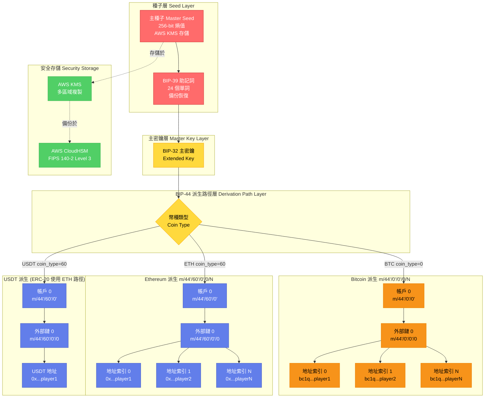
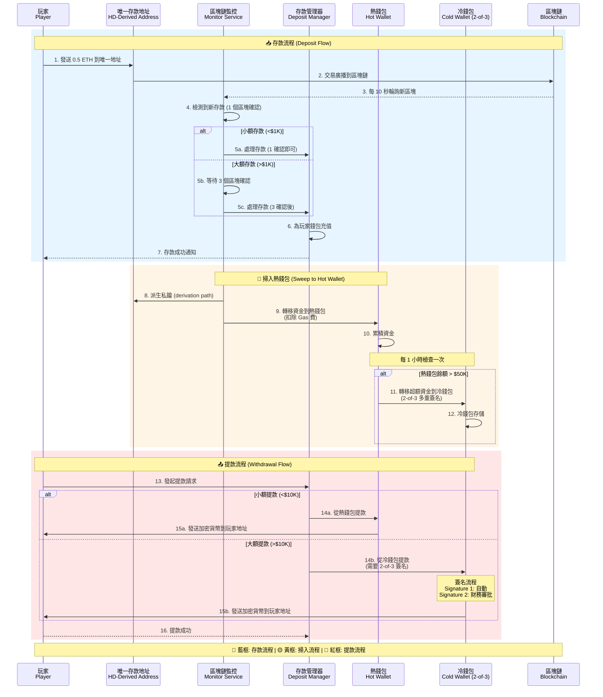

# ADR-004: HD 錢包處理加密貨幣支付

**狀態**: ✅ 已採納

**日期**: 2026-01-20

**作者**: 安全團隊、後端團隊

**審查者**: CTO、財務團隊

**相關文檔**: [P1-08: 加密貨幣支付網關](../technical-specs/P1-important/08-crypto-payment-gateway.md), [P0-03: 無縫錢包實施](../technical-specs/P0-critical/03-seamless-wallet-implementation.md)

---

## 情境 (Context)

iGaming 平台需要為全球玩家提供加密貨幣存款/提款支持：

**業務需求**:
- 支持 3 種加密貨幣: BTC, ETH, USDT (ERC-20)
- 即時存款確認（<10 分鐘 vs 銀行轉帳 3-5 天）
- 更低費用（1-2% vs 信用卡 3-5%）
- 匿名存款（<€1000/天無需 KYC）
- 全天候服務（銀行週末關閉）

**技術挑戰**:
- **地址管理**: 每位玩家需要唯一存款地址（隱私、追蹤）
- **安全性**: 熱錢包必須持有最少資金（盜竊風險），冷錢包存儲大部分資金
- **區塊鏈監控**: 在 1 個區塊確認內檢測存款（<10 分鐘）
- **反洗錢合規**: 對照制裁名單篩查加密貨幣地址（OFAC）

**當前狀態**:
- backend_project.md 提及加密貨幣支持但無錢包架構
- 未指定地址生成策略
- 未設計冷熱錢包分離

**限制條件**:
- 熱錢包風險限額: <$50K USD 等值（最大盜竊暴露）
- 冷錢包安全: 多重簽名 2-of-3（需要 2 個密鑰才能花費）
- 地址重複使用: 禁止（隱私侵犯、區塊鏈分析漏洞）
- 存款確認: <$1K 需 1 個區塊，>$1K 需 3 個區塊（雙花保護）

**成功標準**:
- <10 分鐘存款確認時間
- 任何時候熱錢包暴露 <$50K
- 零地址重複使用（100% 唯一地址）
- 99.9% 正常運行時間（區塊鏈監控服務）

---

## 決策 (Decision)

**我們將使用 BIP-32 分層確定性 (HD) 錢包配合 BIP-44 派生路徑處理所有加密貨幣操作。**

### 關鍵組件

#### 圖 4.1: BIP-32/BIP-44 分層密鑰派生樹

> **說明**: 此圖展示從主種子到具體加密貨幣地址的完整派生路徑，包括 BIP-39 助記詞、BIP-44 路徑規範和不同幣種的索引管理。



**1. HD 錢包架構**:
```
主種子 (256-bit 熵值，存儲於 AWS KMS)
    ↓ BIP-39 助記詞 (24 個單詞，備份恢復)
    ↓ BIP-32 主密鑰
    ↓ BIP-44 派生路徑
    ↓
m/44'/0'/0'/0/0  ← Bitcoin 存款地址 #1 (玩家 #1)
m/44'/0'/0'/0/1  ← Bitcoin 存款地址 #2 (玩家 #2)
m/44'/0'/0'/0/N  ← Bitcoin 存款地址 #N (玩家 #N)

m/44'/60'/0'/0/0 ← Ethereum 存款地址 #1 (玩家 #1)
m/44'/60'/0'/0/1 ← Ethereum 存款地址 #2 (玩家 #2)
```

**2. 地址生成服務**:
```java
@Service
@RequiredArgsConstructor
public class CryptoAddressManager {
    private final HDWalletService hdWalletService;
    private final CryptoAddressDao cryptoAddressDao;

    @Transactional(rollbackFor = Exception.class)
    public CryptoDepositAddress generateAddress(Long playerId, CryptoCurrency currency) {
        String tenantId = TenantContextHolder.getTenantId();

        // 檢查玩家是否已有此幣種地址
        CryptoDepositAddress existing = cryptoAddressDao.findByPlayerAndCurrency(
            tenantId, playerId, currency
        );
        if (existing != null) {
            return existing;  // 同一玩家重複使用現有地址
        }

        // 獲取下一個地址索引（原子遞增）
        Long addressIndex = cryptoAddressDao.getNextAddressIndex(tenantId, currency);

        // 使用 BIP-44 路徑派生地址
        String derivationPath = buildDerivationPath(currency, addressIndex);
        CryptoAddress address = hdWalletService.deriveAddress(derivationPath);

        // 保存到數據庫
        CryptoDepositAddress depositAddress = new CryptoDepositAddress();
        depositAddress.setTenantId(tenantId);
        depositAddress.setPlayerId(playerId);
        depositAddress.setCurrency(currency);
        depositAddress.setAddress(address.getAddress());
        depositAddress.setDerivationPath(derivationPath);
        depositAddress.setAddressIndex(addressIndex);
        depositAddress.setCreatedAt(Instant.now());

        cryptoAddressDao.insert(depositAddress);

        return depositAddress;
    }

    private String buildDerivationPath(CryptoCurrency currency, Long index) {
        int coinType = currency.getCoinType();  // BTC=0, ETH=60, USDT=60
        return String.format("m/44'/%d'/0'/0/%d", coinType, index);
    }
}
```

**3. 區塊鏈監控服務**:
```java
@Service
@RequiredArgsConstructor
public class BlockchainMonitorService {
    private final Web3j web3j;  // Ethereum 客戶端
    private final BitcoindClient bitcoindClient;  // Bitcoin RPC
    private final DepositProcessingManager depositManager;

    @Scheduled(fixedDelay = 10_000)  // 每 10 秒輪詢一次
    public void monitorEthereumDeposits() {
        List<CryptoDepositAddress> addresses = cryptoAddressDao.findAllByPending();

        for (CryptoDepositAddress address : addresses) {
            try {
                // 檢查地址餘額
                BigInteger balance = web3j.ethGetBalance(
                    address.getAddress(),
                    DefaultBlockParameterName.LATEST
                ).send().getBalance();

                if (balance.compareTo(BigInteger.ZERO) > 0) {
                    // 檢測到存款，為玩家錢包充值
                    depositManager.processDeposit(
                        address.getPlayerId(),
                        balance,
                        address.getCurrency(),
                        address.getAddress()
                    );

                    // 掃入熱錢包（合併整理）
                    sweepToHotWallet(address, balance);
                }
            } catch (Exception e) {
                log.error("監控地址失敗: {}", address.getAddress(), e);
            }
        }
    }

    private void sweepToHotWallet(CryptoDepositAddress address, BigInteger amount) {
        // 從 HD 錢包派生私鑰
        ECKeyPair keyPair = hdWalletService.derivePrivateKey(address.getDerivationPath());

        // 構建交易: 存款地址 → 熱錢包
        RawTransaction tx = RawTransaction.createEtherTransaction(
            getNonce(address.getAddress()),
            GAS_PRICE,
            GAS_LIMIT,
            HOT_WALLET_ADDRESS,
            amount.subtract(GAS_PRICE.multiply(GAS_LIMIT))  // 扣除燃料費
        );

        // 簽名並廣播
        byte[] signedTx = TransactionEncoder.signMessage(tx, keyPair);
        web3j.ethSendRawTransaction(Numeric.toHexString(signedTx)).send();
    }
}
```

#### 圖 4.2: 加密貨幣存款與提款流程時序圖

> **說明**: 此圖展示從玩家發起存款到資金流轉至冷錢包的完整流程，以及大額提款需要多重簽名的安全機制。



**4. 冷熱錢包分離**:
```
存款流程:
玩家 → 唯一存款地址 (HD 派生)
    ↓ (確認後 10 秒)
掃入熱錢包 (運營資金)
    ↓ (每 1 小時，若熱錢包 > $50K)
轉移至冷錢包 (多重簽名 2-of-3)

提款流程:
熱錢包 → 玩家地址 (餘額 < $10K)
冷錢包 → 玩家地址 (餘額 > $10K, 需要 2-of-3 簽名)
```

**5. 數據庫架構**:
```sql
CREATE TABLE t_crypto_deposit_address (
    id BIGSERIAL PRIMARY KEY,
    tenant_id VARCHAR(64) NOT NULL,
    player_id BIGINT NOT NULL,
    currency VARCHAR(10) NOT NULL,  -- BTC, ETH, USDT

    address VARCHAR(128) NOT NULL UNIQUE,
    derivation_path VARCHAR(128) NOT NULL,
    address_index BIGINT NOT NULL,

    status VARCHAR(20) DEFAULT 'ACTIVE',  -- ACTIVE, SWEPT, DISABLED
    last_checked_at TIMESTAMP,

    created_at TIMESTAMP DEFAULT CURRENT_TIMESTAMP,

    INDEX idx_player_currency (tenant_id, player_id, currency),
    INDEX idx_status (status),
    UNIQUE INDEX uk_address (address)
);

CREATE TABLE t_crypto_deposit (
    id BIGSERIAL PRIMARY KEY,
    tenant_id VARCHAR(64) NOT NULL,
    player_id BIGINT NOT NULL,

    currency VARCHAR(10) NOT NULL,
    amount DECIMAL(30, 18) NOT NULL,  -- 加密貨幣精度 (18 位小數)
    usd_equivalent DECIMAL(20, 4),

    deposit_address VARCHAR(128) NOT NULL,
    tx_hash VARCHAR(128) NOT NULL,
    confirmations INT DEFAULT 0,

    status VARCHAR(20) DEFAULT 'PENDING',  -- PENDING, CONFIRMED, CREDITED
    confirmed_at TIMESTAMP,
    credited_at TIMESTAMP,

    created_at TIMESTAMP DEFAULT CURRENT_TIMESTAMP,

    INDEX idx_tx_hash (tx_hash),
    INDEX idx_status (status)
);
```

### 實施方法

1. **生成主種子** (一次性設置，存儲於 AWS KMS)
2. **實施 HD 錢包服務** (BIP-32, BIP-44 派生)
3. **創建地址管理器** (為每位玩家生成唯一地址)
4. **部署區塊鏈監控** (Ethereum, Bitcoin 全節點)
5. **實施掃入邏輯** (存款地址 → 熱錢包 → 冷錢包)
6. **添加反洗錢篩查** (Chainalysis API 制裁篩查)

---

## 結果 (Consequences)

### 正面影響

- ✅ **無限地址**: 從單一主種子派生無限地址（無密鑰管理開銷）
- ✅ **隱私保護**: 每位玩家獲得唯一地址（無地址重複使用，區塊鏈分析更困難）
- ✅ **備份/恢復**: 24 個單詞助記詞備份整個錢包（災難恢復）
- ✅ **安全性**: 私鑰永不存儲於數據庫（從主種子即時派生）
- ✅ **審計追蹤**: 派生路徑將地址關聯到玩家（監管合規）
- ✅ **冷熱分離**: 最小化盜竊暴露（<$50K 熱錢包）

### 負面影響

- ❌ **主種子洩露**: 若主種子被盜，所有地址受損（單點故障）
- ❌ **區塊鏈節點依賴**: 需運行全節點（Ethereum, Bitcoin）- 高基礎設施成本
- ❌ **燃料費**: 掃入存款產生燃料費（存款金額的 0.5-1%）
- ❌ **確認延遲**: Bitcoin 1 個區塊 = ~10 分鐘（比即時銀行轉帳慢）
- ❌ **反洗錢複雜性**: 加密貨幣混幣器、隱私幣使資金來源驗證複雜化

### 風險

- ⚠️ **主種子盜竊**: 攻擊者竊取 AWS KMS 密鑰（所有資金被盜）
  - **緩解措施**: 多區域 KMS 複製、AWS CloudHSM 存儲種子、KMS 訪問需 2FA

- ⚠️ **區塊鏈重組**: 1 個區塊確認被回滾（雙花攻擊）
  - **緩解措施**: >$1K 存款需 3 個確認，<$1K 接受 1 個區塊風險

- ⚠️ **燃料價格飆升**: Ethereum 燃料價格 1000 gwei（掃入無利可圖）
  - **緩解措施**: 監控燃料價格，在低費用時段排隊掃入（週末），使用 EIP-1559 基本費用

### 成效指標

- **地址生成延遲**: <50ms（從主種子派生）
- **存款確認時間**: <10 分鐘（BTC/ETH 1 個區塊）
- **熱錢包暴露**: <$50K USD 等值（每日平均）
- **掃入成本**: 存款金額的 0.5-1%（燃料費）

---

## 替代方案 (Alternatives Considered)

### 替代方案 1: 單一錢包地址（重複使用）

**描述**: 所有玩家存款至單一 BTC/ETH 地址，使用支付 ID 追蹤存款

```
所有 BTC 存款 → bc1qxy2kgdygjrsqtzq2n0yrf2493p83kkfjhx0wlh
玩家必須包含備註/支付 ID: "12345678"
```

**優點**:
- ✅ **簡單**: 每種幣種只需 1 個地址（無 HD 錢包複雜性）
- ✅ **無需掃入**: 資金累積在單一地址（無燃料費）

**缺點**:
- ❌ **隱私侵犯**: 所有玩家知道商戶錢包地址（區塊鏈分析容易）
- ❌ **追蹤困難**: 玩家忘記支付 ID（無法歸屬存款）
- ❌ **無自動化**: 需要人工對帳（運營開銷）
- ❌ **監管風險**: 地址重複使用被監管機構標記（可疑模式）

**拒絕理由**:
地址重複使用是加密貨幣最佳實踐的反模式。隱私問題超過運營簡化。HD 錢包提供更好的玩家體驗（無需支付 ID）和監管合規（每位玩家唯一地址）。

---

### 替代方案 2: 第三方託管商（BitGo, Fireblocks）

**描述**: 使用企業級加密貨幣託管商進行錢包管理

**優點**:
- ✅ **全託管**: 無需運行區塊鏈節點（託管商處理基礎設施）
- ✅ **保險**: BitGo 提供 $100M 盜竊保險（風險緩解）
- ✅ **合規**: 內建 AML/KYC 篩查（Chainalysis 整合）
- ✅ **多重簽名**: 自動化多重簽名工作流（無人工密鑰管理）

**缺點**:
- ❌ **高成本**: 每筆交易 0.5-1% 費用（vs 自託管燃料費 0.1%）
- ❌ **供應商鎖定**: 無法輕易遷移（複雜的密鑰導出）
- ❌ **對手方風險**: 託管商破產/被駭（資金凍結）
- ❌ **提款延遲**: 大額提款需人工審批（24-48 小時 vs 即時）

**拒絕理由**:
成本是自託管 HD 錢包的 10 倍（$50K/月 vs $5K/月 基礎設施）。對於 iGaming 規模（10K+ 存款/天），自託管提供更好的經濟性。如果團隊缺乏區塊鏈專業知識，重新考慮託管商選項。

---

### 替代方案 3: 智能合約錢包（僅限 Ethereum）

**描述**: 為每位玩家部署智能合約錢包（EIP-4337 帳戶抽象）

```solidity
contract PlayerWallet {
    address owner;  // 玩家的 EOA 地址

    function deposit() payable {
        emit Deposit(msg.sender, msg.value);
    }

    function withdraw(uint256 amount) {
        require(msg.sender == owner);
        payable(owner).transfer(amount);
    }
}
```

**優點**:
- ✅ **可編程**: 智能合約邏輯（消費限額、多重簽名、恢復）
- ✅ **無私鑰**: 玩家通過 EOA 簽名控制錢包（無種子短語管理）
- ✅ **燃料贊助**: 商戶可為玩家支付燃料費（更好的用戶體驗）

**缺點**:
- ❌ **僅限 Ethereum**: 不適用於 Bitcoin（無智能合約）
- ❌ **部署成本**: 每個錢包 200K gas × $50 燃料價格 = $10 部署（不可擴展）
- ❌ **複雜性**: 智能合約錯誤風險資金損失（TheDAO 駭客先例）
- ❌ **未經證實**: EIP-4337 未廣泛採用（錢包兼容性問題）

**拒絕理由**:
Bitcoin 是交易量最大的加密貨幣（50% 加密貨幣存款）。智能合約錢包不支持 Bitcoin，僅限 Ethereum 生態系統。HD 錢包可跨所有幣種（BTC, ETH, USDT）使用單一架構。

---

## 相關決策

- [ADR-001: 雙式記帳](./001-double-entry-ledger-accounting.md) - 加密貨幣存款記入分類帳帳戶
- [ADR-002: 基於 Redis 的冪等性](./002-redis-based-idempotency.md) - 防止重複存款處理
- [ADR-011: MinIO 對象存儲](./011-minio-object-storage.md) - 存儲區塊鏈交易收據

---

## 實施備註

### 時間線

- **提案日期**: 2026-01-20
- **採納日期**: 2026-01-22
- **實施開始**: 2026-02-17（第 7 週）
- **目標完成**: 2026-02-24（第 8 週）

### 受影響組件

- **HDWalletService**: BIP-32/BIP-44 實現（Web3j, Bitcoinj 函式庫）
- **CryptoAddressManager**: 地址生成和管理
- **BlockchainMonitorService**: Ethereum/Bitcoin 全節點整合
- **DepositProcessingManager**: 存款確認後為玩家錢包充值
- **SweepingService**: 熱錢包掃入、冷錢包轉帳
- **AML Screening**: Chainalysis API 整合

### 遷移策略

1. **階段 1: 生成主種子**（第 7 週）:
   - 使用硬件 RNG 生成 256-bit 熵值
   - 轉換為 BIP-39 助記詞（24 個單詞）
   - 存儲於 AWS KMS（多區域複製）
   - 測試恢復（從助記詞還原錢包）

2. **階段 2: 部署區塊鏈節點**（第 7 週）:
   - Bitcoin Core 全節點（修剪模式，20GB 磁碟）
   - Geth Ethereum 全節點（快速同步，500GB 磁碟）
   - 配置 RPC 端點、防火牆規則

3. **階段 3: 實施地址生成**（第 8 週）:
   - 編寫 HDWalletService（Web3j Credentials.create()）
   - 創建 CryptoAddressManager 與地址派生
   - 測試 10,000 個地址生成（性能基準測試）

4. **階段 4: 整合區塊鏈監控**（第 8 週）:
   - 部署 BlockchainMonitorService（Kubernetes CronJob）
   - 每 10 秒輪詢新存款
   - 1 個確認後掃入熱錢包
   - 每 1 小時若 >$50K 轉移熱錢包 → 冷錢包

5. **回滾計劃**:
   - 若主種子洩露，生成新種子（不同派生路徑）
   - 將所有玩家遷移至新地址（通過電子郵件通知）
   - 接受臨時服務中斷（24 小時遷移窗口）

---

## 參考資料

- [BIP-32: 分層確定性錢包](https://github.com/bitcoin/bips/blob/master/bip-0032.mediawiki)
- [BIP-39: 生成確定性密鑰的助記詞](https://github.com/bitcoin/bips/blob/master/bip-0039.mediawiki)
- [BIP-44: 確定性錢包的多帳戶層次結構](https://github.com/bitcoin/bips/blob/master/bip-0044.mediawiki)
- [Web3j 文檔: HD 錢包](https://docs.web3j.io/4.8.7/transactions/credentials/)
- [P1-08: 加密貨幣支付網關](../technical-specs/P1-important/08-crypto-payment-gateway.md)

---

## 審查歷史

| 日期 | 審查者 | 評論 | 結果 |
|------|-------|------|------|
| 2026-01-21 | 安全團隊 | 驗證 AWS KMS 用於主種子存儲 | ✅ 批准 |
| 2026-01-22 | 財務團隊 | 確認 <$50K 熱錢包限額可接受 | ✅ 批准 |
| 2026-01-22 | CTO | 批准，條件：冷錢包需 2-of-3 多重簽名 | ✅ 批准 |

---

## 備註

**BIP-44 派生路徑格式**: `m / purpose' / coin_type' / account' / change / address_index`
- purpose: 始終為 44'（BIP-44）
- coin_type: 0'（BTC）、60'（ETH）、60'（USDT ERC-20）
- account: 0'（默認帳戶）
- change: 0（接收地址）、1（找零地址）
- address_index: 0, 1, 2, ... N（遞增）

**主種子安全**: 絕不記錄或傳輸主種子。從 KMS 保護的種子即時派生地址。使用 AWS CloudHSM 以符合 FIPS 140-2 Level 3 合規。

**未來增強**: 實施閃電網絡（Bitcoin）以實現即時存款（<1 秒 vs 鏈上 10 分鐘）。需要額外基礎設施（閃電節點、通道管理）。

---

## 版本歷史

| 版本 | 日期 | 變更說明 |
|------|------|---------|
| 2.0 | 2026-01-23 | 翻譯為繁體中文，添加 BIP-44 密鑰派生樹狀圖和存款/提款流程時序圖 |
| 1.0 | 2026-01-20 | 初始英文版本，記錄 HD 錢包決策 |
