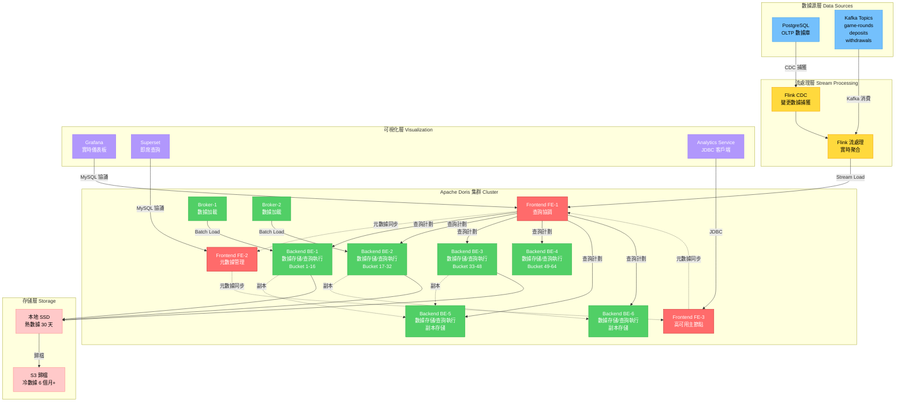
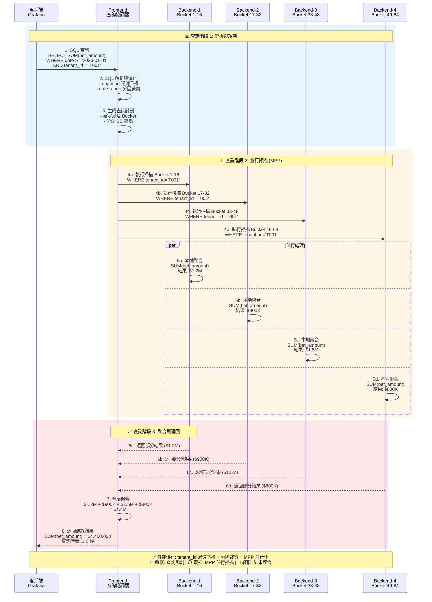

# ADR-005: Apache Doris OLAP 分析引擎

**狀態**: ✅ 已採納

**日期**: 2026-01-20

**作者**: 數據團隊、架構團隊

**審查者**: CTO、產品團隊

**相關文檔**: [P1-13: 報表與分析](../technical-specs/P1-important/13-reporting-analytics.md)

---

## 情境 (Context)

iGaming 平台需要實時分析支持商業智能、玩家行為分析和監管報告：

**業務需求**:
- 實時儀表板: GGR、玩家數量、熱門遊戲（刷新 <5 秒）
- 玩家分析: RFM 分群、流失預測、LTV 計算
- 監管報告: 按司法管轄區的每日 GGR、玩家活動日誌
- 即席查詢: 產品團隊需要在 <2 秒內查詢 30 天數據

**數據規模**:
- 100M+ 事件/天（投注、贏錢、存款、提款）
- 1M+ 活躍玩家
- 熱查詢保留 30 天，合規保留 7 年
- 每年 10TB+ 數據增長

**當前狀態**:
- backend_project.md 使用 Apache Doris 進行 OLAP
- igame_str.md 推薦 ClickHouse（需求分析中發現不一致）
- 未提供 Doris vs ClickHouse 決策理由

**限制條件**:
- 查詢延遲: 30 天聚合 <2 秒
- 並發查詢: 100+ 用戶同時訪問儀表板
- 實時數據新鮮度: 從事件到可查詢 <5 分鐘
- 多租戶隔離: 租戶 A 無法查詢租戶 B 的數據

**成功標準**:
- 90% 查詢延遲 <2 秒
- 支持 10,000+ 查詢/天
- 數據新鮮度 <5 分鐘（事件到可查詢）

---

## 決策 (Decision)

**我們將使用 Apache Doris 2.1 作為實時分析的 OLAP 引擎。**

### 關鍵組件

#### 圖 5.1: Apache Doris 集群架構與數據流

> **說明**: 此圖展示 Apache Doris 的 FE/BE 節點架構、數據從 Kafka 經 Flink 流入 Doris 的完整路徑，以及與 Grafana 儀表板的集成。



**1. 架構**:
```
Kafka (事件) → Flink (流處理) → Doris (OLAP)
                                    ↓
                              Grafana (儀表板)
```

**2. Doris 集群配置**:
- **Frontend (FE)**: 3 個節點（查詢協調、元數據）
- **Backend (BE)**: 6 個節點（數據存儲、查詢執行）
- **Broker**: 2 個節點（從 Kafka/HDFS 加載數據）

**3. 數據模型**:
```sql
-- 聚合鍵模型 (用於指標)
CREATE TABLE player_daily_metrics (
    tenant_id VARCHAR(64),
    player_id BIGINT,
    date DATE,
    total_deposits DECIMAL(20, 4) SUM,
    total_withdrawals DECIMAL(20, 4) SUM,
    total_bets DECIMAL(20, 4) SUM,
    total_wins DECIMAL(20, 4) SUM,
    session_count BIGINT SUM
)
AGGREGATE KEY(tenant_id, player_id, date)
DISTRIBUTED BY HASH(player_id) BUCKETS 32;

-- 明細鍵模型 (用於原始事件)
CREATE TABLE game_rounds (
    tenant_id VARCHAR(64),
    round_id VARCHAR(128),
    player_id BIGINT,
    game_id BIGINT,
    bet_amount DECIMAL(20, 4),
    win_amount DECIMAL(20, 4),
    timestamp DATETIME
)
DUPLICATE KEY(tenant_id, round_id)
DISTRIBUTED BY HASH(round_id) BUCKETS 64
PARTITION BY RANGE(timestamp) ();
```

**4. 數據加載（Flink CDC）**:
```java
// 從 Kafka 實時流式傳輸到 Doris
DataStream<GameRound> stream = env
    .addSource(new FlinkKafkaConsumer<>("game-rounds", deserializer, props))
    .keyBy(GameRound::getPlayerId)
    .process(new GameRoundProcessor());

stream.addSink(DorisSink.<GameRound>builder()
    .setDorisOptions(dorisOptions)
    .setSerializer(new SimpleStringSerializer())
    .build());
```

#### 圖 5.2: Doris MPP 查詢執行流程

> **說明**: 此圖展示 Apache Doris 如何利用 MPP (大規模並行處理) 架構將查詢並行化到多個 BE 節點，實現亞秒級聚合查詢。



### 實施方法

1. **部署 Doris 集群**（Kubernetes 上 3 FE + 6 BE 節點）
2. **配置 Flink CDC 管道**（Kafka → Doris 流式傳輸）
3. **創建物化視圖**（為常見查詢預聚合指標）
4. **整合 Grafana**（用於儀表板的 JDBC 連接器）
5. **設置數據生命週期**（按月分區，>6 個月歸檔至 S3）

---

## 結果 (Consequences)

### 正面影響

- ✅ **亞秒級查詢**: MPP 架構在節點間並行化查詢（30 天聚合 <2 秒）
- ✅ **實時數據**: 從 Kafka 流式攝取（<5 分鐘新鮮度）
- ✅ **MySQL 兼容性**: 標準 SQL 語法，分析師易於學習
- ✅ **物化視圖**: 預計算聚合以實現即時儀表板
- ✅ **成本效益**: 開源（Apache 2.0 許可證），無供應商鎖定
- ✅ **多租戶**: 通過 `tenant_id` 過濾下推實現行級安全
- ✅ **自動擴展**: 水平添加 BE 節點以增加存儲/計算

### 負面影響

- ❌ **運營複雜性**: 需要專門的運維團隊進行集群管理
- ❌ **學習曲線**: 新技術（團隊不熟悉 vs PostgreSQL）
- ❌ **數據重複**: 事件同時存儲在 PostgreSQL（事務性）和 Doris（分析性）
- ❌ **無 OLTP JOIN**: 無法將 Doris 表與實時 PostgreSQL 數據聯接
- ❌ **最終一致性**: 事件到可查詢有 <5 分鐘延遲（分析可接受）

### 風險

- ⚠️ **集群故障**: 若所有 3 個 FE 節點失敗，無法查詢
  - **緩解措施**: 3 節點 FE 仲裁（可容忍 1 個節點故障），自動故障轉移

- ⚠️ **存儲爆炸**: 100M 事件/天 × 500 字節 = 50GB/天 = 18TB/年
  - **緩解措施**: 按月分區，>6 個月歸檔至 S3，壓縮（3-5 倍縮減）

- ⚠️ **查詢性能下降**: 無過濾器的即席查詢掃描整個表
  - **緩解措施**: 強制 `tenant_id` 和 `date` 範圍過濾器，拒絕無界查詢

### 成效指標

- **查詢延遲 p90**: 30 天聚合 <2 秒
- **數據新鮮度**: <5 分鐘（Kafka → Doris）
- **並發查詢**: 100+ 同時用戶
- **存儲效率**: 比原始數據壓縮 3-5 倍

---

## 替代方案 (Alternatives Considered)

### 替代方案 1: ClickHouse

**描述**: 使用 ClickHouse 代替 Doris 進行 OLAP（如 igame_str.md 中推薦）

**優點**:
- ✅ **更快查詢**: 基準測試顯示 ClickHouse 聚合比 Doris 快 2-3 倍
- ✅ **更好壓縮**: 列式壓縮高達 10 倍（vs Doris 3-5 倍）
- ✅ **成熟生態系統**: 更大社區，更多集成

**缺點**:
- ❌ **非標準 SQL**: ClickHouse SQL 方言與 MySQL/PostgreSQL 不同
- ❌ **無事務**: 不支持 UPDATE/DELETE（僅追加）
- ❌ **弱多租戶**: 無內建行級安全（必須在應用層實現）
- ❌ **複雜複製**: 手動分片管理 vs Doris 自動複製

**拒絕理由**:
多租戶至關重要（100+ 商戶在同一集群）。ClickHouse 缺乏行級安全，需要應用層過濾（易出錯、性能開銷）。Doris 的 MySQL 兼容性降低了已熟悉 SQL 的分析團隊的學習曲線。

**備註**: 若查詢性能成為瓶頸（p90 >5 秒），使用自定義多租戶層重新評估 ClickHouse。

---

### 替代方案 2: PostgreSQL 配合 Timescale/Citus

**描述**: 使用 Timescale（時間序列）或 Citus（分片）擴展 PostgreSQL 進行分析

**優點**:
- ✅ **同一數據庫**: 無數據重複，查詢實時事務數據
- ✅ **ACID 事務**: 完全一致性（無最終一致性延遲）
- ✅ **熟悉技術**: 團隊已了解 PostgreSQL

**缺點**:
- ❌ **OLTP 干擾**: 分析查詢（表掃描）降低事務性能
- ❌ **可擴展性有限**: PostgreSQL 分片複雜，不如 MPP 數據庫成熟
- ❌ **慢聚合**: 行存儲未針對分析優化（比列式慢 10 倍）
- ❌ **資源競爭**: 100M 事件/天過載 PostgreSQL WAL，複製延遲

**拒絕理由**:
在同一數據庫上混合 OLTP 和 OLAP 是反模式。分析查詢干擾錢包操作（關鍵路徑）。單獨的 OLAP 數據庫隔離工作負載。PostgreSQL 分片（Citus）無法匹配 MPP 大型聚合性能。

---

### 替代方案 3: Amazon Redshift / Snowflake

**描述**: 使用雲端托管數據倉庫（AWS Redshift, Snowflake）

**優點**:
- ✅ **全託管**: 無運維負擔（自動擴展、備份、補丁）
- ✅ **規模化驗證**: 財富 500 強公司使用
- ✅ **計算/存儲分離**: 獨立擴展

**缺點**:
- ❌ **高成本**: 所需容量 $1,000-$5,000/月（vs 自託管 Doris $500/月）
- ❌ **供應商鎖定**: 無法輕易遷移離開 AWS/Snowflake
- ❌ **數據出口費**: 從雲導出數據成本 $0.09/GB（18TB/年 = $1,620）
- ❌ **延遲**: 雲端區域可能與 OLTP 數據庫不在同一司法管轄區

**拒絕理由**:
對於我們的規模，成本是自託管 Doris 的 10 倍。數據主權要求（MGA）偏好本地部署或私有雲。如果運維負擔過大，重新考慮 Snowflake。

---

## 相關決策

- [ADR-007: Apache Flink 實時流處理](./007-flink-real-time-stream-processing.md) - Flink 向 Doris 輸送數據
- [ADR-006: 多租戶行級隔離](./006-multi-tenant-row-level-isolation.md) - Doris 中的 tenant_id 過濾

---

## 實施備註

### 時間線

- **提案日期**: 2026-01-20
- **採納日期**: 2026-01-22
- **實施開始**: 2026-02-17（第 7 週）
- **目標完成**: 2026-02-24（第 8 週）

### 受影響組件

- **Doris 集群**: 在 Kubernetes 上部署 3 FE + 6 BE 節點
- **Flink 管道**: 從 Kafka 到 Doris 的 CDC（實時攝取）
- **Grafana**: 添加 Doris 數據源，遷移儀表板
- **Analytics Service**: 查詢 Doris 生成報表（JDBC 驅動）

### 遷移策略

1. **階段 1: 並行運行**（第 7 週）:
   - 部署 Doris 集群
   - 從 PostgreSQL 回填最近 30 天數據
   - 並行運行 Doris 查詢與 PostgreSQL，比較結果

2. **階段 2: 切換**（第 8 週）:
   - 將儀表板切換至查詢 Doris
   - 棄用 PostgreSQL 分析查詢
   - 監控查詢性能（若 p90 >3 秒則告警）

3. **回滾計劃**:
   - 若 Doris 集群失敗，回退至 PostgreSQL 物化視圖
   - 接受性能下降（30 秒查詢延遲）直到 Doris 恢復

---

## 參考資料

- [Apache Doris 文檔](https://doris.apache.org/docs/)
- [Apache Doris vs ClickHouse 基準測試](https://doris.apache.org/blog/doris-vs-clickhouse)
- [P1-13: 報表與分析](../technical-specs/P1-important/13-reporting-analytics.md)
- SelectDB 博客: ["為何我們選擇 Doris 而非 ClickHouse"](https://selectdb.com/blog/doris-vs-clickhouse)

---

## 審查歷史

| 日期 | 審查者 | 評論 | 結果 |
|------|-------|------|------|
| 2026-01-21 | 數據團隊 | 驗證多租戶行級安全 | ✅ 批准 |
| 2026-01-22 | 產品團隊 | 確認 <2 秒查詢延遲滿足儀表板需求 | ✅ 批准 |
| 2026-01-22 | CTO | 批准，條件：若 p90 >5 秒則基準測試 ClickHouse | ✅ 批准 |

---

## 備註

**Doris vs ClickHouse 決策理由**:
- **多租戶**: Doris 內建行級安全，ClickHouse 沒有
- **MySQL 兼容性**: Doris 使用 MySQL 協議/SQL，更易入門
- **成本**: 兩者都是開源，TCO 相似

若查詢性能下降（p90 >5 秒），使用自定義多租戶層重新評估 ClickHouse。

**未來優化**: 考慮 Doris 3.0 發布時（承諾通過向量化引擎實現 5 倍更快聚合）。

---

## 版本歷史

| 版本 | 日期 | 變更說明 |
|------|------|---------|
| 2.0 | 2026-01-23 | 翻譯為繁體中文，添加 Doris 集群架構圖和 MPP 查詢執行流程圖 |
| 1.0 | 2026-01-20 | 初始英文版本，記錄 Apache Doris OLAP 決策 |
