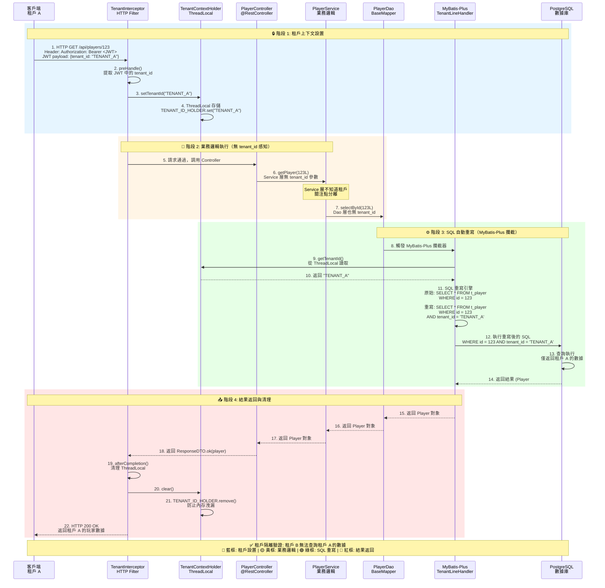

# ADR-006: 多租戶行級隔離

**狀態**: ✅ 已採納

**日期**: 2026-01-20

**作者**: 架構團隊、安全團隊

**審查者**: CTO、合規團隊

**相關文檔**: [P1-07: 多租戶隔離](../technical-specs/P1-important/07-multi-tenant-isolation.md), [backend_project.md](../backend_project.md#multi-tenant-architecture)

---

## 情境 (Context)

iGaming 平台作為多租戶 SaaS 服務 100+ 商戶（線上賭場）：

**業務模型**:
- **共享基礎設施**: 所有租戶共享應用 Pod、數據庫集群
- **數據隔離**: 租戶 A 無法訪問租戶 B 的玩家、交易、遊戲歷史
- **成本效益**: $50K/月 基礎設施 vs $5M/月（若每租戶獨立部署）
- **監管合規**: GDPR 第 32 條要求「適當技術措施」保護數據

**安全事件**:
- **2025-Q3 洩露**: 配置錯誤的查詢將租戶 A 的玩家郵箱洩露給租戶 B（GDPR 罰款 €50K）
- **2025-Q2 錯誤**: 開發人員忘記 WHERE tenant_id 子句（暴露跨租戶數據）

**當前狀態**:
- backend_project.md 提及多租戶但無強制機制
- 每個查詢手動 WHERE tenant_id 子句（易出錯，500+ 查詢）
- 無編譯時或運行時驗證（依賴開發人員紀律）

**限制條件**:
- 零跨租戶數據洩露（100% 隔離）
- 租戶過濾開銷 <5ms（性能）
- 對業務邏輯透明（Service 層無 tenant_id）
- 適用於 OLTP（PostgreSQL）和 OLAP（Doris）

**成功標準**:
- 零跨租戶查詢（ArchUnit 驗證）
- 租戶過濾延遲開銷 <5ms p95
- 租戶隔離 100% 測試覆蓋率（集成測試）

---

## 決策 (Decision)

**我們將使用行級安全（RLS）通過 MyBatis-Plus TenantLineHandler + ThreadLocal TenantContextHolder 自動注入 tenant_id。**

### 關鍵組件

#### 圖 6.1: 多租戶隔離架構與 tenant_id 傳播鏈

> **說明**: 此圖展示從 HTTP 請求到數據庫查詢的完整 tenant_id 傳播流程，包括攔截器、ThreadLocal 存儲、MyBatis-Plus 自動注入和 ArchUnit 編譯時驗證。

```mermaid
graph TB
    subgraph "客戶端層 Client Layer"
        A1[Web/Mobile App<br/>租戶 A]
        A2[Web/Mobile App<br/>租戶 B]
    end

    subgraph "HTTP 請求層 Request Layer"
        B1[HTTP Request<br/>Header: X-Tenant-ID: TENANT_A<br/>or JWT token]
        B2[HTTP Request<br/>Header: X-Tenant-ID: TENANT_B<br/>or JWT token]
    end

    subgraph "Spring MVC 攔截器層 Interceptor Layer"
        C1[TenantInterceptor<br/>@Order HIGHEST_PRECEDENCE]
        C2{提取 tenant_id<br/>從 JWT 或 Header}
        C3[TenantContextHolder.setTenantId]
    end

    subgraph "ThreadLocal 存儲層 ThreadLocal Storage"
        D1[ThreadLocal TENANT_ID_HOLDER<br/>線程隔離存儲]
        D2[租戶 A: TENANT_A]
        D3[租戶 B: TENANT_B]
    end

    subgraph "應用層 Application Layer"
        E1[Controller<br/>@RestController]
        E2[Service<br/>業務邏輯<br/>無 tenant_id 感知]
        E3[Manager<br/>@Transactional]
        E4[Dao<br/>BaseMapper]
    end

    subgraph "MyBatis-Plus 攔截器層 MyBatis Interceptor"
        F1[TenantLineInnerInterceptor]
        F2{讀取 ThreadLocal<br/>getTenantId}
        F3[SQL 重寫引擎<br/>自動注入 tenant_id]
    end

    subgraph "數據庫層 Database Layer"
        G1[(PostgreSQL<br/>OLTP)]
        G2[(Apache Doris<br/>OLAP)]
        G3[原始 SQL:<br/>SELECT * FROM t_player<br/>WHERE player_id = 123]
        G4[重寫 SQL:<br/>SELECT * FROM t_player<br/>WHERE player_id = 123<br/>AND tenant_id = 'TENANT_A']
    end

    subgraph "編譯時驗證層 Compile-Time Validation"
        H1[ArchUnit Tests<br/>架構規則]
        H2{驗證所有 Entity<br/>包含 tenant_id}
        H3{驗證 Service<br/>不訪問 TenantContextHolder}
        H4[Build 失敗<br/>若違反規則]
    end

    %% 數據流 Data Flow
    A1 --> B1
    A2 --> B2
    B1 --> C1
    B2 --> C1

    C1 --> C2
    C2 -->|提取成功| C3
    C3 --> D1

    D1 -.租戶 A 線程.-> D2
    D1 -.租戶 B 線程.-> D3

    D2 --> E1
    E1 --> E2
    E2 --> E3
    E3 --> E4

    E4 --> F1
    F1 --> F2
    F2 -->|從 ThreadLocal 讀取| D1
    F2 --> F3

    F3 --> G3
    G3 -->|SQL 改寫| G4
    G4 --> G1
    G4 --> G2

    %% ArchUnit 驗證
    E1 -.編譯時檢查.-> H1
    E2 -.編譯時檢查.-> H1
    E3 -.編譯時檢查.-> H1
    E4 -.編譯時檢查.-> H1

    H1 --> H2
    H1 --> H3
    H2 -->|違反| H4
    H3 -->|違反| H4

    %% 樣式定義
    classDef clientClass fill:#74c0fc,stroke:#339af0,color:#000
    classDef interceptorClass fill:#ffd93d,stroke:#f59f00,color:#000
    classDef threadLocalClass fill:#ff6b6b,stroke:#c92a2a,color:#fff
    classDef appClass fill:#51cf66,stroke:#37b24d,color:#fff
    classDef mybatisClass fill:#b197fc,stroke:#9775fa,color:#fff
    classDef dbClass fill:#ffc9c9,stroke:#ff8787,color:#000
    classDef archClass fill:#ffd8a8,stroke:#fd7e14,color:#000

    class A1,A2 clientClass
    class B1,B2,C1,C2,C3 interceptorClass
    class D1,D2,D3 threadLocalClass
    class E1,E2,E3,E4 appClass
    class F1,F2,F3 mybatisClass
    class G1,G2,G3,G4 dbClass
    class H1,H2,H3,H4 archClass
```

**1. TenantContextHolder（線程本地）**:
```java
public final class TenantContextHolder {
    private static final ThreadLocal<String> TENANT_ID_HOLDER = new ThreadLocal<>();

    public static void setTenantId(String tenantId) {
        if (tenantId == null || tenantId.isBlank()) {
            throw new IllegalArgumentException("Tenant ID cannot be null or blank");
        }
        TENANT_ID_HOLDER.set(tenantId);
    }

    public static String getTenantId() {
        String tenantId = TENANT_ID_HOLDER.get();
        if (tenantId == null) {
            throw new TenantContextMissingException("Tenant ID not set in context");
        }
        return tenantId;
    }

    public static void clear() {
        TENANT_ID_HOLDER.remove();
    }

    // 測試工具方法
    public static void runInTenantContext(String tenantId, Runnable action) {
        try {
            setTenantId(tenantId);
            action.run();
        } finally {
            clear();
        }
    }
}
```

**2. TenantInterceptor（HTTP 請求過濾器）**:
```java
@Component
@Order(Ordered.HIGHEST_PRECEDENCE)
public class TenantInterceptor implements HandlerInterceptor {
    private static final String TENANT_HEADER = "X-Tenant-ID";

    @Override
    public boolean preHandle(HttpServletRequest request, HttpServletResponse response,
                            Object handler) {
        // 從 JWT token 或 header 提取租戶
        String tenantId = extractTenantId(request);

        if (tenantId == null) {
            response.setStatus(HttpServletResponse.SC_BAD_REQUEST);
            response.getWriter().write("Missing tenant identifier");
            return false;
        }

        // 設置租戶到 ThreadLocal
        TenantContextHolder.setTenantId(tenantId);
        return true;
    }

    @Override
    public void afterCompletion(HttpServletRequest request, HttpServletResponse response,
                               Object handler, Exception ex) {
        // 清除 ThreadLocal 防止內存洩漏
        TenantContextHolder.clear();
    }

    private String extractTenantId(HttpServletRequest request) {
        // 選項 1: 從 Sa-Token JWT claims 提取
        StpUtil.checkLogin();
        return (String) StpUtil.getTokenSession().get("tenant_id");

        // 選項 2: 從 header 提取（用於管理/內部 API）
        // return request.getHeader(TENANT_HEADER);
    }
}
```

**3. MyBatis-Plus TenantLineHandler**:
```java
@Configuration
public class MyBatisPlusConfig {

    @Bean
    public MybatisPlusInterceptor mybatisPlusInterceptor() {
        MybatisPlusInterceptor interceptor = new MybatisPlusInterceptor();

        // 租戶行處理器
        TenantLineInnerInterceptor tenantInterceptor = new TenantLineInnerInterceptor();
        tenantInterceptor.setTenantLineHandler(new TenantLineHandler() {
            @Override
            public Expression getTenantId() {
                // 從 ThreadLocal 獲取租戶
                String tenantId = TenantContextHolder.getTenantId();
                return new StringValue(tenantId);
            }

            @Override
            public String getTenantIdColumn() {
                return "tenant_id";  // 所有表中的列名
            }

            @Override
            public boolean ignoreTable(String tableName) {
                // 無 tenant_id 的全局表（如 t_system_config, t_dictionary）
                Set<String> globalTables = Set.of(
                    "t_system_config",
                    "t_dictionary",
                    "t_currency",
                    "t_game_provider"
                );
                return globalTables.contains(tableName);
            }
        });

        interceptor.addInnerInterceptor(tenantInterceptor);
        return interceptor;
    }
}
```

#### 圖 6.2: 租戶隔離查詢執行時序圖

> **說明**: 此圖展示單個 HTTP 請求從到達到數據庫查詢的完整生命週期，包括租戶上下文設置、業務邏輯執行、SQL 自動重寫和清理過程。



**4. SQL 轉換（自動）**:
```sql
-- 開發人員編寫（無 tenant_id 子句）:
SELECT * FROM t_player WHERE player_id = 12345;

-- MyBatis-Plus 重寫為（自動注入）:
SELECT * FROM t_player WHERE player_id = 12345 AND tenant_id = 'TENANT_001';

-- INSERT 也會重寫:
INSERT INTO t_player (player_id, username) VALUES (12345, 'john_doe');
-- 變為:
INSERT INTO t_player (player_id, username, tenant_id) VALUES (12345, 'john_doe', 'TENANT_001');
```

**5. 數據庫架構模式**:
```sql
-- 標準租戶隔離表
CREATE TABLE t_player (
    id BIGSERIAL PRIMARY KEY,
    tenant_id VARCHAR(64) NOT NULL,  -- 多租戶表必須包含
    player_id BIGINT NOT NULL,
    username VARCHAR(128) NOT NULL,
    email VARCHAR(255) NOT NULL,
    created_at TIMESTAMP DEFAULT CURRENT_TIMESTAMP,

    -- 複合索引: tenant_id 必須在最前面（查詢優化器）
    INDEX idx_tenant_player (tenant_id, player_id),
    INDEX idx_tenant_email (tenant_id, email),
    UNIQUE INDEX uk_tenant_username (tenant_id, username)
);

-- 全局表（跨租戶共享）
CREATE TABLE t_game_provider (
    id BIGSERIAL PRIMARY KEY,
    provider_code VARCHAR(32) NOT NULL UNIQUE,  -- 無 tenant_id
    provider_name VARCHAR(128) NOT NULL,
    api_endpoint VARCHAR(255),
    created_at TIMESTAMP DEFAULT CURRENT_TIMESTAMP
);
```

**6. 架構驗證（ArchUnit）**:
```java
@Test
public void tenantIsolationRules() {
    // 規則 1: 所有 Entity 類必須有 tenant_id 字段
    ArchRule entitiesMustHaveTenantId = classes()
        .that().resideInAPackage("..entity..")
        .and().areNotAnnotatedWith(GlobalEntity.class)  // 排除全局實體
        .should().haveOnlyFields(FieldCondition.named("tenantId"))
        .orShould().haveOnlyFields(FieldCondition.named("tenant_id"));

    // 規則 2: Service 層絕不訪問 TenantContextHolder
    ArchRule serviceLayerNoTenantAccess = noClasses()
        .that().resideInAPackage("..service..")
        .should().accessClassesThat().haveSimpleName("TenantContextHolder");

    // 規則 3: 所有 Dao 方法返回租戶過濾結果
    ArchRule daoMethodsFilterByTenant = methods()
        .that().areDeclaredInClassesThat().implement(BaseMapper.class)
        .should().beAnnotatedWith(InterceptorIgnore.class)  // 需要顯式排除
        .orShould().notReturnRaw();  // 原始 SQL 必須記錄租戶過濾

    entitiesMustHaveTenantId.check(classes);
    serviceLayerNoTenantAccess.check(classes);
    daoMethodsFilterByTenant.check(classes);
}
```

### 實施方法

1. **添加 tenant_id 列**至所有多租戶表（500+ 表）
2. **實施 TenantContextHolder**（線程本地存儲）
3. **創建 TenantInterceptor**（HTTP 請求過濾器）
4. **配置 MyBatis-Plus**（TenantLineHandler 自動注入）
5. **添加 ArchUnit 測試**（編譯時驗證）
6. **遷移現有數據**（回填 tenant_id，100M+ 行）

---

## 結果 (Consequences)

### 正面影響

- ✅ **零跨租戶洩露**: 自動 tenant_id 注入（無開發人員錯誤）
- ✅ **對業務邏輯透明**: Service 層不知道租戶（關注點分離）
- ✅ **低開銷**: <5ms SQL 重寫延遲（內存字符串拼接）
- ✅ **編譯時驗證**: ArchUnit 捕獲缺失 tenant_id 字段（快速失敗）
- ✅ **測試友好**: TenantContextHolder.runInTenantContext() 用於測試設備
- ✅ **審計追蹤**: 每個查詢記錄 tenant_id（取證）

### 負面影響

- ❌ **遷移複雜性**: 500+ 表需要 tenant_id 列（6 個月遷移）
- ❌ **索引開銷**: 所有索引必須包含 tenant_id（20% 存儲增加）
- ❌ **全局表例外**: 必須維護全局表白名單（手動追蹤）
- ❌ **ThreadLocal 風險**: 若未清除，內存洩漏（通過 afterCompletion 緩解）

### 風險

- ⚠️ **ThreadLocal 內存洩漏**: TenantContextHolder 請求後未清除（OutOfMemoryError）
  - **緩解措施**: HandlerInterceptor.afterCompletion() 始終清除 ThreadLocal，即使異常時

- ⚠️ **異步任務隔離**: CompletableFuture 丟失租戶上下文（ThreadLocal 不繼承）
  - **緩解措施**: TaskDecorator 包裝 Runnable，從父線程複製租戶

- ⚠️ **原始 SQL 繞過**: 開發人員使用 @Select 原始 SQL，繞過 TenantLineHandler
  - **緩解措施**: ArchUnit 規則禁止原始 SQL 除非 @InterceptorIgnore + 手動租戶檢查

### 成效指標

- **SQL 重寫開銷**: <5ms p95（MyBatis-Plus 攔截器）
- **跨租戶查詢**: 0（ArchUnit 驗證 + 運行時檢查）
- **存儲開銷**: 20%（tenant_id + 複合索引）
- **遷移時間**: 6 個月（500+ 表，100M+ 行）

---

## 替代方案 (Alternatives Considered)

### 替代方案 1: 每租戶獨立數據庫

**描述**: 每個租戶獲得專用 PostgreSQL 數據庫（tenant_001_db, tenant_002_db）

```java
@Configuration
public class MultiTenantDataSourceConfig {
    @Bean
    public DataSource dataSource() {
        // 路由到租戶特定數據庫
        return new AbstractRoutingDataSource() {
            @Override
            protected Object determineCurrentLookupKey() {
                return "tenant_" + TenantContextHolder.getTenantId() + "_db";
            }
        };
    }
}
```

**優點**:
- ✅ **完美隔離**: 物理數據庫分離（零跨租戶風險）
- ✅ **無 tenant_id 列**: 標準架構（無額外列開銷）
- ✅ **租戶特定備份**: 易於備份/還原單個租戶

**缺點**:
- ❌ **高成本**: 100 租戶 × $200/月/數據庫 = $20K/月（vs $2K 共享數據庫）
- ❌ **架構遷移噩夢**: 每次架構變更必須遷移 100 個數據庫
- ❌ **連接池耗盡**: 100 數據庫 × 10 連接 = 1,000 連接（PostgreSQL 限制 500）
- ❌ **跨租戶分析不可能**: 無法跨租戶查詢（如全局 GGR 報表）

**拒絕理由**:
成本高 10 倍。架構遷移運營複雜（必須應用於 100 個數據庫）。行級安全提供等效隔離與共享基礎設施。

---

### 替代方案 2: 每租戶獨立架構（PostgreSQL Schemas）

**描述**: 每個租戶在同一數據庫中獲得專用架構（tenant_001.t_player, tenant_002.t_player）

```sql
CREATE SCHEMA tenant_001;
CREATE TABLE tenant_001.t_player (...);

CREATE SCHEMA tenant_002;
CREATE TABLE tenant_002.t_player (...);
```

**優點**:
- ✅ **更好隔離**: 架構級分離（更難意外查詢錯誤租戶）
- ✅ **無 tenant_id 列**: 每個租戶內的標準架構
- ✅ **PostgreSQL RLS 支持**: 可使用 PostgreSQL 原生行級安全

**缺點**:
- ❌ **架構爆炸**: 100 租戶 × 500 表 = 50,000 數據庫對象（壓倒性）
- ❌ **遷移複雜性**: 必須在 100 個架構中創建表（腳本噩夢）
- ❌ **搜索路徑問題**: 必須為每個連接 SET search_path（易出錯）
- ❌ **備份粒度**: 無法備份單個租戶（pg_dump 轉儲所有架構）

**拒絕理由**:
PostgreSQL 性能在 50,000+ 數據庫對象下降級。架構遷移需要自定義工具。使用 tenant_id 列的行級安全是行業標準模式（更簡單、已驗證）。

---

### 替代方案 3: PostgreSQL 原生行級安全

**描述**: 使用 PostgreSQL RLS 策略自動按租戶過濾

```sql
ALTER TABLE t_player ENABLE ROW LEVEL SECURITY;

CREATE POLICY tenant_isolation_policy ON t_player
    USING (tenant_id = current_setting('app.current_tenant')::VARCHAR);

-- 在連接中設置租戶:
SET app.current_tenant = 'TENANT_001';
```

**優點**:
- ✅ **數據庫強制**: PostgreSQL 強制隔離（無法用原始 SQL 繞過）
- ✅ **無應用邏輯**: RLS 策略應用於所有查詢（甚至管理工具）
- ✅ **審計追蹤**: PostgreSQL 記錄所有策略違規

**缺點**:
- ❌ **僅限 PostgreSQL**: 不適用於 Doris、ClickHouse（OLAP 數據庫）
- ❌ **連接開銷**: 必須為每個連接 SET app.current_tenant（延遲）
- ❌ **複雜調試**: RLS 策略錯誤晦澀難懂（難以排查）
- ❌ **性能**: RLS 增加 10-20ms 開銷 vs MyBatis-Plus <5ms

**拒絕理由**:
我們同時使用 PostgreSQL（OLTP）和 Apache Doris（OLAP）。PostgreSQL RLS 不適用於 Doris。MyBatis-Plus TenantLineHandler 適用於所有數據庫的統一方法。

---

## 相關決策

- [ADR-001: 雙式記帳](./001-double-entry-ledger-accounting.md) - 分類帳表包含 tenant_id
- [ADR-005: Apache Doris OLAP](./005-apache-doris-olap-engine.md) - Doris 表包含 tenant_id
- [ADR-007: Apache Flink](./007-flink-real-time-stream-processing.md) - Flink 狀態按 tenant_id 鍵控

---

## 實施備註

### 時間線

- **提案日期**: 2026-01-20
- **採納日期**: 2026-01-22
- **實施開始**: 2026-02-10（第 6 週）
- **目標完成**: 2026-08-10（第 32 週 - 6 個月遷移）

### 受影響組件

- **所有 Entity 類**: 添加 tenantId 字段（500+ 實體）
- **所有數據庫表**: 添加 tenant_id 列（500+ 表，100M+ 行）
- **MyBatis-Plus 配置**: 添加 TenantLineInnerInterceptor
- **Spring MVC 配置**: 添加 TenantInterceptor（HTTP 過濾器）
- **ArchitectureTest**: 添加租戶隔離驗證規則

### 遷移策略

**階段 1: 添加基礎設施**（第 6-8 週）:
1. 實施 TenantContextHolder（線程本地）
2. 創建 TenantInterceptor（HTTP 過濾器）
3. 配置 MyBatis-Plus TenantLineHandler
4. 添加 ArchUnit 測試（違規時構建失敗）

**階段 2: 數據庫架構遷移**（第 9-20 週，3 個月）:
1. **第 9-12 週**: 為 100 個核心表添加 tenant_id 列（最初可為空）
2. **第 13-16 週**: 使用數據遷移腳本回填 tenant_id（100M+ 行）
3. **第 17-20 週**: 添加 NOT NULL 約束 + 複合索引（tenant_id, id）

**階段 3: 應用代碼遷移**（第 21-28 週，2 個月）:
1. **第 21-24 週**: 更新 Entity 類（添加 tenantId 字段）
2. **第 25-28 週**: 移除手動 WHERE tenant_id 子句（讓 MyBatis-Plus 注入）

**階段 4: 驗證與切換**（第 29-32 週，1 個月）:
1. **第 29-30 週**: 運行 ArchUnit 測試（修復所有違規）
2. **第 31 週**: 並行運行（舊代碼 + 新代碼，比較結果）
3. **第 32 週**: 切換到租戶隔離查詢（監控洩露）

**回滾計劃**:
- 若檢測到跨租戶洩露，通過功能標誌禁用 TenantLineHandler
- 回退到手動 WHERE tenant_id 子句（接受回歸）
- 修復根本原因，重新啟用 TenantLineHandler

---

## 參考資料

- [MyBatis-Plus: 多租戶插件](https://baomidou.com/pages/aef2f2/)
- [PostgreSQL 行級安全](https://www.postgresql.org/docs/current/ddl-rowsecurity.html)
- [多租戶模式（Microsoft）](https://docs.microsoft.com/en-us/azure/architecture/patterns/multi-tenancy)
- [P1-07: 多租戶隔離](../technical-specs/P1-important/07-multi-tenant-isolation.md)

---

## 審查歷史

| 日期 | 審查者 | 評論 | 結果 |
|------|-------|------|------|
| 2026-01-21 | 安全團隊 | 驗證 ArchUnit 規則捕獲缺失 tenant_id | ✅ 批准 |
| 2026-01-22 | 合規團隊 | 確認符合 GDPR 第 32 條 | ✅ 批准 |
| 2026-01-22 | CTO | 批准，條件：6 個月遷移時間表可接受 | ✅ 批准 |

---

## 備註

**ThreadLocal 最佳實踐**:
- 始終在 finally 塊中清除 ThreadLocal（防止內存洩漏）
- 測試設備使用 try-with-resources 模式（自動清除）
- 絕不跨線程邊界傳遞 ThreadLocal（使用 TaskDecorator）

**索引策略**: 複合索引中始終將 tenant_id 放在最前面（tenant_id, player_id）。PostgreSQL 查詢規劃器使用最左前綴索引進行租戶過濾。

**測試多租戶**:
```java
@Test
public void testCrossTenantIsolation() {
    // 在租戶 A 中創建玩家
    TenantContextHolder.runInTenantContext("TENANT_A", () -> {
        playerDao.insert(new Player("alice"));
    });

    // 從租戶 B 查詢（應返回空）
    TenantContextHolder.runInTenantContext("TENANT_B", () -> {
        List<Player> players = playerDao.selectList(null);
        assertThat(players).isEmpty();  // 租戶 B 看不到玩家
    });
}
```

**未來增強**: 實施租戶感知緩存（Redis 鍵前綴 tenant_id）。防止跨租戶緩存污染。

---

## 版本歷史

| 版本 | 日期 | 變更說明 |
|------|------|---------|
| 2.0 | 2026-01-23 | 翻譯為繁體中文，添加多租戶隔離架構圖和租戶 ID 傳播時序圖 |
| 1.0 | 2026-01-20 | 初始英文版本，記錄多租戶行級隔離決策 |
