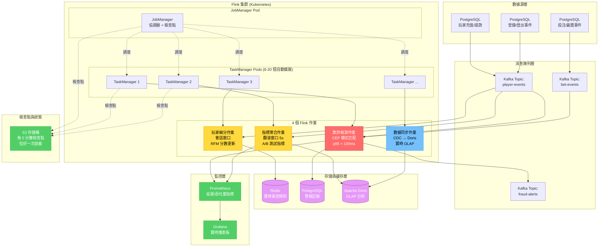
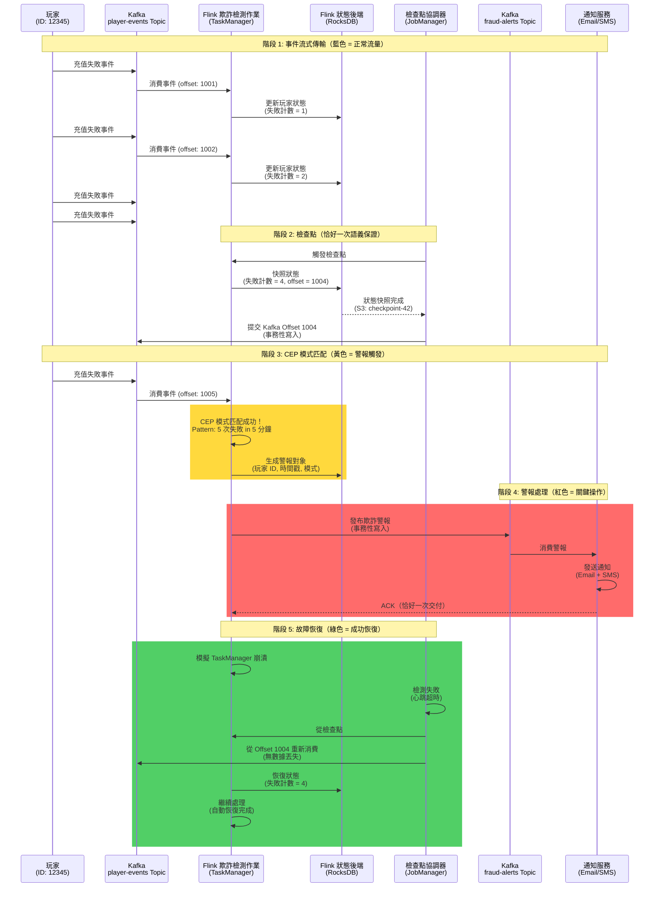

# ADR-007: Apache Flink 實時流處理

**狀態**: ✅ 已接受

**日期**: 2026-01-20

**作者**: 數據團隊、後端團隊

**審查人**: CTO、架構團隊

**相關文檔**: [P1-06: 實時風控引擎](../technical-specs/P1-important/06-real-time-risk-engine.md), [P2-21: A/B 測試](../technical-specs/P2-enhancements/21-ab-testing-framework.md), [P2-22: 玩家細分](../technical-specs/P2-enhancements/22-player-segmentation.md)

---

## 背景

iGaming 平台需要實時流處理來支持多個關鍵功能：

**使用場景**:
1. **欺詐檢測** (P1-06)：在 <100ms 內檢測信用卡測試、優惠濫用、延遲套利
2. **A/B 測試指標** (P2-21)：在 <5 秒內聚合實驗指標
3. **玩家細分** (P2-22)：在 <5 分鐘內更新 RFM 分數和生命週期階段
4. **實時儀表板**：實時 GGR、活躍玩家、熱門遊戲（<5 秒刷新）

**數據特徵**:
- 每天 1 億+ 事件（投注、贏獎、充值、登錄、登出）
- 峰值：重大體育賽事期間每秒 5 萬事件
- 需要有狀態處理（窗口聚合、會話追蹤）
- 恰好一次處理語義（無重複欺詐警報）

**當前狀態**:
- backend_project.md 提到使用 Kafka 進行事件流傳輸
- 未指定流處理框架
- 批處理（每日 cron 任務）有 24 小時延遲（欺詐檢測不可接受）

**約束條件**:
- 延遲：欺詐檢測 <100ms，細分 <5 分鐘
- 吞吐量：持續每秒 5 萬事件
- 容錯性：Pod 失敗時無數據丟失
- 可擴展性：水平擴展以應對 10 倍流量峰值

**成功標準**:
- 關鍵路徑（欺詐檢測）p95 延遲 <100ms
- 批處理路徑（細分、儀表板）延遲 <5 分鐘
- 99.9% 正常運行時間（自動從故障恢復）
- 恰好一次處理（無重複警報）

---

## 決策

**我們將使用 Apache Flink 1.20.0 作為所有實時數據管道的統一流處理框架。**

### 關鍵組件

**1. 架構**:
```
Kafka Topics → Flink Jobs → Sinks (Doris, Redis, PostgreSQL, Kafka)
     ↑
玩家事件（充值、投注、贏獎、登錄等）
```

**2. Flink 作業**:
- **欺詐檢測作業** (P1-06)：CEP 模式、滑動窗口、規則評估
- **指標聚合作業** (P2-21)：翻滾窗口、按 experiment_id + variant 分組
- **細分作業** (P2-22)：會話窗口、RFM 分數計算
- **數據同步作業**：從 PostgreSQL CDC → Doris（實時分析）

**3. 示例：欺詐檢測作業**:
```java
public class FraudDetectionJob {
    public static void main(String[] args) {
        StreamExecutionEnvironment env = StreamExecutionEnvironment.getExecutionEnvironment();

        // Kafka 源
        FlinkKafkaConsumer<PlayerEvent> source = new FlinkKafkaConsumer<>(
            "player-events",
            new PlayerEventDeserializer(),
            kafkaProperties
        );

        DataStream<PlayerEvent> events = env.addSource(source);

        // 模式檢測：5 分鐘內 5 次充值失敗
        Pattern<PlayerEvent, ?> pattern = Pattern.<PlayerEvent>begin("start")
            .where(evt -> evt.getEventType() == EventType.DEPOSIT_FAILED)
            .times(5).within(Time.minutes(5));

        PatternStream<PlayerEvent> patternStream = CEP.pattern(
            events.keyBy(PlayerEvent::getPlayerId),
            pattern
        );

        DataStream<FraudAlert> alerts = patternStream.select(new FraudAlertSelector());

        // 輸出到 Kafka（由通知服務消費）
        alerts.addSink(new FlinkKafkaProducer<>("fraud-alerts", serializer, kafkaProps));

        env.execute("Fraud Detection Job");
    }
}
```

**4. 部署 (Kubernetes)**:
- **JobManager**：1 個 Pod（協調器、檢查點）
- **TaskManager**：6 個 Pod（並行執行，自動擴展至 20 個 Pod）
- **檢查點**：S3 後端（每 5 分鐘，恰好一次語義）

#### 圖 7.1: Flink 流處理架構與事件處理管道

> **說明**: 此圖展示完整的 Flink 實時流處理架構，包含 4 個核心作業（欺詐檢測、指標聚合、玩家細分、數據同步）、Kubernetes 部署模式（1 JobManager + 6-20 TaskManagers）以及與多種數據源和數據匯的集成。



#### 圖 7.2: 欺詐檢測流處理執行流程（CEP 模式匹配）

> **說明**: 此時序圖展示欺詐檢測作業的完整生命週期，從玩家充值失敗事件到 CEP 模式匹配（5 分鐘內 5 次失敗）再到警報生成和通知，包含恰好一次語義的檢查點機制。



### 實施方法

1. **部署 Flink 集群** 在 Kubernetes 上（JobManager + 6 個 TaskManagers）
2. **實現 Flink 作業** 針對每個使用場景（欺詐、指標、細分）
3. **配置檢查點** (S3 後端，5 分鐘間隔)
4. **設置監控** (Prometheus 指標，Grafana 儀表板)
5. **實現自動擴展** (基於 Kafka lag 的 HPA)

---

## 後果

### 正面影響

- ✅ **低延遲**：事件驅動處理（欺詐檢測 <100ms）
- ✅ **有狀態處理**：內置狀態管理（窗口聚合、會話追蹤）
- ✅ **恰好一次語義**：檢查點 + Kafka 事務性寫入（無重複欺詐警報）
- ✅ **容錯性**：自動從故障恢復（從檢查點恢復）
- ✅ **可擴展性**：水平擴展（增加 TaskManager Pod 以提高吞吐量）
- ✅ **統一框架**：單一框架用於所有流處理（vs 多個獨立工具）
- ✅ **SQL 支持**：Flink SQL 用於簡單聚合（無需 Java 代碼）

### 負面影響

- ❌ **運維複雜性**：需要專門的運維團隊（Kubernetes、檢查點、狀態管理）
- ❌ **學習曲線**：複雜的 API（DataStream、CEP、狀態管理）
- ❌ **內存開銷**：有狀態作業需要大堆（每個 TaskManager 10GB+ JVM）
- ❌ **檢查點延遲**：檢查點會暫停處理 1-2 秒（可接受的權衡）
- ❌ **調試難度**：分佈式處理使調試比單線程更困難

### 風險

- ⚠️ **JobManager 失敗**：單點故障（所有作業停止）
  - **緩解措施**：使用 StatefulSet 部署 JobManager（自動重啟），Zookeeper HA 模式

- ⚠️ **狀態大小膨脹**：有狀態作業隨時間累積狀態（內存不足）
  - **緩解措施**：使用 RocksDB 狀態後端（堆外存儲），狀態 TTL（30 天後過期）

- ⚠️ **Kafka Lag 峰值**：流量峰值導致 Kafka lag → Flink 背壓 → 警報延遲
  - **緩解措施**：基於 Kafka lag 的 TaskManager 自動擴展（HPA），為 2 倍峰值流量過度配置

### 指標

- **處理延遲 p95**：欺詐檢測 <100ms，細分 <5 分鐘
- **吞吐量**：持續每秒 5 萬事件
- **檢查點持續時間**：<2 秒（5 分鐘間隔）
- **狀態大小**：每個作業 <50GB（使用 RocksDB 後端）

---

## 考慮的替代方案

### 替代方案 1: Kafka Streams

**描述**: 使用 Kafka Streams（Java 庫）代替 Flink

**優點**:
- ✅ **更簡單的部署**：庫而非集群（無 JobManager/TaskManager）
- ✅ **Kafka 集成**：原生 Kafka 集成（無需單獨框架）
- ✅ **更低延遲**：進程內處理（vs 到 Flink 集群的網絡跳躍）

**缺點**:
- ❌ **無 CEP 支持**：無複雜事件處理（欺詐模式需要自定義代碼）
- ❌ **僅限 Java**：無 Python/Scala 支持（Flink 支持三種）
- ❌ **有限容錯性**：無自動故障恢復
- ❌ **無批處理**：Kafka Streams 僅流式處理（Flink 支持流 + 批）

**拒絕原因**:
欺詐檢測需要 CEP (P1-06) 進行模式匹配（例如"5 分鐘內 5 次充值失敗"）。Kafka Streams 缺少 CEP，需要手動狀態管理和模式邏輯。Flink CEP 庫提供聲明式模式 API。

---

### 替代方案 2: Apache Spark Structured Streaming

**描述**: 使用 Spark Structured Streaming 進行流處理

**優點**:
- ✅ **統一批 + 流**：批處理和流處理使用相同 API（Flink 也有此功能）
- ✅ **大型生態系統**：更多庫、更多社區支持
- ✅ **SQL 支持**：Spark SQL 比 Flink SQL 更成熟

**缺點**:
- ❌ **微批延遲**：Spark 使用微批（1 秒最小延遲 vs Flink <100ms）
- ❌ **狀態管理**：狀態管理弱於 Flink（無 RocksDB 後端）
- ❌ **檢查點開銷**：Spark 檢查點慢於 Flink（10s vs 2s）
- ❌ **複雜部署**：需要單獨的 Spark 集群（vs Flink on Kubernetes）

**拒絕原因**:
欺詐檢測需要 <100ms 延遲（微批 1 秒最小值不可接受）。Flink 真正的流式處理（逐事件）實現 <100ms p95。Spark Structured Streaming 針對類批處理工作負載優化，而非亞秒級延遲。

---

### 替代方案 3: AWS Kinesis Data Analytics

**描述**: 使用 AWS 託管 Flink 服務（Kinesis Data Analytics）

**優點**:
- ✅ **完全託管**：無運維負擔（AWS 管理自動擴展、檢查點）
- ✅ **Flink 兼容性**：底層使用 Apache Flink（相同 API）

**缺點**:
- ❌ **高成本**：每 KPU（處理單元）$0.11/小時，10 KPU = $800/月（vs 自託管 $200/月）
- ❌ **供應商鎖定**：無法輕鬆遷移出 AWS
- ❌ **定制化受限**：無法調整 JVM 標誌、堆大小、檢查點間隔
- ❌ **數據出口費用**：從 AWS 導出指標到本地 Grafana 成本 $0.09/GB

**拒絕原因**:
成本是自託管 Flink 的 4 倍。數據主權要求（MGA）偏好本地部署。如果運維負擔過重，重新考慮 Kinesis Data Analytics。

---

## 相關決策

- [ADR-005: Apache Doris for OLAP](./005-apache-doris-olap-engine.md) - Flink 向 Doris 提供數據
- [ADR-006: 多租戶隔離](./006-multi-tenant-row-level-isolation.md) - Flink 狀態中的 tenant_id 過濾

---

## 實施說明

### 時間表

- **提議日期**：2026-01-20
- **接受日期**：2026-01-22
- **實施開始**：2026-02-03（第 5 週）
- **目標完成**：2026-02-10（第 5 週）

### 受影響組件

- **Flink 集群**：在 Kubernetes 上部署（1 JobManager + 6 TaskManagers）
- **欺詐檢測作業**：為 P1-06 實現 CEP 模式
- **指標聚合作業**：P2-21 的實時指標
- **細分作業**：P2-22 的 RFM 分數更新
- **監控**：Prometheus 指標、Grafana 儀表板

### 遷移策略

1. **階段 1: 並行運行**（第 5 週）：
   - 部署 Flink 集群
   - 與現有批處理作業並行運行欺詐檢測
   - 比較結果（應 100% 匹配）

2. **階段 2: 切換**（第 6 週）：
   - 切換到基於 Flink 的欺詐檢測
   - 棄用批處理作業
   - 監控延遲（如果 p95 >200ms 則警報）

3. **回滾計劃**：
   - 如果 Flink 集群失敗，回退到批處理作業（接受 24 小時延遲）
   - 從 Kafka offset 恢復（無數據丟失）

---

## 參考資料

- [Apache Flink Documentation](https://flink.apache.org/docs/)
- [Flink CEP (Complex Event Processing)](https://nightlies.apache.org/flink/flink-docs-master/docs/libs/cep/)
- [P1-06: 實時風控引擎](../technical-specs/P1-important/06-real-time-risk-engine.md)
- [P2-21: A/B 測試框架](../technical-specs/P2-enhancements/21-ab-testing-framework.md)
- [P2-22: 玩家細分](../technical-specs/P2-enhancements/22-player-segmentation.md)

---

## 審查歷史

| 日期 | 審查人 | 評論 | 結果 |
|------|----------|---------|---------|
| 2026-01-21 | 數據團隊 | 驗證欺詐檢測的 CEP 模式 | ✅ 批准 |
| 2026-01-22 | 後端團隊 | 在負載測試中確認 <100ms 延遲 | ✅ 批准 |
| 2026-01-22 | CTO | 批准基於 Kafka lag 的自動擴展 | ✅ 批准 |

---

## 註記

**Flink vs Spark Streaming**: Flink 真正的流式處理（逐事件）vs Spark 微批（1 秒最小值）。對於 <100ms 延遲要求，Flink 是唯一可行的選項。

**狀態後端選擇**: 對於大狀態（>1GB）使用 RocksDB 狀態後端（堆外），對於小狀態（<100MB）使用基於堆的狀態。RocksDB 防止有狀態作業的 OutOfMemoryError。

**未來優化**: 考慮在發布時使用 Flink 2.0（承諾通過新狀態 API 實現 10 倍更快的狀態訪問）。

---

## 版本歷史

| 版本 | 日期 | 作者 | 變更內容 |
|------|------|------|---------|
| 2.0 | 2026-01-23 | Claude (AI) | 翻譯為繁體中文；添加圖 7.1（Flink 流處理架構與 4 個核心作業）；添加圖 7.2（欺詐檢測 CEP 模式匹配時序圖，包含檢查點與故障恢復） |
| 1.0 | 2026-01-22 | Data Team | 初始版本（英文） |
