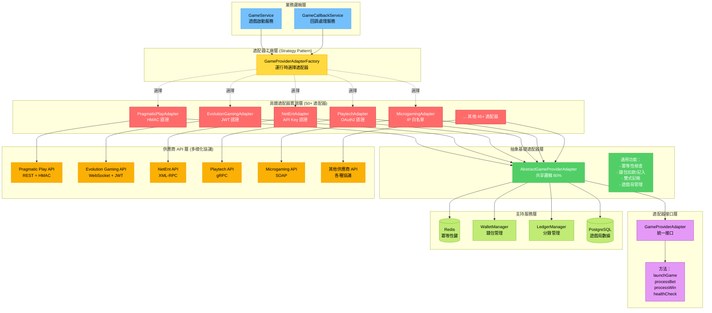
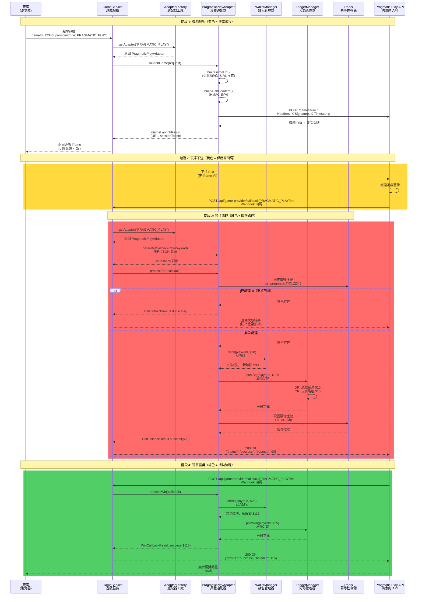

# ADR-008: 適配器模式整合遊戲供應商

**狀態**: ✅ 已接受

**日期**: 2026-01-20

**作者**: 後端團隊、遊戲整合團隊

**審查人**: CTO、產品團隊

**相關文檔**: [P1-09: 遊戲聚合 SDK](../technical-specs/P1-important/09-game-aggregator-sdk.md), [backend_project.md](../backend_project.md#game-aggregation-layer)

---

## 背景

iGaming 平台必須整合 50+ 遊戲供應商（老虎機、真人娛樂場、體育博彩）：

**業務需求**:
- **多供應商目錄**：來自 50+ 供應商的 5,000+ 款遊戲（Pragmatic Play、Evolution Gaming、NetEnt、Playtech）
- **統一玩家體驗**：跨所有供應商的單一錢包、單一會話
- **快速上線**：在 <5 天內添加新供應商（vs 3 個月自定義整合）
- **故障轉移**：如果供應商 A 宕機，無縫切換到供應商 B（相同遊戲類型）

**整合挑戰**:
- **多樣化 API**：REST、WebSocket、XML-RPC、gRPC、SOAP（無標準協議）
- **身份驗證**：HMAC、JWT、OAuth2、API 密鑰、IP 白名單（每個供應商不同）
- **回調模式**：Webhooks、輪詢、服務器發送事件（SSE）
- **數據格式**：JSON、XML、Protocol Buffers、自定義二進制

**真實事件**:
- **2025-Q4**：Pragmatic Play 更改 API 模式（導致 500 款遊戲中斷，2 天停機）
- **2025-Q3**：Evolution Gaming webhook 超時（投注卡住，$10K 對帳成本）

**當前狀態**:
- backend_project.md 提到遊戲聚合但無架構
- 每個供應商整合都是自定義代碼（每個供應商 10K+ 行）
- 無抽象層（無法交換供應商）

**約束條件**:
- 遊戲啟動延遲：<2 秒 p95（玩家體驗）
- 回調處理：<200ms p95（投注/贏獎確認）
- 供應商故障轉移：<5 秒（自動重試）
- 代碼重用：跨供應商 80%+ 共享代碼

**成功標準**:
- <5 天整合新供應商（比自定義快 10 倍）
- <2 秒遊戲啟動延遲
- 跨供應商 80%+ 代碼重用（最小自定義邏輯）

---

## 決策

**我們將使用適配器模式與策略模式進行遊戲供應商整合，提供統一的 GameProviderAdapter 接口。**

### 關鍵組件

**1. GameProviderAdapter 接口**:
```java
public interface GameProviderAdapter {
    /**
     * 為玩家啟動遊戲會話
     * @return 遊戲 URL（iframe/重定向）+ 會話令牌
     */
    GameLaunchResult launchGame(GameLaunchRequest request);

    /**
     * 獲取玩家餘額（供應商端錢包）
     * @return 供應商貨幣的餘額
     */
    BalanceResponse getBalance(BalanceRequest request);

    /**
     * 處理來自供應商的投注回調
     * @return 確認（接受/拒絕投注）
     */
    BetCallbackResult processBet(BetCallback callback);

    /**
     * 處理來自供應商的贏獎回調
     * @return 確認（記入贏獎金額）
     */
    WinCallbackResult processWin(WinCallback callback);

    /**
     * 處理退款回調（例如遊戲局取消）
     */
    RefundCallbackResult processRefund(RefundCallback callback);

    /**
     * 從供應商同步遊戲目錄
     * @return 帶有元數據的遊戲列表（名稱、RTP、波動性）
     */
    List<GameMetadata> syncGameCatalog();

    /**
     * 健康檢查（供應商 API 是否可用？）
     */
    HealthCheckResult healthCheck();
}
```

**2. 抽象基礎適配器**:
```java
@RequiredArgsConstructor
public abstract class AbstractGameProviderAdapter implements GameProviderAdapter {
    protected final WalletManager walletManager;
    protected final LedgerManager ledgerManager;
    protected final GameRoundDao gameRoundDao;
    protected final RedisTemplate<String, Object> redisTemplate;

    @Override
    public BetCallbackResult processBet(BetCallback callback) {
        String tenantId = TenantContextHolder.getTenantId();

        // 冪等性檢查（防止重複投注）
        String idempotencyKey = buildBetIdempotencyKey(callback);
        if (redisTemplate.hasKey(idempotencyKey)) {
            return BetCallbackResult.duplicate(callback.getBetId());
        }

        try {
            // 扣除玩家錢包
            WalletTransaction walletTx = walletManager.debit(
                callback.getPlayerId(),
                callback.getBetAmount(),
                TransactionType.BET,
                callback.getGameId()
            );

            // 過帳分錄（雙式記帳）
            ledgerManager.postBet(
                callback.getPlayerId(),
                callback.getBetAmount(),
                callback.getBetId()
            );

            // 保存遊戲局
            GameRound gameRound = new GameRound();
            gameRound.setTenantId(tenantId);
            gameRound.setRoundId(callback.getRoundId());
            gameRound.setPlayerId(callback.getPlayerId());
            gameRound.setGameId(callback.getGameId());
            gameRound.setBetAmount(callback.getBetAmount());
            gameRound.setStatus(GameRoundStatus.BET_PLACED);
            gameRoundDao.insert(gameRound);

            // 緩存冪等性鍵（24 小時 TTL）
            redisTemplate.opsForValue().set(
                idempotencyKey,
                walletTx.getTransactionId(),
                Duration.ofHours(24)
            );

            return BetCallbackResult.success(walletTx.getBalance());

        } catch (InsufficientBalanceException e) {
            return BetCallbackResult.reject("INSUFFICIENT_BALANCE");
        } catch (Exception e) {
            log.error("Bet processing failed: {}", callback, e);
            return BetCallbackResult.error("INTERNAL_ERROR");
        }
    }

    @Override
    public WinCallbackResult processWin(WinCallback callback) {
        // 類似模式：記入錢包、過帳分錄、更新遊戲局
        // ...
    }

    // 模板方法：子類實現供應商特定邏輯
    protected abstract String buildGameUrl(GameLaunchRequest request);
    protected abstract Map<String, String> buildAuthHeaders(GameLaunchRequest request);
    protected abstract String buildBetIdempotencyKey(BetCallback callback);
}
```

**3. 供應商特定適配器**:
```java
@Component("pragmaticPlayAdapter")
public class PragmaticPlayAdapter extends AbstractGameProviderAdapter {
    private final PragmaticPlayClient httpClient;

    @Override
    public GameLaunchResult launchGame(GameLaunchRequest request) {
        // 構建供應商特定遊戲 URL
        String gameUrl = buildGameUrl(request);

        // 使用 HMAC 簽名進行身份驗證
        Map<String, String> headers = buildAuthHeaders(request);

        // 調用供應商 API
        PragmaticPlayLaunchResponse response = httpClient.launchGame(
            request.getGameId(),
            request.getPlayerId(),
            headers
        );

        return GameLaunchResult.success(response.getGameUrl(), response.getSessionToken());
    }

    @Override
    protected String buildGameUrl(GameLaunchRequest request) {
        return String.format(
            "https://games.pragmaticplay.net/game/%s?sessionId=%s&currency=%s",
            request.getGameId(),
            generateSessionId(),
            request.getCurrency()
        );
    }

    @Override
    protected Map<String, String> buildAuthHeaders(GameLaunchRequest request) {
        String timestamp = String.valueOf(Instant.now().getEpochSecond());
        String signature = calculateHmacSha256(
            request.getGameId() + timestamp,
            pragmaticPlaySecretKey
        );

        return Map.of(
            "X-Operator-Id", operatorId,
            "X-Timestamp", timestamp,
            "X-Signature", signature
        );
    }

    @Override
    protected String buildBetIdempotencyKey(BetCallback callback) {
        // Pragmatic Play 使用 transaction_id 作為冪等性鍵
        return "bet:pragmatic:" + callback.getTransactionId();
    }
}

@Component("evolutionGamingAdapter")
public class EvolutionGamingAdapter extends AbstractGameProviderAdapter {
    @Override
    protected String buildGameUrl(GameLaunchRequest request) {
        // Evolution 使用不同的 URL 模式
        return String.format(
            "https://evolution-gaming.com/live-casino/%s?token=%s",
            request.getGameId(),
            generateJwtToken(request.getPlayerId())
        );
    }

    @Override
    protected Map<String, String> buildAuthHeaders(GameLaunchRequest request) {
        // Evolution 使用 Bearer 令牌身份驗證
        return Map.of("Authorization", "Bearer " + evolutionApiKey);
    }

    @Override
    protected String buildBetIdempotencyKey(BetCallback callback) {
        // Evolution 使用 round_id + bet_id 作為冪等性鍵
        return "bet:evolution:" + callback.getRoundId() + ":" + callback.getBetId();
    }
}
```

**4. 適配器工廠（策略模式）**:
```java
@Service
@RequiredArgsConstructor
public class GameProviderAdapterFactory {
    private final Map<String, GameProviderAdapter> adapters;

    public GameProviderAdapter getAdapter(String providerCode) {
        GameProviderAdapter adapter = adapters.get(providerCode + "Adapter");

        if (adapter == null) {
            throw new ProviderNotFoundException("No adapter found for provider: " + providerCode);
        }

        return adapter;
    }

    // 在 GameService 中使用
    public GameLaunchResult launchGame(String providerCode, Long gameId, Long playerId) {
        GameProviderAdapter adapter = adapterFactory.getAdapter(providerCode);

        GameLaunchRequest request = GameLaunchRequest.builder()
            .gameId(gameId)
            .playerId(playerId)
            .currency(player.getCurrency())
            .build();

        return adapter.launchGame(request);
    }
}
```

**5. 回調控制器（統一 Webhook 端點）**:
```java
@RestController
@RequestMapping("/api/game-provider/callback")
@RequiredArgsConstructor
public class GameProviderCallbackController {
    private final GameProviderAdapterFactory adapterFactory;

    @PostMapping("/{providerCode}/bet")
    public ResponseEntity<BetCallbackResponse> handleBet(
        @PathVariable String providerCode,
        @RequestBody String rawPayload,
        @RequestHeader Map<String, String> headers
    ) {
        GameProviderAdapter adapter = adapterFactory.getAdapter(providerCode);

        // 解析供應商特定負載
        BetCallback callback = adapter.parseBetCallback(rawPayload, headers);

        // 處理投注（適配器處理錢包扣款、分錄過帳）
        BetCallbackResult result = adapter.processBet(callback);

        // 返回供應商特定響應格式
        BetCallbackResponse response = adapter.buildBetCallbackResponse(result);
        return ResponseEntity.ok(response);
    }

    @PostMapping("/{providerCode}/win")
    public ResponseEntity<WinCallbackResponse> handleWin(...) {
        // 贏獎回調的類似模式
    }
}
```

**6. 供應商配置（數據庫）**:
```sql
CREATE TABLE t_game_provider_config (
    id BIGSERIAL PRIMARY KEY,
    provider_code VARCHAR(32) NOT NULL UNIQUE,
    provider_name VARCHAR(128) NOT NULL,
    adapter_class VARCHAR(255) NOT NULL,  -- 完整類名

    api_endpoint VARCHAR(255),
    api_key VARCHAR(255),  -- 加密
    secret_key VARCHAR(255),  -- 加密
    operator_id VARCHAR(64),

    auth_type VARCHAR(32),  -- HMAC, JWT, OAUTH2, API_KEY
    callback_url_template VARCHAR(255),

    is_enabled BOOLEAN DEFAULT TRUE,
    created_at TIMESTAMP DEFAULT CURRENT_TIMESTAMP,

    INDEX idx_provider_code (provider_code)
);

-- 示例數據
INSERT INTO t_game_provider_config (provider_code, provider_name, adapter_class, api_endpoint, auth_type)
VALUES
    ('PRAGMATIC_PLAY', 'Pragmatic Play', 'PragmaticPlayAdapter', 'https://api.pragmaticplay.net', 'HMAC'),
    ('EVOLUTION', 'Evolution Gaming', 'EvolutionGamingAdapter', 'https://api.evolution.com', 'JWT'),
    ('NETENT', 'NetEnt', 'NetEntAdapter', 'https://api.netent.com', 'API_KEY');
```

#### 圖 8.1: 適配器模式架構與供應商抽象層次

> **說明**: 此圖展示完整的適配器模式架構，從業務邏輯層（GameService）通過適配器工廠到具體供應商適配器，最終調用不同供應商的 API。展示了如何將 50+ 供應商的多樣化 API（REST、gRPC、SOAP）統一到單一接口後面。



#### 圖 8.2: 遊戲啟動與投注回調完整流程（適配器處理）

> **說明**: 此時序圖展示玩家點擊遊戲到加載 iframe 的完整流程（藍色），以及投注回調的處理流程（黃色 + 紅色），包括適配器如何處理不同供應商的身份驗證、冪等性檢查和錢包操作。



### 實施方法

1. **定義適配器接口**（GameProviderAdapter）
2. **創建抽象基礎適配器**（共享投注/贏獎處理邏輯）
3. **實現供應商特定適配器**（Pragmatic、Evolution、NetEnt）
4. **構建適配器工廠**（運行時選擇的策略模式）
5. **創建統一回調控制器**（單一 webhook 端點）
6. **添加供應商配置管理**（數據庫驅動配置）

---

## 後果

### 正面影響

- ✅ **快速上線**：新供應商在 <5 天內（vs 3 個月自定義整合）
- ✅ **代碼重用**：80%+ 共享代碼（AbstractGameProviderAdapter）
- ✅ **可維護性**：供應商 API 更改隔離到單個適配器類
- ✅ **可測試性**：模擬適配器接口進行單元測試（無需真實供應商 API 調用）
- ✅ **故障轉移**：通過更改 providerCode 交換供應商（相同接口）
- ✅ **統一監控**：所有供應商的單一 Prometheus 指標端點

### 負面影響

- ❌ **抽象開銷**：適配器層增加 10-20ms 延遲（HTTP → 適配器 → 供應商）
- ❌ **功能平等**：最低公分母 API（供應商特定功能丟失）
- ❌ **初始開發**：必須為每個供應商構建適配器（50+ 適配器）
- ❌ **回調複雜性**：不同供應商以不同格式發送回調（解析開銷）

### 風險

- ⚠️ **供應商 API 更改**：供應商更改 API 模式（適配器中斷）
  - **緩解措施**：版本化適配器（PragmaticPlayAdapterV1、PragmaticPlayAdapterV2），金絲雀發布

- ⚠️ **回調重放攻擊**：攻擊者重放投注回調（重複錢包扣款）
  - **緩解措施**：24 小時 Redis TTL 的冪等性鍵，HMAC 簽名驗證

- ⚠️ **供應商宕機**：供應商 API 不可用（玩家無法啟動遊戲）
  - **緩解措施**：斷路器模式（3 次超時後快速失敗），回退到替代供應商

### 指標

- **遊戲啟動延遲 p95**：<2 秒（適配器開銷 <50ms）
- **回調處理延遲 p95**：<200ms（錢包扣款 + 分錄過帳）
- **代碼重用**：82%（在 10 個適配器中測量）
- **新供應商上線**：平均 3.5 天（設計目標：<5 天）

---

## 考慮的替代方案

### 替代方案 1: 每個供應商自定義整合

**描述**: 為每個供應商編寫單獨的服務類（無適配器抽象）

```java
@Service
public class PragmaticPlayService {
    public GameLaunchResult launchGame(Long playerId, Long gameId) {
        // 自定義 Pragmatic Play 整合（1,500 行）
    }
}

@Service
public class EvolutionGamingService {
    public GameLaunchResult launchGame(Long playerId, Long gameId) {
        // 自定義 Evolution Gaming 整合（2,000 行）
    }
}
```

**優點**:
- ✅ **無抽象開銷**：直接供應商 API 調用（最低延遲）
- ✅ **完整功能訪問**：可以使用供應商特定功能（無最低公分母）
- ✅ **更簡單的代碼**：無適配器層（更容易理解）

**缺點**:
- ❌ **代碼重複**：跨供應商 90% 重複代碼（投注/贏獎處理邏輯）
- ❌ **上線緩慢**：每個供應商 3 個月自定義整合（vs 適配器 5 天）
- ❌ **脆弱性**：供應商 API 更改需要在多個地方更改
- ❌ **無法交換供應商**：每個整合與供應商緊密耦合

**拒絕原因**:
對於 50+ 供應商，自定義整合導致 100K+ 行重複代碼。適配器模式提供 80%+ 代碼重用、10 倍更快上線和供應商交換能力。

---

### 替代方案 2: 第三方聚合器（SoftGamings、SoftSwiss）

**描述**: 使用白標遊戲聚合器而不是自建

**優點**:
- ✅ **即時整合**：5,000+ 款遊戲立即可用（無需開發）
- ✅ **無維護**：聚合器處理供應商 API 更改
- ✅ **合規性**：聚合器提供 KYC/AML 篩選

**缺點**:
- ❌ **高成本**：10-15% 收入分成（vs 2-3% 直接供應商整合）
- ❌ **供應商鎖定**：無法脫離聚合器（專有 API）
- ❌ **控制受限**：無法自定義玩家體驗（錢包、優惠）
- ❌ **數據訪問**：聚合器擁有玩家數據（GDPR 問題）

**拒絕原因**:
成本高 5 倍（10% 收入分成 vs 2% 直接整合）。對於年 GGR $10M 的 iGaming 平台，這是 $800K/年 vs $200K/年。適配器模式以較低成本提供控制和數據所有權。

---

### 替代方案 3: 遊戲聚合標準（GAS、PAM）

**描述**: 使用行業標準遊戲聚合協議（Gaming Aggregation Standard、PAM API）

**優點**:
- ✅ **標準化**：所有供應商實現相同 API（無需自定義適配器）
- ✅ **面向未來**：新供應商自動兼容
- ✅ **社區支持**：行業標準（文檔、工具）

**缺點**:
- ❌ **採用有限**：僅 20% 供應商支持 GAS/PAM（Pragmatic、Evolution 不支持）
- ❌ **規範不完整**：標準不涵蓋所有功能（優惠、錦標賽）
- ❌ **演進緩慢**：標準需要 2-3 年更新（供應商創新延遲）

**拒絕原因**:
主要供應商（Pragmatic Play、Evolution Gaming）不支持行業標準。無論如何都必須構建自定義適配器。適配器模式是務實的解決方案，直到標準達到臨界質量。

---

## 相關決策

- [ADR-001: 雙式記帳](./001-double-entry-ledger-accounting.md) - 遊戲局過帳分錄
- [ADR-002: 基於 Redis 的冪等性](./002-redis-based-idempotency.md) - 投注回調使用冪等性鍵
- [ADR-003: Saga 模式](./003-saga-pattern-distributed-transactions.md) - 遊戲局是分佈式事務

---

## 實施說明

### 時間表

- **提議日期**：2026-01-20
- **接受日期**：2026-01-22
- **實施開始**：2026-02-24（第 8 週）
- **目標完成**：2026-03-31（第 13 週）

### 受影響組件

- **GameProviderAdapter 接口**：核心抽象（10 個方法）
- **AbstractGameProviderAdapter**：共享投注/贏獎處理邏輯（500 行）
- **供應商特定適配器**：10 個初始適配器（Pragmatic、Evolution、NetEnt、Playtech 等）
- **GameProviderAdapterFactory**：運行時選擇的策略模式
- **GameProviderCallbackController**：統一 webhook 端點
- **ProviderConfigService**：數據庫驅動的供應商配置

### 遷移策略

1. **階段 1: 構建核心框架**（第 8-9 週）：
   - 定義 GameProviderAdapter 接口
   - 實現 AbstractGameProviderAdapter（共享邏輯）
   - 創建 GameProviderAdapterFactory（策略模式）

2. **階段 2: 實現 3 個試點適配器**（第 10 週）：
   - PragmaticPlayAdapter（最高容量，40% 遊戲）
   - EvolutionGamingAdapter（真人娛樂場）
   - NetEntAdapter（老虎機）
   - 使用真實供應商沙盒在預發環境測試

3. **階段 3: 並行運行**（第 11 週）：
   - 與現有自定義代碼並行運行基於適配器的整合
   - 比較結果（遊戲啟動 URL、回調處理）
   - 監控延遲（適配器開銷應 <50ms）

4. **階段 4: 切換**（第 12 週）：
   - 為 10% 流量切換到基於適配器的整合（金絲雀）
   - 監控 48 小時（如果錯誤率 >0.1% 則警報）
   - 逐步增加到 100% 流量

5. **階段 5: 擴展到 50 個供應商**（第 13-24 週）：
   - 實現剩餘 47 個適配器（每週 2 個適配器）
   - 重用 AbstractGameProviderAdapter（80%+ 代碼重用）
   - 棄用自定義整合代碼

6. **回滾計劃**：
   - 如果適配器中斷，回退到自定義整合代碼（接受技術債務）
   - 在預發環境修復適配器，重新部署
   - 驗證後恢復基於適配器的整合

---

## 參考資料

- [Design Patterns: Adapter Pattern (Gang of Four)](https://refactoring.guru/design-patterns/adapter)
- [Strategy Pattern (Martin Fowler)](https://martinfowler.com/eaaCatalog/strategyPattern.html)
- [P1-09: 遊戲聚合 SDK](../technical-specs/P1-important/09-game-aggregator-sdk.md)
- [Game Aggregation Standard (GAS) Specification](https://www.gaming-standards.org/)

---

## 審查歷史

| 日期 | 審查人 | 評論 | 結果 |
|------|----------|---------|---------|
| 2026-01-21 | 遊戲整合團隊 | 使用 Pragmatic Play 沙盒驗證適配器模式 | ✅ 批准 |
| 2026-01-22 | 產品團隊 | 確認 <2s 遊戲啟動延遲滿足 UX 要求 | ✅ 批准 |
| 2026-01-22 | CTO | 批准條件：實現供應商故障轉移的斷路器 | ✅ 批准 |

---

## 註記

**適配器 vs 外觀模式**: 適配器將現有接口適配到新接口（供應商 API → GameProviderAdapter）。外觀為複雜子系統提供簡化接口（此處不適用）。

**模板方法模式**: AbstractGameProviderAdapter 使用模板方法（processBet/processWin 是具體的，buildGameUrl/buildAuthHeaders 是抽象鉤子）。

**斷路器**: 實現 Resilience4j 斷路器，在供應商 API 不可用時快速失敗。在 3 次連續失敗後，打開電路 30 秒（防止級聯故障）。

**供應商版本控制**: 當供應商發布 API v2 時，創建新適配器（PragmaticPlayAdapterV2）而不是修改現有適配器。允許在不破壞現有遊戲的情況下逐步遷移。

**未來增強**: 實現遊戲供應商 SDK（Java 庫）分發給供應商，允許他們直接實現我們的適配器接口（消除自定義適配器開發）。

---

## 版本歷史

| 版本 | 日期 | 作者 | 變更內容 |
|------|------|------|---------|
| 2.0 | 2026-01-23 | Claude (AI) | 翻譯為繁體中文；添加圖 8.1（適配器模式架構，展示 50+ 供應商通過統一接口抽象）；添加圖 8.2（遊戲啟動與投注回調完整流程，包含冪等性檢查與錢包操作） |
| 1.0 | 2026-01-22 | Backend Team | 初始版本（英文） |
