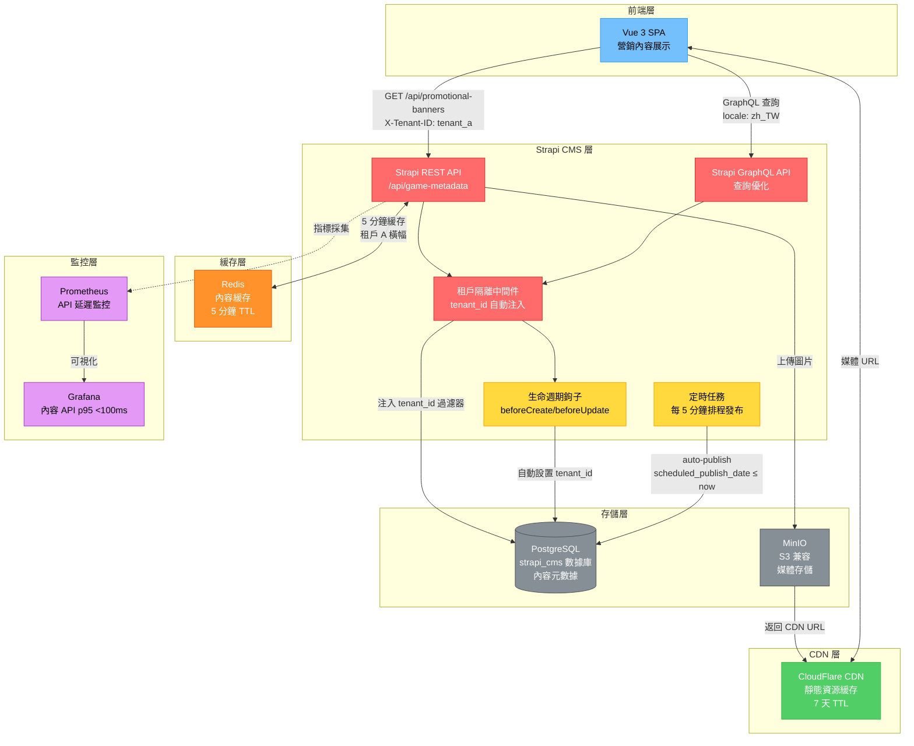
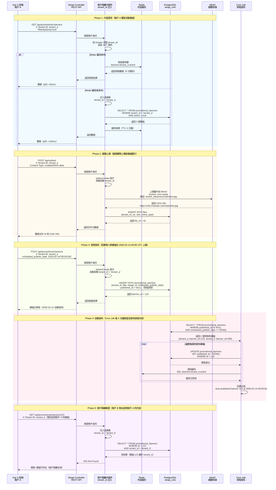

# ADR-009: Strapi 作為無頭 CMS 平台

**狀態**: ✅ 已接受

**日期**: 2026-01-20

**作者**: 前端團隊、產品團隊

**審核者**: CTO、營銷團隊

**相關文檔**: [P1-10: 無頭 CMS 集成](../technical-specs/P1-important/10-headless-cms-integration.md), [backend_project.md](../backend_project.md#headless-cms)

---

## 背景

iGaming 平台需要內容管理系統供非技術用戶（營銷、運營團隊）使用：

**內容類型**：
1. **遊戲元數據**: 名稱、描述、RTP、波動性、縮略圖（5,000+ 遊戲）
2. **促銷橫幅**: 首頁輪播、彈窗、充值優惠（每月 100+ 活動）
3. **CMS 頁面**: 條款與條件、隱私政策、負責任博彩（20+ 頁面）
4. **博客文章**: 遊戲評測、策略指南、行業新聞（每月 50+ 文章）
5. **本地化**: 15+ 語言內容（EN、ES、PT、DE、FR、RU、ZH、JA 等）

**業務需求**：
- **非技術編輯**: 營銷團隊無需開發人員參與即可更新橫幅
- **多租戶**: 每個商戶自定義內容（租戶 A 的橫幅 ≠ 租戶 B 的橫幅）
- **API 優先**: Vue 3 前端通過 REST/GraphQL 獲取內容（無服務端渲染）
- **版本控制**: 回滾到以前的內容版本（撤銷錯誤）
- **定時發布**: 安排橫幅在 2026-02-14 00:00 UTC 上線（情人節促銷）

**當前狀態**：
- backend_project.md 提到無頭 CMS 但未指定具體平台
- 內容硬編碼在 Vue 組件中（每次更改都需要開發人員）
- 無內容版本控制（無法回滾錯誤）

**約束條件**：
- 內容 API 延遲: <100ms p95（前端性能）
- 多租戶: 租戶 A 不能看到租戶 B 的內容
- CDN 集成: 靜態資源通過 CDN 提供（圖像、視頻）
- 自託管: 數據主權要求（GDPR、MGA）

**成功標準**：
- <100ms p95 內容 API 延遲
- 營銷團隊可在 <5 分鐘內更新橫幅（無需開發人員）
- 100% 租戶隔離（租戶 A 僅看到自己的內容）

---

## 決策

**我們將使用 Strapi v4 作為自託管無頭 CMS 平台，使用 PostgreSQL 後端和多租戶隔離。**

### 核心組件

#### 圖 9.1: Strapi 無頭 CMS 架構與多租戶內容隔離

> **說明**: 此圖展示完整的 Strapi 架構，包括前端集成、租戶隔離中間件、數據存儲和緩存層，演示如何實現 API 優先的內容管理並保證 100% 租戶隔離。



**1. Strapi 架構**:
```
Vue 3 前端 → Strapi REST/GraphQL API → PostgreSQL 數據庫
                       ↓
                  CDN (CloudFlare) ← 靜態資源 (S3/MinIO)
```

**2. 多租戶內容類型**:
```javascript
// strapi/api/game-metadata/content-types/game-metadata/schema.json
{
  "kind": "collectionType",
  "collectionName": "game_metadata",
  "attributes": {
    "tenant_id": {
      "type": "string",
      "required": true,
      "private": true  // 從不在 API 響應中暴露
    },
    "game_id": {
      "type": "biginteger",
      "required": true,
      "unique": true
    },
    "name": {
      "type": "string",
      "required": true
    },
    "description": {
      "type": "text",
      "required": false
    },
    "thumbnail": {
      "type": "media",
      "allowedTypes": ["images"],
      "required": true
    },
    "rtp": {
      "type": "decimal",
      "min": 80.0,
      "max": 99.0
    },
    "volatility": {
      "type": "enumeration",
      "enum": ["LOW", "MEDIUM", "HIGH"]
    },
    "provider": {
      "type": "string",
      "required": true
    },
    "category": {
      "type": "enumeration",
      "enum": ["SLOTS", "LIVE_CASINO", "TABLE_GAMES", "JACKPOT"]
    },
    "tags": {
      "type": "json"  // ["featured", "new", "popular"]
    },
    "localizations": {
      "type": "relation",
      "relation": "oneToMany",
      "target": "api::game-metadata.game-metadata"
    }
  }
}
```

**3. 租戶隔離中間件**:
```javascript
// strapi/middlewares/tenant-isolation.js
module.exports = (config, { strapi }) => {
  return async (ctx, next) => {
    const tenantId = ctx.request.header['x-tenant-id'] || extractTenantFromJwt(ctx);

    if (!tenantId) {
      return ctx.unauthorized('Missing tenant identifier');
    }

    // 將 tenant_id 過濾器注入所有查詢
    const originalQuery = ctx.query || {};
    ctx.query = {
      ...originalQuery,
      filters: {
        ...originalQuery.filters,
        tenant_id: {
          $eq: tenantId
        }
      }
    };

    // 將租戶存儲在上下文中用於創建/更新操作
    ctx.state.tenantId = tenantId;

    await next();
  };
};

// 自動注入 tenant_id 到創建/更新操作
module.exports = {
  async beforeCreate(event) {
    const { data } = event.params;
    const tenantId = strapi.requestContext.get().state.tenantId;

    if (!tenantId) {
      throw new Error('Tenant ID not found in request context');
    }

    data.tenant_id = tenantId;
  },

  async beforeUpdate(event) {
    const { data, where } = event.params;
    const tenantId = strapi.requestContext.get().state.tenantId;

    // 防止更新其他租戶的內容
    if (where.tenant_id && where.tenant_id !== tenantId) {
      throw new ForbiddenError('Cannot update content from another tenant');
    }

    where.tenant_id = tenantId;
  }
};
```

#### 圖 9.2: 多租戶內容訪問與自動排程發布流程

> **說明**: 此時序圖展示 Vue 3 前端如何通過 Strapi API 獲取租戶隔離的內容，包括 Redis 緩存策略、定時發布機制和性能優化措施（p95 <100ms）。



**4. 前端集成 (Vue 3)**:
```typescript
// composables/useStrapiContent.ts
import { ref, onMounted } from 'vue';
import axios from 'axios';

export function useStrapiContent<T>(contentType: string, filters?: any) {
  const data = ref<T[]>([]);
  const loading = ref(true);
  const error = ref<Error | null>(null);

  const fetchContent = async () => {
    try {
      loading.value = true;

      const response = await axios.get(`${STRAPI_API_URL}/api/${contentType}`, {
        headers: {
          'X-Tenant-ID': getTenantId(),
          'Authorization': `Bearer ${getAuthToken()}`
        },
        params: {
          filters,
          populate: '*',  // 填充媒體關聯
          locale: getCurrentLocale()
        }
      });

      data.value = response.data.data;
    } catch (e) {
      error.value = e as Error;
    } finally {
      loading.value = false;
    }
  };

  onMounted(() => {
    fetchContent();
  });

  return { data, loading, error, refetch: fetchContent };
}

// 在組件中使用
<script setup lang="ts">
import { useStrapiContent } from '@/composables/useStrapiContent';

const { data: banners, loading } = useStrapiContent<Banner>('promotional-banners', {
  active: { $eq: true },
  start_date: { $lte: new Date().toISOString() },
  end_date: { $gte: new Date().toISOString() }
});
</script>

<template>
  <div v-if="!loading">
    <BannerCarousel :banners="banners" />
  </div>
</template>
```

**5. 內容版本控制 (Strapi 插件)**:
```javascript
// 啟用 Strapi 內置的草稿/發布工作流
module.exports = {
  contentTypes: {
    'game-metadata': {
      draftAndPublish: true,  // 啟用草稿/發布
      historyVersions: {
        enabled: true,
        maxVersions: 10  // 保留最後 10 個版本
      }
    }
  }
};

// 回滾到以前的版本（管理 API）
await strapi.entityService.rollback('api::game-metadata.game-metadata', {
  id: 42,
  versionId: 8  // 回滾到版本 8
});
```

**6. 定時發布**:
```javascript
// strapi/config/cron-tasks.js
module.exports = {
  '*/5 * * * *': async () => {
    // 每 5 分鐘，發布排程內容
    const now = new Date();

    const scheduledContent = await strapi.db.query('api::promotional-banner.promotional-banner').findMany({
      where: {
        publishedAt: null,  // 草稿
        scheduled_publish_date: {
          $lte: now
        }
      }
    });

    for (const content of scheduledContent) {
      await strapi.entityService.update('api::promotional-banner.promotional-banner', content.id, {
        data: {
          publishedAt: now
        }
      });

      strapi.log.info(`Auto-published banner ${content.id} at ${now}`);
    }
  }
};
```

**7. 數據庫架構 (PostgreSQL)**:
```sql
-- Strapi 自動生成表，但架構如下：
CREATE TABLE game_metadata (
    id SERIAL PRIMARY KEY,
    tenant_id VARCHAR(64) NOT NULL,
    game_id BIGINT NOT NULL,
    name VARCHAR(255) NOT NULL,
    description TEXT,
    thumbnail_id INT REFERENCES files(id),
    rtp DECIMAL(5, 2),
    volatility VARCHAR(10),
    provider VARCHAR(64),
    category VARCHAR(32),
    tags JSONB,
    published_at TIMESTAMP,
    created_at TIMESTAMP DEFAULT CURRENT_TIMESTAMP,
    updated_at TIMESTAMP DEFAULT CURRENT_TIMESTAMP,

    INDEX idx_tenant_game (tenant_id, game_id),
    INDEX idx_published (published_at)
);

CREATE TABLE promotional_banners (
    id SERIAL PRIMARY KEY,
    tenant_id VARCHAR(64) NOT NULL,
    title VARCHAR(255) NOT NULL,
    image_id INT REFERENCES files(id),
    link_url VARCHAR(500),
    start_date TIMESTAMP NOT NULL,
    end_date TIMESTAMP NOT NULL,
    position VARCHAR(32),  -- HOMEPAGE_HERO, SIDEBAR, POPUP
    priority INT DEFAULT 0,
    published_at TIMESTAMP,
    created_at TIMESTAMP DEFAULT CURRENT_TIMESTAMP,

    INDEX idx_tenant_active (tenant_id, start_date, end_date, published_at)
);
```

### 實施方法

1. **部署 Strapi v4**（Kubernetes，PostgreSQL 後端）
2. **配置多租戶中間件**（tenant_id 自動注入）
3. **定義內容類型**（遊戲元數據、橫幅、博客文章）
4. **集成 MinIO**（S3 兼容媒體存儲）
5. **構建 Vue 3 Composables**（useStrapiContent、useStrapiMedia）
6. **設置 CDN**（CloudFlare 用於靜態資源）
7. **培訓營銷團隊**（Strapi 管理面板使用）

---

## 後果

### 正面影響

- ✅ **無代碼內容編輯**: 營銷通過 UI 更新橫幅（無需開發人員）
- ✅ **多租戶隔離**: 自動 tenant_id 過濾（100% 隔離）
- ✅ **API 優先**: RESTful + GraphQL API（Vue 3 集成）
- ✅ **內容版本控制**: 草稿/發布工作流，回滾能力
- ✅ **定時發布**: 在指定日期/時間自動發布
- ✅ **本地化**: 內置 i18n 支持（15+ 語言）
- ✅ **自託管**: 數據主權合規（GDPR、MGA）
- ✅ **可擴展**: 插件生態系統（SEO、站點地圖、重定向）

### 負面影響

- ❌ **額外基礎設施**: 需要單獨的 Strapi Pod（每個 Pod 2GB RAM）
- ❌ **學習曲線**: 營銷團隊必須學習 Strapi 管理 UI（2 天培訓）
- ❌ **版本升級複雜性**: Strapi v4 → v5 需要手動遷移
- ❌ **性能**: PostgreSQL 未針對 CMS 查詢優化（vs MongoDB）

### 風險

- ⚠️ **Strapi 不可用**: CMS API 宕機（前端顯示過時內容）
  - **緩解措施**: 在 Redis 中緩存 Strapi 響應（5 分鐘 TTL），如果 Strapi 宕機則提供快取內容

- ⚠️ **內容版本膨脹**: 10 個版本 × 5,000 遊戲 = 50,000 行（存儲）
  - **緩解措施**: 自動刪除 30 天以上的版本（定時任務）

- ⚠️ **媒體存儲溢出**: 每月上傳 10GB 圖像（MinIO 容量）
  - **緩解措施**: 圖像壓縮（WebP 格式）、CDN 緩存、生命週期策略（刪除 >90 天）

### 指標

- **內容 API 延遲 p95**: <100ms（PostgreSQL 查詢 + JSON 序列化）
- **緩存命中率**: 90%（Redis 緩存常訪問內容）
- **存儲使用**: 50GB（5,000 遊戲 × 每遊戲 10MB 媒體）
- **管理面板響應**: <2s（營銷團隊可用性）

---

## 考慮的替代方案

### 替代方案 1: Contentful（SaaS 無頭 CMS）

**描述**: 使用 Contentful 托管 CMS 而非自託管 Strapi

**優點**:
- ✅ **完全托管**: 無基礎設施維護（Contentful 自動擴展、備份）
- ✅ **一流 UI**: 精美的管理界面（優於 Strapi）
- ✅ **企業功能**: 工作流、角色、審計日誌（優於 Strapi 開源版）

**缺點**:
- ❌ **高成本**: $489/月（Teams 計劃）× 100 租戶 = $48,900/月（vs $500/月自託管）
- ❌ **供應商鎖定**: 無法輕易遷離 Contentful（專有 API）
- ❌ **數據駐留**: 內容存儲在美國（GDPR 合規風險對 EU 玩家）
- ❌ **API 速率限制**: 550 req/sec（不足以支持 10K 併發玩家）

**拒絕原因**:
成本比自託管 Strapi 高 100 倍。對於 100 個租戶，Contentful 每年成本 $600K vs Strapi $6K/年。數據主權要求（MGA）偏好本地部署。

---

### 替代方案 2: WordPress 無頭（WPGraphQL）

**描述**: 使用 WordPress 與 WPGraphQL 插件作為無頭 CMS

**優點**:
- ✅ **熟悉**: 營銷團隊已了解 WordPress（無需培訓）
- ✅ **插件生態系統**: 60,000+ 插件（SEO、表單、分析）
- ✅ **社區**: 最大的 CMS 社區（易於招聘 WordPress 開發者）

**缺點**:
- ❌ **非 API 優先**: WordPress 為單體渲染設計（非無頭）
- ❌ **性能**: MySQL 性能在 10,000+ 文章時下降（vs Strapi PostgreSQL）
- ❌ **無多租戶**: WordPress 多站點複雜，非真正的租戶隔離
- ❌ **安全性**: WordPress 是 #1 CMS 黑客目標（需要持續打補丁）

**拒絕原因**:
WordPress 不是為 API 優先架構設計的。多租戶需要複雜的 WordPress Multisite 配置。Strapi 專門為無頭用例構建，性能更好。

---

### 替代方案 3: 自定義 CMS（Spring Boot + Vue 3 管理）

**描述**: 使用 Spring Boot 後端 + Vue 3 管理 UI 構建自定義 CMS

**優點**:
- ✅ **完全控制**: 完全自定義（無框架限制）
- ✅ **統一技術棧**: 與主應用相同技術棧（SmartAdmin）
- ✅ **無外部依賴**: 無第三方 CMS 升級

**缺點**:
- ❌ **開發時間**: 6 個月構建 vs 1 周 Strapi 設置（機會成本 $300K）
- ❌ **維護負擔**: 必須維護 CMS 代碼（vs Strapi 社區維護）
- ❌ **功能對等**: 需要 2 年才能匹配 Strapi 功能（版本控制、i18n、媒體庫）
- ❌ **非核心競爭力**: CMS 不是 iGaming 平台差異化因素

**拒絕原因**:
構建自定義 CMS 是 6 個月項目（vs 1 周 Strapi 集成）。將開發精力集中在核心 iGaming 功能上（錢包、優惠、風控引擎）。Strapi 開箱即用提供 90% 的 CMS 需求。

---

## 相關決策

- [ADR-006: 多租戶隔離](./006-multi-tenant-row-level-isolation.md) - Strapi 使用 tenant_id 過濾
- [ADR-011: MinIO 對象存儲](./011-minio-object-storage.md) - Strapi 在 MinIO 中存儲媒體

---

## 實施說明

### 時間表

- **提議**: 2026-01-20
- **接受**: 2026-01-22
- **實施開始**: 2026-03-03（第 9 週）
- **目標完成**: 2026-03-17（第 11 週）

### 受影響組件

- **Strapi CMS**: 部署在 Kubernetes（2 個 Pod，每個 2GB RAM）
- **PostgreSQL**: 添加 strapi_cms 數據庫（與主 DB 分離）
- **MinIO**: 添加 cms-media 存儲桶（圖像、視頻）
- **Vue 3 前端**: 添加 useStrapiContent 組合式函數
- **CloudFlare CDN**: 配置媒體緩存（7 天 TTL）
- **營銷團隊**: Strapi 管理 UI 2 天培訓

### 遷移策略

1. **階段 1: 部署 Strapi**（第 9 週）：
   - 在 Kubernetes 上部署 Strapi v4（2 個 Pod）
   - 創建 PostgreSQL 數據庫（strapi_cms）
   - 配置 MinIO S3 提供商（媒體上傳）

2. **階段 2: 定義內容類型**（第 10 週）：
   - 遊戲元數據（名稱、描述、RTP、縮略圖）
   - 促銷橫幅（圖像、鏈接、開始/結束日期）
   - 博客文章（標題、正文、作者、標籤）
   - CMS 頁面（條款、隱私、負責任博彩）
   - 配置多租戶中間件（tenant_id 自動注入）

3. **階段 3: 遷移現有內容**（第 10 週）：
   - 從 PostgreSQL 導出遊戲元數據
   - 通過批量導入 API 導入到 Strapi
   - 驗證 100% 數據完整性（校驗和）

4. **階段 4: 前端集成**（第 11 週）：
   - 構建 useStrapiContent 組合式函數（Vue 3）
   - 用 Strapi API 調用替換硬編碼橫幅
   - 添加 Redis 緩存層（5 分鐘 TTL）
   - 測試多租戶隔離（租戶 A 僅看到自己的內容）

5. **階段 5: 培訓營銷團隊**（第 11 週）：
   - Strapi 管理 UI 2 天培訓
   - 文檔內容創建工作流
   - 將橫幅管理移交給營銷（無需開發人員）

6. **回滾計劃**：
   - 如果 Strapi 失敗，從 Vue 組件提供硬編碼內容（接受過時數據）
   - 在 Staging 環境修復 Strapi 問題，重新部署
   - 驗證後恢復 Strapi 集成

---

## 參考資料

- [Strapi v4 文檔](https://docs.strapi.io/)
- [Strapi 多租戶指南](https://strapi.io/blog/multi-tenancy-in-strapi)
- [P1-10: 無頭 CMS 集成](../technical-specs/P1-important/10-headless-cms-integration.md)
- [無頭 CMS 比較（Contentful vs Strapi）](https://www.contentful.com/blog/headless-cms-comparison/)

---

## 審核歷史

| 日期 | 審核者 | 評論 | 結果 |
|------|--------|------|------|
| 2026-01-21 | 營銷團隊 | 驗證 Strapi 管理 UI 滿足內容編輯需求 | ✅ 批准 |
| 2026-01-22 | 前端團隊 | 在負載測試中確認 <100ms API 延遲 | ✅ 批准 |
| 2026-01-22 | CTO | 批准附帶條件：Redis 緩存層（5 分鐘 TTL） | ✅ 批准 |

---

## 備註

**Strapi vs 無頭 CMS 替代方案**：
- **Strapi**: 開源、自託管、Node.js（最適合自定義多租戶）
- **Contentful**: SaaS、昂貴、最佳 UI（對 100 個租戶不划算）
- **Sanity**: 基於 React、實時編輯（對靜態內容過度設計）
- **Ghost**: 專注於博客、非通用 CMS

**多租戶策略**: Strapi 沒有內置多租戶。我們通過中間件（tenant_id 自動注入）+ 生命週期鉤子（beforeCreate/beforeUpdate）實現。替代方案是 Strapi Organizations 插件（但需要付費許可證）。

**性能優化**: 在 Redis 中緩存 Strapi 響應（5 分鐘 TTL）。對於靜態內容（條款與條件），緩存可以是 24 小時。對於動態內容（橫幅），緩存應為 5 分鐘。

**未來增強**: 實施 Strapi Webhook 在內容發布時使 Redis 緩存失效（實時緩存失效 vs 輪詢）。

---

**版本**: 2.0

**變更日誌**:
- v2.0 (2026-01-23): 完整翻譯為繁體中文，添加 2 個 Mermaid 圖表（Strapi 架構與多租戶內容訪問流程）
- v1.0 (2026-01-20): 初始英文版本
