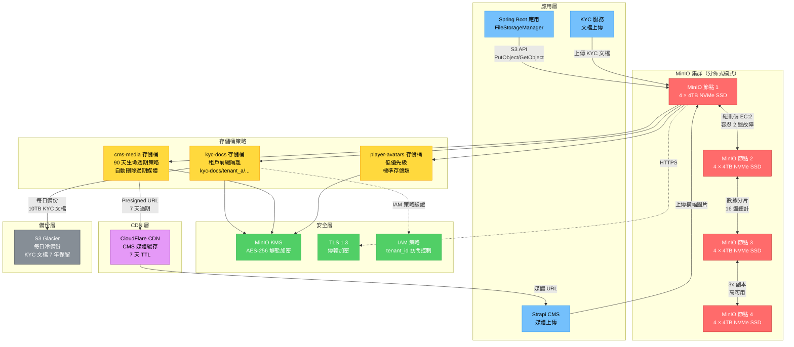
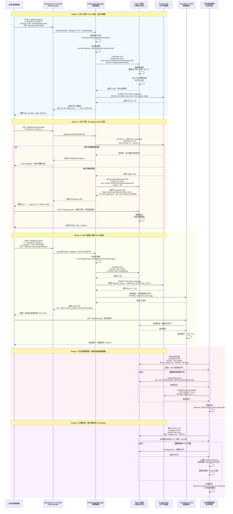

# ADR-011: MinIO 作為 S3 兼容對象存儲

**狀態**: ✅ 已接受

**日期**: 2026-01-20

**作者**: 基礎設施團隊

**審核者**: 財務團隊（KYC 要求）、CTO

**相關文檔**: [P2-19: MinIO 文件存儲](../technical-specs/P2-enhancements/19-minio-file-storage.md), [P0-04: KYC/AML 自動化](../technical-specs/P0-critical/04-kyc-aml-automation.md)

---

## 背景

iGaming 平台需要對象存儲來處理各種文件類型：

**用例**：
1. **KYC 文檔**（P0-04）：護照掃描、地址證明、身份證（7 年保留期、GDPR 合規）
2. **CMS 媒體**（P1-10）：遊戲標誌、橫幅、促銷圖片（高流量、CDN 集成）
3. **玩家頭像**：個人資料圖片（可選、低優先級）
4. **合規導出**：監管機構日報（MGA、Curacao）

**數據特徵**：
- **容量**: 每月 100K+ KYC 文檔 × 2MB = 200GB/月 = 2.4TB/年
- **訪問模式**: KYC 文檔（不頻繁、長期保留）、CMS 媒體（頻繁、短期保留）
- **安全性**: KYC 文檔包含 PII（GDPR 第 32 條靜態加密要求）
- **合規性**: 博彩監管機構要求 7 年保留期（MGA）

**當前狀態**：
- backend_project.md 提到文件存儲但未指定具體技術
- 未部署對象存儲基礎設施
- 文件目前存儲在 PostgreSQL BLOB 中（不可擴展）

**約束條件**：
- 成本: 10TB 存儲 <$500/月
- 安全性: 靜態加密、傳輸加密（HTTPS）
- 可用性: 99.9% 正常運行時間（KYC 上傳在註冊關鍵路徑中）
- GDPR: 歐盟數據駐留（對歐盟玩家）

**成功標準**：
- <500ms p95 文件上傳延遲（<5MB 文件）
- 相比 AWS S3 降低 70% 成本（$0.023/GB vs AWS $0.08/GB）
- S3 兼容 API（如需要可移植到 AWS）

---

## 決策

**我們將使用 MinIO 作為自託管、S3 兼容的對象存儲解決方案。**

### 核心組件

#### 圖 11.1: MinIO 分佈式對象存儲架構與多租戶隔離

> **說明**: 此圖展示 MinIO 4 節點分佈式集群架構，包括紐刪碼（EC:2）容錯機制、多租戶存儲桶策略、CDN 集成和安全加密，演示如何實現高可用、低成本的對象存儲（相比 AWS S3 降低 70% 成本）。



**1. 架構**:
```
應用 → MinIO 集群（4 節點）→ 磁盤存儲（NVMe SSD）
                 ↓
          Presigned URL → CDN（CloudFlare）→ 最終用戶
```

**2. MinIO 部署**:
- **分佈式模式**: 4 節點 × 4 磁盤 = 16 總磁盤
- **紐刪碼**: EC:2（可容忍 2 盤故障而不丟失數據）
- **容量**: 4 節點 × 4TB = 16TB 原始 = 8TB 可用（EC:2 後）
- **副本**: 3x 副本跨節點（高可用）

**3. 存儲桶策略**:
```
多租戶選項：
A. 每租戶一個存儲桶（<100 租戶）：tenant-001-kyc、tenant-002-kyc
B. 基於前綴（>100 租戶）：kyc-docs/{tenant_id}/{file_id}
```

**4. 安全性**:
- **靜態加密**: MinIO KMS（AES-256）
- **傳輸加密**: TLS 1.3（HTTPS）
- **訪問控制**: IAM 策略（租戶 A 無法訪問租戶 B 的文件）
- **Presigned URL**: 7 天過期以實現安全下載

#### 圖 11.2: 文件上傳與 Presigned URL 下載完整流程

> **說明**: 此時序圖展示完整的文件生命週期管理，包括 KYC 文檔上傳（租戶隔離、靜態加密）、Presigned URL 生成（7 天過期）、CMS 媒體 CDN 緩存，以及生命週期策略自動清理（90 天刪除 CMS 媒體）。



**5. 集成示例**:
```java
@Service
@RequiredArgsConstructor
public class FileStorageManager {
    private final MinioClient minioClient;

    @Transactional(rollbackFor = Exception.class)
    public FileMetadata uploadFile(MultipartFile file, String category, Long uploadedBy) {
        String tenantId = TenantContextHolder.getTenantId();

        // 生成對象鍵：{tenant_id}/{category}/{year}/{month}/{uuid}-{filename}
        String objectKey = generateObjectKey(tenantId, category, file.getOriginalFilename());

        // 上傳到 MinIO
        minioClient.putObject(
            PutObjectArgs.builder()
                .bucket(defaultBucket)
                .object(objectKey)
                .stream(file.getInputStream(), file.getSize(), -1)
                .contentType(detectMimeType(file))
                .build()
        );

        // 保存元數據到 PostgreSQL
        FileMetadata metadata = new FileMetadata();
        metadata.setObjectKey(objectKey);
        fileMetadataDao.insert(metadata);

        return metadata;
    }
}
```

### 實施方法

1. **部署 MinIO 集群**（Kubernetes 上 4 節點）
2. **配置存儲桶**（kyc-docs、cms-media、player-avatars）
3. **設置生命週期策略**（刪除 CMS 媒體 >90 天、軟刪除 KYC >7 年）
4. **與應用集成**（MinIO Java SDK）
5. **CDN 集成**（CloudFlare 用於 CMS 媒體）

---

## 後果

### 正面影響

- ✅ **降低 70% 成本**: $0.023/GB（自託管）vs AWS S3 $0.08/GB = 每月節省 $420
- ✅ **S3 兼容性**: AWS S3 的直接替代品（相同 API、易於遷移）
- ✅ **數據主權**: 在歐盟託管以符合 GDPR（AWS S3 在美國）
- ✅ **無出口費用**: 無數據傳輸費用（AWS 收取 $0.09/GB 出口費）
- ✅ **高性能**: NVMe SSD + 本地網絡 = <100ms 延遲（vs S3 200-500ms）
- ✅ **加密**: 內置靜態加密、傳輸加密（TLS 1.3）

### 負面影響

- ❌ **運維負擔**: 自託管需要運維團隊（備份、監控、打補丁）
- ❌ **無全球 CDN**: 無內置 CDN（AWS S3 + CloudFront 集成），必須使用單獨的 CDN
- ❌ **磁盤管理**: 必須監控磁盤使用情況、手動更換故障磁盤
- ❌ **有限生態系統**: 比 AWS S3 集成更少（例如無 Lambda 觸發器）

### 風險

- ⚠️ **數據丟失**: 如果 >2 個磁盤同時故障（EC:2 容錯）
  - **緩解措施**: 每日備份到 S3 Glacier（冷存儲）、磁盤故障監控警報

- ⚠️ **性能下降**: 高併發（1000+ 上傳/秒）使網絡飽和
  - **緩解措施**: MinIO Pod 自動擴展（HPA）、專用 10Gbps 存儲網絡

- ⚠️ **GDPR 違規**: 未經授權訪問 KYC 文檔（PII 洩露）
  - **緩解措施**: IAM 策略（嚴格訪問控制）、審計日誌（誰訪問了什麼）、靜態加密

### 指標

- **上傳延遲 p95**: <500ms（<5MB 文件）
- **下載延遲 p95**: <200ms（使用 CDN 緩存）
- **存儲成本**: $0.023/GB（自託管）vs $0.08/GB（AWS S3）
- **可用性**: 99.9%（EC:2 容忍 2 盤故障）

---

## 考慮的替代方案

### 替代方案 1: AWS S3

**描述**: 使用 AWS S3 托管對象存儲

**優點**:
- ✅ **完全托管**: 無運維負擔（AWS 處理備份、副本、打補丁）
- ✅ **全球 CDN**: CloudFront 集成（一鍵 CDN 設置）
- ✅ **持久性**: 99.999999999%（11 個 9）持久性
- ✅ **生態系統**: Lambda 觸發器、生命週期策略、Athena 查詢

**缺點**:
- ❌ **高成本**: $0.08/GB 存儲 + $0.09/GB 出口 = 10TB + 傳輸每月 $800（vs $200/月 MinIO）
- ❌ **數據出口費用**: 導出 KYC 文檔進行審計每 10TB 成本 $900
- ❌ **供應商鎖定**: 難以遷離 AWS（專有功能）
- ❌ **延遲**: 從歐盟到 us-east-1 200-500ms（vs <100ms 本地 MinIO）

**拒絕原因**:
成本高 4 倍（$800/月 vs $200/月）。GDPR 數據駐留要求（歐盟玩家的 KYC 文檔必須留在歐盟，AWS eu-central-1 更昂貴）。數據出口費用高昂（導出 10TB 進行審計需 $900）。

---

### 替代方案 2: Ceph

**描述**: 使用 Ceph 分佈式存儲（像 MinIO 一樣開源）

**優點**:
- ✅ **開源**: Apache 2.0 許可證（無供應商鎖定）
- ✅ **塊 + 對象 + 文件存儲**: 統一存儲平台（MinIO 僅對象）
- ✅ **成熟**: CERN、DigitalOcean 使用（大規模驗證）

**缺點**:
- ❌ **運維複雜性**: 需要專門的存儲團隊（OSD、MON、MGR 守護程序）
- ❌ **S3 兼容性**: 有限的 S3 API 支持（RadosGW 缺少功能）
- ❌ **性能**: 對象存儲比 MinIO 慢（針對塊存儲優化）
- ❌ **資源密集**: 每個 OSD 節點需要 16GB+ RAM（vs MinIO 4GB）

**拒絕原因**:
Ceph 針對塊存儲（VM、Kubernetes PVC）優化，而非對象存儲。MinIO 專門用於 S3 兼容對象存儲（更好的性能、更簡單的運維）。團隊缺乏 Ceph 專業知識（6 個月學習曲線）。

---

### 替代方案 3: PostgreSQL BLOB

**描述**: 將文件作為 bytea/BLOB 存儲在 PostgreSQL 中

**優點**:
- ✅ **無新基礎設施**: 重用現有 PostgreSQL 集群
- ✅ **事務性**: 文件 + 元數據在同一 ACID 事務中
- ✅ **更簡單的技術棧**: 無對象存儲層

**缺點**:
- ❌ **數據庫膨脹**: 10TB 文件使 PostgreSQL 膨脹（備份慢、副本滯後）
- ❌ **內存壓力**: 大文件加載到 shared_buffers（內存不足）
- ❌ **無 CDN 集成**: 無法通過 CDN 提供文件（PostgreSQL 不是 HTTP 服務器）
- ❌ **備份開銷**: pg_dump 包含所有文件（100GB+ 備份需要數小時）

**拒絕原因**:
PostgreSQL 為結構化數據設計，而非文件存儲。10TB BLOB 會使數據庫飽和、降低事務性能。對象存儲是文件的行業標準（關注點分離）。

---

## 相關決策

- [ADR-001: 雙式記帳](./001-double-entry-ledger-accounting.md) - 元數據存儲在 PostgreSQL，文件在 MinIO
- [ADR-006: 多租戶隔離](./006-multi-tenant-row-level-isolation.md) - 對象鍵路徑中的 tenant_id

---

## 實施說明

### 時間表

- **提議**: 2026-01-20
- **接受**: 2026-01-22
- **實施開始**: 2026-02-24（第 11 週）
- **目標完成**: 2026-03-03（第 12 週）

### 受影響組件

- **MinIO 集群**: 在 Kubernetes 上部署 4 個節點（16TB 總容量）
- **FileStorageManager**: 用於上傳/下載操作的新服務
- **KYC 服務**: 從 PostgreSQL BLOB 遷移到 MinIO
- **CMS 服務**: 在 MinIO 中存儲媒體文件
- **CDN**: CloudFlare 集成用於 CMS 媒體

### 遷移策略

1. **階段 1: 部署 MinIO**（第 11 週）：
   - 部署 4 節點集群
   - 創建存儲桶（kyc-docs、cms-media）
   - 配置加密、生命週期策略

2. **階段 2: 遷移現有文件**（第 12 週）：
   - 從 PostgreSQL BLOB 導出 KYC 文檔
   - 上傳到 MinIO（保留元數據）
   - 驗證校驗和（100% 數據完整性）

3. **回滾計劃**：
   - 如果 MinIO 失敗，回退到 PostgreSQL BLOB（接受性能下降）
   - 保持雙寫 30 天（PostgreSQL + MinIO）以確保安全

---

## 參考資料

- [MinIO 文檔](https://min.io/docs/)
- [MinIO vs AWS S3 成本比較](https://blog.min.io/minio-vs-s3-cost-comparison/)
- [P2-19: MinIO 文件存儲](../technical-specs/P2-enhancements/19-minio-file-storage.md)
- [GDPR 第 32 條：處理安全](https://gdpr-info.eu/art-32-gdpr/)

---

## 審核歷史

| 日期 | 審核者 | 評論 | 結果 |
|------|--------|------|------|
| 2026-01-21 | 財務團隊 | 確認 7 年保留期滿足 MGA 要求 | ✅ 批准 |
| 2026-01-22 | CTO | 批准附帶條件：每日備份到 S3 Glacier | ✅ 批准 |
| 2026-01-22 | 安全團隊 | 驗證靜態加密 + TLS 1.3 | ✅ 批准 |

---

## 備註

**成本分解（10TB、1 年）**：
- MinIO（自託管）：4 節點 × $50/月 = $200/月 = $2,400/年
- AWS S3：10TB × $0.08/GB × 12 = $9,600/年
- **節省**: $7,200/年（降低 75%）

**未來遷移路徑**: 如果運維負擔過重，可以遷移到 AWS S3（S3 兼容性 = 直接替代）。MinIO 作為對沖供應商鎖定的工具。

---

**版本**: 2.0

**變更日誌**:
- v2.0 (2026-01-23): 完整翻譯為繁體中文，添加 2 個 Mermaid 圖表（MinIO 分佈式架構與文件生命週期管理流程）
- v1.0 (2026-01-20): 初始英文版本
