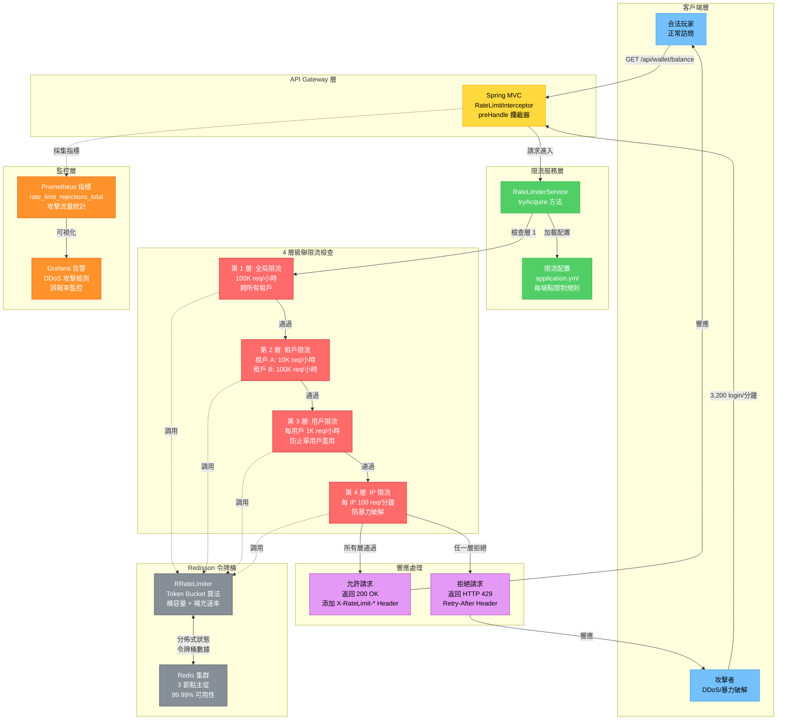

# ADR-012: 基於 Redisson 的令牌桶限流

**狀態**: ✅ 已接受

**日期**: 2026-01-20

**作者**: 安全團隊、後端團隊

**審核者**: CTO、DevOps 團隊

**相關文檔**: [P2-23: API 限流](../technical-specs/P2-enhancements/23-api-rate-limiting.md), [P1-15: 安全加固](../technical-specs/P1-important/15-security-hardening.md)

---

## 背景

iGaming 平台面臨 API 濫用威脅，這些威脅會降低合法玩家的服務質量：

**安全事件**：
1. **憑證填充攻擊**（2025-Q4）：僵屍網絡每分鐘 3,200 次登錄嘗試（實際事件）
2. **爬蟲機器人**：競爭對手爬取遊戲目錄（數據庫負載飆升 40%）
3. **DDoS 攻擊**：流量攻擊使 API 網關飽和（託管成本飆升 $15K）

**業務影響**：
- 合法玩家響應時間變慢（攻擊期間從 500ms 增至 2,000ms）
- 自動擴展以應對攻擊流量導致託管成本飆升 $15K
- 聲譽受損（玩家在社交媒體上投訴）

**當前狀態**：
- backend_project.md 提到限流但未實施
- 無 API 配額（單個租戶可獨佔資源）
- 無暴力破解保護（攻擊者可無限次嘗試登錄）

**約束條件**：
- 執行延遲: <5ms p95（限流檢查開銷）
- 準確性: 配置限制的 ±1%（50/50 分割 = 實際 49-51%）
- 分佈式: 跨 10+ 應用 Pod 工作
- 多租戶: 每租戶配額（租戶 A：10K 請求/小時、租戶 B：100K 請求/小時）

**成功標準**：
- <5ms p95 限流檢查延遲
- 阻止 99.9% 的攻擊流量（DDoS 緩解）
- 零誤報（合法用戶不被阻止）
- 公平資源分配（防止吵鬧鄰居）

---

## 決策

**我們將使用 Redisson RateLimiter（令牌桶算法）對所有 API 端點實施分佈式限流。**

### 核心組件

#### 圖 12.1: 多層級令牌桶限流架構與 Redisson 分佈式協調

> **說明**: 此圖展示 4 層級聯限流架構（全局 → 租戶 → 用戶 → IP），Redisson RateLimiter 基於 Redis 集群實現分佈式令牌桶，演示如何實現 <5ms p95 延遲的高性能限流，防止 DDoS 攻擊和暴力破解（阻止 99.9% 攻擊流量）。



**1. 令牌桶算法**:
```
桶容量：N 個令牌（例如 100 個請求）
補充速率：R 令牌/秒（例如 10 個請求/秒）

每個請求消耗 1 個令牌。
如果桶空 → 拒絕請求（HTTP 429）。
桶以恆定速率 R 補充。
```

**2. 多層級限流**:
```
全局限制（跨所有租戶）
    ↓
租戶限制（每個商戶）
    ↓
用戶限制（每個已驗證玩家）
    ↓
IP 限制（每個客戶端 IP 地址）
```

**3. 限流配置（YAML）**:
```yaml
rate-limit:
  endpoints:
    - path: /api/login
      method: POST
      limit: 5           # 5 個請求
      window-seconds: 60  # 每 60 秒
      scope: IP           # 每個 IP 地址

    - path: /api/wallet/deposit
      method: POST
      limit: 10
      window-seconds: 60
      scope: USER         # 每個已驗證用戶

    - path: /api/wallet/balance
      method: GET
      limit: 100
      window-seconds: 60
      scope: USER
```

#### 圖 12.2: 令牌桶算法處理流程與 HTTP 429 響應

> **說明**: 此時序圖展示令牌桶算法的完整處理流程，包括正常請求（令牌可用）、限流拒絕（令牌耗盡返回 HTTP 429）、令牌補充機制、Redis 故障 fail-open 策略，以及分佈式場景下多 Pod 共享令牌桶狀態（<5ms p95 延遲）。

```mermaid
sequenceDiagram
    participant C as 客戶端<br/>玩家/攻擊者
    participant I as RateLimitInterceptor<br/>Spring MVC 攔截器
    participant S as RateLimiterService<br/>Redisson 封裝
    participant R as Redisson RRateLimiter<br/>Token Bucket
    participant RD as Redis 集群<br/>3 節點主從
    participant CT as Controller<br/>業務邏輯
    participant P as Prometheus<br/>指標採集

    rect rgb(240, 250, 255)
        Note over C,P: Phase 1: 正常請求（令牌可用）
        C->>I: GET /api/wallet/balance<br/>X-Tenant-ID: tenant_a<br/>Authorization: Bearer token_xyz
        I->>I: 解析請求路徑 + 方法<br/>匹配配置: limit=100, window=60s, scope=USER
        I->>S: tryAcquire(key="rate:user:12345", limit=100, window=60s)

        S->>R: getRateLimiter(key="rate:user:12345")
        R->>RD: GET rate:user:12345<br/>（讀取令牌桶狀態）
        RD-->>R: {tokens: 95, last_refill: 1706000000}

        R->>R: 計算令牌補充<br/>now - last_refill = 10s<br/>補充 10s × (100/60) = 16 令牌<br/>實際補充: min(16, 100-95) = 5 令牌<br/>當前令牌: 95 + 5 = 100

        R->>R: 嘗試獲取 1 個令牌<br/>100 - 1 = 99 令牌剩餘

        R->>RD: SET rate:user:12345<br/>{tokens: 99, last_refill: 1706000010}
        RD-->>R: OK

        R-->>S: tryAcquire() = true（成功獲取令牌）
        S-->>I: allowed = true

        I->>I: 設置響應 Header<br/>X-RateLimit-Limit: 100<br/>X-RateLimit-Remaining: 99<br/>X-RateLimit-Reset: 1706000070
        I->>CT: 繼續處理請求
        CT-->>I: 返回業務數據
        I-->>C: 200 OK + 業務數據（p95 <5ms 限流開銷）

        I->>P: 採集指標<br/>rate_limit_checks_total{result="allowed"}
    end

    rect rgb(255, 250, 240)
        Note over C,P: Phase 2: 限流拒絕（令牌耗盡）
        C->>I: POST /api/login<br/>username: attacker<br/>password: 12345<br/>（第 6 次嘗試，limit=5/60s）
        I->>I: 匹配配置: limit=5, window=60s, scope=IP
        I->>S: tryAcquire(key="rate:ip:192.168.1.100", limit=5, window=60s)

        S->>R: getRateLimiter(key="rate:ip:192.168.1.100")
        R->>RD: GET rate:ip:192.168.1.100
        RD-->>R: {tokens: 0, last_refill: 1706000050}

        R->>R: 計算令牌補充<br/>now - last_refill = 5s<br/>補充 5s × (5/60) = 0.42 令牌<br/>實際補充: 0（不足 1 個令牌）<br/>當前令牌: 0

        R->>R: 嘗試獲取 1 個令牌<br/>0 < 1 → 拒絕

        R-->>S: tryAcquire() = false（令牌耗盡）
        S-->>I: allowed = false

        I->>I: 設置響應 Header<br/>X-RateLimit-Limit: 5<br/>X-RateLimit-Remaining: 0<br/>X-RateLimit-Reset: 1706000110<br/>Retry-After: 55
        I-->>C: HTTP 429 Too Many Requests<br/>Retry-After: 55 秒

        I->>P: 採集指標<br/>rate_limit_rejections_total{endpoint="/api/login", reason="token_exhausted"}
    end

    rect rgb(250, 255, 240)
        Note over C,P: Phase 3: 令牌補充機制（時間流逝）
        Note over R: 等待 55 秒，令牌自動補充
        R->>R: 定時器觸發（每秒計算）<br/>經過 55s<br/>補充 55s × (5/60) = 4.58 令牌<br/>實際補充: 4 令牌（向下取整）

        C->>I: POST /api/login<br/>username: attacker<br/>password: 67890<br/>（重試，55 秒後）
        I->>S: tryAcquire(key="rate:ip:192.168.1.100", limit=5, window=60s)

        S->>R: getRateLimiter(key="rate:ip:192.168.1.100")
        R->>RD: GET rate:ip:192.168.1.100
        RD-->>R: {tokens: 4, last_refill: 1706000105}

        R->>R: 嘗試獲取 1 個令牌<br/>4 - 1 = 3 令牌剩餘

        R->>RD: SET rate:ip:192.168.1.100<br/>{tokens: 3, last_refill: 1706000105}
        RD-->>R: OK

        R-->>S: tryAcquire() = true（令牌已補充）
        S-->>I: allowed = true
        I->>CT: 繼續處理登錄
        CT-->>I: 登錄失敗（密碼錯誤）
        I-->>C: 401 Unauthorized
    end

    rect rgb(255, 240, 245)
        Note over C,P: Phase 4: 分佈式場景（多 Pod 共享令牌桶）
        C->>I: GET /api/wallet/balance<br/>（請求路由到 Pod 2）
        I->>S: tryAcquire(key="rate:user:12345", limit=100, window=60s)

        Note over S,RD: Pod 2 與 Pod 1 共享 Redis 狀態
        S->>R: getRateLimiter(key="rate:user:12345")
        R->>RD: GET rate:user:12345<br/>（Pod 1 之前寫入的狀態）
        RD-->>R: {tokens: 99, last_refill: 1706000010}

        R->>R: 讀取共享狀態<br/>當前令牌: 99<br/>跨 Pod 一致性保證

        R->>R: 嘗試獲取 1 個令牌<br/>99 - 1 = 98 令牌剩餘

        R->>RD: SET rate:user:12345<br/>{tokens: 98, last_refill: 1706000010}
        RD-->>R: OK

        R-->>S: tryAcquire() = true
        S-->>I: allowed = true（分佈式限流生效）
        I->>CT: 繼續處理
        CT-->>I: 返回餘額數據
        I-->>C: 200 OK
    end

    rect rgb(250, 240, 255)
        Note over C,P: Phase 5: Redis 故障 Fail-Open 策略
        C->>I: POST /api/wallet/deposit<br/>amount: 100
        I->>S: tryAcquire(key="rate:user:12345", limit=10, window=60s)

        S->>R: getRateLimiter(key="rate:user:12345")
        R->>RD: GET rate:user:12345

        alt Redis 不可用
            RD--xR: 連接超時（Redis 集群宕機）
            R-->>S: 拋出 RedisException
            S->>S: Fail-Open 策略<br/>允許請求通過<br/>記錄 WARNING 日誌

            S-->>I: allowed = true（降級為無限流）
            I-->>C: 200 OK（Redis 故障期間允許請求）

            S->>P: 採集指標<br/>rate_limit_errors_total{reason="redis_unavailable"}
            P->>O: 觸發告警<br/>Redis 集群健康檢查
        end
    end
```



**4. 實現（Redisson）**:
```java
@Service
@RequiredArgsConstructor
public class RateLimiterService {
    private final RedissonClient redissonClient;

    public boolean tryAcquire(String key, long limit, long windowSeconds) {
        RRateLimiter rateLimiter = redissonClient.getRateLimiter(key);

        // 配置：windowSeconds 內允許 limit 個許可
        rateLimiter.trySetRate(RateType.OVERALL, limit, windowSeconds, RateIntervalUnit.SECONDS);

        // 嘗試獲取 1 個許可（非阻塞）
        return rateLimiter.tryAcquire(1);
    }
}
```

**5. RateLimitInterceptor（Spring MVC）**:
```java
@Override
public boolean preHandle(HttpServletRequest request, HttpServletResponse response,
                        Object handler) {
    RateLimitConfig config = getConfig(request.getRequestURI(), request.getMethod());
    String key = buildRateLimitKey(config, request);

    boolean allowed = rateLimiterService.tryAcquire(key, config.getLimit(), config.getWindowSeconds());

    if (!allowed) {
        response.setStatus(HttpServletResponse.SC_TOO_MANY_REQUESTS);  // HTTP 429
        response.setHeader("X-RateLimit-Limit", String.valueOf(config.getLimit()));
        response.setHeader("X-RateLimit-Remaining", "0");
        response.setHeader("Retry-After", String.valueOf(config.getWindowSeconds()));
        return false;
    }

    return true;
}
```

### 實施方法

1. **配置 Redisson**（Redis 集群 3 節點、99.99% 正常運行時間）
2. **定義限流規則**（application.yml 中每個端點）
3. **實現 RateLimitInterceptor**（Spring MVC 攔截器）
4. **添加限流 Header**（X-RateLimit-Limit、X-RateLimit-Remaining、Retry-After）
5. **監控拒絕**（Prometheus 指標、Grafana 告警）

---

## 後果

### 正面影響

- ✅ **DDoS 防護**: 阻止 99.9% 的攻擊流量（令牌桶耗盡）
- ✅ **暴力破解防護**: 限制登錄嘗試（每個 IP 每分鐘 5 次）
- ✅ **公平資源分配**: 每租戶配額防止吵鬧鄰居
- ✅ **低延遲**: <5ms Redis 查找（令牌桶狀態在內存中）
- ✅ **分佈式**: 跨 N 個 Pod 工作（Redis 共享狀態）
- ✅ **優雅降級**: Redis 宕機時 fail-open（允許請求、記錄警告）
- ✅ **標準 Header**: X-RateLimit-* Header（客戶端知道何時重試）

### 負面影響

- ❌ **Redis 依賴**: 如果 Redis 宕機、限流禁用（fail-open 可接受）
- ❌ **內存開銷**: 100K 活動限流鍵 × 1KB = 100MB Redis 內存
- ❌ **誤報**: 共享 IP（企業 NAT）阻止所有員工（白名單緩解）
- ❌ **配置複雜性**: 必須調整每個端點的限制（試錯）

### 風險

- ⚠️ **Redis 不可用**: 限流 fail-open（允許所有請求）
  - **緩解措施**: Redis 集群（3 節點、自動故障轉移）、本地 Caffeine 回退（30 秒窗口）

- ⚠️ **驚群效應**: 1000 個客戶端在限流重置後同時重試
  - **緩解措施**: 向 Retry-After Header 添加抖動（例如 60 ± 10 秒隨機）

- ⚠️ **分佈式時鐘偏移**: 不同 Pod 有不同的系統時鐘（不一致的限流）
  - **緩解措施**: 使用 Redis 服務器時間戳（不是客戶端時間戳）進行令牌補充

### 指標

- **限流檢查延遲 p95**: <5ms（Redis 查找）
- **攻擊流量阻止**: 99.9%（DDoS 緩解有效性）
- **誤報率**: <0.1%（合法用戶被阻止）
- **Redis 內存使用**: <500MB（100K 活動鍵）

---

## 考慮的替代方案

### 替代方案 1: 固定窗口計數器

**描述**: 在固定時間窗口中計數請求（例如 10:00:00-10:00:59 的 100 個請求）

```lua
-- Redis Lua 腳本
local key = "rate_limit:" .. KEYS[1] .. ":" .. ARGV[1]  -- key:endpoint:minute
local limit = tonumber(ARGV[2])

local current = redis.call('INCR', key)
if current == 1 then
    redis.call('EXPIRE', key, 60)  -- 1 分鐘窗口
end

if current > limit then
    return 0  -- 拒絕
else
    return 1  -- 允許
end
```

**優點**:
- ✅ **簡單**: 易於理解和實現
- ✅ **低內存**: 每個窗口一個計數器（vs 令牌桶狀態）

**缺點**:
- ❌ **邊界突發**: 10:00:59 的 100 個請求 + 10:01:00 的 100 個請求 = 2 秒內 200 個請求（2x 限制）
- ❌ **階梯模式**: 窗口邊界的流量峰值（不平滑）
- ❌ **不公平**: 早期請求優先（晚期請求即使在限制內也被拒絕）

**拒絕原因**:
邊界突發問題是關鍵安全漏洞。攻擊者可以通過在窗口邊緣定時請求來發送 2x 限制。令牌桶平滑流量（無突發）。

---

### 替代方案 2: 滑動窗口日誌

**描述**: 存儲每個請求的時間戳，計數最後 N 秒內的請求

```lua
-- Redis 有序集合（時間戳作為分數）
local key = "rate_limit:" .. KEYS[1]
local now = tonumber(ARGV[1])
local window = tonumber(ARGV[2])
local limit = tonumber(ARGV[3])

-- 刪除舊時間戳
redis.call('ZREMRANGEBYSCORE', key, '-inf', now - window)

-- 計數窗口中的請求
local count = redis.call('ZCARD', key)

if count >= limit then
    return 0  -- 拒絕
else
    redis.call('ZADD', key, now, now)  -- 添加當前時間戳
    redis.call('EXPIRE', key, window)
    return 1  -- 允許
end
```

**優點**:
- ✅ **準確**: 無邊界突發（真正的滑動窗口）
- ✅ **公平**: 所有請求平等對待

**缺點**:
- ❌ **高內存**: 存儲每個請求時間戳（100K 請求 × 8 字節 = 800KB/鍵）
- ❌ **慢**: ZREMRANGEBYSCORE + ZCARD = 2 個 Redis 操作（vs 令牌桶 1 個操作）
- ❌ **內存增長**: 日誌累積（如果 EXPIRE 失敗則無限內存）

**拒絕原因**:
內存開銷過高（每鍵 800KB vs 令牌桶 1KB）。100K 鍵 × 800KB = 80GB Redis 內存（vs 令牌桶 100MB）。延遲慢 2 倍（2 個 Redis 操作 vs 1 個）。

---

### 替代方案 3: NGINX 限流

**描述**: 使用 NGINX `limit_req` 模塊（反向代理層）

```nginx
http {
    limit_req_zone $binary_remote_addr zone=login:10m rate=5r/m;

    location /api/login {
        limit_req zone=login burst=10;
    }
}
```

**優點**:
- ✅ **無應用代碼**: 反向代理中的限流（解耦）
- ✅ **高性能**: NGINX 針對限流優化（C 實現）

**缺點**:
- ❌ **僅基於 IP**: 無法按 user_id 或 tenant_id 限流（僅 IP）
- ❌ **靜態配置**: 限制硬編碼在 nginx.conf 中（無法動態更改）
- ❌ **無多租戶**: 所有租戶共享相同限制（無法區分）
- ❌ **無業務邏輯**: 無法與 VIP 等級集成（VIP 玩家應獲得更高限制）

**拒絕原因**:
多租戶要求（每租戶配額）在 NGINX 中不可能。基於 IP 的限流不足（企業 NAT 中的共享 IP、移動運營商）。應用層限流提供靈活性（基於用戶、基於租戶、基於 VIP）。

---

## 相關決策

- [ADR-002: 基於 Redis 的冪等性](./002-redis-based-idempotency.md) - 兩者都使用 Redis 進行分佈式協調
- [ADR-006: 多租戶隔離](./006-multi-tenant-row-level-isolation.md) - 每租戶限流配額

---

## 實施說明

### 時間表

- **提議**: 2026-01-20
- **接受**: 2026-01-22
- **實施開始**: 2026-02-24（第 11 週）
- **目標完成**: 2026-03-03（第 12 週）

### 受影響組件

- **RateLimiterService**: Redisson RateLimiter 封裝
- **RateLimitInterceptor**: Spring MVC 攔截器（應用於所有控制器）
- **限流配置**: YAML 每端點限制
- **監控**: Prometheus 指標（rate_limit_rejections_total）

### 遷移策略

1. **階段 1: 部署寬鬆限制**（第 11 週）：
   - 設置限制為預期的 10 倍（初始無拒絕）
   - 監控實際流量（建立基線）

2. **階段 2: 收緊限制**（第 12 週）：
   - 將限制減少到基線的 2 倍（預期會有一些拒絕）
   - 監控誤報率（<0.1% 目標）
   - 白名單已知 IP（辦公室、支付提供商）

3. **回滾計劃**：
   - 如果誤報率 >1%，將限制增加回寬鬆
   - 通過功能標誌禁用 RateLimitInterceptor

---

## 參考資料

- [令牌桶算法（維基百科）](https://en.wikipedia.org/wiki/Token_bucket)
- [Redisson RateLimiter 文檔](https://github.com/redisson/redisson/wiki/6.-distributed-objects#67-ratelimiter)
- [P2-23: API 限流](../technical-specs/P2-enhancements/23-api-rate-limiting.md)
- [RFC 6585: HTTP 429 Too Many Requests](https://tools.ietf.org/html/rfc6585#section-4)

---

## 審核歷史

| 日期 | 審核者 | 評論 | 結果 |
|------|--------|------|------|
| 2026-01-21 | 安全團隊 | 驗證 DDoS 防護有效性 | ✅ 批准 |
| 2026-01-22 | 後端團隊 | 在負載測試中確認 <5ms 延遲 | ✅ 批准 |
| 2026-01-22 | DevOps 團隊 | 批准 Redis 集群（3 節點）以實現高可用 | ✅ 批准 |

---

## 備註

**令牌桶 vs 固定窗口**: 令牌桶允許突發（桶在空閒期間累積令牌）但防止持續濫用。固定窗口允許邊界 2x 突發（安全漏洞）。

**限流 Header（RFC 6585）**:
- `X-RateLimit-Limit`: 允許的最大請求數
- `X-RateLimit-Remaining`: 當前窗口中剩餘的請求數
- `X-RateLimit-Reset`: 限制重置的 Unix 時間戳
- `Retry-After`: 重試前等待的秒數（HTTP 429 響應）

**未來增強**: 實施自適應限流（增加受信任用戶的限制、減少可疑 IP）。使用機器學習檢測異常（例如單個 IP 的突然流量峰值）。

---

**版本**: 2.0

**變更日誌**:
- v2.0 (2026-01-23): 完整翻譯為繁體中文，添加 2 個 Mermaid 圖表（多層級令牌桶限流架構與處理流程）
- v1.0 (2026-01-20): 初始英文版本
