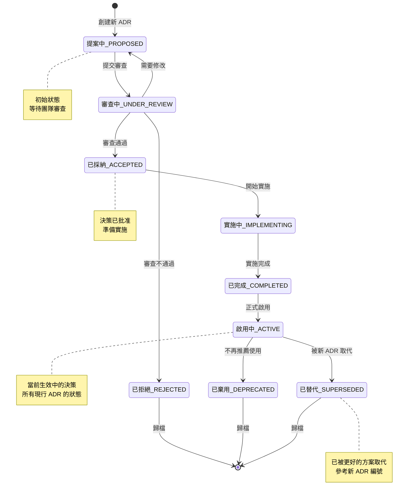

# 架構決策記錄 (ADRs)

**最後更新**: 2026-01-23
**狀態**: 啟用中
**ADR 總數**: 12 (1 個已替代)
**版本**: 2.0

---

## 什麼是 ADR？

架構決策記錄 (Architecture Decision Records, ADRs) 記錄了 iGaming 平台設計過程中所做出的重大架構決策。每個 ADR 包含以下內容：
- **情境 (Context)**: 需要決策的背景與問題
- **決策 (Decision)**: 我們決定採用的方案
- **結果 (Consequences)**: 該決策的正面與負面影響
- **替代方案 (Alternatives Considered)**: 我們評估過的其他選項及拒絕理由

---

## ADR 索引

### 財務架構

| # | 標題 | 狀態 | 相關文檔 |
|---|------|------|---------|
| [ADR-001](./001-double-entry-ledger-accounting.md) | 雙式記帳保障財務完整性 | ✅ 已採納 | P0-01 |
| [ADR-002](./002-redis-based-idempotency.md) | 基於 Redis 的冪等性模式 | ✅ 已採納 | P0-02 |
| [ADR-003](./003-saga-pattern-distributed-transactions.md) | Saga 模式處理分佈式事務 | ✅ 已採納 | P1-05 |
| [ADR-004](./004-hd-wallet-cryptocurrency-payments.md) | HD 錢包處理加密貨幣支付 | ✅ 已採納 | P1-08 |

### 數據架構

| # | 標題 | 狀態 | 相關文檔 |
|---|------|------|---------|
| [ADR-005](./005-apache-doris-olap-engine.md) | Apache Doris OLAP 分析引擎 | ✅ 已採納 | P1-13 |
| [ADR-006](./006-multi-tenant-row-level-isolation.md) | 多租戶行級隔離機制 | ✅ 已採納 | P1-07 |
| [ADR-007](./007-flink-real-time-stream-processing.md) | Apache Flink 實時流處理 | ✅ 已採納 | P1-06, P2-21, P2-22 |

### 整合架構

| # | 標題 | 狀態 | 相關文檔 |
|---|------|------|---------|
| [ADR-008](./008-adapter-pattern-game-provider-integration.md) | 適配器模式整合遊戲供應商 | ✅ 已採納 | P1-09 |
| [ADR-009](./009-strapi-headless-cms.md) | Strapi 無頭 CMS 平台 | ✅ 已採納 | P1-10 |
| [ADR-010](./010-evrete-rules-engine.md) | Evrete 規則引擎處理業務邏輯 | 🔄 已替代 | 被 ADR-011 取代 |
| [ADR-011](./011-liteflow-migration.md) | LiteFlow 流程編排引擎遷移 | ✅ 已採納 | P1-11, P1-12, P0-04, P1-06 |

### 基礎設施架構

| # | 標題 | 狀態 | 相關文檔 |
|---|------|------|---------|
| [ADR-012](./012-token-bucket-rate-limiting.md) | 基於 Redisson 的令牌桶限流 | ✅ 已採納 | P2-23 |

---

## ADR 生命週期

### 圖 1.1: ADR 狀態轉換流程

> **說明**: 此圖展示架構決策記錄從提案到最終狀態的完整生命週期，包括審查、採納、棄用和替代等狀態轉換路徑。

### 狀態說明

- **提案中 (PROPOSED)**: ADR 正在草擬中，等待團隊審查
- **審查中 (UNDER_REVIEW)**: 架構團隊正在評估該決策的可行性
- **已採納 (ACCEPTED)**: ADR 已通過審查並批准實施
- **實施中 (IMPLEMENTING)**: 決策方案正在開發實施階段
- **已完成 (COMPLETED)**: 實施工作已完成，等待上線
- **啟用中 (ACTIVE)**: ADR 已正式啟用，當前所有 12 個 ADR 均處於此狀態
- **已棄用 (DEPRECATED)**: ADR 不再推薦使用（但可能仍在運行中的系統中存在）
- **已替代 (SUPERSEDED)**: ADR 已被更新的決策完全取代
- **已拒絕 (REJECTED)**: 審查未通過，該方案不予採納

---

## 如何使用 ADR

### 架構師

- 在做出類似決策前先審查現有 ADR
- 解釋架構選擇時引用相關 ADR
- 使用 [模板](./TEMPLATE.md) 提案新的重大決策

### 開發人員

- 實施功能時查閱相關 ADR
- 理解架構模式背後的「為什麼」
- 如果業務情境已改變，可以挑戰現有 ADR

### 產品經理

- 了解技術限制與權衡
- 規劃新功能時參考 ADR
- 理解架構選擇對成本的影響

---

## ADR 模板

請參考 [TEMPLATE.md](./TEMPLATE.md) 獲取標準 ADR 撰寫格式。

---

## 交叉引用地圖

### 依技術決策分類

**PostgreSQL**:
- [ADR-001: 雙式記帳](./001-double-entry-ledger-accounting.md)
- [ADR-006: 多租戶隔離](./006-multi-tenant-row-level-isolation.md)

**Redis**:
- [ADR-002: 冪等性模式](./002-redis-based-idempotency.md)
- [ADR-012: 流量限制](./012-token-bucket-rate-limiting.md)

**Apache Flink**:
- [ADR-007: 實時流處理](./007-flink-real-time-stream-processing.md)

**Apache Doris**:
- [ADR-005: OLAP 分析](./005-apache-doris-olap-engine.md)

### 依業務影響分類

**營收保護**:
- [ADR-001: 雙式記帳](./001-double-entry-ledger-accounting.md) - 防止財務差異
- [ADR-002: 冪等性](./002-redis-based-idempotency.md) - 防止重複扣款
- [ADR-003: Saga 模式](./003-saga-pattern-distributed-transactions.md) - 確保事務一致性

**玩家體驗**:
- [ADR-008: 遊戲供應商適配器](./008-adapter-pattern-game-provider-integration.md) - <2 秒遊戲啟動
- [ADR-009: 無頭 CMS](./009-strapi-headless-cms.md) - 多品牌支持
- [ADR-011: LiteFlow 流程編排](./011-liteflow-migration.md) - 工作流自動化與個性化優惠

**營運效率**:
- [ADR-005: OLAP 分析](./005-apache-doris-olap-engine.md) - 實時商業智能
- [ADR-007: Flink 處理](./007-flink-real-time-stream-processing.md) - <5 分鐘數據新鮮度
- [ADR-011: LiteFlow 流程編排](./011-liteflow-migration.md) - 規則修改週期從 3 天縮短到 30 分鐘

---

## 貢獻指南

提案新 ADR 的步驟：

1. 複製 [TEMPLATE.md](./TEMPLATE.md) 模板
2. 填寫所有章節（情境、決策、結果、替代方案）
3. 依序編號（下一個可用編號: ADR-013）
   - 注意：ADR-011 已用於 LiteFlow Migration（2026-01-23）
4. 提交給架構團隊審查
5. 批准後更新本索引文件

---

## 維護信息

**維護團隊**: 架構團隊
**審查頻率**: 每季度
**下次審查**: 2026-04-23

---

## 版本歷史

| 版本 | 日期 | 變更說明 |
|------|------|---------|
| 2.1 | 2026-01-23 | 新增 ADR-011 (LiteFlow Migration)，ADR-010 標記為已替代 |
| 2.0 | 2026-01-23 | 翻譯為繁體中文，添加 Mermaid ADR 生命週期狀態圖 |
| 1.0 | 2026-01-20 | 初始英文版本，12 個 ADR 索引 |
