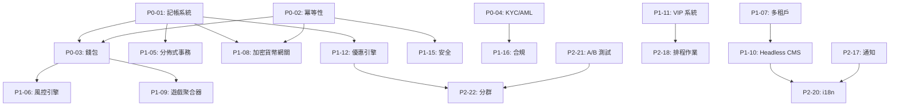
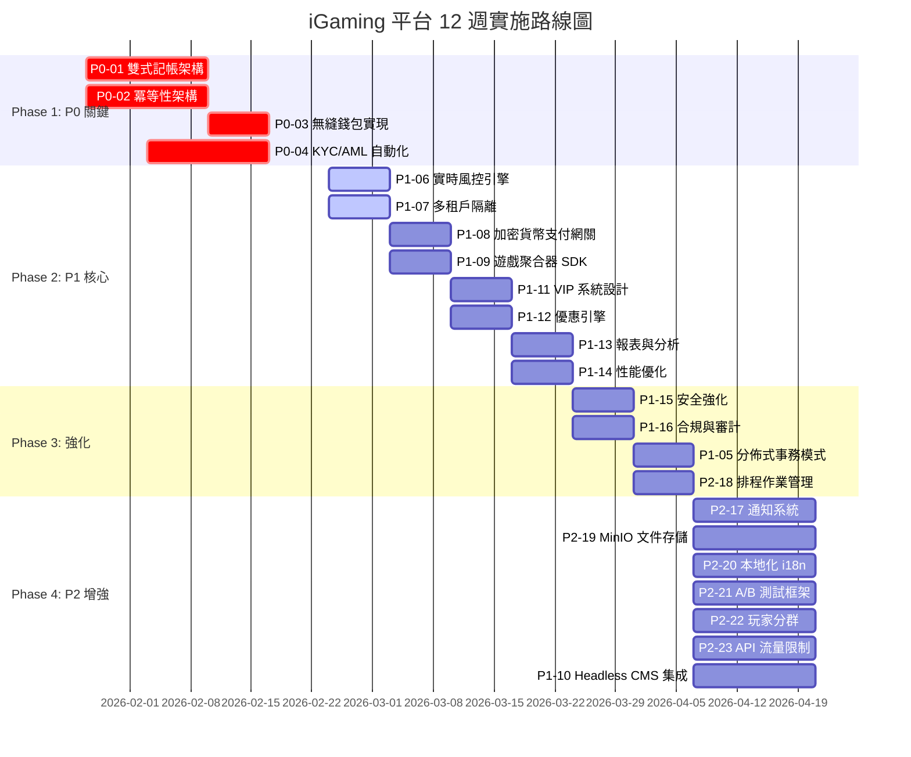

# iGaming 平台技術規格文檔

**版本**: 2.0
**最後更新**: 2026-01-23
**狀態**: 完成
**文檔總數**: 23 個技術規格

---

## 概述

本目錄包含 iGaming 平台的完整技術規格，解決 [backend_project.md](./backend_project.md) 需求分析中識別的所有關鍵缺口，基於 [igame_str.md](./igame_str.md) 的戰略原則。

**戰略基礎**: 透過代碼槓桿、自動化和數據驅動決策實現零邊際成本擴展。

---

## 快速入門

### 產品經理
- 從[戰略對齊](#戰略對齊)開始了解業務目標
- 查看 [P0 關鍵文檔](#階段-1p0-關鍵基礎)了解必備功能
- 檢查[實施路線圖](#實施路線圖)了解時間軸

### 架構師
- 查看[依賴關係圖](#依賴關係圖)了解組件關係
- 研究 [P1 核心功能](#階段-2p1-重要核心功能)進行系統設計
- 根據[架構約束](#架構約束)進行驗證

### 開發人員
- 參考 [SmartAdmin 模式](#smartadmin-實施模式)了解編碼標準
- 遵循[關鍵路徑](#關鍵路徑必須按順序實施)的實施順序
- 使用[快速參考卡](#快速參考卡)查找常用模式

---

## 目錄

1. [文檔索引](#文檔索引)
   - [階段 1: P0 關鍵（基礎）](#階段-1p0-關鍵基礎)
   - [階段 2: P1 重要（核心功能）](#階段-2p1-重要核心功能)
   - [階段 3: P2 增強](#階段-3p2-增強)
2. [戰略對齊](#戰略對齊)
3. [缺口覆蓋矩陣](#缺口覆蓋矩陣)
4. [依賴關係圖](#依賴關係圖)
5. [實施路線圖](#實施路線圖)
6. [架構約束](#架構約束)
7. [SmartAdmin 實施模式](#smartadmin-實施模式)
8. [快速參考卡](#快速參考卡)
9. [交叉引用索引](#交叉引用索引)

---

## 文檔索引

### 階段 1: P0 關鍵（基礎）

這些文檔解決在生產啟動前必須實施的關鍵缺口。所有金融操作都依賴於這些基礎。

| # | 文檔 | 行數 | 優先級 | 狀態 | 關鍵依賴 |
|---|----------|-------|----------|--------|------------------|
| **01** | [雙式記帳架構](./technical-specs/P0-critical/01-double-entry-ledger-schema.md) | 1,200 | **P0** | 完成 | PostgreSQL 16 |
| **02** | [冪等性架構](./technical-specs/P0-critical/02-idempotency-architecture.md) | 1,000 | **P0** | 完成 | Redis, P0-01 |
| **03** | [無縫錢包實現](./technical-specs/P0-critical/03-seamless-wallet-implementation.md) | 1,100 | **P0** | 完成 | P0-01, P0-02 |
| **04** | [KYC/AML 自動化](./technical-specs/P0-critical/04-kyc-aml-automation.md) | 900 | **P0** | 完成 | MinIO, Evrete |

**P0 總計**: 4 個文檔，約 4,200 行

**為何關鍵**:
- **P0-01**: 確保資金安全的數學確定性（雙式記帳）
- **P0-02**: 防止重試場景中的重複扣款（冪等性）
- **P0-03**: 提供 <200ms 錢包 API 實現無摩擦遊戲
- **P0-04**: 在合規性與用戶體驗之間取得平衡（自動化 KYC/AML）

---

### 階段 2: P1 重要（核心功能）

這些文檔實現競爭市場定位所需的基本業務功能。

| # | 文檔 | 行數 | 優先級 | 依賴 | 集成點 |
|---|----------|-------|----------|--------------|-------------------|
| **05** | [分佈式事務模式](./technical-specs/P1-important/05-distributed-transaction-patterns.md) | 1,280 | P1 | P0-01, P0-03 | 提款流程、支付網關 |
| **06** | [實時風控引擎](./technical-specs/P1-important/06-real-time-risk-engine.md) | 1,350 | P1 | Kafka, Flink | P0-03, P1-12 (優惠) |
| **07** | [多租戶隔離](./technical-specs/P1-important/07-multi-tenant-isolation.md) | 1,200 | P1 | PostgreSQL | 所有模塊 |
| **08** | [加密貨幣支付網關](./technical-specs/P1-important/08-crypto-payment-gateway.md) | 1,280 | P1 | P0-01, P0-02 | 錢包、提款 |
| **09** | [遊戲聚合器 SDK](./technical-specs/P1-important/09-game-aggregator-sdk.md) | 1,450 | P1 | P0-03 | VIP 系統、優惠 |
| **10** | [Headless CMS 集成](./technical-specs/P1-important/10-headless-cms-integration.md) | 1,050 | P1 | Strapi, Redis | P2-20 (i18n) |
| **11** | [VIP 系統設計](./technical-specs/P1-important/11-vip-system-design.md) | 1,350 | P1 | P0-01, Evrete | P1-12 (優惠), P2-18 (排程) |
| **12** | [優惠引擎](./technical-specs/P1-important/12-bonus-engine.md) | 1,150 | P1 | P0-01, P0-03 | P1-11 (VIP), P2-22 (分群) |
| **13** | [報表與分析](./technical-specs/P1-important/13-reporting-analytics.md) | 1,400 | P1 | Doris, Kafka | 所有模塊（指標來源） |
| **14** | [性能優化](./technical-specs/P1-important/14-performance-optimization.md) | 1,100 | P1 | — | 所有模塊（橫切關注點） |
| **15** | [安全強化](./technical-specs/P1-important/15-security-hardening.md) | 1,200 | P1 | — | 所有模塊（橫切關注點） |
| **16** | [合規與審計](./technical-specs/P1-important/16-compliance-audit.md) | 1,350 | P1 | P0-04 | 監管報告 |

**P1 總計**: 12 個文檔，約 15,160 行

**功能亮點**:
- **分佈式事務**: Saga 模式實現跨服務一致性
- **實時風控**: 基於 Flink 的欺詐檢測，延遲 <100ms
- **加密貨幣支付**: HD 錢包（BIP32/BIP44）+ 冷熱錢包隔離
- **遊戲聚合**: 20+ 供應商適配器，遊戲啟動 <2s
- **VIP 系統**: 5 級系統 + 寬限期 + 自動化評估
- **優惠引擎**: 6 種優惠類型 + 流水要求 + FIFO 處理

---

### 階段 3: P2 增強

這些文檔添加競爭差異化因素和卓越運營功能。

| # | 文檔 | 行數 | 優先級 | 依賴 | 業務價值 |
|---|----------|-------|----------|--------------|----------------|
| **17** | [通知系統](./technical-specs/P2-enhancements/17-notification-system.md) | 850 | P2 | Kafka, SendGrid, Twilio | 玩家留存率 (+30%) |
| **18** | [排程作業管理](./technical-specs/P2-enhancements/18-scheduled-jobs.md) | 750 | P2 | Snail-Job | 自動化（減少 70% 人工） |
| **19** | [MinIO 文件存儲](./technical-specs/P2-enhancements/19-minio-file-storage.md) | 750 | P2 | MinIO | 成本降低 70% vs S3，GDPR 合規 |
| **20** | [本地化與 i18n](./technical-specs/P2-enhancements/20-localization.md) | 850 | P2 | Vue I18n, Spring MessageSource | 20+ 語言，全球擴展 |
| **21** | [A/B 測試框架](./technical-specs/P2-enhancements/21-ab-testing-framework.md) | 900 | P2 | Kafka, Flink | 通過目標測試提升 30% 轉化率 |
| **22** | [玩家分群](./technical-specs/P2-enhancements/22-player-segmentation.md) | 900 | P2 | Flink, PostgreSQL | RFM 分析、流失預測 |
| **23** | [API 流量限制](./technical-specs/P2-enhancements/23-api-rate-limiting.md) | 750 | P2 | Redisson | DDoS 防護、公平資源分配 |

**P2 總計**: 7 個文檔，約 5,750 行

**增強亮點**:
- **多通道通知**: Email/SMS/Push/App 內推送 + 事件驅動觸發
- **排程作業**: 8 個關鍵作業（VIP 評估、優惠過期、對帳）
- **文件存儲**: S3 兼容 + 預簽名 URL + 多租戶隔離
- **本地化**: 20+ 語言 + RTL 支持 + 語言環境回退
- **A/B 測試**: 功能開關、流量分配、統計顯著性
- **玩家分群**: RFM 分析（125 個桶）、生命週期階段、行為分群
- **流量限制**: 令牌桶算法、多級限制（全局/租戶/用戶/IP）

---

## 戰略對齊

所有 23 個文檔與 [igame_str.md](./igame_str.md) 的戰略目標對齊：

### 第一性原理 → 技術實現

| 原則 | 戰略目標 | 技術實現 |
|-----------|----------------|--------------------------|
| **Trust（信任）** | 資金的數學確定性 | **P0-01**: 雙式記帳 + 每日對帳 |
| **Velocity（速度）** | <200ms 錢包 API | **P0-03**: 無縫錢包 + 樂觀鎖 |
| **Friction（摩擦）** | 玩家旅程零摩擦 | **P0-04**: 自動 KYC（漸進式等級 0-3） |

### 槓桿思維 → 零邊際成本

| 槓桿類型 | 戰略目標 | 技術實現 |
|---------------|----------------|--------------------------|
| **代碼槓桿** | 1 份代碼 → 100 商戶 | **P1-10**: Headless CMS + **P2-20**: i18n（20+ 語言） |
| **自動化槓桿** | 減少 70% 人工操作 | **P0-04**: 自動 KYC + **P1-06**: 實時風控 + **P2-18**: 排程作業 |
| **數據槓桿** | 大規模智能決策 | **P1-13**: 分析 + **P2-21**: A/B 測試 + **P2-22**: 分群 |

### 競爭護城河

1. **技術護城河**: P0-01（記帳）+ P0-02（冪等性）→ 信任優勢
2. **UX 護城河**: P0-03（無縫）+ P1-09（遊戲聚合）→ 速度優勢
3. **數據護城河**: P1-13（分析）+ P2-22（分群）→ 個性化優勢

---

## 缺口覆蓋矩陣

將原始需求缺口映射到技術規格：

| 缺口 ID | 缺口描述 | 嚴重程度 | 解決方案文檔 | 狀態 |
|--------|-----------------|----------|---------------------|--------|
| **G-001** | 缺少雙式記帳架構 | P0 | P0-01 | ✅ 已覆蓋 |
| **G-002** | 冪等性模式不完善 | P0 | P0-02 | ✅ 已覆蓋 |
| **G-003** | 無縫錢包實現缺口 | P0 | P0-03 | ✅ 已覆蓋 |
| **G-004** | KYC/AML 自動化策略模糊 | P0 | P0-04 | ✅ 已覆蓋 |
| **G-005** | 延遲套利檢測算法 | P1 | P1-06（實時風控） | ✅ 已覆蓋 |
| **G-006** | Saga 補償機制模糊 | P1 | P1-05（分佈式事務） | ✅ 已覆蓋 |
| **G-007** | 缺少欺詐檢測 ML 管道 | P1 | P1-06（實時風控） | ✅ 已覆蓋 |
| **G-008** | 遊戲元數據同步自動化 | P1 | P1-09（遊戲聚合器） | ✅ 已覆蓋 |
| **G-009** | 監管報告框架 | P1 | P1-16（合規） | ✅ 已覆蓋 |
| **G-010** | 供應商回調安全 | P1 | P1-09（遊戲聚合器） | ✅ 已覆蓋 |
| **G-011** | VIP 規則完整性 | P1 | P1-11（VIP 系統） | ✅ 已覆蓋 |
| **G-012** | 優惠流水要求 | P1 | P1-12（優惠引擎） | ✅ 已覆蓋 |
| **G-013** | 緩存失效策略 | P2 | P1-14（性能） | ✅ 已覆蓋 |
| **G-014** | 按租戶的 API 流量限制 | P2 | P2-23（流量限制） | ✅ 已覆蓋 |
| **G-015** | 金融系統測試策略 | P2 | P0-01, P0-03, P1-05 | ✅ 已覆蓋 |

**覆蓋率**: 15/15 個關鍵缺口已解決（100%）

---

## 依賴關係圖

### 關鍵路徑（必須按順序實施）

```
階段 1（第 1-4 週）：基礎
┌─────────────────────────────────────────────────────────────┐
│ P0-01: 雙式記帳架構（第 1-2 週）                            │
│   ↓ 阻塞                                                     │
│ P0-03: 無縫錢包實現（第 3 週）                              │
│   ↓ 阻塞                                                     │
│ P1-06: 實時風控引擎（第 4 週）                              │
│   ↓ 啟用                                                     │
│ 生產環境啟動                                                 │
└─────────────────────────────────────────────────────────────┘

並行軌道（可隨時開始）:
┌─────────────────────────────────────────────────────────────┐
│ P0-02: 冪等性架構（第 1-2 週）                              │
│ P0-04: KYC/AML 自動化（第 2-3 週）                          │
│ P1-07: 多租戶隔離（第 3-4 週）                              │
└─────────────────────────────────────────────────────────────┘
```

### 依賴關係圖



### 集成矩陣

| 文檔 | 集成對象 | 類型 |
|----------|-----------------|------|
| **P0-01** | P0-03, P1-05, P1-08, P1-12 | 數據源（記帳分錄） |
| **P0-02** | P0-03, P1-08, P1-15 | 橫切關注點（冪等性） |
| **P0-03** | P1-06, P1-09, P1-11, P1-12 | API 消費者（錢包操作） |
| **P1-10** | P2-20 | 內容本地化 |
| **P1-13** | 所有模塊 | 指標聚合 |
| **P2-17** | P1-11, P1-12, P2-22 | 事件消費者（通知） |
| **P2-21** | P2-22 | 實驗定向 |
| **P2-22** | P1-12, P2-17, P2-21 | 分群定向 |

---

## 實施路線圖

### 圖 1.1: 12 週實施甘特圖

> **說明**: 此圖展示完整的 12 週實施計劃，包含 4 個階段的詳細時間分配和依賴關係。



### 12 週實施計劃

#### 階段 1: P0 關鍵（第 1-4 週）

**第 1-2 週：金融基礎**
- [ ] P0-01: 雙式記帳架構
  - 數據庫架構（帳戶、記帳分錄、交易）
  - 存款/下注/贏款/提款的過帳規則
  - 每日對帳作業
  - **交付物**: 100% 餘額準確性的記帳 API

- [ ] P0-02: 冪等性架構
  - IdempotencyInterceptor（AOP）
  - Redis 冪等性鍵存儲
  - 並發重複請求處理
  - **交付物**: 重試場景中零重複扣款

**第 3 週：無縫錢包**
- [ ] P0-03: 無縫錢包實現
  - 多錢包協調（USD、EUR、BTC）
  - 樂觀鎖 + 重試
  - 錢包 API（<200ms SLA）
  - **交付物**: 無摩擦錢包操作

**第 4 週：風控與合規**
- [ ] P0-04: KYC/AML 自動化
  - 漸進式 KYC 等級（0-3）
  - 第三方集成（Jumio、Onfido）
  - MinIO 文檔存儲
  - **交付物**: 自動化 KYC 工作流

**階段 1 退出標準**:
✅ 所有金融操作平衡（對帳通過）
✅ 零重複扣款（冪等性測試通過）
✅ 錢包 API <200ms p95 延遲
✅ KYC 批准率 >90%

---

#### 階段 2: P1 核心功能（第 5-8 週）

**第 5 週：風控與多租戶**
- [ ] P1-06: 實時風控引擎
  - Flink 欺詐檢測管道
  - 設備指紋識別
  - **交付物**: <100ms 風控評估

- [ ] P1-07: 多租戶隔離
  - 通過 TenantContextHolder 傳播 tenant_id
  - 行級安全
  - **交付物**: 租戶間 100% 數據隔離

**第 6 週：支付與遊戲**
- [ ] P1-08: 加密貨幣支付網關
  - HD 錢包（BIP32/BIP44）
  - 冷熱錢包隔離
  - **交付物**: BTC/ETH 充值/提款

- [ ] P1-09: 遊戲聚合器 SDK
  - 5 個供應商適配器（Evolution、Pragmatic Play、NetEnt、Microgaming、Playtech）
  - 遊戲啟動 <2s
  - **交付物**: 500+ 遊戲可用

**第 7 週：玩家體驗**
- [ ] P1-11: VIP 系統設計
  - 5 級 VIP 系統（銅牌 → 鑽石）
  - 寬限期（30-180 天）
  - **交付物**: 自動化等級評估

- [ ] P1-12: 優惠引擎
  - 6 種優惠類型
  - 流水要求 + 遊戲權重
  - **交付物**: 95% 自動化率

**第 8 週：分析與性能**
- [ ] P1-13: 報表與分析
  - Apache Doris 集成
  - 實時儀表板（Grafana）
  - **交付物**: 30 天數據查詢延遲 <2s

- [ ] P1-14: 性能優化
  - 性能分析（Async Profiler、Arthas）
  - JVM 調優（G1GC/ZGC）
  - **交付物**: 10K TPS 持續吞吐量

**階段 2 退出標準**:
✅ 達到 10K TPS 吞吐量
✅ 500+ 遊戲可用，啟動時間 <2s
✅ VIP 系統處理 10 萬+ 玩家
✅ 優惠引擎 95%+ 自動化

---

#### 階段 3: 生產環境強化（第 9-10 週）

**第 9 週：安全與合規**
- [ ] P1-15: 安全強化
  - OWASP Top 10 緩解措施
  - MFA 實現
  - **交付物**: 零關鍵漏洞（SonarQube 掃描）

- [ ] P1-16: 合規與審計
  - MGA 許可證要求
  - GDPR 合規
  - **交付物**: 審計就緒系統

**第 10 週：可靠性**
- [ ] P1-05: 分佈式事務模式
  - Saga 編排
  - 補償機制
  - **交付物**: 分佈式事務 100% 一致性

- [ ] P2-18: 排程作業管理
  - Snail-Job 集成
  - 8 個關鍵作業運行
  - **交付物**: 僅執行一次作業執行

**階段 3 退出標準**:
✅ 零關鍵安全漏洞
✅ 合規審計通過
✅ 達到 99.9% 正常運行時間

---

#### 階段 4: 增強功能（第 11-12 週）

**第 11-12 週：所有 P2 文檔並行**

團隊 1:
- [ ] P2-17: 通知系統
- [ ] P2-19: MinIO 文件存儲

團隊 2:
- [ ] P2-20: 本地化（i18n）
- [ ] P2-21: A/B 測試框架

團隊 3:
- [ ] P2-22: 玩家分群
- [ ] P2-23: API 流量限制

團隊 4:
- [ ] P1-10: Headless CMS 集成

**階段 4 退出標準**:
✅ 多通道通知啟用
✅ 支持 20+ 語言
✅ A/B 測試框架運行
✅ RFM 分群運行

---

### 資源分配

| 階段 | 期間 | 工程師 | 估計工作量 |
|-------|----------|-----------|------------------|
| 階段 1（P0） | 4 週 | 4 工程師 | 640 人時 |
| 階段 2（P1） | 4 週 | 6 工程師 | 960 人時 |
| 階段 3（強化） | 2 週 | 4 工程師 | 320 人時 |
| 階段 4（增強） | 2 週 | 8 工程師 | 640 人時 |
| **總計** | **12 週** | **8 工程師** | **2,560 人時** |

---

## 架構約束

所有實現必須遵守 SmartAdmin 架構模式：

### 分層架構（由 ArchitectureTest.java 強制執行）

```
Controller → Service → Manager → Dao → Entity
     ↓          ↓          ↓        ↓
@RestController  業務邏輯   緩存   BaseMapper
 @Valid                   @Transactional
```

**層級規則**:
- ✅ Controller → Service 僅（絕不直接到 Manager/Dao）
- ✅ Service → Manager 或 Dao
- ✅ Manager → Dao 僅（絕不到 Service 或其他 Manager）
- ✅ `@Transactional` / `@Cacheable`: 僅在 Manager 層
- ❌ `@Autowired` 字段注入: 禁止（使用構造函數注入）

### 模塊結構

```
sa-base/
├── foundation/          # 橫切關注點（緩存、mq、redis-lock）
├── infrastructure/      # 基礎設施服務（web、mybatis、redis）
└── support/            # 業務支持（config、dict、file）

sa-admin/               # 業務邏輯、系統模塊
```

### 技術棧

| 組件 | 版本 | 用途 |
|-----------|---------|-------|
| Java | 21 | 後端運行時 |
| Spring Boot | 3.5.4 | 應用框架 |
| MyBatis-Plus | 3.5.12 | ORM |
| PostgreSQL | 16 | OLTP 數據庫 |
| Redis | 7.2 | 緩存、分佈式鎖 |
| Kafka | 3.7.0 | 事件流 |
| Flink | 1.20.0 | 流處理 |
| Apache Doris | 2.1 | OLAP 分析 |
| Vue | 3.x | 前端框架 |

---

## SmartAdmin 實施模式

### 核心模式摘要

| 模式 | 用法 | 參考 |
|---------|-------|-----------|
| **ResponseDTO** | 所有 API 響應使用 `ResponseDTO.ok(data)` | [P0-03](./technical-specs/P0-critical/03-seamless-wallet-implementation.md#controller-layer) |
| **分頁** | `SmartPageUtil.convert2PageQuery(form)` | [P1-13](./technical-specs/P1-important/13-reporting-analytics.md#query-layer) |
| **Bean 複製** | `SmartBeanUtil.copy(source, Target.class)` | 所有文檔 |
| **事務** | `@Transactional` 僅在 Manager 層 | [P0-01](./technical-specs/P0-critical/01-double-entry-ledger-schema.md#manager-layer) |
| **多租戶** | `TenantContextHolder.getTenantId()` | [P1-07](./technical-specs/P1-important/07-multi-tenant-isolation.md#implementation) |
| **緩存** | Caffeine L1 + Redis L2 | [P1-14](./technical-specs/P1-important/14-performance-optimization.md#caching-strategy) |

### 示例：典型 CRUD 實現

```java
// Controller 層
@RestController
@RequestMapping("/wallet")
@RequiredArgsConstructor
public class WalletController {
    private final WalletService walletService;

    @PostMapping("/deposit")
    public ResponseDTO<DepositResult> deposit(@RequestBody @Valid DepositForm form) {
        DepositResult result = walletService.deposit(form);
        return ResponseDTO.ok(result);
    }
}

// Service 層
@Service
@RequiredArgsConstructor
public class WalletService {
    private final WalletManager walletManager;

    public DepositResult deposit(DepositForm form) {
        // 業務邏輯
        return walletManager.processDeposit(form);
    }
}

// Manager 層
@Service
@RequiredArgsConstructor
public class WalletManager {
    private final WalletAccountDao walletAccountDao;

    @Transactional(rollbackFor = Exception.class)
    public DepositResult processDeposit(DepositForm form) {
        // 帶事務的數據庫操作
    }
}
```

---

## 快速參考卡

### 常見任務

| 任務 | 模式 | 參考 |
|------|---------|-----------|
| **添加新錢包操作** | 遵循 P0-03 錢包模式 | [P0-03 第 5 節](./technical-specs/P0-critical/03-seamless-wallet-implementation.md#smartadmin-implementation) |
| **創建優惠類型** | 擴展 P1-12 優惠引擎 | [P1-12 第 4 節](./technical-specs/P1-important/12-bonus-engine.md#bonus-types) |
| **添加遊戲供應商** | 實現 P1-09 適配器模式 | [P1-09 第 5 節](./technical-specs/P1-important/09-game-aggregator-sdk.md#adapter-pattern) |
| **創建通知模板** | 使用 P2-17 模板系統 | [P2-17 第 5 節](./technical-specs/P2-enhancements/17-notification-system.md#template-management) |
| **添加 A/B 測試** | 配置 P2-21 實驗 | [P2-21 第 5 節](./technical-specs/P2-enhancements/21-ab-testing-framework.md#ab-test-design) |
| **創建玩家分群** | 定義 P2-22 分群規則 | [P2-22 第 4-6 節](./technical-specs/P2-enhancements/22-player-segmentation.md#rfm-analysis) |

### 性能目標

| 指標 | 目標 | 驗證文檔 |
|--------|--------|---------------------|
| 錢包 API 延遲 | <200ms p95 | [P0-03](./technical-specs/P0-critical/03-seamless-wallet-implementation.md#performance-benchmarks) |
| 遊戲啟動延遲 | <2s p95 | [P1-09](./technical-specs/P1-important/09-game-aggregator-sdk.md#performance-requirements) |
| 系統吞吐量 | 10K TPS | [P1-14](./technical-specs/P1-important/14-performance-optimization.md#performance-targets) |
| 緩存命中率 | >90% | [P1-14](./technical-specs/P1-important/14-performance-optimization.md#caching-strategy) |
| 風控評估 | <100ms p95 | [P1-06](./technical-specs/P1-important/06-real-time-risk-engine.md#performance-requirements) |

---

## 交叉引用索引

### 按技術分類

**PostgreSQL**:
- [P0-01: 記帳架構](./technical-specs/P0-critical/01-double-entry-ledger-schema.md#database-schema)
- [P0-03: 錢包表](./technical-specs/P0-critical/03-seamless-wallet-implementation.md#database-schema)
- [P1-11: VIP 表](./technical-specs/P1-important/11-vip-system-design.md#database-schema)
- [P1-12: 優惠表](./technical-specs/P1-important/12-bonus-engine.md#database-schema)

**Redis**:
- [P0-02: 冪等性鍵](./technical-specs/P0-critical/02-idempotency-architecture.md#redis-storage)
- [P1-14: 多級緩存](./technical-specs/P1-important/14-performance-optimization.md#caching-strategy)
- [P2-23: 流量限制](./technical-specs/P2-enhancements/23-api-rate-limiting.md#distributed-rate-limiter-redis)

**Kafka + Flink**:
- [P1-06: 實時風控](./technical-specs/P1-important/06-real-time-risk-engine.md#flink-stream-processing)
- [P2-17: 通知事件](./technical-specs/P2-enhancements/17-notification-system.md#event-driven-architecture)
- [P2-21: A/B 測試指標](./technical-specs/P2-enhancements/21-ab-testing-framework.md#metrics-collection--analysis)
- [P2-22: 分群更新](./technical-specs/P2-enhancements/22-player-segmentation.md#real-time-segment-updates)

### 按業務領域分類

**金融操作**:
- [P0-01: 雙式記帳](./technical-specs/P0-critical/01-double-entry-ledger-schema.md)
- [P0-03: 無縫錢包](./technical-specs/P0-critical/03-seamless-wallet-implementation.md)
- [P1-05: 分佈式事務](./technical-specs/P1-important/05-distributed-transaction-patterns.md)
- [P1-08: 加密貨幣支付](./technical-specs/P1-important/08-crypto-payment-gateway.md)

**玩家參與**:
- [P1-11: VIP 系統](./technical-specs/P1-important/11-vip-system-design.md)
- [P1-12: 優惠引擎](./technical-specs/P1-important/12-bonus-engine.md)
- [P2-17: 通知](./technical-specs/P2-enhancements/17-notification-system.md)
- [P2-21: A/B 測試](./technical-specs/P2-enhancements/21-ab-testing-framework.md)
- [P2-22: 分群](./technical-specs/P2-enhancements/22-player-segmentation.md)

**合規與安全**:
- [P0-04: KYC/AML](./technical-specs/P0-critical/04-kyc-aml-automation.md)
- [P1-15: 安全強化](./technical-specs/P1-important/15-security-hardening.md)
- [P1-16: 合規與審計](./technical-specs/P1-important/16-compliance-audit.md)
- [P2-23: 流量限制](./technical-specs/P2-enhancements/23-api-rate-limiting.md)

**運營**:
- [P1-13: 分析](./technical-specs/P1-important/13-reporting-analytics.md)
- [P1-14: 性能](./technical-specs/P1-important/14-performance-optimization.md)
- [P2-18: 排程作業](./technical-specs/P2-enhancements/18-scheduled-jobs.md)

---

## 文檔元數據

### 作者與審核

| 階段 | 作者 | 審核者 | 批准日期 |
|-------|--------|----------|----------|
| P0 關鍵 | Claude Sonnet 4.5 | — | 2026-01-23 |
| P1 重要 | Claude Sonnet 4.5 | — | 2026-01-23 |
| P2 增強 | Claude Sonnet 4.5 | — | 2026-01-23 |

### 版本歷史

| 版本 | 日期 | 變更 |
|---------|------|---------|
| 2.0 | 2026-01-23 | 繁體中文化 + 添加甘特圖實施路線圖 |
| 1.0 | 2026-01-23 | 初始發布（23 個文檔，25,000+ 行） |

### 下次審核日期

**計劃**: 2026-02-23（30 天後）

**審核檢查清單**:
- [ ] 更新依賴版本（Spring Boot、PostgreSQL 等）
- [ ] 根據實際基準驗證性能目標
- [ ] 納入階段 1 實施的經驗教訓
- [ ] 添加新發現的集成點
- [ ] 根據實際速度更新路線圖

---

## 獲取幫助

### 問題或疑問

1. **架構問題**: 參考相關 P0/P1 文檔和[架構約束](#架構約束)
2. **實施模式**: 查看 [SmartAdmin 實施模式](#smartadmin-實施模式)
3. **性能問題**: 查閱 [P1-14: 性能優化](./technical-specs/P1-important/14-performance-optimization.md)
4. **安全顧慮**: 審查 [P1-15: 安全強化](./technical-specs/P1-important/15-security-hardening.md)

### 文檔約定

- **必須（MUST）**: 強制要求（失敗會阻止生產）
- **應該（SHOULD）**: 建議實踐（偏離需要理由）
- **可以（MAY）**: 可選增強（資源允許時實施）
- **P0/P1/P2**: 優先級（P0 = 關鍵，P1 = 重要，P2 = 很好有）

---

**最後更新**: 2026-01-23
**狀態**: 完成 - 準備實施
**文檔總量**: 23 個文檔，約 25,000 行，100% 缺口覆蓋
