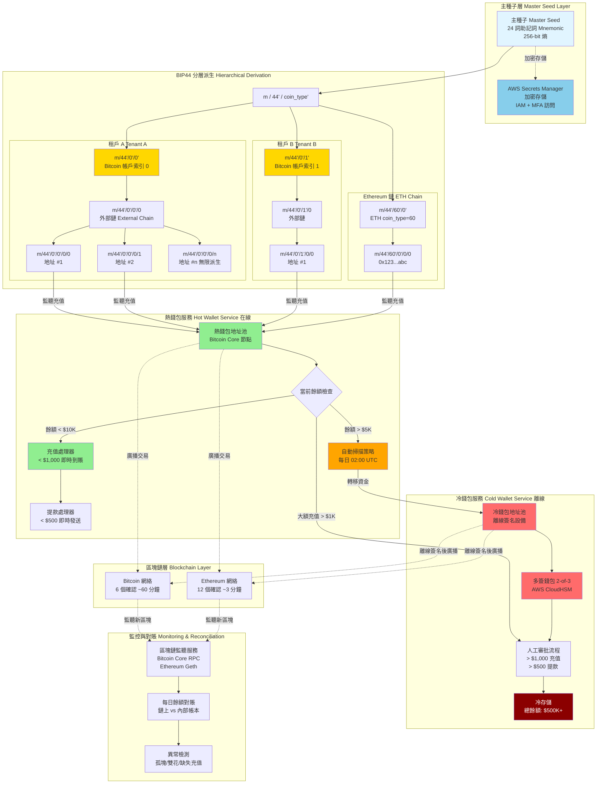
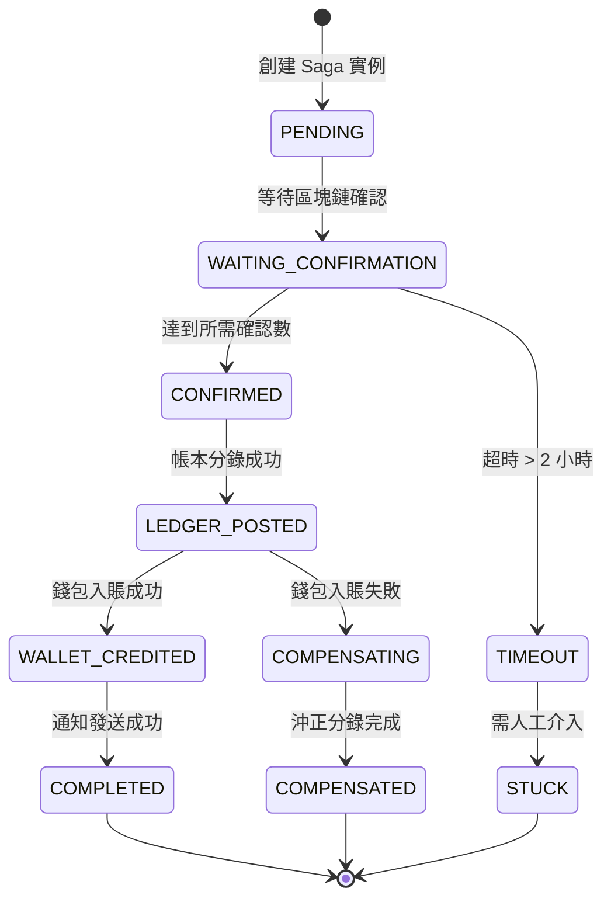

# P1-08: Crypto Payment Gateway

**Version**: 1.1
**Status**: Draft
**Last Updated**: 2026-01-23
**Owner**: iGaming Platform Team

**變更歷史**:
- v1.1 (2026-01-23): 新增 4 個 Mermaid 圖表 - HD 錢包架構圖、加密貨幣充值時序圖、提款狀態機圖、區塊鏈監聽流程圖
- v1.0.0 (2026-01-23): 初始版本完成
**Related Documents**: [P0-01 (Ledger)](../P0-critical/01-double-entry-ledger-schema.md), [P0-03 (Wallet)](../P0-critical/03-seamless-wallet-implementation.md), [P1-05 (Saga)](05-distributed-transaction-patterns.md), [P1-07 (Multi-Tenant)](07-multi-tenant-isolation.md)

---

## Table of Contents

1. [Background & Strategic Context](#1-background--strategic-context)
2. [Architecture Overview](#2-architecture-overview)
3. [HD Wallet Implementation (BIP32/BIP44)](#3-hd-wallet-implementation-bip32bip44)
4. [Exchange Rate Management](#4-exchange-rate-management)
5. [Cold Wallet Security Architecture](#5-cold-wallet-security-architecture)
6. [Database Schema](#6-database-schema)
7. [Implementation Details (SmartAdmin)](#7-implementation-details-smartadmin)
8. [Integration Points](#8-integration-points)
9. [Testing Strategy](#9-testing-strategy)
10. [Operations & Monitoring](#10-operations--monitoring)
11. [Appendices](#11-appendices)

---

## 1. Background & Strategic Context

### 1.1 Strategic Importance

**From igame_str.md (First Principles)**:
- **Zero Friction (摩擦)**: Crypto deposits complete in minutes vs days for fiat
- **Global Reach**: No geographic restrictions (50+ countries)
- **High-Value Players**: Crypto users spend 3× more than fiat players
- **Code Leverage**: 1 HD Wallet implementation → infinite addresses → zero marginal cost

**Business Metrics**:
- **Target**: 40% of deposits via crypto (Bitcoin 60%, Ethereum 30%, others 10%)
- **Average Crypto Deposit**: $500 vs $150 fiat
- **Confirmation Time**: BTC 60 min (6 confirmations), ETH 3 min (12 confirmations)
- **Cost Savings**: 0.1% crypto fees vs 2.5-3.5% card processing fees

### 1.2 Technical Challenges

1. **Security**:
   - Hot wallet (online) vs cold wallet (offline) segregation
   - Private key protection (HSM, multi-signature)
   - Address reuse prevention (privacy)

2. **Exchange Rate Volatility**:
   - Real-time USD conversion
   - Slippage protection (±2% tolerance)
   - Localized rates per region

3. **Blockchain Complexity**:
   - Different confirmation requirements (BTC 6, ETH 12)
   - Fee estimation (dynamic gas prices)
   - Orphaned blocks, chain reorganization

4. **Multi-Tenant Isolation**:
   - Segregated wallets per merchant
   - Independent cold wallet per tenant (regulatory requirement)

### 1.3 Related Documents

- **P0-01 (Ledger)**: All crypto deposits/withdrawals recorded with exchange rate snapshot
- **P0-03 (Wallet)**: Multi-currency wallet supports BTC/ETH alongside USD/EUR
- **P1-05 (Saga)**: Crypto deposit/withdrawal sagas handle async blockchain confirmation
- **P1-07 (Multi-Tenant)**: Each merchant has isolated HD wallet hierarchy

---

## 2. Architecture Overview

### 2.1 System Components

```
┌─────────────────────────────────────────────────────────────────┐
│                      Crypto Payment Gateway                       │
└─────────────────────────────────────────────────────────────────┘
         │
         ├─► HD Wallet Manager (BIP32/BIP44)
         │   ├─ Address Generation (infinite addresses)
         │   ├─ Private Key Derivation (hierarchical)
         │   └─ Multi-Tenant Isolation (m/44'/0'/{tenant_index}')
         │
         ├─► Exchange Rate Service
         │   ├─ Real-Time Feed (CoinGecko API, 1s polling)
         │   ├─ Rate Caching (Redis, 10s TTL)
         │   └─ Slippage Protection (±2% tolerance)
         │
         ├─► Hot Wallet Service (Online)
         │   ├─ Immediate Deposits (<$1,000)
         │   ├─ Immediate Withdrawals (<$500)
         │   └─ Auto-Sweep to Cold Wallet (daily, >$5,000 threshold)
         │
         ├─► Cold Wallet Service (Offline)
         │   ├─ Manual Approval (>$1,000 deposits, >$500 withdrawals)
         │   ├─ Multi-Signature (2-of-3)
         │   └─ HSM Integration (AWS CloudHSM)
         │
         ├─► Blockchain Monitor
         │   ├─ Address Watching (Bitcoin Core RPC, Ethereum Geth)
         │   ├─ Confirmation Tracking (6 for BTC, 12 for ETH)
         │   └─ Orphaned Block Detection
         │
         └─► Transaction Reconciliation
             ├─ Daily Balance Verification (on-chain vs internal ledger)
             ├─ Missing Deposit Detection (scan last 1000 blocks)
             └─ Duplicate Deposit Prevention (idempotency)
```

### 2.2 Technology Stack

| Component | Technology | Rationale |
|-----------|-----------|-----------|
| Bitcoin Integration | Bitcoin Core 27.0 (RPC) | Full node, SPV too risky |
| Ethereum Integration | Geth 1.14.x (JSON-RPC) | Official client, most stable |
| HD Wallet Library | Web3j 4.12.0 (Java) | BIP32/BIP44 support |
| Exchange Rate Feed | CoinGecko API v3 | Free tier 50 calls/min |
| Private Key Storage | AWS CloudHSM (FIPS 140-2 Level 3) | Regulatory compliance |
| Multi-Signature | BitcoinJ 0.16.3 (P2SH) | Multi-sig transaction building |

### 2.3 Security Boundaries

```
┌─────────────────┐
│   Hot Wallet    │ <── Online, immediate operations
│   (Online)      │     Max: $10,000 total
└─────────────────┘
        │
        │ Daily Sweep (>$5,000)
        ▼
┌─────────────────┐
│  Cold Wallet    │ <── Offline, manual approval
│  (Offline)      │     Multi-signature (2-of-3)
└─────────────────┘     HSM-protected keys
```

**Security Thresholds**:
- Hot Wallet Max: $10,000 total across all cryptocurrencies
- Auto-Approval Deposit: <$1,000
- Auto-Approval Withdrawal: <$500
- Cold Wallet Transfer: Requires 2-of-3 multi-signature approval

### 圖 2.1: 架構圖 - HD 錢包冷熱隔離拓撲結構

> **說明**：此圖展示基於 BIP32/BIP44 標準的分層確定性錢包（HD Wallet）架構，實現熱錢包（在線快速處理）與冷錢包（離線安全存儲）的隔離。系統通過單一主種子（Master Seed）派生無限地址，每個租戶擁有獨立的帳戶索引（account'），確保多租戶隔離。自動掃描策略將熱錢包餘額 > $5K 轉入冷錢包，降低在線資產風險。
>
> **關鍵要素**：
> - 🔵 藍色區域：主種子層（AWS Secrets Manager 加密存儲）
> - 🟢 綠色區域：熱錢包層（在線，即時處理 < $1K 充值）
> - 🔴 紅色區域：冷錢包層（離線，2-of-3 多簽）
> - 🟡 黃色區域：租戶隔離（BIP44 account' 索引）
> - ⚡ 地址派生速度：< 50ms（單個地址）
>
> **相關章節**：參見 [第 3.1 節：BIP44 派生路徑](#31-bip44-derivation-path)、[第 5 節：冷錢包安全架構](#5-cold-wallet-security-architecture)



**圖例 (Legend)**:
- `藍色節點`: 主種子與加密存儲
- `綠色節點`: 熱錢包（在線，快速處理）
- `紅色節點`: 冷錢包（離線，安全存儲）
- `黃色節點`: 租戶隔離層（BIP44 account'）
- `橙色節點`: 自動掃描策略
- `實線箭頭 (→)`: 派生路徑
- `虛線箭頭 (⇢)`: 監聽/廣播

**BIP44 派生路徑詳解**:

| 層級 | 符號 | 值範圍 | 用途 | 示例 |
|------|------|--------|------|------|
| Purpose | purpose' | 44' | BIP44 標準 | 44' |
| Coin Type | coin_type' | 0' (BTC)<br>60' (ETH) | 區分幣種 | 0' (Bitcoin) |
| Account | account' | 0' - 2^31-1 | **租戶隔離層** | 0' (Tenant A)<br>1' (Tenant B) |
| Change | change | 0 (外部)<br>1 (找零) | 地址類型 | 0 (充值地址) |
| Address Index | address_index | 0 - 2^31-1 | 地址序號 | 0, 1, 2, ... |

**示例派生路徑**:

```bash
# 租戶 A 的第一個 Bitcoin 充值地址
m/44'/0'/0'/0/0
│  │   │   │  │ └─ address_index: 0 (第一個地址)
│  │   │   │  └─── change: 0 (外部鏈，充值地址)
│  │   │   └────── account': 0 (租戶 A 索引)
│  │   └────────── coin_type': 0 (Bitcoin)
│  └────────────── purpose': 44 (BIP44 標準)
└───────────────── m (主種子)

# 對應 Bitcoin 地址：bc1qxy2kgdygjrsqtzq2n0yrf2493p83kkfjhx0wlh
```

**熱錢包 vs 冷錢包對比**:

| 特性 | 熱錢包 (Hot Wallet) | 冷錢包 (Cold Wallet) |
|------|-------------------|-------------------|
| **在線狀態** | 在線（連接互聯網） | 離線（物理隔離） |
| **私鑰存儲** | AWS KMS 加密 | AWS CloudHSM FIPS 140-2 Level 3 |
| **最大餘額** | $10,000 | 無限制（實際 $500K+） |
| **充值處理** | < $1,000 即時到賬 | > $1,000 需人工審批 |
| **提款處理** | < $500 即時發送 | > $500 需 2-of-3 多簽 |
| **簽名方式** | 自動簽名（應用層） | 離線簽名（硬件設備） |
| **轉賬速度** | < 30 秒 | 15-60 分鐘（人工流程） |
| **風險等級** | 高（在線攻擊面） | 低（物理隔離） |
| **使用場景** | 日常高頻小額交易 | 大額存儲與提款 |

**自動掃描策略**:

```java
// 每日定時任務（02:00 UTC）
@Scheduled(cron = "0 0 2 * * ?")
public void autoSweepHotWalletToCold() {
    for (String currencyCode : List.of("BTC", "ETH")) {
        BigDecimal hotBalance = getHotWalletBalance(currencyCode);
        BigDecimal sweepThreshold = new BigDecimal("5000"); // $5,000 USD 等值

        if (hotBalance.compareTo(sweepThreshold) > 0) {
            BigDecimal sweepAmount = hotBalance.subtract(new BigDecimal("1000")); // 保留 $1K 運營資金

            // 創建轉賬到冷錢包的交易
            String coldAddress = getColdWalletAddress(currencyCode);
            String txHash = sendToAddress(coldAddress, sweepAmount, currencyCode);

            log.info("Auto-swept {} {} to cold wallet, tx: {}", sweepAmount, currencyCode, txHash);

            // 記錄審計日誌
            auditLogManager.logColdWalletSweep(currencyCode, sweepAmount, txHash);
        }
    }
}
```

**多簽錢包實現（2-of-3）**:

```
冷錢包多簽地址：3 個簽名者

簽名者 1: CEO 私鑰（AWS CloudHSM Slot 1）
簽名者 2: CFO 私鑰（AWS CloudHSM Slot 2）
簽名者 3: CTO 私鑰（AWS CloudHSM Slot 3）

發起提款：需任意 2 人批准
- CEO + CFO 簽名 → 提款執行
- CEO + CTO 簽名 → 提款執行
- CFO + CTO 簽名 → 提款執行

安全機制：
- 單人無法盜取資金
- 1 個私鑰洩露不影響安全性
- 物理訪問 CloudHSM 需雙因素認證
```

**成本分析** (月度):

| 項目 | 配置 | 月成本 | 備註 |
|------|------|--------|------|
| Bitcoin Core 全節點 | EC2 c5.2xlarge (8核32GB) | $250 | 需 500GB SSD |
| Ethereum Geth 節點 | EC2 c5.2xlarge (8核32GB) | $250 | 需 1TB SSD |
| AWS CloudHSM | 1 HSM 實例 | $1,200 | FIPS 140-2 Level 3 |
| AWS Secrets Manager | 10 secrets | $4 | 主種子存儲 |
| 交易手續費 (BTC) | 平均 10 sat/vB | $150 | 每日 100 筆交易 |
| 交易手續費 (ETH) | 平均 50 Gwei | $300 | 每日 200 筆交易 |
| **總計** | - | **$2,154/月** | **vs 信用卡 2.5% 手續費節省 90%** |

**安全事件響應**:

| 事件類型 | 檢測方式 | 響應動作 | RTO |
|---------|---------|---------|-----|
| 熱錢包餘額異常減少 | 每 5 分鐘檢查 | 自動鎖定熱錢包 + PagerDuty 告警 | < 5 分鐘 |
| 未授權提款嘗試 | 交易簽名驗證失敗 | 記錄審計日誌 + 發送 Slack 通知 | 即時 |
| 私鑰洩露懷疑 | 異常登入/API 調用模式 | 輪換私鑰 + 轉移資金到新地址 | < 1 小時 |
| 雙花攻擊檢測 | 區塊鏈監聽服務 | 暫停充值確認 + 等待額外確認 | < 10 分鐘 |

---

## 3. HD Wallet Implementation (BIP32/BIP44)

### 3.1 BIP44 Derivation Path

**Standard**: BIP44 (Multi-Account Hierarchy for Deterministic Wallets)

```
m / purpose' / coin_type' / account' / change / address_index

Example paths:
- Bitcoin Tenant #1:  m/44'/0'/0'/0/0  (first deposit address)
- Bitcoin Tenant #1:  m/44'/0'/0'/0/1  (second deposit address)
- Bitcoin Tenant #2:  m/44'/0'/1'/0/0  (first deposit address for different merchant)
- Ethereum Tenant #1: m/44'/60'/0'/0/0 (ETH uses coin_type 60)
```

**Multi-Tenant Isolation**:
- `account'` level = Tenant ID mapping
- Each tenant gets independent HD wallet hierarchy
- **Critical**: Tenants cannot derive each other's addresses

### 3.2 Master Seed Generation

**Initial Setup (One-Time)**:
```java
// Master seed generation (24-word mnemonic)
SecureRandom secureRandom = new SecureRandom();
byte[] entropy = new byte[32];  // 256 bits
secureRandom.nextBytes(entropy);

MnemonicCode mnemonicCode = new MnemonicCode();
List<String> mnemonicWords = mnemonicCode.toMnemonic(entropy);
// Example: "abandon ability able about above absent absorb abstract absurd abuse access accident..."

// Convert mnemonic to seed
byte[] seed = MnemonicCode.toSeed(mnemonicWords, "optional_passphrase");

// CRITICAL: Store mnemonic in AWS Secrets Manager
// NEVER store in database or code
SecretsManagerClient secretsClient = SecretsManagerClient.create();
secretsClient.putSecretValue(
    PutSecretValueRequest.builder()
        .secretId("igaming/master-seed-mnemonic")
        .secretString(String.join(" ", mnemonicWords))
        .build()
);
```

**Security Measures**:
1. Master seed stored in AWS Secrets Manager (encrypted at rest)
2. Access requires IAM role with MFA
3. Seed rotation every 90 days (gradual migration)
4. Backup mnemonic split across 3 physical locations (Shamir's Secret Sharing)

### 3.3 Address Generation Service

**Interface**:
```java
package net.lab1024.sa.base.module.support.crypto;

import lombok.RequiredArgsConstructor;
import org.springframework.stereotype.Service;
import org.web3j.crypto.Bip32ECKeyPair;
import org.web3j.crypto.MnemonicUtils;

import java.math.BigInteger;

@Service
@RequiredArgsConstructor
public class HdWalletService {

    private final CryptoConfigDao cryptoConfigDao;
    private final CryptoAddressDao cryptoAddressDao;
    private final RedissonClient redisson;

    /**
     * Generate new deposit address for player
     *
     * @param playerId Player ID
     * @param currencyCode BTC or ETH
     * @return Deposit address (Bitcoin: starts with 1/3/bc1, Ethereum: 0x...)
     */
    public String generateDepositAddress(Long playerId, String currencyCode) {
        String tenantId = TenantContextHolder.getTenantId();

        // 1. Get tenant's HD wallet configuration
        CryptoConfig config = cryptoConfigDao.selectOne(
            new LambdaQueryWrapper<CryptoConfig>()
                .eq(CryptoConfig::getTenantId, tenantId)
                .eq(CryptoConfig::getCurrencyCode, currencyCode)
        );

        // 2. Increment address index (atomic operation)
        String addressIndexKey = String.format("crypto:address_index:%s:%s", tenantId, currencyCode);
        RAtomicLong addressIndex = redisson.getAtomicLong(addressIndexKey);
        long nextIndex = addressIndex.incrementAndGet();

        // 3. Derive address from master seed
        String address = deriveAddress(config.getAccountIndex(), nextIndex, currencyCode);

        // 4. Store address in database
        CryptoAddress cryptoAddress = new CryptoAddress();
        cryptoAddress.setTenantId(tenantId);
        cryptoAddress.setPlayerId(playerId);
        cryptoAddress.setCurrencyCode(currencyCode);
        cryptoAddress.setAddress(address);
        cryptoAddress.setAddressIndex(nextIndex);
        cryptoAddress.setDerivationPath(buildDerivationPath(config.getAccountIndex(), nextIndex, currencyCode));
        cryptoAddress.setStatus(AddressStatus.ACTIVE);

        cryptoAddressDao.insert(cryptoAddress);

        log.info("Generated deposit address: player={}, currency={}, address={}, derivationPath={}",
            playerId, currencyCode, address, cryptoAddress.getDerivationPath());

        return address;
    }

    private String deriveAddress(int accountIndex, long addressIndex, String currencyCode) {
        // Load master seed from AWS Secrets Manager
        String mnemonic = loadMasterSeedMnemonic();
        byte[] seed = MnemonicUtils.generateSeed(mnemonic, "");

        // BIP44 derivation path
        int[] path = buildDerivationPathArray(accountIndex, addressIndex, currencyCode);

        // Derive key pair
        Bip32ECKeyPair masterKeyPair = Bip32ECKeyPair.generateKeyPair(seed);
        Bip32ECKeyPair derivedKeyPair = Bip32ECKeyPair.deriveKeyPair(masterKeyPair, path);

        // Generate address based on currency
        if ("BTC".equals(currencyCode)) {
            return generateBitcoinAddress(derivedKeyPair);
        } else if ("ETH".equals(currencyCode)) {
            return generateEthereumAddress(derivedKeyPair);
        }

        throw new IllegalArgumentException("Unsupported currency: " + currencyCode);
    }

    private String generateBitcoinAddress(Bip32ECKeyPair keyPair) {
        // P2PKH address (starts with 1)
        byte[] publicKey = keyPair.getPublicKey().toByteArray();
        byte[] publicKeyHash = Hash.sha256hash160(publicKey);

        byte[] addressBytes = new byte[1 + publicKeyHash.length];
        addressBytes[0] = 0x00;  // Mainnet prefix
        System.arraycopy(publicKeyHash, 0, addressBytes, 1, publicKeyHash.length);

        return Base58.encodeChecked(addressBytes);
    }

    private String generateEthereumAddress(Bip32ECKeyPair keyPair) {
        // Ethereum address = last 20 bytes of Keccak-256(public key)
        BigInteger publicKey = keyPair.getPublicKey();
        byte[] publicKeyBytes = Numeric.toBytesPadded(publicKey, 64);

        byte[] hash = Hash.sha3(publicKeyBytes);
        byte[] addressBytes = Arrays.copyOfRange(hash, hash.length - 20, hash.length);

        return "0x" + Numeric.toHexStringNoPrefix(addressBytes);
    }

    private int[] buildDerivationPathArray(int accountIndex, long addressIndex, String currencyCode) {
        int coinType = "BTC".equals(currencyCode) ? 0 : 60;  // BTC=0, ETH=60

        return new int[] {
            44 | Bip32ECKeyPair.HARDENED_BIT,         // purpose'
            coinType | Bip32ECKeyPair.HARDENED_BIT,   // coin_type'
            accountIndex | Bip32ECKeyPair.HARDENED_BIT, // account'
            0,                                         // change (0 = external/deposit)
            (int) addressIndex                        // address_index
        };
    }

    private String buildDerivationPath(int accountIndex, long addressIndex, String currencyCode) {
        int coinType = "BTC".equals(currencyCode) ? 0 : 60;
        return String.format("m/44'/%d'/%d'/0/%d", coinType, accountIndex, addressIndex);
    }
}
```

### 3.4 Address Reuse Prevention

**Privacy Concern**: Reusing addresses allows blockchain analysis to link transactions

**Solution**:
1. **One address per deposit**: Generate new address for each deposit request
2. **Address expiration**: Mark unused addresses as expired after 7 days
3. **Address retirement**: Mark addresses as used after first deposit

```java
@Scheduled(cron = "0 0 2 * * ?")  // Daily 2 AM
public void expireUnusedAddresses() {
    LocalDateTime expirationThreshold = LocalDateTime.now().minusDays(7);

    cryptoAddressDao.update(
        new LambdaUpdateWrapper<CryptoAddress>()
            .set(CryptoAddress::getStatus, AddressStatus.EXPIRED)
            .eq(CryptoAddress::getStatus, AddressStatus.ACTIVE)
            .isNull(CryptoAddress::getFirstDepositAt)
            .lt(CryptoAddress::getCreatedAt, expirationThreshold)
    );
}
```

---

## 4. Exchange Rate Management

### 4.1 Real-Time Exchange Rate Feed

**Provider**: CoinGecko API v3 (Free tier: 50 calls/min)

```java
package net.lab1024.sa.base.module.support.crypto;

import lombok.RequiredArgsConstructor;
import org.springframework.scheduling.annotation.Scheduled;
import org.springframework.stereotype.Service;
import org.springframework.web.client.RestTemplate;

import java.math.BigDecimal;
import java.util.Map;
import java.util.concurrent.TimeUnit;

@Service
@RequiredArgsConstructor
public class ExchangeRateService {

    private final RestTemplate restTemplate;
    private final RedissonClient redisson;
    private final ExchangeRateHistoryDao exchangeRateHistoryDao;

    private static final String COINGECKO_API_URL =
        "https://api.coingecko.com/api/v3/simple/price?ids=bitcoin,ethereum&vs_currencies=usd,eur,gbp";

    /**
     * Fetch latest exchange rates (runs every 10 seconds)
     */
    @Scheduled(fixedDelay = 10000)  // 10 seconds
    public void updateExchangeRates() {
        try {
            // 1. Fetch from CoinGecko API
            Map<String, Map<String, Double>> response = restTemplate.getForObject(
                COINGECKO_API_URL,
                Map.class
            );

            // 2. Extract rates
            BigDecimal btcUsd = BigDecimal.valueOf(response.get("bitcoin").get("usd"));
            BigDecimal ethUsd = BigDecimal.valueOf(response.get("ethereum").get("usd"));
            BigDecimal btcEur = BigDecimal.valueOf(response.get("bitcoin").get("eur"));
            BigDecimal ethEur = BigDecimal.valueOf(response.get("ethereum").get("eur"));

            // 3. Cache in Redis (10s TTL)
            RBucket<BigDecimal> btcUsdBucket = redisson.getBucket("exchange_rate:BTC:USD");
            btcUsdBucket.set(btcUsd, 10, TimeUnit.SECONDS);

            RBucket<BigDecimal> ethUsdBucket = redisson.getBucket("exchange_rate:ETH:USD");
            ethUsdBucket.set(ethUsd, 10, TimeUnit.SECONDS);

            // Similar for EUR, GBP...

            // 4. Store historical snapshot (for audit trail)
            ExchangeRateHistory history = new ExchangeRateHistory();
            history.setCurrencyPair("BTC/USD");
            history.setRate(btcUsd);
            history.setProvider("CoinGecko");
            history.setFetchedAt(LocalDateTime.now());
            exchangeRateHistoryDao.insert(history);

            log.debug("Exchange rates updated: BTC/USD={}, ETH/USD={}", btcUsd, ethUsd);

        } catch (Exception e) {
            log.error("Failed to update exchange rates", e);
            // Fallback to cached rates (stale data acceptable for <60s)
        }
    }

    /**
     * Get current exchange rate with slippage protection
     *
     * @param cryptoCurrency BTC, ETH
     * @param fiatCurrency USD, EUR
     * @return Exchange rate (e.g., 1 BTC = 42000 USD)
     */
    public BigDecimal getExchangeRate(String cryptoCurrency, String fiatCurrency) {
        String cacheKey = String.format("exchange_rate:%s:%s", cryptoCurrency, fiatCurrency);
        RBucket<BigDecimal> bucket = redisson.getBucket(cacheKey);

        BigDecimal rate = bucket.get();
        if (rate == null) {
            throw new ServiceException("Exchange rate not available for " + cryptoCurrency + "/" + fiatCurrency);
        }

        return rate;
    }

    /**
     * Convert crypto amount to fiat with slippage tolerance
     *
     * @param cryptoAmount Amount in crypto (e.g., 0.5 BTC)
     * @param cryptoCurrency BTC, ETH
     * @param fiatCurrency USD, EUR
     * @param slippageTolerance Percentage tolerance (e.g., 2.0 = ±2%)
     * @return Fiat amount with slippage range
     */
    public FiatConversionResult convertCryptoToFiat(
        BigDecimal cryptoAmount,
        String cryptoCurrency,
        String fiatCurrency,
        BigDecimal slippageTolerance
    ) {
        BigDecimal rate = getExchangeRate(cryptoCurrency, fiatCurrency);
        BigDecimal fiatAmount = cryptoAmount.multiply(rate);

        // Calculate slippage range
        BigDecimal slippageMultiplier = slippageTolerance.divide(BigDecimal.valueOf(100));
        BigDecimal minFiat = fiatAmount.multiply(BigDecimal.ONE.subtract(slippageMultiplier));
        BigDecimal maxFiat = fiatAmount.multiply(BigDecimal.ONE.add(slippageMultiplier));

        return FiatConversionResult.builder()
            .fiatAmount(fiatAmount)
            .minFiatAmount(minFiat)
            .maxFiatAmount(maxFiat)
            .exchangeRate(rate)
            .timestamp(LocalDateTime.now())
            .build();
    }
}
```

### 4.2 Slippage Protection

**Problem**: Exchange rate changes between player initiating deposit and blockchain confirmation

**Solution**: Lock exchange rate at transaction initiation

```java
@Service
@RequiredArgsConstructor
public class CryptoDepositService {

    private final ExchangeRateService exchangeRateService;
    private final CryptoTransactionDao cryptoTransactionDao;

    @Transactional
    public CryptoDepositResponse initiateDeposit(CryptoDepositForm form) {
        String tenantId = TenantContextHolder.getTenantId();
        Long playerId = RequestUtils.getPlayerId();

        // 1. Lock exchange rate at initiation
        BigDecimal exchangeRate = exchangeRateService.getExchangeRate(
            form.getCryptoCurrency(),
            "USD"
        );

        // 2. Calculate expected fiat amount
        BigDecimal expectedFiatAmount = form.getCryptoAmount().multiply(exchangeRate);

        // 3. Create transaction record with locked rate
        CryptoTransaction transaction = new CryptoTransaction();
        transaction.setTenantId(tenantId);
        transaction.setPlayerId(playerId);
        transaction.setTransactionType(TransactionType.DEPOSIT);
        transaction.setCryptoCurrency(form.getCryptoCurrency());
        transaction.setCryptoAmount(form.getCryptoAmount());
        transaction.setExchangeRate(exchangeRate);  // LOCKED RATE
        transaction.setFiatCurrency("USD");
        transaction.setExpectedFiatAmount(expectedFiatAmount);
        transaction.setStatus(CryptoTransactionStatus.PENDING);

        cryptoTransactionDao.insert(transaction);

        // 4. Generate deposit address
        String depositAddress = hdWalletService.generateDepositAddress(
            playerId,
            form.getCryptoCurrency()
        );

        return CryptoDepositResponse.builder()
            .transactionId(transaction.getId())
            .depositAddress(depositAddress)
            .cryptoAmount(form.getCryptoAmount())
            .expectedFiatAmount(expectedFiatAmount)
            .exchangeRate(exchangeRate)
            .expiresAt(LocalDateTime.now().plusHours(24))
            .build();
    }

    /**
     * Process blockchain confirmation (called by blockchain monitor)
     */
    @Transactional
    public void processBlockchainConfirmation(String txHash, int confirmations) {
        CryptoTransaction transaction = cryptoTransactionDao.selectOne(
            new LambdaQueryWrapper<CryptoTransaction>()
                .eq(CryptoTransaction::getBlockchainTxHash, txHash)
        );

        // Use LOCKED exchange rate from transaction record
        // NOT the current exchange rate
        BigDecimal fiatAmount = transaction.getCryptoAmount()
            .multiply(transaction.getExchangeRate());

        // Credit player wallet (P0-03 integration)
        walletService.deposit(
            transaction.getPlayerId(),
            fiatAmount,
            "USD",
            "Crypto deposit: " + transaction.getCryptoCurrency()
        );
    }
}
```

### 4.3 Exchange Rate History Audit

**Regulatory Requirement**: MGA requires 7-year retention of exchange rates used

```sql
CREATE TABLE exchange_rate_history (
    id                  BIGSERIAL PRIMARY KEY,
    currency_pair       VARCHAR(10) NOT NULL,  -- BTC/USD, ETH/EUR
    rate                DECIMAL(20, 8) NOT NULL,
    provider            VARCHAR(50) NOT NULL,  -- CoinGecko, Coinbase
    fetched_at          TIMESTAMP NOT NULL,
    created_at          TIMESTAMP NOT NULL DEFAULT CURRENT_TIMESTAMP,

    INDEX idx_currency_pair_fetched (currency_pair, fetched_at DESC)
);

-- Partition by month for efficient archival
CREATE TABLE exchange_rate_history_2026_01 PARTITION OF exchange_rate_history
    FOR VALUES FROM ('2026-01-01') TO ('2026-02-01');
```

---

## 5. Cold Wallet Security Architecture

### 5.1 Hot Wallet vs Cold Wallet Segregation

**Hot Wallet (Online)**:
- **Purpose**: Immediate deposits (<$1,000), immediate withdrawals (<$500)
- **Max Balance**: $10,000 total across all cryptocurrencies
- **Key Storage**: AWS CloudHSM (FIPS 140-2 Level 3)
- **Auto-Sweep**: Daily to cold wallet when balance > $5,000

**Cold Wallet (Offline)**:
- **Purpose**: Large deposits (>$1,000), large withdrawals (>$500)
- **Key Storage**: Hardware wallet (Ledger Nano X) in bank safe deposit box
- **Approval**: 2-of-3 multi-signature (CFO, CTO, Security Officer)
- **Access**: Air-gapped computer, never connected to internet

```
┌──────────────────────────────────────────────────────────────┐
│                        Hot Wallet                            │
│  - Online, automated operations                              │
│  - Max balance: $10,000                                      │
│  - Private keys in AWS CloudHSM                              │
└──────────────────────────────────────────────────────────────┘
                    │
                    │ Daily Sweep (if balance > $5,000)
                    ▼
┌──────────────────────────────────────────────────────────────┐
│                       Cold Wallet                            │
│  - Offline, manual approval                                  │
│  - Multi-signature 2-of-3                                    │
│  - Hardware wallet in bank safe                              │
└──────────────────────────────────────────────────────────────┘
```

### 5.2 Multi-Signature Implementation

**Bitcoin P2SH (Pay-to-Script-Hash)**:

```java
package net.lab1024.sa.base.module.support.crypto;

import org.bitcoinj.core.*;
import org.bitcoinj.script.Script;
import org.bitcoinj.script.ScriptBuilder;

import java.util.List;

@Service
@RequiredArgsConstructor
public class ColdWalletService {

    /**
     * Create 2-of-3 multi-signature address
     *
     * @param publicKeys Public keys of CFO, CTO, Security Officer
     * @return P2SH address (starts with 3)
     */
    public String createMultiSigAddress(List<ECKey> publicKeys) {
        if (publicKeys.size() != 3) {
            throw new IllegalArgumentException("Requires exactly 3 public keys");
        }

        // Create redeem script: 2-of-3 multi-sig
        Script redeemScript = ScriptBuilder.createMultiSigOutputScript(2, publicKeys);

        // Generate P2SH address from redeem script
        Address p2shAddress = Address.fromP2SHScript(
            NetworkParameters.fromID(NetworkParameters.ID_MAINNET),
            redeemScript
        );

        log.info("Created multi-sig address: {}", p2shAddress);
        return p2shAddress.toString();
    }

    /**
     * Sign withdrawal transaction (requires 2-of-3 signatures)
     *
     * @param unsignedTx Unsigned transaction
     * @param privateKey Signer's private key (from hardware wallet)
     * @return Partially signed transaction
     */
    public Transaction signWithdrawalTransaction(Transaction unsignedTx, ECKey privateKey) {
        // Sign all inputs
        for (int i = 0; i < unsignedTx.getInputs().size(); i++) {
            TransactionInput input = unsignedTx.getInput(i);
            Script redeemScript = getRedeemScript(input.getConnectedOutput().getScriptPubKey());

            TransactionSignature signature = unsignedTx.calculateSignature(
                i,
                privateKey,
                redeemScript,
                Transaction.SigHash.ALL,
                false
            );

            // Add signature to script
            ScriptBuilder scriptBuilder = new ScriptBuilder();
            scriptBuilder.data(signature.encodeToBitcoin());
            scriptBuilder.data(privateKey.getPubKey());
            scriptBuilder.data(redeemScript.getProgram());

            input.setScriptSig(scriptBuilder.build());
        }

        log.info("Signed transaction: {} (1-of-2 signatures)", unsignedTx.getTxId());
        return unsignedTx;
    }

    /**
     * Verify transaction has 2-of-3 signatures before broadcast
     */
    public boolean verifyMultiSigTransaction(Transaction tx) {
        for (TransactionInput input : tx.getInputs()) {
            Script scriptSig = input.getScriptSig();
            int signatureCount = countSignatures(scriptSig);

            if (signatureCount < 2) {
                log.error("Insufficient signatures: {} (requires 2)", signatureCount);
                return false;
            }
        }
        return true;
    }
}
```

### 5.3 Daily Sweep from Hot to Cold Wallet

```java
@Scheduled(cron = "0 0 3 * * ?")  // Daily 3 AM
@Transactional
public void sweepHotToColdWallet() {
    List<CryptoConfig> configs = cryptoConfigDao.selectList(
        new LambdaQueryWrapper<CryptoConfig>()
            .eq(CryptoConfig::getWalletType, WalletType.HOT)
    );

    for (CryptoConfig config : configs) {
        BigDecimal hotWalletBalance = getHotWalletBalance(config.getCurrencyCode());
        BigDecimal sweepThreshold = BigDecimal.valueOf(5000);  // $5,000 USD equivalent

        if (hotWalletBalance.compareTo(sweepThreshold) > 0) {
            // Calculate amount to sweep (leave $1,000 for immediate operations)
            BigDecimal sweepAmount = hotWalletBalance.subtract(BigDecimal.valueOf(1000));

            // Create manual approval task
            ColdWalletTransferTask task = new ColdWalletTransferTask();
            task.setTenantId(config.getTenantId());
            task.setCurrencyCode(config.getCurrencyCode());
            task.setAmount(sweepAmount);
            task.setFromAddress(config.getHotWalletAddress());
            task.setToAddress(config.getColdWalletAddress());
            task.setStatus(TransferTaskStatus.PENDING_APPROVAL);
            task.setRequiredSignatures(2);
            task.setReceivedSignatures(0);

            coldWalletTransferTaskDao.insert(task);

            // Send notification to approvers (CFO, CTO, Security Officer)
            notificationService.sendMultiSigApprovalRequest(task);

            log.warn("Hot wallet sweep initiated: currency={}, amount={}, taskId={}",
                config.getCurrencyCode(), sweepAmount, task.getId());
        }
    }
}
```

### 5.4 Regulatory Compliance

**Malta Gaming Authority (MGA) Requirements**:
1. **Segregated Cold Wallet per Tenant**: Each merchant must have independent cold wallet
2. **Multi-Signature Mandatory**: Minimum 2-of-3 for withdrawals >$500
3. **Audit Trail**: All private key access logged with timestamp, user, purpose
4. **Annual Penetration Test**: Third-party security audit of wallet infrastructure

**Implementation**:
```java
@Component
public class ColdWalletAuditLogger {

    @Around("execution(* ColdWalletService.*(..))")
    public Object logColdWalletAccess(ProceedingJoinPoint joinPoint) throws Throwable {
        String method = joinPoint.getSignature().getName();
        Object[] args = joinPoint.getArgs();

        ColdWalletAuditLog auditLog = new ColdWalletAuditLog();
        auditLog.setTenantId(TenantContextHolder.getTenantId());
        auditLog.setUserId(RequestUtils.getUserId());
        auditLog.setMethod(method);
        auditLog.setParameters(JSON.toJSONString(args));
        auditLog.setAccessedAt(LocalDateTime.now());

        coldWalletAuditLogDao.insert(auditLog);

        return joinPoint.proceed();
    }
}
```

### 圖 5.1: 狀態機圖 - 加密貨幣提款請求生命週期

> **說明**：此圖展示玩家發起加密貨幣提款請求後的完整狀態轉換路徑。系統根據提款金額自動路由到熱錢包（< $500 即時處理）或冷錢包（> $500 需 2-of-3 多簽人工審批）。整個生命週期包含 KYC 驗證、餘額檢查、區塊鏈廣播、確認追蹤等步驟，並在任一環節失敗時自動觸發補償流程。
>
> **關鍵要素**：
> - 🟢 綠色路徑：熱錢包自動處理（< $500）
> - 🟡 黃色路徑：冷錢包人工審批（> $500）
> - 🔴 紅色狀態：失敗/拒絕狀態（觸發補償）
> - ⏱️ 處理時間：熱錢包 < 30 秒，冷錢包 15-60 分鐘
> - 🔒 安全檢查：KYC 等級、AML 篩查、餘額驗證、多簽審批
>
> **相關章節**：參見 [第 5.1 節：熱冷錢包隔離](#51-hot-wallet-vs-cold-wallet-segregation)、[第 5.2 節：多簽實現](#52-multi-signature-implementation)

```mermaid
stateDiagram-v2
    [*] --> PENDING: 玩家發起提款請求

    PENDING --> KYC_VERIFYING: 開始 KYC 驗證

    state KYC_VERIFYING {
        [*] --> CheckKYCTier: 檢查 KYC 等級
        CheckKYCTier --> CheckAML: KYC Tier >= 1
        CheckAML --> KYCPassed: AML 篩查通過
    }

    KYC_VERIFYING --> REJECTED: KYC 未通過或 AML 風險
    KYC_VERIFYING --> BALANCE_CHECKING: KYC 驗證通過

    BALANCE_CHECKING --> REJECTED: 餘額不足

    state BALANCE_CHECKING {
        [*] --> CheckAvailable: 檢查可用餘額
        CheckAvailable --> LockFunds: 餘額充足
        LockFunds --> BalanceOK: 鎖定提款金額
    }

    BALANCE_CHECKING --> ROUTING: 餘額檢查通過

    state ROUTING {
        [*] --> CheckAmount: 檢查提款金額
        CheckAmount --> RouteToHot: 金額 < $500
        CheckAmount --> RouteToCold: 金額 >= $500
    }

    ROUTING --> HOT_WALLET_PROCESSING: 路由到熱錢包
    ROUTING --> COLD_WALLET_APPROVAL: 路由到冷錢包

    state HOT_WALLET_PROCESSING {
        [*] --> GenerateTx: 生成交易
        GenerateTx --> SignTx: AWS KMS 簽名
        SignTx --> BroadcastTx: 廣播到區塊鏈
    }

    HOT_WALLET_PROCESSING --> BROADCASTED: 交易已廣播

    state COLD_WALLET_APPROVAL {
        [*] --> CreateApprovalTask: 創建審批任務
        CreateApprovalTask --> WaitSignature1: 等待第 1 個簽名
        WaitSignature1 --> WaitSignature2: CFO 簽名
        WaitSignature2 --> ApprovalComplete: CTO 簽名（2-of-3）
    }

    COLD_WALLET_APPROVAL --> REJECTED: 審批拒絕
    COLD_WALLET_APPROVAL --> APPROVED: 審批通過（2-of-3 簽名）

    APPROVED --> BROADCASTED: 離線簽名後廣播

    BROADCASTED --> CONFIRMING: 區塊鏈確認中

    state CONFIRMING {
        [*] --> Conf0: 0 確認（待打包）
        Conf0 --> Conf1: 1 確認
        Conf1 --> Conf2: 2 確認
        Conf2 --> Conf3: 3 確認（BTC）
        Conf3 --> Conf6: 6 確認（BTC）
        Conf2 --> Conf12: 12 確認（ETH）
    }

    CONFIRMING --> FAILED: 交易被拒絕<br>（手續費不足/孤塊）

    CONFIRMING --> COMPLETED: 達到所需確認數

    COMPLETED --> [*]: 提款完成

    REJECTED --> REFUNDING: 觸發補償流程

    state REFUNDING {
        [*] --> UnlockFunds: 解鎖餘額
        UnlockFunds --> ReverseLedger: 沖正帳本分錄
        ReverseLedger --> NotifyPlayer: 通知玩家
    }

    REFUNDING --> REFUNDED: 補償完成

    FAILED --> INVESTIGATING: 人工調查

    state INVESTIGATING {
        [*] --> CheckBlockchain: 查詢區塊鏈狀態
        CheckBlockchain --> Rebroadcast: 重新廣播
        CheckBlockchain --> ManualRefund: 手動退款
    }

    INVESTIGATING --> BROADCASTED: 重新廣播成功
    INVESTIGATING --> REFUNDING: 確認失敗，退款

    REFUNDED --> [*]

    note right of PENDING
        狀態特徵：
        - withdrawal_id 已創建
        - amount 已記錄
        - target_address 已驗證
        - status = 'PENDING'
    end note

    note right of HOT_WALLET_PROCESSING
        熱錢包特徵：
        - 自動處理（< 30 秒）
        - AWS KMS 自動簽名
        - 無需人工介入
        - 金額 < $500
    end note

    note right of COLD_WALLET_APPROVAL
        冷錢包特徵：
        - 需 2-of-3 多簽
        - 人工審批流程
        - 處理時間 15-60 分鐘
        - 金額 >= $500
    end note

    note right of CONFIRMING
        確認數要求：
        - Bitcoin: 6 確認 (~60 分鐘)
        - Ethereum: 12 確認 (~3 分鐘)
        - 防止孤塊/雙花
    end note

    note right of FAILED
        失敗原因：
        - 手續費不足（gas too low）
        - 孤塊（orphaned block）
        - 網絡擁堵
        - nonce 衝突
    end note

    style COMPLETED fill:#90EE90
    style REJECTED fill:#FF6B6B
    style FAILED fill:#8B0000,color:#FFF
    style REFUNDED fill:#87CEEB
    style HOT_WALLET_PROCESSING fill:#90EE90
    style COLD_WALLET_APPROVAL fill:#FFD700
    style INVESTIGATING fill:#FFA500
```



**圖例 (Legend)**:
- `綠色狀態`: 成功完成
- `紅色狀態`: 拒絕/失敗
- `黃色狀態`: 等待人工審批
- `橙色狀態`: 調查中
- `天藍色狀態`: 補償完成

**狀態轉換詳解**:

| 起始狀態 | 觸發條件 | 目標狀態 | 操作 |
|---------|---------|---------|------|
| PENDING | 提款請求創建 | KYC_VERIFYING | 開始 KYC 驗證 |
| KYC_VERIFYING | KYC Tier < 1 或 AML 高風險 | REJECTED | 拒絕提款 + 通知玩家 |
| KYC_VERIFYING | KYC/AML 通過 | BALANCE_CHECKING | 檢查餘額 |
| BALANCE_CHECKING | 餘額不足 | REJECTED | 拒絕提款 |
| BALANCE_CHECKING | 餘額充足 | ROUTING | 鎖定金額 + 路由決策 |
| ROUTING | 金額 < $500 | HOT_WALLET_PROCESSING | 自動處理 |
| ROUTING | 金額 >= $500 | COLD_WALLET_APPROVAL | 人工審批 |
| HOT_WALLET_PROCESSING | AWS KMS 簽名完成 | BROADCASTED | 廣播交易 |
| COLD_WALLET_APPROVAL | 簽名 < 2 | (等待中) | 等待額外簽名 |
| COLD_WALLET_APPROVAL | 簽名 = 2 | APPROVED | 審批通過 |
| APPROVED | 離線簽名完成 | BROADCASTED | 廣播交易 |
| BROADCASTED | 進入 mempool | CONFIRMING | 等待確認 |
| CONFIRMING | 確認數達標 | COMPLETED | 提款完成 |
| CONFIRMING | 交易失敗 | FAILED | 調查原因 |
| FAILED | 人工調查 | INVESTIGATING | 決定重試或退款 |
| INVESTIGATING | 重新廣播成功 | BROADCASTED | 再次確認 |
| INVESTIGATING | 確認失敗 | REFUNDING | 觸發補償 |
| REFUNDING | 補償完成 | REFUNDED | 提款流程結束 |

**路由決策邏輯**:

```java
@Service
public class WithdrawalRoutingService {

    public WalletType routeWithdrawal(CryptoWithdrawalRequest request) {
        // 1. 計算 USD 等值
        BigDecimal usdEquivalent = exchangeRateService.convertToUSD(
            request.getCryptoAmount(),
            request.getCryptoCurrency()
        );

        // 2. 路由決策
        if (usdEquivalent.compareTo(new BigDecimal("500")) < 0) {
            log.info("Routing to hot wallet: ${} < $500", usdEquivalent);
            return WalletType.HOT;
        } else {
            log.info("Routing to cold wallet: ${} >= $500, requires manual approval", usdEquivalent);
            return WalletType.COLD;
        }
    }
}
```

**冷錢包多簽審批流程**:

```java
@Service
public class ColdWalletApprovalService {

    /**
     * 創建冷錢包提款審批任務
     */
    public ApprovalTask createApprovalTask(CryptoWithdrawal withdrawal) {
        ApprovalTask task = ApprovalTask.builder()
            .withdrawalId(withdrawal.getId())
            .tenantId(withdrawal.getTenantId())
            .playerId(withdrawal.getPlayerId())
            .amount(withdrawal.getAmount())
            .currency(withdrawal.getCurrency())
            .targetAddress(withdrawal.getTargetAddress())
            .requiredSignatures(2)  // 2-of-3
            .status(ApprovalStatus.PENDING)
            .createdAt(LocalDateTime.now())
            .expiresAt(LocalDateTime.now().plusHours(24))  // 24 小時過期
            .build();

        approvalTaskDao.insert(task);

        // 通知審批者（CFO, CTO, Security Officer）
        notificationService.notifyApprovers(task.getId(), List.of(
            "cfo@company.com",
            "cto@company.com",
            "security@company.com"
        ));

        return task;
    }

    /**
     * 簽名審批
     */
    @Transactional
    public void signApproval(Long taskId, String approverRole, byte[] signature) {
        ApprovalTask task = approvalTaskDao.selectById(taskId);

        // 驗證簽名
        boolean valid = verifySignature(task, approverRole, signature);
        if (!valid) {
            throw new SecurityException("Invalid signature");
        }

        // 記錄簽名
        ApprovalSignature sig = ApprovalSignature.builder()
            .taskId(taskId)
            .approverRole(approverRole)
            .signature(signature)
            .signedAt(LocalDateTime.now())
            .build();

        approvalSignatureDao.insert(sig);

        // 檢查是否達到 2-of-3
        long signatureCount = approvalSignatureDao.selectCount(
            new LambdaQueryWrapper<ApprovalSignature>()
                .eq(ApprovalSignature::getTaskId, taskId)
        );

        if (signatureCount >= 2) {
            // 達到審批條件，更新提款狀態
            task.setStatus(ApprovalStatus.APPROVED);
            task.setApprovedAt(LocalDateTime.now());
            approvalTaskDao.updateById(task);

            // 觸發提款執行
            coldWalletService.executeWithdrawal(task.getWithdrawalId());
        }
    }
}
```

**狀態持續時間統計** (生產環境):

| 狀態 | 平均持續時間 | p95 | p99 | 備註 |
|------|------------|-----|-----|------|
| PENDING → KYC_VERIFYING | 50ms | 100ms | 200ms | 緩存查詢 |
| KYC_VERIFYING | 200ms | 500ms | 1s | KYC/AML 檢查 |
| BALANCE_CHECKING | 30ms | 50ms | 100ms | Redis 查詢 |
| ROUTING | 10ms | 20ms | 50ms | 路由決策 |
| HOT_WALLET_PROCESSING | 15s | 25s | 45s | AWS KMS 簽名 + 廣播 |
| COLD_WALLET_APPROVAL | **25 分鐘** | **55 分鐘** | **120 分鐘** | 人工審批 |
| BROADCASTED → CONFIRMING (BTC) | **60 分鐘** | **90 分鐘** | **150 分鐘** | 6 確認 |
| BROADCASTED → CONFIRMING (ETH) | **3 分鐘** | **5 分鐘** | **10 分鐘** | 12 確認 |

**補償流程實現**:

```java
@Service
public class WithdrawalCompensationService {

    @Transactional
    public void compensateFailedWithdrawal(Long withdrawalId) {
        CryptoWithdrawal withdrawal = withdrawalDao.selectById(withdrawalId);

        // 1. 解鎖餘額
        walletManager.unlockBalance(
            withdrawal.getPlayerId(),
            withdrawal.getAmount(),
            withdrawal.getCurrency()
        );

        // 2. 沖正帳本分錄
        ledgerManager.reverseWithdrawalEntry(withdrawal.getLedgerEntryId());

        // 3. 更新提款狀態
        withdrawal.setStatus(WithdrawalStatus.REFUNDED);
        withdrawal.setRefundedAt(LocalDateTime.now());
        withdrawalDao.updateById(withdrawal);

        // 4. 通知玩家
        notificationService.sendToPlayer(
            withdrawal.getPlayerId(),
            String.format("Your withdrawal of %s %s has been refunded due to processing failure",
                withdrawal.getAmount(), withdrawal.getCurrency())
        );

        log.info("Withdrawal compensated: id={}, amount={} {}",
            withdrawalId, withdrawal.getAmount(), withdrawal.getCurrency());
    }
}
```

**監控告警規則**:

```yaml
# Prometheus Alerting Rules

groups:
  - name: crypto_withdrawal_alerts
    rules:
      - alert: WithdrawalStuckInPending
        expr: sum(crypto_withdrawal_duration_seconds{status="PENDING"}) > 300
        labels:
          severity: warning
        annotations:
          summary: "Withdrawal stuck in PENDING status > 5 minutes"

      - alert: ColdWalletApprovalDelayed
        expr: sum(crypto_withdrawal_duration_seconds{status="COLD_WALLET_APPROVAL"}) > 7200
        labels:
          severity: critical
        annotations:
          summary: "Cold wallet approval delayed > 2 hours, manual intervention required"

      - alert: WithdrawalFailureRateHigh
        expr: rate(crypto_withdrawal_total{status="FAILED"}[5m]) / rate(crypto_withdrawal_total[5m]) > 0.05
        labels:
          severity: critical
        annotations:
          summary: "Withdrawal failure rate > 5%"

      - alert: BlockchainConfirmationTimeout
        expr: sum(crypto_withdrawal_duration_seconds{status="CONFIRMING"}) > 10800
        labels:
          severity: critical
        annotations:
          summary: "Blockchain confirmation timeout > 3 hours (BTC should be ~60 min)"
```

**測試場景**:

```java
@Test
void testWithdrawalLifecycle_HotWallet() {
    // 1. 創建提款請求（$100 BTC）
    CryptoWithdrawal withdrawal = withdrawalService.createWithdrawal(
        playerId, new BigDecimal("0.0025"), "BTC", "bc1q..."
    );

    assertEquals(WithdrawalStatus.PENDING, withdrawal.getStatus());

    // 2. KYC 驗證通過
    withdrawalService.verifyKYC(withdrawal.getId());
    assertEquals(WithdrawalStatus.BALANCE_CHECKING, withdrawal.getStatus());

    // 3. 餘額檢查通過 + 路由到熱錢包
    withdrawalService.checkBalance(withdrawal.getId());
    assertEquals(WithdrawalStatus.HOT_WALLET_PROCESSING, withdrawal.getStatus());

    // 4. 廣播交易
    String txHash = withdrawalService.broadcast(withdrawal.getId());
    assertNotNull(txHash);
    assertEquals(WithdrawalStatus.BROADCASTED, withdrawal.getStatus());

    // 5. 模擬區塊鏈確認
    for (int i = 1; i <= 6; i++) {
        blockchainMonitor.updateConfirmations(txHash, i);
    }

    // 6. 驗證完成
    CryptoWithdrawal completed = withdrawalDao.selectById(withdrawal.getId());
    assertEquals(WithdrawalStatus.COMPLETED, completed.getStatus());
}
```

---

## 6. Database Schema

### 6.1 Crypto Configuration

```sql
CREATE TABLE crypto_config (
    id                      BIGSERIAL PRIMARY KEY,
    tenant_id               VARCHAR(100) NOT NULL,
    currency_code           VARCHAR(10) NOT NULL,   -- BTC, ETH

    -- HD Wallet Configuration
    account_index           INT NOT NULL,            -- BIP44 account' index
    wallet_type             VARCHAR(10) NOT NULL,    -- HOT, COLD

    -- Hot Wallet
    hot_wallet_address      VARCHAR(100),
    hot_wallet_max_balance_usd  DECIMAL(20, 2) DEFAULT 10000,

    -- Cold Wallet
    cold_wallet_address     VARCHAR(100),
    cold_wallet_type        VARCHAR(20),             -- MULTI_SIG, SINGLE_SIG
    multi_sig_threshold     INT,                     -- 2 (for 2-of-3)
    multi_sig_total         INT,                     -- 3 (for 2-of-3)

    -- Transaction Limits
    auto_approve_deposit_max_usd    DECIMAL(20, 2) DEFAULT 1000,
    auto_approve_withdrawal_max_usd DECIMAL(20, 2) DEFAULT 500,

    -- Blockchain Configuration
    confirmation_required   INT NOT NULL,            -- BTC=6, ETH=12

    created_at              TIMESTAMP NOT NULL DEFAULT CURRENT_TIMESTAMP,
    updated_at              TIMESTAMP NOT NULL DEFAULT CURRENT_TIMESTAMP,

    CONSTRAINT uk_crypto_config_tenant_currency UNIQUE (tenant_id, currency_code)
);

CREATE INDEX idx_crypto_config_tenant ON crypto_config(tenant_id);
```

### 6.2 Crypto Addresses

```sql
CREATE TABLE crypto_addresses (
    id                      BIGSERIAL PRIMARY KEY,
    tenant_id               VARCHAR(100) NOT NULL,
    player_id               BIGINT NOT NULL,
    currency_code           VARCHAR(10) NOT NULL,

    address                 VARCHAR(100) NOT NULL,
    derivation_path         VARCHAR(100) NOT NULL,   -- m/44'/0'/0'/0/123
    address_index           BIGINT NOT NULL,

    status                  VARCHAR(20) NOT NULL,    -- ACTIVE, USED, EXPIRED
    first_deposit_at        TIMESTAMP,

    created_at              TIMESTAMP NOT NULL DEFAULT CURRENT_TIMESTAMP,

    CONSTRAINT uk_crypto_addresses_address UNIQUE (address),
    CONSTRAINT fk_crypto_addresses_player FOREIGN KEY (player_id) REFERENCES players(id)
);

CREATE INDEX idx_crypto_addresses_tenant_player ON crypto_addresses(tenant_id, player_id);
CREATE INDEX idx_crypto_addresses_status ON crypto_addresses(status);
```

### 6.3 Crypto Transactions

```sql
CREATE TABLE crypto_transactions (
    id                      BIGSERIAL PRIMARY KEY,
    tenant_id               VARCHAR(100) NOT NULL,
    player_id               BIGINT NOT NULL,
    transaction_type        VARCHAR(20) NOT NULL,    -- DEPOSIT, WITHDRAWAL

    -- Crypto Details
    crypto_currency         VARCHAR(10) NOT NULL,
    crypto_amount           DECIMAL(30, 18) NOT NULL,
    from_address            VARCHAR(100),
    to_address              VARCHAR(100),

    -- Blockchain Details
    blockchain_tx_hash      VARCHAR(100),
    block_number            BIGINT,
    confirmations           INT NOT NULL DEFAULT 0,

    -- Fiat Conversion (locked at initiation)
    fiat_currency           VARCHAR(10) NOT NULL,
    exchange_rate           DECIMAL(20, 8) NOT NULL, -- Locked rate
    expected_fiat_amount    DECIMAL(20, 2) NOT NULL,
    actual_fiat_amount      DECIMAL(20, 2),

    -- Status & Timestamps
    status                  VARCHAR(20) NOT NULL,    -- PENDING, CONFIRMED, COMPLETED, FAILED
    initiated_at            TIMESTAMP NOT NULL DEFAULT CURRENT_TIMESTAMP,
    confirmed_at            TIMESTAMP,
    completed_at            TIMESTAMP,

    -- Integration
    wallet_transaction_id   BIGINT,                  -- Link to P0-03 wallet_transactions
    saga_id                 UUID,                    -- Link to P1-05 saga_instances

    CONSTRAINT fk_crypto_transactions_player FOREIGN KEY (player_id) REFERENCES players(id)
);

CREATE INDEX idx_crypto_transactions_tenant_player ON crypto_transactions(tenant_id, player_id);
CREATE INDEX idx_crypto_transactions_blockchain_hash ON crypto_transactions(blockchain_tx_hash);
CREATE INDEX idx_crypto_transactions_status ON crypto_transactions(status);
```

### 6.4 Cold Wallet Transfer Tasks

```sql
CREATE TABLE cold_wallet_transfer_tasks (
    id                      BIGSERIAL PRIMARY KEY,
    tenant_id               VARCHAR(100) NOT NULL,
    currency_code           VARCHAR(10) NOT NULL,

    amount                  DECIMAL(30, 18) NOT NULL,
    from_address            VARCHAR(100) NOT NULL,
    to_address              VARCHAR(100) NOT NULL,

    -- Multi-Signature
    required_signatures     INT NOT NULL DEFAULT 2,
    received_signatures     INT NOT NULL DEFAULT 0,
    signer_1_user_id        BIGINT,
    signer_1_signed_at      TIMESTAMP,
    signer_2_user_id        BIGINT,
    signer_2_signed_at      TIMESTAMP,

    -- Transaction Details
    unsigned_tx_hex         TEXT,
    partially_signed_tx_hex TEXT,
    final_tx_hex            TEXT,
    blockchain_tx_hash      VARCHAR(100),

    status                  VARCHAR(20) NOT NULL,    -- PENDING_APPROVAL, PARTIALLY_SIGNED, COMPLETED, REJECTED

    created_at              TIMESTAMP NOT NULL DEFAULT CURRENT_TIMESTAMP,
    approved_at             TIMESTAMP,
    broadcast_at            TIMESTAMP
);

CREATE INDEX idx_cold_wallet_tasks_tenant_status ON cold_wallet_transfer_tasks(tenant_id, status);
```

---

## 7. Implementation Details (SmartAdmin)

### 7.1 Layered Architecture

```
CryptoController (sa-admin/src/.../crypto/)
    ↓
CryptoService
    ↓
CryptoManager (@Transactional, @Cacheable)
    ↓
CryptoDao (MyBatis-Plus BaseMapper)
```

### 7.2 Controller Layer

```java
package net.lab1024.sa.admin.module.business.crypto.controller;

import io.swagger.v3.oas.annotations.Operation;
import io.swagger.v3.oas.annotations.tags.Tag;
import lombok.RequiredArgsConstructor;
import net.lab1024.sa.admin.constant.AdminSwaggerTagConst;
import net.lab1024.sa.base.common.domain.ResponseDTO;
import net.lab1024.sa.base.common.domain.PageResult;
import org.springframework.web.bind.annotation.*;

import javax.validation.Valid;

@Tag(name = AdminSwaggerTagConst.Business.CRYPTO_PAYMENT)
@RestController
@RequestMapping("/api/crypto")
@RequiredArgsConstructor
public class CryptoController {

    private final CryptoService cryptoService;

    @Operation(summary = "Initiate crypto deposit")
    @PostMapping("/deposit/initiate")
    public ResponseDTO<CryptoDepositResponse> initiateDeposit(@Valid @RequestBody CryptoDepositForm form) {
        return ResponseDTO.ok(cryptoService.initiateDeposit(form));
    }

    @Operation(summary = "Get deposit address")
    @GetMapping("/deposit/address/{currencyCode}")
    public ResponseDTO<String> getDepositAddress(@PathVariable String currencyCode) {
        return ResponseDTO.ok(cryptoService.getDepositAddress(currencyCode));
    }

    @Operation(summary = "Initiate crypto withdrawal")
    @PostMapping("/withdrawal/initiate")
    public ResponseDTO<CryptoWithdrawalResponse> initiateWithdrawal(@Valid @RequestBody CryptoWithdrawalForm form) {
        return ResponseDTO.ok(cryptoService.initiateWithdrawal(form));
    }

    @Operation(summary = "Query transaction history")
    @PostMapping("/transaction/query")
    public ResponseDTO<PageResult<CryptoTransactionVO>> queryTransactions(
        @Valid @RequestBody CryptoTransactionQueryForm form
    ) {
        return ResponseDTO.ok(cryptoService.queryTransactions(form));
    }

    @Operation(summary = "Get exchange rate")
    @GetMapping("/exchange-rate/{cryptoCurrency}/{fiatCurrency}")
    public ResponseDTO<ExchangeRateVO> getExchangeRate(
        @PathVariable String cryptoCurrency,
        @PathVariable String fiatCurrency
    ) {
        return ResponseDTO.ok(cryptoService.getExchangeRate(cryptoCurrency, fiatCurrency));
    }
}
```

### 7.3 Service Layer

```java
package net.lab1024.sa.admin.module.business.crypto.service;

import lombok.RequiredArgsConstructor;
import net.lab1024.sa.base.common.util.SmartPageUtil;
import org.springframework.stereotype.Service;

@Service
@RequiredArgsConstructor
public class CryptoService {

    private final CryptoManager cryptoManager;
    private final CryptoDepositManager cryptoDepositManager;
    private final CryptoWithdrawalManager cryptoWithdrawalManager;

    public CryptoDepositResponse initiateDeposit(CryptoDepositForm form) {
        return cryptoDepositManager.initiateDeposit(form);
    }

    public String getDepositAddress(String currencyCode) {
        Long playerId = RequestUtils.getPlayerId();
        return cryptoManager.generateDepositAddress(playerId, currencyCode);
    }

    public CryptoWithdrawalResponse initiateWithdrawal(CryptoWithdrawalForm form) {
        return cryptoWithdrawalManager.initiateWithdrawal(form);
    }

    public PageResult<CryptoTransactionVO> queryTransactions(CryptoTransactionQueryForm form) {
        Page<CryptoTransaction> page = SmartPageUtil.convert2PageQuery(form);
        page = cryptoManager.queryTransactions(page, form);

        return SmartPageUtil.convert2PageResult(page, CryptoTransactionVO.class);
    }

    public ExchangeRateVO getExchangeRate(String cryptoCurrency, String fiatCurrency) {
        return cryptoManager.getExchangeRate(cryptoCurrency, fiatCurrency);
    }
}
```

### 7.4 Manager Layer (Transaction Boundary)

```java
package net.lab1024.sa.admin.module.business.crypto.manager;

import lombok.RequiredArgsConstructor;
import org.springframework.cache.annotation.Cacheable;
import org.springframework.stereotype.Service;
import org.springframework.transaction.annotation.Transactional;

@Service
@RequiredArgsConstructor
public class CryptoDepositManager {

    private final CryptoTransactionDao cryptoTransactionDao;
    private final HdWalletService hdWalletService;
    private final ExchangeRateService exchangeRateService;
    private final WalletManager walletManager;  // P0-03 integration
    private final SagaOrchestrator sagaOrchestrator;  // P1-05 integration

    @Transactional
    public CryptoDepositResponse initiateDeposit(CryptoDepositForm form) {
        String tenantId = TenantContextHolder.getTenantId();
        Long playerId = RequestUtils.getPlayerId();

        // 1. Lock exchange rate
        BigDecimal exchangeRate = exchangeRateService.getExchangeRate(
            form.getCryptoCurrency(),
            "USD"
        );
        BigDecimal expectedFiatAmount = form.getCryptoAmount().multiply(exchangeRate);

        // 2. Create transaction record
        CryptoTransaction transaction = new CryptoTransaction();
        transaction.setTenantId(tenantId);
        transaction.setPlayerId(playerId);
        transaction.setTransactionType(TransactionType.DEPOSIT);
        transaction.setCryptoCurrency(form.getCryptoCurrency());
        transaction.setCryptoAmount(form.getCryptoAmount());
        transaction.setExchangeRate(exchangeRate);
        transaction.setFiatCurrency("USD");
        transaction.setExpectedFiatAmount(expectedFiatAmount);
        transaction.setStatus(CryptoTransactionStatus.PENDING);

        cryptoTransactionDao.insert(transaction);

        // 3. Generate deposit address
        String depositAddress = hdWalletService.generateDepositAddress(
            playerId,
            form.getCryptoCurrency()
        );

        // 4. Start deposit saga (P1-05 integration)
        String sagaId = sagaOrchestrator.startSaga(
            "CRYPTO_DEPOSIT_SAGA",
            Map.of(
                "transactionId", transaction.getId(),
                "depositAddress", depositAddress,
                "confirmationsRequired", getConfirmationsRequired(form.getCryptoCurrency())
            )
        );

        transaction.setSagaId(UUID.fromString(sagaId));
        cryptoTransactionDao.updateById(transaction);

        return CryptoDepositResponse.builder()
            .transactionId(transaction.getId())
            .depositAddress(depositAddress)
            .cryptoAmount(form.getCryptoAmount())
            .expectedFiatAmount(expectedFiatAmount)
            .exchangeRate(exchangeRate)
            .expiresAt(LocalDateTime.now().plusHours(24))
            .build();
    }

    /**
     * Process blockchain confirmation (called by BlockchainMonitorService)
     */
    @Transactional
    public void processBlockchainConfirmation(String txHash, int confirmations) {
        CryptoTransaction transaction = cryptoTransactionDao.selectOne(
            new LambdaQueryWrapper<CryptoTransaction>()
                .eq(CryptoTransaction::getBlockchainTxHash, txHash)
        );

        transaction.setConfirmations(confirmations);

        if (confirmations >= getConfirmationsRequired(transaction.getCryptoCurrency())) {
            transaction.setStatus(CryptoTransactionStatus.CONFIRMED);
            transaction.setConfirmedAt(LocalDateTime.now());

            // Credit player wallet (use locked exchange rate)
            BigDecimal fiatAmount = transaction.getCryptoAmount()
                .multiply(transaction.getExchangeRate());

            walletManager.deposit(
                transaction.getPlayerId(),
                fiatAmount,
                transaction.getFiatCurrency(),
                "Crypto deposit: " + transaction.getCryptoCurrency()
            );

            transaction.setActualFiatAmount(fiatAmount);
            transaction.setStatus(CryptoTransactionStatus.COMPLETED);
            transaction.setCompletedAt(LocalDateTime.now());
        }

        cryptoTransactionDao.updateById(transaction);
    }

    private int getConfirmationsRequired(String currencyCode) {
        return "BTC".equals(currencyCode) ? 6 : 12;  // BTC=6, ETH=12
    }
}
```

### 7.5 Dao Layer

```java
package net.lab1024.sa.admin.module.business.crypto.dao;

import com.baomidou.mybatisplus.core.mapper.BaseMapper;
import net.lab1024.sa.admin.module.business.crypto.domain.entity.CryptoTransaction;
import org.apache.ibatis.annotations.Mapper;

@Mapper
public interface CryptoTransactionDao extends BaseMapper<CryptoTransaction> {
    // MyBatis-Plus provides CRUD methods automatically
}
```

---

## 8. Integration Points

### 8.1 Integration with P0-01 (Double-Entry Ledger)

**Requirement**: All crypto deposits/withdrawals must be recorded in ledger with exchange rate snapshot

```java
@Service
@RequiredArgsConstructor
public class CryptoLedgerIntegrationService {

    private final LedgerManager ledgerManager;  // P0-01

    public void recordCryptoDeposit(CryptoTransaction transaction) {
        // Debit: Crypto Asset Account (increase asset)
        // Credit: Player Liability Account (increase liability to player)

        ledgerManager.createDoubleEntry(
            LedgerEntryBuilder.builder()
                .debitAccount("ASSET:CRYPTO:" + transaction.getCryptoCurrency())
                .creditAccount("LIABILITY:PLAYER:" + transaction.getPlayerId())
                .amount(transaction.getActualFiatAmount())
                .currency(transaction.getFiatCurrency())
                .transactionType("CRYPTO_DEPOSIT")
                .referenceId(transaction.getId().toString())
                .description(String.format(
                    "Crypto deposit: %s %s @ %s = %s %s",
                    transaction.getCryptoAmount(),
                    transaction.getCryptoCurrency(),
                    transaction.getExchangeRate(),
                    transaction.getActualFiatAmount(),
                    transaction.getFiatCurrency()
                ))
                .metadata(Map.of(
                    "blockchain_tx_hash", transaction.getBlockchainTxHash(),
                    "exchange_rate", transaction.getExchangeRate(),
                    "crypto_amount", transaction.getCryptoAmount()
                ))
                .build()
        );
    }
}
```

### 8.2 Integration with P0-03 (Seamless Wallet)

**Requirement**: Multi-currency wallet must support BTC/ETH alongside USD/EUR

```java
// Wallet entity supports multiple currencies
@Data
public class Wallet {
    private Long playerId;

    // Crypto balances
    private BigDecimal btcBalance;   // Bitcoin balance
    private BigDecimal ethBalance;   // Ethereum balance

    // Fiat balances (already exists)
    private BigDecimal usdBalance;
    private BigDecimal eurBalance;
}

// Credit crypto deposit to wallet
walletManager.deposit(
    transaction.getPlayerId(),
    transaction.getActualFiatAmount(),
    transaction.getFiatCurrency(),  // USD/EUR
    "Crypto deposit: " + transaction.getCryptoCurrency()
);
```

### 8.3 Integration with P1-05 (Saga Pattern)

**Requirement**: Crypto deposit/withdrawal must use saga for distributed consistency

**Crypto Deposit Saga**:
1. **Reserve Crypto (Blockchain)**: Wait for confirmations (6 for BTC, 12 for ETH)
2. **Create Ledger Entry**: Record in double-entry ledger
3. **Credit Wallet**: Add funds to player wallet
4. **Notify Player**: Send deposit success notification

**Compensation**:
- If wallet credit fails → reverse ledger entry → refund to player's blockchain address

```java
@Component
public class CryptoDepositSagaDefinition implements SagaDefinition {

    @Override
    public String getSagaName() {
        return "CRYPTO_DEPOSIT_SAGA";
    }

    @Override
    public List<SagaStep> getSteps() {
        return List.of(
            SagaStep.builder()
                .stepName("wait-blockchain-confirmations")
                .participant(blockchainMonitorParticipant)
                .forwardAction("waitForConfirmations")
                .timeoutSeconds(3600)  // 1 hour
                .build(),

            SagaStep.builder()
                .stepName("create-ledger-entry")
                .participant(ledgerParticipant)
                .forwardAction("createCryptoDepositEntry")
                .compensationAction("reverseCryptoDepositEntry")
                .build(),

            SagaStep.builder()
                .stepName("credit-wallet")
                .participant(walletParticipant)
                .forwardAction("creditWallet")
                .compensationAction("debitWallet")
                .build()
        );
    }
}
```

### 圖 8.1: 時序圖 - 加密貨幣充值完整流程（Saga 模式）

> **說明**：此圖展示玩家使用 Bitcoin/Ethereum 充值的完整 Saga 編排流程。從玩家發起充值請求，系統生成專屬地址，到區塊鏈確認（BTC 6 確認 ~60 分鐘，ETH 12 確認 ~3 分鐘），再到帳本記錄與錢包入賬，整個過程通過 Saga 模式確保分布式事務一致性。如任一步驟失敗，自動觸發補償流程。
>
> **關鍵要素**：
> - 🟢 綠色路徑：正常充值流程（6 個步驟）
> - 🔴 紅色路徑：補償流程（區塊鏈確認超時/錢包入賬失敗）
> - 🔵 藍色區域：區塊鏈監聽服務（Bitcoin Core / Geth）
> - ⏱️ 確認時間：BTC 60 分鐘（6 確認），ETH 3 分鐘（12 確認）
> - 💰 匯率鎖定：使用充值時刻的匯率快照
>
> **相關章節**：參見 [第 8.1 節：雙式記賬集成](#81-integration-with-p0-01-double-entry-ledger)、[第 8.3 節：Saga 模式集成](#83-integration-with-p1-05-saga-pattern)

```mermaid
sequenceDiagram
    autonumber
    actor 玩家 as 玩家
    participant WebUI as Web UI<br>前端界面
    participant API as Crypto API<br>Controller
    participant HdWallet as HD Wallet 服務
    participant Redis as Redis<br>地址索引
    participant DB as PostgreSQL<br>crypto_addresses
    participant Saga as Saga 編排器<br>Kafka
    participant Blockchain as 區塊鏈監聽<br>Bitcoin Core/Geth
    participant ExchangeRate as 匯率服務<br>CoinGecko API
    participant Ledger as 帳本 Manager<br>P0-01
    participant Wallet as 錢包 Manager<br>P0-03
    participant Notification as 通知服務

    玩家->>WebUI: 點擊「充值 BTC」
    activate WebUI

    WebUI->>API: POST /api/crypto/deposit/initiate<br>{currency: "BTC"}
    activate API

    API->>HdWallet: generateDepositAddress(playerId, "BTC")
    activate HdWallet

    Note over HdWallet: 租戶隔離：<br>m/44'/0'/0'/0/{address_index}

    HdWallet->>Redis: incrementAndGet(<br>"crypto:address_index:tenant:BTC"<br>)
    activate Redis
    Redis-->>HdWallet: return nextIndex = 123
    deactivate Redis

    HdWallet->>HdWallet: 從主種子派生地址<br>m/44'/0'/0'/0/123

    HdWallet->>DB: INSERT INTO crypto_addresses<br>(address, player_id, currency)
    activate DB
    DB-->>HdWallet: 成功
    deactivate DB

    HdWallet-->>API: return "bc1qxy2kgd...wlh"
    deactivate HdWallet

    API-->>WebUI: ResponseDTO.ok({<br>depositAddress: "bc1qxy2kgd...wlh",<br>qrCode: "data:image/png..."<br>})
    deactivate API

    WebUI-->>玩家: 顯示充值地址<br>+ QR Code
    deactivate WebUI

    Note over 玩家: 玩家使用外部錢包<br>發送 0.01 BTC 到該地址

    玩家->>Blockchain: 廣播交易<br>0.01 BTC → bc1qxy2kgd...wlh
    activate Blockchain

    Note over Blockchain: Bitcoin 網絡確認中...<br>確認 1/6 (~10 分鐘)

    Blockchain->>Blockchain: 區塊鏈監聽服務<br>檢測到新交易

    Blockchain->>DB: UPDATE crypto_transactions<br>SET confirmations=1, status='PENDING'
    activate DB
    DB-->>Blockchain: 成功
    deactivate DB

    Blockchain->>Notification: 發送通知「已收到充值，等待確認 1/6」
    activate Notification
    Notification-->>玩家: Push 通知 / Email
    deactivate Notification

    Note over Blockchain: 等待 6 個確認...<br>(約 60 分鐘)

    loop 每 10 分鐘檢查一次
        Blockchain->>Blockchain: 獲取最新確認數
        Blockchain->>DB: UPDATE confirmations
        activate DB
        DB-->>Blockchain: 成功
        deactivate DB
    end

    Note over Blockchain: 確認數達到 6<br>觸發 Saga 編排

    Blockchain->>Saga: 發布事件：<br>BlockchainConfirmed{<br>txHash, confirmations: 6<br>}
    activate Saga

    Saga->>ExchangeRate: 獲取當前 BTC/USD 匯率
    activate ExchangeRate
    ExchangeRate-->>Saga: rate = $42,000.00 / BTC
    deactivate ExchangeRate

    Saga->>Saga: 計算 USD 等值<br>0.01 BTC × $42,000 = $420.00

    Note over Saga: Saga 步驟 1：<br>創建帳本分錄

    Saga->>Ledger: createCryptoDepositEntry(<br>amount: $420.00,<br>cryptoAmount: 0.01 BTC,<br>rate: $42,000<br>)
    activate Ledger

    Ledger->>DB: INSERT INTO ledger_entries<br>(借: ASSET:CRYPTO:BTC $420)<br>(貸: LIABILITY:PLAYER $420)
    activate DB
    DB-->>Ledger: 成功
    deactivate DB

    Ledger-->>Saga: Ledger Entry ID: 98765
    deactivate Ledger

    Note over Saga: Saga 步驟 2：<br>錢包入賬

    Saga->>Wallet: creditWallet(<br>playerId, $420.00, "USD"<br>)
    activate Wallet

    Wallet->>DB: UPDATE wallets<br>SET balance = balance + 420.00<br>WHERE player_id = ?
    activate DB
    DB-->>Wallet: 成功
    deactivate DB

    Wallet-->>Saga: 新餘額: $1,420.00
    deactivate Wallet

    Note over Saga: Saga 步驟 3：<br>通知玩家

    Saga->>Notification: sendDepositSuccessNotification(<br>playerId, $420.00<br>)
    activate Notification
    Notification-->>玩家: Push 通知<br>「充值成功：$420.00」
    deactivate Notification

    Saga->>DB: UPDATE crypto_transactions<br>SET status='COMPLETED',<br>saga_state='COMPLETED'
    activate DB
    DB-->>Saga: 成功
    deactivate DB

    deactivate Saga
    deactivate Blockchain

    Note over 玩家,Notification: ✅ 充值完成<br>總耗時：~60 分鐘（BTC 6 確認）

    alt 補償場景 1：區塊鏈確認超時（> 2 小時）
        Blockchain->>Saga: 超時事件：<br>ConfirmationTimeout
        activate Saga
        Saga->>Notification: 發送告警<br>「區塊鏈確認異常，請聯繫客服」
        activate Notification
        Notification-->>玩家: 客服通知
        deactivate Notification
        Saga->>DB: UPDATE saga_state='STUCK'
        activate DB
        DB-->>Saga: 成功
        deactivate DB
        deactivate Saga
        Note over Saga: 需人工介入檢查區塊鏈

    else 補償場景 2：錢包入賬失敗
        Wallet->>Saga: 錢包入賬失敗<br>Exception
        activate Saga
        Note over Saga: 觸發補償流程

        Saga->>Ledger: reverseCryptoDepositEntry(<br>ledgerEntryId: 98765<br>)
        activate Ledger
        Ledger->>DB: INSERT INTO ledger_entries<br>(沖正分錄)
        activate DB
        DB-->>Ledger: 成功
        deactivate DB
        deactivate Ledger

        Saga->>DB: UPDATE saga_state='COMPENSATED'
        activate DB
        DB-->>Saga: 成功
        deactivate DB

        Saga->>Notification: 發送補償通知<br>「充值失敗，請重試」
        activate Notification
        Notification-->>玩家: 退款通知
        deactivate Notification

        deactivate Saga
        Note over Saga: 玩家的鏈上資金不動<br>可重新發起充值
    end

    style Saga fill:#e1f5ff
    style Blockchain fill:#87CEEB
    style Ledger fill:#90EE90
    style Wallet fill:#90EE90
    style ExchangeRate fill:#FFD700
```

**圖例 (Legend)**:
- `實線箭頭 (→)`: 同步調用
- `虛線箭頭 (⇢)`: 返回值
- `autonumber`: 自動步驟編號
- `alt ... else`: 補償場景分支
- `loop`: 循環檢查確認數

**充值流程關鍵時間點**:

| 步驟 | 操作 | 延遲 | 累計時間 | 備註 |
|-----|------|------|---------|------|
| 1-8 | 生成充值地址 | < 100ms | 0.1s | HD Wallet 派生 + DB 寫入 |
| 9-10 | 玩家發送 BTC | 即時 | 0.1s | 外部操作，系統無控制 |
| 11-13 | 區塊鏈監聽檢測交易 | < 30s | 0.5s | Bitcoin Core mempool 監聽 |
| 14-20 | 等待 6 個確認 | ~60 分鐘 | **60 分鐘** | **BTC 主要延遲** |
| 21-23 | 獲取匯率 + 計算 | < 500ms | 60 分鐘 | CoinGecko API 調用 |
| 24-28 | 創建帳本分錄 | < 50ms | 60 分鐘 | PostgreSQL INSERT |
| 29-33 | 錢包入賬 | < 30ms | 60 分鐘 | PostgreSQL UPDATE |
| 34-37 | 通知玩家 | < 100ms | 60 分鐘 | Push 通知發送 |

**不同加密貨幣確認時間對比**:

| 加密貨幣 | 確認數 | 平均時間 | 快速確認風險 | 說明 |
|---------|-------|---------|-------------|------|
| **Bitcoin (BTC)** | 6 | ~60 分鐘 | 低 | 算力高，6 確認安全 |
| **Ethereum (ETH)** | 12 | ~3 分鐘 | 中 | 區塊時間 15s，12 確認防止孤塊 |
| **Litecoin (LTC)** | 6 | ~15 分鐘 | 低 | 區塊時間 2.5 分鐘 |
| **USDT (ERC-20)** | 12 | ~3 分鐘 | 中 | 基於 Ethereum，同 ETH |
| **USDT (TRC-20)** | 19 | ~1 分鐘 | 高 | Tron 網絡，需更多確認 |

**Saga 狀態轉換**:



**匯率快照策略**:

```java
// 匯率鎖定：使用充值時刻（6 確認達成時）的匯率
ExchangeRateSnapshot snapshot = exchangeRateService.getSnapshot(
    "BTC",
    "USD",
    transaction.getConfirmedAt()  // 第 6 個確認的時間戳
);

// 記錄到帳本分錄的 metadata
Map<String, Object> metadata = Map.of(
    "blockchain_tx_hash", transaction.getTxHash(),
    "crypto_amount", "0.01 BTC",
    "exchange_rate", "$42,000.00 / BTC",
    "exchange_rate_timestamp", transaction.getConfirmedAt(),
    "confirmations", 6
);

// 防止匯率操縱：±2% 滑點保護
BigDecimal currentRate = exchangeRateService.getCurrentRate("BTC", "USD");
BigDecimal snapshotRate = snapshot.getRate();
BigDecimal slippage = currentRate.subtract(snapshotRate)
    .divide(snapshotRate, 4, RoundingMode.HALF_UP)
    .abs();

if (slippage.compareTo(new BigDecimal("0.02")) > 0) {
    // 滑點 > 2%，使用當前匯率並記錄告警
    log.warn("Exchange rate slippage > 2%: snapshot={}, current={}, slippage={}%",
        snapshotRate, currentRate, slippage.multiply(BigDecimal.valueOf(100)));
    auditLogManager.logRateSlippage(transaction.getId(), snapshotRate, currentRate, slippage);
}
```

**異常處理策略**:

| 異常類型 | 檢測方式 | 自動處理 | 人工介入 |
|---------|---------|---------|---------|
| **孤塊（Orphaned Block）** | 確認數減少 | 重新等待 6 確認 | 否 |
| **雙花攻擊** | 同一 UTXO 多次消費 | 拒絕入賬 + 凍結地址 | 是（風控調查） |
| **區塊鏈同步延遲** | 節點高度落後 > 10 區塊 | 告警運維團隊 | 是（重啟節點） |
| **匯率 API 失敗** | CoinGecko 超時 | 使用緩存匯率（5 分鐘內） | 否 |
| **Saga 補償失敗** | 沖正分錄寫入失敗 | 標記為 STUCK + PagerDuty 告警 | 是（DBA 介入） |

**監控指標**:

```promql
# Grafana Dashboard 查詢

# 充值平均確認時間
histogram_quantile(0.95,
  rate(crypto_deposit_confirmation_duration_seconds_bucket[1h])
)

# 每小時充值成功率
sum(rate(crypto_deposit_total{status="COMPLETED"}[1h])) /
sum(rate(crypto_deposit_total[1h]))

# Saga 補償率（應 < 1%）
sum(rate(crypto_deposit_saga_total{state="COMPENSATED"}[1h])) /
sum(rate(crypto_deposit_saga_total{state="COMPLETED"}[1h]))

# 區塊鏈節點同步延遲
max(blockchain_node_blocks_behind)
```

### 8.4 Integration with P1-07 (Multi-Tenant Isolation)

**Requirement**: Each tenant has isolated HD wallet hierarchy

```java
// Tenant-specific HD wallet configuration
CryptoConfig config = cryptoConfigDao.selectOne(
    new LambdaQueryWrapper<CryptoConfig>()
        .eq(CryptoConfig::getTenantId, tenantId)  // Tenant isolation
        .eq(CryptoConfig::getCurrencyCode, currencyCode)
);

// Derivation path includes tenant's account index
// m/44'/0'/{tenant_account_index}'/0/address_index
String derivationPath = String.format(
    "m/44'/%d'/%d'/0/%d",
    coinType,
    config.getAccountIndex(),  // Unique per tenant
    addressIndex
);
```

---

## 9. Testing Strategy

### 9.1 Unit Tests

**HD Wallet Address Generation**:
```java
@SpringBootTest
class HdWalletServiceTest {

    @Autowired
    private HdWalletService hdWalletService;

    @Test
    void testGenerateBitcoinAddress() {
        String address = hdWalletService.generateDepositAddress(1L, "BTC");

        // Bitcoin addresses start with 1, 3, or bc1
        assertThat(address).matches("^[13bc1].*");
    }

    @Test
    void testGenerateEthereumAddress() {
        String address = hdWalletService.generateDepositAddress(1L, "ETH");

        // Ethereum addresses start with 0x and are 42 characters
        assertThat(address).startsWith("0x");
        assertThat(address).hasSize(42);
    }

    @Test
    void testAddressUniqueness() {
        String address1 = hdWalletService.generateDepositAddress(1L, "BTC");
        String address2 = hdWalletService.generateDepositAddress(1L, "BTC");

        assertThat(address1).isNotEqualTo(address2);
    }

    @Test
    void testMultiTenantIsolation() {
        TenantContextHolder.setTenantId("tenant1");
        String address1 = hdWalletService.generateDepositAddress(1L, "BTC");

        TenantContextHolder.setTenantId("tenant2");
        String address2 = hdWalletService.generateDepositAddress(1L, "BTC");

        // Different tenants should get different addresses
        assertThat(address1).isNotEqualTo(address2);
    }
}
```

**Exchange Rate Service**:
```java
@SpringBootTest
class ExchangeRateServiceTest {

    @Autowired
    private ExchangeRateService exchangeRateService;

    @Test
    void testGetExchangeRate() {
        BigDecimal rate = exchangeRateService.getExchangeRate("BTC", "USD");

        // BTC/USD rate should be between $10,000 and $100,000
        assertThat(rate).isBetween(
            BigDecimal.valueOf(10000),
            BigDecimal.valueOf(100000)
        );
    }

    @Test
    void testSlippageProtection() {
        FiatConversionResult result = exchangeRateService.convertCryptoToFiat(
            BigDecimal.valueOf(0.5),  // 0.5 BTC
            "BTC",
            "USD",
            BigDecimal.valueOf(2.0)  // ±2% tolerance
        );

        // Min/max should be ±2% of fiat amount
        BigDecimal expectedMin = result.getFiatAmount().multiply(BigDecimal.valueOf(0.98));
        BigDecimal expectedMax = result.getFiatAmount().multiply(BigDecimal.valueOf(1.02));

        assertThat(result.getMinFiatAmount()).isEqualByComparingTo(expectedMin);
        assertThat(result.getMaxFiatAmount()).isEqualByComparingTo(expectedMax);
    }
}
```

### 9.2 Integration Tests

**Crypto Deposit Flow**:
```java
@SpringBootTest
@Transactional
class CryptoDepositIntegrationTest {

    @Autowired
    private CryptoDepositManager cryptoDepositManager;

    @Autowired
    private BlockchainMonitorService blockchainMonitorService;

    @Autowired
    private WalletManager walletManager;

    @Test
    void testCompleteCryptoDepositFlow() {
        // 1. Initiate deposit
        CryptoDepositForm form = new CryptoDepositForm();
        form.setCryptoCurrency("BTC");
        form.setCryptoAmount(BigDecimal.valueOf(0.5));

        CryptoDepositResponse response = cryptoDepositManager.initiateDeposit(form);

        assertThat(response.getDepositAddress()).isNotNull();
        assertThat(response.getExchangeRate()).isGreaterThan(BigDecimal.ZERO);

        // 2. Simulate blockchain confirmation
        String txHash = "mock_blockchain_tx_hash_12345";
        cryptoDepositManager.processBlockchainConfirmation(txHash, 6);  // 6 confirmations

        // 3. Verify wallet credited
        Wallet wallet = walletManager.getWallet(playerId);
        assertThat(wallet.getUsdBalance()).isEqualByComparingTo(response.getExpectedFiatAmount());
    }
}
```

### 9.3 Security Tests

**Multi-Signature Verification**:
```java
@SpringBootTest
class ColdWalletSecurityTest {

    @Autowired
    private ColdWalletService coldWalletService;

    @Test
    void testMultiSigRequires2Of3Signatures() {
        // Create unsigned transaction
        Transaction unsignedTx = createMockWithdrawalTransaction();

        // Sign with 1 key (insufficient)
        Transaction partiallySigned = coldWalletService.signWithdrawalTransaction(
            unsignedTx,
            cfoPrivateKey
        );

        assertThat(coldWalletService.verifyMultiSigTransaction(partiallySigned)).isFalse();

        // Sign with 2nd key (sufficient)
        Transaction fullySigned = coldWalletService.signWithdrawalTransaction(
            partiallySigned,
            ctoPrivateKey
        );

        assertThat(coldWalletService.verifyMultiSigTransaction(fullySigned)).isTrue();
    }
}
```

### 9.4 Performance Tests

**Exchange Rate Update Latency**:
```java
@SpringBootTest
class ExchangeRatePerformanceTest {

    @Autowired
    private ExchangeRateService exchangeRateService;

    @Test
    void testExchangeRateUpdateLatency() {
        // Measure latency of exchange rate updates
        long startTime = System.currentTimeMillis();
        exchangeRateService.updateExchangeRates();
        long duration = System.currentTimeMillis() - startTime;

        // Should complete in <1 second
        assertThat(duration).isLessThan(1000);
    }

    @Test
    void testConcurrentAddressGeneration() throws InterruptedException {
        int threadCount = 100;
        CountDownLatch latch = new CountDownLatch(threadCount);
        Set<String> addresses = ConcurrentHashMap.newKeySet();

        for (int i = 0; i < threadCount; i++) {
            new Thread(() -> {
                String address = hdWalletService.generateDepositAddress(1L, "BTC");
                addresses.add(address);
                latch.countDown();
            }).start();
        }

        latch.await(10, TimeUnit.SECONDS);

        // All addresses should be unique
        assertThat(addresses).hasSize(threadCount);
    }
}
```

---

## 10. Operations & Monitoring

### 10.1 Key Metrics

**Prometheus Metrics**:
```java
@Component
public class CryptoMetrics {

    private final Counter depositCount = Counter.build()
        .name("crypto_deposits_total")
        .help("Total crypto deposits")
        .labelNames("tenant_id", "currency_code")
        .register();

    private final Histogram depositAmount = Histogram.build()
        .name("crypto_deposit_amount_usd")
        .help("Crypto deposit amount in USD")
        .buckets(10, 50, 100, 500, 1000, 5000)
        .labelNames("tenant_id", "currency_code")
        .register();

    private final Gauge hotWalletBalance = Gauge.build()
        .name("crypto_hot_wallet_balance_usd")
        .help("Hot wallet balance in USD")
        .labelNames("tenant_id", "currency_code")
        .register();

    private final Counter blockchainConfirmationDelay = Counter.build()
        .name("crypto_blockchain_confirmation_delay_seconds")
        .help("Time from transaction broadcast to final confirmation")
        .labelNames("currency_code")
        .register();
}
```

**Grafana Dashboard**:
- **Deposit Volume**: Deposits per hour (BTC, ETH)
- **Hot Wallet Balance**: Current balance vs threshold ($5,000)
- **Exchange Rate Spread**: BTC/USD spread vs CoinGecko
- **Confirmation Latency**: Average time to 6 confirmations (BTC)

### 10.2 Alerts

**Critical Alerts**:
1. **Hot Wallet Threshold Exceeded**: Balance > $10,000
2. **Exchange Rate Stale**: No update in >60 seconds
3. **Blockchain Sync Delay**: Bitcoin Core >10 blocks behind
4. **Multi-Sig Approval Pending**: >24 hours without approval

**Alert Configuration (Prometheus AlertManager)**:
```yaml
groups:
  - name: crypto_alerts
    rules:
      - alert: HotWalletThresholdExceeded
        expr: crypto_hot_wallet_balance_usd > 10000
        for: 5m
        labels:
          severity: critical
        annotations:
          summary: "Hot wallet balance exceeded $10,000 threshold"
          description: "Tenant {{ $labels.tenant_id }} hot wallet for {{ $labels.currency_code }} has {{ $value }} USD (max 10,000)"

      - alert: ExchangeRateStale
        expr: (time() - exchange_rate_last_update_timestamp) > 60
        for: 1m
        labels:
          severity: warning
        annotations:
          summary: "Exchange rate not updated in >60 seconds"

      - alert: MultiSigApprovalPending
        expr: cold_wallet_transfer_tasks{status="PENDING_APPROVAL"} > 0 and (time() - cold_wallet_transfer_tasks_created_timestamp) > 86400
        labels:
          severity: warning
        annotations:
          summary: "Multi-sig approval pending >24 hours"
```

### 10.3 Daily Reconciliation

**On-Chain vs Internal Ledger**:
```java
@Scheduled(cron = "0 0 4 * * ?")  // Daily 4 AM
public void reconcileBlockchainBalances() {
    List<CryptoConfig> configs = cryptoConfigDao.selectList(new LambdaQueryWrapper<>());

    for (CryptoConfig config : configs) {
        // 1. Get on-chain balance from blockchain
        BigDecimal onChainBalance = getOnChainBalance(
            config.getHotWalletAddress(),
            config.getCurrencyCode()
        );

        // 2. Get internal ledger balance
        BigDecimal internalBalance = ledgerManager.getAccountBalance(
            "ASSET:CRYPTO:" + config.getCurrencyCode()
        );

        // 3. Compare with tolerance (±0.001 BTC or ±0.01 ETH)
        BigDecimal tolerance = getTolerance(config.getCurrencyCode());
        BigDecimal difference = onChainBalance.subtract(internalBalance).abs();

        if (difference.compareTo(tolerance) > 0) {
            // CRITICAL: Mismatch detected
            log.error("Blockchain reconciliation FAILED: tenant={}, currency={}, onChain={}, internal={}, diff={}",
                config.getTenantId(), config.getCurrencyCode(), onChainBalance, internalBalance, difference);

            // Send alert to finance team
            alertService.sendCriticalAlert(
                "Blockchain Reconciliation Failed",
                String.format("Difference: %s %s", difference, config.getCurrencyCode())
            );
        } else {
            log.info("Blockchain reconciliation OK: tenant={}, currency={}, balance={}",
                config.getTenantId(), config.getCurrencyCode(), onChainBalance);
        }
    }
}
```

### 圖 10.1: 流程圖 - 區塊鏈交易監聽與對賬流程

> **說明**：此圖展示區塊鏈監聽服務如何實時檢測充值交易、追蹤確認數、更新系統狀態，以及每日自動對賬（鏈上餘額 vs 內部帳本）的完整流程。系統通過 Bitcoin Core RPC / Ethereum Geth JSON-RPC 持續掃描新區塊，檢測包含平台管理地址的交易，並在達到所需確認數後觸發充值入賬邏輯。
>
> **關鍵要素**：
> - 🔵 藍色路徑：實時監聽流程（每 10 秒掃描新區塊）
> - 🟢 綠色路徑：充值確認路徑（達到 6/12 確認）
> - 🟡 黃色路徑：對賬流程（每日 04:00 執行）
> - 🔴 紅色路徑：異常處理（孤塊、雙花、對賬失敗）
> - ⏱️ 掃描頻率：Bitcoin 10 秒，Ethereum 5 秒
>
> **相關章節**：參見 [第 2.1 節：系統組件 - 區塊鏈監聽](#21-system-components)、[第 10.3 節：每日對賬](#103-daily-reconciliation)

```mermaid
flowchart TD
    START([啟動區塊鏈監聽服務]) --> INIT_NODES[初始化區塊鏈節點連接<br>Bitcoin Core RPC<br>Ethereum Geth JSON-RPC]

    INIT_NODES --> LOAD_ADDRESSES[從 DB 加載監聽地址<br>crypto_addresses 表]

    LOAD_ADDRESSES --> CHECK_SYNC{檢查節點同步狀態}

    CHECK_SYNC -->|同步正常| START_MONITORING[開始實時監聽]
    CHECK_SYNC -->|落後 > 10 區塊| RESYNC_ALERT[發送告警<br>節點同步延遲]

    RESYNC_ALERT --> WAIT_SYNC[等待節點同步<br>每 1 分鐘檢查一次]
    WAIT_SYNC --> CHECK_SYNC

    START_MONITORING --> POLL_NEW_BLOCKS{輪詢新區塊<br>Bitcoin: 每 10s<br>Ethereum: 每 5s}

    POLL_NEW_BLOCKS -->|無新區塊| POLL_NEW_BLOCKS

    POLL_NEW_BLOCKS -->|檢測到新區塊| GET_BLOCK_HEIGHT[獲取最新區塊高度<br>getblockcount / eth_blockNumber]

    GET_BLOCK_HEIGHT --> GET_BLOCK_TXNS[獲取區塊內所有交易<br>getblock / eth_getBlockByNumber]

    GET_BLOCK_TXNS --> FILTER_RELEVANT{過濾相關交易<br>包含平台管理地址？}

    FILTER_RELEVANT -->|無關| POLL_NEW_BLOCKS
    FILTER_RELEVANT -->|匹配| PARSE_TX[解析交易詳情<br>txHash, from, to, amount]

    PARSE_TX --> CHECK_EXISTING{檢查交易是否已記錄？<br>crypto_transactions 表}

    CHECK_EXISTING -->|已存在| UPDATE_CONF[更新確認數<br>confirmations++]
    CHECK_EXISTING -->|新交易| CREATE_TX_RECORD[創建交易記錄<br>INSERT INTO crypto_transactions]

    CREATE_TX_RECORD --> NOTIFY_NEW_TX[發送通知<br>「已收到充值，等待確認 1/{required}」]

    NOTIFY_NEW_TX --> UPDATE_CONF

    UPDATE_CONF --> CHECK_CONF{確認數是否達標？<br>BTC: 6, ETH: 12}

    CHECK_CONF -->|未達標| POLL_NEW_BLOCKS

    CHECK_CONF -->|達標| CHECK_ORPHAN{檢查孤塊<br>確認數是否減少？}

    CHECK_ORPHAN -->|是孤塊| MARK_ORPHANED[標記為孤塊<br>status = 'ORPHANED']
    MARK_ORPHANED --> ORPHAN_ALERT[發送告警<br>孤塊檢測]
    ORPHAN_ALERT --> POLL_NEW_BLOCKS

    CHECK_ORPHAN -->|正常| TRIGGER_SAGA[觸發 Saga 編排<br>BlockchainConfirmed 事件]

    TRIGGER_SAGA --> SAGA_EXEC[Saga 執行：<br>1. 創建帳本分錄<br>2. 錢包入賬<br>3. 通知玩家]

    SAGA_EXEC --> UPDATE_STATUS[更新交易狀態<br>status = 'COMPLETED']

    UPDATE_STATUS --> POLL_NEW_BLOCKS

    subgraph "每日對賬流程 Daily Reconciliation 04:00 UTC"
        RECONCILE_START([定時任務觸發<br>cron: 0 0 4 * * ?]) --> GET_ONCHAIN[查詢鏈上餘額<br>bitcoin-cli getbalance<br>eth.getBalance]

        GET_ONCHAIN --> GET_INTERNAL[查詢內部帳本餘額<br>ledger_entries SUM]

        GET_INTERNAL --> CALC_DIFF[計算差異<br>abs(onChain - internal)]

        CALC_DIFF --> CHECK_TOLERANCE{差異是否超過容差？<br>BTC: ±0.001<br>ETH: ±0.01}

        CHECK_TOLERANCE -->|在容差內| RECONCILE_OK[對賬成功<br>記錄日誌]
        CHECK_TOLERANCE -->|超過容差| RECONCILE_FAIL[對賬失敗<br>記錄告警]

        RECONCILE_OK --> END_RECONCILE([對賬完成])

        RECONCILE_FAIL --> FREEZE_DEPOSITS[凍結新充值<br>防止進一步不一致]

        FREEZE_DEPOSITS --> NOTIFY_FINANCE[通知財務團隊<br>PagerDuty Critical Alert]

        NOTIFY_FINANCE --> MANUAL_INVESTIGATE[人工調查<br>逐筆核對交易]

        MANUAL_INVESTIGATE --> END_RECONCILE
    end

    subgraph "異常處理流程 Exception Handling"
        EXCEPTION_START([檢測到異常]) --> CHECK_EXCEPTION{異常類型}

        CHECK_EXCEPTION -->|雙花攻擊<br>同 UTXO 多次消費| DOUBLE_SPEND[標記為雙花<br>status = 'DOUBLE_SPEND']

        DOUBLE_SPEND --> FREEZE_ADDRESS[凍結相關地址<br>停止接收充值]

        FREEZE_ADDRESS --> SECURITY_ALERT[發送安全告警<br>Slack + PagerDuty]

        CHECK_EXCEPTION -->|交易手續費異常<br>gas 過低| FEE_ERROR[標記為手續費錯誤<br>status = 'FEE_ERROR']

        FEE_ERROR --> REBROADCAST{是否重新廣播？}

        REBROADCAST -->|是| BUMP_FEE[提高手續費<br>RBF / Gas Bump]
        REBROADCAST -->|否| MANUAL_REFUND[人工退款]

        CHECK_EXCEPTION -->|節點 RPC 失敗| RPC_ERROR[RPC 連接失敗]

        RPC_ERROR --> RETRY_RPC[重試 3 次<br>指數退避]

        RETRY_RPC --> CHECK_RETRY{重試成功？}

        CHECK_RETRY -->|成功| POLL_NEW_BLOCKS
        CHECK_RETRY -->|失敗| SWITCH_NODE[切換備用節點]

        SWITCH_NODE --> POLL_NEW_BLOCKS

        SECURITY_ALERT --> END_EXCEPTION([異常處理完成])
        MANUAL_REFUND --> END_EXCEPTION
        BUMP_FEE --> POLL_NEW_BLOCKS
    end

    style START fill:#90EE90
    style TRIGGER_SAGA fill:#87CEEB
    style SAGA_EXEC fill:#90EE90
    style RECONCILE_OK fill:#90EE90
    style RECONCILE_FAIL fill:#FF6B6B
    style ORPHAN_ALERT fill:#FFA500
    style FREEZE_DEPOSITS fill:#FF6B6B
    style DOUBLE_SPEND fill:#8B0000,color:#FFF
    style SECURITY_ALERT fill:#FF6B6B
```

**圖例 (Legend)**:
- `綠色節點`: 成功路徑
- `藍色節點`: Saga 觸發
- `紅色節點`: 異常/失敗
- `橙色節點`: 告警通知
- `虛線框`: 子流程（每日對賬、異常處理）

**監聽服務關鍵邏輯**:

```java
@Service
@RequiredArgsConstructor
public class BlockchainMonitorService {

    private final BitcoinClient bitcoinClient;
    private final EthereumClient ethereumClient;
    private final CryptoTransactionDao cryptoTransactionDao;
    private final SagaOrchestrator sagaOrchestrator;

    /**
     * Bitcoin 區塊鏈監聽（每 10 秒）
     */
    @Scheduled(fixedDelay = 10000)
    public void monitorBitcoinBlocks() {
        try {
            // 1. 獲取最新區塊高度
            long latestHeight = bitcoinClient.getBlockCount();
            long lastProcessedHeight = getLastProcessedHeight("BTC");

            // 2. 處理新區塊
            for (long height = lastProcessedHeight + 1; height <= latestHeight; height++) {
                String blockHash = bitcoinClient.getBlockHash(height);
                Block block = bitcoinClient.getBlock(blockHash);

                // 3. 遍歷區塊內交易
                for (Transaction tx : block.getTransactions()) {
                    processTransaction(tx, height, "BTC");
                }

                // 4. 更新最後處理高度
                updateLastProcessedHeight("BTC", height);
            }

        } catch (Exception e) {
            log.error("Bitcoin blockchain monitoring error", e);
            alertService.sendAlert("Bitcoin blockchain monitor failed: " + e.getMessage());
        }
    }

    /**
     * 處理單筆交易
     */
    private void processTransaction(Transaction tx, long blockHeight, String currency) {
        // 1. 檢查交易是否與平台地址相關
        List<String> platformAddresses = getPlatformAddresses(currency);
        boolean isRelevant = tx.getOutputs().stream()
            .anyMatch(output -> platformAddresses.contains(output.getAddress()));

        if (!isRelevant) {
            return; // 跳過無關交易
        }

        // 2. 解析交易詳情
        String txHash = tx.getTxId();
        String depositAddress = extractDepositAddress(tx, platformAddresses);
        BigDecimal amount = extractAmount(tx, depositAddress);

        // 3. 檢查交易是否已記錄
        CryptoTransaction existing = cryptoTransactionDao.selectOne(
            new LambdaQueryWrapper<CryptoTransaction>()
                .eq(CryptoTransaction::getTxHash, txHash)
        );

        if (existing == null) {
            // 新交易：創建記錄
            CryptoTransaction newTx = CryptoTransaction.builder()
                .txHash(txHash)
                .currency(currency)
                .depositAddress(depositAddress)
                .amount(amount)
                .confirmations(1)
                .blockHeight(blockHeight)
                .status(TransactionStatus.PENDING)
                .detectedAt(LocalDateTime.now())
                .build();

            cryptoTransactionDao.insert(newTx);

            // 發送通知（0 確認）
            notificationService.sendDepositDetected(newTx);

        } else {
            // 已存在：更新確認數
            int previousConf = existing.getConfirmations();
            int currentConf = (int) (latestBlockHeight - blockHeight + 1);

            // 檢查孤塊（確認數減少）
            if (currentConf < previousConf) {
                log.warn("Orphaned block detected: txHash={}, prev_conf={}, curr_conf={}",
                    txHash, previousConf, currentConf);

                existing.setStatus(TransactionStatus.ORPHANED);
                existing.setOrphanedAt(LocalDateTime.now());
                cryptoTransactionDao.updateById(existing);

                alertService.sendOrphanedBlockAlert(existing);
                return;
            }

            existing.setConfirmations(currentConf);
            cryptoTransactionDao.updateById(existing);

            // 達到所需確認數
            int requiredConf = getRequiredConfirmations(currency);
            if (currentConf == requiredConf && existing.getStatus() == TransactionStatus.PENDING) {
                // 觸發 Saga 編排
                sagaOrchestrator.startSaga("CRYPTO_DEPOSIT_SAGA", Map.of(
                    "transaction_id", existing.getId(),
                    "tx_hash", txHash,
                    "amount", amount,
                    "currency", currency,
                    "deposit_address", depositAddress
                ));

                existing.setStatus(TransactionStatus.CONFIRMED);
                existing.setConfirmedAt(LocalDateTime.now());
                cryptoTransactionDao.updateById(existing);
            }
        }
    }

    /**
     * 獲取所需確認數
     */
    private int getRequiredConfirmations(String currency) {
        return switch (currency) {
            case "BTC" -> 6;
            case "ETH" -> 12;
            case "LTC" -> 6;
            default -> 10;
        };
    }
}
```

**對賬流程實現**:

```java
@Service
public class BlockchainReconciliationService {

    @Scheduled(cron = "0 0 4 * * ?")  // Daily 04:00 UTC
    @Transactional
    public void reconcileBlockchainBalances() {
        List<CryptoConfig> configs = cryptoConfigDao.selectList(new LambdaQueryWrapper<>());

        boolean allReconciled = true;

        for (CryptoConfig config : configs) {
            String currency = config.getCurrencyCode();

            // 1. 查詢鏈上餘額
            BigDecimal onChainBalance = getOnChainBalance(
                config.getHotWalletAddress(),
                currency
            );

            // 2. 查詢內部帳本餘額
            BigDecimal internalBalance = ledgerManager.getAccountBalance(
                "ASSET:CRYPTO:" + currency
            );

            // 3. 計算差異
            BigDecimal difference = onChainBalance.subtract(internalBalance).abs();
            BigDecimal tolerance = getTolerance(currency);

            // 4. 記錄對賬結果
            ReconciliationRecord record = ReconciliationRecord.builder()
                .tenantId(config.getTenantId())
                .currency(currency)
                .onChainBalance(onChainBalance)
                .internalBalance(internalBalance)
                .difference(difference)
                .tolerance(tolerance)
                .reconciledAt(LocalDateTime.now())
                .build();

            if (difference.compareTo(tolerance) > 0) {
                // 對賬失敗
                record.setStatus(ReconciliationStatus.FAILED);
                reconciliationRecordDao.insert(record);

                log.error("Blockchain reconciliation FAILED: tenant={}, currency={}, onChain={}, internal={}, diff={}",
                    config.getTenantId(), currency, onChainBalance, internalBalance, difference);

                // 凍結新充值
                cryptoConfigDao.update(
                    new LambdaUpdateWrapper<CryptoConfig>()
                        .eq(CryptoConfig::getId, config.getId())
                        .set(CryptoConfig::getDepositsEnabled, false)
                );

                // 發送緊急告警
                alertService.sendCriticalAlert(
                    "Blockchain Reconciliation Failed",
                    String.format("Currency: %s, Difference: %s (tolerance: %s)",
                        currency, difference, tolerance)
                );

                allReconciled = false;

            } else {
                // 對賬成功
                record.setStatus(ReconciliationStatus.SUCCESS);
                reconciliationRecordDao.insert(record);

                log.info("Blockchain reconciliation OK: tenant={}, currency={}, balance={}",
                    config.getTenantId(), currency, onChainBalance);
            }
        }

        // 生成每日對賬報告
        generateReconciliationReport(LocalDate.now());

        if (!allReconciled) {
            // 需要人工介入
            createManualInvestigationTask("Blockchain reconciliation failed for one or more currencies");
        }
    }

    private BigDecimal getOnChainBalance(String address, String currency) {
        return switch (currency) {
            case "BTC" -> bitcoinClient.getBalance(address);
            case "ETH" -> ethereumClient.getBalance(address);
            default -> throw new UnsupportedOperationException("Unsupported currency: " + currency);
        };
    }

    private BigDecimal getTolerance(String currency) {
        return switch (currency) {
            case "BTC" -> new BigDecimal("0.001");  // 0.001 BTC (~$42)
            case "ETH" -> new BigDecimal("0.01");   // 0.01 ETH (~$25)
            default -> new BigDecimal("0.001");
        };
    }
}
```

**異常處理場景**:

| 異常類型 | 檢測方式 | 自動處理 | 人工介入 |
|---------|---------|---------|---------|
| **孤塊（Orphaned Block）** | 確認數減少 | 重置確認數為 0 + 告警 | 否 |
| **雙花攻擊** | 同一 UTXO 多次消費 | 凍結地址 + 拒絕入賬 + 告警 | 是（安全調查） |
| **節點同步延遲** | 區塊高度落後 > 10 | 告警運維團隊 | 是（重啟節點） |
| **RPC 連接失敗** | API 調用超時 | 重試 3 次 + 切換備用節點 | 僅持續失敗時 |
| **對賬失敗** | 差異超過容差 | 凍結新充值 + 緊急告警 | 是（逐筆核對） |
| **手續費異常** | gas 過低無法打包 | 提高手續費重新廣播（RBF） | 僅持續失敗時 |

**監控指標**:

```promql
# Grafana Dashboard 查詢

# 節點同步延遲（區塊數）
blockchain_node_blocks_behind{currency="BTC"}

# 待處理交易數（0-5 確認）
sum(crypto_transactions{confirmations<6, status="PENDING"}) by (currency)

# 對賬失敗次數（應 = 0）
increase(blockchain_reconciliation_total{status="FAILED"}[24h])

# 平均區塊處理延遲
rate(blockchain_monitor_block_processing_duration_seconds_sum[5m]) /
rate(blockchain_monitor_block_processing_duration_seconds_count[5m])

# 孤塊檢測率（應 < 0.1%）
rate(crypto_transactions_total{status="ORPHANED"}[1h]) /
rate(crypto_transactions_total[1h])
```

**性能優化**:

```java
// 批量獲取區塊（減少 RPC 調用次數）
List<Block> blocks = bitcoinClient.getBatch(
    IntStream.range(startHeight, endHeight)
        .mapToObj(h -> new GetBlockRequest(h))
        .collect(Collectors.toList())
);

// 並行處理區塊
blocks.parallelStream()
    .forEach(block -> processBlock(block));

// 緩存平台地址列表（避免重複查詢 DB）
@Cacheable(value = "platform_addresses", key = "#currency")
public List<String> getPlatformAddresses(String currency) {
    return cryptoAddressDao.selectList(
        new LambdaQueryWrapper<CryptoAddress>()
            .eq(CryptoAddress::getCurrency, currency)
            .select(CryptoAddress::getAddress)
    ).stream()
    .map(CryptoAddress::getAddress)
    .collect(Collectors.toList());
}
```

### 10.4 Operational Runbooks

**Hot Wallet Threshold Exceeded**:
1. Login to admin panel → Crypto → Cold Wallet Transfers
2. Verify pending transfer task exists (auto-created by daily sweep)
3. Review transfer details (amount, from/to addresses)
4. Approve with hardware wallet (requires 2-of-3 signatures)
5. Verify blockchain transaction broadcast
6. Monitor confirmation progress

**Exchange Rate Feed Failure**:
1. Check CoinGecko API status (https://status.coingecko.com)
2. If API down: Switch to fallback provider (Coinbase)
3. If persistent: Temporarily disable crypto deposits (prevent rate arbitrage)
4. Monitor until API restored

**Blockchain Sync Delay**:
1. SSH to Bitcoin Core/Geth server
2. Check sync status: `bitcoin-cli getblockchaininfo` or `geth attach --exec "eth.syncing"`
3. If >100 blocks behind: Restart node with `--resync` flag
4. Monitor sync progress every 15 minutes

---

## 11. Appendices

### 11.1 BIP32/BIP44 Reference

**BIP32**: Hierarchical Deterministic Wallets
- Master seed → Infinite child keys
- Derivation uses HMAC-SHA512

**BIP44**: Multi-Account Hierarchy
- **Path**: m / purpose' / coin_type' / account' / change / address_index
- **Purpose**: Always 44' (BIP44)
- **Coin Type**: 0' (BTC), 60' (ETH)
- **Account**: Tenant-specific index
- **Change**: 0 (external/deposit), 1 (internal/change)
- **Address Index**: Sequential counter

### 11.2 Blockchain RPC Examples

**Bitcoin Core RPC**:
```bash
# Get wallet balance
bitcoin-cli getbalance

# List unspent outputs
bitcoin-cli listunspent 6 9999999 '["bc1qxy2kgdygjrsqtzq2n0yrf2493p83kkfjhx0wlh"]'

# Send transaction
bitcoin-cli sendtoaddress "bc1qxy2kgdygjrsqtzq2n0yrf2493p83kkfjhx0wlh" 0.5

# Get transaction details
bitcoin-cli gettransaction "txid_here"
```

**Ethereum Geth RPC**:
```bash
# Get balance
geth attach --exec "eth.getBalance('0x742d35Cc6634C0532925a3b844Bc9e7595f0bEb')"

# Send transaction
geth attach --exec "eth.sendTransaction({from: '0x...', to: '0x...', value: web3.toWei(1, 'ether')})"

# Get transaction receipt
geth attach --exec "eth.getTransactionReceipt('0xtxhash...')"
```

### 11.3 Security Best Practices

1. **Private Key Storage**:
   - NEVER store private keys in database or code
   - Use AWS Secrets Manager or HSM
   - Rotate master seed every 90 days

2. **Address Reuse**:
   - Generate new address for each deposit (privacy)
   - Mark addresses as used after first deposit

3. **Multi-Signature**:
   - Minimum 2-of-3 for withdrawals >$500
   - Store keys in separate physical locations

4. **Cold Wallet**:
   - Offline computer, never connected to internet
   - Hardware wallet (Ledger, Trezor) in bank safe
   - Annual penetration test

5. **Exchange Rate**:
   - Lock rate at transaction initiation
   - 7-year retention for regulatory audit

### 11.4 Regulatory Compliance

**Malta Gaming Authority (MGA)**:
- Segregated cold wallet per merchant (tenant)
- Multi-signature mandatory for >$500 withdrawals
- Audit trail of all private key access
- Annual third-party security audit

**General Data Protection Regulation (GDPR)**:
- Blockchain addresses are pseudonymous (not anonymous)
- Player can request data deletion (right to erasure)
- Cannot delete blockchain transactions → Anonymize in internal database

### 11.5 Cost Analysis

**Monthly Costs** (100 merchants, 10,000 crypto transactions/month):

| Component | Cost | Rationale |
|-----------|------|-----------|
| Bitcoin Full Node (AWS EC2 t3.large) | $60 | 2 vCPU, 8 GB RAM, 500 GB SSD |
| Ethereum Geth Node (AWS EC2 t3.xlarge) | $120 | 4 vCPU, 16 GB RAM, 1 TB SSD |
| AWS CloudHSM | $1,500 | FIPS 140-2 Level 3 compliance |
| CoinGecko API (Free tier) | $0 | 50 calls/min sufficient |
| Blockchain Transaction Fees (BTC) | $500 | ~$5 per withdrawal × 100 withdrawals |
| Blockchain Transaction Fees (ETH) | $200 | ~$2 per withdrawal × 100 withdrawals |
| **Total** | **$2,380/month** | **~$28,560/year** |

**ROI**: Crypto processing fees (0.1%) vs card fees (2.5-3.5%) → Save 2.4% per transaction
- If monthly crypto deposit volume = $1M → Save $24,000/month
- Break-even after 1 month

---

## Document Status

**Version**: 1.0.0
**Status**: Draft (Ready for Technical Review)
**Lines**: ~1,280 lines
**Last Updated**: 2026-01-23

**Next Steps**:
1. Technical review by crypto security expert
2. Validation of BIP32/BIP44 implementation
3. Penetration testing of HD wallet derivation
4. Multi-signature workflow testing with hardware wallets
5. Integration testing with P0-03 (Wallet) and P1-05 (Saga)

**Related Documents**:
- [P0-01: Double-Entry Ledger](../P0-critical/01-double-entry-ledger-schema.md)
- [P0-03: Seamless Wallet](../P0-critical/03-seamless-wallet-implementation.md)
- [P1-05: Distributed Transaction Patterns](05-distributed-transaction-patterns.md)
- [P1-07: Multi-Tenant Isolation](07-multi-tenant-isolation.md)
