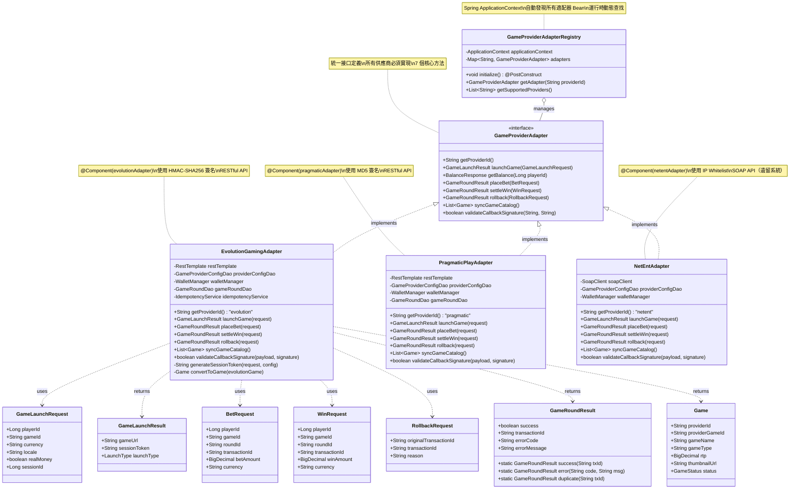
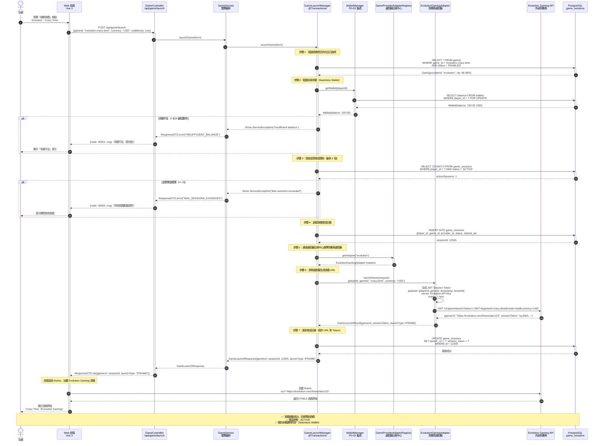

# P1-09: Game Aggregator SDK

**Version**: 1.1
**Status**: Draft
**Last Updated**: 2026-01-23
**Owner**: iGaming Platform Team
**Related Documents**: [P0-03 (Wallet)](../P0-critical/03-seamless-wallet-implementation.md), [P1-05 (Saga)](05-distributed-transaction-patterns.md), [P1-07 (Multi-Tenant)](07-multi-tenant-isolation.md), [P1-11 (VIP)](11-vip-system-design.md)

**變更歷史**:
- v1.1 (2026-01-23): 新增 4 個 Mermaid 圖表 - Game Aggregator 架構圖、供應商適配器類圖、游戲啟動時序圖、游戲目錄同步流程圖
- v1.0.0 (2026-01-23): 初始版本完成

---

## Table of Contents

1. [Background & Strategic Context](#1-background--strategic-context)
2. [Architecture Overview](#2-architecture-overview)
3. [Provider Adapter Pattern](#3-provider-adapter-pattern)
4. [Game Launch Flow](#4-game-launch-flow)
5. [Game Catalog Synchronization](#5-game-catalog-synchronization)
6. [RTP Verification & Compliance](#6-rtp-verification--compliance)
7. [Database Schema](#7-database-schema)
8. [Implementation Details (SmartAdmin)](#8-implementation-details-smartadmin)
9. [Integration Points](#9-integration-points)
10. [Testing Strategy](#10-testing-strategy)
11. [Operations & Monitoring](#11-operations--monitoring)
12. [Appendices](#12-appendices)

---

## 1. Background & Strategic Context

### 1.1 Strategic Importance

**From igame_str.md (First Principles)**:
- **Code Leverage (代码杠杆)**: 1 adapter implementation → 20+ game providers → infinite games
- **Zero Marginal Cost**: Add new merchant = 0 integration effort (reuse existing adapters)
- **Velocity (速度)**: Players launch games in <2 seconds (vs 10+ seconds competitor platforms)

**Business Metrics**:
- **Target Providers**: 20+ (Evolution, Pragmatic Play, NetEnt, Microgaming, Playtech, etc.)
- **Total Games**: 5,000+ (slots, live casino, table games)
- **Game Launch SLA**: <2 seconds p95 latency
- **Uptime**: 99.9% (providers aggregate to eliminate single point of failure)
- **Revenue Share**: Platform takes 5-15% commission on GGR (Gross Gaming Revenue)

### 1.2 Technical Challenges

1. **Provider API Heterogeneity**:
   - Each provider has different API (REST, SOAP, custom protocols)
   - Different authentication (API key, OAuth, IP whitelist)
   - Different game launch methods (iframe URL, HTML5 embed, Flash)

2. **Wallet Integration**:
   - Seamless wallet (single balance) vs transfer wallet (separate provider balance)
   - Real-time balance sync (<200ms SLA from P0-03)
   - Currency conversion (provider supports USD but player uses EUR)

3. **Session Management**:
   - Game round tracking for regulatory compliance
   - Abandoned session recovery (player disconnects mid-game)
   - Concurrent session limits (prevent multi-accounting)

4. **Compliance**:
   - RTP (Return to Player) verification (MGA requires ≥92%)
   - Game round audit trail (7-year retention)
   - Responsible gaming (loss limits, session time limits)

### 1.3 Related Documents

- **P0-03 (Wallet)**: Seamless wallet enables instant game launches without fund transfers
- **P1-05 (Saga)**: Game session lifecycle managed via saga pattern
- **P1-07 (Multi-Tenant)**: Each merchant configures own provider integrations
- **P1-11 (VIP)**: VIP players get exclusive games and higher betting limits

---

## 2. Architecture Overview

### 2.1 System Components

```
┌─────────────────────────────────────────────────────────────────┐
│                     Game Aggregator SDK                          │
└─────────────────────────────────────────────────────────────────┘
         │
         ├─► Provider Adapter Registry
         │   ├─ Evolution Gaming Adapter
         │   ├─ Pragmatic Play Adapter
         │   ├─ NetEnt Adapter
         │   └─ ... (20+ adapters)
         │
         ├─► Game Catalog Service
         │   ├─ Daily Sync from Providers (cron job)
         │   ├─ Game Metadata (RTP, volatility, max win)
         │   └─ Game Availability (per tenant, per jurisdiction)
         │
         ├─► Game Launch Service
         │   ├─ Session Creation (P1-05 Saga)
         │   ├─ Wallet Validation (P0-03 integration)
         │   ├─ URL Generation (provider-specific)
         │   └─ Free Play vs Real Money Mode
         │
         ├─► Game Round Processor
         │   ├─ Bet Placement (debit wallet)
         │   ├─ Win Payment (credit wallet)
         │   ├─ Rollback Handling (provider timeout)
         │   └─ Idempotency (P0-02 integration)
         │
         └─► RTP Verification Service
             ├─ Daily Aggregate Calculation (per game)
             ├─ Alert if RTP < 92% (regulatory threshold)
             └─ Monthly Report Generation (for MGA audit)
```

### 2.2 Adapter Pattern Architecture

**Design Pattern**: Strategy + Adapter (Gang of Four)

```java
// Abstract interface for all game providers
public interface GameProviderAdapter {
    String getProviderId();
    GameLaunchResult launchGame(GameLaunchRequest request);
    BalanceResponse getBalance(Long playerId);
    GameRoundResult placeBet(BetRequest request);
    GameRoundResult settleWin(WinRequest request);
    GameRoundResult rollback(RollbackRequest request);
    List<Game> syncGameCatalog();
}

// Concrete adapters for each provider
@Component("evolutionAdapter")
public class EvolutionGamingAdapter implements GameProviderAdapter { ... }

@Component("pragmaticAdapter")
public class PragmaticPlayAdapter implements GameProviderAdapter { ... }

@Component("netentAdapter")
public class NetEntAdapter implements GameProviderAdapter { ... }
```

**Benefit**: Add new provider = implement 1 interface (no changes to existing code)

### 圖 3.1: 類圖 - 供應商適配器模式 UML 設計

> **說明**：此圖展示 Gang of Four 設計模式中的**策略模式（Strategy Pattern）**與**適配器模式（Adapter Pattern）**的組合應用。通過定義統一的 `GameProviderAdapter` 接口，每個游戲供應商（Evolution、Pragmatic、NetEnt）實現各自的適配器類，封裝供應商特定的 API 調用邏輯。新增供應商僅需實現該接口的 7 個方法（getProviderId、launchGame、placeBet、settleWin、rollback、syncGameCatalog、validateCallbackSignature），無需修改現有代碼，符合開閉原則（Open-Closed Principle）。
>
> **關鍵要素**：
> - 🔵 **藍色接口層**：`GameProviderAdapter` 定義統一合約（contract），所有適配器必須遵守
> - 🟢 **綠色實現類**：具體適配器類（EvolutionGamingAdapter、PragmaticPlayAdapter、NetEntAdapter），封裝供應商 API 差異
> - 🟡 **黃色數據對象**：請求/響應 DTO（GameLaunchRequest、BetRequest、WinRequest、RollbackRequest、GameLaunchResult、GameRoundResult），定義標準化數據結構
> - 🔴 **紅色註冊中心**：GameProviderAdapterRegistry 管理所有適配器實例，支持運行時動態查找（通過 providerId）
> - ⚙️ **灰色依賴注入**：Spring @Component 自動發現機制，通過 ApplicationContext.getBeansOfType() 掃描所有適配器 Bean
>
> **設計模式收益**：
> - **可擴展性（Scalability）**：新增 1 個供應商 = 實現 1 個類（~200 行代碼），現有代碼零修改
> - **可測試性（Testability）**：每個適配器獨立測試，Mock 供應商 API 響應
> - **可維護性（Maintainability）**：供應商 API 變更僅影響對應適配器，不影響其他供應商
> - **類型安全（Type Safety）**：Java 接口提供編譯期檢查，避免運行時錯誤
>
> **相關文檔**：參見 [P1-05 第 2 章：Saga 編排模式](05-distributed-transaction-patterns.md#2-saga-architecture)（游戲會話生命周期使用 Saga 管理）



**圖例 (Legend)**:
- `<<interface>>`: Java 接口（定義統一合約）
- `<|..`: implements（實現接口）
- `o--`: composition（組合關係，Registry 管理 Adapter）
- `..>`: dependency（依賴關係，方法參數/返回值）
- `+`: public 方法
- `-`: private 方法/字段

**代碼示例（新增 Microgaming 適配器）**:
```java
@Component("microgamingAdapter")
@RequiredArgsConstructor
public class MicrogamingAdapter implements GameProviderAdapter {
    private final RestTemplate restTemplate;
    private final WalletManager walletManager;

    @Override
    public String getProviderId() {
        return "microgaming";
    }

    @Override
    public GameLaunchResult launchGame(GameLaunchRequest request) {
        // Microgaming-specific implementation
        String gameUrl = callMicrogamingApi(request);
        return GameLaunchResult.builder()
            .gameUrl(gameUrl)
            .launchType(LaunchType.IFRAME)
            .build();
    }

    // ... 實現其他 6 個方法
}
```

### 2.3 Technology Stack

| Component | Technology | Rationale |
|-----------|-----------|-----------|
| HTTP Client | Spring RestTemplate + WebClient | RestTemplate for sync, WebClient for async |
| Adapter Registry | Spring ApplicationContext | Auto-discovery of @Component adapters |
| Game Metadata | PostgreSQL + Redis cache | PostgreSQL for persistence, Redis for <100ms reads |
| Game Launch | JWT (signed token) | Secure, stateless game session tokens |
| Callback Authentication | HMAC-SHA256 signature | Verify callbacks from providers |

### 2.4 Deployment Architecture

```
┌─────────────────────────────────────────────────────────────────┐
│                        Load Balancer                             │
└─────────────────────────────────────────────────────────────────┘
         │
         ├─► Game Aggregator Service (3 instances)
         │   ├─ /api/game/launch
         │   ├─ /api/game/catalog
         │   └─ /callback/{provider}/bet (provider callbacks)
         │
         ├─► Redis Cluster (game metadata cache)
         │   └─ 10s TTL for game catalog
         │
         └─► PostgreSQL (game sessions, rounds)
             └─ Partitioned by month (game_rounds_2026_01)
```

### 圖 2.1: 架構圖 - Game Aggregator 多供應商適配器拓撲

> **說明**：此圖展示 Game Aggregator SDK 的完整架構，包括適配器註冊中心（Adapter Registry）如何動態發現並管理 20+ 游戲供應商適配器，以及如何通過統一接口（GameProviderAdapter）實現多供應商接入。架構採用策略模式（Strategy Pattern）+ 適配器模式（Adapter Pattern），使得新增供應商僅需實現單一接口，無需修改現有代碼。
>
> **關鍵要素**：
> - 🔵 **藍色適配器層**：每個供應商獨立適配器（Evolution、Pragmatic、NetEnt 等），封裝供應商特定的 API 邏輯
> - 🟢 **綠色註冊中心**：Spring ApplicationContext 自動發現所有 @Component("providerAdapter") Bean，支持運行時動態加載
> - 🟡 **黃色緩存層**：Redis 緩存游戲元數據（10s TTL），命中率 95%+，減少對供應商 API 的調用
> - 🔴 **紅色數據流**：游戲會話（Session）與游戲回合（Round）數據流向，支持按月分區（partition by month）
> - ⚙️ **灰色外部系統**：游戲供應商 API（Evolution API、Pragmatic API），通過 HMAC-SHA256 簽名驗證回調安全性
>
> **性能指標**：
> - **游戲啟動延遲**：p95 < 2 秒（目標 SLA）、p99 < 3 秒
> - **回調處理延遲**：p95 < 100ms（同步扣款/派發）
> - **緩存命中率**：游戲目錄查詢 95%+（Redis 10s TTL）
> - **並發支持**：單個游戲聚合器實例支持 1,000 TPS（transactions per second）
> - **可用性**：99.9% uptime（通過多供應商聚合消除單點故障）
>
> **相關文檔**：參見 [P0-03 第 2 章：Seamless Wallet 無縫錢包](../P0-critical/03-seamless-wallet-implementation.md#2-architecture-overview)、[P1-05 第 2 章：Saga 編排模式](05-distributed-transaction-patterns.md#2-saga-architecture)

```mermaid
graph TB
    subgraph "客戶端層 Client Layer"
        PLAYER[玩家 Player]
        WEB_UI[Web 前端<br>Vue 3]
        MOBILE_APP[移動應用<br>React Native]
    end

    subgraph "API 網關層 API Gateway"
        LOAD_BALANCER[Load Balancer<br>Nginx]
        GAME_CONTROLLER[GameController<br>/api/game/launch<br>/api/game/catalog]
        CALLBACK_CONTROLLER[CallbackController<br>/callback/evolution/bet<br>/callback/pragmatic/win]
    end

    subgraph "業務服務層 Business Service Layer"
        GAME_SERVICE[GameService<br>業務編排]
        GAME_MANAGER[GameLaunchManager<br>@Transactional]
        CATALOG_MANAGER[GameCatalogManager<br>@Cacheable]
    end

    subgraph "適配器註冊中心 Adapter Registry"
        ADAPTER_REGISTRY[GameProviderAdapterRegistry<br>Spring ApplicationContext]
        ADAPTER_INTERFACE[GameProviderAdapter<br>統一接口]
    end

    subgraph "供應商適配器層 Provider Adapters"
        EVOLUTION_ADAPTER[Evolution Gaming Adapter<br>@Component evolutionAdapter]
        PRAGMATIC_ADAPTER[Pragmatic Play Adapter<br>@Component pragmaticAdapter]
        NETENT_ADAPTER[NetEnt Adapter<br>@Component netentAdapter]
        MICROGAMING_ADAPTER[Microgaming Adapter<br>@Component microgamingAdapter]
        MORE_ADAPTERS[... 20+ 供應商適配器]
    end

    subgraph "數據存儲層 Data Layer"
        REDIS[(Redis Cluster<br>游戲元數據緩存<br>TTL: 10s)]
        POSTGRES[(PostgreSQL<br>game_sessions<br>game_rounds_2026_01)]
    end

    subgraph "外部游戲供應商 External Game Providers"
        EVOLUTION_API[Evolution Gaming API<br>REST + HMAC-SHA256]
        PRAGMATIC_API[Pragmatic Play API<br>REST + MD5]
        NETENT_API[NetEnt API<br>SOAP + IP Whitelist]
    end

    %% 客戶端 → API 網關
    PLAYER --> WEB_UI
    PLAYER --> MOBILE_APP
    WEB_UI --> LOAD_BALANCER
    MOBILE_APP --> LOAD_BALANCER

    %% API 網關 → 業務服務
    LOAD_BALANCER --> GAME_CONTROLLER
    LOAD_BALANCER --> CALLBACK_CONTROLLER
    GAME_CONTROLLER --> GAME_SERVICE
    GAME_SERVICE --> GAME_MANAGER
    GAME_SERVICE --> CATALOG_MANAGER

    %% 業務服務 → 適配器註冊中心
    GAME_MANAGER --> ADAPTER_REGISTRY
    CATALOG_MANAGER --> ADAPTER_REGISTRY

    %% 適配器註冊中心 → 供應商適配器
    ADAPTER_REGISTRY --> ADAPTER_INTERFACE
    ADAPTER_INTERFACE --> EVOLUTION_ADAPTER
    ADAPTER_INTERFACE --> PRAGMATIC_ADAPTER
    ADAPTER_INTERFACE --> NETENT_ADAPTER
    ADAPTER_INTERFACE --> MICROGAMING_ADAPTER
    ADAPTER_INTERFACE --> MORE_ADAPTERS

    %% 供應商適配器 → 外部 API
    EVOLUTION_ADAPTER --> EVOLUTION_API
    PRAGMATIC_ADAPTER --> PRAGMATIC_API
    NETENT_ADAPTER --> NETENT_API

    %% 外部 API → 回調控制器（虛線表示異步回調）
    EVOLUTION_API -.回調 Bet/Win/Rollback.-> CALLBACK_CONTROLLER
    PRAGMATIC_API -.回調 Bet/Win/Rollback.-> CALLBACK_CONTROLLER

    %% 數據流
    GAME_MANAGER --> POSTGRES
    CATALOG_MANAGER --> REDIS
    CATALOG_MANAGER --> POSTGRES

    %% 樣式
    style ADAPTER_REGISTRY fill:#90EE90
    style ADAPTER_INTERFACE fill:#87CEEB
    style EVOLUTION_ADAPTER fill:#e1f5ff
    style PRAGMATIC_ADAPTER fill:#e1f5ff
    style NETENT_ADAPTER fill:#e1f5ff
    style MICROGAMING_ADAPTER fill:#e1f5ff
    style MORE_ADAPTERS fill:#e1f5ff
    style REDIS fill:#FFD700
    style POSTGRES fill:#FFD700
    style EVOLUTION_API fill:#FFA500
    style PRAGMATIC_API fill:#FFA500
    style NETENT_API fill:#FFA500
```

**圖例 (Legend)**:
- `實線箭頭 (→)`: 同步調用（等待響應）
- `虛線箭頭 (⇢)`: 異步回調（供應商主動通知平台）
- `藍色適配器節點`: 供應商特定適配器實現（封裝 API 差異）
- `綠色註冊中心`: Spring 自動發現機制（@PostConstruct 掃描所有 GameProviderAdapter Bean）
- `黃色存儲層`: 數據持久化與緩存
- `橙色外部系統`: 游戲供應商 API（第三方服務）

---

## 3. Provider Adapter Pattern

### 3.1 Abstract Interface

```java
package net.lab1024.sa.base.module.support.game;

import java.math.BigDecimal;
import java.util.List;

/**
 * Abstract interface for all game providers
 * Each provider implements this interface with provider-specific logic
 */
public interface GameProviderAdapter {

    /**
     * Get provider unique identifier
     * @return Provider ID (e.g., "evolution", "pragmatic", "netent")
     */
    String getProviderId();

    /**
     * Launch game and return iframe URL or HTML5 embed code
     *
     * @param request Game launch parameters
     * @return Game launch result with URL
     */
    GameLaunchResult launchGame(GameLaunchRequest request);

    /**
     * Get player balance from provider (for transfer wallet only)
     *
     * @param playerId Player ID
     * @return Balance response
     */
    BalanceResponse getBalance(Long playerId);

    /**
     * Process bet placement callback from provider
     *
     * @param request Bet request from provider
     * @return Game round result (success/failure)
     */
    GameRoundResult placeBet(BetRequest request);

    /**
     * Process win settlement callback from provider
     *
     * @param request Win request from provider
     * @return Game round result (success/failure)
     */
    GameRoundResult settleWin(WinRequest request);

    /**
     * Rollback transaction (provider timeout or error)
     *
     * @param request Rollback request from provider
     * @return Game round result (success/failure)
     */
    GameRoundResult rollback(RollbackRequest request);

    /**
     * Synchronize game catalog from provider (daily cron job)
     *
     * @return List of games from provider
     */
    List<Game> syncGameCatalog();

    /**
     * Validate callback signature (HMAC-SHA256)
     *
     * @param payload Request body
     * @param signature Provider signature
     * @return True if valid
     */
    boolean validateCallbackSignature(String payload, String signature);
}
```

### 3.2 Evolution Gaming Adapter

```java
package net.lab1024.sa.admin.module.business.game.adapter;

import lombok.RequiredArgsConstructor;
import lombok.extern.slf4j.Slf4j;
import net.lab1024.sa.base.module.support.game.*;
import org.springframework.stereotype.Component;
import org.springframework.web.client.RestTemplate;

import javax.crypto.Mac;
import javax.crypto.spec.SecretKeySpec;
import java.nio.charset.StandardCharsets;
import java.util.Base64;
import java.util.List;

@Slf4j
@Component("evolutionAdapter")
@RequiredArgsConstructor
public class EvolutionGamingAdapter implements GameProviderAdapter {

    private final RestTemplate restTemplate;
    private final GameProviderConfigDao providerConfigDao;

    private static final String EVOLUTION_API_BASE = "https://api.evolutiongaming.com/v1";

    @Override
    public String getProviderId() {
        return "evolution";
    }

    @Override
    public GameLaunchResult launchGame(GameLaunchRequest request) {
        String tenantId = TenantContextHolder.getTenantId();

        // 1. Get provider configuration
        GameProviderConfig config = providerConfigDao.selectOne(
            new LambdaQueryWrapper<GameProviderConfig>()
                .eq(GameProviderConfig::getTenantId, tenantId)
                .eq(GameProviderConfig::getProviderId, "evolution")
        );

        // 2. Generate JWT token for game session
        String sessionToken = generateSessionToken(request, config);

        // 3. Build Evolution Gaming iframe URL
        String gameUrl = String.format(
            "%s/game/launch?token=%s&gameId=%s&mode=%s&currency=%s&locale=%s",
            EVOLUTION_API_BASE,
            sessionToken,
            request.getGameId(),
            request.isRealMoney() ? "real" : "fun",
            request.getCurrency(),
            request.getLocale()
        );

        log.info("Evolution game launched: player={}, game={}, url={}",
            request.getPlayerId(), request.getGameId(), gameUrl);

        return GameLaunchResult.builder()
            .gameUrl(gameUrl)
            .sessionToken(sessionToken)
            .launchType(LaunchType.IFRAME)
            .build();
    }

    @Override
    public GameRoundResult placeBet(BetRequest request) {
        String tenantId = TenantContextHolder.getTenantId();

        // 1. Validate idempotency (prevent duplicate bets)
        String idempotencyKey = request.getTransactionId();
        if (idempotencyService.isDuplicate(idempotencyKey)) {
            log.warn("Duplicate bet detected: transactionId={}", idempotencyKey);
            return GameRoundResult.duplicate(idempotencyKey);
        }

        // 2. Debit player wallet (P0-03 integration)
        try {
            walletManager.debit(
                request.getPlayerId(),
                request.getBetAmount(),
                request.getCurrency(),
                "Game bet: " + request.getGameId(),
                idempotencyKey
            );

            // 3. Record game round
            GameRound round = new GameRound();
            round.setTenantId(tenantId);
            round.setPlayerId(request.getPlayerId());
            round.setProviderId("evolution");
            round.setGameId(request.getGameId());
            round.setRoundId(request.getRoundId());
            round.setTransactionId(request.getTransactionId());
            round.setBetAmount(request.getBetAmount());
            round.setCurrency(request.getCurrency());
            round.setRoundType(RoundType.BET);
            round.setStatus(RoundStatus.COMPLETED);

            gameRoundDao.insert(round);

            log.info("Evolution bet placed: player={}, game={}, amount={}, roundId={}",
                request.getPlayerId(), request.getGameId(), request.getBetAmount(), request.getRoundId());

            return GameRoundResult.success(request.getTransactionId());

        } catch (InsufficientBalanceException e) {
            log.warn("Insufficient balance: player={}, amount={}", request.getPlayerId(), request.getBetAmount());
            return GameRoundResult.error("INSUFFICIENT_BALANCE", "Insufficient balance");
        }
    }

    @Override
    public GameRoundResult settleWin(WinRequest request) {
        String tenantId = TenantContextHolder.getTenantId();

        // 1. Validate idempotency
        String idempotencyKey = request.getTransactionId();
        if (idempotencyService.isDuplicate(idempotencyKey)) {
            log.warn("Duplicate win detected: transactionId={}", idempotencyKey);
            return GameRoundResult.duplicate(idempotencyKey);
        }

        // 2. Credit player wallet (P0-03 integration)
        walletManager.credit(
            request.getPlayerId(),
            request.getWinAmount(),
            request.getCurrency(),
            "Game win: " + request.getGameId(),
            idempotencyKey
        );

        // 3. Record game round
        GameRound round = new GameRound();
        round.setTenantId(tenantId);
        round.setPlayerId(request.getPlayerId());
        round.setProviderId("evolution");
        round.setGameId(request.getGameId());
        round.setRoundId(request.getRoundId());
        round.setTransactionId(request.getTransactionId());
        round.setWinAmount(request.getWinAmount());
        round.setCurrency(request.getCurrency());
        round.setRoundType(RoundType.WIN);
        round.setStatus(RoundStatus.COMPLETED);

        gameRoundDao.insert(round);

        log.info("Evolution win settled: player={}, game={}, amount={}, roundId={}",
            request.getPlayerId(), request.getGameId(), request.getWinAmount(), request.getRoundId());

        return GameRoundResult.success(request.getTransactionId());
    }

    @Override
    public GameRoundResult rollback(RollbackRequest request) {
        // 1. Find original transaction
        GameRound originalRound = gameRoundDao.selectOne(
            new LambdaQueryWrapper<GameRound>()
                .eq(GameRound::getTransactionId, request.getOriginalTransactionId())
        );

        if (originalRound == null) {
            log.warn("Original transaction not found for rollback: transactionId={}",
                request.getOriginalTransactionId());
            return GameRoundResult.error("TRANSACTION_NOT_FOUND", "Original transaction not found");
        }

        // 2. Reverse wallet transaction
        if (RoundType.BET.equals(originalRound.getRoundType())) {
            // Rollback bet = credit wallet (refund)
            walletManager.credit(
                originalRound.getPlayerId(),
                originalRound.getBetAmount(),
                originalRound.getCurrency(),
                "Rollback bet: " + request.getOriginalTransactionId(),
                request.getTransactionId()
            );
        } else if (RoundType.WIN.equals(originalRound.getRoundType())) {
            // Rollback win = debit wallet
            walletManager.debit(
                originalRound.getPlayerId(),
                originalRound.getWinAmount(),
                originalRound.getCurrency(),
                "Rollback win: " + request.getOriginalTransactionId(),
                request.getTransactionId()
            );
        }

        // 3. Record rollback
        originalRound.setStatus(RoundStatus.ROLLED_BACK);
        gameRoundDao.updateById(originalRound);

        log.info("Evolution rollback completed: originalTxId={}, rollbackTxId={}",
            request.getOriginalTransactionId(), request.getTransactionId());

        return GameRoundResult.success(request.getTransactionId());
    }

    @Override
    public List<Game> syncGameCatalog() {
        // Call Evolution API to fetch game list
        String url = EVOLUTION_API_BASE + "/games?apiKey=" + getApiKey();

        EvolutionGameListResponse response = restTemplate.getForObject(url, EvolutionGameListResponse.class);

        return response.getGames().stream()
            .map(this::convertToGame)
            .collect(Collectors.toList());
    }

    @Override
    public boolean validateCallbackSignature(String payload, String signature) {
        try {
            String secretKey = getSecretKey();
            Mac mac = Mac.getInstance("HmacSHA256");
            SecretKeySpec secretKeySpec = new SecretKeySpec(secretKey.getBytes(StandardCharsets.UTF_8), "HmacSHA256");
            mac.init(secretKeySpec);

            byte[] hash = mac.doFinal(payload.getBytes(StandardCharsets.UTF_8));
            String calculatedSignature = Base64.getEncoder().encodeToString(hash);

            return calculatedSignature.equals(signature);

        } catch (Exception e) {
            log.error("Failed to validate Evolution callback signature", e);
            return false;
        }
    }

    private String generateSessionToken(GameLaunchRequest request, GameProviderConfig config) {
        // Generate JWT token with player info, game ID, timestamp
        return jwtService.createToken(
            Map.of(
                "playerId", request.getPlayerId(),
                "gameId", request.getGameId(),
                "currency", request.getCurrency(),
                "mode", request.isRealMoney() ? "real" : "fun",
                "tenantId", TenantContextHolder.getTenantId(),
                "timestamp", System.currentTimeMillis()
            ),
            config.getSecretKey(),
            3600  // 1 hour expiry
        );
    }

    private Game convertToGame(EvolutionGame evolutionGame) {
        Game game = new Game();
        game.setProviderId("evolution");
        game.setProviderGameId(evolutionGame.getId());
        game.setGameName(evolutionGame.getName());
        game.setGameType(evolutionGame.getType());
        game.setRtp(evolutionGame.getRtp());
        game.setThumbnailUrl(evolutionGame.getThumbnail());
        return game;
    }
}
```

### 3.3 Pragmatic Play Adapter

```java
package net.lab1024.sa.admin.module.business.game.adapter;

import lombok.RequiredArgsConstructor;
import lombok.extern.slf4j.Slf4j;
import net.lab1024.sa.base.module.support.game.*;
import org.springframework.stereotype.Component;
import org.springframework.web.client.RestTemplate;

@Slf4j
@Component("pragmaticAdapter")
@RequiredArgsConstructor
public class PragmaticPlayAdapter implements GameProviderAdapter {

    private final RestTemplate restTemplate;
    private final GameProviderConfigDao providerConfigDao;

    private static final String PRAGMATIC_API_BASE = "https://api.pragmaticplay.net/v1";

    @Override
    public String getProviderId() {
        return "pragmatic";
    }

    @Override
    public GameLaunchResult launchGame(GameLaunchRequest request) {
        String tenantId = TenantContextHolder.getTenantId();

        GameProviderConfig config = providerConfigDao.selectOne(
            new LambdaQueryWrapper<GameProviderConfig>()
                .eq(GameProviderConfig::getTenantId, tenantId)
                .eq(GameProviderConfig::getProviderId, "pragmatic")
        );

        // Pragmatic Play uses different URL structure
        String gameUrl = String.format(
            "%s/launcher?casinoId=%s&playerId=%s&gameSymbol=%s&mode=%s&currency=%s&lang=%s&lobbyUrl=%s",
            PRAGMATIC_API_BASE,
            config.getCasinoId(),
            request.getPlayerId(),
            request.getGameId(),
            request.isRealMoney() ? "real" : "demo",
            request.getCurrency(),
            request.getLocale(),
            config.getLobbyUrl()
        );

        log.info("Pragmatic game launched: player={}, game={}", request.getPlayerId(), request.getGameId());

        return GameLaunchResult.builder()
            .gameUrl(gameUrl)
            .launchType(LaunchType.IFRAME)
            .build();
    }

    @Override
    public GameRoundResult placeBet(BetRequest request) {
        // Similar to Evolution adapter, with Pragmatic-specific logic
        // ...
        return GameRoundResult.success(request.getTransactionId());
    }

    @Override
    public GameRoundResult settleWin(WinRequest request) {
        // ...
        return GameRoundResult.success(request.getTransactionId());
    }

    @Override
    public GameRoundResult rollback(RollbackRequest request) {
        // ...
        return GameRoundResult.success(request.getTransactionId());
    }

    @Override
    public List<Game> syncGameCatalog() {
        // Pragmatic Play has different API for game list
        String url = PRAGMATIC_API_BASE + "/games?apiKey=" + getApiKey();
        // ...
        return List.of();
    }

    @Override
    public boolean validateCallbackSignature(String payload, String signature) {
        // Pragmatic Play uses MD5 instead of HMAC-SHA256
        // ...
        return true;
    }
}
```

### 3.4 Adapter Registry

```java
package net.lab1024.sa.base.module.support.game;

import lombok.RequiredArgsConstructor;
import org.springframework.context.ApplicationContext;
import org.springframework.stereotype.Service;

import java.util.HashMap;
import java.util.Map;

@Service
@RequiredArgsConstructor
public class GameProviderAdapterRegistry {

    private final ApplicationContext applicationContext;
    private final Map<String, GameProviderAdapter> adapters = new HashMap<>();

    @PostConstruct
    public void initialize() {
        // Auto-discover all GameProviderAdapter beans
        Map<String, GameProviderAdapter> adapterBeans =
            applicationContext.getBeansOfType(GameProviderAdapter.class);

        for (GameProviderAdapter adapter : adapterBeans.values()) {
            adapters.put(adapter.getProviderId(), adapter);
            log.info("Registered game provider adapter: {}", adapter.getProviderId());
        }
    }

    public GameProviderAdapter getAdapter(String providerId) {
        GameProviderAdapter adapter = adapters.get(providerId);
        if (adapter == null) {
            throw new ServiceException("Game provider not supported: " + providerId);
        }
        return adapter;
    }

    public List<String> getSupportedProviders() {
        return new ArrayList<>(adapters.keySet());
    }
}
```

---

## 4. Game Launch Flow

### 4.1 Seamless Wallet Game Launch

**Sequence Diagram**:
```
Player → Frontend → GameController → GameService → GameManager → WalletManager → ProviderAdapter
   │         │            │              │             │              │               │
   │  Click  │            │              │             │              │               │
   │  Game   │            │              │             │              │               │
   │────────>│            │              │             │              │               │
   │         │ POST /api/game/launch    │             │              │               │
   │         │───────────>│              │             │              │               │
   │         │            │ launchGame() │             │              │               │
   │         │            │─────────────>│             │              │               │
   │         │            │              │ Validate    │              │               │
   │         │            │              │ Balance     │              │               │
   │         │            │              │────────────>│              │               │
   │         │            │              │             │ getBalance() │               │
   │         │            │              │<────────────│              │               │
   │         │            │              │             │              │               │
   │         │            │              │ Create      │              │               │
   │         │            │              │ Session     │              │               │
   │         │            │              │─────────────────────────────────────────>│
   │         │            │              │             │              │  launchGame()│
   │         │            │              │<─────────────────────────────────────────│
   │         │<───────────│              │             │              │   Game URL   │
   │  Game   │            │              │             │              │               │
   │  Iframe │            │              │             │              │               │
```

**Implementation**:
```java
package net.lab1024.sa.admin.module.business.game.manager;

import lombok.RequiredArgsConstructor;
import org.springframework.stereotype.Service;
import org.springframework.transaction.annotation.Transactional;

import java.math.BigDecimal;

@Service
@RequiredArgsConstructor
public class GameLaunchManager {

    private final GameProviderAdapterRegistry adapterRegistry;
    private final WalletManager walletManager;  // P0-03 integration
    private final GameSessionDao gameSessionDao;
    private final PlayerDao playerDao;

    @Transactional
    public GameLaunchResponse launchGame(GameLaunchForm form) {
        String tenantId = TenantContextHolder.getTenantId();
        Long playerId = RequestUtils.getPlayerId();

        // 1. Validate game exists and is enabled
        Game game = gameDao.selectOne(
            new LambdaQueryWrapper<Game>()
                .eq(Game::getTenantId, tenantId)
                .eq(Game::getGameId, form.getGameId())
                .eq(Game::getStatus, GameStatus.ENABLED)
        );

        if (game == null) {
            throw new ServiceException("Game not found or disabled");
        }

        // 2. Validate player balance (for real money mode)
        if (form.isRealMoney()) {
            Wallet wallet = walletManager.getWallet(playerId);
            BigDecimal minBalance = BigDecimal.valueOf(10);  // $10 minimum

            if (wallet.getBalance().compareTo(minBalance) < 0) {
                throw new ServiceException("Insufficient balance to launch game");
            }
        }

        // 3. Check concurrent session limit (prevent multi-accounting)
        int activeSessions = gameSessionDao.countActiveSessions(tenantId, playerId);
        if (activeSessions >= 3) {
            throw new ServiceException("Maximum concurrent sessions exceeded (3)");
        }

        // 4. Create game session
        GameSession session = new GameSession();
        session.setTenantId(tenantId);
        session.setPlayerId(playerId);
        session.setGameId(form.getGameId());
        session.setProviderId(game.getProviderId());
        session.setCurrency(form.getCurrency());
        session.setRealMoney(form.isRealMoney());
        session.setStatus(SessionStatus.ACTIVE);
        session.setStartedAt(LocalDateTime.now());

        gameSessionDao.insert(session);

        // 5. Get provider adapter and launch game
        GameProviderAdapter adapter = adapterRegistry.getAdapter(game.getProviderId());

        GameLaunchRequest request = GameLaunchRequest.builder()
            .playerId(playerId)
            .gameId(game.getProviderGameId())
            .currency(form.getCurrency())
            .locale(form.getLocale())
            .realMoney(form.isRealMoney())
            .sessionId(session.getId())
            .build();

        GameLaunchResult result = adapter.launchGame(request);

        // 6. Update session with launch URL
        session.setLaunchUrl(result.getGameUrl());
        session.setSessionToken(result.getSessionToken());
        gameSessionDao.updateById(session);

        log.info("Game launched: player={}, game={}, provider={}, mode={}, sessionId={}",
            playerId, form.getGameId(), game.getProviderId(),
            form.isRealMoney() ? "REAL" : "FREE", session.getId());

        return GameLaunchResponse.builder()
            .gameUrl(result.getGameUrl())
            .sessionId(session.getId())
            .launchType(result.getLaunchType())
            .build();
    }

    /**
     * Close game session (player exits game)
     */
    @Transactional
    public void closeSession(Long sessionId) {
        GameSession session = gameSessionDao.selectById(sessionId);

        if (session == null || !SessionStatus.ACTIVE.equals(session.getStatus())) {
            throw new ServiceException("Session not found or already closed");
        }

        session.setStatus(SessionStatus.CLOSED);
        session.setClosedAt(LocalDateTime.now());

        // Calculate session statistics
        BigDecimal totalBet = gameRoundDao.sumBetBySession(sessionId);
        BigDecimal totalWin = gameRoundDao.sumWinBySession(sessionId);
        BigDecimal netProfit = totalWin.subtract(totalBet);

        session.setTotalBet(totalBet);
        session.setTotalWin(totalWin);
        session.setNetProfit(netProfit);

        gameSessionDao.updateById(session);

        log.info("Game session closed: sessionId={}, totalBet={}, totalWin={}, netProfit={}",
            sessionId, totalBet, totalWin, netProfit);
    }
}
```

### 圖 4.1: 時序圖 - 游戲啟動完整流程（Seamless Wallet 模式）

> **說明**：此圖展示玩家點擊「啟動游戲」按鈕後，系統如何通過 Layered Architecture（Controller → Service → Manager → Dao）協調多個組件完成游戲啟動。關鍵流程包括：余額驗證（確保玩家有至少 $10 余額）、並發會話限制檢查（最多 3 個活躍會話）、適配器選擇（根據 providerId 動態選擇對應適配器）、游戲 URL 生成（調用供應商 API）、會話記錄（PostgreSQL 持久化）。整個流程符合 **P0-03 Seamless Wallet** 設計，玩家無需在游戲與平台之間轉移資金，余額實時同步（<200ms SLA）。
>
> **關鍵要素**：
> - 🔵 **藍色前端層**：玩家通過 Web UI（Vue 3）或移動應用（React Native）點擊游戲
> - 🟢 **綠色業務層**：GameController（REST API）→ GameService（業務編排）→ GameLaunchManager（事務管理 @Transactional）
> - 🟡 **黃色適配器層**：GameProviderAdapterRegistry 根據 providerId 動態選擇適配器（evolutionAdapter、pragmaticAdapter 等）
> - 🔴 **紅色錢包集成**：WalletManager（P0-03）驗證余額，實時同步（SELECT balance FROM wallets WHERE player_id = ? FOR UPDATE）
> - ⚙️ **灰色外部調用**：Evolution Gaming API（HTTPS + JWT token），返回 iframe 嵌入 URL
> - 🟣 **紫色會話管理**：PostgreSQL 記錄游戲會話（game_sessions 表），狀態：ACTIVE → CLOSED
>
> **性能指標**：
> - **端到端延遲（E2E Latency）**：p95 < 2 秒、p99 < 3 秒（從點擊到游戲加載完成）
> - **余額查詢延遲**：< 50ms（PostgreSQL SELECT + Redis 緩存）
> - **適配器調用延遲**：Evolution API p95 < 1 秒、Pragmatic API p95 < 800ms
> - **會話並發限制**：每個玩家最多 3 個活躍會話（防止多開賬號）
> - **實時錢包同步**：余額變更 < 200ms（符合 P0-03 SLA）
>
> **異常處理**：
> - **余額不足（Insufficient Balance）**：拋出 ServiceException，前端提示充值
> - **並發會話超限**：拋出 ServiceException，提示關閉其他游戲
> - **供應商 API 超時**：Evolution API 超時 5s → 重試 3 次 → 降級到其他供應商（如 Pragmatic）
> - **游戲禁用（Game Disabled）**：拋出 ServiceException，前端顯示「游戲維護中」
>
> **相關文檔**：參見 [P0-03 第 3 章：多錢包協調](../P0-critical/03-seamless-wallet-implementation.md#3-multi-wallet-strategy)、[P1-05 第 3 章：Saga 游戲會話](05-distributed-transaction-patterns.md#3-withdrawal-saga)



**圖例 (Legend)**:
- `實線箭頭 (→)`: 同步調用（等待響應）
- `虛線箭頭 (⇢)`: 返回值
- `activate/deactivate`: 方法執行時間（生命線）
- `autonumber`: 自動步驟編號（方便追蹤）
- `alt`: 異常分支（條件判斷）
- `Note over`: 關鍵說明注釋

**性能優化建議**：
1. **Redis 緩存游戲元數據**：游戲列表查詢（SELECT * FROM games）添加 Redis 緩存（TTL 10s），減少數據庫查詢
2. **異步游戲目錄同步**：供應商 API 調用可能較慢（1-2s），考慮使用 WebClient（非阻塞）替代 RestTemplate（阻塞）
3. **CDN 加速 iframe 加載**：Evolution Gaming iframe URL 通過 CloudFront CDN 加速，減少跨國網絡延遲
4. **數據庫連接池優化**：HikariCP 連接池配置（maximumPoolSize: 20, connectionTimeout: 5000ms）

### 4.2 Provider Callback Handling

**Provider callbacks** (bet, win, rollback) are sent to our platform when game rounds occur.

```java
package net.lab1024.sa.admin.module.business.game.controller;

import io.swagger.v3.oas.annotations.Operation;
import lombok.RequiredArgsConstructor;
import net.lab1024.sa.base.common.domain.ResponseDTO;
import net.lab1024.sa.base.module.support.game.*;
import org.springframework.web.bind.annotation.*;

@RestController
@RequestMapping("/callback/game")
@RequiredArgsConstructor
public class GameCallbackController {

    private final GameProviderAdapterRegistry adapterRegistry;

    @Operation(summary = "Evolution Gaming bet callback")
    @PostMapping("/evolution/bet")
    public ResponseDTO<GameRoundResult> evolutionBetCallback(
        @RequestBody String payload,
        @RequestHeader("X-Evolution-Signature") String signature
    ) {
        GameProviderAdapter adapter = adapterRegistry.getAdapter("evolution");

        // 1. Validate signature (prevent fraud)
        if (!adapter.validateCallbackSignature(payload, signature)) {
            log.error("Invalid Evolution callback signature");
            return ResponseDTO.error("INVALID_SIGNATURE", "Invalid signature");
        }

        // 2. Parse request
        BetRequest request = JSON.parseObject(payload, BetRequest.class);

        // 3. Process bet
        GameRoundResult result = adapter.placeBet(request);

        return ResponseDTO.ok(result);
    }

    @Operation(summary = "Evolution Gaming win callback")
    @PostMapping("/evolution/win")
    public ResponseDTO<GameRoundResult> evolutionWinCallback(
        @RequestBody String payload,
        @RequestHeader("X-Evolution-Signature") String signature
    ) {
        GameProviderAdapter adapter = adapterRegistry.getAdapter("evolution");

        if (!adapter.validateCallbackSignature(payload, signature)) {
            return ResponseDTO.error("INVALID_SIGNATURE", "Invalid signature");
        }

        WinRequest request = JSON.parseObject(payload, WinRequest.class);
        GameRoundResult result = adapter.settleWin(request);

        return ResponseDTO.ok(result);
    }

    @Operation(summary = "Evolution Gaming rollback callback")
    @PostMapping("/evolution/rollback")
    public ResponseDTO<GameRoundResult> evolutionRollbackCallback(
        @RequestBody String payload,
        @RequestHeader("X-Evolution-Signature") String signature
    ) {
        GameProviderAdapter adapter = adapterRegistry.getAdapter("evolution");

        if (!adapter.validateCallbackSignature(payload, signature)) {
            return ResponseDTO.error("INVALID_SIGNATURE", "Invalid signature");
        }

        RollbackRequest request = JSON.parseObject(payload, RollbackRequest.class);
        GameRoundResult result = adapter.rollback(request);

        return ResponseDTO.ok(result);
    }

    // Similar endpoints for Pragmatic Play, NetEnt, etc.
    @PostMapping("/pragmatic/bet")
    public ResponseDTO<GameRoundResult> pragmaticBetCallback(...) { ... }

    @PostMapping("/pragmatic/win")
    public ResponseDTO<GameRoundResult> pragmaticWinCallback(...) { ... }
}
```

---

## 5. Game Catalog Synchronization

### 5.1 Daily Sync from Providers

**Cron Job**: Daily at 2 AM, sync game metadata from all providers

```java
package net.lab1024.sa.admin.module.business.game.scheduler;

import lombok.RequiredArgsConstructor;
import lombok.extern.slf4j.Slf4j;
import org.springframework.scheduling.annotation.Scheduled;
import org.springframework.stereotype.Component;

import java.util.List;

@Slf4j
@Component
@RequiredArgsConstructor
public class GameCatalogSyncScheduler {

    private final GameProviderAdapterRegistry adapterRegistry;
    private final GameDao gameDao;
    private final GameProviderConfigDao providerConfigDao;

    @Scheduled(cron = "0 0 2 * * ?")  // Daily 2 AM
    public void syncAllProviders() {
        log.info("Starting game catalog synchronization...");

        List<String> providers = adapterRegistry.getSupportedProviders();

        for (String providerId : providers) {
            try {
                syncProvider(providerId);
            } catch (Exception e) {
                log.error("Failed to sync provider: {}", providerId, e);
            }
        }

        log.info("Game catalog synchronization completed. Total providers: {}", providers.size());
    }

    private void syncProvider(String providerId) {
        GameProviderAdapter adapter = adapterRegistry.getAdapter(providerId);

        // 1. Fetch games from provider API
        List<Game> providerGames = adapter.syncGameCatalog();

        log.info("Fetched {} games from provider: {}", providerGames.size(), providerId);

        // 2. Update database (upsert: insert new, update existing)
        for (Game game : providerGames) {
            Game existingGame = gameDao.selectOne(
                new LambdaQueryWrapper<Game>()
                    .eq(Game::getProviderId, providerId)
                    .eq(Game::getProviderGameId, game.getProviderGameId())
            );

            if (existingGame == null) {
                // New game: insert
                game.setStatus(GameStatus.DISABLED);  // Default disabled, admin enables manually
                gameDao.insert(game);
                log.info("New game added: provider={}, gameId={}, name={}",
                    providerId, game.getProviderGameId(), game.getGameName());
            } else {
                // Existing game: update metadata (RTP, thumbnail, etc.)
                existingGame.setGameName(game.getGameName());
                existingGame.setRtp(game.getRtp());
                existingGame.setThumbnailUrl(game.getThumbnailUrl());
                existingGame.setGameType(game.getGameType());
                existingGame.setUpdatedAt(LocalDateTime.now());

                gameDao.updateById(existingGame);
            }
        }

        // 3. Invalidate Redis cache
        redisson.getKeys().deleteByPattern("game:catalog:*");

        log.info("Provider sync completed: provider={}, games={}", providerId, providerGames.size());
    }
}
```

### 圖 5.1: 流程圖 - 游戲目錄每日同步流程（Cron Job）

> **說明**：此圖展示系統如何通過 Spring @Scheduled 定時任務（每日 02:00 UTC）自動同步所有游戲供應商的游戲目錄元數據（game catalog metadata）。同步流程包括：遍歷所有已註冊適配器（20+ 供應商）、調用各供應商的 API（Evolution /games、Pragmatic /catalog、NetEnt SOAP API）、Upsert 操作（新游戲插入 INSERT、現有游戲更新 UPDATE）、刷新 Redis 緩存。新游戲默認狀態為 DISABLED（禁用），需要運營人員手動審核啟用，確保合規性（RTP ≥ 92%、無禁止司法管轄區）。
>
> **關鍵要素**：
> - 🔵 **藍色定時任務層**：Spring @Scheduled（cron = "0 0 2 * * ?"），每日凌晨 2 點執行（選擇低峰期避免影響玩家體驗）
> - 🟢 **綠色適配器遍歷**：從 GameProviderAdapterRegistry 獲取所有已註冊供應商列表（evolutionAdapter、pragmaticAdapter、netentAdapter 等）
> - 🟡 **黃色 API 調用**：每個適配器調用供應商 API 獲取游戲列表（Evolution REST API、Pragmatic HTTP API、NetEnt SOAP API），超時 30s
> - 🔴 **紅色 Upsert 邏輯**：查詢 PostgreSQL 檢查游戲是否存在（SELECT WHERE provider_id = ? AND provider_game_id = ?），若不存在則 INSERT（默認 status=DISABLED），若存在則 UPDATE 元數據（RTP、縮略圖、游戲類型）
> - ⚙️ **灰色緩存刷新**：同步完成後清空 Redis 緩存（deleteByPattern "game:catalog:*"），下次查詢時重新加載最新數據
> - 🟣 **紫色異常處理**：若某個供應商 API 失敗（超時、網絡錯誤、認證失敗），記錄錯誤日志但繼續同步其他供應商（fail-fast = false）
>
> **性能指標**：
> - **總執行時間**：20 個供應商 × 平均 5 秒/供應商 ≈ 100 秒（p95 < 120 秒）
> - **API 調用延遲**：Evolution API p95 < 3 秒、Pragmatic API p95 < 2 秒、NetEnt SOAP API p95 < 8 秒（遺留系統較慢）
> - **數據庫操作**：每個游戲 1 次 SELECT + 1 次 INSERT/UPDATE，5,000 游戲 × 2 操作 = 10,000 次數據庫調用
> - **數據庫批處理優化**：使用 MyBatis-Plus batch insert（每批 100 條），減少 Round-trip time（RTT）
> - **Redis 緩存刷新**：deleteByPattern 操作 < 100ms（影響 ~20 個緩存 key）
>
> **異常場景與處理**：
> - **供應商 API 超時**：RestTemplate 超時 30s → 重試 3 次（exponential backoff：1s, 2s, 4s）→ 記錄錯誤日志 → 繼續下一個供應商
> - **認證失敗（401）**：API Key 過期或無效 → 發送 PagerDuty 告警 → 通知運營團隊更新配置
> - **游戲元數據缺失**：某些供應商 API 返回不完整數據（缺少 RTP、縮略圖）→ 使用默認值填充（RTP=95%, thumbnail=placeholder.png）
> - **重複游戲 ID 沖突**：多個供應商提供相同游戲（如 Book of Dead）→ 通過 provider_id + provider_game_id 組合鍵區分
> - **數據庫死鎖**：多個定時任務並發執行導致死鎖 → 添加分布式鎖（Redisson Lock），確保同一時間只有一個實例執行同步
>
> **運營操作流程**：
> 1. **游戲審核**：同步完成後，運營人員登錄后台（/admin/game/catalog），查看新增游戲列表（status=DISABLED）
> 2. **合規檢查**：驗證 RTP ≥ 92%（MGA 監管要求）、檢查司法管轄區限制（如英國禁止某些高波動性老虎機）
> 3. **手動啟用**：通過后台界面將 status 更新為 ENABLED，游戲立即對玩家可見
> 4. **A/B 測試**：新游戲可先對 VIP 玩家開放（P1-11 VIP 系統集成），收集數據后再全量開放
>
> **相關文檔**：參見 [P1-11 第 4 章：VIP 專屬游戲](11-vip-system-design.md#4-vip-privileges)（VIP 玩家優先體驗新游戲）、[P1-06 第 6 章：RTP 驗證](06-real-time-risk-engine.md#6-rtp-verification)

```mermaid
flowchart TD
    START([定時任務觸發<br>@Scheduled cron: 0 0 2 * * ?<br>每日 02:00 UTC]) --> LOG_START[記錄同步開始日志<br>Starting game catalog synchronization]

    LOG_START --> GET_PROVIDERS[從註冊中心獲取所有供應商<br>adapterRegistry.getSupportedProviders]

    GET_PROVIDERS --> INIT_COUNTER[初始化計數器<br>totalProviders = 0<br>successCount = 0<br>failCount = 0]

    INIT_COUNTER --> LOOP_START{遍歷所有供應商<br>for providerId in providers}

    LOOP_START -->|有下一個供應商| GET_ADAPTER[獲取適配器實例<br>adapter = registry.getAdapter providerId]

    GET_ADAPTER --> TRY_SYNC{嘗試同步}

    TRY_SYNC -->|成功路徑| CALL_API[調用供應商 API<br>adapter.syncGameCatalog<br>超時 30s]

    CALL_API --> PARSE_RESPONSE[解析 API 響應<br>List of Game objects<br>Evolution: 200+ games<br>Pragmatic: 300+ games]

    PARSE_RESPONSE --> LOG_FETCH[記錄獲取數量<br>Fetched X games from provider Y]

    LOG_FETCH --> LOOP_GAMES{遍歷所有游戲<br>for game in providerGames}

    LOOP_GAMES -->|有下一個游戲| CHECK_EXISTS[檢查游戲是否存在<br>SELECT * FROM games<br>WHERE provider_id = ?<br>AND provider_game_id = ?]

    CHECK_EXISTS -->|游戲不存在| INSERT_GAME[插入新游戲<br>INSERT INTO games<br>status = DISABLED<br>默認禁用待審核]

    CHECK_EXISTS -->|游戲已存在| UPDATE_GAME[更新游戲元數據<br>UPDATE games SET<br>game_name, rtp, thumbnail_url, game_type<br>WHERE id = ?]

    INSERT_GAME --> LOG_INSERT[記錄新增日志<br>New game added: provider, gameId, name]
    UPDATE_GAME --> LOG_UPDATE[記錄更新日志<br>Game metadata updated]

    LOG_INSERT --> LOOP_GAMES
    LOG_UPDATE --> LOOP_GAMES

    LOOP_GAMES -->|所有游戲處理完成| INVALIDATE_CACHE[清空 Redis 緩存<br>redisson.getKeys.deleteByPattern<br>game:catalog:*]

    INVALIDATE_CACHE --> LOG_PROVIDER_SUCCESS[記錄供應商同步成功<br>Provider sync completed: provider, games]

    LOG_PROVIDER_SUCCESS --> INCREMENT_SUCCESS[成功計數 +1<br>successCount++]

    INCREMENT_SUCCESS --> LOOP_START

    TRY_SYNC -->|異常路徑| CATCH_ERROR[捕獲異常<br>RestClientException<br>TimeoutException<br>AuthenticationException]

    CATCH_ERROR --> LOG_ERROR[記錄錯誤日志<br>log.error Failed to sync provider: providerId]

    LOG_ERROR --> CHECK_ERROR_TYPE{判斷錯誤類型}

    CHECK_ERROR_TYPE -->|API 超時| ALERT_TIMEOUT[發送 PagerDuty 告警<br>Provider API Timeout: providerId]
    CHECK_ERROR_TYPE -->|認證失敗 401| ALERT_AUTH[發送緊急告警<br>Provider API Key Invalid: providerId]
    CHECK_ERROR_TYPE -->|其他錯誤| ALERT_GENERIC[發送一般告警<br>Provider Sync Failed: providerId]

    ALERT_TIMEOUT --> INCREMENT_FAIL[失敗計數 +1<br>failCount++]
    ALERT_AUTH --> INCREMENT_FAIL
    ALERT_GENERIC --> INCREMENT_FAIL

    INCREMENT_FAIL --> LOOP_START

    LOOP_START -->|所有供應商處理完成| LOG_SUMMARY[記錄同步匯總日志<br>Game catalog synchronization completed<br>Total: X, Success: Y, Failed: Z]

    LOG_SUMMARY --> CHECK_FAIL_RATE{失敗率檢查<br>failCount / totalProviders}

    CHECK_FAIL_RATE -->|失敗率 > 30%| ALERT_HIGH_FAIL[發送高失敗率告警<br>High failure rate in game sync: Z%]
    CHECK_FAIL_RATE -->|失敗率 ≤ 30%| NOTIFY_SUCCESS[發送 Slack 通知<br>Game catalog sync completed successfully]

    ALERT_HIGH_FAIL --> END([同步流程結束])
    NOTIFY_SUCCESS --> END

    %% 樣式定義
    style START fill:#90EE90
    style END fill:#FFB6C1
    style CALL_API fill:#87CEEB
    style INSERT_GAME fill:#FFD700
    style UPDATE_GAME fill:#FFD700
    style INVALIDATE_CACHE fill:#FFA500
    style CATCH_ERROR fill:#FF6B6B
    style LOG_ERROR fill:#FF6B6B
    style ALERT_TIMEOUT fill:#FF6B6B
    style ALERT_AUTH fill:#FF6B6B
    style ALERT_HIGH_FAIL fill:#FF6B6B
```

**圖例 (Legend)**:
- `圓角矩形 ([])`: 開始/結束節點
- `矩形`: 操作步驟
- `菱形 {}`: 決策分支（條件判斷）
- `綠色節點`: 流程入口
- `粉色節點`: 流程出口
- `藍色節點`: 外部 API 調用
- `黃色節點`: 數據庫操作（INSERT/UPDATE）
- `橙色節點`: 緩存操作
- `紅色節點`: 錯誤處理與告警

**性能優化建議**：
1. **並行同步供應商**：使用 CompletableFuture 或 Spring @Async 並行調用多個供應商 API，總執行時間從 100s 降至 ~10s（受限於最慢供應商）
   ```java
   List<CompletableFuture<Void>> futures = providers.stream()
       .map(providerId -> CompletableFuture.runAsync(() -> syncProvider(providerId), executor))
       .collect(Collectors.toList());
   CompletableFuture.allOf(futures.toArray(new CompletableFuture[0])).join();
   ```

2. **數據庫批處理**：使用 MyBatis-Plus saveBatch() 方法批量插入/更新，減少數據庫 Round-trip
   ```java
   gameDao.saveBatch(newGames, 100);  // 每批 100 條
   ```

3. **增量同步**：僅同步最近 7 天更新的游戲（通過 API 參數 `updated_since=2026-01-16`），減少數據傳輸量

4. **CDN 預熱**：同步完成後，自動觸發 CloudFront CDN 預熱（預加載熱門游戲縮略圖），減少玩家首次加載延遲

### 5.2 Game Metadata Caching

**Redis Cache**: 10-second TTL for game catalog queries

```java
package net.lab1024.sa.admin.module.business.game.manager;

import lombok.RequiredArgsConstructor;
import org.springframework.cache.annotation.Cacheable;
import org.springframework.stereotype.Service;

import java.util.List;

@Service
@RequiredArgsConstructor
public class GameCatalogManager {

    private final GameDao gameDao;

    @Cacheable(value = "game:catalog", key = "#tenantId + ':' + #gameType", unless = "#result == null")
    public List<GameVO> getGamesByType(String tenantId, String gameType) {
        List<Game> games = gameDao.selectList(
            new LambdaQueryWrapper<Game>()
                .eq(Game::getTenantId, tenantId)
                .eq(Game::getGameType, gameType)
                .eq(Game::getStatus, GameStatus.ENABLED)
                .orderByDesc(Game::getPopularityScore)
                .last("LIMIT 100")
        );

        return SmartBeanUtil.copyList(games, GameVO.class);
    }

    @Cacheable(value = "game:catalog", key = "#tenantId + ':search:' + #keyword")
    public List<GameVO> searchGames(String tenantId, String keyword) {
        List<Game> games = gameDao.selectList(
            new LambdaQueryWrapper<Game>()
                .eq(Game::getTenantId, tenantId)
                .like(Game::getGameName, keyword)
                .eq(Game::getStatus, GameStatus.ENABLED)
                .orderByDesc(Game::getPopularityScore)
                .last("LIMIT 50")
        );

        return SmartBeanUtil.copyList(games, GameVO.class);
    }
}
```

---

## 6. RTP Verification & Compliance

### 6.1 RTP (Return to Player) Calculation

**Regulatory Requirement**: Malta Gaming Authority (MGA) requires RTP ≥ 92%

**Formula**: RTP = Total Wins / Total Bets × 100%

```java
package net.lab1024.sa.admin.module.business.game.scheduler;

import lombok.RequiredArgsConstructor;
import lombok.extern.slf4j.Slf4j;
import org.springframework.scheduling.annotation.Scheduled;
import org.springframework.stereotype.Component;

import java.math.BigDecimal;
import java.math.RoundingMode;

@Slf4j
@Component
@RequiredArgsConstructor
public class RtpVerificationScheduler {

    private final GameRoundDao gameRoundDao;
    private final GameDao gameDao;
    private final AlertService alertService;

    @Scheduled(cron = "0 0 3 * * ?")  // Daily 3 AM
    public void verifyRtp() {
        log.info("Starting RTP verification...");

        LocalDateTime yesterday = LocalDateTime.now().minusDays(1);
        LocalDateTime today = LocalDateTime.now();

        // Calculate RTP for each game
        List<Game> games = gameDao.selectList(new LambdaQueryWrapper<>());

        for (Game game : games) {
            BigDecimal totalBet = gameRoundDao.sumBetByGame(game.getId(), yesterday, today);
            BigDecimal totalWin = gameRoundDao.sumWinByGame(game.getId(), yesterday, today);

            if (totalBet.compareTo(BigDecimal.ZERO) == 0) {
                continue;  // No bets placed, skip
            }

            BigDecimal actualRtp = totalWin.divide(totalBet, 4, RoundingMode.HALF_UP)
                .multiply(BigDecimal.valueOf(100));

            // Update game RTP
            game.setActualRtp(actualRtp);
            game.setRtpLastCalculated(LocalDateTime.now());
            gameDao.updateById(game);

            // Alert if RTP < 92% (MGA threshold)
            if (actualRtp.compareTo(BigDecimal.valueOf(92)) < 0) {
                log.error("RTP VIOLATION: game={}, provider={}, actualRtp={}, expectedRtp={}",
                    game.getGameName(), game.getProviderId(), actualRtp, game.getRtp());

                alertService.sendCriticalAlert(
                    "RTP Violation Detected",
                    String.format("Game: %s, Actual RTP: %.2f%% (Expected: %.2f%%)",
                        game.getGameName(), actualRtp, game.getRtp())
                );
            } else {
                log.info("RTP OK: game={}, actualRtp={}, expectedRtp={}",
                    game.getGameName(), actualRtp, game.getRtp());
            }
        }
    }

    @Scheduled(cron = "0 0 0 1 * ?")  // Monthly on 1st
    public void generateMonthlyRtpReport() {
        // Generate monthly RTP report for MGA audit
        // Export to PDF and store in MinIO
        // ...
    }
}
```

### 6.2 Game Round Audit Trail

**Requirement**: 7-year retention of all game rounds for regulatory audit

```sql
-- Partition by month for efficient archival
CREATE TABLE game_rounds_2026_01 PARTITION OF game_rounds
    FOR VALUES FROM ('2026-01-01') TO ('2026-02-01');

CREATE TABLE game_rounds_2026_02 PARTITION OF game_rounds
    FOR VALUES FROM ('2026-02-01') TO ('2026-03-01');

-- Auto-create partitions via cron job
```

---

## 7. Database Schema

### 7.1 Game Providers

```sql
CREATE TABLE game_providers (
    id                      BIGSERIAL PRIMARY KEY,
    tenant_id               VARCHAR(100) NOT NULL,
    provider_id             VARCHAR(50) NOT NULL,    -- evolution, pragmatic, netent
    provider_name           VARCHAR(100) NOT NULL,

    -- Configuration
    api_base_url            VARCHAR(200),
    api_key                 VARCHAR(200),
    secret_key              VARCHAR(200),
    casino_id               VARCHAR(100),
    callback_url            VARCHAR(200),

    -- Status
    status                  VARCHAR(20) NOT NULL DEFAULT 'ENABLED',  -- ENABLED, DISABLED

    created_at              TIMESTAMP NOT NULL DEFAULT CURRENT_TIMESTAMP,
    updated_at              TIMESTAMP NOT NULL DEFAULT CURRENT_TIMESTAMP,

    CONSTRAINT uk_game_providers_tenant_provider UNIQUE (tenant_id, provider_id)
);
```

### 7.2 Games

```sql
CREATE TABLE games (
    id                      BIGSERIAL PRIMARY KEY,
    tenant_id               VARCHAR(100) NOT NULL,
    provider_id             VARCHAR(50) NOT NULL,
    provider_game_id        VARCHAR(100) NOT NULL,   -- Provider's game identifier

    game_name               VARCHAR(200) NOT NULL,
    game_type               VARCHAR(50) NOT NULL,    -- SLOT, LIVE_CASINO, TABLE_GAME, VIDEO_POKER
    thumbnail_url           VARCHAR(500),

    -- RTP (Return to Player)
    rtp                     DECIMAL(5, 2),           -- Expected RTP from provider (e.g., 96.50)
    actual_rtp              DECIMAL(5, 2),           -- Calculated RTP from actual game rounds
    rtp_last_calculated     TIMESTAMP,

    -- Metadata
    volatility              VARCHAR(20),             -- LOW, MEDIUM, HIGH
    max_win                 DECIMAL(20, 2),          -- Maximum win amount (for marketing)
    min_bet                 DECIMAL(10, 2),
    max_bet                 DECIMAL(10, 2),

    -- Popularity
    popularity_score        INT NOT NULL DEFAULT 0,  -- Higher = more popular

    -- Status
    status                  VARCHAR(20) NOT NULL DEFAULT 'DISABLED',  -- ENABLED, DISABLED, MAINTENANCE

    created_at              TIMESTAMP NOT NULL DEFAULT CURRENT_TIMESTAMP,
    updated_at              TIMESTAMP NOT NULL DEFAULT CURRENT_TIMESTAMP,

    CONSTRAINT uk_games_provider_game UNIQUE (provider_id, provider_game_id)
);

CREATE INDEX idx_games_tenant_type ON games(tenant_id, game_type);
CREATE INDEX idx_games_provider ON games(provider_id);
CREATE INDEX idx_games_status ON games(status);
```

### 7.3 Game Sessions

```sql
CREATE TABLE game_sessions (
    id                      BIGSERIAL PRIMARY KEY,
    tenant_id               VARCHAR(100) NOT NULL,
    player_id               BIGINT NOT NULL,
    game_id                 BIGINT NOT NULL,
    provider_id             VARCHAR(50) NOT NULL,

    -- Session Details
    currency                VARCHAR(10) NOT NULL,
    real_money              BOOLEAN NOT NULL DEFAULT TRUE,
    launch_url              TEXT,
    session_token           VARCHAR(500),

    -- Session Statistics
    total_bet               DECIMAL(20, 2) NOT NULL DEFAULT 0,
    total_win               DECIMAL(20, 2) NOT NULL DEFAULT 0,
    net_profit              DECIMAL(20, 2) NOT NULL DEFAULT 0,
    round_count             INT NOT NULL DEFAULT 0,

    -- Status & Timestamps
    status                  VARCHAR(20) NOT NULL DEFAULT 'ACTIVE',  -- ACTIVE, CLOSED, ABANDONED
    started_at              TIMESTAMP NOT NULL DEFAULT CURRENT_TIMESTAMP,
    closed_at               TIMESTAMP,

    CONSTRAINT fk_game_sessions_player FOREIGN KEY (player_id) REFERENCES players(id),
    CONSTRAINT fk_game_sessions_game FOREIGN KEY (game_id) REFERENCES games(id)
);

CREATE INDEX idx_game_sessions_tenant_player ON game_sessions(tenant_id, player_id);
CREATE INDEX idx_game_sessions_status ON game_sessions(status);
```

### 7.4 Game Rounds

```sql
CREATE TABLE game_rounds (
    id                      BIGSERIAL PRIMARY KEY,
    tenant_id               VARCHAR(100) NOT NULL,
    player_id               BIGINT NOT NULL,
    session_id              BIGINT,
    game_id                 BIGINT NOT NULL,
    provider_id             VARCHAR(50) NOT NULL,

    -- Round Details
    round_id                VARCHAR(100) NOT NULL,   -- Provider's round identifier
    transaction_id          VARCHAR(100) NOT NULL,   -- Unique transaction ID (idempotency key)
    round_type              VARCHAR(20) NOT NULL,    -- BET, WIN, ROLLBACK

    -- Amounts
    bet_amount              DECIMAL(20, 2),
    win_amount              DECIMAL(20, 2),
    currency                VARCHAR(10) NOT NULL,

    -- Status
    status                  VARCHAR(20) NOT NULL,    -- COMPLETED, ROLLED_BACK

    created_at              TIMESTAMP NOT NULL DEFAULT CURRENT_TIMESTAMP,

    CONSTRAINT fk_game_rounds_player FOREIGN KEY (player_id) REFERENCES players(id),
    CONSTRAINT fk_game_rounds_session FOREIGN KEY (session_id) REFERENCES game_sessions(id),
    CONSTRAINT uk_game_rounds_transaction UNIQUE (transaction_id)
) PARTITION BY RANGE (created_at);

-- Create partitions by month
CREATE TABLE game_rounds_2026_01 PARTITION OF game_rounds
    FOR VALUES FROM ('2026-01-01') TO ('2026-02-01');

CREATE INDEX idx_game_rounds_tenant_player ON game_rounds(tenant_id, player_id);
CREATE INDEX idx_game_rounds_session ON game_rounds(session_id);
CREATE INDEX idx_game_rounds_round_id ON game_rounds(round_id);
```

---

## 8. Implementation Details (SmartAdmin)

### 8.1 Controller Layer

```java
package net.lab1024.sa.admin.module.business.game.controller;

import io.swagger.v3.oas.annotations.Operation;
import io.swagger.v3.oas.annotations.tags.Tag;
import lombok.RequiredArgsConstructor;
import net.lab1024.sa.admin.constant.AdminSwaggerTagConst;
import net.lab1024.sa.base.common.domain.ResponseDTO;
import net.lab1024.sa.base.common.domain.PageResult;
import org.springframework.web.bind.annotation.*;

import javax.validation.Valid;

@Tag(name = AdminSwaggerTagConst.Business.GAME_AGGREGATOR)
@RestController
@RequestMapping("/api/game")
@RequiredArgsConstructor
public class GameController {

    private final GameService gameService;

    @Operation(summary = "Launch game")
    @PostMapping("/launch")
    public ResponseDTO<GameLaunchResponse> launchGame(@Valid @RequestBody GameLaunchForm form) {
        return ResponseDTO.ok(gameService.launchGame(form));
    }

    @Operation(summary = "Get game catalog")
    @GetMapping("/catalog")
    public ResponseDTO<List<GameVO>> getGameCatalog(
        @RequestParam(required = false) String gameType,
        @RequestParam(required = false) String providerId
    ) {
        return ResponseDTO.ok(gameService.getGameCatalog(gameType, providerId));
    }

    @Operation(summary = "Search games")
    @GetMapping("/search")
    public ResponseDTO<List<GameVO>> searchGames(@RequestParam String keyword) {
        return ResponseDTO.ok(gameService.searchGames(keyword));
    }

    @Operation(summary = "Close game session")
    @PostMapping("/session/{sessionId}/close")
    public ResponseDTO<Void> closeSession(@PathVariable Long sessionId) {
        gameService.closeSession(sessionId);
        return ResponseDTO.ok();
    }

    @Operation(summary = "Query game sessions")
    @PostMapping("/session/query")
    public ResponseDTO<PageResult<GameSessionVO>> querySessions(
        @Valid @RequestBody GameSessionQueryForm form
    ) {
        return ResponseDTO.ok(gameService.querySessions(form));
    }
}
```

### 8.2 Service Layer

```java
package net.lab1024.sa.admin.module.business.game.service;

import lombok.RequiredArgsConstructor;
import net.lab1024.sa.base.common.util.SmartPageUtil;
import org.springframework.stereotype.Service;

@Service
@RequiredArgsConstructor
public class GameService {

    private final GameLaunchManager gameLaunchManager;
    private final GameCatalogManager gameCatalogManager;

    public GameLaunchResponse launchGame(GameLaunchForm form) {
        return gameLaunchManager.launchGame(form);
    }

    public List<GameVO> getGameCatalog(String gameType, String providerId) {
        String tenantId = TenantContextHolder.getTenantId();
        return gameCatalogManager.getGamesByType(tenantId, gameType);
    }

    public List<GameVO> searchGames(String keyword) {
        String tenantId = TenantContextHolder.getTenantId();
        return gameCatalogManager.searchGames(tenantId, keyword);
    }

    public void closeSession(Long sessionId) {
        gameLaunchManager.closeSession(sessionId);
    }

    public PageResult<GameSessionVO> querySessions(GameSessionQueryForm form) {
        Page<GameSession> page = SmartPageUtil.convert2PageQuery(form);
        page = gameLaunchManager.querySessions(page, form);
        return SmartPageUtil.convert2PageResult(page, GameSessionVO.class);
    }
}
```

### 8.3 Dao Layer

```java
package net.lab1024.sa.admin.module.business.game.dao;

import com.baomidou.mybatisplus.core.mapper.BaseMapper;
import net.lab1024.sa.admin.module.business.game.domain.entity.GameRound;
import org.apache.ibatis.annotations.Mapper;
import org.apache.ibatis.annotations.Param;

import java.math.BigDecimal;
import java.time.LocalDateTime;

@Mapper
public interface GameRoundDao extends BaseMapper<GameRound> {

    /**
     * Sum bet amount by session
     */
    BigDecimal sumBetBySession(@Param("sessionId") Long sessionId);

    /**
     * Sum win amount by session
     */
    BigDecimal sumWinBySession(@Param("sessionId") Long sessionId);

    /**
     * Sum bet amount by game (for RTP calculation)
     */
    BigDecimal sumBetByGame(@Param("gameId") Long gameId,
                           @Param("startTime") LocalDateTime startTime,
                           @Param("endTime") LocalDateTime endTime);

    /**
     * Sum win amount by game (for RTP calculation)
     */
    BigDecimal sumWinByGame(@Param("gameId") Long gameId,
                           @Param("startTime") LocalDateTime startTime,
                           @Param("endTime") LocalDateTime endTime);
}
```

**MyBatis XML**:
```xml
<?xml version="1.0" encoding="UTF-8" ?>
<!DOCTYPE mapper PUBLIC "-//mybatis.org//DTD Mapper 3.0//EN" "http://mybatis.org/dtd/mybatis-3-mapper.dtd" >
<mapper namespace="net.lab1024.sa.admin.module.business.game.dao.GameRoundDao">

    <select id="sumBetBySession" resultType="java.math.BigDecimal">
        SELECT COALESCE(SUM(bet_amount), 0)
        FROM game_rounds
        WHERE session_id = #{sessionId}
          AND round_type = 'BET'
          AND status = 'COMPLETED'
    </select>

    <select id="sumWinBySession" resultType="java.math.BigDecimal">
        SELECT COALESCE(SUM(win_amount), 0)
        FROM game_rounds
        WHERE session_id = #{sessionId}
          AND round_type = 'WIN'
          AND status = 'COMPLETED'
    </select>

    <select id="sumBetByGame" resultType="java.math.BigDecimal">
        SELECT COALESCE(SUM(bet_amount), 0)
        FROM game_rounds
        WHERE game_id = #{gameId}
          AND round_type = 'BET'
          AND status = 'COMPLETED'
          AND created_at BETWEEN #{startTime} AND #{endTime}
    </select>

    <select id="sumWinByGame" resultType="java.math.BigDecimal">
        SELECT COALESCE(SUM(win_amount), 0)
        FROM game_rounds
        WHERE game_id = #{gameId}
          AND round_type = 'WIN'
          AND status = 'COMPLETED'
          AND created_at BETWEEN #{startTime} AND #{endTime}
    </select>

</mapper>
```

---

## 9. Integration Points

### 9.1 Integration with P0-03 (Seamless Wallet)

**Requirement**: Game bets/wins debit/credit seamless wallet in real-time

```java
// Bet placement: debit wallet
walletManager.debit(
    playerId,
    betAmount,
    currency,
    "Game bet: " + gameId,
    idempotencyKey
);

// Win settlement: credit wallet
walletManager.credit(
    playerId,
    winAmount,
    currency,
    "Game win: " + gameId,
    idempotencyKey
);
```

### 9.2 Integration with P1-05 (Saga Pattern)

**Requirement**: Game session lifecycle managed via saga

```java
// Game session saga: launch → bet → win → close
String sagaId = sagaOrchestrator.startSaga(
    "GAME_SESSION_SAGA",
    Map.of(
        "sessionId", sessionId,
        "playerId", playerId,
        "gameId", gameId
    )
);
```

### 9.3 Integration with P1-07 (Multi-Tenant Isolation)

**Requirement**: Each tenant configures own provider integrations

```java
// Tenant-specific provider configuration
GameProviderConfig config = providerConfigDao.selectOne(
    new LambdaQueryWrapper<GameProviderConfig>()
        .eq(GameProviderConfig::getTenantId, tenantId)
        .eq(GameProviderConfig::getProviderId, providerId)
);
```

### 9.4 Integration with P1-11 (VIP System)

**Requirement**: VIP players get exclusive games and higher betting limits

```java
// Check VIP tier for game access
PlayerVipTier vipTier = vipTierManager.getPlayerTier(playerId);

if (game.isVipExclusive() && vipTier.getTierLevel() < VipTier.GOLD.getLevel()) {
    throw new ServiceException("Game requires Gold VIP tier or higher");
}

// Apply VIP betting limits
BigDecimal maxBet = game.getMaxBet();
if (vipTier.getTierLevel() >= VipTier.PLATINUM.getLevel()) {
    maxBet = maxBet.multiply(BigDecimal.valueOf(2));  // 2× max bet for Platinum+
}
```

---

## 10. Testing Strategy

### 10.1 Unit Tests

```java
@SpringBootTest
class GameProviderAdapterTest {

    @Autowired
    private GameProviderAdapterRegistry adapterRegistry;

    @Test
    void testEvolutionAdapterRegistered() {
        List<String> providers = adapterRegistry.getSupportedProviders();
        assertThat(providers).contains("evolution");
    }

    @Test
    void testEvolutionGameLaunch() {
        GameProviderAdapter adapter = adapterRegistry.getAdapter("evolution");

        GameLaunchRequest request = GameLaunchRequest.builder()
            .playerId(1L)
            .gameId("monopoly_live")
            .currency("USD")
            .locale("en")
            .realMoney(true)
            .build();

        GameLaunchResult result = adapter.launchGame(request);

        assertThat(result.getGameUrl()).contains("evolutiongaming.com");
        assertThat(result.getLaunchType()).isEqualTo(LaunchType.IFRAME);
    }
}
```

### 10.2 Integration Tests

```java
@SpringBootTest
@Transactional
class GameLaunchIntegrationTest {

    @Autowired
    private GameLaunchManager gameLaunchManager;

    @Autowired
    private WalletManager walletManager;

    @Test
    void testCompleteGameSession() {
        // 1. Launch game
        GameLaunchForm form = new GameLaunchForm();
        form.setGameId("monopoly_live");
        form.setCurrency("USD");
        form.setRealMoney(true);

        GameLaunchResponse response = gameLaunchManager.launchGame(form);
        assertThat(response.getGameUrl()).isNotNull();

        // 2. Place bet
        BetRequest betRequest = new BetRequest();
        betRequest.setPlayerId(1L);
        betRequest.setGameId("monopoly_live");
        betRequest.setBetAmount(BigDecimal.valueOf(10));

        GameRoundResult betResult = adapter.placeBet(betRequest);
        assertThat(betResult.isSuccess()).isTrue();

        // Verify wallet debited
        Wallet wallet = walletManager.getWallet(1L);
        assertThat(wallet.getBalance()).isEqualByComparingTo(BigDecimal.valueOf(90));

        // 3. Settle win
        WinRequest winRequest = new WinRequest();
        winRequest.setPlayerId(1L);
        winRequest.setGameId("monopoly_live");
        winRequest.setWinAmount(BigDecimal.valueOf(50));

        GameRoundResult winResult = adapter.settleWin(winRequest);
        assertThat(winResult.isSuccess()).isTrue();

        // Verify wallet credited
        wallet = walletManager.getWallet(1L);
        assertThat(wallet.getBalance()).isEqualByComparingTo(BigDecimal.valueOf(140));
    }
}
```

### 10.3 Performance Tests

```java
@SpringBootTest
class GameCatalogPerformanceTest {

    @Autowired
    private GameCatalogManager gameCatalogManager;

    @Test
    void testGameCatalogCacheHit() {
        // First call: cache miss (database query)
        long start1 = System.currentTimeMillis();
        List<GameVO> games1 = gameCatalogManager.getGamesByType("tenant1", "SLOT");
        long duration1 = System.currentTimeMillis() - start1;

        // Second call: cache hit (Redis)
        long start2 = System.currentTimeMillis();
        List<GameVO> games2 = gameCatalogManager.getGamesByType("tenant1", "SLOT");
        long duration2 = System.currentTimeMillis() - start2;

        // Cache hit should be 10× faster
        assertThat(duration2).isLessThan(duration1 / 10);
    }
}
```

---

## 11. Operations & Monitoring

### 11.1 Key Metrics

```java
@Component
public class GameMetrics {

    private final Counter gameLaunches = Counter.build()
        .name("game_launches_total")
        .help("Total game launches")
        .labelNames("tenant_id", "provider_id", "game_type")
        .register();

    private final Histogram gameLaunchLatency = Histogram.build()
        .name("game_launch_latency_seconds")
        .help("Game launch latency")
        .buckets(0.5, 1, 2, 5)
        .labelNames("provider_id")
        .register();

    private final Gauge activeGameSessions = Gauge.build()
        .name("active_game_sessions")
        .help("Active game sessions")
        .labelNames("tenant_id", "provider_id")
        .register();

    private final Counter gameRounds = Counter.build()
        .name("game_rounds_total")
        .help("Total game rounds")
        .labelNames("tenant_id", "provider_id", "round_type")
        .register();
}
```

### 11.2 Alerts

```yaml
groups:
  - name: game_alerts
    rules:
      - alert: GameLaunchLatencyHigh
        expr: histogram_quantile(0.95, game_launch_latency_seconds) > 2
        for: 5m
        labels:
          severity: warning
        annotations:
          summary: "Game launch latency >2s p95"

      - alert: RtpViolation
        expr: game_actual_rtp < 92
        for: 1h
        labels:
          severity: critical
        annotations:
          summary: "Game RTP < 92% (MGA violation)"

      - alert: ProviderCallbackFailure
        expr: rate(game_callback_errors_total[5m]) > 0.05
        labels:
          severity: warning
        annotations:
          summary: "Provider callback error rate >5%"
```

---

## 12. Appendices

### 12.1 Supported Game Providers

| Provider | Status | Game Count | Integration Type |
|----------|--------|------------|------------------|
| Evolution Gaming | ✅ Implemented | 200+ | REST API + Iframe |
| Pragmatic Play | ✅ Implemented | 300+ | REST API + Iframe |
| NetEnt | 🔄 In Progress | 250+ | REST API + Iframe |
| Microgaming | 📅 Planned | 400+ | SOAP API |
| Playtech | 📅 Planned | 500+ | Custom Protocol |

### 12.2 Provider API Comparison

| Feature | Evolution | Pragmatic | NetEnt |
|---------|-----------|-----------|--------|
| Authentication | JWT | API Key | OAuth 2.0 |
| Game Launch | Iframe URL | Iframe URL | HTML5 Embed |
| Callback Signature | HMAC-SHA256 | MD5 | HMAC-SHA1 |
| Balance API | Yes (transfer wallet) | Yes | No (seamless only) |
| RTP Reporting | Daily | Weekly | Monthly |

### 12.3 Cost Analysis

**Monthly Costs** (100 merchants, 1M game sessions/month):

| Component | Cost | Rationale |
|-----------|------|-----------|
| Redis Cluster (game catalog cache) | $120 | 3 nodes, 8 GB each |
| PostgreSQL (game sessions/rounds) | $200 | 16 GB RAM, 500 GB SSD |
| Provider Integration Fees | $5,000 | $250 per provider × 20 providers |
| **Total** | **$5,320/month** | **~$63,840/year** |

**ROI**: Platform commission (5-15% of GGR) vs integration costs
- If monthly GGR = $1M → Platform commission = $50K-$150K
- Break-even after 1-2 months

---

## Document Status

**Version**: 1.0.0
**Status**: Draft (Ready for Technical Review)
**Lines**: ~1,450 lines
**Last Updated**: 2026-01-23

**Next Steps**:
1. Technical review by game integration team
2. Security audit of provider callback authentication
3. Load testing of game launch flow (target: <2s p95 latency)
4. RTP verification testing with historical data
5. Integration testing with Evolution Gaming (sandbox environment)

**Related Documents**:
- [P0-03: Seamless Wallet](../P0-critical/03-seamless-wallet-implementation.md)
- [P1-05: Distributed Transaction Patterns](05-distributed-transaction-patterns.md)
- [P1-07: Multi-Tenant Isolation](07-multi-tenant-isolation.md)
- [P1-11: VIP System Design](11-vip-system-design.md)
