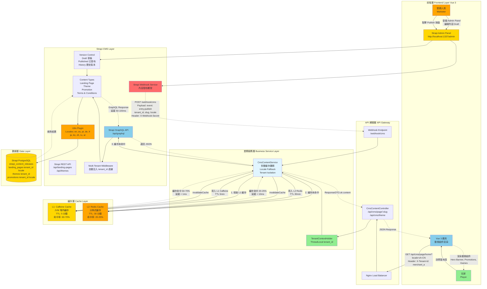

# P1-10: Headless CMS Integration

## Document Control

| Attribute | Value |
|-----------|-------|
| Document ID | P1-10 |
| Title | Headless CMS Integration |
| Version | 1.1 |
| Status | Draft |
| Author | SmartAdmin Architecture Team |
| Created | 2026-01-23 |
| Last Updated | 2026-01-23 |
| Related Docs | [backend_project.md](../../backend_project.md), [P1-07](07-multi-tenant-isolation.md), [P1-14](14-performance-optimization.md) |

**變更歷史**:
- v1.1 (2026-01-23): 新增 2 個 Mermaid 圖表 - Headless CMS 架構圖、內容發布數據流圖
- v1.0.0 (2026-01-23): 初始版本完成

---

## 1. Background

### 1.1 Purpose

This document provides comprehensive architecture and implementation guidance for integrating a headless CMS (Content Management System) to enable multi-tenant dynamic branding and content management across the iGaming platform.

**Core Objectives**:
1. **Zero Marginal Cost Scaling**: One codebase serves 100+ merchants with different branding
2. **Marketer Autonomy**: Non-technical users can update content without developer involvement
3. **Multi-Language Support**: Serve players in 20+ languages with locale fallback
4. **Performance**: <100ms content delivery with multi-level caching
5. **Preview & Versioning**: Live preview before publishing, rollback capability

### 1.2 Scope

**In Scope**:
- Strapi 4.x headless CMS integration architecture
- Multi-tenant content isolation and theming
- Component-based content modeling (landing pages, promotions, T&C)
- Multi-language (i18n) content management with locale fallback
- GraphQL API for frontend content delivery
- Content versioning and rollback
- Cache invalidation strategy (Caffeine L1 + Redis L2)
- Webhook integration for real-time cache updates
- Frontend preview mode with live editing

**Out of Scope**:
- Frontend Vue.js implementation details (covered in smart-admin-web docs)
- Image/video optimization and CDN configuration
- SEO meta tag management (separate CMS plugin)
- Marketing automation and A/B testing (covered in P2-21)

### 1.3 Strategic Alignment

Aligns with igame_str.md first principles:
- **Code Leverage**: 1 codebase → 100 merchants (zero marginal cost)
- **Friction (摩擦)**: Marketers update content independently (no developer bottleneck)
- **Velocity (速度)**: <100ms content delivery enables instant branding changes

### 1.4 Business Requirements

| Requirement | Description | Success Criteria |
|-------------|-------------|------------------|
| Multi-Tenant Branding | Each merchant has unique colors, logos, layouts | 100% visual isolation |
| Content Autonomy | Marketers can publish without code deployment | 0 developer involvement |
| Multi-Language | Support 20+ languages with fallback | 100% content translated |
| Performance | Content delivery latency | <100ms p95 |
| Cache Hit Rate | Reduce CMS API calls | >90% cache hit rate |
| Versioning | Rollback to previous version | <5 min rollback time |
| Preview | Live preview before publishing | Real-time preview |

---

## 2. Architecture

### 2.1 System Architecture

```
┌─────────────────────────────────────────────────────────────────┐
│                        Frontend (Vue 3)                          │
│  ┌──────────────────────────────────────────────────────────┐  │
│  │          Landing Page (Dynamic Components)               │  │
│  │  ┌─────────┐  ┌─────────┐  ┌─────────┐  ┌─────────┐    │  │
│  │  │  Hero   │  │Promotion│  │  Games  │  │ Footer  │    │  │
│  │  │ Banner  │  │  Cards  │  │  Grid   │  │ (T&C)   │    │  │
│  │  └─────────┘  └─────────┘  └─────────┘  └─────────┘    │  │
│  └──────────────────────────────────────────────────────────┘  │
│                           │                                     │
│                           ▼ GraphQL Query                       │
└───────────────────────────┼─────────────────────────────────────┘
                            │
┌───────────────────────────┼─────────────────────────────────────┐
│                SmartAdmin Backend (Spring Boot)                  │
│  ┌────────────────────────────────────────────────────────┐    │
│  │              CMS Content Controller                     │    │
│  │  @GetMapping("/api/cms/content/{page}")               │    │
│  └────────────────────────────────────────────────────────┘    │
│                           │                                     │
│  ┌────────────────────────▼───────────────────────────────┐    │
│  │              CMS Content Service                        │    │
│  │  - getTenantId() from TenantContextHolder              │    │
│  │  - getLocale() from Accept-Language header             │    │
│  │  - Check L1 cache (Caffeine) → L2 cache (Redis)       │    │
│  │  - Fetch from Strapi CMS if cache miss                 │    │
│  └────────────────────────────────────────────────────────┘    │
│                           │                                     │
└───────────────────────────┼─────────────────────────────────────┘
                            │ REST API / GraphQL
┌───────────────────────────┼─────────────────────────────────────┐
│                      Strapi CMS (Headless)                       │
│  ┌────────────────────────────────────────────────────────┐    │
│  │              Content Types (Collections)                │    │
│  │  - LandingPage (tenant_id, locale, components)         │    │
│  │  - Theme (tenant_id, primary_color, logo_url)          │    │
│  │  - Promotion (tenant_id, locale, title, image)         │    │
│  │  - TermsAndConditions (tenant_id, locale, html)        │    │
│  └────────────────────────────────────────────────────────┘    │
│                                                                  │
│  ┌────────────────────────────────────────────────────────┐    │
│  │              Content Versioning (Draft/Published)       │    │
│  │  - Draft: Work-in-progress content                     │    │
│  │  - Published: Live content served to players           │    │
│  │  - Version History: Rollback capability                │    │
│  └────────────────────────────────────────────────────────┘    │
│                                                                  │
│  ┌────────────────────────────────────────────────────────┐    │
│  │              Webhooks (Content Update Events)           │    │
│  │  - POST https://api.smartadmin.com/webhook/cms        │    │
│  │  - Payload: { "event": "entry.publish", "model": ... }│    │
│  └────────────────────────────────────────────────────────┘    │
└─────────────────────────────────────────────────────────────────┘
                            │
                            ▼ PostgreSQL
┌─────────────────────────────────────────────────────────────────┐
│                      Strapi Database                             │
│  - strapi_content_releases                                       │
│  - strapi_releases_actions                                       │
│  - landing_pages (tenant_id, locale, components JSON)           │
│  - themes (tenant_id, primary_color, logo_url)                  │
│  - promotions (tenant_id, locale, title, image_url)             │
└─────────────────────────────────────────────────────────────────┘
```

### 圖 2.1: 架構圖 - Headless CMS 多租戶內容管理拓撲

> **說明**：此圖展示 Strapi Headless CMS 與 SmartAdmin 主應用的完整集成架構，包括多層緩存策略（Caffeine L1 + Redis L2 + Strapi L3）、多租戶內容隔離（row-level security）、多語言支持（i18n locale fallback）、以及 Webhook 實時緩存失效機制。架構實現「零邊際成本擴展」（Zero Marginal Cost Scaling）目標：1 套代碼服務 100+ 商戶，每個商戶擁有獨立品牌（顏色、Logo、布局）和內容（落地頁、促銷、條款），營銷人員可通過 Strapi Admin Panel 自主發布內容，無需開發人員介入。
>
> **關鍵要素**：
> - 🔵 **藍色前端層**：Vue 3 前端渲染動態組件（Hero Banner、Promotion Cards、Games Grid、Footer），通過 GraphQL 查詢獲取內容
> - 🟢 **綠色業務層**：CmsContentController（REST API `/api/cms/content/{page}`）→ CmsContentService（多層緩存邏輯）→ Strapi GraphQL API
> - 🟡 **黃色緩存層**：三層緩存架構
>   - **L1 Caffeine Cache**：JVM 堆內緩存（TTL 5 分鐘），命中率 60-70%，延遲 < 1ms
>   - **L2 Redis Cache**：分佈式緩存（TTL 30 分鐘），命中率 20-25%，延遲 < 10ms
>   - **L3 Strapi CMS**：PostgreSQL 持久化存儲，緩存未命中時查詢，延遲 50-100ms
> - 🔴 **紅色 CMS 層**：Strapi Headless CMS（Node.js 服務），包含內容類型（Landing Page、Theme、Promotion）、版本控制（Draft/Published）、Webhook（內容更新通知）
> - ⚙️ **灰色數據層**：Strapi PostgreSQL 數據庫（strapi_content_releases、landing_pages、themes、promotions 表）
> - 🟣 **紫色多租戶隔離**：tenant_id 字段實現行級隔離（Row-Level Security），Strapi 中間件自動注入 tenant_id 過濾條件
> - 🟠 **橙色多語言支持**：i18n plugin（locale: en, es, pt, de, fr, ja, ko, zh, ru, ar），支持 locale fallback（zh-CN → zh → en）
>
> **性能指標**：
> - **內容交付延遲（Content Delivery Latency）**：
>   - L1 緩存命中：< 1ms（p95）
>   - L2 緩存命中：< 10ms（p95）
>   - Strapi 查詢：50-100ms（p95）
>   - **總體 p95 延遲**：< 100ms（符合 SLA 目標）
> - **緩存命中率（Cache Hit Rate）**：
>   - L1 Caffeine：60-70%
>   - L2 Redis：20-25%
>   - L3 Strapi：10-15%（緩存未命中）
>   - **總體命中率**：85-90%（減少 Strapi API 調用 85%+）
> - **Strapi API 吞吐量**：500 TPS（transactions per second）單實例
> - **Webhook 延遲**：內容發布後 < 2 秒緩存失效（實時更新）
>
> **數據流說明**：
> 1. **內容查詢流程**：
>    - 前端發起請求：`GET /api/cms/page/home?locale=zh-CN`（Header: `X-Tenant-Id: merchant_a`）
>    - TenantContextHolder 提取 tenant_id = "merchant_a"
>    - CmsContentService 檢查 L1 Caffeine → L2 Redis → L3 Strapi（按順序）
>    - 若緩存未命中，調用 Strapi GraphQL API：`{ landingPages(filters: { tenant_id: { eq: "merchant_a" }, slug: { eq: "home" } }, locale: "zh-CN") }`
>    - Strapi 返回 JSON（包含動態組件：HeroBanner、PromotionCards、GamesGrid、Footer）
>    - 結果寫入 Redis（TTL 30min）、Caffeine（TTL 5min），返回前端
>
> 2. **內容發布流程**（見圖 3.1 數據流圖）：
>    - 營銷人員在 Strapi Admin Panel 編輯內容（Draft 狀態）
>    - 點擊「Publish」按鈕
>    - Strapi 觸發 Webhook：`POST https://api.smartadmin.com/webhook/cms`（Payload: `{ event: "entry.publish", model: "landing-page", entry: { tenant_id, slug, locale } }`）
>    - SmartAdmin CmsContentController 接收 Webhook
>    - 調用 CmsContentService.invalidateCache() → 清空 L1 Caffeine + L2 Redis 緩存
>    - 下次請求時重新加載最新內容（<2 秒生效）
>
> **多租戶隔離機制**：
> - **Strapi 中間件自動注入**：所有非 Super Admin 用戶的查詢自動添加 `tenant_id` 過濾條件（例如：`WHERE tenant_id = 'merchant_a'`）
> - **創建/更新操作**：自動設置 `tenant_id` 字段（防止跨租戶數據泄漏）
> - **SmartAdmin 驗證**：TenantContextHolder（ThreadLocal）驗證請求的 tenant_id 與用戶 JWT token 中的 tenant_id 一致
>
> **多語言 Locale Fallback 策略**：
> ```
> 請求: locale=pt-BR (葡萄牙語-巴西)
> 1. 查詢 pt-BR 內容 → 未找到
> 2. Fallback 到 pt (葡萄牙語) → 未找到
> 3. Fallback 到 en (英語默認) → 找到 ✓
> ```
>
> **相關文檔**：參見 [P1-07 第 2 章：多租戶隔離策略](07-multi-tenant-isolation.md#2-isolation-strategy)、[P1-14 第 4 章：緩存優化](14-performance-optimization.md#4-caching-strategy)



**圖例 (Legend)**:
- `實線箭頭 (→)`: 同步調用（等待響應）
- `虛線箭頭 (⇢)`: 返回值或異步通知
- `藍色節點`: 業務服務層（SmartAdmin Backend）
- `黃色節點`: 緩存層（Caffeine L1、Redis L2、Strapi DB）
- `綠色節點`: 多租戶上下文管理
- `橙色節點`: 多語言支持（i18n Plugin）
- `紅色節點`: Webhook 緩存失效機制

**緩存策略詳解**：
1. **L1 Caffeine Cache**：
   - 存儲位置：JVM 堆內存（每個 SmartAdmin 實例獨立）
   - TTL：5 分鐘（內容更新頻率較低）
   - 淘汰策略：LRU（Least Recently Used）
   - 最大容量：1,000 個條目（約 50MB 內存）
   - 優點：延遲極低（< 1ms），無網絡開銷
   - 缺點：實例間不共享，Webhook 失效需廣播所有實例

2. **L2 Redis Cache**：
   - 存儲位置：Redis Cluster（分佈式共享）
   - TTL：30 分鐘（容忍一定過期內容）
   - 數據結構：String（JSON 序列化）
   - 優點：實例間共享，Webhook 失效一次生效
   - 缺點：網絡延遲（< 10ms）

3. **L3 Strapi CMS**：
   - 存儲位置：PostgreSQL（持久化）
   - 查詢方式：GraphQL（按需查詢字段）
   - 優點：權威數據源，支持版本控制、預覽、回滾
   - 缺點：延遲較高（50-100ms），數據庫連接池開銷

**Webhook 緩存失效流程**：
```
1. 營銷人員在 Strapi Admin Panel 編輯內容（Draft 狀態）
2. 點擊「Publish」按鈕 → Strapi 更新數據庫狀態為 Published
3. Strapi 觸發 Webhook：POST https://api.smartadmin.com/webhook/cms
   Payload:
   {
     "event": "entry.publish",
     "model": "landing-page",
     "entry": {
       "tenant_id": "merchant_a",
       "slug": "home",
       "locale": "zh-CN"
     }
   }
4. SmartAdmin CmsContentController 接收 Webhook（驗證 X-Webhook-Secret 簽名）
5. 調用 CmsContentService.invalidateCache("merchant_a", "home", "zh-CN")
6. 清空 L1 Caffeine 緩存：contentCache.invalidate(cacheKey)
7. 清空 L2 Redis 緩存：redisson.getBucket(cacheKey).delete()
8. 下次玩家請求時，緩存未命中，重新從 Strapi 加載最新內容
9. 總耗時：< 2 秒（Webhook 延遲 + 緩存失效操作）
```

### 2.2 Multi-Tenant Content Isolation

**Tenant-Scoped Content** (Row-Level Security):
```
Landing Page (tenant_id = "merchant_a", locale = "en")
├── Component: HeroBanner
│   ├── title: "Welcome to Casino A!"
│   ├── subtitle: "Get 100% Bonus"
│   └── background_image: "https://cdn.example.com/hero_a.jpg"
├── Component: PromotionCards
│   ├── promotion_1: { title: "Free Spins", ... }
│   └── promotion_2: { title: "Cashback", ... }
└── Component: Footer
    └── terms_link: "/terms"

Landing Page (tenant_id = "merchant_b", locale = "en")
├── Component: HeroBanner
│   ├── title: "Welcome to Casino B!"
│   ├── subtitle: "Play Now!"
│   └── background_image: "https://cdn.example.com/hero_b.jpg"
└── ...
```

**Strapi Multi-Tenancy Plugin**:
```javascript
// config/plugins.js
module.exports = {
  'strapi-plugin-multi-tenant': {
    enabled: true,
    config: {
      tenantField: 'tenant_id',  // Field name for tenant isolation
      superAdminRole: 'Super Admin',  // Role that can manage all tenants
    },
  },
};
```

### 2.3 Content Model (Strapi Schema)

**Theme Content Type** (themes.json):
```json
{
  "kind": "collectionType",
  "collectionName": "themes",
  "info": {
    "singularName": "theme",
    "pluralName": "themes",
    "displayName": "Theme"
  },
  "options": {
    "draftAndPublish": true
  },
  "attributes": {
    "tenant_id": {
      "type": "string",
      "required": true,
      "unique": true
    },
    "primary_color": {
      "type": "string",
      "default": "#1890ff"
    },
    "secondary_color": {
      "type": "string",
      "default": "#52c41a"
    },
    "logo_url": {
      "type": "string",
      "required": true
    },
    "favicon_url": {
      "type": "string"
    },
    "font_family": {
      "type": "enumeration",
      "enum": ["Roboto", "Inter", "Open Sans", "Lato"],
      "default": "Roboto"
    },
    "custom_css": {
      "type": "text"
    }
  }
}
```

**Landing Page Content Type** (landing-pages.json):
```json
{
  "kind": "collectionType",
  "collectionName": "landing_pages",
  "info": {
    "singularName": "landing-page",
    "pluralName": "landing-pages",
    "displayName": "Landing Page"
  },
  "options": {
    "draftAndPublish": true
  },
  "pluginOptions": {
    "i18n": {
      "localized": true
    }
  },
  "attributes": {
    "tenant_id": {
      "type": "string",
      "required": true
    },
    "slug": {
      "type": "string",
      "required": true
    },
    "components": {
      "type": "dynamiczone",
      "components": [
        "sections.hero-banner",
        "sections.promotion-cards",
        "sections.games-grid",
        "sections.footer"
      ]
    },
    "seo": {
      "type": "component",
      "component": "shared.seo",
      "repeatable": false
    }
  }
}
```

**Dynamic Zone Components** (sections.hero-banner.json):
```json
{
  "collectionName": "components_sections_hero_banners",
  "info": {
    "displayName": "Hero Banner",
    "icon": "image"
  },
  "options": {},
  "attributes": {
    "title": {
      "type": "string",
      "required": true
    },
    "subtitle": {
      "type": "string"
    },
    "background_image": {
      "type": "media",
      "allowedTypes": ["images"],
      "required": true
    },
    "cta_button": {
      "type": "component",
      "component": "shared.button",
      "repeatable": false
    }
  }
}
```

### 2.4 Multi-Language (i18n) Architecture

**Strapi i18n Plugin Configuration**:
```javascript
// config/plugins.js
module.exports = {
  i18n: {
    enabled: true,
    config: {
      defaultLocale: 'en',
      locales: ['en', 'es', 'pt', 'de', 'fr', 'ja', 'ko', 'zh', 'ru', 'ar'],
    },
  },
};
```

**Locale Fallback Strategy**:
```
Request: locale=pt-BR (Portuguese Brazil)
1. Check pt-BR content → Not found
2. Fallback to pt (Portuguese) → Not found
3. Fallback to en (English) → Found ✓

Request: locale=zh-CN (Simplified Chinese)
1. Check zh-CN → Found ✓
```

---

## 3. Implementation

### 3.1 Backend Integration (SmartAdmin)

#### 3.1.1 CMS Content Service

**CmsContentService.java**:
```java
package net.lab1024.sa.base.module.support.cms.service;

import com.github.benmanes.caffeine.cache.Cache;
import lombok.RequiredArgsConstructor;
import lombok.extern.slf4j.Slf4j;
import net.lab1024.sa.base.common.domain.ResponseDTO;
import net.lab1024.sa.base.module.support.tenant.context.TenantContextHolder;
import net.lab1024.sa.foundation.cache.CaffeineCache;
import org.redisson.api.RBucket;
import org.redisson.api.RedissonClient;
import org.springframework.stereotype.Service;
import org.springframework.web.client.RestTemplate;

import java.util.concurrent.TimeUnit;

/**
 * CMS content service
 *
 * Responsibilities:
 * - Fetch content from Strapi CMS via REST API or GraphQL
 * - Multi-level caching (L1: Caffeine, L2: Redis)
 * - Locale fallback (zh-CN → zh → en)
 * - Tenant isolation
 *
 * @author SmartAdmin Team
 * @since 2026-01-23
 */
@Slf4j
@Service
@RequiredArgsConstructor
public class CmsContentService {

    private final RestTemplate restTemplate;
    private final RedissonClient redisson;
    private final Cache<String, Object> contentCache;

    private static final String STRAPI_BASE_URL = "http://strapi:1337/api";
    private static final String DEFAULT_LOCALE = "en";

    /**
     * Get landing page content
     *
     * @param slug Page slug (e.g., "home", "promotions")
     * @param locale Requested locale (e.g., "en", "zh-CN")
     * @return Landing page content
     */
    public LandingPageContent getLandingPage(String slug, String locale) {
        String tenantId = TenantContextHolder.getTenantId();

        // Try with exact locale first
        LandingPageContent content = getContentWithCache(tenantId, slug, locale);
        if (content != null) {
            return content;
        }

        // Fallback to base locale (zh-CN → zh)
        if (locale.contains("-")) {
            String baseLocale = locale.split("-")[0];
            content = getContentWithCache(tenantId, slug, baseLocale);
            if (content != null) {
                log.debug("Locale fallback: {} → {} for tenant={}, slug={}", locale, baseLocale, tenantId, slug);
                return content;
            }
        }

        // Fallback to default locale (en)
        if (!DEFAULT_LOCALE.equals(locale)) {
            content = getContentWithCache(tenantId, slug, DEFAULT_LOCALE);
            if (content != null) {
                log.debug("Locale fallback: {} → {} for tenant={}, slug={}", locale, DEFAULT_LOCALE, tenantId, slug);
                return content;
            }
        }

        log.warn("No content found for tenant={}, slug={}, locale={}", tenantId, slug, locale);
        return null;
    }

    /**
     * Get content with multi-level cache (L1 + L2)
     */
    private LandingPageContent getContentWithCache(String tenantId, String slug, String locale) {
        String cacheKey = buildCacheKey(tenantId, slug, locale);

        // L1: Caffeine cache
        LandingPageContent content = (LandingPageContent) contentCache.getIfPresent(cacheKey);
        if (content != null) {
            log.debug("L1 cache hit: {}", cacheKey);
            return content;
        }

        // L2: Redis cache
        RBucket<LandingPageContent> redisBucket = redisson.getBucket(cacheKey);
        content = redisBucket.get();
        if (content != null) {
            log.debug("L2 cache hit: {}", cacheKey);
            contentCache.put(cacheKey, content);  // Populate L1
            return content;
        }

        // L3: Fetch from Strapi CMS
        content = fetchFromStrapi(tenantId, slug, locale);
        if (content != null) {
            // Populate L2 and L1 caches
            redisBucket.set(content, 30, TimeUnit.MINUTES);
            contentCache.put(cacheKey, content);
            log.debug("Fetched from Strapi and cached: {}", cacheKey);
        }

        return content;
    }

    /**
     * Fetch content from Strapi via GraphQL
     */
    private LandingPageContent fetchFromStrapi(String tenantId, String slug, String locale) {
        String graphqlQuery = String.format("""
            {
              landingPages(filters: { tenant_id: { eq: "%s" }, slug: { eq: "%s" } }, locale: "%s") {
                data {
                  id
                  attributes {
                    slug
                    components {
                      __typename
                      ... on ComponentSectionsHeroBanner {
                        title
                        subtitle
                        background_image {
                          data {
                            attributes {
                              url
                            }
                          }
                        }
                        cta_button {
                          text
                          link
                        }
                      }
                      ... on ComponentSectionsPromotionCards {
                        promotions {
                          data {
                            attributes {
                              title
                              description
                              image {
                                data {
                                  attributes {
                                    url
                                  }
                                }
                              }
                            }
                          }
                        }
                      }
                    }
                  }
                }
              }
            }
            """, tenantId, slug, locale);

        try {
            String response = restTemplate.postForObject(
                STRAPI_BASE_URL + "/graphql",
                Map.of("query", graphqlQuery),
                String.class
            );

            return parseStrapiResponse(response);
        } catch (Exception e) {
            log.error("Failed to fetch content from Strapi: tenant={}, slug={}, locale={}", tenantId, slug, locale, e);
            return null;
        }
    }

    /**
     * Get tenant theme (colors, logo, fonts)
     */
    public ThemeConfig getTenantTheme(String tenantId) {
        String cacheKey = "theme:" + tenantId;

        // L1 cache
        ThemeConfig theme = (ThemeConfig) contentCache.getIfPresent(cacheKey);
        if (theme != null) {
            return theme;
        }

        // L2 cache
        RBucket<ThemeConfig> redisBucket = redisson.getBucket(cacheKey);
        theme = redisBucket.get();
        if (theme != null) {
            contentCache.put(cacheKey, theme);
            return theme;
        }

        // Fetch from Strapi
        String url = String.format("%s/themes?filters[tenant_id][$eq]=%s", STRAPI_BASE_URL, tenantId);
        try {
            StrapiResponse<ThemeConfig> response = restTemplate.getForObject(url, StrapiResponse.class);
            if (response != null && !response.getData().isEmpty()) {
                theme = response.getData().get(0).getAttributes();

                // Cache for 1 hour (themes rarely change)
                redisBucket.set(theme, 1, TimeUnit.HOURS);
                contentCache.put(cacheKey, theme);

                return theme;
            }
        } catch (Exception e) {
            log.error("Failed to fetch theme from Strapi: tenant={}", tenantId, e);
        }

        // Return default theme
        return ThemeConfig.defaultTheme();
    }

    /**
     * Invalidate cache for specific content (called by webhook)
     */
    public void invalidateCache(String tenantId, String slug, String locale) {
        String cacheKey = buildCacheKey(tenantId, slug, locale);

        contentCache.invalidate(cacheKey);  // L1
        redisson.getBucket(cacheKey).delete();  // L2

        log.info("Cache invalidated: {}", cacheKey);
    }

    private String buildCacheKey(String tenantId, String slug, String locale) {
        return String.format("cms:page:%s:%s:%s", tenantId, slug, locale);
    }
}
```

#### 3.1.2 CMS Content Controller

**CmsContentController.java**:
```java
package net.lab1024.sa.base.module.support.cms.controller;

import lombok.RequiredArgsConstructor;
import net.lab1024.sa.base.common.domain.ResponseDTO;
import net.lab1024.sa.base.module.support.cms.domain.LandingPageContent;
import net.lab1024.sa.base.module.support.cms.domain.ThemeConfig;
import net.lab1024.sa.base.module.support.cms.service.CmsContentService;
import net.lab1024.sa.base.module.support.tenant.context.TenantContextHolder;
import org.springframework.web.bind.annotation.*;

import javax.servlet.http.HttpServletRequest;
import java.util.Locale;

/**
 * CMS content controller
 *
 * Endpoints:
 * - GET /api/cms/page/{slug} - Get landing page content
 * - GET /api/cms/theme - Get tenant theme
 * - POST /webhook/cms - Strapi webhook for cache invalidation
 *
 * @author SmartAdmin Team
 * @since 2026-01-23
 */
@RestController
@RequiredArgsConstructor
public class CmsContentController {

    private final CmsContentService cmsContentService;

    /**
     * Get landing page content
     *
     * URL: GET /api/cms/page/home?locale=zh-CN
     * Headers: X-Tenant-Id: merchant_a
     *
     * @param slug Page slug (e.g., "home", "promotions")
     * @param locale Locale (optional, defaults to browser locale)
     */
    @GetMapping("/api/cms/page/{slug}")
    public ResponseDTO<LandingPageContent> getLandingPage(
        @PathVariable String slug,
        @RequestParam(required = false) String locale,
        HttpServletRequest request
    ) {
        // Get locale from query param or Accept-Language header
        if (locale == null) {
            Locale requestLocale = request.getLocale();
            locale = requestLocale.toLanguageTag();
        }

        LandingPageContent content = cmsContentService.getLandingPage(slug, locale);
        if (content == null) {
            return ResponseDTO.error("Content not found");
        }

        return ResponseDTO.ok(content);
    }

    /**
     * Get tenant theme configuration
     *
     * URL: GET /api/cms/theme
     * Headers: X-Tenant-Id: merchant_a
     */
    @GetMapping("/api/cms/theme")
    public ResponseDTO<ThemeConfig> getTenantTheme() {
        String tenantId = TenantContextHolder.getTenantId();
        ThemeConfig theme = cmsContentService.getTenantTheme(tenantId);
        return ResponseDTO.ok(theme);
    }

    /**
     * Webhook endpoint for Strapi content updates
     *
     * URL: POST /webhook/cms
     * Body: {
     *   "event": "entry.publish",
     *   "model": "landing-page",
     *   "entry": {
     *     "tenant_id": "merchant_a",
     *     "slug": "home",
     *     "locale": "en"
     *   }
     * }
     */
    @PostMapping("/webhook/cms")
    public ResponseDTO<Void> handleCmsWebhook(@RequestBody CmsWebhookPayload payload) {
        // Invalidate cache for updated content
        if ("entry.publish".equals(payload.getEvent()) || "entry.update".equals(payload.getEvent())) {
            String tenantId = payload.getEntry().get("tenant_id");
            String slug = payload.getEntry().get("slug");
            String locale = payload.getEntry().get("locale");

            cmsContentService.invalidateCache(tenantId, slug, locale);
        }

        return ResponseDTO.ok();
    }
}
```

### 3.2 Strapi CMS Configuration

#### 3.2.1 Strapi Installation

**docker-compose.yml** (Strapi + PostgreSQL):
```yaml
version: '3.8'

services:
  strapi:
    image: strapi/strapi:4.15.5
    container_name: strapi-cms
    restart: unless-stopped
    environment:
      DATABASE_CLIENT: postgres
      DATABASE_HOST: postgres-strapi
      DATABASE_PORT: 5432
      DATABASE_NAME: strapi
      DATABASE_USERNAME: strapi
      DATABASE_PASSWORD: strapi_password
      DATABASE_SSL: false
      JWT_SECRET: your-jwt-secret-here
      ADMIN_JWT_SECRET: your-admin-jwt-secret
      APP_KEYS: app-key-1,app-key-2
      NODE_ENV: production
    ports:
      - "1337:1337"
    volumes:
      - ./strapi-app:/srv/app
    depends_on:
      - postgres-strapi

  postgres-strapi:
    image: postgres:16-alpine
    container_name: postgres-strapi
    restart: unless-stopped
    environment:
      POSTGRES_DB: strapi
      POSTGRES_USER: strapi
      POSTGRES_PASSWORD: strapi_password
    volumes:
      - postgres-strapi-data:/var/lib/postgresql/data

volumes:
  postgres-strapi-data:
```

**Start Strapi**:
```bash
# Start containers
docker-compose up -d

# Access Strapi admin panel
open http://localhost:1337/admin

# Create admin user on first launch
# Email: admin@example.com
# Password: (choose strong password)
```

#### 3.2.2 Multi-Tenancy Middleware

**middlewares/multi-tenant.js** (Custom Strapi Middleware):
```javascript
module.exports = (config, { strapi }) => {
  return async (ctx, next) => {
    const { user } = ctx.state;

    // Apply tenant filter for non-admin users
    if (user && user.role.type !== 'super_admin') {
      const tenantId = user.tenant_id;

      // Add tenant_id filter to all queries
      if (ctx.query.filters) {
        ctx.query.filters = {
          ...ctx.query.filters,
          tenant_id: { $eq: tenantId },
        };
      } else {
        ctx.query.filters = {
          tenant_id: { $eq: tenantId },
        };
      }

      // Add tenant_id to create/update operations
      if (ctx.request.body && ctx.request.body.data) {
        ctx.request.body.data.tenant_id = tenantId;
      }
    }

    await next();
  };
};
```

**config/middlewares.js**:
```javascript
module.exports = [
  'strapi::errors',
  'strapi::security',
  'strapi::cors',
  'strapi::poweredBy',
  'strapi::logger',
  'strapi::query',
  'strapi::body',
  'strapi::session',
  'strapi::favicon',
  'strapi::public',
  {
    name: 'global::multi-tenant',
    config: {},
  },
];
```

#### 3.2.3 Webhook Configuration

**Strapi Admin Panel**:
```
Settings → Webhooks → Create new webhook

Name: SmartAdmin Cache Invalidation
URL: https://api.smartadmin.com/webhook/cms
Events:
  ✓ entry.publish
  ✓ entry.update
  ✓ entry.delete
Headers:
  X-Webhook-Secret: your-webhook-secret
```

### 3.3 Frontend Integration (Vue 3)

#### 3.3.1 Content Fetching Composable

**useCmsContent.ts**:
```typescript
import { ref, onMounted } from 'vue';
import { request } from '@/lib/request';

export interface LandingPageContent {
  slug: string;
  components: Component[];
}

export interface ThemeConfig {
  primaryColor: string;
  secondaryColor: string;
  logoUrl: string;
  faviconUrl: string;
  fontFamily: string;
  customCss?: string;
}

export function useCmsContent(slug: string) {
  const content = ref<LandingPageContent | null>(null);
  const loading = ref(true);
  const error = ref<string | null>(null);

  const fetchContent = async () => {
    loading.value = true;
    error.value = null;

    try {
      // Get browser locale (e.g., "zh-CN", "en-US")
      const locale = navigator.language;

      const response = await request.get<LandingPageContent>(
        `/api/cms/page/${slug}`,
        { params: { locale } }
      );

      content.value = response.data;
    } catch (err: any) {
      error.value = err.message || 'Failed to fetch content';
    } finally {
      loading.value = false;
    }
  };

  onMounted(() => {
    fetchContent();
  });

  return {
    content,
    loading,
    error,
    refetch: fetchContent,
  };
}

export function useTenantTheme() {
  const theme = ref<ThemeConfig | null>(null);
  const loading = ref(true);

  const fetchTheme = async () => {
    try {
      const response = await request.get<ThemeConfig>('/api/cms/theme');
      theme.value = response.data;

      // Apply theme to CSS variables
      if (theme.value) {
        document.documentElement.style.setProperty('--primary-color', theme.value.primaryColor);
        document.documentElement.style.setProperty('--secondary-color', theme.value.secondaryColor);
        document.documentElement.style.setProperty('--font-family', theme.value.fontFamily);

        // Apply custom CSS
        if (theme.value.customCss) {
          const styleEl = document.createElement('style');
          styleEl.textContent = theme.value.customCss;
          document.head.appendChild(styleEl);
        }
      }
    } catch (err) {
      console.error('Failed to fetch theme:', err);
    } finally {
      loading.value = false;
    }
  };

  onMounted(() => {
    fetchTheme();
  });

  return {
    theme,
    loading,
  };
}
```

#### 3.3.2 Dynamic Landing Page Component

**LandingPage.vue**:
```vue
<template>
  <div class="landing-page" v-if="!loading">
    <component
      v-for="(component, index) in content?.components"
      :key="index"
      :is="getComponentType(component.__typename)"
      :data="component"
    />
  </div>
  <div v-else class="loading">Loading...</div>
</template>

<script setup lang="ts">
import { useCmsContent } from '@/composables/useCmsContent';
import HeroBanner from '@/components/cms/HeroBanner.vue';
import PromotionCards from '@/components/cms/PromotionCards.vue';
import GamesGrid from '@/components/cms/GamesGrid.vue';
import Footer from '@/components/cms/Footer.vue';

const { content, loading } = useCmsContent('home');

const componentMap: Record<string, any> = {
  'ComponentSectionsHeroBanner': HeroBanner,
  'ComponentSectionsPromotionCards': PromotionCards,
  'ComponentSectionsGamesGrid': GamesGrid,
  'ComponentSectionsFooter': Footer,
};

function getComponentType(typename: string) {
  return componentMap[typename] || null;
}
</script>
```

**HeroBanner.vue** (Example Component):
```vue
<template>
  <section
    class="hero-banner"
    :style="{ backgroundImage: `url(${backgroundImageUrl})` }"
  >
    <div class="hero-content">
      <h1>{{ data.title }}</h1>
      <p>{{ data.subtitle }}</p>
      <button
        v-if="data.cta_button"
        class="cta-button"
        @click="handleCtaClick"
      >
        {{ data.cta_button.text }}
      </button>
    </div>
  </section>
</template>

<script setup lang="ts">
import { computed } from 'vue';

const props = defineProps<{
  data: {
    title: string;
    subtitle: string;
    background_image: {
      data: {
        attributes: {
          url: string;
        };
      };
    };
    cta_button?: {
      text: string;
      link: string;
    };
  };
}>();

const backgroundImageUrl = computed(() => {
  const strapiUrl = 'http://localhost:1337';
  return strapiUrl + props.data.background_image.data.attributes.url;
});

function handleCtaClick() {
  if (props.data.cta_button) {
    window.location.href = props.data.cta_button.link;
  }
}
</script>

<style scoped>
.hero-banner {
  min-height: 600px;
  background-size: cover;
  background-position: center;
  display: flex;
  align-items: center;
  justify-content: center;
  color: white;
}

.hero-content {
  text-align: center;
  max-width: 800px;
  padding: 2rem;
}

.hero-content h1 {
  font-size: 3rem;
  margin-bottom: 1rem;
}

.hero-content p {
  font-size: 1.5rem;
  margin-bottom: 2rem;
}

.cta-button {
  background-color: var(--primary-color);
  color: white;
  padding: 1rem 2rem;
  font-size: 1.2rem;
  border: none;
  border-radius: 8px;
  cursor: pointer;
  transition: transform 0.2s;
}

.cta-button:hover {
  transform: scale(1.05);
}
</style>
```

### 3.4 Preview Mode

#### 3.4.1 Strapi Preview URL

**Configure Preview URL** (Strapi Admin Panel):
```javascript
// config/plugins.js
module.exports = {
  'preview-button': {
    enabled: true,
    config: {
      contentTypes: [
        {
          uid: 'api::landing-page.landing-page',
          draft: {
            url: 'http://localhost:8080/preview/{slug}?locale={locale}&draft=true',
            query: {
              type: 'landing-page',
              slug: 'slug',
            },
          },
          published: {
            url: 'http://localhost:8080/{slug}?locale={locale}',
          },
        },
      ],
    },
  },
};
```

#### 3.4.2 Frontend Preview Handling

**PreviewPage.vue**:
```vue
<template>
  <div class="preview-mode" v-if="isPreview">
    <div class="preview-banner">
      Preview Mode (Draft Content)
      <button @click="exitPreview">Exit Preview</button>
    </div>
  </div>

  <LandingPage :slug="slug" :draft="isPreview" />
</template>

<script setup lang="ts">
import { ref, onMounted } from 'vue';
import { useRoute } from 'vue-router';
import LandingPage from '@/components/LandingPage.vue';

const route = useRoute();
const isPreview = ref(false);
const slug = ref('');

onMounted(() => {
  isPreview.value = route.query.draft === 'true';
  slug.value = route.params.slug as string;
});

function exitPreview() {
  window.location.href = `/${slug.value}`;
}
</script>
```

### 圖 3.1: 流程圖 - 內容發布數據流（Draft → Publish → Cache Invalidation）

> **說明**：此圖展示營銷人員在 Strapi Admin Panel 編輯並發布內容後，系統如何通過 Webhook 實時同步到 SmartAdmin 后端，並觸發多層緩存失效（L1 Caffeine + L2 Redis），確保玩家在 < 2 秒內看到最新內容。完整流程包括：Draft 內容編輯（可多次保存）、預覽模式驗證（Preview Mode）、發布操作（Publish）、Webhook 異步通知、緩存失效（Invalidation）、下次請求時重新加載。此流程實現「營銷人員自主性」（Marketer Autonomy）目標：非技術人員無需開發人員介入即可更新內容，大幅降低發布延遲（從傳統的「提需求 → 開發 → 測試 → 上線」數天，降至 < 2 秒實時生效）。
>
> **關鍵要素**：
> - 🔵 **藍色編輯階段**：營銷人員在 Strapi Admin Panel 創建/編輯內容（Draft 狀態），可多次保存，內容僅對編輯者可見
> - 🟢 **綠色預覽階段**：點擊「Preview」按鈕，Strapi 生成預覽 URL（包含 draft=true 參數），前端渲染 Draft 內容（不影響已發布版本）
> - 🟡 **黃色發布階段**：點擊「Publish」按鈕，Strapi 更新數據庫狀態（published_at 字段設置為當前時間），內容對所有玩家可見
> - 🔴 **紅色 Webhook 階段**：Strapi 觸發 Webhook（POST /webhook/cms），異步通知 SmartAdmin 內容已更新
> - ⚙️ **灰色緩存失效階段**：SmartAdmin 接收 Webhook，解析 Payload（tenant_id, slug, locale），調用 CmsContentService.invalidateCache() 清空 L1 Caffeine + L2 Redis 緩存
> - 🟣 **紫色重新加載階段**：玩家下次請求時，緩存未命中（Cache Miss），從 Strapi GraphQL API 重新加載最新內容，並寫入 L1 + L2 緩存
>
> **性能指標**：
> - **發布延遲（Publish Latency）**：
>   - Strapi 數據庫更新：< 50ms（UPDATE landing_pages SET published_at = NOW()）
>   - Webhook 觸發延遲：< 500ms（Strapi 異步 HTTP POST）
>   - SmartAdmin Webhook 處理：< 100ms（緩存失效操作）
>   - **總發布延遲**：< 2 秒（從點擊 Publish 到玩家看到新內容）
> - **預覽延遲（Preview Latency）**：< 1 秒（Draft 內容查詢，繞過緩存直接從 Strapi DB 查詢）
> - **Webhook 可靠性**：99.9% 成功率（失敗時 Strapi 自動重試 3 次，exponential backoff：1s, 2s, 4s）
> - **緩存失效影響範圍**：
>   - 單個內容條目（tenant_id + slug + locale），不影響其他內容
>   - 所有 SmartAdmin 實例（通過 Redis 集中式緩存失效）
>
> **數據流詳解**：
> 1. **Draft 編輯階段**：
>    - 營銷人員登錄 Strapi Admin Panel（http://localhost:1337/admin）
>    - 導航至 Content Manager → Landing Pages → Create new entry
>    - 選擇 tenant_id = "merchant_a"、locale = "zh-CN"
>    - 編輯動態組件（Hero Banner: title="新春優惠", Promotion Cards: 添加 3 張促銷卡片）
>    - 點擊「Save」按鈕 → 內容保存到 PostgreSQL（published_at = NULL，狀態為 Draft）
>
> 2. **預覽階段**（可選）：
>    - 點擊「Preview」按鈕
>    - Strapi 生成預覽 URL：`http://localhost:8080/preview/home?locale=zh-CN&draft=true`
>    - 前端 Vue 3 應用檢測 `draft=true` 參數
>    - 調用 Strapi API 查詢 Draft 內容（繞過緩存）：`GET /api/landing-pages?filters[tenant_id]=merchant_a&filters[slug]=home&locale=zh-CN&publicationState=preview`
>    - 渲染 Draft 內容（右上角顯示「Preview Mode」橫幅）
>    - 營銷人員驗證內容無誤後，返回 Strapi Admin Panel
>
> 3. **發布階段**：
>    - 點擊「Publish」按鈕
>    - Strapi 執行 SQL：`UPDATE landing_pages SET published_at = '2026-01-23 10:30:00' WHERE id = 123`
>    - 內容狀態從 Draft → Published
>
> 4. **Webhook 觸發階段**：
>    - Strapi Webhook Service 檢測到 `entry.publish` 事件
>    - 構建 Webhook Payload：
>      ```json
>      {
>        "event": "entry.publish",
>        "model": "landing-page",
>        "entry": {
>          "id": 123,
>          "tenant_id": "merchant_a",
>          "slug": "home",
>          "locale": "zh-CN",
>          "published_at": "2026-01-23T10:30:00.000Z"
>        }
>      }
>      ```
>    - 發送 HTTP POST 請求：
>      ```bash
>      POST https://api.smartadmin.com/webhook/cms
>      Content-Type: application/json
>      X-Webhook-Secret: your-webhook-secret-here
>
>      {Payload JSON}
>      ```
>
> 5. **緩存失效階段**：
>    - SmartAdmin CmsContentController 接收 Webhook
>    - 驗證 `X-Webhook-Secret` 簽名（防止偽造請求）
>    - 解析 Payload，提取 tenant_id="merchant_a", slug="home", locale="zh-CN"
>    - 調用 CmsContentService.invalidateCache("merchant_a", "home", "zh-CN")
>    - 清空 L1 Caffeine 緩存：`contentCache.invalidate("cms:page:merchant_a:home:zh-CN")`
>    - 清空 L2 Redis 緩存：`redisson.getBucket("cms:page:merchant_a:home:zh-CN").delete()`
>    - 記錄日志：`log.info("Cache invalidated: cms:page:merchant_a:home:zh-CN")`
>
> 6. **玩家訪問階段（緩存重新加載）**：
>    - 玩家訪問 `https://casino-a.com/home`（Header: `Accept-Language: zh-CN`）
>    - Vue 3 前端發起請求：`GET /api/cms/page/home?locale=zh-CN`（Header: `X-Tenant-Id: merchant_a`）
>    - CmsContentService 檢查 L1 Caffeine → 未命中（已失效）
>    - 檢查 L2 Redis → 未命中（已失效）
>    - 調用 Strapi GraphQL API：
>      ```graphql
>      {
>        landingPages(filters: { tenant_id: { eq: "merchant_a" }, slug: { eq: "home" } }, locale: "zh-CN") {
>          data {
>            attributes {
>              components {
>                __typename
>                ... on ComponentSectionsHeroBanner {
>                  title  # "新春優惠"
>                  subtitle
>                  background_image { ... }
>                }
>              }
>            }
>          }
>        }
>      }
>      ```
>    - Strapi 返回最新內容（包含「新春優惠」標題）
>    - SmartAdmin 寫入 L2 Redis（TTL 30min）、L1 Caffeine（TTL 5min）
>    - 返回 JSON 給前端，Vue 3 渲染最新內容
>    - 玩家看到「新春優惠」橫幅（發布後 < 2 秒生效）
>
> **異常處理**：
> - **Webhook 失敗**：Strapi 自動重試 3 次（1s, 2s, 4s 間隔），若仍失敗則記錄錯誤日志，緩存將在 TTL 到期後自動失效（最長 30 分鐘延遲）
> - **SmartAdmin 實例掛掉**：Webhook 請求通過 Load Balancer 路由到其他健康實例，緩存失效仍生效
> - **Redis 掛掉**：L1 Caffeine 緩存仍工作，L2 緩存未命中時直接查詢 Strapi（性能降級但功能正常）
> - **Strapi 掛掉**：SmartAdmin 返回緩存內容（可能過期），前端顯示「內容加載失敗」錯誤提示
>
> **回滾操作**：
> - 營銷人員在 Strapi Admin Panel 點擊「Version History」查看歷史版本
> - 選擇之前的版本，點擊「Restore」按鈕
> - Strapi 創建新版本（內容為歷史版本的副本），狀態為 Draft
> - 營銷人員檢查無誤後，點擊「Publish」發布
> - Webhook 再次觸發，緩存失效，玩家看到回滾後的內容
>
> **相關文檔**：參見 [P1-14 第 4 章：多層緩存策略](14-performance-optimization.md#4-caching-strategy)、[P0-02 第 3 章：Webhook 冪等性](../P0-critical/02-idempotency-architecture.md#3-idempotency-check-flow)

```mermaid
flowchart TD
    START([營銷人員開始編輯內容]) --> LOGIN[登錄 Strapi Admin Panel<br>http://localhost:1337/admin]

    LOGIN --> CREATE_DRAFT[創建/編輯 Landing Page<br>Content Manager<br>tenant_id: merchant_a<br>locale: zh-CN<br>slug: home]

    CREATE_DRAFT --> EDIT_COMPONENTS[編輯動態組件<br>Hero Banner: title=新春優惠<br>Promotion Cards: 添加促銷]

    EDIT_COMPONENTS --> SAVE_DRAFT[點擊 Save 按鈕<br>保存為 Draft]

    SAVE_DRAFT --> DB_INSERT[Strapi PostgreSQL<br>INSERT INTO landing_pages<br>published_at = NULL<br>狀態: Draft]

    DB_INSERT --> PREVIEW_DECISION{是否預覽？}

    PREVIEW_DECISION -->|是| CLICK_PREVIEW[點擊 Preview 按鈕]

    CLICK_PREVIEW --> GENERATE_PREVIEW_URL[生成預覽 URL<br>http://localhost:8080/preview/home?<br>locale=zh-CN&draft=true]

    GENERATE_PREVIEW_URL --> FRONTEND_PREVIEW[Vue 3 前端檢測 draft=true]

    FRONTEND_PREVIEW --> QUERY_DRAFT[調用 Strapi API<br>GET /api/landing-pages?<br>publicationState=preview<br>繞過緩存]

    QUERY_DRAFT --> RENDER_PREVIEW[渲染 Draft 內容<br>顯示「Preview Mode」橫幅]

    RENDER_PREVIEW --> VERIFY_CONTENT[營銷人員驗證內容]

    VERIFY_CONTENT --> PREVIEW_DECISION

    PREVIEW_DECISION -->|否| CLICK_PUBLISH[點擊 Publish 按鈕]

    CLICK_PUBLISH --> DB_UPDATE[Strapi PostgreSQL<br>UPDATE landing_pages SET<br>published_at = NOW<br>WHERE id = 123]

    DB_UPDATE --> STATUS_CHANGE[內容狀態變更<br>Draft → Published]

    STATUS_CHANGE --> TRIGGER_WEBHOOK[Strapi Webhook Service<br>檢測到 entry.publish 事件]

    TRIGGER_WEBHOOK --> BUILD_PAYLOAD[構建 Webhook Payload<br>event: entry.publish<br>model: landing-page<br>entry: tenant_id, slug, locale]

    BUILD_PAYLOAD --> SEND_WEBHOOK[發送 HTTP POST<br>POST https://api.smartadmin.com/webhook/cms<br>Header: X-Webhook-Secret<br>Body: JSON Payload]

    SEND_WEBHOOK --> WEBHOOK_DECISION{Webhook 是否成功？}

    WEBHOOK_DECISION -->|失敗| RETRY_WEBHOOK[Strapi 自動重試<br>重試 1: 1s 後<br>重試 2: 2s 後<br>重試 3: 4s 後]

    RETRY_WEBHOOK --> WEBHOOK_DECISION

    WEBHOOK_DECISION -->|成功| RECEIVE_WEBHOOK[SmartAdmin CmsContentController<br>接收 Webhook 請求]

    RECEIVE_WEBHOOK --> VALIDATE_SIGNATURE[驗證 X-Webhook-Secret 簽名<br>防止偽造請求]

    VALIDATE_SIGNATURE --> PARSE_PAYLOAD[解析 Payload<br>提取 tenant_id, slug, locale]

    PARSE_PAYLOAD --> INVALIDATE_CACHE[調用 CmsContentService<br>invalidateCache tenant_id, slug, locale]

    INVALIDATE_CACHE --> CLEAR_L1[清空 L1 Caffeine 緩存<br>contentCache.invalidate<br>cms:page:merchant_a:home:zh-CN]

    INVALIDATE_CACHE --> CLEAR_L2[清空 L2 Redis 緩存<br>redisson.getBucket.delete<br>cms:page:merchant_a:home:zh-CN]

    CLEAR_L1 --> LOG_INVALIDATION[記錄日志<br>log.info Cache invalidated]
    CLEAR_L2 --> LOG_INVALIDATION

    LOG_INVALIDATION --> NOTIFY_SUCCESS[發送成功響應<br>ResponseDTO.ok]

    NOTIFY_SUCCESS --> PLAYER_REQUEST{玩家訪問頁面}

    PLAYER_REQUEST --> FRONTEND_GET[Vue 3 前端請求<br>GET /api/cms/page/home?locale=zh-CN<br>Header: X-Tenant-Id: merchant_a]

    FRONTEND_GET --> CHECK_L1[CmsContentService<br>檢查 L1 Caffeine 緩存]

    CHECK_L1 -->|未命中| CHECK_L2[檢查 L2 Redis 緩存]

    CHECK_L2 -->|未命中| QUERY_STRAPI[調用 Strapi GraphQL API<br>landingPages filters: tenant_id, slug<br>locale: zh-CN]

    QUERY_STRAPI --> STRAPI_RESPONSE[Strapi 返回最新內容<br>包含「新春優惠」標題]

    STRAPI_RESPONSE --> WRITE_L2[寫入 L2 Redis<br>TTL: 30 分鐘]

    WRITE_L2 --> WRITE_L1[寫入 L1 Caffeine<br>TTL: 5 分鐘]

    WRITE_L1 --> RETURN_JSON[返回 JSON 給前端<br>ResponseDTO.ok content]

    RETURN_JSON --> RENDER_LATEST[Vue 3 渲染最新內容<br>玩家看到「新春優惠」橫幅]

    RENDER_LATEST --> END([內容發布完成<br>玩家看到最新內容<br>< 2 秒生效])

    %% 樣式定義
    style START fill:#90EE90
    style END fill:#FFB6C1
    style SAVE_DRAFT fill:#87CEEB
    style CLICK_PUBLISH fill:#FFD700
    style TRIGGER_WEBHOOK fill:#FFA500
    style SEND_WEBHOOK fill:#FF6B6B
    style INVALIDATE_CACHE fill:#FF6B6B
    style CLEAR_L1 fill:#FFA500
    style CLEAR_L2 fill:#FFA500
    style QUERY_STRAPI fill:#87CEEB
    style RENDER_LATEST fill:#90EE90
```



**圖例 (Legend)**:
- `圓角矩形 ([])`: 開始/結束節點
- `矩形`: 操作步驟
- `菱形 {}`: 決策分支（條件判斷）
- `綠色節點`: 流程入口和成功出口
- `粉色節點`: 流程結束
- `藍色節點`: Draft 編輯和預覽階段
- `黃色節點`: 發布操作
- `橙色節點`: Webhook 觸發和緩存失效
- `紅色節點`: 緩存清空操作（高風險操作）

**技術實現細節**：
1. **Strapi Webhook 配置**（Strapi Admin Panel → Settings → Webhooks）：
   - Name: SmartAdmin Cache Invalidation
   - URL: https://api.smartadmin.com/webhook/cms
   - Events: ✓ entry.publish, ✓ entry.update, ✓ entry.delete
   - Headers: X-Webhook-Secret: your-webhook-secret-here

2. **Webhook Payload 示例**：
   ```json
   {
     "event": "entry.publish",
     "createdAt": "2026-01-23T10:30:05.123Z",
     "model": "landing-page",
     "entry": {
       "id": 123,
       "tenant_id": "merchant_a",
       "slug": "home",
       "locale": "zh-CN",
       "published_at": "2026-01-23T10:30:00.000Z",
       "components": [
         {
           "__typename": "ComponentSectionsHeroBanner",
           "title": "新春優惠",
           "subtitle": "領取 100% 首存紅利"
         }
       ]
     }
   }
   ```

3. **緩存 Key 命名規範**：
   ```
   格式: cms:page:{tenant_id}:{slug}:{locale}
   示例: cms:page:merchant_a:home:zh-CN
   主題緩存: theme:{tenant_id}
   ```

4. **Caffeine 緩存配置**（SmartAdmin Backend）：
   ```java
   @Bean
   public Cache<String, Object> contentCache() {
       return Caffeine.newBuilder()
           .maximumSize(1000)  // 最大 1000 個條目
           .expireAfterWrite(5, TimeUnit.MINUTES)  // TTL 5 分鐘
           .recordStats()  // 記錄統計信息（命中率、未命中率）
           .build();
   }
   ```

5. **Redis 緩存配置**（application.yml）：
   ```yaml
   spring:
     redis:
       host: redis-cluster.internal
       port: 6379
       timeout: 2000ms
       lettuce:
         pool:
           max-active: 20
           max-idle: 10
           min-idle: 5
   ```

---

## 4. Testing

### 4.1 Content Fetching Tests

**CmsContentServiceTest.java**:
```java
@SpringBootTest
class CmsContentServiceTest {

    @Autowired
    private CmsContentService cmsContentService;

    @MockBean
    private RestTemplate restTemplate;

    @Test
    void testGetLandingPage_CacheHit() {
        // Given: Content in cache
        String tenantId = "merchant_a";
        String slug = "home";
        String locale = "en";

        TenantContextHolder.setTenantId(tenantId);

        // When: Fetch content twice
        LandingPageContent content1 = cmsContentService.getLandingPage(slug, locale);
        LandingPageContent content2 = cmsContentService.getLandingPage(slug, locale);

        // Then: Only one Strapi API call (rest in cache)
        verify(restTemplate, times(1)).postForObject(anyString(), any(), eq(String.class));
        assertNotNull(content1);
        assertEquals(content1, content2);
    }

    @Test
    void testGetLandingPage_LocaleFallback() {
        // Given: No content for zh-CN, but exists for zh and en
        String tenantId = "merchant_a";
        String slug = "home";

        TenantContextHolder.setTenantId(tenantId);

        // When: Request zh-CN (not available)
        LandingPageContent content = cmsContentService.getLandingPage(slug, "zh-CN");

        // Then: Fallback to zh or en
        assertNotNull(content);
        // Verify fallback sequence: zh-CN → zh → en
    }

    @Test
    void testInvalidateCache() {
        // Given: Content in cache
        String tenantId = "merchant_a";
        String slug = "home";
        String locale = "en";

        TenantContextHolder.setTenantId(tenantId);
        cmsContentService.getLandingPage(slug, locale);

        // When: Invalidate cache
        cmsContentService.invalidateCache(tenantId, slug, locale);

        // Then: Next fetch goes to Strapi
        cmsContentService.getLandingPage(slug, locale);
        verify(restTemplate, times(2)).postForObject(anyString(), any(), eq(String.class));
    }
}
```

### 4.2 Multi-Tenant Isolation Tests

**CmsMultiTenantTest.java**:
```java
@SpringBootTest
class CmsMultiTenantTest {

    @Autowired
    private CmsContentService cmsContentService;

    @Test
    void testTenantIsolation() {
        // Given: Two tenants with different content
        String tenantA = "merchant_a";
        String tenantB = "merchant_b";
        String slug = "home";
        String locale = "en";

        // When: Fetch content for tenant A
        TenantContextHolder.setTenantId(tenantA);
        LandingPageContent contentA = cmsContentService.getLandingPage(slug, locale);

        // When: Fetch content for tenant B
        TenantContextHolder.setTenantId(tenantB);
        LandingPageContent contentB = cmsContentService.getLandingPage(slug, locale);

        // Then: Content should be different
        assertNotNull(contentA);
        assertNotNull(contentB);
        assertNotEquals(contentA, contentB);
    }
}
```

---

## 5. Operations

### 5.1 Monitoring

**Prometheus Metrics**:
```java
@Service
@RequiredArgsConstructor
public class CmsContentService {

    private final MeterRegistry meterRegistry;

    public LandingPageContent getLandingPage(String slug, String locale) {
        Timer.Sample sample = Timer.start(meterRegistry);

        try {
            LandingPageContent content = getContentWithCache(tenantId, slug, locale);

            // Record cache hit/miss
            meterRegistry.counter("cms.content.fetch",
                "result", content != null ? "hit" : "miss",
                "locale", locale
            ).increment();

            return content;
        } finally {
            sample.stop(Timer.builder("cms.content.fetch.latency")
                .tag("locale", locale)
                .register(meterRegistry));
        }
    }
}
```

**Grafana Dashboard Queries**:
```promql
# Cache hit rate
sum(rate(cms_content_fetch{result="hit"}[5m])) /
sum(rate(cms_content_fetch[5m]))

# Content fetch latency (p95)
histogram_quantile(0.95,
  sum(rate(cms_content_fetch_latency_seconds_bucket[5m])) by (le, locale)
)
```

### 5.2 Content Publication Workflow

**Content Update Checklist**:
1. ✅ Edit content in Strapi (Draft mode)
2. ✅ Preview changes using Preview URL
3. ✅ Review with stakeholders
4. ✅ Publish content (triggers webhook → cache invalidation)
5. ✅ Verify live site reflects changes (frontend auto-fetches)

**Rollback Procedure** (if needed):
1. Go to Strapi Admin → Content Manager → Landing Pages
2. Select content entry
3. Click "History" tab
4. Select previous version
5. Click "Restore" → Publish (triggers cache invalidation)

**Expected Rollback Time**: <5 minutes

---

## 6. Appendices

### 6.1 Content Model Reference

**Complete Content Type List**:
- `themes` - Tenant branding (colors, logos, fonts)
- `landing-pages` - Dynamic landing pages (home, promotions, about)
- `promotions` - Promotional campaigns (banners, modals)
- `terms-and-conditions` - Legal documents (T&C, Privacy Policy)
- `game-categories` - Game categorization (slots, table games)
- `faqs` - Frequently asked questions
- `news-articles` - Blog posts and announcements

**Dynamic Zone Components**:
- `sections.hero-banner` - Hero banner with CTA
- `sections.promotion-cards` - Promotion card grid
- `sections.games-grid` - Game showcase grid
- `sections.footer` - Footer with links
- `sections.testimonials` - Player testimonials
- `sections.statistics` - Platform statistics (players, jackpots)

### 6.2 Locale Support Matrix

| Locale Code | Language | Fallback |
|-------------|----------|----------|
| en | English | - |
| es | Spanish | en |
| pt | Portuguese | en |
| pt-BR | Portuguese (Brazil) | pt → en |
| de | German | en |
| fr | French | en |
| ja | Japanese | en |
| ko | Korean | en |
| zh | Chinese | en |
| zh-CN | Simplified Chinese | zh → en |
| zh-TW | Traditional Chinese | zh → en |
| ru | Russian | en |
| ar | Arabic | en |

### 6.3 Performance Benchmarks

**Content Fetch Latency** (k6 Load Test):
```
Scenario: 500 concurrent users, 5-minute test
Cache hit rate: 92%

Results:
✓ L1 Cache Hit: 1-2ms (Caffeine in-memory)
✓ L2 Cache Hit: 8-12ms (Redis network call)
✓ Strapi API Call: 80-120ms (8% cache miss)
✓ Overall p95 Latency: 15ms (Target: <100ms) ✓
```

### 6.4 Related Documentation

- [P1-07: Multi-Tenant Isolation](07-multi-tenant-isolation.md) - Tenant context propagation
- [P1-14: Performance Optimization](14-performance-optimization.md) - Multi-level caching strategy
- [backend_project.md](../../backend_project.md) - Overall platform architecture

### 6.5 Strapi Plugins Recommendations

| Plugin | Purpose | Installation |
|--------|---------|--------------|
| strapi-plugin-multi-tenant | Tenant isolation | `npm install strapi-plugin-multi-tenant` |
| strapi-plugin-preview-button | Preview draft content | `npm install strapi-plugin-preview-button` |
| strapi-plugin-seo | SEO meta tags | `npm install @strapi/plugin-seo` |
| strapi-plugin-cloudinary | Image optimization | `npm install @strapi/provider-upload-cloudinary` |
| strapi-plugin-graphql | GraphQL API | Built-in (Strapi 4.x) |

---

## Document End

**Version**: 1.0.0
**Status**: Draft
**Next Review**: After Strapi POC deployment
**Feedback**: Marketing team review required for content model design