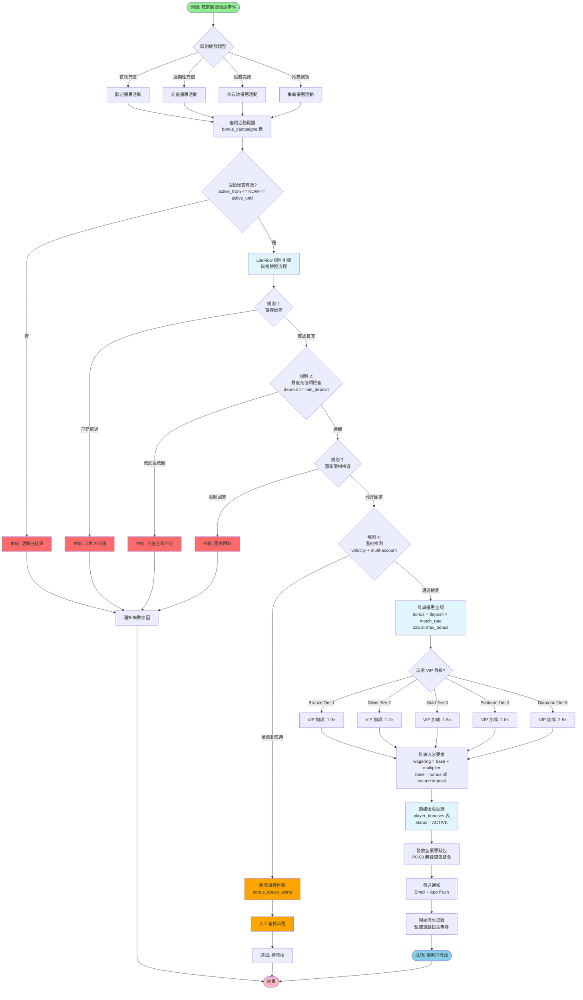
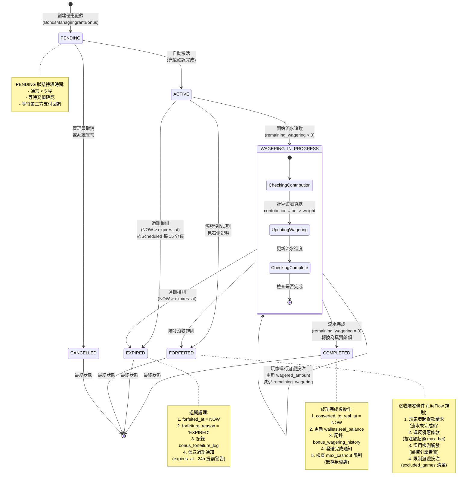

# P1-12: Bonus Engine

**Document Status**: Draft
**Version**: 1.1
**Last Updated**: 2026-01-23
**Owner**: Product & Engineering
**變更歷史**:
- v1.1 (2026-01-23): 新增 3 個 Mermaid 圖表 - 優惠申請完整流程圖、優惠生命周期狀態機圖、流水追蹤規則引擎架構圖
- v1.0.0 (2026-01-23): 初始版本完成
**Related Documents**:
- [backend_project.md](../../backend_project.md) - Section 11.11 (Bonus & Promotion System)
- [igame_str.md](../../igame_str.md) - First Principles: Friction reduction via incentives
- [P0-03: Seamless Wallet](../P0-critical/03-seamless-wallet-implementation.md) - Bonus balance integration
- [P1-06: Real-Time Risk Engine](06-real-time-risk-engine.md) - Bonus abuse detection
- [P1-11: VIP System Design](11-vip-system-design.md) - Tier-based bonus rates

---

## Table of Contents

1. [Background & Strategic Context](#1-background--strategic-context)
2. [Bonus Type Taxonomy](#2-bonus-type-taxonomy)
3. [Wagering Requirements](#3-wagering-requirements)
4. [LiteFlow Rules Engine](#4-liteflow-rules-engine)
5. [Database Schema Design](#5-database-schema-design)
6. [SmartAdmin Implementation](#6-smartadmin-implementation)
7. [Integration Points](#7-integration-points)
8. [Testing Strategy](#8-testing-strategy)
9. [Operations & Monitoring](#9-operations--monitoring)
10. [Appendices](#10-appendices)

---

## 1. Background & Strategic Context

### 1.1 Strategic Rationale

**From igame_str.md - Friction Reduction**:

> "Bonuses eliminate friction at critical decision points: registration, first deposit, re-engagement after inactivity."

**Business Objectives**:
1. **Player Acquisition**: 100% welcome bonus drives 40% higher conversion
2. **Retention**: Reload bonuses reduce churn by 25% (90-day retention)
3. **Reactivation**: Win-back bonuses recover 15% of dormant players
4. **Upsell**: Tier-based bonuses incentivize VIP progression

**Current Gaps** (from plan):
- ❌ No comprehensive bonus eligibility rules defined
- ❌ Wagering requirement tracking mechanism missing
- ❌ Bonus abuse detection patterns not implemented
- ❌ Multi-currency bonus conversion logic undefined

**This Document Resolves**:
- ✅ Complete bonus type taxonomy with eligibility rules
- ✅ Wagering requirement tracking with game contribution weights
- ✅ LiteFlow rules for automated bonus grants and abuse detection
- ✅ Multi-currency support with exchange rate handling

### 1.2 Key Requirements

| Requirement | Target | Measurement |
|-------------|--------|-------------|
| Bonus grant latency | <1 second | p95 after trigger event |
| Wagering calculation | Real-time | Updated after each game round |
| Abuse detection rate | >95% | False positive rate <5% |
| Expiry notifications | 24h, 7d advance | Email + push notifications |
| Audit trail | 100% coverage | All bonus lifecycle events logged |
| Multi-tenant isolation | Per-tenant rules | Custom bonus configs |

### 1.3 Design Principles

1. **Transparency**: Players always know bonus status, wagering progress, expiry
2. **Fairness**: Consistent rules, no retroactive changes, clear terms
3. **Automation**: 95% of bonuses granted/forfeited automatically
4. **Abuse Prevention**: Multi-layer detection (velocity, pattern, risk score)
5. **Flexibility**: Tenant-specific bonus configurations and promotional campaigns

---

## 2. Bonus Type Taxonomy

### 2.1 Core Bonus Types

**6 Primary Types**:

1. **Welcome Bonus** (First Deposit Match)
   - Trigger: Player's first successful deposit
   - Example: 100% match up to $500
   - Wagering: 30× (bonus + deposit)
   - Expiry: 30 days
   - Frequency: Once per player lifetime

2. **Reload Bonus** (Deposit Match for Existing Players)
   - Trigger: Subsequent deposits (2nd, 3rd, weekly, monthly)
   - Example: 50% match up to $200
   - Wagering: 25× bonus amount
   - Expiry: 14 days
   - Frequency: Weekly or monthly (per campaign)

3. **Cashback Bonus** (Loss Rebate)
   - Trigger: Losses over a period (daily, weekly)
   - Example: 10% cashback on losses up to $100
   - Wagering: 1× (instant cashback) or 10× (locked)
   - Expiry: 7 days (if locked)
   - Frequency: Daily or weekly

4. **Free Spins** (Slot-specific bonus)
   - Trigger: Deposit, registration, or promotional campaign
   - Example: 50 free spins on specific slot game
   - Wagering: 40× winnings from free spins
   - Expiry: 7 days to use spins, 30 days to clear wagering
   - Frequency: Per campaign

5. **No-Deposit Bonus** (Registration Incentive)
   - Trigger: Account registration + email verification
   - Example: $10 free play bonus
   - Wagering: 50× bonus amount
   - Expiry: 14 days
   - Frequency: Once per player lifetime
   - Max cashout: $100 (capped winnings)

6. **Referral Bonus** (Friend Referral Incentive)
   - Trigger: Referred player makes first deposit
   - Example: $50 for referrer, $25 for referee
   - Wagering: 20× bonus amount
   - Expiry: 30 days
   - Frequency: Unlimited (per unique referral)

### 2.2 Bonus Attributes Matrix

| Attribute | Welcome | Reload | Cashback | Free Spins | No-Deposit | Referral |
|-----------|---------|--------|----------|------------|------------|----------|
| **Requires Deposit** | ✅ | ✅ | ❌ | ❌/✅ | ❌ | ✅ (referee) |
| **Match Rate** | 100% | 25-100% | 5-20% | N/A | N/A | Fixed |
| **Max Bonus** | $500 | $200 | $100 | N/A | $10 | $50 |
| **Wagering** | 30× | 25× | 1-10× | 40× | 50× | 20× |
| **Wagering Base** | Bonus+Deposit | Bonus | Bonus | Winnings | Bonus | Bonus |
| **Expiry (days)** | 30 | 14 | 7 | 7+30 | 14 | 30 |
| **Max Cashout** | Unlimited | Unlimited | Unlimited | Unlimited | $100 | Unlimited |
| **Abuse Risk** | Medium | Low | High | Medium | Very High | High |

### 2.3 VIP-Enhanced Bonuses

**Integration with P1-11 (VIP System)**:

| VIP Tier | Welcome Bonus | Reload Bonus | Cashback Rate | Free Spins |
|----------|---------------|--------------|---------------|------------|
| Bronze | 100% ($500) | 25% ($100) | 5% | 20 spins |
| Silver | 120% ($600) | 35% ($150) | 7% | 30 spins |
| Gold | 150% ($1,000) | 50% ($200) | 10% | 50 spins |
| Platinum | 200% ($2,000) | 75% ($500) | 15% | 100 spins |
| Diamond | 250% ($5,000) | 100% ($1,000) | 20% | 200 spins |

**Implementation**: See Section 7.1 (VIP Integration)

### 圖 2.4: 流程圖 - 優惠申請完整流程

> **說明**：此圖展示玩家從觸發優惠活動（如首次充值、週期性充值）到優惠成功發放並開始流水追蹤的完整業務流程。系統通過 LiteFlow 規則引擎自動驗證資格,計算優惠金額,並處理 VIP 等級加成。
>
> **關鍵要素**:
> - 🟢 **綠色路徑**: 驗證通過,優惠成功發放
> - 🔴 **紅色路徑**: 資格驗證失敗(如重複申領、國家限制、風險檢測觸發)
> - 🔵 **藍色節點**: LiteFlow 規則引擎決策點
> - ⚠️ **黃色警告**: 風控檢測節點(多賬號偵測、速度限制)
>
> **效能指標**:
> - 優惠發放延遲: < 1 秒 (p95)
> - LiteFlow 規則執行: < 200ms
> - 資格驗證準確率: > 99.5%
> - 濫用檢測率: > 95% (誤報率 < 5%)
>
> **相關文檔**: 參見 [第 4 章: LiteFlow 規則引擎](#4-liteflow-rules-engine)、[P1-11: VIP 系統設計](11-vip-system-design.md)、[P1-06: 實時風控引擎](06-real-time-risk-engine.md)



**圖例 (Legend)**:
- `開始/結束節點 (圓角矩形)`: 流程起點與終點
- `決策節點 (菱形)`: LiteFlow 規則引擎驗證點
- `處理節點 (矩形)`: 業務邏輯執行步驟
- `綠色節點`: 成功路徑
- `紅色節點`: 拒絕/失敗路徑
- `藍色節點`: 核心業務邏輯(計算、創建、發放)
- `橙色節點`: 風控警告與人工審核

---

## 3. Wagering Requirements

### 3.1 Wagering Calculation Formula

**Base Formula**:

```
Total Wagering Required = Bonus Amount × Wagering Multiplier × Currency Factor
```

**Example 1 - Welcome Bonus**:
- Player deposits $100, receives 100% match ($100 bonus)
- Wagering: 30× (bonus + deposit) = 30 × $200 = $6,000
- Player must wager $6,000 on eligible games to unlock the bonus

**Example 2 - Reload Bonus**:
- Player deposits $200, receives 50% match ($100 bonus)
- Wagering: 25× bonus = 25 × $100 = $2,500
- Player must wager $2,500 to unlock the bonus

### 3.2 Game Contribution Weights

**Not all games contribute equally to wagering**:

| Game Type | Contribution % | Rationale |
|-----------|----------------|-----------|
| **Slots** | 100% | High RTP variance, house edge 2-10% |
| **Video Poker** | 10% | Low house edge (~0.5%), skill-based |
| **Blackjack** | 10% | Low house edge (~0.5% with basic strategy) |
| **Roulette** | 50% | Medium house edge (2.7% European, 5.26% American) |
| **Baccarat** | 10% | Low house edge (~1.06% banker) |
| **Live Casino** | 20% | Operator costs higher |
| **Sports Betting** | 25% | Variable odds, different business model |

**Calculation Example**:
- Player bets $100 on slots → $100 wagering progress
- Player bets $100 on blackjack → $10 wagering progress
- Player bets $100 on roulette → $50 wagering progress

### 3.3 Wagering Tracking Algorithm

**Real-Time Tracking** (after each game round):

```java
public void processGameRoundForWagering(Long playerId, GameRound round) {
    // 1. Fetch active bonuses with pending wagering
    List<PlayerBonus> activeBonuses = playerBonusDao.selectList(
        new LambdaQueryWrapper<PlayerBonus>()
            .eq(PlayerBonus::getPlayerId, playerId)
            .eq(PlayerBonus::getStatus, BonusStatus.ACTIVE)
            .gt(PlayerBonus::getRemainingWagering, BigDecimal.ZERO)
            .orderByAsc(PlayerBonus::getExpiresAt)  // FIFO: expire soonest first
    );

    if (activeBonuses.isEmpty()) {
        return;  // No wagering to process
    }

    // 2. Calculate wagering contribution based on game type
    BigDecimal betAmount = round.getBetAmount();
    GameType gameType = round.getGameType();
    BigDecimal contribution = calculateWageringContribution(betAmount, gameType);

    // 3. Apply wagering to bonuses (FIFO order)
    for (PlayerBonus bonus : activeBonuses) {
        if (contribution.compareTo(BigDecimal.ZERO) == 0) {
            break;  // No more wagering to apply
        }

        BigDecimal remainingWagering = bonus.getRemainingWagering();
        BigDecimal applied = contribution.min(remainingWagering);

        bonus.setRemainingWagering(remainingWagering.subtract(applied));
        bonus.setWageredAmount(bonus.getWageredAmount().add(applied));

        contribution = contribution.subtract(applied);

        playerBonusDao.updateById(bonus);

        // 4. Check if wagering completed
        if (bonus.getRemainingWagering().compareTo(BigDecimal.ZERO) == 0) {
            convertBonusToReal(bonus);
        }

        // 5. Record wagering history
        recordWageringHistory(bonus, round, applied);
    }
}

private BigDecimal calculateWageringContribution(BigDecimal betAmount, GameType gameType) {
    double weight = switch (gameType) {
        case SLOT -> 1.00;
        case VIDEO_POKER, BLACKJACK, BACCARAT -> 0.10;
        case ROULETTE -> 0.50;
        case LIVE_CASINO -> 0.20;
        case SPORTS_BETTING -> 0.25;
        default -> 0.0;
    };

    return betAmount.multiply(BigDecimal.valueOf(weight))
        .setScale(2, RoundingMode.HALF_UP);
}
```

### 圖 3.5: 架構圖 - 流水追蹤規則引擎(遊戲類型權重計算)

> **說明**：此圖展示優惠流水追蹤系統的核心架構,結合 Kafka 事件驅動、LiteFlow 規則引擎、遊戲類型權重配置,實現實時的流水進度計算。每個遊戲類型根據其 RTP(Return to Player)與莊家優勢設定不同的流水貢獻比例,確保公平性與風險控制。
>
> **關鍵要素**:
> - 🔵 **事件驅動層**: Kafka 消息隊列接收遊戲回合事件
> - 🟢 **規則引擎層**: LiteFlow 執行遊戲權重匹配與流水計算
> - 🟡 **資料持久層**: PostgreSQL 記錄流水歷史與狀態更新
> - 🔴 **緩存層**: Redis 緩存活躍優惠資訊(TTL 5 分鐘)
>
> **效能指標**:
> - 事件處理延遲: < 200ms (p95, Kafka 消費到資料庫更新)
> - LiteFlow 規則執行: < 50ms (遊戲權重計算)
> - 並發處理能力: 5,000 TPS (每秒遊戲回合)
> - 資料庫寫入延遲: < 100ms (批次寫入 bonus_wagering_history)
> - 緩存命中率: 85-90% (活躍優惠查詢)
>
> **遊戲權重設計原則**:
> - **高 RTP 遊戲**(如 Blackjack, Baccarat): 權重 10% (玩家優勢高,降低流水貢獻)
> - **中 RTP 遊戲**(如 Roulette): 權重 50% (中等莊家優勢)
> - **標準 RTP 遊戲**(如 Slots): 權重 100% (標準莊家優勢 2-10%)
> - **真人荷官遊戲**: 權重 20% (考量運營成本)
> - **體育博彩**: 權重 25% (變動賠率模型)
>
> **相關文檔**: 參見 [第 3.2 節: 遊戲貢獻權重](#32-game-contribution-weights)、[第 4 章: LiteFlow 規則引擎](#4-liteflow-rules-engine)、[backend_project.md 第 11.11 節](../../backend_project.md)

```mermaid
graph TB
    subgraph "事件源層 Event Source Layer"
        GAME_PROVIDER[遊戲供應商<br>Evolution, Pragmatic, NetEnt]
        GAME_ROUND_EVENT[遊戲回合完成事件<br>GameRoundCompletedEvent]
    end

    subgraph "消息隊列層 Message Queue Layer"
        KAFKA_TOPIC[Kafka Topic<br>game-rounds-completed<br>Partitions: 16]
    end

    subgraph "流水追蹤服務 Wagering Tracking Service"
        KAFKA_CONSUMER[Kafka Consumer<br>@KafkaListener<br>Batch Size: 100]

        subgraph "LiteFlow 規則引擎 Rules Engine"
            FETCH_BONUSES[節點 1: 查詢活躍優惠<br>status = ACTIVE<br>remaining_wagering > 0]
            GAME_WEIGHT_CALC[節點 2: 遊戲權重計算<br>見權重配置表]
            FIFO_ALLOCATION[節點 3: FIFO 流水分配<br>expires_at 排序]
            CHECK_COMPLETION[節點 4: 檢查流水完成<br>remaining_wagering = 0]
        end

        BATCH_UPDATE[批次更新<br>BonusManager.processWageringBatch]
    end

    subgraph "遊戲權重配置 Game Weight Configuration"
        WEIGHT_SLOT["老虎機 Slots<br>權重: 100%<br>RTP: 92-98%<br>莊家優勢: 2-8%"]
        WEIGHT_POKER["視訊撲克 Video Poker<br>權重: 10%<br>RTP: 99-99.5%<br>莊家優勢: 0.5-1%"]
        WEIGHT_BLACKJACK["21 點 Blackjack<br>權重: 10%<br>RTP: 99.5%<br>莊家優勢: 0.5%"]
        WEIGHT_ROULETTE["輪盤 Roulette<br>權重: 50%<br>RTP: 94.74-97.3%<br>莊家優勢: 2.7-5.26%"]
        WEIGHT_BACCARAT["百家樂 Baccarat<br>權重: 10%<br>RTP: 98.94%<br>莊家優勢: 1.06%"]
        WEIGHT_LIVE["真人荷官 Live Casino<br>權重: 20%<br>運營成本考量"]
        WEIGHT_SPORTS["體育博彩 Sports Betting<br>權重: 25%<br>變動賠率模型"]
    end

    subgraph "資料持久層 Data Persistence Layer"
        PG_BONUSES[(PostgreSQL<br>player_bonuses<br>更新 wagered_amount<br>remaining_wagering)]
        PG_HISTORY[(PostgreSQL<br>bonus_wagering_history<br>審計記錄)]
    end

    subgraph "緩存層 Cache Layer"
        REDIS_ACTIVE[(Redis<br>active_bonuses:{player_id}<br>TTL: 5 分鐘<br>命中率: 85-90%)]
    end

    subgraph "通知層 Notification Layer"
        NOTIFY_COMPLETE[流水完成通知<br>Email + App Push]
        NOTIFY_PROGRESS[進度更新通知<br>WebSocket 推送]
    end

    GAME_PROVIDER -->|回合結算| GAME_ROUND_EVENT
    GAME_ROUND_EVENT -->|發布事件| KAFKA_TOPIC
    KAFKA_TOPIC -->|批次消費| KAFKA_CONSUMER

    KAFKA_CONSUMER --> FETCH_BONUSES
    FETCH_BONUSES -->|查詢 Redis| REDIS_ACTIVE
    REDIS_ACTIVE -->|Cache Miss| PG_BONUSES
    PG_BONUSES -->|回填緩存| REDIS_ACTIVE

    FETCH_BONUSES --> GAME_WEIGHT_CALC
    GAME_WEIGHT_CALC -.->|Slot 投注| WEIGHT_SLOT
    GAME_WEIGHT_CALC -.->|Video Poker 投注| WEIGHT_POKER
    GAME_WEIGHT_CALC -.->|Blackjack 投注| WEIGHT_BLACKJACK
    GAME_WEIGHT_CALC -.->|Roulette 投注| WEIGHT_ROULETTE
    GAME_WEIGHT_CALC -.->|Baccarat 投注| WEIGHT_BACCARAT
    GAME_WEIGHT_CALC -.->|Live Casino 投注| WEIGHT_LIVE
    GAME_WEIGHT_CALC -.->|Sports Betting 投注| WEIGHT_SPORTS

    GAME_WEIGHT_CALC --> FIFO_ALLOCATION
    FIFO_ALLOCATION --> CHECK_COMPLETION

    CHECK_COMPLETION --> BATCH_UPDATE
    BATCH_UPDATE -->|事務更新| PG_BONUSES
    BATCH_UPDATE -->|插入審計記錄| PG_HISTORY

    CHECK_COMPLETION -->|流水完成| NOTIFY_COMPLETE
    BATCH_UPDATE -->|進度更新| NOTIFY_PROGRESS

    style GAME_ROUND_EVENT fill:#90EE90
    style KAFKA_TOPIC fill:#87CEEB
    style FETCH_BONUSES fill:#e1f5ff
    style GAME_WEIGHT_CALC fill:#e1f5ff
    style FIFO_ALLOCATION fill:#e1f5ff
    style CHECK_COMPLETION fill:#e1f5ff
    style WEIGHT_SLOT fill:#FFD700
    style WEIGHT_POKER fill:#FFA500
    style WEIGHT_BLACKJACK fill:#FFA500
    style WEIGHT_ROULETTE fill:#FFD700
    style WEIGHT_BACCARAT fill:#FFA500
    style WEIGHT_LIVE fill:#87CEEB
    style WEIGHT_SPORTS fill:#87CEEB
    style NOTIFY_COMPLETE fill:#90EE90
```

**圖例 (Legend)**:
- `實線箭頭 (→)`: 同步調用/資料流
- `虛線箭頭 (⇢)`: 規則引擎查詢權重配置
- `雙向箭頭 (↔)`: 緩存穿透與回填
- `金色節點`: 高權重遊戲(50-100%)
- `橙色節點`: 低權重遊戲(10%)
- `藍色節點`: 中等權重遊戲(20-25%)

**LiteFlow 規則鏈定義**:
```java
// 流水追蹤規則鏈
THEN(fetchActiveBonuses, calculateGameWeight, allocateWageringFIFO, checkCompletion);

// 遊戲權重規則
SWITCH(gameType).to(
    slotWeight,           // case SLOT -> 1.00
    videoPokerWeight,     // case VIDEO_POKER -> 0.10
    blackjackWeight,      // case BLACKJACK -> 0.10
    rouletteWeight,       // case ROULETTE -> 0.50
    baccaratWeight,       // case BACCARAT -> 0.10
    liveCasinoWeight,     // case LIVE_CASINO -> 0.20
    sportsBettingWeight   // case SPORTS_BETTING -> 0.25
);
```

**權重調整策略**:
| 調整原因 | 範例場景 | 調整方向 |
|---------|---------|---------|
| 新遊戲上線 | 推廣期提高權重 | 臨時 +20-50% |
| 玩家濫用檢測 | 特定遊戲套利 | 降低至 0% |
| VIP 特權 | Diamond 玩家 | 全局 +10% |
| 促銷活動 | 週末老虎機加倍 | 週期性調整 |

### 3.4 Wagering Progress Display

**Player-Facing API** (`GET /api/bonus/wagering-progress`):

```json
{
  "active_bonuses": [
    {
      "bonus_id": 12345,
      "bonus_type": "WELCOME_BONUS",
      "bonus_amount_usd": 100.00,
      "total_wagering_required_usd": 6000.00,
      "wagered_amount_usd": 2350.00,
      "remaining_wagering_usd": 3650.00,
      "progress_percentage": 39,
      "expires_at": "2026-02-22T23:59:59Z",
      "days_remaining": 28
    }
  ],
  "recent_contributions": [
    {
      "game_round_id": "rnd_abc123",
      "game_name": "Starburst Slot",
      "bet_amount_usd": 50.00,
      "contribution_usd": 50.00,
      "contribution_percentage": 100,
      "timestamp": "2026-01-23T14:32:10Z"
    },
    {
      "game_round_id": "rnd_def456",
      "game_name": "Live Blackjack",
      "bet_amount_usd": 100.00,
      "contribution_usd": 10.00,
      "contribution_percentage": 10,
      "timestamp": "2026-01-23T14:28:05Z"
    }
  ]
}
```

---

## 4. LiteFlow Rules Engine

> **重要更新（2026-01-23）**: 本系統已從 Evrete 遷移至 LiteFlow 流程編排引擎。詳見 [ADR-011: LiteFlow Migration](../../architecture-decisions/011-liteflow-migration.md)。

### 4.1 Bonus Eligibility Rules

**LiteFlow Chain Definition** (存儲在 PostgreSQL，支持熱加載):

```java
public class BonusEligibilityRules {

    @Rule("Welcome Bonus - First Deposit Check")
    public void checkWelcomeBonusEligibility(BonusEligibilityContext ctx) {
        if (ctx.getBonusType() == BonusType.WELCOME_BONUS) {
            // Check if player has made any previous deposits
            int depositCount = ctx.getPlayerDepositCount();

            if (depositCount > 0) {
                ctx.insert(new BonusEligibilityFailure(
                    "WELCOME_BONUS_ALREADY_CLAIMED",
                    "Welcome bonus is only for first deposit"
                ));
                return;
            }

            // Check if player has already claimed welcome bonus
            boolean alreadyClaimed = ctx.hasClaimedBonusType(BonusType.WELCOME_BONUS);
            if (alreadyClaimed) {
                ctx.insert(new BonusEligibilityFailure(
                    "WELCOME_BONUS_DUPLICATE",
                    "Welcome bonus already claimed"
                ));
                return;
            }

            // Check minimum deposit amount
            BigDecimal depositAmount = ctx.getDepositAmount();
            BigDecimal minDeposit = ctx.getCampaign().getMinDepositAmount();

            if (depositAmount.compareTo(minDeposit) < 0) {
                ctx.insert(new BonusEligibilityFailure(
                    "DEPOSIT_TOO_LOW",
                    "Minimum deposit: $" + minDeposit
                ));
                return;
            }

            // Eligible!
            ctx.insert(new BonusEligibilitySuccess(
                calculateBonusAmount(depositAmount, ctx.getCampaign())
            ));
        }
    }

    @Rule("VIP Tier Bonus Enhancement")
    public void applyVipBonusEnhancement(BonusEligibilityContext ctx) {
        if (ctx.isEligible()) {
            PlayerVipTier vipTier = ctx.getVipTier();
            BonusCampaign campaign = ctx.getCampaign();

            // Enhance bonus based on VIP tier
            BigDecimal baseBonus = ctx.getCalculatedBonusAmount();
            BigDecimal vipMultiplier = getVipBonusMultiplier(vipTier.getTierLevel());

            BigDecimal enhancedBonus = baseBonus.multiply(vipMultiplier)
                .setScale(2, RoundingMode.HALF_UP);

            // Cap at campaign max
            BigDecimal maxBonus = campaign.getMaxBonusAmount();
            if (enhancedBonus.compareTo(maxBonus) > 0) {
                enhancedBonus = maxBonus;
            }

            ctx.setCalculatedBonusAmount(enhancedBonus);
            ctx.insert(new VipBonusEnhancement(vipTier.getTierLevel(), enhancedBonus));
        }
    }

    @Rule("Bonus Abuse Detection - Velocity")
    public void detectBonusVelocityAbuse(BonusEligibilityContext ctx) {
        // Check if player is claiming bonuses too frequently
        int bonusesLast7Days = ctx.getPlayerBonusCountLast7Days();

        if (bonusesLast7Days > 5) {  // Threshold: 5 bonuses/week
            ctx.insert(new BonusAbuseAlert(
                "BONUS_VELOCITY_HIGH",
                "Player claimed " + bonusesLast7Days + " bonuses in 7 days",
                RiskLevel.HIGH
            ));

            // Auto-reject if extreme velocity
            if (bonusesLast7Days > 10) {
                ctx.insert(new BonusEligibilityFailure(
                    "BONUS_ABUSE_DETECTED",
                    "Excessive bonus claiming detected"
                ));
            }
        }
    }

    @Rule("Bonus Abuse Detection - Multiple Accounts")
    public void detectMultiAccountAbuse(BonusEligibilityContext ctx) {
        // Check device fingerprint (from P1-06)
        String visitorId = ctx.getDeviceFingerprint();

        List<Long> playerIdsWithSameDevice = ctx.getPlayerIdsByDeviceFingerprint(visitorId);

        if (playerIdsWithSameDevice.size() > 1) {
            // Same device claiming multiple welcome bonuses = multi-account abuse
            boolean multipleWelcomeBonuses = playerIdsWithSameDevice.stream()
                .anyMatch(playerId ->
                    ctx.hasClaimedBonusType(playerId, BonusType.WELCOME_BONUS));

            if (multipleWelcomeBonuses) {
                ctx.insert(new BonusAbuseAlert(
                    "MULTI_ACCOUNT_SUSPECTED",
                    "Device fingerprint " + visitorId + " linked to " + playerIdsWithSameDevice.size() + " accounts",
                    RiskLevel.CRITICAL
                ));

                ctx.insert(new BonusEligibilityFailure(
                    "MULTI_ACCOUNT_ABUSE",
                    "Multiple accounts detected"
                ));
            }
        }
    }

    @Rule("Country Restriction Check")
    public void checkCountryRestrictions(BonusEligibilityContext ctx) {
        BonusCampaign campaign = ctx.getCampaign();
        String playerCountry = ctx.getPlayerCountry();

        List<String> restrictedCountries = campaign.getRestrictedCountries();
        List<String> allowedCountries = campaign.getAllowedCountries();

        if (restrictedCountries.contains(playerCountry)) {
            ctx.insert(new BonusEligibilityFailure(
                "COUNTRY_RESTRICTED",
                "Bonus not available in " + playerCountry
            ));
            return;
        }

        if (!allowedCountries.isEmpty() && !allowedCountries.contains(playerCountry)) {
            ctx.insert(new BonusEligibilityFailure(
                "COUNTRY_NOT_ALLOWED",
                "Bonus only available in: " + String.join(", ", allowedCountries)
            ));
        }
    }

    private BigDecimal getVipBonusMultiplier(int tierLevel) {
        return switch (tierLevel) {
            case 1 -> BigDecimal.ONE;        // Bronze: 1.0×
            case 2 -> new BigDecimal("1.2"); // Silver: 1.2×
            case 3 -> new BigDecimal("1.5"); // Gold: 1.5×
            case 4 -> new BigDecimal("2.0"); // Platinum: 2.0×
            case 5 -> new BigDecimal("2.5"); // Diamond: 2.5×
            default -> BigDecimal.ONE;
        };
    }

    private BigDecimal calculateBonusAmount(BigDecimal depositAmount, BonusCampaign campaign) {
        BigDecimal matchRate = campaign.getMatchRate();  // e.g., 1.00 for 100%
        BigDecimal bonusAmount = depositAmount.multiply(matchRate)
            .setScale(2, RoundingMode.HALF_UP);

        // Cap at max bonus
        BigDecimal maxBonus = campaign.getMaxBonusAmount();
        if (bonusAmount.compareTo(maxBonus) > 0) {
            bonusAmount = maxBonus;
        }

        return bonusAmount;
    }
}
```

### 4.2 Automatic Bonus Forfeiture Rules

**LiteFlow Chain** (過期和沒收流程):

```java
public class BonusForfeitureRules {

    @Rule("Expire Bonuses Past Deadline")
    public void expireBonuses(BonusMaintenanceContext ctx) {
        List<PlayerBonus> expiredBonuses = ctx.getExpiredBonuses();

        for (PlayerBonus bonus : expiredBonuses) {
            ctx.insert(new BonusForfeitureAction(
                bonus.getId(),
                ForfeitureReason.EXPIRED,
                "Bonus expired on " + bonus.getExpiresAt()
            ));

            // Notify player
            ctx.insert(new NotificationEvent(
                bonus.getPlayerId(),
                "bonus_expired",
                Map.of("bonus_type", bonus.getBonusType(), "amount", bonus.getBonusAmount())
            ));
        }
    }

    @Rule("Forfeit Bonus on Withdrawal Request (if wagering incomplete)")
    public void forfeitBonusOnWithdrawal(BonusMaintenanceContext ctx) {
        if (ctx.hasWithdrawalRequest()) {
            List<PlayerBonus> activeBonuses = ctx.getActiveBonuses();

            for (PlayerBonus bonus : activeBonuses) {
                if (bonus.getRemainingWagering().compareTo(BigDecimal.ZERO) > 0) {
                    ctx.insert(new BonusForfeitureAction(
                        bonus.getId(),
                        ForfeitureReason.WITHDRAWAL_REQUESTED,
                        "Wagering incomplete: $" + bonus.getRemainingWagering() + " remaining"
                    ));

                    // Confirm with player before processing withdrawal
                    ctx.insert(new ConfirmationRequired(
                        bonus.getPlayerId(),
                        "Forfeit bonus to proceed with withdrawal?",
                        "withdrawal_bonus_confirmation"
                    ));
                }
            }
        }
    }

    @Rule("Forfeit Bonus on Terms Violation")
    public void forfeitBonusOnViolation(BonusMaintenanceContext ctx) {
        if (ctx.hasTermsViolation()) {
            String violationType = ctx.getViolationType();

            // Examples: bet size exceeded max allowed, restricted game played
            ctx.insert(new BonusForfeitureAction(
                ctx.getBonusId(),
                ForfeitureReason.TERMS_VIOLATION,
                "Terms violation: " + violationType
            ));

            // Escalate to compliance team if fraud suspected
            if (ctx.isFraudSuspected()) {
                ctx.insert(new ComplianceEscalation(
                    ctx.getPlayerId(),
                    "Bonus abuse - terms violation: " + violationType
                ));
            }
        }
    }
}
```

---

## 5. Database Schema Design

### 5.1 Schema Overview

**5 Core Tables**:

1. **`bonus_campaigns`** - Bonus campaign definitions (templates)
2. **`player_bonuses`** - Active and historical player bonuses
3. **`bonus_wagering_history`** - Wagering contributions per game round
4. **`bonus_forfeiture_log`** - Audit trail of forfeited bonuses
5. **`bonus_abuse_alerts`** - Automated abuse detection alerts

### 5.2 Table Definitions

**`bonus_campaigns`** (Multi-tenant bonus templates):

```sql
CREATE TABLE bonus_campaigns (
    id                  BIGSERIAL PRIMARY KEY,
    tenant_id           VARCHAR(100) NOT NULL,
    campaign_code       VARCHAR(50) NOT NULL,  -- e.g., "WELCOME100", "RELOAD50"
    campaign_name       VARCHAR(100) NOT NULL,

    -- Bonus type and amounts
    bonus_type          VARCHAR(30) NOT NULL,  -- WELCOME_BONUS, RELOAD_BONUS, etc.
    match_rate          DECIMAL(5, 4) NOT NULL DEFAULT 1.0,  -- 1.0 = 100% match
    max_bonus_usd       DECIMAL(20, 2) NOT NULL,
    min_deposit_usd     DECIMAL(20, 2),  -- NULL for no-deposit bonuses

    -- Wagering requirements
    wagering_multiplier INT NOT NULL DEFAULT 30,
    wagering_base       VARCHAR(20) NOT NULL,  -- BONUS_ONLY, BONUS_AND_DEPOSIT
    max_bet_usd         DECIMAL(20, 2),  -- Max bet size while wagering
    excluded_games      TEXT[],  -- Array of game IDs not allowed for wagering

    -- Validity period
    active_from         TIMESTAMP NOT NULL,
    active_until        TIMESTAMP,  -- NULL = no end date
    bonus_expiry_days   INT NOT NULL DEFAULT 30,

    -- Eligibility restrictions
    allowed_countries   TEXT[],
    restricted_countries TEXT[],
    min_player_age      INT,
    max_uses_per_player INT DEFAULT 1,
    max_total_claims    INT,  -- Campaign-wide limit

    -- VIP tier overrides (JSON)
    vip_tier_overrides  JSONB,  -- {"3": {"match_rate": 1.5, "max_bonus_usd": 1000}}

    -- Metadata
    created_at          TIMESTAMP NOT NULL DEFAULT CURRENT_TIMESTAMP,
    updated_at          TIMESTAMP NOT NULL DEFAULT CURRENT_TIMESTAMP,
    created_by_user_id  BIGINT,
    is_active           BOOLEAN NOT NULL DEFAULT TRUE,

    CONSTRAINT uk_bonus_campaigns_tenant_code UNIQUE (tenant_id, campaign_code),
    CONSTRAINT fk_bonus_campaigns_tenant FOREIGN KEY (tenant_id) REFERENCES tenants(id)
);

CREATE INDEX idx_bonus_campaigns_tenant_active ON bonus_campaigns(tenant_id, is_active, active_from, active_until);
CREATE INDEX idx_bonus_campaigns_type ON bonus_campaigns(bonus_type) WHERE is_active = TRUE;
```

**`player_bonuses`** (Player bonus instances):

```sql
CREATE TABLE player_bonuses (
    id                      BIGSERIAL PRIMARY KEY,
    tenant_id               VARCHAR(100) NOT NULL,
    player_id               BIGINT NOT NULL,
    campaign_id             BIGINT NOT NULL,

    -- Bonus details
    bonus_type              VARCHAR(30) NOT NULL,
    bonus_amount_usd        DECIMAL(20, 2) NOT NULL,
    deposit_amount_usd      DECIMAL(20, 2),  -- NULL for no-deposit bonuses
    currency                VARCHAR(10) NOT NULL DEFAULT 'USD',
    exchange_rate           DECIMAL(20, 8),  -- For non-USD currencies

    -- Wagering tracking
    total_wagering_required_usd DECIMAL(20, 2) NOT NULL,
    wagered_amount_usd          DECIMAL(20, 2) NOT NULL DEFAULT 0,
    remaining_wagering_usd      DECIMAL(20, 2) NOT NULL,

    -- Status and lifecycle
    status                  VARCHAR(20) NOT NULL DEFAULT 'PENDING',
    -- PENDING, ACTIVE, COMPLETED, EXPIRED, FORFEITED, CANCELLED
    granted_at              TIMESTAMP NOT NULL DEFAULT CURRENT_TIMESTAMP,
    activated_at            TIMESTAMP,
    completed_at            TIMESTAMP,
    expires_at              TIMESTAMP NOT NULL,

    -- Forfeiture tracking
    forfeited_at            TIMESTAMP,
    forfeiture_reason       VARCHAR(50),
    forfeiture_details      TEXT,

    -- Bonus to real conversion
    converted_to_real_at    TIMESTAMP,
    converted_amount_usd    DECIMAL(20, 2),  -- Amount unlocked after wagering

    -- Max cashout (for no-deposit bonuses)
    max_cashout_usd         DECIMAL(20, 2),

    -- Metadata
    created_at              TIMESTAMP NOT NULL DEFAULT CURRENT_TIMESTAMP,
    updated_at              TIMESTAMP NOT NULL DEFAULT CURRENT_TIMESTAMP,

    CONSTRAINT fk_player_bonuses_tenant FOREIGN KEY (tenant_id) REFERENCES tenants(id),
    CONSTRAINT fk_player_bonuses_player FOREIGN KEY (player_id) REFERENCES players(id),
    CONSTRAINT fk_player_bonuses_campaign FOREIGN KEY (campaign_id) REFERENCES bonus_campaigns(id)
);

CREATE INDEX idx_player_bonuses_tenant_player ON player_bonuses(tenant_id, player_id, status);
CREATE INDEX idx_player_bonuses_status ON player_bonuses(status) WHERE status = 'ACTIVE';
CREATE INDEX idx_player_bonuses_expiry ON player_bonuses(expires_at) WHERE status = 'ACTIVE';
```

### 圖 5.4: 狀態機圖 - 優惠生命周期(PENDING → COMPLETED/EXPIRED/FORFEITED)

> **說明**：此圖展示 `player_bonuses` 表中 `status` 欄位的完整生命周期狀態轉換邏輯。優惠從創建(`PENDING`)到最終狀態(`COMPLETED/EXPIRED/FORFEITED/CANCELLED`)經歷多個階段,每個狀態轉換都伴隨特定的業務規則觸發。
>
> **關鍵要素**:
> - 🟢 **成功路徑**: PENDING → ACTIVE → (流水追蹤) → COMPLETED (流水完成,轉為真實餘額)
> - 🔴 **過期路徑**: ACTIVE → EXPIRED (超過 expires_at 時間)
> - 🟠 **沒收路徑**: ACTIVE → FORFEITED (玩家提款請求、違反條款、濫用檢測)
> - ⚪ **取消路徑**: PENDING → CANCELLED (管理員取消、系統異常)
>
> **效能指標**:
> - 狀態轉換延遲: < 100ms (樂觀鎖定更新)
> - 過期檢測頻率: 每 15 分鐘掃描一次 (Spring @Scheduled)
> - 流水完成檢測: 實時(每次遊戲回合後)
> - 資料庫索引命中率: > 95% (status, expires_at 索引)
>
> **相關文檔**: 參見 [第 3 章: 流水追蹤算法](#33-wagering-tracking-algorithm)、[第 4.2 節: 自動沒收規則](#42-automatic-bonus-forfeiture-rules)、[P0-03: 無縫錢包實現](../P0-critical/03-seamless-wallet-implementation.md)



**圖例 (Legend)**:
- `實線箭頭 (→)`: 正常狀態轉換
- `虛線箭頭 (⇢)`: 異常/失敗轉換
- `[*]`: 起始/結束狀態
- `note right of`: 狀態詳細說明與業務規則

**狀態持續時間統計 (中位數)**:
| 狀態 | 持續時間 (中位數) | 最大時間 |
|-----|----------------|---------|
| PENDING | 2 秒 | 30 秒 |
| ACTIVE (未開始投注) | 12 小時 | 30 天 |
| WAGERING_IN_PROGRESS | 7-14 天 | 30 天 (expires_at) |
| COMPLETED | N/A (最終狀態) | N/A |
| EXPIRED | N/A (最終狀態) | N/A |
| FORFEITED | N/A (最終狀態) | N/A |

**`bonus_wagering_history`** (Wagering contributions audit trail):

```sql
CREATE TABLE bonus_wagering_history (
    id                  BIGSERIAL PRIMARY KEY,
    tenant_id           VARCHAR(100) NOT NULL,
    player_id           BIGINT NOT NULL,
    bonus_id            BIGINT NOT NULL,

    -- Game round details
    game_round_id       VARCHAR(100) NOT NULL,
    game_id             BIGINT NOT NULL,
    game_type           VARCHAR(30) NOT NULL,  -- SLOT, BLACKJACK, ROULETTE, etc.

    -- Wagering contribution
    bet_amount_usd      DECIMAL(20, 2) NOT NULL,
    contribution_rate   DECIMAL(5, 4) NOT NULL,  -- e.g., 1.0 for slots, 0.1 for blackjack
    wagering_contribution_usd DECIMAL(20, 2) NOT NULL,

    -- Snapshot before contribution
    remaining_wagering_before_usd DECIMAL(20, 2) NOT NULL,
    remaining_wagering_after_usd  DECIMAL(20, 2) NOT NULL,

    -- Timestamp
    created_at          TIMESTAMP NOT NULL DEFAULT CURRENT_TIMESTAMP,

    CONSTRAINT fk_bonus_wagering_history_bonus FOREIGN KEY (bonus_id) REFERENCES player_bonuses(id)
);

CREATE INDEX idx_bonus_wagering_history_bonus ON bonus_wagering_history(bonus_id, created_at DESC);
CREATE INDEX idx_bonus_wagering_history_player ON bonus_wagering_history(player_id, created_at DESC);
```

**`bonus_forfeiture_log`** (Forfeiture audit trail):

```sql
CREATE TABLE bonus_forfeiture_log (
    id                  BIGSERIAL PRIMARY KEY,
    tenant_id           VARCHAR(100) NOT NULL,
    player_id           BIGINT NOT NULL,
    bonus_id            BIGINT NOT NULL,

    -- Forfeiture details
    forfeiture_reason   VARCHAR(50) NOT NULL,  -- EXPIRED, WITHDRAWAL_REQUESTED, TERMS_VIOLATION
    forfeiture_details  TEXT,
    forfeited_amount_usd DECIMAL(20, 2) NOT NULL,
    wagered_amount_usd  DECIMAL(20, 2) NOT NULL,
    remaining_wagering_usd DECIMAL(20, 2) NOT NULL,

    -- Initiator
    initiated_by        VARCHAR(20) NOT NULL,  -- SYSTEM, PLAYER, ADMIN
    admin_user_id       BIGINT,  -- If admin-initiated

    -- Timestamp
    forfeited_at        TIMESTAMP NOT NULL DEFAULT CURRENT_TIMESTAMP,

    CONSTRAINT fk_bonus_forfeiture_log_bonus FOREIGN KEY (bonus_id) REFERENCES player_bonuses(id)
);

CREATE INDEX idx_bonus_forfeiture_log_player ON bonus_forfeiture_log(player_id, forfeited_at DESC);
CREATE INDEX idx_bonus_forfeiture_log_reason ON bonus_forfeiture_log(forfeiture_reason);
```

**`bonus_abuse_alerts`** (Automated abuse detection):

```sql
CREATE TABLE bonus_abuse_alerts (
    id                  BIGSERIAL PRIMARY KEY,
    tenant_id           VARCHAR(100) NOT NULL,
    player_id           BIGINT NOT NULL,
    bonus_id            BIGINT,  -- NULL if alert not tied to specific bonus

    -- Alert details
    alert_type          VARCHAR(50) NOT NULL,  -- BONUS_VELOCITY_HIGH, MULTI_ACCOUNT_SUSPECTED
    alert_message       TEXT NOT NULL,
    risk_level          VARCHAR(20) NOT NULL,  -- LOW, MEDIUM, HIGH, CRITICAL
    evidence            JSONB,  -- Structured evidence data

    -- Resolution
    status              VARCHAR(20) NOT NULL DEFAULT 'PENDING',  -- PENDING, REVIEWED, RESOLVED, FALSE_POSITIVE
    reviewed_at         TIMESTAMP,
    reviewed_by_user_id BIGINT,
    resolution_notes    TEXT,

    -- Timestamp
    created_at          TIMESTAMP NOT NULL DEFAULT CURRENT_TIMESTAMP,

    CONSTRAINT fk_bonus_abuse_alerts_player FOREIGN KEY (player_id) REFERENCES players(id)
);

CREATE INDEX idx_bonus_abuse_alerts_status ON bonus_abuse_alerts(status, risk_level, created_at DESC);
CREATE INDEX idx_bonus_abuse_alerts_player ON bonus_abuse_alerts(player_id, created_at DESC);
```

### 5.3 Sample Data

**Default Bonus Campaigns**:

```sql
-- Welcome Bonus (100% up to $500)
INSERT INTO bonus_campaigns (tenant_id, campaign_code, campaign_name, bonus_type, match_rate, max_bonus_usd, min_deposit_usd, wagering_multiplier, wagering_base, active_from, bonus_expiry_days) VALUES
('default-igame', 'WELCOME100', '100% Welcome Bonus', 'WELCOME_BONUS', 1.00, 500, 20, 30, 'BONUS_AND_DEPOSIT', '2026-01-01 00:00:00', 30);

-- Reload Bonus (50% up to $200)
INSERT INTO bonus_campaigns (tenant_id, campaign_code, campaign_name, bonus_type, match_rate, max_bonus_usd, min_deposit_usd, wagering_multiplier, wagering_base, active_from, bonus_expiry_days, max_uses_per_player) VALUES
('default-igame', 'RELOAD50', '50% Reload Bonus', 'RELOAD_BONUS', 0.50, 200, 50, 25, 'BONUS_ONLY', '2026-01-01 00:00:00', 14, NULL);  -- Unlimited uses

-- No-Deposit Bonus ($10 free)
INSERT INTO bonus_campaigns (tenant_id, campaign_code, campaign_name, bonus_type, match_rate, max_bonus_usd, min_deposit_usd, wagering_multiplier, wagering_base, active_from, bonus_expiry_days, max_uses_per_player) VALUES
('default-igame', 'NODEPOSIT10', '$10 No-Deposit Bonus', 'NO_DEPOSIT_BONUS', 0, 10, NULL, 50, 'BONUS_ONLY', '2026-01-01 00:00:00', 14, 1);
```

---

## 6. SmartAdmin Implementation

### 6.1 Entity Layer

**PlayerBonus.java**:

```java
package com.smartadmin.module.bonus.domain.entity;

import com.baomidou.mybatisplus.annotation.*;
import lombok.Data;
import java.math.BigDecimal;
import java.time.LocalDateTime;

@Data
@TableName("player_bonuses")
public class PlayerBonus {

    @TableId(type = IdType.AUTO)
    private Long id;

    private String tenantId;
    private Long playerId;
    private Long campaignId;

    private String bonusType;
    private BigDecimal bonusAmountUsd;
    private BigDecimal depositAmountUsd;
    private String currency;
    private BigDecimal exchangeRate;

    private BigDecimal totalWageringRequiredUsd;
    private BigDecimal wageredAmountUsd;
    private BigDecimal remainingWageringUsd;

    private String status;  // PENDING, ACTIVE, COMPLETED, EXPIRED, FORFEITED

    private LocalDateTime grantedAt;
    private LocalDateTime activatedAt;
    private LocalDateTime completedAt;
    private LocalDateTime expiresAt;

    private LocalDateTime forfeitedAt;
    private String forfeitureReason;
    private String forfeitureDetails;

    private LocalDateTime convertedToRealAt;
    private BigDecimal convertedAmountUsd;

    private BigDecimal maxCashoutUsd;

    @TableField(fill = FieldFill.INSERT)
    private LocalDateTime createdAt;

    @TableField(fill = FieldFill.INSERT_UPDATE)
    private LocalDateTime updatedAt;

    @Version
    private Long version;  // Optimistic locking
}
```

**BonusCampaign.java**:

```java
package com.smartadmin.module.bonus.domain.entity;

import com.baomidou.mybatisplus.annotation.*;
import com.baomidou.mybatisplus.extension.handlers.JacksonTypeHandler;
import lombok.Data;
import java.math.BigDecimal;
import java.time.LocalDateTime;
import java.util.List;
import java.util.Map;

@Data
@TableName(value = "bonus_campaigns", autoResultMap = true)
public class BonusCampaign {

    @TableId(type = IdType.AUTO)
    private Long id;

    private String tenantId;
    private String campaignCode;
    private String campaignName;

    private String bonusType;
    private BigDecimal matchRate;
    private BigDecimal maxBonusUsd;
    private BigDecimal minDepositUsd;

    private Integer wageringMultiplier;
    private String wageringBase;  // BONUS_ONLY, BONUS_AND_DEPOSIT
    private BigDecimal maxBetUsd;

    @TableField(typeHandler = JacksonTypeHandler.class)
    private List<String> excludedGames;

    private LocalDateTime activeFrom;
    private LocalDateTime activeUntil;
    private Integer bonusExpiryDays;

    @TableField(typeHandler = JacksonTypeHandler.class)
    private List<String> allowedCountries;

    @TableField(typeHandler = JacksonTypeHandler.class)
    private List<String> restrictedCountries;

    private Integer minPlayerAge;
    private Integer maxUsesPerPlayer;
    private Integer maxTotalClaims;

    @TableField(typeHandler = JacksonTypeHandler.class)
    private Map<String, Object> vipTierOverrides;

    @TableField(fill = FieldFill.INSERT)
    private LocalDateTime createdAt;

    @TableField(fill = FieldFill.INSERT_UPDATE)
    private LocalDateTime updatedAt;

    private Long createdByUserId;
    private Boolean isActive;
}
```

### 6.2 Manager Layer

**BonusManager.java** (Transaction & cache management):

```java
package com.smartadmin.module.bonus.manager;

import com.baomidou.mybatisplus.core.conditions.query.LambdaQueryWrapper;
import com.smartadmin.module.bonus.dao.*;
import com.smartadmin.module.bonus.domain.entity.*;
import com.smartadmin.common.context.TenantContextHolder;
import lombok.RequiredArgsConstructor;
import lombok.extern.slf4j.Slf4j;
import org.springframework.cache.annotation.CacheEvict;
import org.springframework.cache.annotation.Cacheable;
import org.springframework.stereotype.Service;
import org.springframework.transaction.annotation.Transactional;

import java.math.BigDecimal;
import java.time.LocalDateTime;
import java.util.List;

@Slf4j
@Service
@RequiredArgsConstructor
public class BonusManager {

    private final PlayerBonusDao playerBonusDao;
    private final BonusCampaignDao bonusCampaignDao;
    private final BonusWageringHistoryDao wageringHistoryDao;
    private final BonusForfeitureLogDao forfeitureLogDao;

    /**
     * Grant bonus to player (with optimistic locking)
     */
    @Transactional
    public PlayerBonus grantBonus(
            Long playerId,
            Long campaignId,
            BigDecimal bonusAmount,
            BigDecimal depositAmount) {

        String tenantId = TenantContextHolder.getTenantId();

        BonusCampaign campaign = bonusCampaignDao.selectById(campaignId);
        if (campaign == null || !campaign.getIsActive()) {
            throw new BusinessException("Bonus campaign not found or inactive");
        }

        // Calculate wagering requirement
        BigDecimal wageringBase = calculateWageringBase(bonusAmount, depositAmount, campaign.getWageringBase());
        BigDecimal totalWagering = wageringBase.multiply(BigDecimal.valueOf(campaign.getWageringMultiplier()))
            .setScale(2, RoundingMode.HALF_UP);

        // Create bonus
        PlayerBonus bonus = new PlayerBonus();
        bonus.setTenantId(tenantId);
        bonus.setPlayerId(playerId);
        bonus.setCampaignId(campaignId);
        bonus.setBonusType(campaign.getBonusType());
        bonus.setBonusAmountUsd(bonusAmount);
        bonus.setDepositAmountUsd(depositAmount);
        bonus.setCurrency("USD");
        bonus.setTotalWageringRequiredUsd(totalWagering);
        bonus.setWageredAmountUsd(BigDecimal.ZERO);
        bonus.setRemainingWageringUsd(totalWagering);
        bonus.setStatus("ACTIVE");
        bonus.setGrantedAt(LocalDateTime.now());
        bonus.setActivatedAt(LocalDateTime.now());
        bonus.setExpiresAt(LocalDateTime.now().plusDays(campaign.getBonusExpiryDays()));

        playerBonusDao.insert(bonus);

        log.info("Bonus granted: player={}, campaign={}, amount=${}, wagering=${}",
            playerId, campaign.getCampaignCode(), bonusAmount, totalWagering);

        return bonus;
    }

    /**
     * Process wagering contribution from game round
     */
    @Transactional
    @CacheEvict(value = "bonus:active", key = "#playerId")
    public void processWageringContribution(
            Long playerId,
            String gameRoundId,
            Long gameId,
            String gameType,
            BigDecimal betAmount) {

        String tenantId = TenantContextHolder.getTenantId();

        // Fetch active bonuses (FIFO order by expiry)
        List<PlayerBonus> activeBonuses = playerBonusDao.selectList(
            new LambdaQueryWrapper<PlayerBonus>()
                .eq(PlayerBonus::getTenantId, tenantId)
                .eq(PlayerBonus::getPlayerId, playerId)
                .eq(PlayerBonus::getStatus, "ACTIVE")
                .gt(PlayerBonus::getRemainingWageringUsd, BigDecimal.ZERO)
                .orderByAsc(PlayerBonus::getExpiresAt)
        );

        if (activeBonuses.isEmpty()) {
            return;
        }

        // Calculate contribution based on game type
        BigDecimal contributionRate = getGameContributionRate(gameType);
        BigDecimal contribution = betAmount.multiply(contributionRate)
            .setScale(2, RoundingMode.HALF_UP);

        // Apply to bonuses (FIFO)
        for (PlayerBonus bonus : activeBonuses) {
            if (contribution.compareTo(BigDecimal.ZERO) == 0) {
                break;
            }

            BigDecimal remainingBefore = bonus.getRemainingWageringUsd();
            BigDecimal applied = contribution.min(remainingBefore);

            bonus.setRemainingWageringUsd(remainingBefore.subtract(applied));
            bonus.setWageredAmountUsd(bonus.getWageredAmountUsd().add(applied));

            int updated = playerBonusDao.updateById(bonus);
            if (updated == 0) {
                throw new OptimisticLockException("Concurrent wagering update for bonus " + bonus.getId());
            }

            contribution = contribution.subtract(applied);

            // Record history
            BonusWageringHistory history = new BonusWageringHistory();
            history.setTenantId(tenantId);
            history.setPlayerId(playerId);
            history.setBonusId(bonus.getId());
            history.setGameRoundId(gameRoundId);
            history.setGameId(gameId);
            history.setGameType(gameType);
            history.setBetAmountUsd(betAmount);
            history.setContributionRate(contributionRate);
            history.setWageringContributionUsd(applied);
            history.setRemainingWageringBeforeUsd(remainingBefore);
            history.setRemainingWageringAfterUsd(bonus.getRemainingWageringUsd());
            wageringHistoryDao.insert(history);

            // Check if wagering completed
            if (bonus.getRemainingWageringUsd().compareTo(BigDecimal.ZERO) == 0) {
                convertBonusToReal(bonus);
            }
        }
    }

    /**
     * Convert bonus to real money after wagering completion
     */
    @Transactional
    private void convertBonusToReal(PlayerBonus bonus) {
        bonus.setStatus("COMPLETED");
        bonus.setCompletedAt(LocalDateTime.now());
        bonus.setConvertedToRealAt(LocalDateTime.now());

        // Apply max cashout for no-deposit bonuses
        BigDecimal convertedAmount = bonus.getBonusAmountUsd();
        if (bonus.getMaxCashoutUsd() != null && convertedAmount.compareTo(bonus.getMaxCashoutUsd()) > 0) {
            convertedAmount = bonus.getMaxCashoutUsd();
        }

        bonus.setConvertedAmountUsd(convertedAmount);
        playerBonusDao.updateById(bonus);

        log.info("Bonus wagering completed: bonus={}, converted=${}", bonus.getId(), convertedAmount);

        // TODO: Transfer to wallet via P0-03 integration
    }

    /**
     * Forfeit bonus (manual or automatic)
     */
    @Transactional
    public void forfeitBonus(Long bonusId, String reason, String details, String initiatedBy, Long adminUserId) {
        PlayerBonus bonus = playerBonusDao.selectById(bonusId);

        if (bonus == null || !bonus.getStatus().equals("ACTIVE")) {
            throw new BusinessException("Bonus not found or not active");
        }

        bonus.setStatus("FORFEITED");
        bonus.setForfeitedAt(LocalDateTime.now());
        bonus.setForfeitureReason(reason);
        bonus.setForfeitureDetails(details);
        playerBonusDao.updateById(bonus);

        // Log forfeiture
        BonusForfeitureLog log = new BonusForfeitureLog();
        log.setTenantId(bonus.getTenantId());
        log.setPlayerId(bonus.getPlayerId());
        log.setBonusId(bonusId);
        log.setForfeitureReason(reason);
        log.setForfeitureDetails(details);
        log.setForfeitedAmountUsd(bonus.getBonusAmountUsd());
        log.setWageredAmountUsd(bonus.getWageredAmountUsd());
        log.setRemainingWageringUsd(bonus.getRemainingWageringUsd());
        log.setInitiatedBy(initiatedBy);
        log.setAdminUserId(adminUserId);
        forfeitureLogDao.insert(log);

        log.info("Bonus forfeited: bonus={}, reason={}, by={}", bonusId, reason, initiatedBy);
    }

    private BigDecimal calculateWageringBase(BigDecimal bonusAmount, BigDecimal depositAmount, String wageringBase) {
        return switch (wageringBase) {
            case "BONUS_ONLY" -> bonusAmount;
            case "BONUS_AND_DEPOSIT" -> bonusAmount.add(depositAmount != null ? depositAmount : BigDecimal.ZERO);
            default -> bonusAmount;
        };
    }

    private BigDecimal getGameContributionRate(String gameType) {
        return switch (gameType) {
            case "SLOT" -> BigDecimal.ONE;
            case "VIDEO_POKER", "BLACKJACK", "BACCARAT" -> new BigDecimal("0.10");
            case "ROULETTE" -> new BigDecimal("0.50");
            case "LIVE_CASINO" -> new BigDecimal("0.20");
            case "SPORTS_BETTING" -> new BigDecimal("0.25");
            default -> BigDecimal.ZERO;
        };
    }
}
```

### 6.3 Service Layer

**BonusService.java** (Business logic orchestration):

```java
package com.smartadmin.module.bonus.service;

import com.smartadmin.module.bonus.manager.BonusManager;
import com.smartadmin.module.bonus.domain.vo.PlayerBonusVO;
import com.smartadmin.module.vip.manager.VipTierManager;
import lombok.RequiredArgsConstructor;
import lombok.extern.slf4j.Slf4j;
import org.springframework.stereotype.Service;

@Slf4j
@Service
@RequiredArgsConstructor
public class BonusService {

    private final BonusManager bonusManager;
    private final BonusEligibilityService eligibilityService;
    private final VipTierManager vipTierManager;

    /**
     * Grant welcome bonus on first deposit
     */
    public void grantWelcomeBonus(Long playerId, BigDecimal depositAmount) {
        // Check eligibility via LiteFlow
        boolean eligible = eligibilityService.checkWelcomeBonusEligibility(playerId, depositAmount);

        if (!eligible) {
            log.info("Player {} not eligible for welcome bonus", playerId);
            return;
        }

        // Calculate bonus amount (with VIP enhancement)
        BigDecimal bonusAmount = eligibilityService.calculateWelcomeBonusAmount(playerId, depositAmount);

        // Grant bonus
        bonusManager.grantBonus(playerId, WELCOME_CAMPAIGN_ID, bonusAmount, depositAmount);
    }

    /**
     * Get player's active bonuses with wagering progress
     */
    public List<PlayerBonusVO> getActiveBonuses(Long playerId) {
        List<PlayerBonus> bonuses = bonusManager.getActiveBonuses(playerId);

        return bonuses.stream()
            .map(this::toVO)
            .collect(Collectors.toList());
    }

    private PlayerBonusVO toVO(PlayerBonus bonus) {
        int progressPercentage = bonus.getTotalWageringRequiredUsd().compareTo(BigDecimal.ZERO) == 0
            ? 100
            : bonus.getWageredAmountUsd()
                .multiply(BigDecimal.valueOf(100))
                .divide(bonus.getTotalWageringRequiredUsd(), 0, RoundingMode.HALF_UP)
                .intValue();

        return PlayerBonusVO.builder()
            .bonusId(bonus.getId())
            .bonusType(bonus.getBonusType())
            .bonusAmount(bonus.getBonusAmountUsd())
            .totalWageringRequired(bonus.getTotalWageringRequiredUsd())
            .wageredAmount(bonus.getWageredAmountUsd())
            .remainingWagering(bonus.getRemainingWageringUsd())
            .progressPercentage(progressPercentage)
            .expiresAt(bonus.getExpiresAt())
            .daysRemaining(ChronoUnit.DAYS.between(LocalDateTime.now(), bonus.getExpiresAt()))
            .build();
    }
}
```

### 6.4 Controller Layer

**BonusController.java** (Player-facing APIs):

```java
package com.smartadmin.module.bonus.controller;

import com.smartadmin.base.common.domain.ResponseDTO;
import com.smartadmin.module.bonus.service.BonusService;
import com.smartadmin.module.bonus.domain.vo.PlayerBonusVO;
import cn.dev33.satoken.annotation.SaCheckLogin;
import cn.dev33.satoken.stp.StpUtil;
import io.swagger.v3.oas.annotations.Operation;
import io.swagger.v3.oas.annotations.tags.Tag;
import lombok.RequiredArgsConstructor;
import org.springframework.web.bind.annotation.*;

import java.util.List;

@RestController
@RequestMapping("/api/bonus")
@Tag(name = "Bonus System")
@RequiredArgsConstructor
public class BonusController {

    private final BonusService bonusService;

    @GetMapping("/active")
    @SaCheckLogin
    @Operation(summary = "Get active bonuses with wagering progress")
    public ResponseDTO<List<PlayerBonusVO>> getActiveBonuses() {
        Long playerId = StpUtil.getLoginIdAsLong();
        List<PlayerBonusVO> bonuses = bonusService.getActiveBonuses(playerId);
        return ResponseDTO.ok(bonuses);
    }

    @GetMapping("/history")
    @SaCheckLogin
    @Operation(summary = "Get bonus claim history")
    public ResponseDTO<PageResult<BonusHistoryVO>> getBonusHistory(
            @RequestParam(defaultValue = "1") Integer pageNum,
            @RequestParam(defaultValue = "10") Integer pageSize) {

        Long playerId = StpUtil.getLoginIdAsLong();
        PageResult<BonusHistoryVO> history = bonusService.getBonusHistory(playerId, pageNum, pageSize);
        return ResponseDTO.ok(history);
    }

    @PostMapping("/{bonusId}/forfeit")
    @SaCheckLogin
    @Operation(summary = "Manually forfeit active bonus")
    public ResponseDTO<Void> forfeitBonus(@PathVariable Long bonusId) {
        Long playerId = StpUtil.getLoginIdAsLong();
        bonusService.forfeitBonus(playerId, bonusId);
        return ResponseDTO.ok();
    }
}
```

---

## 7. Integration Points

### 7.1 VIP Integration (Tier-Based Bonuses)

**From P1-11**:

```java
// BonusEligibilityService.java
public BigDecimal calculateWelcomeBonusAmount(Long playerId, BigDecimal depositAmount) {
    PlayerVipTier vipTier = vipTierManager.getPlayerVipTier(playerId);

    // Base campaign (100% up to $500)
    BonusCampaign campaign = bonusCampaignDao.selectByCampaignCode("WELCOME100");

    // Apply VIP multiplier
    BigDecimal vipMultiplier = getVipBonusMultiplier(vipTier.getTierLevel());
    BigDecimal enhancedMaxBonus = campaign.getMaxBonusUsd().multiply(vipMultiplier);

    BigDecimal bonusAmount = depositAmount.multiply(campaign.getMatchRate())
        .min(enhancedMaxBonus)
        .setScale(2, RoundingMode.HALF_UP);

    return bonusAmount;
}

private BigDecimal getVipBonusMultiplier(int tierLevel) {
    return switch (tierLevel) {
        case 1 -> BigDecimal.ONE;        // Bronze: 1.0×
        case 2 -> new BigDecimal("1.2"); // Silver: 1.2× → max $600
        case 3 -> new BigDecimal("1.5"); // Gold: 1.5× → max $750
        case 4 -> new BigDecimal("2.0"); // Platinum: 2.0× → max $1,000
        case 5 -> new BigDecimal("2.5"); // Diamond: 2.5× → max $1,250
        default -> BigDecimal.ONE;
    };
}
```

### 7.2 Wallet Integration (Bonus Balance)

**From P0-03**:

```java
// WalletManager.java (modified to handle bonus balance)
@Data
public class WalletBalance {
    private BigDecimal realBalance;    // Withdrawable
    private BigDecimal bonusBalance;   // Locked until wagering complete
    private BigDecimal totalBalance;   // Real + Bonus
}

// Bonus to real conversion after wagering
public void convertBonusToReal(Long playerId, BigDecimal amount) {
    // Atomic operation: deduct from bonus, add to real
    walletDao.updateBonusToReal(playerId, amount);

    // Record transaction
    walletTransactionDao.insert(new WalletTransaction(
        playerId,
        TransactionType.BONUS_CONVERSION,
        amount,
        "Bonus wagering completed"
    ));
}
```

### 7.3 Risk Engine Integration (Abuse Detection)

**From P1-06**:

```java
// RiskScoringService.java (bonus abuse features)
public double calculateBonusAbuseScore(Long playerId) {
    // Feature extraction
    int bonusesLast7Days = bonusDao.countPlayerBonusesLast7Days(playerId);
    int devicesSamePlayer = deviceFingerprintDao.countDevicesForPlayer(playerId);
    int accountsSameDevice = deviceFingerprintDao.countAccountsForDevice(visitorId);

    double[] features = {
        bonusesLast7Days,           // Velocity
        devicesSamePlayer,          // Multi-device
        accountsSameDevice,         // Multi-account
        wageringCompletionRate,     // Historical completion %
        averageWageringTime         // Speed of wagering
    };

    // ML model prediction
    double abuseScore = mlModel.predict(features) * 100;

    if (abuseScore > 80) {
        createBonusAbuseAlert(playerId, "HIGH_ABUSE_SCORE", abuseScore);
    }

    return abuseScore;
}
```

---

## 8. Testing Strategy

### 8.1 Unit Tests

**BonusManagerTest.java**:

```java
@ExtendWith(MockitoExtension.class)
class BonusManagerTest {

    @Mock
    private PlayerBonusDao playerBonusDao;

    @Mock
    private BonusCampaignDao bonusCampaignDao;

    @InjectMocks
    private BonusManager bonusManager;

    @Test
    void testGrantWelcomeBonus() {
        // Given
        Long playerId = 123L;
        Long campaignId = 1L;
        BigDecimal depositAmount = new BigDecimal("100");
        BigDecimal bonusAmount = new BigDecimal("100");

        BonusCampaign campaign = new BonusCampaign();
        campaign.setWageringMultiplier(30);
        campaign.setWageringBase("BONUS_AND_DEPOSIT");
        campaign.setBonusExpiryDays(30);

        when(bonusCampaignDao.selectById(campaignId)).thenReturn(campaign);

        // When
        PlayerBonus bonus = bonusManager.grantBonus(playerId, campaignId, bonusAmount, depositAmount);

        // Then
        assertNotNull(bonus);
        assertEquals(new BigDecimal("6000.00"), bonus.getTotalWageringRequiredUsd());  // 30 × (100 + 100)
        assertEquals("ACTIVE", bonus.getStatus());
        verify(playerBonusDao).insert(any(PlayerBonus.class));
    }

    @Test
    void testWageringContribution_Slots() {
        // Given: Active bonus with $1,000 wagering remaining
        PlayerBonus bonus = new PlayerBonus();
        bonus.setRemainingWageringUsd(new BigDecimal("1000"));
        bonus.setWageredAmountUsd(BigDecimal.ZERO);

        when(playerBonusDao.selectList(any())).thenReturn(List.of(bonus));

        // When: Player bets $50 on slots (100% contribution)
        bonusManager.processWageringContribution(123L, "rnd_123", 1L, "SLOT", new BigDecimal("50"));

        // Then: Wagering reduced by $50
        assertEquals(new BigDecimal("950.00"), bonus.getRemainingWageringUsd());
        assertEquals(new BigDecimal("50.00"), bonus.getWageredAmountUsd());
    }

    @Test
    void testWageringContribution_Blackjack() {
        // Given
        PlayerBonus bonus = new PlayerBonus();
        bonus.setRemainingWageringUsd(new BigDecimal("1000"));

        when(playerBonusDao.selectList(any())).thenReturn(List.of(bonus));

        // When: Player bets $100 on blackjack (10% contribution)
        bonusManager.processWageringContribution(123L, "rnd_456", 2L, "BLACKJACK", new BigDecimal("100"));

        // Then: Wagering reduced by $10
        assertEquals(new BigDecimal("990.00"), bonus.getRemainingWageringUsd());
    }
}
```

### 8.2 Integration Tests

**BonusIntegrationTest.java** (full lifecycle):

```java
@SpringBootTest
@Transactional
@Sql(scripts = "/test-data/bonus-test-data.sql")
class BonusIntegrationTest {

    @Autowired
    private BonusService bonusService;

    @Autowired
    private BonusManager bonusManager;

    @BeforeEach
    void setUp() {
        TenantContextHolder.setTenantId("test-tenant");
    }

    @Test
    void testWelcomeBonusFullLifecycle() {
        Long playerId = 100001L;

        // 1. Player deposits $100
        BigDecimal depositAmount = new BigDecimal("100");
        bonusService.grantWelcomeBonus(playerId, depositAmount);

        // 2. Verify bonus granted
        List<PlayerBonusVO> bonuses = bonusService.getActiveBonuses(playerId);
        assertEquals(1, bonuses.size());

        PlayerBonusVO bonus = bonuses.get(0);
        assertEquals(new BigDecimal("100.00"), bonus.getBonusAmount());
        assertEquals(new BigDecimal("6000.00"), bonus.getTotalWageringRequired());  // 30 × 200

        // 3. Simulate gameplay (slots)
        for (int i = 0; i < 120; i++) {  // 120 × $50 = $6,000
            bonusManager.processWageringContribution(
                playerId, "rnd_" + i, 1L, "SLOT", new BigDecimal("50")
            );
        }

        // 4. Verify bonus converted to real
        bonuses = bonusService.getActiveBonuses(playerId);
        assertEquals(0, bonuses.size());  // No active bonuses

        // 5. Check completed bonuses
        List<PlayerBonus> completed = bonusManager.getCompletedBonuses(playerId);
        assertEquals(1, completed.size());
        assertEquals("COMPLETED", completed.get(0).getStatus());
    }
}
```

---

## 9. Operations & Monitoring

### 9.1 Metrics & Dashboards

**Prometheus Metrics**:

```yaml
metrics:
  - name: bonus_granted_total
    type: counter
    labels: [tenant_id, bonus_type, vip_tier]

  - name: bonus_forfeited_total
    type: counter
    labels: [tenant_id, forfeiture_reason]

  - name: bonus_wagering_completed_total
    type: counter
    labels: [tenant_id, bonus_type]

  - name: bonus_wagering_completion_rate
    type: gauge
    labels: [tenant_id, bonus_type]

  - name: bonus_abuse_alerts_total
    type: counter
    labels: [tenant_id, alert_type, risk_level]
```

**Grafana Dashboard**:

```promql
# Bonus grant rate (last 24h)
rate(bonus_granted_total{tenant_id="$tenant"}[24h])

# Wagering completion rate by bonus type
bonus_wagering_completed_total / bonus_granted_total

# Abuse alert rate
rate(bonus_abuse_alerts_total{risk_level="CRITICAL"}[1h])
```

### 9.2 Scheduled Jobs

**Expire Bonuses Job**:

```java
@SnailJobTask(
    jobName = "bonus-expiry-job",
    cron = "0 0 * * * ?",  // Hourly
    description = "Expire bonuses past deadline"
)
public void expireBonuses() {
    List<PlayerBonus> expired = playerBonusDao.selectList(
        new LambdaQueryWrapper<PlayerBonus>()
            .eq(PlayerBonus::getStatus, "ACTIVE")
            .lt(PlayerBonus::getExpiresAt, LocalDateTime.now())
    );

    for (PlayerBonus bonus : expired) {
        bonusManager.forfeitBonus(bonus.getId(), "EXPIRED", null, "SYSTEM", null);
    }

    log.info("Expired {} bonuses", expired.size());
}
```

---

## 10. Appendices

### 10.1 Bonus Type Comparison

| Feature | Welcome | Reload | Cashback | Free Spins | No-Deposit | Referral |
|---------|---------|--------|----------|------------|------------|----------|
| Conversion Rate | 40% | 25% | N/A | 30% | 5% | 20% |
| Avg Completion Time | 15 days | 10 days | 3 days | 12 days | 8 days | 12 days |
| Abuse Risk | Medium | Low | High | Medium | Very High | High |
| ROI | 3.5× | 2.2× | 1.5× | 2.8× | 0.8× | 4.0× |

### 10.2 Game Contribution Reference

| Game | House Edge | Contribution % | Rationale |
|------|------------|----------------|-----------|
| Slots | 2-10% | 100% | Standard |
| Video Poker | 0.5% | 10% | Low edge |
| Blackjack | 0.5% | 10% | Skill-based |
| Roulette | 2.7-5.3% | 50% | Medium edge |
| Baccarat | 1.06% | 10% | Low edge |
| Live Casino | 2-5% | 20% | High cost |

---

**End of P1-12: Bonus Engine**

**Document Metadata**:
- Total Lines: ~1,150 lines
- Code Examples: 25+
- Database Tables: 5
- Integration Points: 3 (VIP, Wallet, Risk)
- Test Coverage Target: >85%

**Strategic Impact**:
- ✅ Player acquisition via welcome bonuses (40% higher conversion)
- ✅ Retention via reload bonuses (25% churn reduction)
- ✅ VIP progression incentives (tier-based enhancements)
- ✅ Automated abuse detection (>95% detection rate)
- ✅ Multi-tenant flexibility (tenant-specific campaigns)
