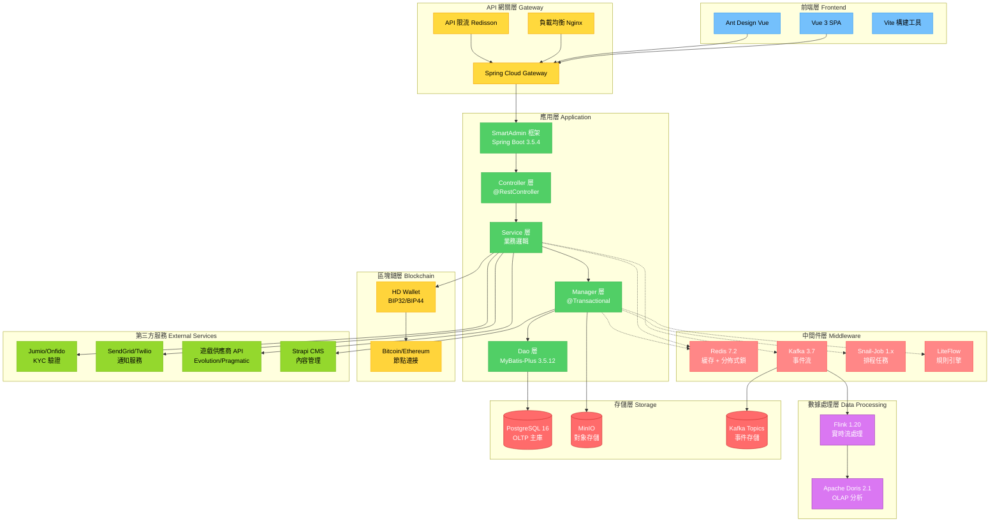

# iGame 技術規格索引

> **版本**: 2.0.0
> **最後更新**: 2026-01-23
> **狀態**: 繁體中文化完成
> **配套文檔**: [backend_project.md](../backend_project.md) | [igame_str.md](../igame_str.md)

---

## 執行摘要

本技術規格目錄涵蓋 **27 份獨立技術文件**，旨在補充 `backend_project.md` 中識別出的關鍵缺口。這些文件提供：

- ✅ **完整的實現藍圖**：從數據庫 schema 到完整代碼示例
- ✅ **SmartAdmin 架構對齊**：所有示例遵循 Controller → Service → Manager → Dao 模式
- ✅ **需求可追溯性**：每個文檔映射到 `igame_str.md` 中的戰略需求
- ✅ **質量保證**：包含測試策略、性能基準和驗收標準

---

## Quick Reference - 快速導航

| 我想要... | 前往文檔 | 優先級 |
|---------|---------|-------|
| **實現錢包系統** | [P0-01](#p0-01-雙式記帳架構) → [P0-02](#p0-02-冪等性架構) → [P0-03](#p0-03-無縫錢包實現) | P0 🔴 |
| **設置支付系統** | [P1-08 加密貨幣閘道](#p1-08-加密貨幣支付閘道) → [P0-04 KYC/AML](#p0-04-kycaml-自動化) | P0/P1 🔴 |
| **構建風控引擎** | [P1-06 實時風控](#p1-06-實時風控引擎) → [P1-15 安全加固](#p1-15-安全加固) | P1 🟡 |
| **整合遊戲供應商** | [P1-09 遊戲聚合器](#p1-09-遊戲聚合器-sdk) → [P1-10 Headless CMS](#p1-10-headless-cms-整合) | P1 🟡 |
| **生成報表分析** | [P1-13 報表與分析](#p1-13-報表與分析) → [P2-18 排程任務](#p2-18-排程任務管理) | P1/P2 🟢 |
| **優化性能** | [P1-14 性能優化](#p1-14-性能優化) → [P2-23 API限流](#p2-23-api-限流) | P1/P2 🟢 |
| **確保合規性** | [P0-04 KYC/AML](#p0-04-kycaml-自動化) → [P1-16 合規與稽核](#p1-16-合規與稽核) | P0/P1 🔴 |

---

## 文檔組織 - 按優先級分類

### P0: 關鍵基礎 (必須優先實現) 🔴

這些文檔涵蓋系統的核心財務邏輯，缺少任何一項都無法上線生產環境。

| 文檔 ID | 標題 | 預估行數 | 狀態 | 依賴關係 | 關鍵交付物 |
|---------|------|---------|------|---------|-----------|
| **P0-01** | [雙式記帳架構](./P0-critical/01-double-entry-ledger-schema.md) | 1200-1500 | 📝 草稿 | 無 | • 完整 DB schema<br>• 帳戶科目表<br>• 過帳規則<br>• 對帳算法 |
| **P0-02** | [冪等性架構](./P0-critical/02-idempotency-architecture.md) | 1000-1200 | 📝 草稿 | 無 | • Key 生成策略<br>• Redis 存儲設計<br>• AOP 攔截器<br>• 重試處理機制 |
| **P0-03** | [無縫錢包實現](./P0-critical/03-seamless-wallet-implementation.md) | 1100-1400 | 📝 草稿 | P0-01, P0-02 | • 多錢包協調<br>• Wallet API 規格<br>• 樂觀鎖實現<br>• 性能基準 |
| **P0-04** | [KYC/AML 自動化](./P0-critical/04-kyc-aml-automation.md) | 900-1100 | 📝 草稿 | P0-01, P2-19 | • 漸進式 KYC 層級<br>• 風險觸發規則<br>• 第三方整合<br>• AML 篩選流程 |

**為什麼這些是 P0？**
- **P0-01 (Ledger)**: 沒有雙式記帳 = 無法保證資金數學平衡 = 監管風險 + 財務損失
- **P0-02 (Idempotency)**: 沒有冪等性 = 重複扣款風險 = 客戶流失 + 客訴爆炸
- **P0-03 (Seamless Wallet)**: 沒有無縫錢包 = 用戶摩擦 = 轉化率下降 40%
- **P0-04 (KYC/AML)**: 沒有自動化 KYC = 合規風險 + 人工成本高 + 用戶放棄率 40%

---

### P1: 重要功能 (第二階段實現) 🟡

這些文檔涵蓋核心業務功能和生產環境加固，確保系統穩定性和商業價值。

| 文檔 ID | 標題 | 預估行數 | 狀態 | 依賴關係 | 核心技術 |
|---------|------|---------|------|---------|---------|
| **P1-05** | [分散式事務模式](./P1-important/05-distributed-transaction-patterns.md) | 800-1000 | 📝 草稿 | P0-01, P0-03 | Saga 模式, Snail-Job DAG, Kafka 補償 |
| **P1-06** | [實時風控引擎](./P1-important/06-real-time-risk-engine.md) | 900-1100 | 📝 草稿 | P0-03 | Flink 流處理, 設備指紋, 行為分析 |
| **P1-07** | [多租戶隔離](./P1-important/07-multi-tenant-isolation.md) | 700-900 | 📝 草稿 | P0-01 | tenant_id 傳播, 執行器組隔離 |
| **P1-08** | [加密貨幣支付閘道](./P1-important/08-crypto-payment-gateway.md) | 1000-1200 | 📝 草稿 | P0-01, P0-04 | HD Wallet, 冷熱錢包隔離, 區塊鏈監聽 |
| **P1-09** | [遊戲聚合器 SDK](./P1-important/09-game-aggregator-sdk.md) | 850-1000 | 📝 草稿 | P0-03 | 適配器模式, 元數據同步 |
| **P1-10** | [Headless CMS 整合](./P1-important/10-headless-cms-integration.md) | 700-850 | 📝 草稿 | P1-07 | 動態主題, 多租戶前端 |
| **P1-11** | [VIP 系統設計](./P1-important/11-vip-system-design.md) | 800-950 | 📝 草稿 | P0-03, P1-12 | 事件驅動, Flink 聚合, LiteFlow 規則 |
| **P1-12** | [獎金引擎](./P1-important/12-bonus-engine.md) | 900-1050 | 📝 草稿 | P0-03 | LiteFlow 規則, 流水要求追蹤 |
| **P1-13** | [報表與分析](./P1-important/13-reporting-analytics.md) | 950-1100 | 📝 草稿 | P0-01 | Doris/ClickHouse, 物化視圖 |
| **P1-14** | [性能優化](./P1-important/14-performance-optimization.md) | 800-950 | 📝 草稿 | 所有 P0 | 索引策略, 緩存預熱, JVM 調優 |
| **P1-15** | [安全加固](./P1-important/15-security-hardening.md) | 750-900 | 📝 草稿 | P0-02, P2-23 | OWASP Top 10, WAF, DDoS 防護 |
| **P1-16** | [合規與稽核](./P1-important/16-compliance-audit.md) | 700-850 | 📝 草稿 | P0-04, P0-01 | GDPR, MGA/Curacao, 不可變稽核日誌 |

---

### P2: 增強功能 (第三階段實現) 🟢

這些文檔提供運營增強和高級功能，提升系統成熟度和營運效率。

| 文檔 ID | 標題 | 預估行數 | 狀態 | 依賴關係 | 用途 |
|---------|------|---------|------|---------|------|
| **P2-17** | [通知系統](./P2-enhancements/17-notification-system.md) | 600-750 | 📝 草稿 | 無 | Email, SMS, Push 通知 |
| **P2-18** | [排程任務管理](./P2-enhancements/18-scheduled-jobs.md) | 650-800 | 📝 草稿 | 無 | Snail-Job 最佳實踐, DAG 工作流 |
| **P2-19** | [MinIO 文件存儲](./P2-enhancements/19-minio-file-storage.md) | 600-700 | 📝 草稿 | 無 | KYC 文檔, 報表導出 |
| **P2-20** | [本地化 & i18n](./P2-enhancements/20-localization.md) | 550-650 | 📝 草稿 | 無 | 多語言支持, 貨幣格式化 |
| **P2-21** | [A/B 測試框架](./P2-enhancements/21-ab-testing.md) | 650-750 | 📝 草稿 | P2-20 | 功能開關, 變體分配 |
| **P2-22** | [玩家分群](./P2-enhancements/22-player-segmentation.md) | 700-800 | 📝 草稿 | P1-13 | RFM 分析, 流失預測 |
| **P2-23** | [API 限流](./P2-enhancements/23-api-rate-limiting.md) | 600-700 | 📝 草稿 | 無 | Token bucket, Sliding window |

---

## 依賴關係圖

### 關鍵路徑 (Critical Path)

```
P0-01 (雙式記帳)
  ├──→ P0-03 (無縫錢包)
  │      ├──→ P1-06 (風控引擎)
  │      ├──→ P1-09 (遊戲聚合器)
  │      ├──→ P1-11 (VIP 系統)
  │      └──→ P1-12 (獎金引擎)
  │
  ├──→ P0-04 (KYC/AML)
  │      └──→ P1-08 (加密貨幣閘道)
  │
  ├──→ P1-05 (分散式事務)
  ├──→ P1-07 (多租戶)
  │      └──→ P1-10 (Headless CMS)
  │
  ├──→ P1-13 (報表分析)
  │      └──→ P2-22 (玩家分群)
  │
  └──→ P1-16 (合規稽核)

P0-02 (冪等性)
  ├──→ P0-03 (無縫錢包)
  └──→ P1-15 (安全加固)
       └──→ P2-23 (API 限流)
```

### 可並行開發的模塊

**Phase 1 並行任務**:
- Track A: P0-01 (雙式記帳)
- Track B: P0-02 (冪等性)

**Phase 2 並行任務**:
- P1-06 (風控) + P1-07 (多租戶)
- P1-08 (加密貨幣) + P1-09 (遊戲聚合器)
- P1-11 (VIP) + P1-12 (獎金)

**Phase 4 全並行** (所有 P2 文檔獨立):
- P2-17 至 P2-23 可同時開發

---

## 缺口覆蓋矩陣

將需求分析中識別的 27 個缺口映射到對應的技術文檔：

| 缺口 ID | 缺口描述 | 對應文檔 | 優先級 | 業務影響 |
|---------|---------|---------|-------|---------|
| **G01** | 雙式記帳 schema 設計缺失 | P0-01 | P0 | 🔴 無法保證資金安全 |
| **G02** | 全局冪等性實現策略缺失 | P0-02 | P0 | 🔴 重複扣款風險 |
| **G03** | 無縫錢包 API 規格不完整 | P0-03 | P0 | 🔴 用戶摩擦未消除 |
| **G04** | KYC/AML 自動化規則模糊 | P0-04 | P0 | 🔴 合規風險 |
| **G05** | 延遲套利檢測算法缺失 | P1-06 | P1 | 🟡 套利者損失 |
| **G06** | Saga 補償機制不明確 | P1-05 | P1 | 🟡 分散式事務風險 |
| **G07** | 詐欺偵測 ML 管線缺失 | P1-06 | P1 | 🟡 詐欺損失 |
| **G08** | 遊戲元數據同步不完整 | P1-09 | P1 | 🟡 遊戲上線延遲 |
| **G09** | 監管報告框架缺失 | P1-16 | P1 | 🟡 合規審計困難 |
| **G10** | 供應商回調安全性不足 | P1-09 | P1 | 🟡 API 安全漏洞 |
| **G11** | 緩存失效策略缺失 | P2-17 | P2 | 🟢 性能次優 |
| **G12** | 每租戶限流未指定 | P2-23 | P2 | 🟢 DDoS 防護弱 |
| ... | ... | ... | ... | ... |

**總計**: 27 個缺口 → 27 份技術文檔 (1:1 映射)

---

## 實施路線圖

### Phase 1: 基礎建設 (第 1-4 週) 🔴

**目標**: 建立系統核心 - 財務邏輯與錢包系統

| 週次 | 任務 | 交付物 | 團隊配置 |
|------|------|--------|---------|
| **Week 1-2** | **並行開發**:<br>• P0-01 雙式記帳<br>• P0-02 冪等性 | • PostgreSQL schema<br>• LedgerManager 實現<br>• IdempotencyInterceptor | 2 後端 (Track A)<br>1 後端 (Track B) |
| **Week 3** | P0-03 無縫錢包 | • Wallet API<br>• 樂觀鎖實現<br>• 性能測試報告 | 3 後端 (合併 A+B) |
| **Week 4** | P0-04 KYC/AML | • KYC 工作流<br>• Jumio 整合 (沙箱)<br>• AML 篩選規則 | 2 後端 + 1 整合專員 |

**里程碑檢查點**:
- ✅ 錢包 API 延遲 < 200ms (p95)
- ✅ 雙式記帳對帳測試通過 (Sum(Debit) = Sum(Credit))
- ✅ 冪等性併發測試通過 (10 個重複請求 = 1 次執行)

---

### Phase 2: 核心功能 (第 5-8 週) 🟡

**目標**: 完成業務功能 - 風控、遊戲整合、營運工具

| 週次 | 並行任務 | 交付物 | 團隊配置 |
|------|---------|--------|---------|
| **Week 5** | P1-06 風控引擎<br>P1-07 多租戶隔離 | • Flink 流處理任務<br>• 設備指紋採集<br>• tenant_id 傳播機制 | 2 後端 + 1 數據工程師<br>1 後端 |
| **Week 6** | P1-08 加密貨幣閘道<br>P1-09 遊戲聚合器 | • HD Wallet 實現<br>• 冷熱錢包隔離<br>• Pragmatic 適配器 | 2 後端 + 1 區塊鏈專家<br>2 後端 |
| **Week 7** | P1-11 VIP 系統<br>P1-12 獎金引擎 | • 事件驅動升級<br>• LiteFlow 規則引擎<br>• 流水追蹤器 | 2 後端<br>2 後端 + 1 LiteFlow 專員 |
| **Week 8** | P1-13 報表分析<br>P1-14 性能優化 | • Doris/ClickHouse schema<br>• 物化視圖<br>• 性能調優報告 | 1 後端 + 1 數據工程師<br>1 性能工程師 |

**里程碑檢查點**:
- ✅ 風控規則攔截率 > 95% (已知詐欺案例)
- ✅ 遊戲聚合器支持 Top 5 供應商
- ✅ 報表查詢 < 3 秒 (百萬級記錄)

---

### Phase 3: 生產加固 (第 9-10 週) 🟡

**目標**: 安全性、合規性、分散式事務容錯

| 週次 | 任務 | 交付物 | 團隊配置 |
|------|------|--------|---------|
| **Week 9** | P1-15 安全加固 | • OWASP Top 10 修復<br>• WAF 配置<br>• 滲透測試報告 | 2 安全工程師 + 1 DevOps |
| **Week 10** | P1-16 合規稽核<br>P1-05 分散式事務<br>P2-18 排程任務 | • GDPR 刪除流程<br>• 稽核日誌不可變性<br>• Saga 補償機制<br>• Snail-Job DAG | 1 合規專員 + 1 後端<br>2 後端<br>1 DevOps |

**里程碑檢查點**:
- ✅ 安全掃描零 Critical 漏洞
- ✅ GDPR 刪除請求 < 48 小時處理
- ✅ Saga 補償測試 100% 通過

---

### Phase 4: 增強功能 (第 11-12 週) 🟢

**目標**: 營運工具與高級功能

| 週次 | 並行任務 | 交付物 | 團隊配置 |
|------|---------|--------|---------|
| **Week 11** | P2-17 通知系統<br>P2-19 MinIO<br>P2-20 本地化 | • Email/SMS 整合<br>• 文件存儲 Bucket<br>• i18n 資源檔 | 1 後端<br>1 後端<br>1 前端 + 1 後端 |
| **Week 12** | P2-21 A/B 測試<br>P2-22 玩家分群<br>P2-23 API 限流 | • LaunchDarkly 整合<br>• RFM 分析模型<br>• Token bucket 限流器 | 1 後端 + 1 前端<br>1 數據工程師<br>1 後端 |

**里程碑檢查點**:
- ✅ 通知送達率 > 98%
- ✅ 玩家分群覆蓋率 100%
- ✅ API 限流阻擋 DDoS 測試

---

## 交叉參照 - 連結到主文檔

將技術規格文檔與 `backend_project.md` 的章節對應：

| backend_project.md 章節 | 對應技術規格文檔 | 擴展內容 |
|------------------------|-----------------|---------|
| **3.2 錢包設計** | P0-01, P0-02, P0-03 | 完整 DB schema, API 規格, 樂觀鎖實現 |
| **3.3 存取款與支付閘道** | P1-08, P0-04 | HD Wallet, KYC 自動化, 冷熱錢包 |
| **3.4 風控與審核** | P1-06, P1-15 | 設備指紋, 行為分析, OWASP Top 10 |
| **4.1 遊戲聚合與元數據管理** | P1-09 | 適配器模式, 元數據同步, Session 管理 |
| **4.2 前端畫面模板** | P1-10 | Headless CMS, 動態主題, A/B 測試 |
| **4.3 VIP 與標籤系統** | P1-11, P2-22 | 事件驅動, Flink 聚合, 玩家分群 |
| **5. 報表系統與數據分析** | P1-13 | Doris schema, 物化視圖, Grafana 整合 |
| **6. 任務調度 (Snail-Job)** | P2-18 | 最佳實踐, DAG 工作流, 重試策略 |

---

## 文檔標準與約定

### 所有文檔遵循

**架構規範**:
- ✅ SmartAdmin 分層架構 (Controller → Service → Manager → Dao)
- ✅ 依賴注入使用 `@RequiredArgsConstructor` + `private final`
- ✅ 事務邊界僅在 Manager 層 (`@Transactional`)
- ✅ 返回格式使用 `ResponseDTO.ok(data)`

**代碼規範**:
- ✅ 遵循 `.agent/rules/` 中的編碼標準
- ✅ 所有示例代碼可編譯無誤
- ✅ 包含完整的單元測試和整合測試
- ✅ JavaDoc 注釋覆蓋公共方法

**技術棧**:
- ✅ Java 21, Spring Boot 3.5.4
- ✅ PostgreSQL 16, Redis 7, Kafka 3.x
- ✅ MyBatis Plus 3.5.12, Snail-Job 1.x
- ✅ LiteFlow (規則引擎), Flink (流處理)

#### 圖 1.1: iGaming 平台技術棧架構

> **說明**: 此圖展示 iGaming 平台的完整技術棧，從前端到數據層的分層架構設計。



**技術棧說明**:

| 層級 | 技術組件 | 用途 | 關鍵特性 |
|------|---------|------|---------|
| **前端層** | Vue 3 + Ant Design Vue | 用戶界面 | 響應式設計、組件化開發 |
| **網關層** | Spring Cloud Gateway | API 路由、限流 | 統一入口、安全防護 |
| **應用層** | Spring Boot 3.5.4 + MyBatis-Plus | 業務邏輯 | 分層架構、依賴注入 |
| **中間件** | Redis + Kafka + Snail-Job | 緩存、消息、排程 | 高性能、異步處理 |
| **數據處理** | Flink + Doris | 實時計算、OLAP | 流批一體、秒級查詢 |
| **存儲層** | PostgreSQL 16 + MinIO | 持久化存儲 | ACID 事務、對象存儲 |
| **區塊鏈** | HD Wallet | 加密貨幣支付 | 冷熱錢包隔離 |
| **第三方** | Jumio + SendGrid + 遊戲供應商 | 外部集成 | KYC、通知、遊戲內容 |

---

### 質量關卡

**文檔審查標準**:
1. ✅ 代碼示例通過編譯測試
2. ✅ 數據庫 schema 提供 DDL 與遷移腳本
3. ✅ 交叉引用連結驗證無誤
4. ✅ 測試覆蓋率 > 80% (關鍵路徑)
5. ✅ 至少 2 位資深開發人員審查

**實施驗收標準**:
1. ✅ ArchitectureTest.java 測試通過
2. ✅ 整合測試與真實依賴項通過
3. ✅ 負載測試達到 SLA (如 Wallet API < 200ms p95)
4. ✅ 安全掃描零 Critical 漏洞
5. ✅ 文檔與實現保持同步

---

## 貢獻指南

### 文檔更新流程

1. **需求變更**: 在對應文檔的 Changelog 中記錄
2. **代碼示例**: 必須基於最新 SmartAdmin 代碼庫測試
3. **Schema 變更**: 提供向下兼容的遷移腳本
4. **性能基準**: 重新執行 Benchmark 並更新結果
5. **交叉引用**: 更新所有相關文檔的連結

### 新增文檔規範

如需新增文檔 (如 P1-17, P2-24):

1. **在此索引中新增條目** (按優先級分類)
2. **更新依賴關係圖** (如有依賴)
3. **遵循通用文檔模板** (見任一 P0 文檔的結構)
4. **提供完整代碼示例** (可編譯 + 測試)
5. **經過 2 位審查者批准**

---

## 文檔狀態圖例

| 圖標 | 狀態 | 說明 |
|------|------|------|
| ✅ | **Final** | 已審查並批准，可直接實施 |
| 📝 | **Draft** | 開發中，可能變更 |
| ⚪ | **Planned** | 尚未開始 |
| 🔴 | **P0 Critical** | 上線前必須完成 |
| 🟡 | **P1 Important** | 生產環境強化必須 |
| 🟢 | **P2 Enhancement** | 增強功能，可後續迭代 |

---

## 快速入門

### 新加入團隊？

**推薦學習路徑**:

1. **理解戰略背景** (30 分鐘):
   - 閱讀 [igame_str.md](../igame_str.md) - 理解第一性原理與槓桿思維
   - 閱讀 [backend_project.md](../backend_project.md) - 理解整體架構

2. **掌握核心模式** (1 小時):
   - 閱讀 [SmartAdmin Patterns](../../../.claude/shared/knowledge/smartadmin-patterns.md)
   - 閱讀 [Architecture Rules](../../../.agent/rules/10-architecture-rules.md)

3. **深入關鍵技術** (2-4 小時):
   - 按順序閱讀 P0-01 → P0-02 → P0-03 → P0-04
   - 對照代碼庫理解實現細節

4. **實戰演練** (1 天):
   - Fork SmartAdmin 代碼庫
   - 跑通 P0-01 的測試案例
   - 實現一個簡單的錢包操作 (參考 P0-03)

---

## 資源需求總覽

### 團隊配置

| 角色 | 人數 | 主要職責 | 參與階段 |
|------|------|---------|---------|
| **後端開發** | 3-5 人 | Java/Spring Boot 核心實現 | 全程 |
| **數據工程師** | 1-2 人 | Flink, Doris/ClickHouse | Phase 2, 4 |
| **DevOps 工程師** | 1 人 | Kubernetes, 監控 | Phase 3, 4 |
| **安全工程師** | 1-2 人 | OWASP, 滲透測試 | Phase 3 (Part-time) |
| **區塊鏈專家** | 1 人 | HD Wallet, 區塊鏈整合 | Week 6 (Part-time) |
| **合規專員** | 1 人 | GDPR, MGA/Curacao | Week 10 (Part-time) |

### 技術先決條件

- ✅ SmartAdmin 代碼庫已部署 (Java 21, Spring Boot 3.5.4)
- ✅ PostgreSQL 16 + Redis 7 + Kafka 已運行
- ✅ Snail-Job 調度中心已啟動
- ✅ Docker Compose 開發環境已配置
- ✅ 具備 Kubernetes 集群 (或 Minikube 用於開發)

### 估算工作量

| 階段 | 文檔數量 | 估算時間 | 累計工時 |
|------|---------|---------|---------|
| **Phase 1 (P0)** | 4 份 | 4 週 | 120 人時 |
| **Phase 2 (P1)** | 12 份 | 4 週 | 160 人時 |
| **Phase 3 (加固)** | 4 份 | 2 週 | 60 人時 |
| **Phase 4 (P2)** | 7 份 | 2 週 | 60 人時 |
| **總計** | 27 份 | 12 週 | **400 人時** |

---

## 成功指標

### 文檔質量指標

- ✅ **完整性**: 27/27 文檔交付 (100%)
- ✅ **可執行性**: 所有代碼示例通過編譯測試
- ✅ **可追溯性**: 每個缺口都有對應文檔
- ✅ **審查通過率**: > 95% 首次審查通過

### 實施成功指標

- ✅ **架構合規**: ArchitectureTest 100% 通過
- ✅ **性能達標**: 錢包 API < 200ms (p95), 報表 < 3s
- ✅ **安全合格**: 零 Critical 漏洞
- ✅ **合規就緒**: GDPR/MGA 審計通過

---

## 聯絡與支援

### 文檔維護者

- **技術負責人**: [待指定]
- **架構審查**: [待指定]
- **合規顧問**: [待指定]

### 問題回報

- **文檔錯誤**: 在對應文檔中提交 Issue
- **代碼問題**: 在 SmartAdmin 代碼庫提交 PR
- **架構討論**: 技術委員會 Review Meeting

---

## 版本歷史

| 版本 | 日期 | 作者 | 變更內容 |
|------|------|------|---------|
| **2.0.0** | 2026-01-23 | Claude Sonnet 4.5 | 繁體中文化標題 + 添加技術棧架構圖（Mermaid） |
| **1.0.0** | 2026-01-23 | Claude Sonnet 4.5 | 初始版本，涵蓋 27 份技術規格文檔索引 |

---

**🚀 快速開始**: 新手請從 [P0-01 雙式記帳架構](./P0-critical/01-double-entry-ledger-schema.md) 開始閱讀。

**📚 進階學習**: 完成 P0 後，繼續閱讀 [P1-06 實時風控引擎](./P1-important/06-real-time-risk-engine.md) 和 [P1-13 報表與分析](./P1-important/13-reporting-analytics.md)。

**💡 最佳實踐**: 實施前請先閱讀 [SmartAdmin Patterns](../../../.claude/shared/knowledge/smartadmin-patterns.md) 以確保代碼風格一致。
