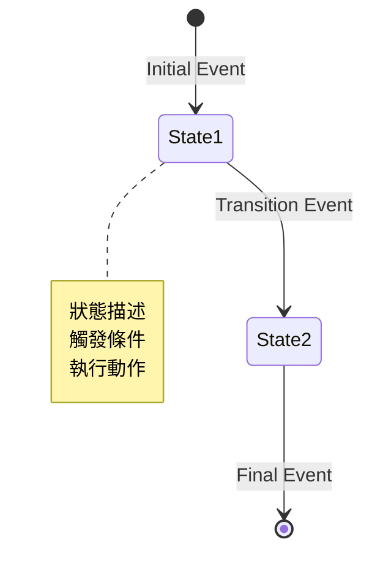
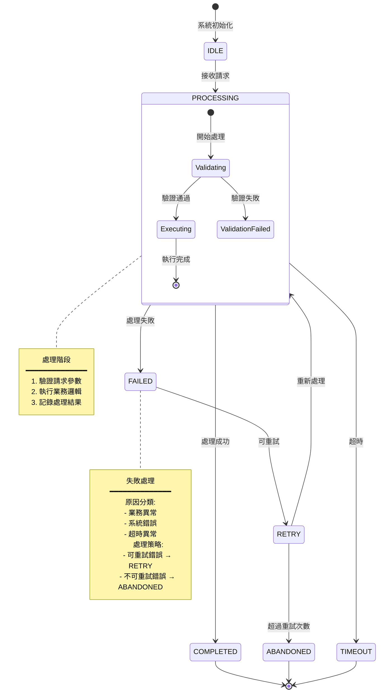
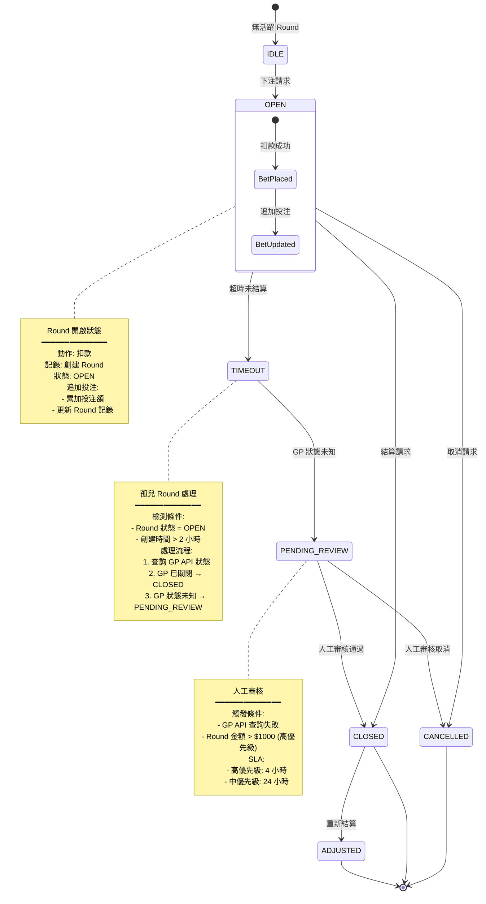
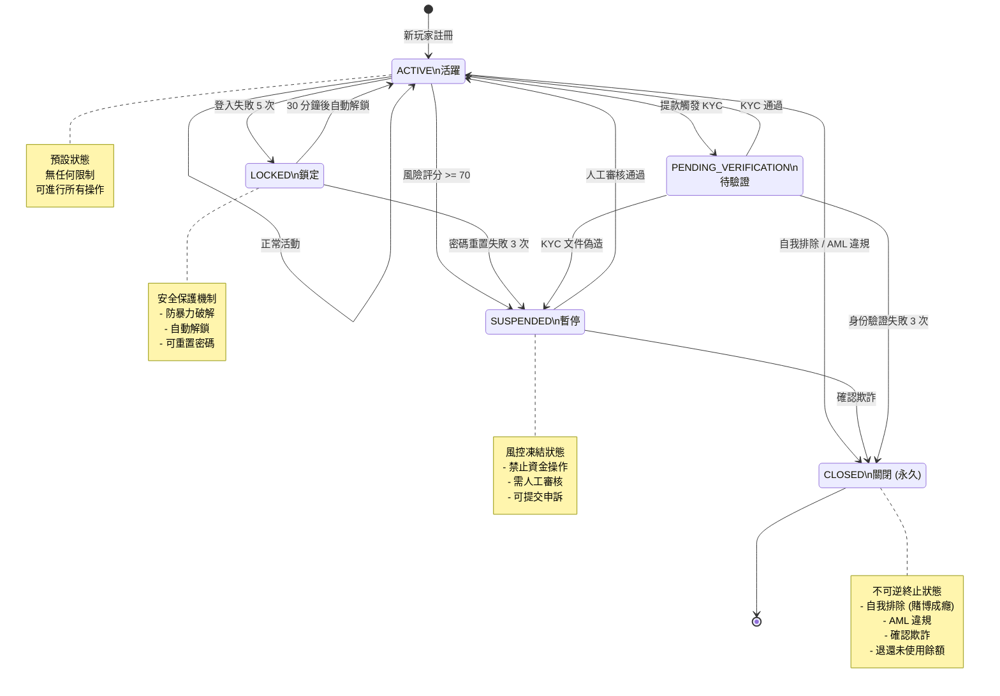
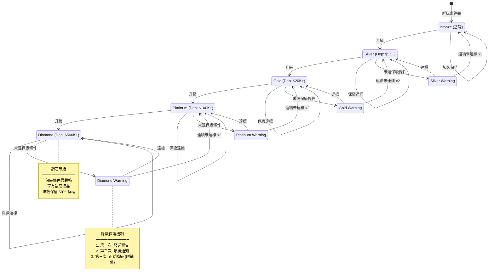
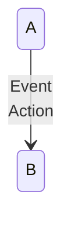
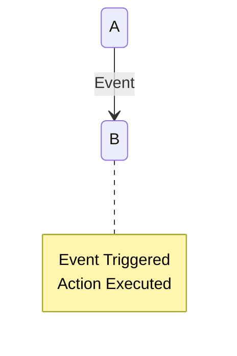
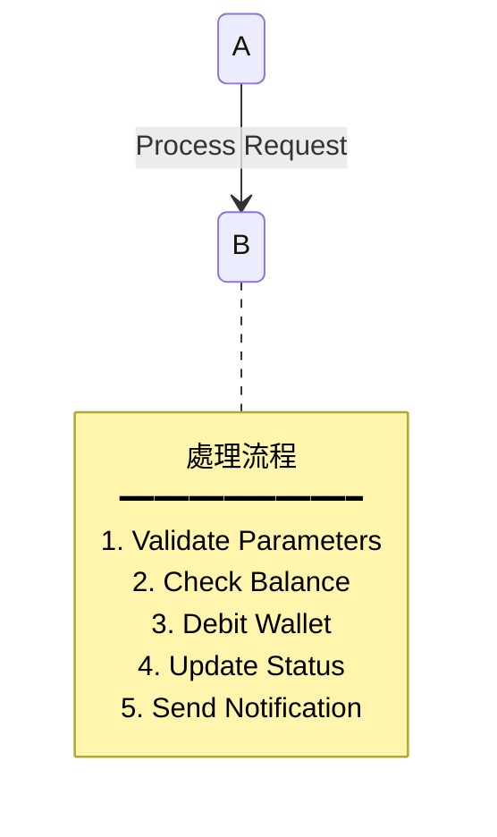

# stateDiagram-v2 模板 (SmartAdmin iGaming Documentation)

> **用途**: 為 SmartAdmin iGaming 文檔提供標準的 stateDiagram-v2 範本
> **版本**: 1.0.0
> **最後更新**: 2026-02-04
> **維護者**: iGaming Documentation Team

---

## 📋 模板類型

### 1. 基礎狀態機（Simple State Machine）

**適用場景**: 簡單的狀態轉換流程（< 5 個狀態）



---

### 2. 複雜業務流程（Complex Business Workflow）

**適用場景**: 包含多個子狀態和條件分支的複雜流程



---

### 3. Round-Based 遊戲狀態機（Game Round State Machine）

**適用場景**: 遊戲商對接中的 Round-Based 交易模型



---

### 4. 玩家生命週期（Player Lifecycle）

**適用場景**: 玩家帳戶狀態管理



---

### 5. VIP 等級狀態機（VIP Tier State Machine）

**適用場景**: VIP 等級升降級管理



---

## ✅ 最佳實踐

### 1. Transition Labels（狀態轉換標籤）

**✅ 正確做法**:
- 簡潔明確的單行描述
- 避免使用 `<br/>` 標籤（stateDiagram-v2 不支持）
- 複雜信息移至 note 區塊

```mermaid
# ✅ 正確
stateDiagram-v2
    A --> B: Event Triggered
```

**❌ 錯誤做法**:
```mermaid
# ❌ 錯誤 - 使用 <br/> 標籤
stateDiagram-v2
    A --> B: Event<br/>Action<br/>Result
```

### 2. Note Blocks（註釋區塊）

**✅ 正確做法**:
- 使用多行 note 格式（`note ... end note`）
- 每行一個信息點
- 使用分隔線 `━━━━━` 進行視覺分組

```mermaid
# ✅ 正確
stateDiagram-v2
    note right of STATE
        狀態描述
        ━━━━━━━━━━━━━━
        觸發條件: xxx
        執行動作: yyy
        後續狀態: zzz
    end note
```

**❌ 錯誤做法**:
```mermaid
# ❌ 錯誤 - 單行 note + <br/> 標籤
stateDiagram-v2
    note right of STATE : Text<br/>More<br/>Info
```

### 3. State Naming（狀態命名）

**✅ 推薦命名規則**:
- 使用全大寫或 PascalCase: `ACTIVE`, `ProcessingPayment`
- 狀態名稱簡潔明確: `OPEN`, `CLOSED`, `TIMEOUT`
- 使用狀態別名顯示中文: `state "活躍狀態" as ACTIVE`

### 4. 複雜狀態（Nested States）

**✅ 適度使用**:
- 僅在必要時使用嵌套狀態（`state { }`）
- 嵌套深度不超過 2 層
- 超過 3 個子狀態考慮拆分為獨立圖表

---

## 🚫 常見錯誤

### 錯誤 1: 使用 HTML 標籤

**❌ 錯誤**:


**✅ 修復**:


### 錯誤 2: 過度複雜的 Transition Labels

**❌ 錯誤**:
```
A --> B: Request Received | Validate Parameters | Check Balance | Debit Wallet | Update Status | Send Notification
```

**✅ 修復**:


---

## 🔧 驗證工具

**檢測錯誤**:
```bash
./scripts/detect-statediagram-br.sh docs/iGaming/
```

**自動修復**:
```bash
./scripts/batch-fix-statediagram-br.sh --verify
```

**驗證語法**:
```bash
./scripts/validate-mermaid.sh docs/iGaming/
```

**線上驗證**:
- [Mermaid Live Editor](https://mermaid.live/)

---

## 📚 參考資源

- **SmartAdmin Mermaid 最佳實踐**: [.claude/skills/extended/domain/igaming-multi-tenant-wallet-pm/knowledge/mermaid-best-practices.md](.claude/skills/extended/domain/igaming-multi-tenant-wallet-pm/knowledge/mermaid-best-practices.md)
- **Mermaid 官方文檔**: [State Diagram](https://mermaid.js.org/syntax/stateDiagram.html)
- **CLAUDE.md Mermaid Standards**: [CLAUDE.md#mermaid-diagram-standards](../../../CLAUDE.md#mermaid-diagram-standards)

---

**版本**: 1.0.0
**最後更新**: 2026-02-04
**維護者**: iGaming Documentation Team
**狀態**: Production Ready
