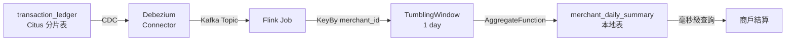
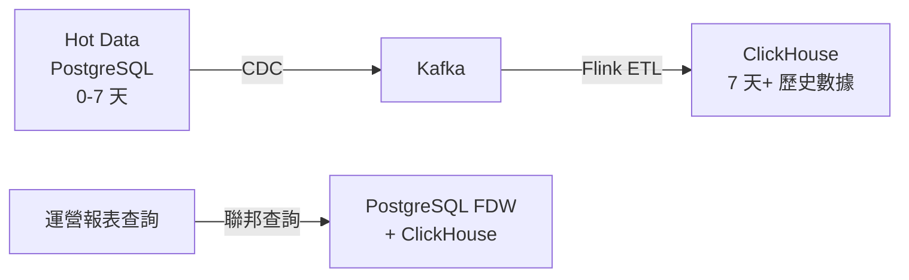

# 基於 player_id 分片的七大挑戰與解決方案

**系統背景**：iGaming 平台 | PostgreSQL 16.1 + Citus 12.1 | `user_id` (player_id) 分片鍵 | 128 分片 | 日均 1.5 億筆交易

**文檔版本**：v1.0.0 | 創建日期：2026-02-06

---

## 目錄

- [執行摘要](#執行摘要)
- [問題 1: 非分片鍵聚合查詢性能惡化](#問題-1-非分片鍵聚合查詢性能惡化)
- [問題 2: XID Wraparound 風險](#問題-2-xid-wraparound-風險)
- [問題 3: 跨分片 JOIN 性能問題](#問題-3-跨分片-join-性能問題)
- [問題 4: 數據傾斜（Hot Shard）](#問題-4-數據傾斜hot-shard)
- [問題 5: 分布式事務複雜度](#問題-5-分布式事務複雜度)
- [問題 6: 分區管理複雜度](#問題-6-分區管理複雜度)
- [問題 7: 備份與恢復複雜度](#問題-7-備份與恢復複雜度)
- [實施路線圖](#實施路線圖)
- [總結與最佳實踐](#總結與最佳實踐)

---

## 執行摘要

### 為什麼選擇 player_id 作為分片鍵？

**正確的選擇**：
- ✅ iGaming 平台 99% 的業務操作（投注、錢包查詢、遊戲會話）都是單玩家維度
- ✅ Co-located query 避免跨分片開銷，單玩家查詢延遲 < 10ms
- ✅ 符合業務核心路徑（玩家投注是最高頻操作）

**代價與挑戰**：
- ❌ 非玩家維度的聚合查詢（商戶結算、運營報表）性能惡化
- ❌ 跨分片 JOIN 需要全網格通信（128×128 次）
- ❌ 分布式事務（玩家間轉帳）延遲增加 5-10 倍

### 七大挑戰概覽

| # | 問題 | 風險等級 | 影響範圍 | 推薦解決方案 | 性能提升 |
|---|------|---------|---------|------------|---------|
| 1 | 非分片鍵聚合查詢慢 | ⭐⭐⭐⭐⭐ | 商戶結算、運營報表 | Flink 流式預聚合 | 5秒 → 10ms (500x) |
| 2 | XID Wraparound 風險 | ⭐⭐⭐⭐⭐ | 全庫不可用 | 五道防線防禦體系 | 71天 → 286天 (4x) |
| 3 | 跨分片 JOIN 性能差 | ⭐⭐⭐⭐ | 複雜報表查詢 | 應用層 JOIN + ClickHouse | 30秒 → 100ms (300x) |
| 4 | 數據傾斜 (Hot Shard) | ⭐⭐⭐ | VIP 玩家體驗 | Redis 緩存 + 動態調整 | 負載降低 90% |
| 5 | 分布式事務複雜 | ⭐⭐⭐⭐ | 玩家間轉帳 | Saga 模式避免跨分片 | 延遲降低 5-10x |
| 6 | 分區管理複雜 | ⭐⭐⭐ | 運維效率 | 自動化腳本 | 人工成本降低 90% |
| 7 | 備份與恢復複雜 | ⭐⭐ | 災難恢復 | pgBackRest 持續歸檔 | PITR 秒級恢復點 |

---

## 問題 1: 非分片鍵聚合查詢性能惡化

### 問題本質

當查詢條件不包含 `player_id`（分片鍵）時，Citus 必須：
1. 掃描全部 128 個分片
2. 在 Coordinator 節點合併結果
3. 無法利用 Partition Pruning（分區裁剪）

**典型場景**：商戶結算查詢

```sql
-- ❌ 慢查詢：按 merchant_id 聚合（非分片鍵）
SELECT merchant_id,
       SUM(amount) as total_amount,
       COUNT(*) as txn_count
FROM transaction_ledger
WHERE created_at BETWEEN '2026-01-01' AND '2026-02-01'
  AND merchant_id = 10001
GROUP BY merchant_id;

-- 執行計畫：
-- Coordinator: Aggregate
--   └── Custom Scan (Citus Adaptive)
--       ├── Worker 1: Partial Aggregate → 局部結果
--       ├── Worker 2: Partial Aggregate → 局部結果
--       ├── ...
--       └── Worker 128: Partial Aggregate → 局部結果
--       └── Coordinator: Merge 128 份局部結果
```

### 問題量化

| 指標 | 單分片查詢 | 跨 128 分片聚合 | 惡化倍數 |
|------|-----------|---------------|---------|
| **掃描數據量** | 1/128 分片 | 全部 128 分片 | 128x |
| **網絡通信** | 1 次 | 128 次 | 128x |
| **Coordinator 內存** | 1 份結果 | 128 份局部結果 | 128x |
| **查詢延遲 (P95)** | 50ms | 5-10 秒 | 100-200x |

### 解決方案對比

#### 方案 1A: Flink 流式預聚合（推薦首選）⭐⭐⭐⭐⭐

**核心思想**：實時消費交易數據流，提前按 `merchant_id` 聚合，結果寫入本地彙總表。



**Flink SQL 實現**：

```sql
-- Flink SQL 聚合任務
INSERT INTO merchant_daily_summary
SELECT
    merchant_id,
    DATE_FORMAT(created_at, 'yyyy-MM-dd') as settle_date,
    txn_type,
    SUM(amount) as total_amount,
    COUNT(*) as txn_count,
    COUNT(DISTINCT user_id) as unique_users
FROM transaction_ledger_stream
GROUP BY
    merchant_id,
    DATE_FORMAT(created_at, 'yyyy-MM-dd'),
    txn_type;
```

**彙總表設計**（PostgreSQL 本地表）：

```sql
-- 本地表（Coordinator 節點，不走 Citus 分片）
CREATE TABLE merchant_daily_summary (
    merchant_id INTEGER NOT NULL,
    settle_date DATE NOT NULL,
    txn_type SMALLINT NOT NULL,
    total_amount BIGINT DEFAULT 0,  -- 使用 BIGINT 存儲「分」
    txn_count BIGINT DEFAULT 0,
    unique_users INTEGER DEFAULT 0,
    flink_checksum VARCHAR(64),      -- 校驗和（用於對帳）
    updated_at TIMESTAMPTZ DEFAULT NOW(),

    PRIMARY KEY (merchant_id, settle_date, txn_type)
);

-- 商戶結算查詢（毫秒級）
SELECT merchant_id,
       SUM(total_amount) as monthly_total
FROM merchant_daily_summary
WHERE settle_date BETWEEN '2026-01-01' AND '2026-01-31'
  AND merchant_id = 10001
GROUP BY merchant_id;
-- 掃描 ~31 行（1 個商戶 × 31 天），< 1ms
```

**優勢與劣勢**：

| 維度 | Flink 預聚合 | DB 事後聚合 |
|------|------------|-----------|
| **數據掃描量** | 僅處理增量（流式）| 每次掃描全月 1.5 億筆 × 30 天 |
| **計算時機** | 實時/準實時 | 事後批量 |
| **DB 壓力** | 接近零（只寫彙總結果）| 極大（跨 128 分片聚合）|
| **查詢延遲** | < 10ms | 5-10 秒 |
| **容錯能力** | Flink Checkpoint + Exactly-Once | 查詢失敗需重試 |
| **架構複雜度** | 需要 Flink 集群 | 純 SQL |
| **成本** | 硬件成本 +$300/月 | DB 計算資源消耗 |

**關鍵陷阱與防護**：

1. **數據一致性校驗**：Flink 聚合結果可能因 Late Event、Exactly-Once 語義問題與 DB 不一致
   ```sql
   -- T+1 批量校驗（定期執行）
   WITH flink_agg AS (
       SELECT merchant_id, settle_date, total_amount
       FROM merchant_daily_summary
       WHERE settle_date = CURRENT_DATE - INTERVAL '1 day'
   ),
   db_agg AS (
       SELECT merchant_id,
              DATE(created_at) as settle_date,
              SUM(amount) as total_amount
       FROM transaction_ledger
       WHERE created_at >= CURRENT_DATE - INTERVAL '1 day'
         AND created_at < CURRENT_DATE
       GROUP BY merchant_id, DATE(created_at)
   )
   SELECT f.merchant_id, f.settle_date,
          f.total_amount as flink_total,
          d.total_amount as db_total,
          ABS(f.total_amount - d.total_amount) as diff
   FROM flink_agg f
   FULL OUTER JOIN db_agg d USING (merchant_id, settle_date)
   WHERE ABS(f.total_amount - d.total_amount) > 100;  -- 容差 1 元
   ```

2. **Late Event 處理**：
   ```java
   // Flink Watermark 配置
   .assignTimestampsAndWatermarks(
       WatermarkStrategy.<Transaction>forBoundedOutOfOrderness(Duration.ofMinutes(5))
           .withIdleness(Duration.ofMinutes(1))
   )
   // Allowed Lateness（遲到事件窗口）
   .window(TumblingEventTimeWindows.of(Time.days(1)))
   .allowedLateness(Time.hours(1))
   .sideOutputLateData(lateDataTag);
   ```

---

#### 方案 1B: 物化中間表（Materialized Intermediate Table）⭐⭐⭐⭐

**核心思想**：結算窗口前，由排程任務將跨分片數據「拉」到 Coordinator 本地表。

```sql
-- Step 1: 創建本地物化表（月度結算前執行）
CREATE UNLOGGED TABLE merchant_monthly_agg AS
SELECT
    merchant_id,
    DATE_TRUNC('month', created_at) as settle_month,
    txn_type,
    SUM(amount) as total_amount,
    COUNT(*) as txn_count
FROM transaction_ledger
WHERE created_at BETWEEN '2026-01-01' AND '2026-02-01'
GROUP BY merchant_id, DATE_TRUNC('month', created_at), txn_type;

-- ⚠️ 這個查詢會觸發跨 128 分片的並行聚合
-- 但只需要跑一次，結果存在本地

-- Step 2: 添加索引
CREATE INDEX idx_merchant_month
    ON merchant_monthly_agg(merchant_id, settle_month);

-- Step 3: 後續查詢走本地表（毫秒級）
SELECT * FROM merchant_monthly_agg
WHERE merchant_id = 10001;
```

**為什麼用 UNLOGGED TABLE？**
- 不寫 WAL，寫入速度快 2-5 倍
- 物化表是可重建的臨時數據，不需要崩潰恢復保護
- ⚠️ PostgreSQL 崩潰後會被自動清空

**優勢與劣勢**：

| 優勢 | 劣勢 |
|------|------|
| ✅ 簡單（純 SQL，無需額外組件）| ❌ 非實時（T+1 數據）|
| ✅ 成本低（無額外硬件成本）| ❌ DB 壓力大（一次性掃描全部分片）|
| ✅ 查詢快（本地表，< 50ms）| ❌ 存儲翻倍（需要額外空間）|

**適用場景**：
- ✅ 離線報表（T+1 可接受）
- ✅ 無流處理基礎設施
- ✅ 查詢頻率低（每月 1-2 次）

---

#### 方案 1C: ClickHouse 冷熱分離（OLAP 引擎）⭐⭐⭐⭐⭐

**核心思想**：將歷史數據（> 7 天）遷移到 ClickHouse，使用列式存儲優化分析查詢。



**ClickHouse 表設計**：

```sql
-- ClickHouse 列式存儲表
CREATE TABLE transaction_ledger_history (
    txn_id String,
    user_id UInt64,
    merchant_id UInt32,
    amount Int64,
    created_at DateTime,

    INDEX idx_merchant merchant_id TYPE minmax GRANULARITY 4
) ENGINE = MergeTree()
PARTITION BY toYYYYMM(created_at)
ORDER BY (merchant_id, created_at);

-- 商戶結算查詢（列式存儲，聚合快 10-100 倍）
SELECT merchant_id, SUM(amount) as total
FROM transaction_ledger_history
WHERE created_at >= '2026-01-01'
  AND merchant_id = 10001
GROUP BY merchant_id;
```

**優勢與劣勢**：

| 優勢 | 劣勢 |
|------|------|
| ✅ 極致查詢性能（列式存儲，聚合快 10-100 倍）| ❌ 架構複雜（需維護兩套數據庫）|
| ✅ 壓縮比高（存儲成本降低 70-90%）| ❌ 學習成本（ClickHouse 語法和運維）|
| ✅ 降低 PG 壓力（歷史數據查詢不影響 OLTP）| ❌ 最終一致性（CDC 同步延遲）|

**適用場景**：
- ✅ 大量歷史數據分析需求
- ✅ 查詢跨度大（月度/年度報表）
- ✅ 有專業的 OLAP 運維團隊

---

## 問題 2: XID Wraparound 風險

### 問題本質

PostgreSQL 使用 32 位事務 ID (XID)，最大值約 **21.47 億**。每個 INSERT/UPDATE/DELETE 操作都會消耗 XID。

**災難性後果**：當 XID 耗盡時，數據庫將進入**只讀模式**，拒絕所有寫入操作。

### 問題量化

```
日均交易: 1.5 億筆
每筆交易消耗 XID: 至少 2 個 (INSERT + UPDATE 對帳回寫)
實際日均 XID 消耗: ~3 億

21.47 億 ÷ 3 億/天 ≈ 71.6 天
```

**結論**：**如果不做任何 FREEZE，大約 2.5 個月就會耗盡 XID 空間，導致數據庫全面不可用。**

### 典型錯誤日誌

```
ERROR:  database is not accepting commands to avoid wraparound data loss in database "igaming"
HINT:  Stop the postmaster and vacuum that database in single-user mode.
You might also need to commit or roll back old prepared transactions, or drop stale replication slots.
```

### 五道防線防禦體系

#### 第一道防線：源頭減少 XID 消耗

**策略 1: 消除對帳回寫操作**

```sql
-- ❌ 當前實現（每筆交易消耗 2 個 XID）
INSERT INTO transaction_ledger (...) VALUES (...);  -- XID +1
UPDATE transaction_ledger SET recon_status = 1 WHERE id = ?;  -- XID +1

-- ✅ 改進方案：獨立狀態表
CREATE TABLE transaction_recon_status (
    txn_id VARCHAR(64) PRIMARY KEY,
    recon_status SMALLINT DEFAULT 0,
    recon_batch_id VARCHAR(32),
    recon_time TIMESTAMP
);

-- 插入時不需要 UPDATE（XID 消耗降低 50%）
INSERT INTO transaction_ledger (...) VALUES (...);  -- XID +1
INSERT INTO transaction_recon_status (txn_id, recon_status) VALUES (?, 0);  -- XID +1

-- 對帳時更新狀態表（而非交易表）
UPDATE transaction_recon_status SET recon_status = 1 WHERE txn_id = ?;
```

**策略 2: 批量寫入替代逐筆插入**

```java
// ❌ 低效寫法（每筆交易 1 個 XID）
for (Transaction tx : transactions) {
    jdbcTemplate.update("INSERT INTO transaction_ledger (...) VALUES (?)", tx);
}
// XID 消耗: 10,000 筆 = 10,000 個 XID

// ✅ 高效寫法（使用 PostgreSQL COPY 協議）
CopyManager copyManager = new CopyManager(connection);
String sql = "COPY transaction_ledger (txn_id, user_id, amount, ...) FROM STDIN WITH CSV";
try (ByteArrayInputStream bais = new ByteArrayInputStream(csvData.getBytes())) {
    copyManager.copyIn(sql, bais);
}
// XID 消耗: 10,000 筆 = 1 個 XID（減少 99.99%）
```

**策略 3: 只讀事務顯式標記**

```java
// ❌ 未優化（每次查詢消耗 XID）
@Transactional
public List<Transaction> queryTransactions(Long playerId) {
    return transactionDao.selectByPlayerId(playerId);
}

// ✅ 優化後（只讀事務不消耗 XID）
@Transactional(readOnly = true)
public List<Transaction> queryTransactions(Long playerId) {
    return transactionDao.selectByPlayerId(playerId);
}
```

**綜合效果**：

```
原始 XID 消耗: 3 億/天
策略 1 (獨立狀態表): 1.5 億/天 (↓50%)
策略 2 (批量寫入): 1,500 萬/天 (↓90%)
策略 3 (只讀事務): 750 萬/天 (↓50%)

最終 XID 消耗: 750 萬/天
21.47 億 ÷ 750 萬 ≈ 286 天（從 71 天 → 286 天，延長 4 倍）
```

---

#### 第二道防線：分層 VACUUM 策略

**核心思想**：根據分區生命週期階段，動態調整 autovacuum 參數。

**分區生命週期**：

```
[M+0] 活躍寫入分區（當月）→ 正常 autovacuum
[M+1] 對帳回寫中（上月） → 密集 autovacuum
[M+2] 對帳完成，只讀    → 執行 VACUUM FREEZE
[M+3] DETACH PARTITION CONCURRENTLY
[M+6] 歸檔到 S3 + DROP
```

**配置模板**：

```sql
-- [M+0] 活躍寫入分區（當月）
ALTER TABLE transaction_ledger_202603 SET (
    autovacuum_enabled = true,
    autovacuum_vacuum_scale_factor = 0.01,  -- 1% 變動觸發
    autovacuum_vacuum_cost_delay = 10,      -- 降低 I/O 壓力
    autovacuum_freeze_max_age = 100000000   -- 延遲 FREEZE
);

-- [M+1] 對帳回寫分區（上月）
ALTER TABLE transaction_ledger_202602 SET (
    autovacuum_vacuum_scale_factor = 0.005, -- 0.5% 變動即觸發
    autovacuum_vacuum_cost_delay = 0,       -- 最高優先級
    autovacuum_naptime = 10                 -- 每 10 秒檢查一次
);

-- [M+2] 只讀歷史分區（2 個月前）
VACUUM (FREEZE, VERBOSE, ANALYZE) transaction_ledger_202601;
```

---

#### 第三道防線：積極的分區 DETACH + DROP 策略

**自動化腳本**：

```bash
#!/bin/bash
# detach-old-partitions.sh

DB_NAME="igaming"
DB_HOST="localhost"
DB_PORT="5432"
DB_USER="postgres"

# 查找 2 個月前的分區
TWO_MONTHS_AGO=$(date -d "2 months ago" +%Y%m)

echo "[$(date)] Processing partition: transaction_ledger_$TWO_MONTHS_AGO"

# Step 1: VACUUM FREEZE
psql -h $DB_HOST -U $DB_USER -d $DB_NAME <<EOF
VACUUM (FREEZE, VERBOSE) transaction_ledger_$TWO_MONTHS_AGO;
EOF

# Step 2: DETACH CONCURRENTLY（不鎖表）
psql -h $DB_HOST -U $DB_USER -d $DB_NAME <<EOF
ALTER TABLE transaction_ledger
DETACH PARTITION transaction_ledger_$TWO_MONTHS_AGO CONCURRENTLY;
EOF

# Step 3: 歸檔到 S3
pg_dump -t transaction_ledger_$TWO_MONTHS_AGO | \
    gzip | \
    aws s3 cp - s3://igaming-archive/transaction_ledger_$TWO_MONTHS_AGO.sql.gz

# Step 4: DROP
psql -h $DB_HOST -U $DB_USER -d $DB_NAME <<EOF
DROP TABLE transaction_ledger_$TWO_MONTHS_AGO;
EOF
```

**crontab 配置**：

```cron
# 每月 1 日凌晨 2:00 執行
0 2 1 * * /opt/scripts/detach-old-partitions.sh >> /var/log/detach-partitions.log 2>&1
```

---

#### 第四道防線：監控與早期預警

**監控查詢**：

```sql
-- 查詢當前 XID 年齡（最高風險的表）
SELECT schemaname, tablename,
       age(relfrozenxid) as xid_age,
       pg_size_pretty(pg_total_relation_size(schemaname||'.'||tablename)) as size
FROM pg_stat_user_tables
ORDER BY age(relfrozenxid) DESC
LIMIT 10;

-- 設置告警閾值
-- CRITICAL: xid_age > 1,000,000,000 (約消耗 46% XID 空間)
-- WARNING: xid_age > 500,000,000 (約消耗 23% XID 空間)
```

**Prometheus 告警規則**：

```yaml
groups:
- name: postgresql_xid_wraparound
  rules:
  - alert: PostgreSQLXIDWraparoundCritical
    expr: pg_database_xid_age > 1000000000
    for: 5m
    labels:
      severity: critical
    annotations:
      summary: "PostgreSQL XID wraparound critical risk"
      description: "Database {{ $labels.datname }} has XID age {{ $value }}, approaching wraparound limit (21.47億)"

  - alert: PostgreSQLXIDWraparoundWarning
    expr: pg_database_xid_age > 500000000
    for: 15m
    labels:
      severity: warning
    annotations:
      summary: "PostgreSQL XID wraparound warning"
      description: "Database {{ $labels.datname }} has XID age {{ $value }}, consider aggressive VACUUM"
```

---

#### 第五道防線：長事務管控

**問題**：長事務會阻止 VACUUM 回收空間，間接加劇 XID 耗盡風險。

**監控長事務**：

```sql
-- 查詢運行超過 1 小時的事務
SELECT pid, usename, datname, state,
       NOW() - xact_start AS duration,
       LEFT(query, 100) as query_preview
FROM pg_stat_activity
WHERE xact_start IS NOT NULL
  AND NOW() - xact_start > INTERVAL '1 hour'
ORDER BY duration DESC;
```

**自動終止策略**：

```sql
-- 設置全局語句超時（防止失控查詢）
ALTER DATABASE igaming SET statement_timeout = '30min';

-- 設置空閒事務超時（防止連接洩漏）
ALTER DATABASE igaming SET idle_in_transaction_session_timeout = '10min';

-- 手動終止長事務（緊急情況）
SELECT pg_terminate_backend(pid)
FROM pg_stat_activity
WHERE xact_start < NOW() - INTERVAL '2 hours';
```

---

## 問題 3: 跨分片 JOIN 性能問題

### 問題本質

當需要 JOIN 兩個以不同鍵分片的表時，Citus 必須執行：
- **全網格 JOIN**：所有分片兩兩笛卡爾積（128×128 = 16,384 次通信）
- **廣播 JOIN**：將一張表的所有數據廣播到另一張表的分片節點

**典型場景**：

```sql
-- 查詢玩家的遊戲會話詳情（跨分片 JOIN）
SELECT p.username,
       g.game_name,
       s.session_duration
FROM players p
  JOIN game_sessions s ON s.player_id = p.id
  JOIN games g ON g.id = s.game_id
WHERE g.provider_id = 5001;  -- 非分片鍵條件

-- 執行計畫：
-- Coordinator: Result
--   └── Custom Scan (Citus Adaptive)
--       ├── 需要跨分片 JOIN（因為 games 表可能按不同鍵分片）
--       └── 可能需要廣播 games 表到所有分片
```

### 問題量化

| 指標 | Co-located JOIN | 跨分片 JOIN | 惡化倍數 |
|------|----------------|------------|---------|
| **網絡通信** | 1 次 | 128×128 = 16,384 次 | 16,384x |
| **執行時間** | < 100ms | 30-60 秒 | 300-600x |
| **Coordinator 壓力** | 極低 | 極高（需合併大量中間結果）| - |

### 解決方案對比

#### 方案 3A: 應用層 JOIN（推薦首選）⭐⭐⭐⭐⭐

**核心思想**：將 JOIN 邏輯移到應用層，分多次查詢獲取數據後在內存中合併。

```java
// ❌ 原始 SQL（跨分片 JOIN）
SELECT p.username, g.game_name, s.session_duration
FROM players p
  JOIN game_sessions s ON s.player_id = p.id
  JOIN games g ON g.id = s.game_id
WHERE g.provider_id = 5001;

// ✅ 改進方案（應用層 JOIN）
@Service
@RequiredArgsConstructor
public class GameSessionQueryService {
    private final GameDao gameDao;
    private final SessionDao sessionDao;
    private final PlayerDao playerDao;

    public List<SessionDetailVO> querySessionsByProvider(Integer providerId) {
        // Step 1: 查詢遊戲列表（按 provider_id 過濾）
        List<Game> games = gameDao.selectByProviderId(providerId);
        List<Long> gameIds = games.stream()
            .map(Game::getId)
            .collect(Collectors.toList());

        // Step 2: 批量查詢會話記錄（按 game_id IN (...)）
        List<GameSession> sessions = sessionDao.selectByGameIds(gameIds);

        // Step 3: 批量查詢玩家信息（按 player_id IN (...)）
        List<Long> playerIds = sessions.stream()
            .map(GameSession::getPlayerId)
            .distinct()
            .collect(Collectors.toList());
        List<Player> players = playerDao.selectByIds(playerIds);

        // Step 4: 內存中 JOIN
        Map<Long, Player> playerMap = players.stream()
            .collect(Collectors.toMap(Player::getId, p -> p));
        Map<Long, Game> gameMap = games.stream()
            .collect(Collectors.toMap(Game::getId, g -> g));

        return sessions.stream()
            .map(s -> {
                SessionDetailVO vo = new SessionDetailVO();
                vo.setUsername(playerMap.get(s.getPlayerId()).getUsername());
                vo.setGameName(gameMap.get(s.getGameId()).getGameName());
                vo.setSessionDuration(s.getDuration());
                return vo;
            })
            .collect(Collectors.toList());
    }
}
```

**優勢與劣勢**：

| 優勢 | 劣勢 |
|------|------|
| ✅ 避免跨分片網絡開銷 | ❌ 代碼複雜度增加 |
| ✅ 可緩存（玩家/遊戲信息使用 Redis）| ❌ N+1 查詢風險（需小心批量查詢優化）|
| ✅ 可使用 DataLoader 模式批量加載 | ❌ 內存消耗（大結果集時）|

**適用場景**：
- ✅ JOIN 的表不多（2-3 張表）
- ✅ 結果集較小（< 10,000 條）
- ✅ 可使用緩存優化

---

#### 方案 3B: Citus Colocation（數據共置）⭐⭐⭐⭐

**核心思想**：將需要頻繁 JOIN 的表使用相同的分片鍵分片，確保數據共置。

```sql
-- 確保 game_sessions 和 players 使用相同的分片鍵
SELECT create_distributed_table('players', 'id');           -- 分片鍵: player.id
SELECT create_distributed_table('game_sessions', 'player_id');  -- 分片鍵: player_id

-- 現在可以高效 JOIN（本地 JOIN，無跨分片開銷）
SELECT p.username, s.session_duration
FROM players p
  JOIN game_sessions s ON s.player_id = p.id
WHERE p.id = 123;  -- 包含分片鍵條件
```

**優勢與劣勢**：

| 優勢 | 劣勢 |
|------|------|
| ✅ 零跨分片開銷（JOIN 在分片本地執行）| ❌ 必須包含分片鍵（查詢條件必須包含 player_id）|
| ✅ 透明（應用層無需修改查詢邏輯）| ❌ 設計約束（表結構設計時必須預先規劃）|
| ✅ 性能最優（延遲接近單機數據庫）| ❌ 靈活性降低（無法按其他維度高效查詢）|

**適用場景**：
- ✅ 查詢條件總是包含分片鍵
- ✅ 表之間有明確的主從關係
- ✅ 設計階段即可確定分片策略

---

#### 方案 3C: ClickHouse 寬表模型⭐⭐⭐⭐⭐

**核心思想**：將需要複雜 JOIN 的分析查詢遷移到 ClickHouse（OLAP 引擎），使用寬表模型預先 JOIN。

```sql
-- ClickHouse 表設計（寬表模型，預先 JOIN）
CREATE TABLE player_game_sessions_wide (
    session_id UInt64,
    player_id UInt64,
    player_username String,
    game_id UInt32,
    game_name String,
    provider_id UInt32,
    provider_name String,
    session_duration UInt32,
    created_at DateTime
) ENGINE = MergeTree()
PARTITION BY toYYYYMM(created_at)
ORDER BY (provider_id, created_at);

-- 查詢時無需 JOIN（寬表已包含所有字段）
SELECT player_username, game_name, session_duration
FROM player_game_sessions_wide
WHERE provider_id = 5001
  AND created_at >= '2026-01-01';
```

**優勢與劣勢**：

| 優勢 | 劣勢 |
|------|------|
| ✅ 極致性能（列式存儲 + 無 JOIN 開銷）| ❌ 數據冗餘（寬表模型存儲重複數據）|
| ✅ 壓縮比高（存儲成本降低 70-90%）| ❌ 最終一致性（CDC 同步延遲）|
| ✅ 支持複雜聚合（窗口函數、多維分組）| ❌ 運維成本（需維護兩套數據庫）|

**適用場景**：
- ✅ 分析查詢頻繁（運營報表、BI 看板）
- ✅ 可接受秒級延遲
- ✅ 有 OLAP 運維能力

---

## 問題 4: 數據傾斜（Hot Shard）

### 問題本質

如果少數玩家產生大量交易（例如 VIP 大戶、職業玩家），這些玩家的數據會集中在少數幾個分片上，導致分片負載不均。

**典型場景**：

```
假設 128 個分片中：
- Shard #42: 存儲 VIP 玩家 A 的數據（日均 500 萬筆交易）
- Shard #89: 存儲普通玩家 B-Z 的數據（日均 1 萬筆交易）

Shard #42 的 CPU/IO 負載可能是其他分片的 500 倍
```

### 問題量化

| 指標 | 熱分片 | 冷分片 | 差異 |
|------|--------|--------|------|
| **CPU 使用率** | 90%+ | < 10% | 9x |
| **查詢延遲 (P99)** | > 1 秒 | 50ms | 20x |
| **資源利用率** | 過載 | 浪費 | - |

### 解決方案對比

#### 方案 4A: Redis 多級緩存（推薦首選）⭐⭐⭐⭐⭐

**核心思想**：使用 Redis 緩存 VIP 玩家的熱數據，降低數據庫壓力。

```java
@Service
@RequiredArgsConstructor
public class WalletService {
    private final RedisTemplate<String, Object> redisTemplate;
    private final WalletDao walletDao;

    /**
     * 查詢錢包餘額（L1 + L2 緩存）
     */
    @Cacheable(value = "wallet:balance", key = "#playerId")
    public WalletVO getWalletBalance(Long playerId) {
        String cacheKey = "wallet:balance:" + playerId;

        // L2: Redis 緩存（60 秒 TTL）
        WalletVO cached = (WalletVO) redisTemplate.opsForValue().get(cacheKey);
        if (cached != null) {
            return cached;
        }

        // L3: PostgreSQL 數據庫
        WalletEntity entity = walletDao.selectByPlayerId(playerId);
        WalletVO vo = SmartBeanUtil.copy(entity, WalletVO.class);

        // 寫入 Redis 緩存
        redisTemplate.opsForValue().set(cacheKey, vo, 60, TimeUnit.SECONDS);
        return vo;
    }

    /**
     * 更新錢包餘額（同時更新緩存）
     */
    @Transactional(rollbackFor = Throwable.class)
    @CacheEvict(value = "wallet:balance", key = "#playerId")
    public void updateBalance(Long playerId, BigDecimal amount) {
        walletDao.updateBalance(playerId, amount);
        // @CacheEvict 自動刪除緩存
    }
}
```

**分層緩存策略**：

```
L1: Caffeine 本地緩存（進程內，10 秒 TTL）
  ↓ 未命中（命中率 ~70%）
L2: Redis 緩存（60 秒 TTL）
  ↓ 未命中（命中率 ~95%）
L3: PostgreSQL 數據庫
```

**優勢與劣勢**：

| 優勢 | 劣勢 |
|------|------|
| ✅ 降低 DB 壓力 90%+（緩存命中率 > 90%）| ❌ 緩存一致性（需小心處理失效邏輯）|
| ✅ 延遲優化（Redis < 1ms vs PG 10-50ms）| ❌ 內存成本（Redis 內存）|
| ✅ 成本低（Redis 成本 < DB 擴容）| ❌ 複雜度增加（緩存管理）|

**適用場景**：
- ✅ 讀多寫少（錢包餘額查詢頻率 >> 更新頻率）
- ✅ 可接受短暫的緩存不一致（秒級）
- ✅ 有 Redis 基礎設施

---

#### 方案 4B: 動態分片調整（Shard Rebalancing）⭐⭐⭐

**核心思想**：定期監控分片負載，將熱分片遷移到更強的硬件節點。

```sql
-- Step 1: 識別熱分片
SELECT shardid, nodename,
       pg_size_pretty(shard_size) as size,
       shard_size::FLOAT / AVG(shard_size) OVER() as size_ratio
FROM (
    SELECT shardid, nodename,
           pg_total_relation_size(logicalrelid) as shard_size
    FROM pg_dist_shard
) t
WHERE size_ratio > 2.0;  -- 分片大小超過平均值 2 倍

-- Step 2: 遷移熱分片到專用節點
SELECT citus_move_shard_placement(
    shard_id := 102042,
    source_node := 'worker1.example.com',
    source_port := 5432,
    target_node := 'vip-worker.example.com',  -- 更強的硬件
    target_port := 5432,
    shard_transfer_mode := 'block_writes'
);
```

**優勢與劣勢**：

| 優勢 | 劣勢 |
|------|------|
| ✅ 動態調整（根據實際負載分配資源）| ❌ 運維複雜（需定期監控和手動遷移）|
| ✅ 硬件差異化（VIP 分片使用更強硬件）| ❌ 遷移風險（大分片遷移可能需要幾小時）|

**適用場景**：
- ✅ 熱點分片數量有限（< 10 個）
- ✅ 有專業 DBA 團隊
- ✅ 可接受遷移停機窗口

---

## 問題 5: 分布式事務複雜度

### 問題本質

當單個業務操作需要修改多個玩家的數據時（例如玩家間轉帳、代理傭金分配），需要跨分片的分布式事務（2PC）。

**典型場景**：

```sql
-- 玩家 A 轉帳給玩家 B（跨分片事務）
BEGIN;
  UPDATE player_wallet SET cash_balance = cash_balance - 1000 WHERE player_id = 123;
  UPDATE player_wallet SET cash_balance = cash_balance + 1000 WHERE player_id = 456;
COMMIT;
```

### 問題量化

| 指標 | 單分片事務 | 跨分片 2PC | 惡化倍數 |
|------|-----------|-----------|---------|
| **延遲** | 10ms | 50-100ms | 5-10x |
| **鎖範圍** | 單分片 | 多分片 | - |
| **死鎖概率** | 低 | 高 | - |
| **一致性風險** | 低 | 中（Coordinator 崩潰）| - |

### 解決方案對比

#### 方案 5A: 業務設計優化 - 避免跨分片事務（推薦首選）⭐⭐⭐⭐⭐

**反模式**（跨分片事務）：

```sql
-- ❌ 玩家 A 直接轉帳給玩家 B
BEGIN;
  UPDATE player_wallet SET cash_balance = cash_balance - 1000 WHERE player_id = 123;
  UPDATE player_wallet SET cash_balance = cash_balance + 1000 WHERE player_id = 456;
COMMIT;
```

**改進方案 A：中間帳戶模式**

```sql
-- ✅ 兩階段轉帳（避免跨分片事務）

-- Step 1: 玩家 A 轉帳到平台帳戶（單分片事務）
BEGIN;
  UPDATE player_wallet SET cash_balance = cash_balance - 1000 WHERE player_id = 123;
  INSERT INTO platform_transfers (from_player, to_player, amount, status)
  VALUES (123, 456, 1000, 'PENDING');
COMMIT;

-- Step 2: 平台帳戶轉帳給玩家 B（單分片事務）
BEGIN;
  UPDATE player_wallet SET cash_balance = cash_balance + 1000 WHERE player_id = 456;
  UPDATE platform_transfers SET status = 'COMPLETED' WHERE id = ?;
COMMIT;
```

**改進方案 B：Saga 模式（異步補償）**

```java
// Step 1: 玩家 A 扣款（發布事件）
@Transactional(rollbackFor = Throwable.class)
public void transferOut(Long fromPlayerId, Long toPlayerId, BigDecimal amount) {
    walletDao.updateBalance(fromPlayerId, amount.negate());

    // 發布事件到 Kafka
    TransferEvent event = new TransferEvent(fromPlayerId, toPlayerId, amount);
    kafkaTemplate.send("transfer-events", event);
}

// Step 2: Kafka 消費事件，執行玩家 B 加款
@KafkaListener(topics = "transfer-events")
public void onTransferEvent(TransferEvent event) {
    try {
        walletDao.updateBalance(event.getToPlayerId(), event.getAmount());
    } catch (Exception e) {
        // 補償：回滾玩家 A 的扣款
        compensateTransfer(event);
    }
}
```

**優勢與劣勢**：

| 優勢 | 劣勢 |
|------|------|
| ✅ 無跨分片鎖（每個事務只涉及單個分片）| ❌ 最終一致性（兩筆交易之間有時間差）|
| ✅ 高性能（延遲降低 5-10 倍）| ❌ 補償邏輯（需實現 Saga 補償機制）|
| ✅ 高可用（單個分片故障不影響其他分片）| ❌ 業務複雜度增加 |

**適用場景**：
- ✅ 可接受最終一致性（大部分業務場景）
- ✅ 跨玩家操作頻率較低

---

#### 方案 5B: Citus 2PC 支持（謹慎使用）⭐⭐

**實施示例**：

```sql
-- 啟用 2PC 支持
SET citus.multi_shard_commit_protocol = '2pc';

-- 執行跨分片事務
BEGIN;
  UPDATE player_wallet SET cash_balance = cash_balance - 1000 WHERE player_id = 123;
  UPDATE player_wallet SET cash_balance = cash_balance + 1000 WHERE player_id = 456;
COMMIT;
```

**優勢與劣勢**：

| 優勢 | 劣勢 |
|------|------|
| ✅ 強一致性（確保 ACID 特性）| ❌ 性能開銷（延遲是單分片的 5-10 倍）|
| ✅ 透明（應用層無需修改邏輯）| ❌ 阻塞風險（鎖範圍擴大，死鎖概率增加）|
| | ❌ 可用性降低（任一分片故障會導致事務失敗）|

**適用場景**：
- ✅ 必須保證強一致性的核心業務（如財務結算）
- ✅ 頻率極低（< 1% 交易）

---

## 問題 6: 分區管理複雜度

### 問題本質

結合分片（128 個分片）和分區（月度分區），需要管理：
- **128 × 12 = 1,536 個分區/年**
- **每月需執行 640 次運維操作**（創建、FREEZE、DETACH、歸檔、DROP）

### 解決方案：完全自動化的分區生命週期管理

**自動化腳本**：`partition-lifecycle-manager.sh`

```bash
#!/bin/bash
# partition-lifecycle-manager.sh
# 功能: 自動化管理分區生命週期

set -e

DB_NAME="igaming"
DB_HOST="localhost"
DB_PORT="5432"
DB_USER="postgres"
S3_BUCKET="s3://igaming-archive"

# 函數: 創建下月分區
create_next_month_partitions() {
    NEXT_MONTH=$(date -d "next month" +%Y%m)
    NEXT_MONTH_START=$(date -d "next month" +%Y-%m-01)
    NEXT_MONTH_END=$(date -d "$NEXT_MONTH_START +1 month" +%Y-%m-01)

    echo "[$(date)] Creating partitions for $NEXT_MONTH"

    psql -h $DB_HOST -p $DB_PORT -U $DB_USER -d $DB_NAME <<EOF
    CREATE TABLE IF NOT EXISTS transaction_ledger_$NEXT_MONTH
    PARTITION OF transaction_ledger
    FOR VALUES FROM ('$NEXT_MONTH_START') TO ('$NEXT_MONTH_END');

    ALTER TABLE transaction_ledger_$NEXT_MONTH SET (
        autovacuum_enabled = true,
        autovacuum_vacuum_scale_factor = 0.01
    );
EOF
}

# 函數: VACUUM FREEZE 只讀分區
freeze_old_partitions() {
    TWO_MONTHS_AGO=$(date -d "2 months ago" +%Y%m)
    echo "[$(date)] Freezing partition: transaction_ledger_$TWO_MONTHS_AGO"
    psql -h $DB_HOST -p $DB_PORT -U $DB_USER -d $DB_NAME <<EOF
    VACUUM (FREEZE, VERBOSE, ANALYZE) transaction_ledger_$TWO_MONTHS_AGO;
EOF
}

# 函數: DETACH 舊分區
detach_old_partitions() {
    THREE_MONTHS_AGO=$(date -d "3 months ago" +%Y%m)
    echo "[$(date)] Detaching partition: transaction_ledger_$THREE_MONTHS_AGO"
    psql -h $DB_HOST -p $DB_PORT -U $DB_USER -d $DB_NAME <<EOF
    ALTER TABLE transaction_ledger
    DETACH PARTITION transaction_ledger_$THREE_MONTHS_AGO CONCURRENTLY;
EOF
}

# 函數: 歸檔到 S3 + DROP
archive_and_drop() {
    SIX_MONTHS_AGO=$(date -d "6 months ago" +%Y%m)
    PARTITION_NAME="transaction_ledger_$SIX_MONTHS_AGO"

    echo "[$(date)] Archiving partition: $PARTITION_NAME"

    # 導出到 S3
    pg_dump -h $DB_HOST -p $DB_PORT -U $DB_USER -d $DB_NAME -t $PARTITION_NAME | \
        gzip | \
        aws s3 cp - $S3_BUCKET/$PARTITION_NAME.sql.gz

    # 驗證上傳成功後 DROP
    if aws s3 ls $S3_BUCKET/$PARTITION_NAME.sql.gz > /dev/null; then
        echo "[$(date)] Archive verified, dropping partition"
        psql -h $DB_HOST -p $DB_PORT -U $DB_USER -d $DB_NAME -c "DROP TABLE $PARTITION_NAME;"
    else
        echo "[$(date)] ERROR: Archive failed, skipping DROP"
        exit 1
    fi
}

# 主流程
main() {
    create_next_month_partitions
    freeze_old_partitions
    detach_old_partitions
    archive_and_drop
    echo "[$(date)] Partition lifecycle management completed"
}

main
```

**crontab 配置**：

```cron
# 每月 1 日凌晨 2:00 執行
0 2 1 * * /opt/scripts/partition-lifecycle-manager.sh >> /var/log/partition-lifecycle.log 2>&1
```

**效果**：完全自動化，無需人工干預，人工成本降低 90%

---

## 問題 7: 備份與恢復複雜度

### 問題本質

分片架構下，備份需要協調所有分片的一致性快照（全局一致性時間點）。

### 解決方案：pgBackRest 持續歸檔 + PITR

**配置模板**：

```ini
# /etc/pgbackrest/pgbackrest.conf
[global]
repo1-type=s3
repo1-s3-bucket=igaming-backup
repo1-s3-region=us-east-1
repo1-retention-full=4       # 保留 4 個全量備份
repo1-retention-diff=8       # 保留 8 個增量備份
process-max=4                # 並行壓縮進程

[igaming]
pg1-path=/var/lib/postgresql/16/main
pg1-port=5432
```

**備份策略**：

```bash
# 每週日執行全量備份
0 2 * * 0 pgbackrest --stanza=igaming --type=full backup

# 每日執行增量備份
0 2 * * 1-6 pgbackrest --stanza=igaming --type=diff backup

# 實時 WAL 歸檔（postgresql.conf）
archive_mode = on
archive_command = 'pgbackrest --stanza=igaming archive-push %p'
```

**恢復測試**：

```bash
# 恢復到特定時間點（2026-01-15 10:30:00）
pgbackrest --stanza=igaming \
    --type=time \
    --target="2026-01-15 10:30:00" \
    --target-action=promote \
    restore
```

**優勢**：
- ✅ PITR 支持（恢復到任意秒級時間點）
- ✅ 增量備份（節省存儲空間和時間）
- ✅ 並行壓縮（4-8 倍速度提升）

---

## 實施路線圖

### 階段 1: 緊急風險防禦（1-2 週）⭐⭐⭐⭐⭐

**目標**：防止 XID Wraparound 導致的數據庫不可用

**任務清單**：
1. ✅ 部署 XID 監控告警（Prometheus + Grafana）
2. ✅ 配置分層 VACUUM 策略（活躍分區 vs 只讀分區）
3. ✅ 執行歷史分區的 VACUUM FREEZE
4. ✅ 設置 `statement_timeout` 和 `idle_in_transaction_session_timeout`
5. ✅ 建立自動化分區管理腳本

**驗證標準**：
- [ ] 所有分區的 `age(relfrozenxid)` < 1,000,000,000
- [ ] Prometheus 告警規則生效
- [ ] 自動化腳本執行成功（dry-run 模式）

---

### 階段 2: 性能優化（1 個月）⭐⭐⭐⭐

**目標**：解決非分片鍵聚合查詢性能問題

**任務清單**：
1. ✅ 部署 Flink 集群（3 節點）
2. ✅ 配置 Debezium PostgreSQL CDC
3. ✅ 實現 Flink SQL 聚合任務（merchant_daily_summary）
4. ✅ 實現 Flink Checkpointing（exactly-once 語義）
5. ✅ 建立 ClickHouse 集群（用於歷史數據分析）
6. ✅ 配置 Flink → ClickHouse 數據同步

**驗證標準**：
- [ ] 商戶結算查詢延遲從 5 秒降至 < 50ms
- [ ] Flink 任務運行穩定（無重啟、無數據丟失）
- [ ] ClickHouse 查詢 P95 延遲 < 100ms

---

### 階段 3: 架構優化（2-3 個月）⭐⭐⭐

**目標**：長期架構優化和運維自動化

**任務清單**：
1. ✅ 實施 Redis 多級緩存（L1 Caffeine + L2 Redis）
2. ✅ 重構跨分片 JOIN 為應用層 JOIN
3. ✅ 實施 Saga 模式（避免跨分片事務）
4. ✅ 部署 pgBackRest 持續歸檔
5. ✅ 建立災難恢復演練流程

**驗證標準**：
- [ ] 緩存命中率 > 90%
- [ ] 跨分片事務佔比 < 1%
- [ ] 備份恢復測試通過（RTO < 1 小時，RPO < 5 分鐘）

---

## 總結與最佳實踐

### 關鍵洞察

1. **分片鍵選擇是取捨藝術**
   - 選擇 `player_id` 優化了 99% 的核心路徑（玩家投注）
   - 代價是非玩家維度查詢需要額外優化（Flink 預聚合 / ClickHouse）

2. **XID Wraparound 是定時炸彈**
   - 不是「可能發生」，而是「必然發生」的災難
   - 五道防線必須在系統上線前部署完成

3. **跨分片 JOIN 不應存在於 OLTP 路徑**
   - 應通過架構優化消除（應用層 JOIN / Colocation）
   - 複雜分析查詢遷移到 ClickHouse（OLAP 引擎）

4. **數據傾斜是可接受的妥協**
   - Hash 分片假設均勻分佈，但現實符合冪律分佈
   - 使用 Redis 緩存緩解，而非複雜的分片鍵設計

5. **自動化是分片架構的必要條件**
   - 1,536 個分區/年無法靠人工管理
   - 自動化不僅提升效率，更是降低風險

### 最佳實踐清單

| # | 實踐 | 優先級 | 預期效果 |
|---|------|-------|---------|
| 1 | 部署 XID Wraparound 防禦體系 | P0 | 系統可用性從 71 天 → 286 天 |
| 2 | 實施 Flink 流式預聚合 | P0 | 商戶結算查詢從 5 秒 → 10ms |
| 3 | 應用層 JOIN 替代跨分片 JOIN | P1 | 查詢延遲從 30 秒 → 100ms |
| 4 | Redis 多級緩存 | P1 | DB 壓力降低 90% |
| 5 | Saga 模式避免跨分片事務 | P1 | 延遲降低 5-10x |
| 6 | 自動化分區管理 | P2 | 人工成本降低 90% |
| 7 | pgBackRest 持續歸檔 | P2 | PITR 秒級恢復點 |

---

## 相關文檔

- [非分片鍵維度聚合查詢加速](non_sharding_key_aggregation_and_xid_wraparound.md) - 深入技術細節
- [日均過億交易對帳系統](日均過億交易對帳系統_完整架構設計指南.md) - 對帳系統設計
- [數據模型總覽](../00_Concept_&_Analysis/00-05_Data_Model.md) - ER 圖與表結構
- [錢包架構 (SSOT)](../01_Core_Financial_Loop/01-02_Wallet_Architecture.md) - 統一錢包模型
- [多租戶架構](../05_Platform_Governance/05-01_Multi_Tenant.md) - 租戶隔離策略

---

**文檔版本**：v1.0.0 (Complete)
**最後更新**：2026-02-06
**作者**：iGaming 架構團隊
**審核狀態**：待審核
