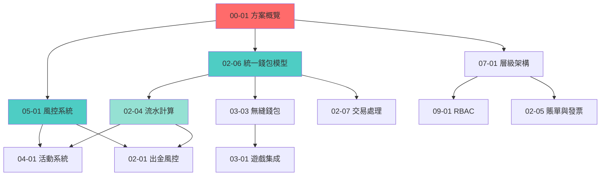

# IGaming需求框架 - 文檔導航地圖

> **版本**: 1.1.0
> **最後更新**: 2026-02-04
> **維護團隊**: Architecture Team
>
> 📢 **v1.1.0 變更通知**:
> - 本文檔已從「詳細導航」轉變為「高層索引」
> - 詳細閱讀路徑已遷移至專門的導航文檔:
>   - 角色導航 → [QUICKSTART](../00_Foundation_NEW/00-00_QUICKSTART.md)
>   - 業務流程 → [BUSINESS_FLOWS](../00_Foundation_NEW/00-00_BUSINESS_FLOWS.md)
>   - 實作指南 → [IMPLEMENTATION_GUIDE](../00_Foundation_NEW/00-00_IMPLEMENTATION_GUIDE.md)
---

## 📋 目錄

- [快速導航](#快速導航)
  - [按角色導航](#按角色導航)
  - [按業務流程導航](#按業務流程導航)
  - [按優先級閱讀](#按優先級閱讀)
- [文檔編號規範](#文檔編號規範)
- [核心概念依賴圖](#核心概念依賴圖)
- [完整文檔清單](#完整文檔清單)
- [變更日誌](#變更日誌)

---

## 🗺️ 快速導航

### 按角色導航

> 📌 **完整角色導航**: [QUICKSTART §2.2](../00_Foundation_NEW/00-00_QUICKSTART.md#按角色快速導航)

| 角色 | 核心關注點 | 必讀文檔 (P0) | 完整路徑 |
|------|-----------|-------------|---------|
| 產品經理 | 業務邏輯、規則設計 | 方案概覽, 玩家生命週期, 活動系統 | [QUICKSTART](../00_Foundation_NEW/00-00_QUICKSTART.md#產品經理) |
| 架構師 | 整體架構、技術選型 | 多租戶架構, 統一錢包, 網關設計 | [QUICKSTART](../00_Foundation_NEW/00-00_QUICKSTART.md#架構師) |
| 後端工程師 | 技術實現、API設計 | 錢包邏輯, Seamless API, 流水計算 | [QUICKSTART](../00_Foundation_NEW/00-00_QUICKSTART.md#後端開發工程師) |
| 前端工程師 | 介面設計、性能優化 | Layout引擎, 多語言, SEO優化 | [QUICKSTART](../00_Foundation_NEW/00-00_QUICKSTART.md#前端開發工程師) |
| 測試工程師 | 測試場景、邊界情況 | QA標準, 核心業務邏輯, 極端場景 | [QUICKSTART](../00_Foundation_NEW/00-00_QUICKSTART.md#測試工程師) |
| 運維工程師 | 部署、監控、維護 | 部署流程, 網關流控, 維護SOP | [QUICKSTART](../00_Foundation_NEW/00-00_QUICKSTART.md#運維工程師) |
| 安全工程師 | 數據安全、合規 | 數據加密, RBAC, 審計日誌 | [QUICKSTART](../00_Foundation_NEW/00-00_QUICKSTART.md#信息安全工程師) |

---

### 按業務流程導航

> 📌 **完整流程圖集**: [BUSINESS_FLOWS](../00_Foundation_NEW/00-00_BUSINESS_FLOWS.md)

| 流程 | 涉及模塊 | 關鍵難點 | 詳細文檔 |
|------|---------|---------|---------|
| 玩家註冊與KYC | 玩家、權限、錢包 | 多租戶分配、KYC驗證 | [BUSINESS_FLOWS §1](../00_Foundation_NEW/00-00_BUSINESS_FLOWS.md#flow-1-玩家註冊與kyc) |
| 存款與活動發放 | 支付、錢包、活動 | PSP整合、紅利觸發 | [BUSINESS_FLOWS §2](../00_Foundation_NEW/00-00_BUSINESS_FLOWS.md#flow-2-存款與活動發放) |
| 遊戲對接與Token | 遊戲、錢包、流水 | Token安全、冪等性 | [BUSINESS_FLOWS §3](../00_Foundation_NEW/00-00_BUSINESS_FLOWS.md#flow-3-遊戲對接與token) |
| 出金審核與風控 | 風控、審批、支付 | 多層審核、SAGA補償 | [BUSINESS_FLOWS §4](../00_Foundation_NEW/00-00_BUSINESS_FLOWS.md#flow-4-出金審核與風控) |
| 流水計算與對帳 | 流水、對賬、風控 | 三層驗證、一致性 | [BUSINESS_FLOWS §5](../00_Foundation_NEW/00-00_BUSINESS_FLOWS.md#flow-5-流水計算與對帳) |
| 代理佣金結算 | 代理、流水、賬單 | 佣金算法、信用結算 | [BUSINESS_FLOWS §6](../00_Foundation_NEW/00-00_BUSINESS_FLOWS.md#flow-6-代理佣金結算) |

---

### 按優先級閱讀

> 📌 **完整閱讀路徑**: [QUICKSTART §2.3](../00_Foundation_NEW/00-00_QUICKSTART.md#按優先級閱讀)

| 優先級 | 主題 | 文檔數 | 關鍵文檔 |
|-------|------|-------|---------|
| 🔴 P0 | 整體架構、核心邏輯 | 5 | 方案概覽, 行業術語, 統一錢包, 風控, RBAC |
| 🟠 P1 | 核心業務邏輯 | 5 | 玩家賬戶, 出金風控, 流水計算, 遊戲集成, 活動系統 |
| 🟡 P2 | 專項技術 | 8 | 交易處理, 無縫錢包, 多租戶, 審計日誌, 數據安全, 部署, 網關 |
| 🟢 P3 | 支撐系統 | 6+ | 支付網關, 對賬, 賬單, 代理系統, 多語言, 其他 |

**總計**: 24+ 核心文檔，涵蓋 iGaming 平台全棧架構

---

## 📐 文檔編號規範

### 編號格式

```text
格式：XX-YY[-ZZ]
```

- **XX**: 主模塊編號（00-13，兩位數字）
- **YY**: 子模塊編號（01-99，兩位數字）
- **ZZ**: 細分文檔編號（可選，用於超長文件拆分）

### 模塊編號分配

| 編號範圍 | 模塊名稱 | 英文名稱 | 說明 |
|---------|---------|---------|------|
| **00** | 概念與分析 | Concept & Analysis | 行業知識、術語、標準 |
| **01** | 玩家中心 | Player Center | 玩家賬戶、VIP系統 |
| **02** | 財務中心 | Finance Center | 錢包、支付、對賬、流水 |
| **03** | 遊戲中心 | Game Center | 遊戲集成、無縫錢包 |
| **04** | 活動中心 | Activity Center | 紅利、活動系統 |
| **05** | 風險管理 | Risk Management | 風控引擎、信用風控 |
| **06** | 代理中心 | Agent Center | 代理系統、信用網絡 |
| **07** | 平台管理 | Platform Management | 多租戶、通知、數據管道 |
| **08** | 前端CMS | Frontend CMS | 佈局、多語言、移動端 |
| **09** | 系統安全 | System Security | RBAC、審計、加密 |
| **10** | 報表與BI | Reporting & BI | **預留**（未來擴展） |
| **11** | 客戶服務 | Customer Service | 客服平台、工單系統 |
| **12** | 技術運維 | Technical Operations | 部署、測試、網關、維護 |
| **13** | 第三方集成 | Third-Party Integration | **預留**（未來擴展） |

### 編號規則

1. **唯一性**：每個編號只能對應一個文件
2. **連續性**：同一模塊內盡量連續編號（如 02-01, 02-02, 02-03...）
3. **預留**：10、13 為預留編號，明確用途後再使用
4. **拆分**：超長文件（>600行）可拆分為 XX-YY-01, XX-YY-02 等

### 文件命名規範

```text
格式：XX-YY[-ZZ]_英文標題.md

示例：
✅ 02-06_Unified_Wallet_Model.md
✅ 09-02-01_Audit_Log_System.md
❌ 2-6_wallet.md（編號不足兩位）
❌ 02-06-錢包模型.md（中文標題）
```

### 文件大小建議

| 文件行數 | 建議操作 |
|---------|---------|
| < 60行 | 考慮擴充內容或與相關文檔合併 |
| 60-400行 | **理想範圍**，保持單文件 |
| 400-600行 | 可接受，視章節獨立性決定是否拆分 |
| > 600行 | **強烈建議拆分**為多個子文檔 |

---

## 🔗 核心概念依賴圖

### 整體架構依賴

```text
                    ┌─────────────────┐
                    │  00 概念與分析   │
                    │  (知識庫層)      │
                    └────────┬────────┘
                             │
         ┌───────────────────┼───────────────────┐
         │                   │                   │
    ┌────▼─────┐      ┌──────▼─────┐      ┌─────▼────┐
    │ 09 安全  │      │ 12 技術運維 │      │          │
    │ (基礎設施層)    │ (基礎設施層) │      │          │
    └────┬─────┘      └──────┬─────┘      │          │
         │                   │            │          │
         └───────────────────┼────────────┘          │
                             │                       │
              ┌──────────────▼──────────────┐        │
              │  02 財務 / 05 風控 / 07 平台 │        │
              │      (核心服務層)            │        │
              └──────────────┬──────────────┘        │
                             │                       │
       ┌─────────────────────┼────────────────┐      │
       │                     │                │      │
  ┌────▼────┐          ┌─────▼─────┐    ┌────▼───┐  │
  │ 01 玩家 │          │ 03 遊戲   │    │ 04 活動│  │
  │ 06 代理 │          │           │    │ 11 客服│  │
  └────┬────┘          └─────┬─────┘    └────┬───┘  │
       │                     │                │      │
       └─────────────────────┼────────────────┘      │
                             │                       │
                      ┌──────▼──────┐                │
                      │  08 前端CMS  │                │
                      │  (用戶界面層)│◄───────────────┘
                      └─────────────┘
```

### 核心模塊依賴關係



### 關鍵依賴說明

| 上游文檔 | 下游文檔 | 依賴關係說明 |
|---------|---------|-------------|
| [02-06 統一錢包](../02_Finance_Center/02-06_Unified_Wallet_Model.md) | [02-07 交易處理](../02_Finance_Center/02-07_Transaction_Processing_Flow.md) | 交易處理依賴錢包模型定義 |
| [02-06 統一錢包](../02_Finance_Center/02-06_Unified_Wallet_Model.md) | [03-03 無縫錢包](../03_Game_Center/03-03_Seamless_Wallet_Analysis.md) | GP對接使用錢包API |
| [02-04 流水計算](../02_Finance_Center/02-04_Turnover_and_Game_Reconciliation_Analysis.md) | [04-01 活動系統](../04_Activity_Center/01-system-design.md) | 活動使用流水驗證數據 |
| [05-01 風控系統](../04_Risk_Control/04-01_Risk_Framework.md) | [02-01 出金風控](../01_Player_Center/01-05_Withdrawal_Risk.md) | 出金引用風控引擎API |
| [05-01 風控系統](../04_Risk_Control/04-01_Risk_Framework.md) | [04-01 活動系統](../04_Activity_Center/01-system-design.md) | 活動引用風控檢測 |
| [07-01 層級架構](../05_Platform_Governance_NEW/05-01_Multi_Tenant.md) | [09-01 RBAC](../05_Platform_Governance_NEW/05-02_RBAC_Permissions.md) | RBAC基於層級架構 |
| [09-04 審批工作流](../05_Platform_Governance_NEW/05-04_Approval_Workflow.md) | [02-01 出金風控](../01_Player_Center/01-05_Withdrawal_Risk.md) | 出金審批使用審批工作流 |
| [09-02 審計日誌](../05_Platform_Governance_NEW/05-03_Audit_Log.md) | [09-04 審批工作流](../05_Platform_Governance_NEW/05-04_Approval_Workflow.md) | 審批操作記錄在審計日誌 |

---

## 🗄️ 歷史歸檔

已完成的審計報告、技術分析、階段修正文件已移至歸檔目錄：

- **[歸檔索引](../archive/INDEX.md)** - 完整的歷史文檔導航
  - [審計報告](../archive/audit-reports/) - 4 個文檔審計與實作完成報告
  - [技術分析](../archive/analysis/) - 8 個邏輯分析與錯誤審查報告
  - [階段修正](../archive/corrections/) - 4 個階段性修正總結

所有歸檔文件的 Git 歷史完整保留，可使用 `git log --follow` 追溯。

---

## 📚 完整文檔清單

### 00 - 概念與分析 (Concept & Analysis)

| 編號 | 文檔名稱 | 簡介 | 行數 |
|------|---------|------|------|
| 00-00 | [Document_Map.md](./00-00_Document_Map.md) | **本文檔** - 導航地圖 | - |
| 00-01 | [Solution_Overview.md](./00-01_Solution_Overview.md) | 全局方案概覽、市場分析 | 440 |
| 00-02 | [Industry_Terminology.md](./00-02_Industry_Terminology.md) | 200+行業術語標準化 | 336 |

---

### 01 - 玩家中心 (Player Center)

| 編號 | 文檔名稱 | 簡介 | 行數 |
|------|---------|------|------|
| 01-01 | [Player_Account_System.md](../03_Player_Journey/03-01_Player_Lifecycle.md) | 玩家註冊、KYC、MFA | 67 |
| 01-02 | [VIP_&_Loyalty_System.md](../03_Player_Journey/03-02_VIP_Loyalty.md) | VIP等級、忠誠度積分 | 987 ✅ |

> ✅ **已擴充** (v2.0.0): 01-02 文檔已大幅擴充,包含 VIP 權益詳細清單、積分計算規則、等級升降邏輯

---

### 02 - 財務中心 (Finance Center)

| 編號 | 文檔名稱 | 簡介 | 行數 |
|------|---------|------|------|
| 02-01 | [Withdrawal_Risk_Control.md](../01_Player_Center/01-05_Withdrawal_Risk.md) | 出金風控、多層審核、SAGA | 430+ |
| 02-02 | [Payment_Gateway_Integration.md](../02_Finance_Center/02-02_Payment_Gateway_Integration.md) | PSP集成、智能路由 | 44 ⚠️ |
| 02-03 | [Reconciliation_System.md](../02_Finance_Center/02-03_Reconciliation_System.md) | 三方對賬系統 | 47 ⚠️ |
| 02-04 | [Turnover_and_Game_Reconciliation_Analysis.md](../02_Finance_Center/02-04_Turnover_and_Game_Reconciliation_Analysis.md) | **核心** - 流水計算三層驗證（含補充圖表） | 538 |
| 02-04-diagrams | **補充資料目錄** - 流水計算詳細圖表 | 流程圖、時序圖、實作細節（3個文件） | 📁 |
| 02-05 | [Billing_&_Invoicing.md](../02_Finance_Center/02-05_Billing_&_Invoicing.md) | B2B租戶計費系統 | 67 |
| 02-06 | [Unified_Wallet_Model.md](../02_Finance_Center/02-06_Unified_Wallet_Model.md) | **核心** - 錢包模型、可下注餘額公式 | 100+ |
| 02-07 | [Transaction_Processing_Flow.md](../02_Finance_Center/02-07_Transaction_Processing_Flow.md) | 事件驅動、Outbox Pattern | 113 |

> ⚠️ **待擴充**：02-02、02-03 文檔較短
> 📁 **補充資料**：02-04-diagrams 包含流水計算的流程圖、時序圖與實作細節

---

### 03 - 遊戲中心 (Game Center)

| 編號 | 文檔名稱 | 簡介 | 行數 |
|------|---------|------|------|
| 03-01 | [Game_Integration_Standard.md](../03_Game_Center/03-01_Game_Integration_Standard.md) | GP API規格、HMAC安全 | 80 |
| 03-02 | [Game_Lobby_Management.md](../03_Game_Center/03-02_Game_Lobby_Management.md) | 遊戲大廳元數據管理 | 51 |
| 03-03 | [Seamless_Wallet_Analysis.md](../03_Game_Center/03-03_Seamless_Wallet_Analysis.md) | 無縫錢包極端場景分析 | 240 |

> ✅ **編號衝突已修復**：原 03-02_Seamless_Wallet_Analysis.md 已重命名為 03-03

---

### 04 - 活動中心 (Activity Center)

| 編號 | 文檔名稱 | 簡介 | 行數 |
|------|---------|------|------|
| 04-01 | [Activity_System_Design.md](../04_Activity_Center/01-system-design.md) | 紅利系統、流水要求、風控整合 | 80+ |

---

### 05 - 風險管理 (Risk Management)

| 編號 | 文檔名稱 | 簡介 | 行數 |
|------|---------|------|------|
| 05-01 | [Risk_Control_System.md](../04_Risk_Control/04-01_Risk_Framework.md) | **核心** - 平台級風控引擎、ML模型 | 80+ |
| 05-02 | [Agent_Credit_Risk.md](../05_Risk_Management/05-02_Agent_Credit_Risk.md) | 代理信用評分、Margin Call | 86 |

---

### 06 - 代理中心 (Agent Center)

| 編號 | 文檔名稱 | 簡介 | 行數 |
|------|---------|------|------|
| 06-01 | [Affiliate_System_Design.md](../03_Player_Journey/03-04_Agent_System.md) | 無限層級代理系統 | 61 |
| 06-02 | [Credit_Network_Logic.md](../06_Agent_Center/06-02_Credit_Network_Logic.md) | 信用額度網絡、持倉 | 70 |

---

### 07 - 平台管理 (Platform Management)

| 編號 | 文檔名稱 | 簡介 | 行數 |
|------|---------|------|------|
| 07-01 | [Hierarchy_Architecture.md](../05_Platform_Governance_NEW/05-01_Multi_Tenant.md) | 四層多租戶架構 | 39 ⚠️ |
| 07-02 | [Tenant_Configuration.md](../07_Platform_Management/07-02_Tenant_Configuration.md) | 租戶自助配置 | 55 |
| 07-03 | [Notification_Architecture.md](../07_Platform_Management/07-03_Notification_Architecture.md) | 多渠道通知系統 | 80 |
| 07-04 | [Data_Pipeline_Architecture.md](../07_Platform_Management/07-04_Data_Pipeline_Architecture.md) | ODS→DWD→DWS→ADS 數據分層 | 82 |

> ⚠️ **待擴充**：07-01 文檔較短

---

### 08 - 前端CMS (Frontend CMS)

| 編號 | 文檔名稱 | 簡介 | 行數 |
|------|---------|------|------|
| 08-01 | [Frontend_Layout_Engine.md](../08_Frontend_CMS/08-01_Frontend_Layout_Engine.md) | 拖拽式佈局引擎 | 71 |
| 08-02 | [Banner_&_Announcement.md](../08_Frontend_CMS/08-02_Banner_&_Announcement.md) | Banner管理 | 35 |
| 08-03 | [SEO_&_Performance.md](../08_Frontend_CMS/08-03_SEO_&_Performance.md) | SSR/ISR、Core Web Vitals | 58 |
| 08-04 | [Mobile_App_Architecture.md](../08_Frontend_CMS/08-04_Mobile_App_Architecture.md) | Flutter/React Native | 49 |
| 08-05 | [Localization_System.md](../08_Frontend_CMS/08-05_Localization_System.md) | i18n完整架構、Crowdin集成 | 590 📏 |

> 📏 **考慮拆分**：08-05 文檔較長（590行），可拆分為多個子文檔

---

### 09 - 系統安全 (System Security)

| 編號 | 文檔名稱 | 簡介 | 行數 |
|------|---------|------|------|
| 09-01 | [Admin_RBAC.md](../05_Platform_Governance_NEW/05-02_RBAC_Permissions.md) | 管理後台權限管理 | 80+ |
| 09-02 | [Audit_Log_System.md](../05_Platform_Governance_NEW/05-03_Audit_Log.md) | **核心** - 審計日誌記錄與檢索系統 | 832 📏 |
| 09-03 | [Data_Security_Standard.md](../09_System_Security/09-03_Data_Security_Standard.md) | 加密、盲索引、GDPR Crypto-Shredding | 676 📏 |
| 09-04 | [Approval_Workflow_System.md](../05_Platform_Governance_NEW/05-04_Approval_Workflow.md) | **核心** - Maker-Checker 審批工作流 | 833 📏 |

> 📏 **考慮拆分**：09-02（832行）、09-03（676行）、09-04（833行）文檔較長
> ✅ **內容去重完成**：09-02 專注審計日誌，09-04 專注審批流程，已移除重複的合併版文件

---

### 10 - 報表與BI (Reporting & BI)

| 編號 | 文檔名稱 | 簡介 | 狀態 |
|------|---------|------|------|
| 10-XX | **預留模塊** | 報表系統、數據可視化、BI平台 | 🔜 待規劃 |

---

### 11 - 客戶服務 (Customer Service)

| 編號 | 文檔名稱 | 簡介 | 行數 |
|------|---------|------|------|
| 06-02 | [Customer_Service.md](../06_Analytics_Operations_NEW/06-02_Customer_Service.md) | 客服平台、Player 360 View、AI 客服 | 520 ✅ |

> ⚠️ **待擴充**：建議補充知識庫管理、智能客服機器人、SLA監控

---

### 12 - 技術運維 (Technical Operations)

| 編號 | 文檔名稱 | 簡介 | 行數 |
|------|---------|------|------|
| 12-01 | [Deployment_Architecture.md](../07_Technical_Infrastructure_NEW/07-01_Deployment.md) | Blue-Green、Canary、回滾 | 501 |
| 12-02 | [QA_Testing_Standard.md](../07_Technical_Infrastructure_NEW/07-04_QA_Standards.md) | 測試金字塔、K6性能測試 | 426 |
| 12-03 | [Gateway_Architecture.md](../07_Technical_Infrastructure_NEW/07-02-01_Gateway_Core.md) | 限流、熔斷、DDoS防護 | 511 |
| 12-04 | [Maintenance_Procedure.md](../07_Technical_Infrastructure_NEW/07-05_Maintenance.md) | Graceful Shutdown、維護SOP | 611 |

---

### 13 - 第三方集成 (Third-Party Integration)

| 編號 | 文檔名稱 | 簡介 | 狀態 |
|------|---------|------|------|
| 13-XX | **預留模塊** | 第三方服務集成標準、Webhook管理 | 🔜 待規劃 |

---

## 📈 文檔質量指標

### 當前狀態

| 指標 | 目標值 | 當前值 | 狀態 |
|------|--------|--------|------|
| 編號唯一性 | 100% | ✅ 100% | 已修復衝突 |
| 術語一致性 | >95% | 🟡 ~85% | 待標準化 |
| 交叉引用覆蓋率 | >80% | 🟡 ~40% | 待增強 |
| 超長文件（>600行）| 0個 | 🔴 3個 | 待拆分 |
| 簡短文件（<60行）| <5個 | 🟡 5個 | 待擴充 |

### 改進計劃

- ✅ **Phase 1（已完成）**：修復編號衝突、創建文檔地圖、術語標準化
- 🔜 **Phase 2（計劃中）**：整合重複內容、添加交叉引用
- 🔜 **Phase 3（計劃中）**：拆分超長文件、擴充簡短文件
- 🔜 **Phase 4（計劃中）**：補充缺失文檔（數據模型總覽、API設計標準）

---

## 🔍 快速查找索引 (Quick Reference Index)

### 按開發任務查找

> 📌 **完整實作指南**: [IMPLEMENTATION_GUIDE](../00_Foundation_NEW/00-00_IMPLEMENTATION_GUIDE.md)

| 任務類型 | 範例 | 參考章節 |
|---------|------|---------|
| 財務系統 | 新支付方式、錢包系統 | IMPLEMENTATION_GUIDE §1-4 |
| 遊戲對接 | 新GP對接、Seamless API | IMPLEMENTATION_GUIDE §5-7 |
| 活動系統 | Bonus引擎、VIP系統 | IMPLEMENTATION_GUIDE §8-10 |
| 風控系統 | 規則引擎、欺詐檢測 | IMPLEMENTATION_GUIDE §11-13 |
| 平台治理 | 多租戶、RBAC、審計 | IMPLEMENTATION_GUIDE §14-17 |

### 按技術主題查找 (SSOT 快速索引)

> ⭐ **SSOT (Single Source of Truth)** - 唯一權威定義

| 主題 | 關鍵文檔 | SSOT |
|------|---------|------|
| **可下注餘額公式** | [01-02 Wallet_Architecture §2.3](../01_Core_Financial_Loop_NEW/01-02_Wallet_Architecture.md#23-可下注餘額計算) | ⭐ |
| **有效投注算法** | [02-03 Turnover_Calculation §1](../02_Game_Operations_NEW/02-03_Turnover_Calculation.md#1-有效投注-valid-turnover-核心算法) | ⭐ |
| **Token驗證流程** | [02-02 Seamless_Wallet_API §4.2](../02_Game_Operations_NEW/02-02_Seamless_Wallet_API.md#42-token-驗證) | ⭐ |
| **風控規則引擎** | [04-01 Risk_Engine §2](../04_Risk_Control/04-01_Risk_Framework.md#2-規則引擎架構) | ⭐ |
| **SAGA補償事務** | [01-05 Withdrawal_Risk §4.3](../01_Player_Center/01-05_Withdrawal_Risk.md#43-saga-補償事務) | ⭐ |
| **PII加密標準** | [05-05 Data_Security §2](../05_Platform_Governance_NEW/05-05_Data_Security.md#2-pii-加密策略) | ⭐ |
| **多租戶隔離** | [05-01 Multi_Tenant §3](../05_Platform_Governance_NEW/05-01_Multi_Tenant.md#3-數據隔離策略) | ⭐ |

### 按問題類型查找

| 問題類型 | 診斷文檔 | 關鍵檢查點 |
|---------|---------|-----------|
| 錢包餘額不一致 | [01-02 §2.3](../01_Core_Financial_Loop_NEW/01-02_Wallet_Architecture.md#23-可下注餘額計算), [01-04 §3](../01_Core_Financial_Loop_NEW/01-04_Settlement.md#3-對賬流程) | 三方對賬、事務補償 |
| 流水計算錯誤 | [02-03 §1.6](../02_Game_Operations_NEW/02-03_Turnover_Calculation.md#16-故障排除), [04-01 §3](../04_Risk_Control/04-01_Risk_Framework.md#3-流水驗證) | 三層架構、風控因子 |
| 支付回調失敗 | [02-02 §4](../02_Finance_Center/02-02_Payment_Gateway_Integration.md#4-回調處理), [05-05 §3](../05_Platform_Governance_NEW/05-05_Data_Security.md#3-簽名驗證) | 簽名驗證、冪等性 |
| GP對接異常 | [02-02 §5](../02_Game_Operations_NEW/02-02_Seamless_Wallet_API.md#5-極端場景), [02-03 §2](../02_Game_Operations_NEW/02-03_Turnover_Calculation.md#2-對賬驗證) | Token過期、重試機制 |
| 權限異常 | [05-02 §4](../05_Platform_Governance_NEW/05-02_RBAC_Permissions.md#4-故障排除), [05-01 §4](../05_Platform_Governance_NEW/05-01_Multi_Tenant.md#4-Context傳播) | RBAC評估、Context丟失 |


## 📝 變更日誌 (CHANGELOG)

### v1.1.0 (2026-02-04)

#### ♻️ Restructured (Breaking Change)

**Document_Map 角色轉變**: 從詳細導航 → 高層元導航索引

**移除的章節**:
- ❌ 故障排除指南 (196 lines) → 內容重定向至 [IMPLEMENTATION_GUIDE](../00_Foundation_NEW/00-00_IMPLEMENTATION_GUIDE.md)

**簡化的章節**:
- ⚠️ 按角色導航 (67 → 13 lines) → 詳細路徑遷移至 [QUICKSTART §2.2](../00_Foundation_NEW/00-00_QUICKSTART.md#按角色快速導航)
- ⚠️ 按業務流程導航 (132 → 14 lines) → 詳細流程圖遷移至 [BUSINESS_FLOWS](../00_Foundation_NEW/00-00_BUSINESS_FLOWS.md)
- ⚠️ 按優先級閱讀 (88 → 13 lines) → 完整閱讀路徑遷移至 [QUICKSTART §2.3](../00_Foundation_NEW/00-00_QUICKSTART.md#按優先級閱讀)

**新增的章節**:
- ✅ 快速查找索引 (50 lines) - 整合開發任務查找、SSOT 技術主題索引、問題診斷查找

**改進成果**:
- 📉 文檔長度: 921 → ~450 lines (**51% reduction**)
- 🎯 定位更清晰: Meta-navigation hub，指向專門導航文檔
- 🔗 減少冗余: 與 QUICKSTART、BUSINESS_FLOWS、IMPLEMENTATION_GUIDE 的重複內容移除
- ⭐ SSOT 索引: 新增 7 個核心技術主題的權威定義快速索引

#### 📋 Migration Guide

**如何查找內容（v1.1.0 更新後）**:
- **按角色查找** → [QUICKSTART §2.2](../00_Foundation_NEW/00-00_QUICKSTART.md#按角色快速導航)
- **按流程查找** → [BUSINESS_FLOWS](../00_Foundation_NEW/00-00_BUSINESS_FLOWS.md)
- **按優先級查找** → [QUICKSTART §2.3](../00_Foundation_NEW/00-00_QUICKSTART.md#按優先級閱讀)
- **實作指南** → [IMPLEMENTATION_GUIDE](../00_Foundation_NEW/00-00_IMPLEMENTATION_GUIDE.md)
- **SSOT 定義** → 本文檔 §快速查找索引 > 按技術主題查找

---

### v1.0.0 (2026-01-27)

#### ✅ Added
- **創建文檔導航地圖**（本文檔）
  - 按角色導航（產品、架構、開發、測試、運維、安全）
  - 按業務流程導航（註冊、存款、遊戲、提款、活動、代理）
  - 按優先級閱讀指南（P0-P3）
  - 文檔編號規範詳細說明
  - 核心概念依賴圖
  - 完整文檔清單（36個文檔）
  - 變更日誌

#### 🔧 Fixed
- **修復編號衝突**
  - 重命名 `03-02_Seamless_Wallet_Analysis.md` → `03-03_Seamless_Wallet_Analysis.md`
  - 確保所有文檔編號唯一

#### 📋 Changed
- **統一編號規範**
  - 明確XX-YY[-ZZ]格式
  - 明確預留編號（10: Reporting & BI, 13: Third-Party Integration）
  - 文件大小建議（<60行擴充，>600行拆分）

#### 🔜 Planned (Next Phase)
- **術語標準化**：更新 00-02_Industry_Terminology.md，執行全局術語替換
- **內容整合**：合併重複內容（錢包管理、流水計算、風控引擎等）
- **交叉引用**：為核心文檔添加"相關文檔"章節
- **文件優化**：拆分超長文件（08-05, 09-02, 09-03），擴充簡短文件
- **新增文檔**：
  - `00-03_Data_Model_Overview.md` - 數據模型總覽
  - `00-04_Technology_Stack.md` - 技術選型標準
  - `12-05_API_Design_Standard.md` - API設計規範

---

## 📮 反饋與貢獻

### 文檔維護責任

- **整體維護**：Architecture Team
- **模塊負責人**：
  - 00-02 財務中心：Finance Team Lead
  - 03 遊戲中心：Game Integration Team
  - 05 風險管理：Risk Control Team
  - 09 系統安全：Security Team
  - 12 技術運維：DevOps Team

### 文檔更新流程

1. **新增文檔**：
   - 按編號規範命名
   - 更新本文檔地圖的"完整文檔清單"章節
   - 在CHANGELOG中記錄新增

2. **修改文檔**：
   - 重大變更需在文檔頭部更新"最後更新日期"
   - 影響依賴關係的變更需更新"核心概念依賴圖"

3. **刪除文檔**：
   - 需經架構評審
   - 更新所有引用此文檔的鏈接
   - 在CHANGELOG中記錄刪除原因

### 聯繫方式

- **文檔問題反饋**：請聯繫 Architecture Team
- **內容錯誤修正**：請聯繫對應模塊負責人
- **新增模塊建議**：請提交架構評審申請

---

**文檔版本**: 1.0.0
**生成日期**: 2026-01-27
**下次審閱**: 2026-04-27（每季度審閱）
