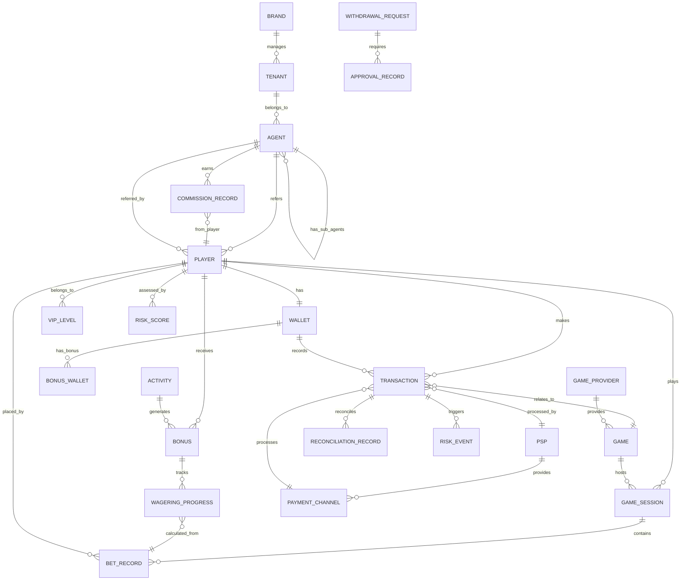
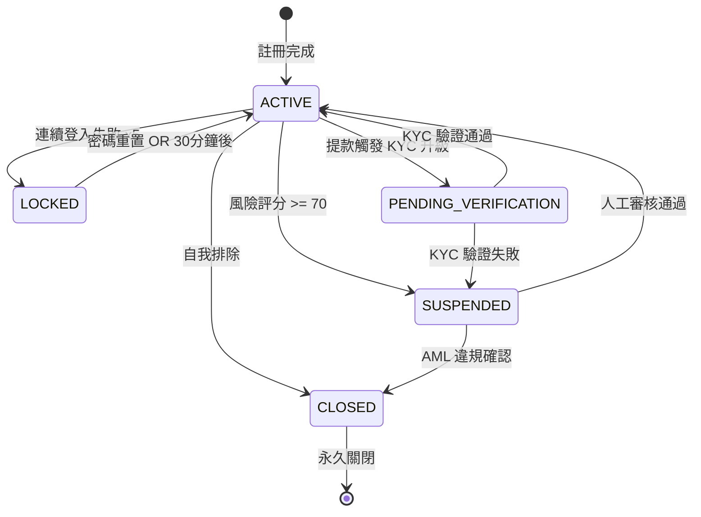
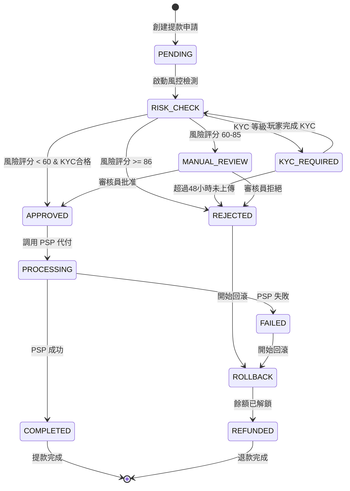
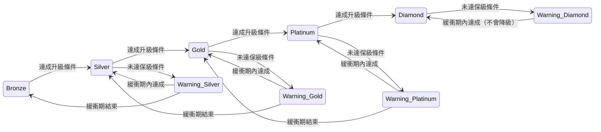

# 數據模型總覽 (Data Model Overview)

> **版本**: 1.1.0 (Week 4-5 Enhancement)
> **最後更新**: 2026-02-03
> **目的**: 提供 IGaming 平台所有核心數據實體的統一視圖
> **更新內容**: 添加 3 個狀態機設計 + 8 個 SSOT Markers + 增強交叉引用

---

## 📋 目錄

- [核心實體關係圖](#核心實體關係圖)
- [實體分層架構](#實體分層架構)
- [狀態機設計](#狀態機設計) 🆕
- [跨模組外鍵關係](#跨模組外鍵關係)
- [核心數據表設計](#核心數據表設計)
- [數據一致性約束](#數據一致性約束)
- [索引策略](#索引策略)
- [數據安全與加密](#數據安全與加密)

---

## 🔗 核心實體關係圖

### 整體 ER 圖



---

## 🏗️ 實體分層架構

### Layer 1: 多租戶與組織架構

```
Super Admin (系統級)
    └─ Brand (品牌)
        └─ Tenant (租戶/運營商)
            └─ Agent (代理)
                └─ Player (玩家)
```

**核心實體**:
- `brands` - 品牌主體
- `tenants` - 租戶/運營商
- `agents` - 代理系統（無限層級）
- `players` - 終端玩家

---

### Layer 2: 財務核心

```
Player Wallet (玩家錢包)
    ├─ Cash Balance (現金餘額)
    ├─ Bonus Balance (紅利餘額)
    └─ Credit Balance (信用額度)
```

**核心實體**:
- `wallets` - 統一錢包主表
- `transactions` - 所有資金流轉記錄
- `bonus_wallets` - 紅利子錢包
- `withdrawal_requests` - 提款申請
- `deposit_records` - 存款記錄

---

### Layer 3: 遊戲與投注

```
Game Provider
    └─ Game
        └─ Game Session
            └─ Bet Record (下注記錄)
```

**核心實體**:
- `game_providers` - 遊戲供應商 (GP)
- `games` - 遊戲目錄
- `game_sessions` - 遊戲會話
- `bet_records` - 投注明細
- `game_round_aggregation` - 遊戲局彙總

---

### Layer 4: 活動與風控

**活動系統**:
- `activities` - 活動配置
- `bonuses` - 紅利發放記錄
- `wagering_progress` - 流水進度追蹤

**風控系統**:
- `risk_rules` - 風控規則配置
- `risk_scores` - 玩家風險評分
- `risk_events` - 風險事件記錄
- `approval_workflows` - 審批工作流

---

## 🔄 狀態機設計

### 1. Player Account State Machine (玩家帳戶狀態機)

> 💡 **SSOT Marker**: 玩家帳戶狀態的完整定義請參考 [01-01_Player_Lifecycle.md §3](../01_Player_Center/01-01_Player_Lifecycle.md#3-account-status-state-machine)

**五狀態定義**:

| 狀態碼 | 英文名稱 | 觸發條件 | 業務影響 | 恢復路徑 |
|-------|---------|---------|---------|---------|
| `ACTIVE` | 活躍 | 預設狀態 | 無限制，可正常操作 | N/A |
| `LOCKED` | 鎖定 | 連續登入失敗 5 次 | 禁止登入 30 分鐘 | 密碼重置 OR 自動解鎖 |
| `SUSPENDED` | 暫停 | 風險評分 >= 70 | 禁止充值/提款/投注 | 人工審核通過 |
| `PENDING_VERIFICATION` | 待驗證 | 提款觸發 KYC 升級 | 限制提款額度（<$1000） | KYC 驗證通過 |
| `CLOSED` | 關閉 | 自我排除 OR AML 違規 | 禁止所有操作，永久關閉 | 不可恢復 |

**狀態轉換圖**:



**狀態轉換觸發示例**:

```sql
-- ACTIVE → LOCKED（登入失敗觸發）
UPDATE players
SET account_status = 'LOCKED',
    locked_until = NOW() + INTERVAL '30 MINUTE',
    failed_login_attempts = failed_login_attempts + 1,
    updated_at = NOW()
WHERE player_id = ?
  AND account_status = 'ACTIVE'
  AND failed_login_attempts >= 4;

-- LOCKED → ACTIVE（自動解鎖）
UPDATE players
SET account_status = 'ACTIVE',
    failed_login_attempts = 0,
    locked_until = NULL,
    updated_at = NOW()
WHERE account_status = 'LOCKED'
  AND locked_until < NOW();
```

---

### 2. Withdrawal State Machine (提款狀態機)

> 💡 **SSOT Marker**: 提款流程的完整 SAGA 定義請參考 [01-05_Withdrawal_Risk.md §7.2](../01_Player_Center/01-05_Withdrawal_Risk.md#72-saga-orchestration-workflow)

**十狀態定義**:

| 狀態碼 | 說明 | 可能轉換 | 業務影響 |
|-------|------|---------|---------|
| `PENDING` | 提款申請已創建 | → RISK_CHECK, REJECTED | 餘額已鎖定 |
| `RISK_CHECK` | 風控檢測中 | → KYC_REQUIRED, APPROVED, MANUAL_REVIEW | 實時風險評分 |
| `KYC_REQUIRED` | 需要 KYC 升級 | → RISK_CHECK | 等待玩家上傳文件 |
| `MANUAL_REVIEW` | 人工審核 | → APPROVED, REJECTED | L1/L2/L3 審核員介入 |
| `APPROVED` | 審核通過 | → PROCESSING | 準備代付 |
| `PROCESSING` | PSP 代付中 | → COMPLETED, FAILED | 調用 PSP API |
| `COMPLETED` | 提款成功 | [終態] | 資金到賬 |
| `FAILED` | 提款失敗 | → ROLLBACK | PSP 返回失敗 |
| `ROLLBACK` | 餘額回滾中 | → REFUNDED | 釋放鎖定餘額 |
| `REFUNDED` | 已退款 | [終態] | 餘額已解鎖 |
| `REJECTED` | 審核拒絕 | → REFUNDED | 風控/人工拒絕 |

**SAGA 協調流程圖**:



**Step 2.5 延遲風控檢查** (v2.1.0):

```sql
-- 檢查歷史風控提案
SELECT COUNT(*) as pending_proposals
FROM withdrawal_risk_correlations wrc
JOIN withdrawal_requests wr ON wrc.withdrawal_id = wr.id
WHERE wrc.player_id = ?
  AND wrc.time_range_start <= NOW()
  AND wrc.time_range_end >= NOW()
  AND wr.status IN ('MANUAL_REVIEW', 'RISK_CHECK');

-- 如果 pending_proposals > 0，則當前提款強制進入 MANUAL_REVIEW
```

---

### 3. VIP Tier State Machine (VIP 等級狀態機)

> 💡 **SSOT Marker**: VIP 系統的完整設計請參考 [01-02_VIP_&_Loyalty_System.md §2.1.1](../01_Player_Center/01-02_VIP_&_Loyalty_System.md#211-vip-tier-state-machine)

**五級別定義**:

| 等級 | 保級條件（月） | 升級條件 | 警告狀態 | 降級緩衝期 |
|------|---------------|---------|---------|-----------|
| Bronze | $100 存款 OR $1000 流水 | $1000 存款 OR $10K 流水 | - | 無 |
| Silver | $1000 存款 OR $10K 流水 | $5000 存款 OR $50K 流水 | 7 天警告 | 30 天 |
| Gold | $5000 存款 OR $50K 流水 | $20K 存款 OR $200K 流水 | 14 天警告 | 60 天 |
| Platinum | $20K 存款 OR $200K 流水 | $100K 存款 OR $1M 流水 | 21 天警告 | 90 天 |
| Diamond | $100K 存款 OR $1M 流水 | - | 30 天警告 | 永久（除非違規） |

**狀態轉換示例**:



**降級補償機制**:

```yaml
demotion_compensation:
  Silver_to_Bronze:
    - 一次性 $50 現金返還
    - 7 天內 1.5x 返水加成

  Gold_to_Silver:
    - 一次性 $200 現金返還
    - 14 天內 2x 返水加成

  Platinum_to_Gold:
    - 一次性 $1000 現金返還
    - 21 天內 2.5x 返水加成
    - VIP 客戶經理聯繫
```

---

### 4. 狀態機設計原則 (Design Principles)

**1. 單向轉換優先 (One-Way Transitions)**:
- `CLOSED` 狀態不可恢復
- `COMPLETED` 提款不可取消
- 避免循環轉換（ACTIVE ↔ SUSPENDED 需人工介入）

**2. 冪等性保證 (Idempotency)**:
```java
// 狀態轉換必須檢查當前狀態
public Result<Void> transitionToLocked(String playerId) {
    return playerDao.findById(playerId)
        .filter(p -> p.getStatus() == AccountStatus.ACTIVE) // 前置條件檢查
        .map(p -> {
            p.setStatus(AccountStatus.LOCKED);
            p.setLockedUntil(LocalDateTime.now().plusMinutes(30));
            playerDao.updateById(p);
            return Result.success();
        })
        .getOrElse(Result.failure("Invalid state transition"));
}
```

**3. 審計日誌強制 (Audit Logging)**:
```sql
-- 所有狀態變更必須記錄
INSERT INTO player_status_audit_log (
    player_id,
    old_status,
    new_status,
    trigger_reason,
    operator_id,
    created_at
) VALUES (?, ?, ?, ?, ?, NOW());
```

**4. 狀態轉換觸發器 (State Transition Triggers)**:

| 觸發類型 | 示例 | 處理方式 |
|---------|------|---------|
| **時間觸發** | 30 分鐘後自動解鎖 | Cron Job |
| **事件觸發** | 登入失敗 5 次 | 實時檢測 |
| **手動觸發** | 審核員批准提款 | 審批流程 |
| **外部觸發** | PSP 返回失敗 | Webhook 回調 |

---

## 🔑 跨模組外鍵關係

### 主鍵與外鍵約束表

| 子表 (From) | 外鍵字段 | 父表 (To) | 關係類型 | 級聯刪除 | 說明 |
|------------|---------|----------|---------|---------|------|
| **玩家相關** |
| `players` | `tenant_id` | `tenants` | N:1 | RESTRICT | 玩家屬於租戶 |
| `players` | `agent_id` | `agents` | N:1 | SET NULL | 推薦代理（可為空）|
| `players` | `vip_level_id` | `vip_levels` | N:1 | SET NULL | VIP等級 |
| `wallets` | `player_id` | `players` | 1:1 | CASCADE | 錢包與玩家綁定 |
| **交易相關** |
| `transactions` | `player_id` | `players` | N:1 | RESTRICT | 交易所有者 |
| `transactions` | `wallet_id` | `wallets` | N:1 | RESTRICT | 關聯錢包 |
| `transactions` | `game_id` | `games` | N:1 | SET NULL | 遊戲交易（可選）|
| `transactions` | `psp_id` | `psps` | N:1 | SET NULL | 支付服務商 |
| **遊戲相關** |
| `games` | `provider_id` | `game_providers` | N:1 | CASCADE | 遊戲屬於GP |
| `game_sessions` | `player_id` | `players` | N:1 | RESTRICT | 玩家會話 |
| `game_sessions` | `game_id` | `games` | N:1 | RESTRICT | 遊戲會話 |
| `bet_records` | `session_id` | `game_sessions` | N:1 | CASCADE | 屬於某會話 |
| `bet_records` | `player_id` | `players` | N:1 | RESTRICT | 下注玩家 |
| **活動相關** |
| `bonuses` | `player_id` | `players` | N:1 | CASCADE | 紅利所有者 |
| `bonuses` | `activity_id` | `activities` | N:1 | RESTRICT | 活動來源 |
| `wagering_progress` | `bonus_id` | `bonuses` | N:1 | CASCADE | 流水進度追蹤 |
| **代理相關** |
| `agents` | `parent_agent_id` | `agents` | N:1 | RESTRICT | 上級代理（自引用）|
| `agents` | `tenant_id` | `tenants` | N:1 | RESTRICT | 所屬租戶 |
| `commission_records` | `agent_id` | `agents` | N:1 | RESTRICT | 佣金所有者 |
| `commission_records` | `player_id` | `players` | N:1 | RESTRICT | 佣金來源玩家 |
| **風控相關** |
| `risk_scores` | `player_id` | `players` | N:1 | CASCADE | 玩家風險評分 |
| `risk_events` | `transaction_id` | `transactions` | N:1 | CASCADE | 風險事件觸發交易 |
| `withdrawal_requests` | `player_id` | `players` | N:1 | RESTRICT | 提款申請人 |
| `approval_records` | `request_id` | `withdrawal_requests` | N:1 | CASCADE | 審批記錄 |

---

## 📊 核心數據表設計

### 1. Player (玩家表)

**表名**: `players`
**功能**: 玩家賬戶核心信息


**關鍵欄位說明**:
- **email_blind_index**: 使用 HMAC-SHA256 的盲索引，用於加密郵箱的可檢索查詢
- **password_hash**: 使用 Argon2id 算法，參數為 m=65536, t=3, p=4
- **kyc_status**: 支持增強盡職調查 (EDD) 流程

---

### 2. Wallet (錢包表)

**表名**: `wallets`
**功能**: 玩家統一錢包（現金+紅利+信用）


**可下注餘額公式**:

> 💡 **SSOT Marker**: 可下注餘額的完整計算邏輯請參考 [02-06_Unified_Wallet_Model.md §2.2](../02_Finance_Center/02-06_Unified_Wallet_Model.md#22-playable-balance-formula)

```text
Playable Balance = Cash + Bonus + (Credit Limit - Credit Used) - Locked Balance
```

**並發控制**:
- 使用 `version` 欄位實現樂觀鎖
- 更新語句示例：

---

### 3. Transaction (交易表)

**表名**: `transactions`
**功能**: 所有資金流轉的統一記錄


---

### 4. Bonus (紅利表)

**表名**: `bonuses`
**功能**: 玩家紅利發放與流水追蹤


---

### 5. Game (遊戲表)

**表名**: `games`
**功能**: 遊戲目錄與元數據


---

### 6. Withdrawal_Request (提款申請表)

**表名**: `withdrawal_requests`
**功能**: 玩家提款申請與審核流程


**SAGA 分佈式事務流程**:
```text
1. 創建提款申請 (Pending)
2. 鎖定錢包餘額 (Locked)
3. 風控檢測 (Risk Check)
4. 多層審批 (L1 → L2 → L3)
5. PSP代付 (Processing)
6. 完成/回滾 (Completed/Failed)
```

---

## ✅ 數據一致性約束

### 1. 錢包餘額一致性


---

### 2. 流水計算一致性

**三層驗證架構**:

> 💡 **SSOT Marker**: 三層驗證架構的完整設計請參考：
> - Layer 1 (風控驗證): [05-01_Risk_Control_System.md §4.2](../05_Risk_Management/05-01_Risk_Control_System.md#42-turnover-validation)
> - Layer 2 (財務驗證): [02-03_Turnover_Calculation.md §3](../02_Game_Operations_NEW/02-03_Turnover_Calculation.md#3-layer-2-finance-layer-validation)
> - Layer 3 (活動應用): [04-01_Activity_System_Design.md §5](../04_Activity_Center/04-01_Activity_System_Design.md#5-game-weight-configuration)

```text
Layer 1: 風控引擎驗證 (實時)
    ↓ 有效投注標記
Layer 2: 財務層驗證 (批次)
    ↓ 流水數據彙總
Layer 3: 活動層應用 (觸發)
    ↓ 活動進度更新
```


---

### 3. 多租戶數據隔離

**隔離策略**:

**Schema分離** (推薦用於大型租戶):
```text
database_tenant_1
database_tenant_2
database_tenant_3
```


**混合模式**:
- 大型租戶：獨立數據庫
- 中小租戶：共享數據庫（行級隔離）

---

## 🔍 索引策略

### 高頻查詢索引

| 表名 | 索引名稱 | 索引列 | 索引類型 | 說明 |
|------|---------|--------|---------|------|
| `players` | `idx_tenant_username` | `(tenant_id, username)` | UNIQUE | 租戶內唯一用戶名 |
| `players` | `idx_email_blind_index` | `email_blind_index` | BTREE | 郵箱盲索引查詢 |
| `wallets` | `idx_player_updated` | `(player_id, updated_at)` | BTREE | 玩家錢包歷史 |
| `transactions` | `idx_player_type_date` | `(player_id, type, created_at DESC)` | BTREE | 玩家交易記錄 |
| `transactions` | `idx_turnover` | `(is_valid_turnover, player_id, created_at)` | BTREE | 流水計算查詢 |
| `bonuses` | `idx_player_status_expires` | `(player_id, status, expires_at)` | BTREE | 活動紅利查詢 |
| `games` | `idx_provider_category` | `(provider_id, category, status)` | BTREE | 遊戲目錄分類 |
| `withdrawal_requests` | `idx_status_risk_created` | `(status, risk_level, created_at)` | BTREE | 提款審核隊列 |

### 覆蓋索引 (Covering Index)


---

## 🔐 數據安全與加密

### 加密字段策略

| 數據類型 | 加密方式 | 密鑰管理 | 查詢策略 |
|---------|---------|---------|---------|
| **PII (個人身份信息)** |
| 郵箱 | AES-256-GCM | KMS (每租戶獨立) | 盲索引查詢 |
| 手機號 | AES-256-GCM | KMS | 盲索引查詢 |
| 身份證號 | AES-256-GCM | KMS | 盲索引查詢 |
| 姓名 | AES-256-GCM | KMS | 無法直接查詢 |
| 地址 | AES-256-GCM | KMS | 無法直接查詢 |
| **金融信息** |
| 銀行卡號 | AES-256-GCM | HSM | Token化 + 盲索引 |
| CVV | 不存儲 | N/A | 交易時即時處理 |
| **憑證** |
| 密碼 | Argon2id | Salt per-record | Hash比對 |
| MFA密鑰 | AES-256-GCM | KMS | 解密後驗證 |

### 盲索引 (Blind Index) 實現

**原理**:
```text
Blind Index = HMAC-SHA256(index_key, plaintext_value)
```


**金鑰輪替策略**:
1. 保留舊金鑰（grace period）
2. 創建新金鑰
3. 後台批次重加密
4. 雙金鑰查詢過渡期
5. 停用舊金鑰

---

### GDPR Crypto-Shredding

**數據刪除策略**:
```markdown
Player Deletion Request
    ↓
1. 刪除 Data Encryption Key (DEK)
    ↓
2. 標記記錄為 "deleted"
    ↓
3. 保留交易記錄（監管要求，但無法解密PII）
    ↓
4. 生成合規報告
```


---

## 📚 相關文檔

### 狀態機與生命週期 (🆕 Week 4-5)
- [01-01 玩家生命週期管理](../01_Player_Center/01-01_Player_Lifecycle.md) - **SSOT**: Player Account State Machine
- [01-05 提款風控系統](../01_Player_Center/01-05_Withdrawal_Risk.md) - **SSOT**: Withdrawal State Machine & SAGA Flow
- [01-02 VIP & Loyalty 系統](../01_Player_Center/01-02_VIP_&_Loyalty_System.md) - **SSOT**: VIP Tier State Machine

### 數據模型參考
- [02-06 統一錢包模型](../02_Finance_Center/02-06_Unified_Wallet_Model.md) - **SSOT**: Playable Balance Formula
- [02-03 流水計算](../02_Game_Operations_NEW/02-03_Turnover_Calculation.md) - **SSOT**: Layer 2 Finance Validation
- [05-01 風控系統](../05_Risk_Management/05-01_Risk_Control_System.md) - **SSOT**: Layer 1 Risk Validation
- [04-01 活動系統設計](../04_Activity_Center/04-01_Activity_System_Design.md) - **SSOT**: Layer 3 Game Weight
- [09-03 數據安全標準](../09_System_Security/09-03_Data_Security_Standard.md) - 加密與盲索引

### 架構參考
- [00-00 文檔導航地圖](./00-00_Document_Map.md) - 全局導航
- [00-01 方案概覽](./00-01_Solution_Overview.md) - 整體架構
- [07-01 層級架構](../07_Platform_Management/07-01_Hierarchy_Architecture.md) - 多租戶設計

---

**文檔版本**: 1.1.0
**更新日期**: 2026-02-03 (Week 4-5 Enhancement)
**更新內容**:
- ✅ 添加 Player Account State Machine（5 狀態 + Mermaid 圖）
- ✅ 添加 Withdrawal State Machine（10 狀態 + SAGA 流程圖）
- ✅ 添加 VIP Tier State Machine（5 級別 + 降級補償機制）
- ✅ 添加 8 個 SSOT Markers（Player Lifecycle, Withdrawal SAGA, Playable Balance等）
- ✅ 增強交叉引用（新增 3 個 Week 4-5 文檔鏈接）
- ✅ 添加狀態機設計原則（冪等性、審計日誌、觸發器）

**維護團隊**: Architecture Team & Data Team
**下次審閱**: 2026-05-03（每季度審閱）
