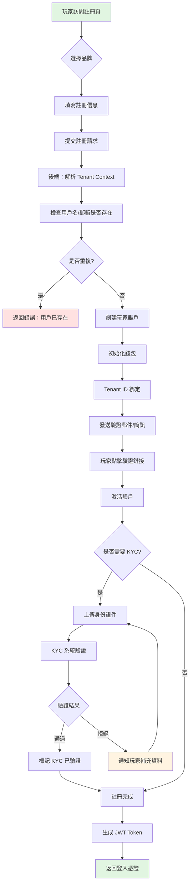
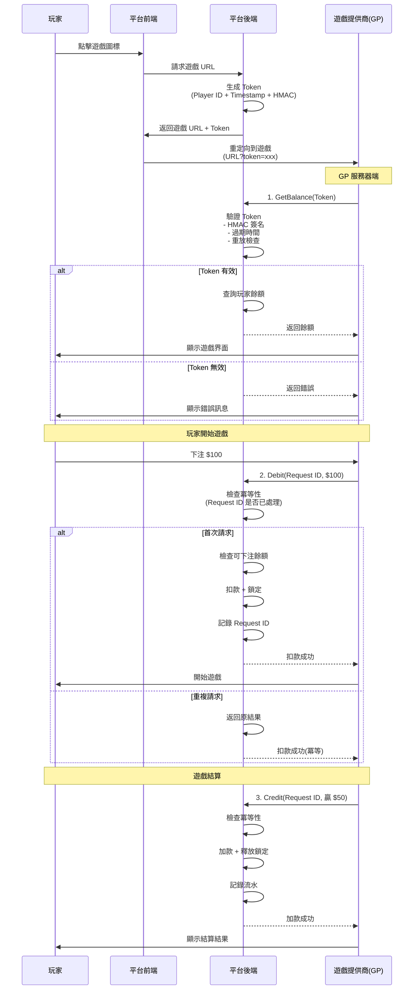
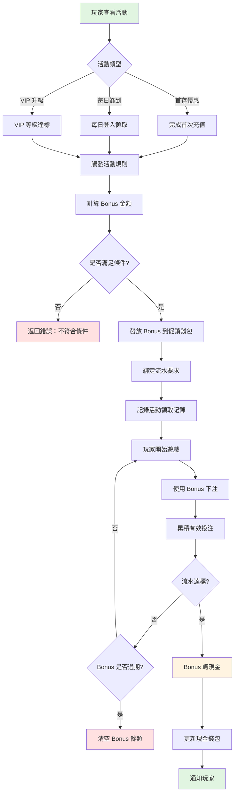
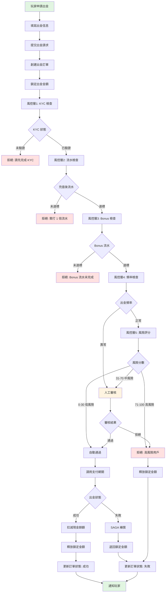
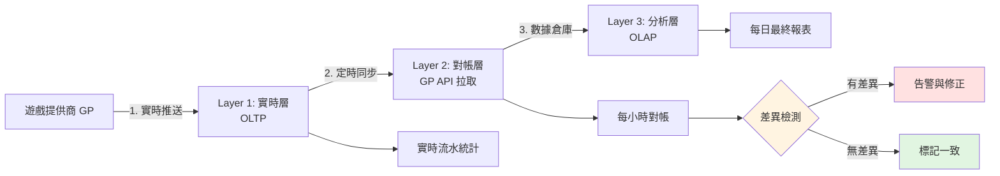
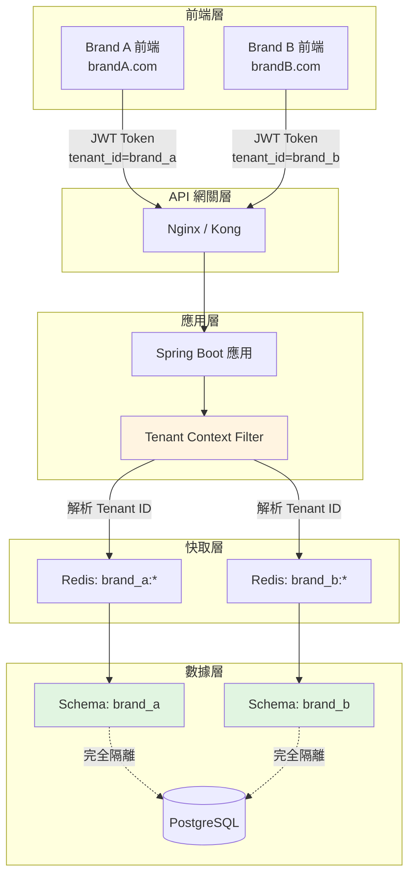

# iGaming 業務流程圖集

**版本**: 2.0.0 (v2 重組版)
**最後更新**: 2026-02-03
**狀態**: ✅ 完整版

---

## 📖 文檔說明

本文檔提供 **6 個端到端業務流程** 的詳細圖解，幫助您理解 iGaming 平台的完整業務邏輯。

**如何使用**：
1. 選擇您感興趣的業務流程
2. 閱讀流程圖理解整體流程
3. 點擊相關文檔深入了解技術細節

**涉及的 5 個核心概念**：
- 💰 **錢包**：可下注餘額計算、資金鎖定
- 🎮 **流水**：有效投注計算、流水累積
- 🔐 **Token**：API 安全驗證、冪等性設計
- 🏢 **多租戶**：數據隔離、Tenant Context
- 🛡️ **風控**：規則引擎、風險決策

---

## 🗺️ 流程導航

| 流程 | 涉及模塊 | 關鍵難點 | 閱讀時間 |
|------|---------|---------|---------|
| [1. 玩家註冊與 KYC](#1-玩家註冊與-kyc) | 01, 05 | 多租戶分配、KYC 驗證 | 5 分鐘 |
| [2. 遊戲對接與 Token 驗證](#2-遊戲對接與-token-驗證) | 02 | Token 安全、冪等性設計 | 10 分鐘 |
| [3. 活動發放與流水要求](#3-活動發放與流水要求) | 03, 02 | Bonus 計算、流水追蹤 | 8 分鐘 |
| [4. 出金審核與風控](#4-出金審核與風控) | 01, 04, 05 | 多層審核、SAGA 補償 | 12 分鐘 |
| [5. 流水計算與對帳](#5-流水計算與對帳) | 02, 01 | 三層驗證、數據一致性 | 10 分鐘 |
| [6. 多租戶數據隔離](#6-多租戶數據隔離) | 05, 07 | Schema 隔離、Context 注入 | 8 分鐘 |

---

## 1. 玩家註冊與 KYC

### 1.1 流程概覽

**業務目標**: 玩家完成註冊並通過身份驗證，成為平台合法用戶。

**涉及的核心概念**:
- 🏢 **多租戶**: 註冊時分配 Tenant ID
- 🔐 **Token**: 註冊後生成 JWT Token
- 🛡️ **風控**: KYC 驗證、反欺詐檢查

### 1.2 完整流程圖



### 1.3 關鍵步驟詳解

#### Step 1: Tenant Context 解析

**技術實現**:
```java
// 從域名或子路徑解析 Tenant
String tenantCode = extractTenantFromRequest(request);
TenantContext.set(tenantCode);

// 或從 JWT Token 解析（已登入用戶）
Claims claims = jwtService.parse(token);
String tenantId = claims.get("tenant_id", String.class);
```

**為什麼重要**: 確保玩家註冊到正確的品牌，數據不會混淆。

👉 **深入閱讀**: [05-01 多租戶架構 §2.1](../05_Platform_Governance/05-01_Multi_Tenant_Arch.md#tenant-context-注入)

#### Step 2: 初始化錢包

**技術實現**:
```sql
INSERT INTO t_player_wallet (player_id, tenant_id, cash_balance, bonus_balance, locked_amount)
VALUES (:playerId, :tenantId, 0, 0, 0);
```

**錢包初始狀態**:
- 現金餘額: 0
- 促銷餘額: 0
- 鎖定金額: 0
- 可下注餘額: 0

👉 **深入閱讀**: [01-02 錢包架構 §2.1](../01_Core_Financial_Loop/01-02_Wallet_Architecture.md#錢包初始化)

#### Step 3: KYC 驗證

**KYC 等級**:

| 等級 | 要求 | 出金限額 |
|------|------|---------|
| L0 | 無 KYC | 禁止出金 |
| L1 | 基礎 KYC（姓名+身份證號）| ≤ $1,000/天 |
| L2 | 進階 KYC（+地址證明）| ≤ $10,000/天 |
| L3 | 完整 KYC（+銀行驗證）| 無限制 |

**驗證方式**:
- 自動驗證: OCR 識別身份證
- 人工審核: 高風險用戶
- 第三方服務: Jumio、Onfido

👉 **深入閱讀**: [01-01 玩家生命週期 §3](../01_Core_Financial_Loop/01-01_Player_Lifecycle.md#kyc-驗證)

### 1.4 異常處理

| 異常情況 | 處理方式 | 錯誤碼 |
|---------|---------|--------|
| 用戶名重複 | 提示用戶更換用戶名 | `PLAYER_EXISTS` |
| 郵箱/手機重複 | 建議找回密碼 | `EMAIL_EXISTS` |
| KYC 驗證失敗 | 允許補充資料（最多 3 次）| `KYC_FAILED` |
| Tenant 不存在 | 返回 404 | `TENANT_NOT_FOUND` |

### 1.5 相關文檔

- 🔗 [01-01 玩家生命週期](../01_Core_Financial_Loop/01-01_Player_Lifecycle.md)
- 🔗 [05-01 多租戶架構](../05_Platform_Governance/05-01_Multi_Tenant_Arch.md)
- 🔗 [05-05 數據安全（身份證加密）](../05_Platform_Governance/05-05_Data_Security.md)

---

## 2. 遊戲對接與 Token 驗證

### 2.1 流程概覽

**業務目標**: 玩家從平台進入遊戲提供商（GP）的遊戲，確保身份安全驗證和資金同步。

**涉及的核心概念**:
- 🔐 **Token**: HMAC 簽名、過期驗證
- 💰 **錢包**: 餘額查詢、資金鎖定
- 🎮 **流水**: 投注金額記錄

### 2.2 完整流程圖



### 2.3 關鍵步驟詳解

#### Step 1: Token 生成

**Token 結構**:
```json
{
  "player_id": "12345",
  "tenant_id": "brand_a",
  "timestamp": 1704287400,
  "expire_at": 1704287700,
  "signature": "HMAC-SHA256(...)"
}
```

**HMAC 簽名計算**:
```java
String data = playerId + "|" + tenantId + "|" + timestamp;
String signature = HmacUtils.hmacSha256Hex(secretKey, data);
```

**安全要點**:
- ✅ 有效期: 5 分鐘（避免過期 Token 被重用）
- ✅ 一次性: Token 使用後標記為已消費
- ✅ 綁定 IP: 可選，防止 Token 被竊取

👉 **深入閱讀**: [02-02 Seamless Wallet API §4.2](../02_Game_Operations/02-02_Seamless_Wallet_API.md#token-驗證流程) ⭐ SSOT

#### Step 2: 冪等性設計

**為什麼需要冪等性**:
- 網絡重試: GP 請求超時後重試
- 防止重複扣款: 同一筆投注不能扣兩次錢

**三層防護**:
```java
// 1. Redis 快速檢查（99% 情況）
if (redisTemplate.hasKey("request:" + requestId)) {
    return getCachedResult(requestId);
}

// 2. 數據庫檢查（Redis 失效時）
Transaction tx = transactionDao.findByRequestId(requestId);
if (tx != null) {
    return tx.getResult();
}

// 3. 分散式鎖（極端並發）
try (DistributedLock lock = redisson.getLock("lock:" + requestId)) {
    lock.lock();
    // 執行扣款邏輯
}
```

👉 **深入閱讀**: [02-02 Seamless Wallet API §4.3](../02_Game_Operations/02-02_Seamless_Wallet_API.md#冪等性設計) ⭐ SSOT

#### Step 3: 可下注餘額檢查

**公式** (系統最重要的公式):
```
可下注餘額 = 現金餘額 - 鎖定金額 - 進行中投注
```

**範例**:

| 項目 | 金額 |
|------|------|
| 現金餘額 | $1,000 |
| 鎖定金額（出金中）| $200 |
| 進行中投注（體育博彩）| $100 |
| **可下注餘額** | **$700** |

**檢查邏輯**:
```java
if (availableBalance < betAmount) {
    throw new InsufficientBalanceException();
}
```

👉 **深入閱讀**: [01-02 錢包架構 §2.3](../01_Core_Financial_Loop/01-02_Wallet_Architecture.md#可下注餘額計算) ⭐ SSOT

### 2.4 API 規範

**GetBalance API**:
```http
POST /api/gp/getBalance
Content-Type: application/json

{
  "token": "xxx",
  "player_id": "12345",
  "timestamp": 1704287400,
  "signature": "HMAC-SHA256(...)"
}
```

**Response**:
```json
{
  "code": 0,
  "data": {
    "balance": 700.00,
    "currency": "USD"
  }
}
```

**Debit API** (扣款):
```http
POST /api/gp/debit
Content-Type: application/json

{
  "request_id": "uuid-1234",
  "player_id": "12345",
  "amount": 100.00,
  "game_id": "slot_001",
  "round_id": "round_5678"
}
```

👉 **深入閱讀**: [02-01 遊戲集成](../02_Game_Operations/02-01_Game_Integration.md)

### 2.5 相關文檔

- 🔗 [02-02 Seamless Wallet API](../02_Game_Operations/02-02_Seamless_Wallet_API.md) ⭐
- 🔗 [01-02 錢包架構](../01_Core_Financial_Loop/01-02_Wallet_Architecture.md) ⭐
- 🔗 [07-03-02 API 認證](../07_Technical_Infrastructure/07-03-02_Authentication.md)

---

## 3. 活動發放與流水要求

### 3.1 流程概覽

**業務目標**: 玩家領取活動 Bonus，完成流水要求後轉為現金。

**涉及的核心概念**:
- 🎁 **Bonus**: 促銷錢包、流水要求
- 🎮 **流水**: 有效投注累積、達標檢查
- 💰 **錢包**: Bonus → Cash 轉帳

### 3.2 完整流程圖



### 3.3 關鍵步驟詳解

#### Step 1: Bonus 計算

**首存優惠範例**:
```
條件: 首次充值 ≥ $100
獎勵: 充值金額 × 50%
上限: $500
流水要求: (充值 + Bonus) × 20 倍

範例：
- 充值 $200 → 獎勵 $100
- 流水要求: ($200 + $100) × 20 = $6,000
```

**計算邏輯**:
```java
BigDecimal bonusAmount = depositAmount.multiply(bonusRate);
if (bonusAmount.compareTo(maxBonus) > 0) {
    bonusAmount = maxBonus;
}

BigDecimal wageringRequirement = depositAmount.add(bonusAmount).multiply(multiplier);
```

👉 **深入閱讀**: [03-01 Bonus 引擎 §2](../03_Promotion_System/03-01_Bonus_Engine.md#bonus-計算)

#### Step 2: 流水累積

**有效投注算法** (系統核心算法):
```
有效投注 = 下注金額 × 有效比例 × 遊戲權重

遊戲權重：
- 老虎機: 100%
- 真人百家樂: 10%（低風險遊戲）
- 體育博彩: 50%
```

**範例**:

| 遊戲類型 | 下注金額 | 遊戲權重 | 有效投注 | 累積流水 |
|---------|---------|---------|---------|---------|
| 老虎機 | $100 | 100% | $100 | $100 |
| 百家樂 | $500 | 10% | $50 | $150 |
| 體育博彩 | $200 | 50% | $100 | $250 |

**累積邏輯**:
```java
// 每次投注後更新流水
BigDecimal validBet = betAmount.multiply(gameWeight);
wageringProgress = wageringProgress.add(validBet);

// 檢查是否達標
if (wageringProgress.compareTo(wageringRequirement) >= 0) {
    convertBonusToCash();
}
```

👉 **深入閱讀**: [02-03 流水計算 §3.1](../02_Game_Operations/02-03_Turnover_Calculation.md#有效投注算法) ⭐ SSOT

#### Step 3: Bonus 轉現金

**轉帳邏輯**:
```sql
-- 原子性操作
BEGIN;

UPDATE t_player_wallet
SET bonus_balance = bonus_balance - :bonusAmount,
    cash_balance = cash_balance + :bonusAmount
WHERE player_id = :playerId
  AND bonus_balance >= :bonusAmount;

UPDATE t_bonus_record
SET status = 'COMPLETED',
    completed_at = NOW()
WHERE id = :bonusId;

COMMIT;
```

**轉帳規則**:
- ✅ 流水達標後自動轉帳
- ✅ 最多轉帳的現金 = Bonus 金額（不包含贏利）
- ❌ 超過有效期的 Bonus 清零，不能轉帳

👉 **深入閱讀**: [03-03 流水規則 §3.2](../03_Promotion_System/03-03_Wagering_Rules.md#bonus-轉現金)

### 3.4 異常處理

| 異常情況 | 處理方式 |
|---------|---------|
| Bonus 過期 | 自動清零促銷餘額，通知玩家 |
| 流水未達標就出金 | 拒絕出金，提示剩餘流水要求 |
| 違規遊戲（0% 權重）| 不計入流水，記錄風控日誌 |
| 重複領取 | 檢查領取記錄，拒絕重複領取 |

### 3.5 相關文檔

- 🔗 [03-01 Bonus 引擎](../03_Promotion_System/03-01_Bonus_Engine.md)
- 🔗 [03-03 流水規則](../03_Promotion_System/03-03_Wagering_Rules.md)
- 🔗 [02-03 流水計算](../02_Game_Operations/02-03_Turnover_Calculation.md) ⭐

---

## 4. 出金審核與風控

### 4.1 流程概覽

**業務目標**: 玩家申請出金，經過多層風控檢查後到賬。

**涉及的核心概念**:
- 🛡️ **風控**: 規則引擎、風險評分
- 💰 **錢包**: 資金鎖定、SAGA 補償
- 🏢 **多租戶**: 不同品牌不同規則

### 4.2 完整流程圖



### 4.3 關鍵步驟詳解

#### Step 1: 資金鎖定

**為什麼需要鎖定**:
- 防止玩家在審核期間繼續使用資金
- 防止超額出金

**鎖定邏輯**:
```sql
UPDATE t_player_wallet
SET locked_amount = locked_amount + :withdrawAmount
WHERE player_id = :playerId
  AND (cash_balance - locked_amount) >= :withdrawAmount;
```

**鎖定期間**:
- 自動審核: 鎖定 5-10 分鐘
- 人工審核: 鎖定 1-24 小時
- 審核拒絕: 立即釋放鎖定

👉 **深入閱讀**: [01-02 錢包架構 §2.4](../01_Core_Financial_Loop/01-02_Wallet_Architecture.md#資金鎖定邏輯)

#### Step 2: 多層風控檢查

**風控規則引擎**:
```java
RiskScore riskScore = new RiskScore();

// 層1: KYC 檢查
if (!player.isKycVerified()) {
    return RiskDecision.REJECT("KYC_NOT_VERIFIED");
}

// 層2: 流水檢查
BigDecimal requiredTurnover = player.getDeposits().multiply(1.0); // 1倍流水
if (player.getTurnover().compareTo(requiredTurnover) < 0) {
    return RiskDecision.REJECT("TURNOVER_NOT_MET");
}

// 層3: 頻率檢查
int withdrawCountToday = withdrawalDao.countToday(playerId);
if (withdrawCountToday > 3) {
    riskScore.add(30, "HIGH_FREQUENCY");
}

// 層4: 金額檢查
if (withdrawAmount.compareTo(player.getTotalDeposits().multiply(3)) > 0) {
    riskScore.add(40, "LARGE_AMOUNT");
}

// 層5: 行為檢查
if (player.hasOnlyBonusPlay()) {
    riskScore.add(50, "BONUS_ABUSE");
}

// 決策
if (riskScore.getTotal() <= 30) {
    return RiskDecision.AUTO_APPROVE();
} else if (riskScore.getTotal() <= 70) {
    return RiskDecision.MANUAL_REVIEW();
} else {
    return RiskDecision.REJECT("HIGH_RISK");
}
```

**風險評分表**:

| 風險因子 | 分數 | 說明 |
|---------|------|------|
| 高頻出金 | +30 | 單日出金 >3 次 |
| 大額出金 | +40 | 出金金額 > 充值總額 × 3 |
| Bonus 濫用 | +50 | 只玩 Bonus，無自有資金遊戲 |
| 新註冊用戶 | +20 | 註冊 <7 天 |
| IP 異常 | +30 | IP 頻繁變更 |

👉 **深入閱讀**: [04-01 風控引擎 §2](../04_Risk_Control/04-01_Risk_Framework.md#規則引擎) ⭐ SSOT

#### Step 3: SAGA 補償事務

**什麼是 SAGA**:
- 分散式事務模式
- 每個步驟都有對應的補償操作
- 確保數據最終一致性

**出金 SAGA 流程**:
```
正向流程：
1. 創建訂單 → 2. 鎖定資金 → 3. 調用支付 → 4. 扣減餘額

補償流程（任一步驟失敗）：
1. 刪除訂單 ← 2. 釋放鎖定 ← 3. 取消支付 ← 4. 回滾餘額
```

**實作範例**:
```java
@Transactional(rollbackFor = Throwable.class)
public void processWithdrawal(WithdrawalRequest request) {
    try {
        // Step 1: 創建訂單
        Withdrawal withdrawal = createWithdrawal(request);

        // Step 2: 鎖定資金
        walletService.lockFunds(playerId, amount);

        // Step 3: 調用支付網關
        PaymentResult result = paymentGateway.withdraw(withdrawal);

        if (!result.isSuccess()) {
            // 補償: 釋放鎖定
            walletService.unlockFunds(playerId, amount);
            throw new WithdrawalFailedException();
        }

        // Step 4: 扣減餘額
        walletService.deductBalance(playerId, amount);

    } catch (Exception e) {
        // 觸發補償事務
        compensate(withdrawal);
        throw e;
    }
}
```

👉 **深入閱讀**: [01-05 出金風控 §4.3](../01_Core_Financial_Loop/01-05_Withdrawal_Risk.md#saga-補償)

### 4.4 人工審核流程

**審核界面功能**:
- ✅ 玩家基本信息（註冊時間、KYC 狀態）
- ✅ 充值/出金歷史
- ✅ 遊戲記錄（投注明細）
- ✅ 風控評分詳情
- ✅ 一鍵通過/拒絕/要求補充資料

**審核 SLA**:
- 工作日: 4 小時內完成
- 非工作日: 24 小時內完成

### 4.5 相關文檔

- 🔗 [01-05 出金風控](../01_Core_Financial_Loop/01-05_Withdrawal_Risk.md) ⭐
- 🔗 [04-01 風控引擎](../04_Risk_Control/04-01_Risk_Framework.md) ⭐
- 🔗 [05-06 審批工作流](../05_Platform_Governance/05-06_Approval_Workflow.md)

---

## 5. 流水計算與對帳

### 5.1 流程概覽

**業務目標**: 準確計算玩家有效投注，確保與遊戲提供商數據一致。

**涉及的核心概念**:
- 🎮 **流水**: 三層驗證架構
- 💰 **錢包**: 資金變動記錄
- 📊 **對帳**: OLTP vs OLAP 數據對比

### 5.2 三層驗證架構



### 5.3 關鍵步驟詳解

#### Layer 1: 實時層（OLTP）

**數據來源**: GP 實時推送 Debit/Credit 請求

**記錄內容**:
```sql
CREATE TABLE t_player_bet (
    id BIGINT PRIMARY KEY,
    player_id BIGINT,
    game_id VARCHAR(50),
    round_id VARCHAR(100),
    bet_amount DECIMAL(18,2),
    valid_bet DECIMAL(18,2),  -- 有效投注
    win_amount DECIMAL(18,2),
    bet_time TIMESTAMP,
    settle_time TIMESTAMP
);
```

**實時統計**:
```sql
-- 玩家當日流水
SELECT SUM(valid_bet)
FROM t_player_bet
WHERE player_id = ?
  AND DATE(bet_time) = CURRENT_DATE;
```

#### Layer 2: 對帳層（每小時）

**對帳邏輯**:
```java
// 1. 從 GP API 拉取數據
List<GPBetRecord> gpRecords = gpApi.getBets(startTime, endTime);

// 2. 與本地數據對比
for (GPBetRecord gpRecord : gpRecords) {
    LocalBetRecord localRecord = betDao.findByRoundId(gpRecord.getRoundId());

    if (localRecord == null) {
        // 差異1: 本地缺失記錄
        alerts.add("MISSING_LOCAL:" + gpRecord.getRoundId());
        补录(gpRecord);
    } else if (!localRecord.getValidBet().equals(gpRecord.getValidBet())) {
        // 差異2: 金額不一致
        alerts.add("AMOUNT_MISMATCH:" + gpRecord.getRoundId());
        修正(localRecord, gpRecord);
    }
}

// 3. 檢查本地多出的記錄
List<LocalBetRecord> extraLocal = betDao.findNotInGP(gpRecords);
if (!extraLocal.isEmpty()) {
    alerts.add("EXTRA_LOCAL:" + extraLocal.size());
}
```

**差異處理**:
| 差異類型 | 處理方式 |
|---------|---------|
| 本地缺失 | 從 GP 補錄數據 |
| 金額不一致 | 以 GP 為準修正（GP 是權威）|
| 本地多餘 | 標記為異常，人工核查 |

#### Layer 3: 分析層（OLAP）

**數據倉庫設計**:
```sql
-- DWD 明細層
CREATE TABLE dwd_player_bet (
    -- 與 OLTP 一致，但增加維度
    tenant_id BIGINT,
    brand_name VARCHAR(50),
    game_type VARCHAR(20),
    is_bonus_play BOOLEAN,
    ...
) PARTITION BY RANGE (bet_time);

-- DWS 匯總層
CREATE TABLE dws_player_turnover_daily (
    player_id BIGINT,
    stat_date DATE,
    total_bet DECIMAL(18,2),
    total_valid_bet DECIMAL(18,2),
    total_win DECIMAL(18,2),
    PRIMARY KEY (player_id, stat_date)
);
```

**每日最終報表**:
```sql
-- 每日凌晨 2 點生成
INSERT INTO dws_player_turnover_daily
SELECT
    player_id,
    DATE(bet_time) as stat_date,
    SUM(bet_amount) as total_bet,
    SUM(valid_bet) as total_valid_bet,
    SUM(win_amount) as total_win
FROM dwd_player_bet
WHERE DATE(bet_time) = CURRENT_DATE - INTERVAL 1 DAY
GROUP BY player_id, DATE(bet_time);
```

### 5.4 對帳異常處理

**自動修正**:
- ✅ 金額差異 < $1: 自動以 GP 為準修正
- ✅ 時間差異 < 5 分鐘: 視為網絡延遲，自動匹配

**人工介入**:
- ⚠️ 金額差異 > $100: 告警通知，人工核查
- ⚠️ 缺失記錄 > 10 筆/小時: 告警通知，檢查 GP API
- ⚠️ 連續 3 小時對帳失敗: 緊急告警，暫停遊戲

### 5.5 相關文檔

- 🔗 [02-03 流水計算](../02_Game_Operations/02-03_Turnover_Calculation.md) ⭐
- 🔗 [01-06 對帳系統](../01_Core_Financial_Loop/01-06_Reconciliation.md)
- 🔗 [06-01 報表 BI](../06_Analytics_Operations/06-01_Reporting_BI.md)

---

## 6. 多租戶數據隔離

### 6.1 流程概覽

**業務目標**: 在單一系統中服務多個品牌，確保數據完全隔離。

**涉及的核心概念**:
- 🏢 **多租戶**: Schema 隔離、Context 注入
- 🔐 **安全**: JWT Token、RBAC 權限
- 📊 **報表**: 按租戶獨立統計

### 6.2 完整架構圖



### 6.3 關鍵步驟詳解

#### Step 1: Tenant Context 注入

**Filter 實現**:
```java
@Component
public class TenantContextFilter implements Filter {

    @Override
    public void doFilter(ServletRequest request, ServletResponse response, FilterChain chain) {
        try {
            // 1. 從 JWT Token 解析 Tenant ID
            String token = extractToken(request);
            Claims claims = jwtService.parse(token);
            String tenantId = claims.get("tenant_id", String.class);

            // 2. 注入 ThreadLocal
            TenantContext.set(tenantId);

            // 3. 繼續處理請求
            chain.doFilter(request, response);

        } finally {
            // 4. 清理 ThreadLocal（避免內存洩漏）
            TenantContext.clear();
        }
    }
}
```

**ThreadLocal 實現**:
```java
public class TenantContext {
    private static final ThreadLocal<String> TENANT_ID = new ThreadLocal<>();

    public static void set(String tenantId) {
        TENANT_ID.set(tenantId);
    }

    public static String get() {
        String tenantId = TENANT_ID.get();
        if (tenantId == null) {
            throw new TenantNotFoundException("Tenant context not set");
        }
        return tenantId;
    }

    public static void clear() {
        TENANT_ID.remove();
    }
}
```

#### Step 2: 數據庫 Schema 隔離

**MyBatis 攔截器**:
```java
@Intercepts({
    @Signature(type = Executor.class, method = "update", args = {MappedStatement.class, Object.class}),
    @Signature(type = Executor.class, method = "query", args = {MappedStatement.class, Object.class, RowBounds.class, ResultHandler.class})
})
public class TenantSchemaInterceptor implements Interceptor {

    @Override
    public Object intercept(Invocation invocation) throws Throwable {
        // 1. 獲取 Tenant ID
        String tenantId = TenantContext.get();

        // 2. 動態切換 Schema
        String schemaName = "tenant_" + tenantId;
        Connection conn = getConnection(invocation);
        conn.createStatement().execute("SET search_path TO " + schemaName);

        // 3. 執行 SQL
        return invocation.proceed();
    }
}
```

**SQL 自動改寫**:
```sql
-- 原始 SQL
SELECT * FROM t_player WHERE id = ?

-- 自動改寫為
SET search_path TO tenant_brand_a;
SELECT * FROM t_player WHERE id = ?
```

#### Step 3: Redis Key 前綴隔離

**Key 命名規範**:
```java
public class RedisKeyBuilder {
    public static String buildKey(String module, String key) {
        String tenantId = TenantContext.get();
        return String.format("%s:%s:%s", tenantId, module, key);
    }
}

// 使用範例
String key = RedisKeyBuilder.buildKey("player", "wallet:" + playerId);
// 結果: "brand_a:player:wallet:12345"
```

**為什麼需要前綴**:
- ✅ 防止不同租戶的數據衝突
- ✅ 方便按租戶批量清除快取
- ✅ 快取監控可以按租戶分組

#### Step 4: JWT Token 生成

**Token 結構**:
```json
{
  "sub": "12345",          // 玩家 ID
  "tenant_id": "brand_a",  // 租戶 ID ⭐
  "roles": ["PLAYER"],
  "iat": 1704287400,
  "exp": 1704373800
}
```

**生成邏輯**:
```java
public String generateToken(Player player) {
    return Jwts.builder()
        .setSubject(player.getId().toString())
        .claim("tenant_id", player.getTenantId())  // 關鍵：注入 Tenant ID
        .claim("roles", player.getRoles())
        .setIssuedAt(new Date())
        .setExpiration(new Date(System.currentTimeMillis() + 86400000))  // 24小時
        .signWith(secretKey)
        .compact();
}
```

### 6.4 安全性驗證

**防止跨租戶訪問**:
```java
@Service
public class PlayerService {

    public Player getPlayer(Long playerId) {
        Player player = playerDao.findById(playerId);

        // 關鍵檢查：驗證玩家是否屬於當前租戶
        if (!player.getTenantId().equals(TenantContext.get())) {
            throw new AccessDeniedException("Cross-tenant access not allowed");
        }

        return player;
    }
}
```

**測試用例**:
```java
@Test
public void testTenantIsolation() {
    // 1. Brand A 創建玩家
    TenantContext.set("brand_a");
    Player playerA = playerService.createPlayer("Alice");

    // 2. Brand B 嘗試訪問 Brand A 的玩家
    TenantContext.set("brand_b");
    assertThrows(AccessDeniedException.class, () -> {
        playerService.getPlayer(playerA.getId());
    });
}
```

### 6.5 相關文檔

- 🔗 [05-01 多租戶架構](../05_Platform_Governance/05-01_Multi_Tenant_Arch.md) ⭐
- 🔗 [05-03 RBAC 安全](../05_Platform_Governance/05-03_RBAC_Security.md)
- 🔗 [07-02 API 網關](../07_Technical_Infrastructure/07-02_Gateway_Architecture/)

---

## 📚 延伸閱讀

### 按難度分類

| 難度 | 流程 | 適合角色 |
|------|------|---------|
| ⭐ 入門 | 1. 玩家註冊與 KYC | 產品經理、測試工程師 |
| ⭐⭐ 進階 | 3. 活動發放與流水要求 | 後端開發、產品經理 |
| ⭐⭐ 進階 | 6. 多租戶數據隔離 | 後端開發、架構師 |
| ⭐⭐⭐ 高級 | 2. 遊戲對接與 Token 驗證 | 後端開發、架構師 |
| ⭐⭐⭐ 高級 | 4. 出金審核與風控 | 後端開發、風控專家 |
| ⭐⭐⭐⭐ 專家 | 5. 流水計算與對帳 | 後端開發、數據工程師 |

### 相關文檔導航

- 👉 [00-00_QUICKSTART.md](./00-00_QUICKSTART.md) - 10 分鐘快速入門（5 個核心概念）
- 👉 [00-00_IMPLEMENTATION_GUIDE.md](./00-00_IMPLEMENTATION_GUIDE.md) - 實作指南索引
- 👉 [SSOT_MAPPING.md](../SSOT_MAPPING.md) - 34 個核心概念的權威定義

---

## 💬 反饋與改進

**文檔維護**: Architecture Team
**技術支持**: tech-support@company.com

**改進建議**: 請在 [GitHub Issues](https://github.com/company/igaming-docs/issues) 提交

---

**版本歷史**:
- v2.0.0 (2026-02-03): 初始版本，6 個端到端業務流程
