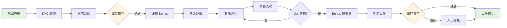

# iGaming 平台快速入門 (10 分鐘)

**目標讀者**: 新加入團隊的開發者、產品經理、架構師
**閱讀時間**: ⏱️ 10 分鐘
**版本**: 2.0.0 (v2 重組版)
**最後更新**: 2026-02-03

---

## 🎯 5 個核心概念速覽

iGaming 平台是一個複雜的系統，但核心邏輯圍繞 **5 個關鍵概念** 展開。掌握這 5 個概念，就能理解 80% 的系統設計。

---

### 1️⃣ 錢包與可下注餘額 💰

**核心問題**: 玩家到底有多少錢可以下注？

**可下注餘額公式**（系統最重要的公式）：
```
可下注餘額 = 現金餘額 - 鎖定金額 - 進行中投注
```

**為什麼重要**：
- ❌ 錯誤計算 → 玩家超額下注 → 平台虧損
- ❌ 錯誤計算 → 玩家無法下注 → 客戶體驗差
- ✅ 正確計算 → 資金安全 + 用戶滿意

**深入閱讀**:
👉 [01-02 錢包架構 §2.3 可下注餘額](../01_Core_Financial_Loop_NEW/01-02_Wallet_Architecture.md#可下注餘額計算) ⭐ SSOT

**關鍵場景**:
- 玩家下注時：檢查可下注餘額 → 鎖定資金 → 扣款
- 遊戲結算時：釋放鎖定 → 結算輸贏 → 更新餘額

---

### 2️⃣ 流水計算（有效投注）🎮

**核心問題**: 什麼樣的投注算作「有效投注」？如何計算流水？

**有效投注算法**：
```
有效投注 = 下注金額 × 有效比例 × 遊戲類型權重

範例：
- 老虎機：100% 計算流水
- 百家樂：95% 計算流水（平局時例外）
- 體育博彩：只計算結算後的實際風險金額
```

**為什麼重要**：
- 🎁 **活動流水要求**: "首存 100 送 50，需打 20 倍流水"
  - 需要有效投注達到：(100+50) × 20 = 3000
- 🏆 **VIP 等級計算**: 月流水達 10 萬 → 升級 VIP
- 🛡️ **反洗錢**: 充值後必須打 1 倍流水才能出金

**深入閱讀**:
👉 [02-03 流水計算 §3.1 有效投注算法](../02_Game_Operations_NEW/02-03_Turnover_Calculation.md#有效投注算法) ⭐ SSOT

**關鍵場景**:
- 活動發放：玩家領取 Bonus → 綁定流水要求
- VIP 升級：月底統計有效投注 → 計算等級
- 風控檢查：充值後無流水直接出金 → 拒絕

---

### 3️⃣ Token 驗證與 API 安全 🔐

**核心問題**: 如何確保遊戲提供商（GP）API 調用的安全性？

**Token 驗證流程**：
```
1. GP 請求 Token（攜帶 Player ID + Timestamp + Signature）
2. 平台驗證 HMAC 簽名
3. 檢查 Token 是否過期（5 分鐘）
4. 檢查 Token 是否已使用（防重放攻擊）
5. 返回 Token + 玩家餘額
```

**冪等性設計**（防重複扣款）：
```
每個 GP 請求必須攜帶 Unique Request ID
平台通過 Redis + DB + 分散式鎖三層防護

範例：
- 第一次 Debit 請求 → 成功扣款 → 記錄 Request ID
- 重複 Debit 請求 → 檢測到 Request ID 已存在 → 返回原結果
```

**為什麼重要**：
- 🛡️ **安全**: 防止 GP API 被偽造、重放攻擊
- 💰 **資金安全**: 防止重複扣款（網絡重試導致）
- ⚡ **性能**: Redis 快取避免每次查 DB

**深入閱讀**:
👉 [02-02 Seamless Wallet API §4.2 Token 驗證](../02_Game_Operations_NEW/02-02_Seamless_Wallet_API.md#token-驗證流程) ⭐ SSOT

**關鍵場景**:
- 玩家進入遊戲：GP 請求 Token → 驗證身份 → 返回餘額
- 玩家下注：GP Debit 請求 → 驗證冪等性 → 扣款

---

### 4️⃣ 多租戶架構與數據隔離 🏢

**核心問題**: 如何在單一系統中服務多個品牌（站點），確保數據完全隔離？

**多租戶隔離策略**：
```
層級1: 平台（Platform）
  └─ 層級2: 品牌（Brand / Tenant）
       └─ 層級3: 代理（Agent）
            └─ 層級4: 玩家（Player）

數據隔離方式：
1. 資料庫層: 每個 Tenant 獨立 Schema（PostgreSQL Schema）
2. 快取層: Redis Key 前綴包含 Tenant ID
3. 應用層: ThreadLocal 注入 Tenant Context
4. API 層: JWT Token 包含 Tenant ID
```

**為什麼重要**：
- 🔒 **數據安全**: Brand A 的玩家資料永遠不會被 Brand B 看到
- 💼 **業務靈活性**: 不同品牌可以有不同的遊戲、活動、配置
- 📊 **合規性**: 不同地區品牌可以滿足不同的監管要求

**深入閱讀**:
👉 [05-01 多租戶架構 §2.1 隔離策略](../05_Platform_Governance_NEW/05-01_Multi_Tenant_Arch.md#隔離策略) ⭐ SSOT

**關鍵場景**:
- 品牌創建：創建新 Tenant → 初始化 Schema → 配置遊戲
- API 調用：解析 JWT → 注入 Tenant Context → 查詢數據（自動過濾 Tenant）
- 報表統計：按 Tenant 隔離數據 → 各品牌獨立報表

---

### 5️⃣ 風控規則引擎 🛡️

**核心問題**: 如何實時檢測異常行為，防止欺詐和洗錢？

**風控規則引擎架構**：
```
規則引擎（LiteFlow / Drools）
  ├─ 充值風控: 單日充值次數/金額限制
  ├─ 出金風控: KYC 驗證、反洗錢檢查
  ├─ 投注風控: 對沖檢測、異常投注模式
  └─ 活動風控: Bonus 濫用檢測

檢查點：
- 充值前: 檢查頻率 → 通過/拒絕
- 出金前: 檢查流水 → 通過/待審核/拒絕
- 投注時: 實時對沖檢測 → 通過/拒絕
- 活動領取: 檢查資格 → 通過/拒絕
```

**風控決策流程**：
```
觸發檢查 → 規則引擎計算風險分數 → 決策
- 低風險（0-30 分）: 自動通過
- 中風險（31-70 分）: 人工審核
- 高風險（71-100 分）: 自動拒絕
```

**為什麼重要**：
- 🛡️ **防欺詐**: 檢測職業玩家、對沖套利、洗錢行為
- 💰 **保護平台**: 防止 Bonus 濫用、異常出金
- ⚖️ **合規**: 滿足反洗錢（AML）監管要求

**深入閱讀**:
👉 [04-01 風控引擎 §2 規則引擎](../04_Risk_Control_NEW/04-01_Risk_Engine.md#規則引擎) ⭐ SSOT

**關鍵場景**:
- 玩家出金：風控檢查 → KYC 驗證 → 流水檢查 → 決策（通過/審核/拒絕）
- 輪盤對沖：玩家同時下注紅黑 → 檢測到對沖 → 拒絕投注

---

## 🔗 核心業務流程

掌握了 5 個核心概念後，了解它們如何串聯成完整的業務流程：

### 完整玩家旅程（端到端）



**涉及的 5 個核心概念**：
1. **錢包**（C 充值, E Bonus, J 轉現金, M 出金）
2. **流水**（G 下注, H 累積, I 達標檢查）
3. **Token 驗證**（F 進入遊戲）
4. **多租戶**（A 註冊時分配 Tenant）
5. **風控**（D 充值風控, L 出金風控）

**深入閱讀**:
👉 [00-00_BUSINESS_FLOWS.md](./00-00_BUSINESS_FLOWS.md) - 完整業務流程圖集

---

## 🚀 按角色快速導航

根據您的角色，推薦不同的閱讀路徑：

### 👨‍💼 產品經理
**首要理解**：業務邏輯、規則設計

| 優先級 | 主題 | 文檔 |
|-------|------|------|
| 🔴 P0 | 玩家生命週期 | [01-01 Player_Lifecycle](../01_Core_Financial_Loop_NEW/01-01_Player_Lifecycle.md) |
| 🔴 P0 | 活動系統規則 | [03-01 Bonus_Engine](../03_Promotion_System_NEW/03-01_Bonus_Engine.md) |
| 🟠 P1 | VIP 系統 | [03-04 VIP_Loyalty](../03_Promotion_System_NEW/03-04_VIP_Loyalty.md) |
| 🟠 P1 | 代理系統 | [05-02 Agent_System](../05_Platform_Governance_NEW/05-02_Agent_System.md) |

### 👨‍💻 後端開發工程師
**首要理解**：技術實現、API 設計

| 優先級 | 主題 | 文檔 |
|-------|------|------|
| 🔴 P0 | 錢包架構 | [01-02 Wallet_Architecture](../01_Core_Financial_Loop_NEW/01-02_Wallet_Architecture.md) ⭐ |
| 🔴 P0 | Seamless Wallet API | [02-02 Seamless_Wallet_API](../02_Game_Operations_NEW/02-02_Seamless_Wallet_API.md) ⭐ |
| 🔴 P0 | 流水計算 | [02-03 Turnover_Calculation](../02_Game_Operations_NEW/02-03_Turnover_Calculation.md) ⭐ |
| 🟠 P1 | 風控引擎 | [04-01 Risk_Engine](../04_Risk_Control_NEW/04-01_Risk_Engine.md) |
| 🟠 P1 | 多租戶架構 | [05-01 Multi_Tenant_Arch](../05_Platform_Governance_NEW/05-01_Multi_Tenant_Arch.md) |

### 🏛️ 架構師
**首要理解**：整體架構、技術選型

| 優先級 | 主題 | 文檔 |
|-------|------|------|
| 🔴 P0 | 方案總覽 | [00-01 Solution_Overview](./00-01_Solution_Overview.md) |
| 🔴 P0 | 多租戶架構 | [05-01 Multi_Tenant_Arch](../05_Platform_Governance_NEW/05-01_Multi_Tenant_Arch.md) ⭐ |
| 🔴 P0 | 數據安全 | [05-05 Data_Security](../05_Platform_Governance_NEW/05-05_Data_Security.md) |
| 🟠 P1 | 部署架構 | [07-01 Deployment](../07_Technical_Infrastructure_NEW/07-01_Deployment.md) |
| 🟠 P1 | API 網關 | [07-02 Gateway_Architecture](../07_Technical_Infrastructure_NEW/07-02_Gateway_Architecture/) |

### 🔬 測試工程師
**首要理解**：測試場景、邊界情況

| 優先級 | 主題 | 文檔 |
|-------|------|------|
| 🔴 P0 | QA 測試標準 | [07-04 QA_Standards](../07_Technical_Infrastructure_NEW/07-04_QA_Standards.md) |
| 🔴 P0 | 錢包極端場景 | [02-04 Game_Provider_Cases](../02_Game_Operations_NEW/02-04_Game_Provider_Cases.md) |
| 🟠 P1 | 風控測試場景 | [04-02 Fraud_Detection](../04_Risk_Control_NEW/04-02_Fraud_Detection.md) |

### 👨‍💼 運維工程師
**首要理解**：部署、監控、維護

| 優先級 | 主題 | 文檔 |
|-------|------|------|
| 🔴 P0 | 部署流程 | [07-01 Deployment](../07_Technical_Infrastructure_NEW/07-01_Deployment.md) |
| 🔴 P0 | 維護程序 | [07-05 Maintenance](../07_Technical_Infrastructure_NEW/07-05_Maintenance.md) |
| 🟠 P1 | API 網關配置 | [07-02 Gateway_Architecture](../07_Technical_Infrastructure_NEW/07-02_Gateway_Architecture/) |

---

## 📚 下一步

### 1️⃣ 深入學習業務流程
👉 [00-00_BUSINESS_FLOWS.md](./00-00_BUSINESS_FLOWS.md) - 6 個端到端業務流程詳解

### 2️⃣ 實作開發指南
👉 [00-00_IMPLEMENTATION_GUIDE.md](./00-00_IMPLEMENTATION_GUIDE.md) - 按開發任務分類的實作指南

### 3️⃣ 完整文檔索引
👉 [00-00_Document_Map.md](./00-00_Document_Map.md) - 8 個模塊的完整文檔樹

### 4️⃣ SSOT 映射表
👉 [SSOT_MAPPING.md](../SSOT_MAPPING.md) - 34 個核心概念的權威定義索引

---

## 💡 學習建議

### 第 1 天（2 小時）
- ✅ 閱讀本文（10 分鐘）
- ✅ 深入閱讀 5 個核心概念中的 2 個（1 小時）
- ✅ 瀏覽業務流程圖（20 分鐘）
- ✅ 根據角色閱讀 P0 優先級文檔（30 分鐘）

### 第 1 週（10 小時）
- ✅ 完成 5 個核心概念的深度閱讀
- ✅ 閱讀業務流程文檔
- ✅ 根據角色閱讀所有 P0 + P1 文檔
- ✅ 運行本地開發環境，實際操作

### 第 1 個月（40 小時）
- ✅ 閱讀完整文檔樹
- ✅ 實作第一個功能模塊
- ✅ 參與 Code Review，理解實際代碼
- ✅ 成為團隊的領域專家

---

## ❓ 常見問題 FAQ

### Q1: 為什麼有兩個錢包概念（現金錢包 + 促銷錢包）？
**A**:
- **現金錢包**: 玩家真金白銀充值的錢，可以隨時出金
- **促銷錢包**: 平台贈送的 Bonus，需要完成流水要求後才能轉為現金

這樣設計是為了防止 Bonus 濫用（玩家領取 Bonus 後立即出金）。

### Q2: 流水計算為什麼這麼複雜？
**A**: 因為不同遊戲類型的風險不同：
- 老虎機：純運氣，100% 計算流水
- 百家樂：有一定技巧，95% 計算流水
- 體育博彩：對沖風險高，只計算實際風險金額

這樣設計可以防止玩家利用低風險遊戲快速完成流水要求。

### Q3: 為什麼需要三層驗證（Redis → DB → 分散式鎖）？
**A**:
- **Redis**: 快速檢查（99% 情況）
- **DB**: Redis 失效時的最後一道防線
- **分散式鎖**: 防止極端並發情況下的重複扣款

這是 **防禦性編程** 的體現，即使 Redis 失效，也能保證資金安全。

### Q4: 多租戶架構會影響性能嗎？
**A**:
- **Schema 隔離**: 不影響性能，PostgreSQL 原生支持
- **快取層**: Redis Key 前綴開銷可忽略不計
- **應用層**: ThreadLocal 注入開銷 < 1ms

實際測試表明，多租戶架構的性能開銷 < 5%，但帶來的數據安全和業務靈活性遠超這個成本。

---

## 🔖 版本歷史

| 版本 | 日期 | 變更說明 |
|------|------|---------|
| 2.0.0 | 2026-02-03 | v2 重組版 - 重新設計導航系統，聚焦 5 個核心概念 |
| 1.0.0 | 2026-01-27 | 初始版本 |

---

## 📧 反饋與支持

**文檔維護**: Architecture Team
**技術支持**: tech-support@company.com
**業務諮詢**: product@company.com

**改進建議**: 請在 [GitHub Issues](https://github.com/company/igaming-docs/issues) 提交

---

**祝您學習愉快！🚀**
