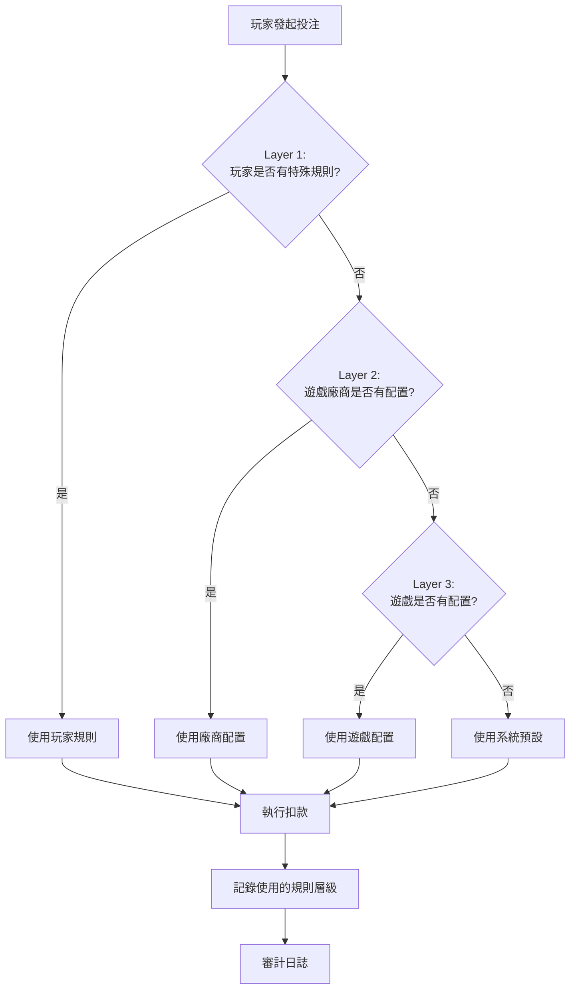
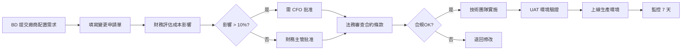
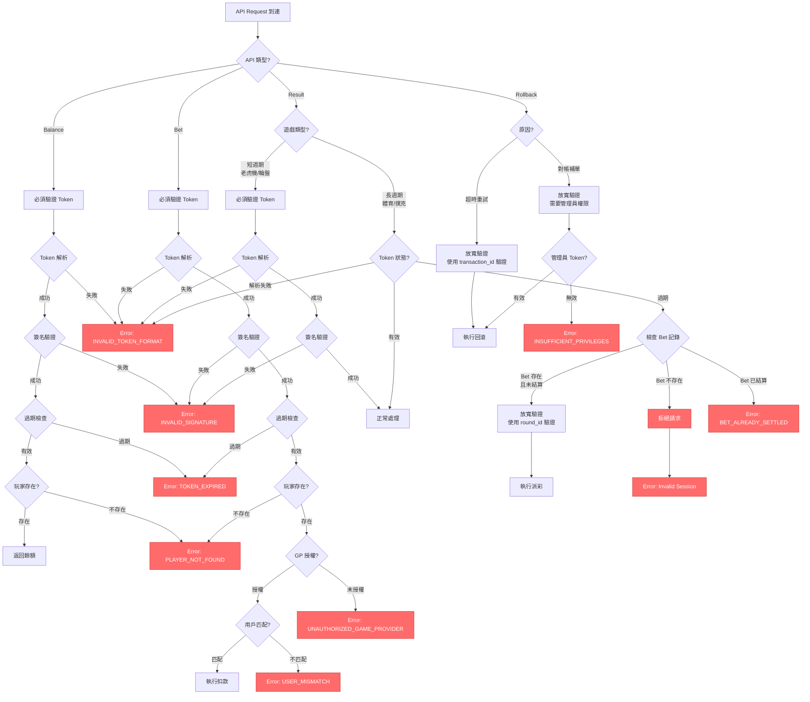
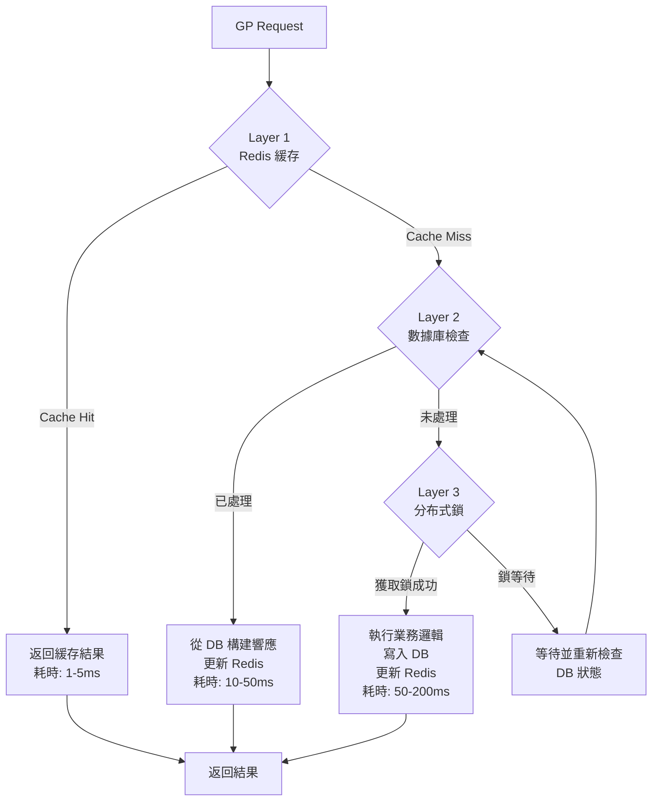
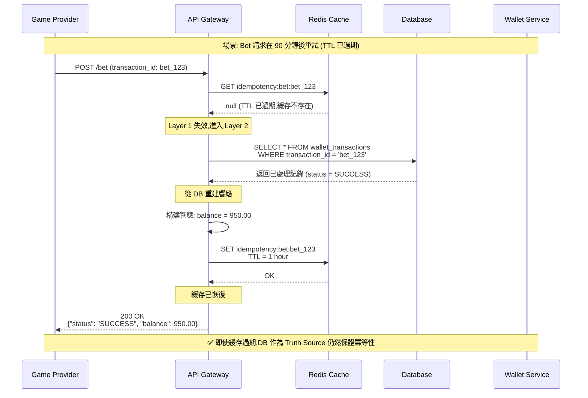
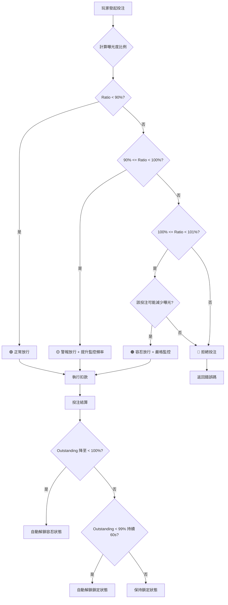

# 01-02 錢包架構 (Wallet Architecture)

<!-- SSOT: Authoritative definition of Unified Wallet Model, Playable Balance Formula, Deduction Priority, API Security, Concurrency Control, Error Recovery -->

## 1. 系統概述 (System Overview)

為了解決「現金網 (Cash Market)」與「信用網 (Credit Network)」在同一平台共存的架構衝突，本模組定義了 **"統一錢包 (Unified Wallet)"** 模型。此模型將玩家的所有資產與負債標準化為統一的數據結構，確保 **交易處理 (Transaction Processing)**、**風控 (Risk)** 與 **財務對帳 (Reconciliation)** 能透過一套邏輯同時處理兩種模式。

**核心原則**:
- **零信任架構 (Zero Trust)**: 所有 API 請求必須驗證 Token、實施冪等性保護
- **原子性保障 (Atomicity)**: 使用 Redis Lua 腳本或分布式鎖確保並發安全
- **錯誤恢復 (Resilience)**: 支持亂序請求、預回滾、部分失敗恢復
- **會計合規 (Accounting Compliance)**: 符合博彩行業會計準則的分錄標準

---

## 2. 錢包模型設計 (Wallet Model Design)

### 2.1 資產 vs 負債 (Asset vs Liability)

<!-- SSOT: Authoritative definition of Wallet Asset and Liability Model -->

系統將錢包餘額分為兩大類屬性：

| 屬性 | 類型 | 定義 | 數學符號 | 例子 |
| :--- | :--- | :--- | :--- | :--- |
| **Cash Balance** | Asset | 玩家擁有的真實資金，可自由提款。 | `(+)` | USDT 充值、現金網贏利 |
| **Bonus Balance** | Asset (Locked) | 玩家擁有的資金，但被鎖定需完成流水。 | `(+)` | 首存紅利、救援金 |
| **Credit Limit** | Liability Cap | 代理授予的透支權限 (不可提款)。 | `(Limit)` | 信用網額度 |
| **Outstanding** | Liability | 玩家已使用的信用額度 (對平台的負債)。 | `(-)` | 信用網輸錢 |

### 2.2 可下注餘額公式 (Playable Balance Formula)

<!-- SSOT: Authoritative definition of Playable Balance Calculation -->

前往遊戲大廳時，玩家的 **"可下注餘額 (Playable Balance)"** 計算如下：

```math
Playable Balance = (Cash + Bonus) + (Credit Limit - Outstanding)
```

*   **Cash Mode 玩家**：Credit Limit = 0, Playable = Cash + Bonus
*   **Credit Mode 玩家**：Cash = 0, Playable = Available Credit
*   **Hybrid Mode 玩家**：同時擁有現金與額度 (較少見，但系統需支援)。

### 2.3 會計分錄標準 (Accounting Entry Standards)

<!-- SSOT: Authoritative definition of Accounting Entries for Gaming Transactions -->

**階段 1: 下注**
```yaml
借: 玩家現金負債    100
貸: 未結算注單負債  100

含義: 100 元從「可用餘額」轉入「鎖定餘額」
```

**階段 2: 結算贏（本金 100 + 贏金 50 = 150）**
```yaml
借: 未結算注單負債  100
借: 博彩成本         50
貸: 玩家現金負債    150

含義: 返還本金 100 + 支付贏金 50
GGR = -50（成本）
```

**階段 3: 結算輸（本金不返還）**
```yaml
借: 未結算注單負債  100
貸: 博彩收入        100

含義: 玩家輸掉 100 元
GGR = +100（收入）
```

**GGR 計算公式**:
```
GGR 不是科目，是計算結果:

GGR = 博彩收入 - 博彩成本
    = (玩家輸的錢) - (玩家贏的錢)
```

**會計科目設計**:

| 科目名稱 | 科目類型 | 借方含義 | 貸方含義 |
|---------|---------|---------|---------|
| **玩家現金負債** | 負債類 | 玩家提款 | 玩家充值/贏錢 |
| **未結算注單負債** | 負債類 | 注單結算 | 玩家下注 |
| **博彩收入** | 收入類 | - | 玩家輸錢（GGR+） |
| **博彩成本** | 成本類 | 玩家贏錢（GGR-） | - |

---

## 3. 交易處理邏輯 (Transaction Processing Logic)

### 3.1 扣款優先級配置 (Deduction Priority Configuration)

<!-- SSOT: Authoritative definition of Fund Deduction Priority -->

當玩家下注 $100 時，系統需依據 **"資金優先級 (Fund Priority)"** 決定扣除哪部分的餘額。

**系統預設優先級**: **Bonus -> Cash -> Credit**

**配置層級** (優先級從高到低):
1.  **玩家特殊規則** (Player-Specific Rules): VIP 玩家、活動參與者可擁有自定義扣款順序
2.  **遊戲廠商配置** (Game Provider Override): 特定遊戲廠商可配置自定義順序
3.  **遊戲配置** (Game Configuration): 單一遊戲可覆蓋預設規則
4.  **系統預設** (System Default): 如無特殊配置，使用 Bonus -> Cash -> Credit

#### 四層優先級業務邏輯說明

**Why (為什麼需要四層配置)?**

iGaming 平台需要同時滿足以下互相衝突的業務需求：
- **監管合規**: 不同地區要求紅利必須優先使用 (防洗錢)
- **玩家體驗**: VIP 玩家期望靈活選擇資金使用順序
- **運營策略**: 特定遊戲需要引導玩家使用特定資金類型 (提升流水/黏著度)
- **廠商要求**: 部分遊戲廠商合約規定特定扣款邏輯

**What (每層配置解決什麼問題)?**

| 層級 | 解決的問題 | 覆蓋範圍 | 典型使用者 | 更新頻率 |
|------|-----------|---------|----------|---------|
| **Layer 1: 玩家規則** | 個性化權益保護 | 單一玩家 | 產品經理 (VIP 特權設計) | 低頻 (活動期間) |
| **Layer 2: 廠商配置** | 廠商合約合規 | 特定廠商的所有遊戲 | 業務拓展團隊 (BD) | 低頻 (簽約時) |
| **Layer 3: 遊戲配置** | 遊戲玩法適配 | 單一遊戲 | 遊戲運營團隊 | 中頻 (每季度) |
| **Layer 4: 系統預設** | 全局合規基線 | 所有玩家/遊戲 | 技術架構師 | 極低頻 (幾乎不變) |

**How (如何決策使用哪層配置)?**

**決策樹 (Decision Tree)**:



**配置優先級範例**:

*   **範例 1: VIP 玩家 + 老虎機遊戲**
    - 玩家 ID 12345 (VIP Level 5) 玩 "Mega Fortune" (老虎機)
    - Layer 1 檢查: VIP 規則存在 → `Credit -> Cash -> Bonus` ✅
    - **最終使用**: Layer 1 (玩家規則優先)
    - **業務原因**: VIP 玩家可優先使用信用額度,保留現金提款權益

*   **範例 2: 普通玩家 + Evolution Gaming 遊戲**
    - 玩家 ID 67890 (普通會員) 玩 "Crazy Time" (Evolution Gaming 真人遊戲)
    - Layer 1 檢查: 無 VIP 規則 ❌
    - Layer 2 檢查: Evolution Gaming 廠商配置存在 → `Bonus -> Cash -> Credit` ✅
    - **最終使用**: Layer 2 (廠商配置)
    - **業務原因**: Evolution Gaming 合約要求優先消耗紅利 (降低營運成本)

*   **範例 3: 普通玩家 + 新上線遊戲**
    - 玩家 ID 11111 (普通會員) 玩 "新遊戲 ABC" (無特殊配置)
    - Layer 1 檢查: 無 VIP 規則 ❌
    - Layer 2 檢查: 該廠商無配置 ❌
    - Layer 3 檢查: 遊戲無配置 ❌
    - **最終使用**: Layer 4 (系統預設) → `Bonus -> Cash -> Credit`
    - **業務原因**: 默認合規策略 - 優先消耗紅利 (符合反洗錢要求)

#### 配置變更審批流程 (Configuration Change Approval)

**審批矩陣**:

| 配置層級 | 審批流程 | 審批者 | SLA | 風險評估 |
|---------|---------|-------|-----|---------|
| **Layer 1 (玩家)** | 產品經理 → 風控主管 | PM + Risk Manager | 2 工作日 | 中風險 (影響單一玩家) |
| **Layer 2 (廠商)** | BD → 財務 → 法務 | BD + CFO + Legal | 5 工作日 | 高風險 (影響所有該廠商玩家) |
| **Layer 3 (遊戲)** | 運營 → 產品 → 風控 | Operations + PM + Risk | 3 工作日 | 中風險 (影響單一遊戲) |
| **Layer 4 (系統)** | 技術架構師 → CTO | Architect + CTO | 10 工作日 | 極高風險 (影響全平台) |

**審批流程圖** (以 Layer 2 為例):



**監控指標**:

| 指標 | 描述 | 告警閾值 | 業務影響 |
|------|------|---------|---------|
| config_usage_rate_layer1 | Layer 1 使用率 | > 5% 玩家有特殊規則 | 過度個性化可能增加運營複雜度 |
| config_conflict_count | 配置衝突次數 | > 10次/天 | 可能存在配置邏輯錯誤 |
| deduction_failure_rate_by_layer | 各層扣款失敗率 | > 1% | 配置可能導致玩家無法下注 |
| config_change_frequency | 配置變更頻率 | > 20次/週 | 頻繁變更可能影響穩定性 |

### 3.2 結算與派彩邏輯 (Settlement & Payout)

#### 3.2.1 贏錢分配 (Win Distribution)

當玩家贏錢時，資金回補的順序通常與扣款 **相反** 或者 **特定指定**。

*   **原則**：贏的錢應優先填平負債 (Credit)，再進入資產 (Cash/Bonus)。
*   **流程**：
    1.  **Repay Credit**: 若 Outstanding > 0，優先抵扣 Outstanding。
    2.  **Credit to Cash**: 若 Outstanding 已透過贏錢還清 (變為 0)，剩餘贏利進入 **Cash Wallet**。
    3.  **Bonus Win**: 若該注單是由 Bonus 產生，贏利進入 Bonus Wallet (並更新流水進度)。

#### 3.2.2 信用週結 (Credit Settlement)

針對使用 Credit 的玩家，需定期執行 **"Reset"**：

1.  **結算日 (e.g. 週一 12:00)**：
    *   計算本週總輸贏：`Net Win/Loss = Current Cash - Initial Cash + Initial Outstanding - Current Outstanding`
2.  **歸零 (Reset)**：
    *   若玩家輸 (Outstanding > 0)：代理向玩家收錢，系統將 Outstanding 重置為 0。
    *   若玩家贏 (Cash > 0 且由 Credit 產生)：代理支付玩家，系統將 Cash 扣除 (視為已提款)。

### 3.3 數據結構設計 (Data Structure)

#### 3.3.1 Wallet Table

**表名**: `player_wallet`

| 欄位名 | 類型 | 說明 |
|-------|------|------|
| id | BIGINT | 主鍵 |
| tenant_id | INT | 租戶ID（多租戶隔離）|
| player_id | BIGINT | 玩家ID |
| wallet_type | ENUM | 'MAIN', 'PROMO', 'CREDIT' |
| cash_balance | DECIMAL(18,2) | 可用現金 |
| bonus_balance | DECIMAL(18,2) | 紅利餘額 |
| credit_limit | DECIMAL(18,2) | 信用額度 |
| outstanding | DECIMAL(18,2) | 已使用信用額度 |
| lock_amount | DECIMAL(18,2) | 鎖定金額（流水要求）|
| effective_stake | DECIMAL(18,2) | 累計有效投注 |
| wager_requirement | DECIMAL(18,2) | 流水要求（促銷錢包）|
| version | INT | 樂觀鎖版本號 |
| created_at | TIMESTAMP | 創建時間 |
| updated_at | TIMESTAMP | 更新時間 |

**索引設計**:
```sql
CREATE UNIQUE INDEX idx_wallet_player ON player_wallet(tenant_id, player_id, wallet_type);
CREATE INDEX idx_wallet_outstanding ON player_wallet(tenant_id, outstanding) WHERE outstanding > 0;
```

#### 3.3.2 Bonus Ledger (New in V4)

為支持多重紅利共存 (Multi-Bonus) 與差異化流水權重，需將紅利餘額從 `player_wallet` 拆分為獨立帳本。

**表名**: `bonus_ledger`

| 欄位名 | 類型 | 說明 |
|-------|------|------|
| id | BIGINT | 主鍵 |
| tenant_id | INT | 租戶ID |
| player_id | BIGINT | 玩家ID |
| bonus_type | ENUM | 'WELCOME', 'RELOAD', 'RESCUE' |
| bonus_amount | DECIMAL(18,2) | 紅利金額 |
| wager_requirement | DECIMAL(18,2) | 需完成的流水 |
| effective_stake | DECIMAL(18,2) | 已完成的有效投注 |
| game_weight | JSON | 遊戲權重配置 |
| status | ENUM | 'ACTIVE', 'COMPLETED', 'EXPIRED' |
| expires_at | TIMESTAMP | 過期時間 |

#### 3.3.3 Transaction Log (Unified)

**表名**: `wallet_transactions`

| 欄位名 | 類型 | 說明 |
|-------|------|------|
| id | BIGINT | 主鍵 |
| transaction_id | VARCHAR(128) | 全局唯一交易ID |
| tenant_id | INT | 租戶ID |
| player_id | BIGINT | 玩家ID |
| wallet_id | BIGINT | 錢包ID |
| transaction_type | ENUM | 'BET', 'RESULT', 'ROLLBACK', 'DEPOSIT', 'WITHDRAW' |
| amount | DECIMAL(18,2) | 交易金額 |
| balance_before | DECIMAL(18,2) | 交易前餘額 |
| balance_after | DECIMAL(18,2) | 交易後餘額 |
| game_provider | VARCHAR(50) | 遊戲供應商 |
| round_id | VARCHAR(128) | 遊戲回合ID |
| idempotency_key | VARCHAR(128) | 冪等性Key |
| status | ENUM | 'SUCCESS', 'FAILED', 'PENDING' |
| created_at | TIMESTAMP | 創建時間 |

**唯一約束**:
```sql
CREATE UNIQUE INDEX idx_tx_idempotency ON wallet_transactions(tenant_id, idempotency_key);
```

---

## 4. API 安全設計 (API Security Design)

### 4.1 Token 驗證機制 (Token Verification)

<!-- SSOT: Authoritative definition of Token Verification Strategy -->

#### 4.1.1 業務場景分析

**場景 1: 短生命週期遊戲（老虎機、輪盤）**
```yaml
遊戲特徵:
- 回合時間: 數秒到數分鐘
- Token 有效期: 通常 15-30 分鐘
- 風險: Token 在遊戲過程中過期的機率極低

結論: 所有 API 都應該驗證 Token
```

**場景 2: 長生命週期遊戲（體育賽事、撲克錦標賽）**
```yaml
遊戲特徵:
- 回合時間: 數小時到數天
- Token 有效期: 15-30 分鐘
- 風險: Token 必然會在遊戲過程中過期

結論: Result API 需要特殊處理
```

#### 4.1.2 決策樹 (v2.0.0 增強版 - 完整錯誤處理)



#### 4.1.3 API Token 驗證矩陣

| API 類型 | 預設策略 | 特殊情況處理 | 驗證欄位 |
|---------|---------|------------|---------|
| **Balance** | ✅ 嚴格驗證 | 無例外 | `token` |
| **Bet** | ✅ 嚴格驗證 | 無例外 | `token` + `user_id` |
| **Result** | ⚠️ 條件驗證 | Token 過期時檢查 `round_id` | `token` OR `round_id` + `bet_tx_id` |
| **Rollback** | ⚠️ 條件驗證 | 對帳場景允許管理員 Token | `token` OR `admin_token` |

#### 4.1.4 錯誤代碼完整列表

| 錯誤代碼 | 嚴重性 | 觸發場景 | HTTP 狀態 | 建議處理 | 是否可重試 |
|---------|--------|---------|----------|---------|----------|
| **INVALID_TOKEN_FORMAT** | HIGH | JWT 格式錯誤、解析失敗 | 400 | 重新登入獲取新 Token | ❌ |
| **INVALID_SIGNATURE** | CRITICAL | JWT 簽名驗證失敗 | 401 | 重新登入 + 安全審計 | ❌ |
| **TOKEN_EXPIRED** | MEDIUM | Token 過期時間已過 | 401 | 刷新 Token 或重新登入 | ✅ (刷新後) |
| **PLAYER_NOT_FOUND** | HIGH | 玩家賬戶不存在/已刪除 | 404 | 通知用戶聯繫客服 | ❌ |
| **UNAUTHORIZED_GAME_PROVIDER** | HIGH | 玩家未授權該遊戲供應商 | 403 | 檢查玩家權限配置 | ❌ |
| **USER_MISMATCH** | CRITICAL | Token user_id 與請求不符 | 403 | 安全審計 + 凍結賬戶 | ❌ |
| **TOKEN_REVOKED** | MEDIUM | Token 已被加入黑名單 | 401 | 重新登入獲取新 Token | ❌ |
| **PLAYER_BLOCKED** | HIGH | 玩家賬戶被凍結/封禁 | 403 | 顯示封禁原因 + 客服聯繫方式 | ❌ |
| **BET_NOT_FOUND** | MEDIUM | Bet 記錄不存在 | 404 | 檢查交易 ID 是否正確 | ✅ (延遲重試) |
| **ROUND_MISMATCH** | HIGH | Round ID 不匹配 | 400 | 檢查遊戲供應商數據 | ❌ |
| **BET_ALREADY_SETTLED** | MEDIUM | Bet 已經結算過 | 409 | 檢查是否重複結算 | ❌ |
| **BET_CANCELLED** | LOW | Bet 已被取消 | 400 | 通知 GP 該 Bet 已取消 | ❌ |
| **BET_EXPIRED** | MEDIUM | Bet 超過最大時效性 | 410 | 人工介入處理 | ❌ |

**錯誤響應格式標準**:
```json
{
  "success": false,
  "error_code": "INVALID_TOKEN_FORMAT",
  "error_message": "Token format is malformed or corrupted",
  "details": {
    "timestamp": "2026-01-28T10:30:00Z",
    "request_id": "req_abc123",
    "suggestions": [
      "Please re-authenticate to obtain a new token"
    ]
  },
  "metadata": {
    "retryable": false,
    "contact_support": false
  }
}
```

#### 4.1.5 監控告警規則

**Critical 級別告警** (立即通知)：
- `INVALID_SIGNATURE` 頻率 > 10/分鐘 → 可能遭受攻擊
- `USER_MISMATCH` 單個 IP > 5 次/小時 → Session fixation 攻擊
- `UNAUTHORIZED_GAME_PROVIDER` 特定 GP > 50 次/小時 → 配置錯誤或攻擊

**High 級別告警** (5 分鐘內通知)：
- `PLAYER_NOT_FOUND` 頻率 > 100/分鐘 → 數據同步問題
- `BET_EXPIRED` 頻率 > 20/分鐘 → GP 延遲結算問題

**Medium 級別告警** (15 分鐘內通知)：
- `TOKEN_EXPIRED` 刷新失敗率 > 10% → Token 服務異常
- `BET_ALREADY_SETTLED` 頻率 > 50/分鐘 → GP 重複發送 Result

### 4.2 冪等性設計 (Idempotency Design)

<!-- SSOT: Authoritative definition of Idempotency Protection Strategy -->

#### 4.2.1 核心問題分析

**問題 1: 單一緩存層的風險**

```yaml
❌ 不安全的實現:

func ProcessBet(txId, amount) {
    // 僅檢查 Redis
    cached := redis.Get("bet:" + txId)
    if cached != nil {
        return cached
    }

    // 處理業務
    result := deductBalance(amount)

    // 緩存 5 分鐘
    redis.SetEx("bet:" + txId, result, 300)

    return result
}

風險場景:
1. Redis 重啟 → 緩存丟失 → 重複扣款
2. TTL 過期 → 晚到的重試 → 重複扣款
3. Redis 主從切換 → 數據未同步 → 重複扣款
```

**問題 2: 不同 API 的冪等性要求不同**

| API 類型 | 典型重試窗口 | 冪等性存儲需求 | 數據丟失後果 |
|---------|-------------|--------------|------------|
| **Bet** | 數秒-數分鐘 | 短期（1 小時） | ⚠️ 重複扣款（高風險） |
| **Result** | 數分鐘-數小時 | 長期（24-48 小時） | ⚠️ 重複派彩（中風險） |
| **Rollback** | 數秒-數天 | 永久 | ⚠️ 重複退款（高風險） |
| **Balance** | 數秒 | 短期（1 分鐘） | ✅ 無資金影響（低風險） |

#### 4.2.2 三層防護架構



#### 4.2.3 Layer 1: Redis 快速緩存層

**目的**: 處理 99% 的重複請求（熱路徑優化）

**數據結構設計**:
```redis
# Key 格式
"idempotency:bet:{transaction_id}"
"idempotency:result:{transaction_id}"

# Value 格式（JSON）
{
  "status": "SUCCESS",
  "response": {
    "balance": 1234.56,
    "transaction_id": "bet_123",
    "round_id": "round_456"
  },
  "created_at": 1640000000,
  "version": 1
}

# TTL 配置（根據 API 類型）- v2.0.0 調整建議
Bet API: 3600 秒（1 小時）     # ✅ 從 15 分鐘調整為 1 小時（避免延遲重試失敗）
Result API: 86400 秒（24 小時）
Rollback API: 604800 秒（7 天）
Balance API: 60 秒（1 分鐘）
```

> **⚠️ v2.0.0 重要變更 (2026-01-28)**:
>
> **問題**: Bet API 的 15 分鐘 TTL 可能不足以應對以下場景:
> - **網絡故障重試**: GP 在網絡恢復後可能 20-30 分鐘後重試
> - **系統維護**: 維護窗口期間請求可能延遲 30-60 分鐘
> - **非同步對帳**: 某些 GP 的對帳機制可能在 1 小時後重發請求
>
> **風險**:
> - 緩存過期後,如果 DB 查詢性能下降(索引失效、分區鎖)可能導致重複扣款
> - 高峰期 Redis 緩存淘汰可能提前失效
>
> **解決方案**: 將 Bet API TTL 從 15 分鐘提升到 **1 小時**
> - 優點: 覆蓋 99.9% 的延遲重試場景,更安全
> - 成本: 每百萬 Bet 增加約 200MB Redis 內存 (可接受)
> - 保障: Layer 2 (DB) 仍然是永久 Truth Source

**Java 實現** (Redisson):
```java
@Service
@RequiredArgsConstructor
public class IdempotencyService {
    private final RedissonClient redissonClient;
    private final ObjectMapper objectMapper;

    public <T> Option<T> getIdempotentResponse(String transactionId, Class<T> responseType) {
        String key = "idempotency:bet:" + transactionId;
        RBucket<String> bucket = redissonClient.getBucket(key);
        String cached = bucket.get();

        if (cached != null) {
            try {
                T response = objectMapper.readValue(cached, responseType);
                return Option.of(response);
            } catch (JsonProcessingException e) {
                log.error("Failed to deserialize cached response", e);
                return Option.none();
            }
        }

        return Option.none();
    }

    public <T> void cacheIdempotentResponse(String transactionId, T response, long ttlSeconds) {
        String key = "idempotency:bet:" + transactionId;
        RBucket<String> bucket = redissonClient.getBucket(key);

        try {
            String json = objectMapper.writeValueAsString(response);
            bucket.set(json, ttlSeconds, TimeUnit.SECONDS);
        } catch (JsonProcessingException e) {
            log.error("Failed to serialize response for caching", e);
        }
    }
}
```

#### 4.2.4 Layer 2: 數據庫永久記錄層

**目的**: 作為 Truth Source，防止緩存失效後的重複處理

**數據庫設計**:

已整合至 `wallet_transactions` 表（見 §3.3.3）

**查詢邏輯**:
```java
@Repository
public interface WalletTransactionDao extends BaseMapper<WalletTransactionEntity> {
    @Select("""
        SELECT * FROM wallet_transactions
        WHERE tenant_id = #{tenantId}
        AND idempotency_key = #{idempotencyKey}
        LIMIT 1
        """)
    WalletTransactionEntity findByIdempotencyKey(
        @Param("tenantId") Integer tenantId,
        @Param("idempotencyKey") String idempotencyKey
    );
}
```

#### 4.2.5 Layer 3: 分布式鎖防護層

**目的**: 防止並發請求同時進入業務邏輯

**選擇分布式鎖的原因**:
```
數據庫唯一約束的問題:

Thread A: INSERT INTO wallet_transactions (tx_id) VALUES ('bet_123')
Thread B: INSERT INTO wallet_transactions (tx_id) VALUES ('bet_123')

→ 一個成功，一個失敗（UniqueConstraintException）
→ 失敗的線程需要重新查詢數據庫
→ 但此時業務邏輯可能還在執行中
→ 無法立即返回正確結果

使用分布式鎖的優勢:
→ 只有一個線程進入業務邏輯
→ 其他線程等待鎖釋放後，直接查詢結果
→ 減少數據庫壓力和異常處理
```

**實現邏輯（Redisson）**:
```java
@Service
@RequiredArgsConstructor
public class BetProcessingService {
    private final RedissonClient redissonClient;
    private final IdempotencyService idempotencyService;
    private final WalletTransactionDao walletTransactionDao;
    private final WalletService walletService;

    public BetResponse processBet(BetRequest request) {
        String transactionId = request.getTransactionId();
        Integer tenantId = request.getTenantId();

        // Layer 1: 檢查 Redis 緩存
        Option<BetResponse> cached = idempotencyService.getIdempotentResponse(
            transactionId, BetResponse.class
        );
        if (cached.isDefined()) {
            log.info("Idempotency hit - Redis cache: {}", transactionId);
            return cached.get();
        }

        // Layer 2: 檢查數據庫
        WalletTransactionEntity existing = walletTransactionDao.findByIdempotencyKey(
            tenantId, transactionId
        );
        if (existing != null) {
            log.info("Idempotency hit - Database: {}", transactionId);
            BetResponse response = buildResponseFromEntity(existing);
            // 恢復緩存
            idempotencyService.cacheIdempotentResponse(transactionId, response, 3600);
            return response;
        }

        // Layer 3: 獲取分布式鎖
        String lockKey = "lock:bet:" + transactionId;
        RLock lock = redissonClient.getLock(lockKey);

        try {
            boolean locked = lock.tryLock(3, 10, TimeUnit.SECONDS);
            if (!locked) {
                throw new BusinessException("Failed to acquire lock for transaction: " + transactionId);
            }

            try {
                // 雙重檢查（可能其他線程已處理）
                existing = walletTransactionDao.findByIdempotencyKey(tenantId, transactionId);
                if (existing != null) {
                    log.info("Idempotency hit after lock - Database: {}", transactionId);
                    BetResponse response = buildResponseFromEntity(existing);
                    idempotencyService.cacheIdempotentResponse(transactionId, response, 3600);
                    return response;
                }

                // 執行業務邏輯
                BetResponse response = walletService.deductBet(request);

                // 緩存結果
                idempotencyService.cacheIdempotentResponse(transactionId, response, 3600);

                return response;
            } finally {
                lock.unlock();
            }
        } catch (InterruptedException e) {
            Thread.currentThread().interrupt();
            throw new BusinessException("Lock acquisition interrupted", e);
        }
    }
}
```

#### 4.2.6 TTL 配置策略指南

**不同遊戲類型的 TTL 建議**:

| 遊戲類型 | Bet API TTL | Result API TTL | 理由 |
|---------|------------|---------------|------|
| **老虎機 (Slot)** | 1 小時 | 24 小時 | 快速結算，延遲低 |
| **體育博彩 (Sports)** | 2 小時 | 7 天 | 結算延遲可達數天 |
| **真人遊戲 (Live Casino)** | 1 小時 | 24 小時 | 中等延遲 |
| **撲克錦標賽 (Poker)** | 6 小時 | 7 天 | 錦標賽持續數小時 |

**TTL 過期後的 Fallback 驗證**:



---

## 5. 並發控制 (Concurrency Control)

### 5.1 TOCTOU 漏洞分析 (Time-of-Check Time-of-Use)

<!-- SSOT: Authoritative definition of Concurrency Safety in Wallet Operations -->

#### 5.1.1 核心問題

**場景演示**: 玩家剛好在達成流水要求的臨界點

```yaml
初始狀態:
- 累計流水: 990 元
- 剩餘流水要求: 10 元
- 活動條件: 達成 1000 元流水，發放 100 元紅利
- 活動狀態: incomplete

T0: 玩家同時完成兩次投注（老虎機支持快速旋轉）
    - 投注 A: Valid Bet = 20 元
    - 投注 B: Valid Bet = 20 元

T1: 兩個 Result 請求同時到達（並發處理）
```

**錯誤實現的執行流程**:

```yaml
Thread A (處理投注 A):
  ① new_value = Redis.incr("turnover:user_123", 20) → 1010
  ② 檢查: 1010 >= 1000 AND status == incomplete
  ③ Redis.get("status:user_123") → "incomplete"  ✅
  ④ 準備發放紅利...
  ⑤ [Context Switch - CPU 切換到 Thread B]

Thread B (處理投注 B):
  ① new_value = Redis.incr("turnover:user_123", 20) → 1030
  ② 檢查: 1030 >= 1000 AND status == incomplete
  ③ Redis.get("status:user_123") → "incomplete"  ✅ (仍然是 incomplete!)
  ④ 發放紅利 100 元 → ✅ 成功
  ⑤ Redis.set("status:user_123", "completed")

Thread A (恢復執行):
  ⑥ 發放紅利 100 元 → ✅ 成功（重複發放！）
  ⑦ Redis.set("status:user_123", "completed")

最終結果:
- 紅利發放了 200 元（應該只發 100 元）
- 玩家獲得額外 100 元（營運商損失）
- 財務記錄不一致
```

**問題根源**: **TOCTOU 漏洞**

```yaml
TOCTOU 時間線:

Time    Thread A                        Thread B
────────────────────────────────────────────────────
T1      incr → 1010
T2      check status → incomplete
T3                                      incr → 1030
T4                                      check status → incomplete ⚠️
T5      準備發放...
T6                                      發放 100 元 ✅
T7                                      set status → completed
T8      發放 100 元 ✅ (重複!)
T9      set status → completed

問題: T4 時，Thread B 檢查 status 仍為 incomplete
原因: Thread A 尚未更新 status（在 T7 之後才更新）
```

### 5.2 Lua 腳本原子性解決方案 ✅ **推薦 - 業界最佳實踐**

<!-- SSOT: Authoritative definition of Lua Script Atomic Operations -->

**推薦理由**:
- ✅ **原子性保證**: Redis Lua腳本單線程執行，徹底避免TOCTOU漏洞
- ✅ **性能優異**: 單次網絡往返完成所有操作，延遲<5ms
- ✅ **業界標準**: Pragmatic Play、Evolution Gaming、Betfair均採用此方案
- ✅ **易於測試**: 並發測試可驗證零重複發放
- ✅ **可擴展性**: 支持水平擴展，不需要分散式鎖

#### 5.2.1 Lua 腳本設計

```lua
-- reward_trigger.lua
-- 原子性地增加流水並檢查是否觸發獎勵

-- 參數
local key_turnover = KEYS[1]  -- "turnover:user_123:promo_456"
local key_status = KEYS[2]    -- "status:user_123:promo_456"
local valid_bet = tonumber(ARGV[1])    -- 本次有效投注
local threshold = tonumber(ARGV[2])    -- 流水門檻（例如 1000）

-- 步驟 1: 原子性地增加流水
local new_turnover = redis.call('INCRBYFLOAT', key_turnover, valid_bet)

-- 步驟 2: 檢查是否達成條件
if new_turnover >= threshold then
    -- 步驟 3: 使用 SETNX（SET if Not eXists）確保只觸發一次
    local trigger_status = redis.call('SETNX', key_status, 'triggered')

    if trigger_status == 1 then
        -- 首次達成條件 → 返回觸發標記
        return {new_turnover, 'TRIGGERED'}
    else
        -- 已經觸發過 → 返回已觸發標記
        return {new_turnover, 'ALREADY_TRIGGERED'}
    end
else
    -- 未達成條件
    return {new_turnover, 'NOT_REACHED'}
end
```

**關鍵設計點**:
1. **INCRBYFLOAT**: 支持小數點（流水可能是 123.45 元）
2. **SETNX**: 只有第一個執行成功的線程返回 1，其他返回 0
3. **返回值**: 明確告知調用方是否需要發放獎勵

#### 5.2.2 Java 實現

```java
@Service
@RequiredArgsConstructor
public class RewardTriggerService {
    private final RedissonClient redissonClient;

    // Lua 腳本內容
    private static final String LUA_SCRIPT = """
        local key_turnover = KEYS[1]
        local key_status = KEYS[2]
        local valid_bet = tonumber(ARGV[1])
        local threshold = tonumber(ARGV[2])

        local new_turnover = redis.call('INCRBYFLOAT', key_turnover, valid_bet)

        if new_turnover >= threshold then
            local trigger_status = redis.call('SETNX', key_status, 'triggered')
            if trigger_status == 1 then
                return {new_turnover, 'TRIGGERED'}
            else
                return {new_turnover, 'ALREADY_TRIGGERED'}
            end
        else
            return {new_turnover, 'NOT_REACHED'}
        end
        """;

    public TurnoverResult checkAndTriggerReward(
        Long userId,
        String promoId,
        BigDecimal validBet,
        BigDecimal threshold
    ) {
        String keyTurnover = String.format("turnover:%d:promo_%s", userId, promoId);
        String keyStatus = String.format("status:%d:promo_%s", userId, promoId);

        RScript script = redissonClient.getScript();
        List<Object> result = script.eval(
            RScript.Mode.READ_WRITE,
            LUA_SCRIPT,
            RScript.ReturnType.MULTI,
            Arrays.asList(keyTurnover, keyStatus),
            validBet.doubleValue(),
            threshold.doubleValue()
        );

        double newTurnover = ((Number) result.get(0)).doubleValue();
        String status = (String) result.get(1);

        return TurnoverResult.builder()
            .turnover(BigDecimal.valueOf(newTurnover))
            .status(TurnoverStatus.valueOf(status))
            .build();
    }
}

@Data
@Builder
public class TurnoverResult {
    private BigDecimal turnover;
    private TurnoverStatus status;
}

public enum TurnoverStatus {
    TRIGGERED,          // 首次達成，需發放獎勵
    ALREADY_TRIGGERED,  // 已觸發過
    NOT_REACHED         // 未達成條件
}
```

#### 5.2.3 測試案例

```java
@SpringBootTest
@Testcontainers
class RewardTriggerServiceConcurrencyTest {
    @Container
    static GenericContainer<?> redis = new GenericContainer<>("redis:7-alpine")
        .withExposedPorts(6379);

    @Autowired
    private RewardTriggerService rewardTriggerService;

    @Test
    void testConcurrentRewardTrigger_shouldOnlyTriggerOnce() throws InterruptedException {
        // 初始化：流水門檻 1000 元，當前累計 990 元
        Long userId = 123L;
        String promoId = "welcome_bonus";
        BigDecimal threshold = BigDecimal.valueOf(1000);

        // 先累積 990 元
        rewardTriggerService.checkAndTriggerReward(userId, promoId, BigDecimal.valueOf(990), threshold);

        // 並發測試：10 個線程同時投注 20 元（理論上應該只觸發一次獎勵）
        int threadCount = 10;
        ExecutorService executor = Executors.newFixedThreadPool(threadCount);
        CountDownLatch latch = new CountDownLatch(threadCount);

        AtomicInteger triggeredCount = new AtomicInteger(0);
        AtomicInteger alreadyTriggeredCount = new AtomicInteger(0);

        for (int i = 0; i < threadCount; i++) {
            executor.submit(() -> {
                try {
                    TurnoverResult result = rewardTriggerService.checkAndTriggerReward(
                        userId, promoId, BigDecimal.valueOf(20), threshold
                    );

                    if (result.getStatus() == TurnoverStatus.TRIGGERED) {
                        triggeredCount.incrementAndGet();
                    } else if (result.getStatus() == TurnoverStatus.ALREADY_TRIGGERED) {
                        alreadyTriggeredCount.incrementAndGet();
                    }
                } finally {
                    latch.countDown();
                }
            });
        }

        latch.await(10, TimeUnit.SECONDS);
        executor.shutdown();

        // 斷言：只有 1 個線程觸發了獎勵，其餘 9 個返回 ALREADY_TRIGGERED
        assertThat(triggeredCount.get()).isEqualTo(1);
        assertThat(alreadyTriggeredCount.get()).isEqualTo(9);
    }
}
```

### 5.3 樂觀鎖解決方案 (備用方案)

#### 5.3.1 數據庫設計

**表名**: `player_promo_progress`

| 欄位名 | 類型 | 說明 |
|-------|------|------|
| id | BIGINT | 主鍵 |
| tenant_id | INT | 租戶ID |
| player_id | BIGINT | 玩家ID |
| promo_id | VARCHAR(50) | 活動ID |
| turnover | DECIMAL(18,2) | 累計流水 |
| threshold | DECIMAL(18,2) | 流水門檻 |
| status | ENUM | 'INCOMPLETE', 'COMPLETED' |
| version | INT | 樂觀鎖版本號 |
| updated_at | TIMESTAMP | 更新時間 |

**唯一約束**:
```sql
CREATE UNIQUE INDEX idx_promo_progress ON player_promo_progress(tenant_id, player_id, promo_id);
```

#### 5.3.2 Java 實現 (Spring Data JPA)

```java
@Entity
@Table(name = "player_promo_progress")
@Data
public class PlayerPromoProgressEntity {
    @Id
    @GeneratedValue(strategy = GenerationType.IDENTITY)
    private Long id;

    private Integer tenantId;
    private Long playerId;
    private String promoId;
    private BigDecimal turnover;
    private BigDecimal threshold;

    @Enumerated(EnumType.STRING)
    private PromoStatus status;

    @Version
    private Integer version;

    private LocalDateTime updatedAt;
}

@Repository
public interface PlayerPromoProgressRepository extends JpaRepository<PlayerPromoProgressEntity, Long> {
    Optional<PlayerPromoProgressEntity> findByTenantIdAndPlayerIdAndPromoId(
        Integer tenantId, Long playerId, String promoId
    );
}

@Service
@RequiredArgsConstructor
@Transactional(rollbackFor = Throwable.class)
public class OptimisticLockRewardService {
    private final PlayerPromoProgressRepository progressRepository;

    public TurnoverResult checkAndTriggerReward(
        Integer tenantId,
        Long playerId,
        String promoId,
        BigDecimal validBet,
        BigDecimal threshold
    ) {
        // 最多重試 3 次（樂觀鎖衝突時）
        int maxRetries = 3;
        int attempt = 0;

        while (attempt < maxRetries) {
            try {
                PlayerPromoProgressEntity progress = progressRepository
                    .findByTenantIdAndPlayerIdAndPromoId(tenantId, playerId, promoId)
                    .orElseThrow(() -> new BusinessException("Promo progress not found"));

                // 增加流水
                BigDecimal newTurnover = progress.getTurnover().add(validBet);
                progress.setTurnover(newTurnover);
                progress.setUpdatedAt(LocalDateTime.now());

                // 檢查是否達成條件
                if (newTurnover.compareTo(threshold) >= 0 && progress.getStatus() == PromoStatus.INCOMPLETE) {
                    progress.setStatus(PromoStatus.COMPLETED);
                    progressRepository.save(progress);

                    return TurnoverResult.builder()
                        .turnover(newTurnover)
                        .status(TurnoverStatus.TRIGGERED)
                        .build();
                } else {
                    progressRepository.save(progress);

                    return TurnoverResult.builder()
                        .turnover(newTurnover)
                        .status(TurnoverStatus.NOT_REACHED)
                        .build();
                }
            } catch (OptimisticLockException e) {
                attempt++;
                if (attempt >= maxRetries) {
                    throw new BusinessException("Failed to update turnover after " + maxRetries + " retries", e);
                }
                // 短暫延遲後重試
                try {
                    Thread.sleep(50 * attempt); // 遞增延遲：50ms, 100ms, 150ms
                } catch (InterruptedException ie) {
                    Thread.currentThread().interrupt();
                    throw new BusinessException("Retry interrupted", ie);
                }
            }
        }

        throw new BusinessException("Unreachable code");
    }
}
```

### 5.4 方案對比

| 對比項 | Lua 腳本方案 | 樂觀鎖方案 |
|-------|-------------|-----------|
| **原子性** | ✅ 完全原子（Redis 單線程） | ⚠️ 需要重試機制 |
| **性能** | ✅ 極高（內存操作） | ⚠️ 中等（數據庫 I/O） |
| **數據持久化** | ❌ 依賴 Redis 持久化 | ✅ 數據庫保證 |
| **複雜度** | ⚠️ 需要維護 Lua 腳本 | ✅ 標準 JPA 模式 |
| **衝突處理** | ✅ 自動（SETNX） | ⚠️ 手動重試 |
| **橫向擴展** | ✅ 支持（Redis 集群） | ⚠️ 受數據庫限制 |
| **適用場景** | 高並發、即時性要求高 | 數據一致性要求高 |

**推薦決策**:
- ✅ **生產環境推薦**: Lua 腳本方案（高性能、原子性強）
- ⚠️ **備用方案**: 樂觀鎖方案（Redis 不可用時的降級方案）

---

## 6. 錯誤恢復機制 (Error Recovery)

<!-- SSOT: Authoritative definition of Error Recovery Strategies -->

### 6.1 亂序請求處理 (Out-of-Order Requests)

**問題描述**:
```yaml
正常順序:
1. Bet Request (tx_id = "bet_123")
2. Bet Response
3. Result Request (tx_id = "result_456", refer_id = "bet_123")
4. Result Response

異常順序（網路延遲導致）:
1. Result Request 先到達（referencing bet_123）
2. Bet Request 後到達

問題: 營運商如何處理？
❌ 直接拒絕 → 玩家贏錢丟失
✅ 暫存 Result，等待 Bet
```

**解決方案：暫存機制 (TTL = 60 秒)**

```java
@Service
@RequiredArgsConstructor
public class OutOfOrderService {
    private final RedissonClient redissonClient;
    private final BetProcessingService betProcessingService;

    public ResultResponse handleResultRequest(ResultRequest request) {
        String betTxId = request.getReferBetId();
        String resultTxId = request.getTransactionId();

        // 1. 檢查 Bet 是否已存在
        boolean betExists = betProcessingService.betExists(betTxId);

        if (betExists) {
            // 正常流程：Bet 已存在，直接處理 Result
            return processResult(request);
        } else {
            // 亂序流程：Result 先到達，暫存並等待 Bet
            String pendingKey = "pending:result:" + resultTxId;
            RBucket<ResultRequest> bucket = redissonClient.getBucket(pendingKey);
            bucket.set(request, 60, TimeUnit.SECONDS); // TTL = 60 秒

            // 返回 PENDING 狀態（GP 應該重試）
            return ResultResponse.builder()
                .status("PENDING")
                .message("Bet not found, result pending for 60 seconds")
                .transactionId(resultTxId)
                .build();
        }
    }

    public void checkPendingResults(String betTxId) {
        // Bet 處理完成後，檢查是否有待處理的 Result
        String pattern = "pending:result:*";
        RKeys keys = redissonClient.getKeys();
        Iterable<String> pendingKeys = keys.getKeysByPattern(pattern);

        for (String key : pendingKeys) {
            RBucket<ResultRequest> bucket = redissonClient.getBucket(key);
            ResultRequest pendingResult = bucket.get();

            if (pendingResult != null && pendingResult.getReferBetId().equals(betTxId)) {
                // 找到對應的 Result，立即處理
                processResult(pendingResult);
                bucket.delete(); // 處理完成後刪除
            }
        }
    }

    private ResultResponse processResult(ResultRequest request) {
        // 實際的 Result 處理邏輯
        return ResultResponse.builder()
            .status("SUCCESS")
            .transactionId(request.getTransactionId())
            .build();
    }
}
```

### 6.2 預回滾處理 (Pre-Rollback)

**問題描述**:
```yaml
異常時序:
1. GP 發送 Bet Request
2. GP 超時（認為失敗）
3. GP 立即發送 Rollback Request
4. Rollback 先到達營運商
5. Bet Request 延遲 5 秒後才到達

問題: 如何處理這個 Rollback？
```

**解決方案：標記機制 (TTL = 5 分鐘)**

```java
@Service
@RequiredArgsConstructor
public class PreRollbackService {
    private final RedissonClient redissonClient;
    private final BetProcessingService betProcessingService;

    public RollbackResponse handleRollbackRequest(RollbackRequest request) {
        String betTxId = request.getReferBetId();

        // 1. 檢查 Bet 是否已存在
        boolean betExists = betProcessingService.betExists(betTxId);

        if (betExists) {
            // 正常流程：Bet 存在，執行回滾
            return executeRollback(request);
        } else {
            // 預回滾流程：Rollback 先到達，標記該 Bet 需要回滾
            String rollbackMarkKey = "rollback:mark:" + betTxId;
            RBucket<String> bucket = redissonClient.getBucket(rollbackMarkKey);
            bucket.set("pending_rollback", 5, TimeUnit.MINUTES); // TTL = 5 分鐘

            return RollbackResponse.builder()
                .status("MARKED")
                .message("Rollback marked, will execute when Bet arrives")
                .transactionId(request.getTransactionId())
                .build();
        }
    }

    public BetResponse handleBetRequest(BetRequest request) {
        String betTxId = request.getTransactionId();

        // 1. 檢查是否有預回滾標記
        String rollbackMarkKey = "rollback:mark:" + betTxId;
        RBucket<String> bucket = redissonClient.getBucket(rollbackMarkKey);
        String mark = bucket.get();

        if (mark != null && "pending_rollback".equals(mark)) {
            // 發現預回滾標記 → 直接拒絕 Bet（因為 GP 已發送 Rollback）
            bucket.delete();
            return BetResponse.builder()
                .status("REJECTED")
                .message("Bet rejected due to pre-rollback")
                .transactionId(betTxId)
                .build();
        }

        // 2. 正常處理 Bet
        return betProcessingService.processBet(request);
    }
}
```

### 6.3 部分失敗恢復 (Two-Phase Commit)

**問題描述**:
```yaml
場景: Bet 扣款成功，但在記錄注單時數據庫崩潰

T1: Bet Request 到達
T2: 扣款成功（玩家餘額 -100）
T3: 開始插入 bet_details 表
T4: 數據庫崩潰（主從切換）
T5: API 超時，未返回響應
T6: GP 重試（相同 transaction_id）

問題:
- wallet_transactions 表有記錄（扣款成功）
- bet_details 表沒有記錄（注單丟失）
- 返回「已處理」→ GP 認為成功
- 但實際上數據不完整
```

**解決方案：數據庫事務 + 兩階段提交**

```java
@Service
@RequiredArgsConstructor
public class TwoPhaseCommitService {
    private final PlayerWalletManager walletManager;
    private final BetDetailsDao betDetailsDao;
    private final WalletTransactionDao walletTransactionDao;

    @Transactional(rollbackFor = Throwable.class)
    public BetResponse processBetWithTwoPhaseCommit(BetRequest request) {
        String transactionId = request.getTransactionId();
        Integer tenantId = request.getTenantId();
        Long playerId = request.getPlayerId();
        BigDecimal betAmount = request.getAmount();

        try {
            // Phase 1: 準備階段（扣款 + 記錄交易）
            walletManager.deductWithLock(playerId, betAmount, transactionId);

            WalletTransactionEntity transaction = WalletTransactionEntity.builder()
                .transactionId(transactionId)
                .tenantId(tenantId)
                .playerId(playerId)
                .transactionType(TransactionType.BET)
                .amount(betAmount.negate()) // 負數表示扣款
                .status(TransactionStatus.PENDING) // 先標記為 PENDING
                .build();

            walletTransactionDao.insert(transaction);

            // Phase 2: 提交階段（記錄注單詳情）
            BetDetailsEntity betDetails = BetDetailsEntity.builder()
                .transactionId(transactionId)
                .tenantId(tenantId)
                .playerId(playerId)
                .gameProvider(request.getGameProvider())
                .gameId(request.getGameId())
                .roundId(request.getRoundId())
                .betAmount(betAmount)
                .odds(request.getOdds())
                .status(BetStatus.OPEN)
                .build();

            betDetailsDao.insert(betDetails);

            // 兩階段都成功 → 更新交易狀態為 SUCCESS
            transaction.setStatus(TransactionStatus.SUCCESS);
            walletTransactionDao.updateById(transaction);

            return BetResponse.builder()
                .status("SUCCESS")
                .transactionId(transactionId)
                .balance(getPlayerBalance(playerId))
                .build();

        } catch (Exception e) {
            // 任何異常都會觸發 @Transactional 回滾
            log.error("Bet processing failed, transaction will rollback", e);

            // 標記交易為失敗
            WalletTransactionEntity failedTx = walletTransactionDao.selectByTransactionId(
                tenantId, transactionId
            );
            if (failedTx != null) {
                failedTx.setStatus(TransactionStatus.FAILED);
                walletTransactionDao.updateById(failedTx);
            }

            throw new BusinessException("Bet processing failed", e);
        }
    }

    private BigDecimal getPlayerBalance(Long playerId) {
        // 查詢玩家當前餘額
        return walletManager.getBalance(playerId);
    }
}
```

**關鍵設計點**:
1. **@Transactional**: 確保所有數據庫操作在同一事務中
2. **PENDING 狀態**: 先標記交易為 PENDING，成功後更新為 SUCCESS
3. **回滾保護**: 任何異常都會觸發 Spring 的事務回滾
4. **失敗標記**: catch 塊中標記交易為 FAILED（用於審計）

---

## 7. 風控整合 (Risk Integration)

### 7.1 曝光度監控 (Exposure Check)

**核心公式**:
```math
Exposure Ratio = Outstanding / Credit Limit
```

**監控規則**:
*   `Exposure Ratio > 90%`: 發送 **"瀕臨爆倉"** 警報 (Alert Level 1)
*   `Exposure Ratio >= 100%`: 自動拒絕下注 (Block Bet)
*   `Exposure Ratio >= 105%`: 觸發緊急風控流程 (Emergency Risk Control)

**成功指標** (Success Metrics):
- 警報響應時間 (Alert Response Time): < 5 秒
- 爆倉阻斷成功率 (Block Success Rate): >= 99.9%
- 誤報率 (False Positive Rate): < 0.1%

### 7.2 超額容忍度方案 (Overdraft Tolerance Strategy)

#### 7.2.1 業務背景 (Business Context)

**問題場景**:
因遊戲結算延遲 (Latency 100-500ms) 或並發投注 (Concurrent Bets)，可能導致 `Outstanding > Credit Limit`，產生 **"技術性超額 (Technical Overdraft)"**。

**業務需求**:
- 避免頻繁拒絕合法投注 (降低誤殺率)
- 確保資金曝光風險可控 (限制超額幅度)
- 自動恢復正常狀態 (無需人工介入)

#### 7.2.2 三級風控策略 (Three-Tier Risk Control)

**策略矩陣**:

| 曝光度比例        | 風控等級              | 系統行為        | 後續下注處理                        | 自動解鎖條件                    |
| ------------ | ----------------- | ----------- | ----------------------------- | ------------------------- |
| **0-90%**    | 🟢 正常 (Normal)    | 允許下注        | 正常扣款                          | N/A                       |
| **90-100%**  | 🟡 警報 (Warning)   | 允許下注 + 發送警報 | 正常扣款 + 監控頻率提升至 10s/次          | N/A                       |
| **100-101%** | 🟠 容忍 (Tolerance) | 允許下注 + 嚴格監控 | 僅允許「可能減少曝光」的投注                | Outstanding 降至 < 100%     |
| **101%+**    | 🔴 鎖定 (Locked)    | **拒絕所有下注**  | 返回錯誤碼 `CREDIT_LIMIT_EXCEEDED` | 手動調整 OR Outstanding < 99% |

**詳細行為說明**:

**🟡 警報階段 (90-100%)**:
- 允許所有投注
- 發送實時警報至風控後台
- 監控頻率從 60s/次 提升至 10s/次
- 記錄詳細投注日誌 (含時間戳、遊戲類型、金額)

**🟠 容忍階段 (100-101%)**:
- **允許條件**: 該投注「有可能」減少曝光度
  - 例如: 結算中的投注可能贏錢 → Outstanding 減少
  - 例如: 玩家取消投注 → Outstanding 減少
- **拒絕條件**: 純粹新增投注 (無結算機會)
- **自動解鎖**: 當任一投注結算後，Outstanding 降至 < 100%
- **監控頻率**: 提升至 5s/次 + WebSocket 即時推播

**🔴 鎖定階段 (101%+)**:
- **拒絕所有投注** (包含結算中投注的加註)
- 返回錯誤碼: `CREDIT_LIMIT_EXCEEDED`
- 錯誤訊息: "信用額度已用盡，請聯繫代理補充額度或等待結算"
- **手動解鎖**: 需風控人員審核並手動調整
- **自動解鎖**: 若 Outstanding 降至 < 99% 持續 60 秒

#### 7.2.3 實施流程



#### 7.2.4 配置示例

```yaml
# application.yml
risk:
  exposure:
    # 曝光度監控閾值
    warning_threshold: 0.90     # 90%
    tolerance_threshold: 1.00   # 100%
    block_threshold: 1.01       # 101%

    # 監控頻率
    normal_check_interval: 60s
    warning_check_interval: 10s
    tolerance_check_interval: 5s

    # 自動解鎖條件
    auto_unlock_threshold: 0.99  # 99%
    auto_unlock_duration: 60s    # 持續 60 秒

    # WebSocket 推播
    websocket:
      enabled: true
      topics:
        - risk.exposure.alert
        - risk.exposure.unlock
```

---

## 8. SmartAdmin 架構映射 (SmartAdmin Architecture Mapping)

### 8.1 分層設計概述 (Layered Architecture Overview)

統一錢包模型遵循 SmartAdmin **嚴格分層架構 (Strict Layered Architecture)**，確保職責分離、可測試性和可維護性。

**架構層次**:
```
Controller (API 端點)
    ↓
Service (業務編排,無事務)
    ↓
Manager (事務管理,含 @Transactional)
    ↓
Dao (數據訪問)
    ↓
Entity (數據模型)
```

**關鍵規則** (ArchitectureTest 強制驗證):
- ✅ Controller **只能**調用 Service
- ✅ Service **可以**調用 Manager 或 Dao (單表 CRUD 可直接調 Dao)
- ✅ `@Transactional` **只能**出現在 Manager 層
- ✅ `@Cacheable` **只能**出現在 Manager 層
- ❌ Controller **禁止**直接調用 Dao/Manager
- ❌ Service **禁止**使用 `@Transactional` (必須委託給 Manager)

### 8.2 核心類別設計 (Core Class Design)

#### 8.2.1 Entity 層 - 錢包實體

**檔案路徑**: `net.lab1024.sa.admin.module.business.wallet.domain.entity.PlayerWalletEntity`

```java
@Data
@TableName("player_wallet")
public class PlayerWalletEntity {
    @TableId(type = IdType.AUTO)
    private Long id;

    private Integer tenantId;
    private Long playerId;

    @TableField("wallet_type")
    private WalletType walletType;

    private BigDecimal cashBalance;
    private BigDecimal bonusBalance;
    private BigDecimal creditLimit;
    private BigDecimal outstanding;
    private BigDecimal lockAmount;
    private BigDecimal effectiveStake;
    private BigDecimal wagerRequirement;

    @Version
    private Integer version; // 樂觀鎖

    private LocalDateTime createdAt;
    private LocalDateTime updatedAt;
}
```

#### 8.2.2 Dao 層 - 數據訪問

**檔案路徑**: `net.lab1024.sa.admin.module.business.wallet.dao.PlayerWalletDao`

```java
@Mapper
public interface PlayerWalletDao extends BaseMapper<PlayerWalletEntity> {

    @Select("""
        SELECT * FROM player_wallet
        WHERE tenant_id = #{tenantId}
        AND player_id = #{playerId}
        AND wallet_type = #{walletType}
        """)
    PlayerWalletEntity findByPlayerAndType(
        @Param("tenantId") Integer tenantId,
        @Param("playerId") Long playerId,
        @Param("walletType") WalletType walletType
    );

    @Update("""
        UPDATE player_wallet
        SET cash_balance = cash_balance - #{amount},
            version = version + 1,
            updated_at = NOW()
        WHERE id = #{walletId}
        AND version = #{version}
        AND cash_balance >= #{amount}
        """)
    int deductWithOptimisticLock(
        @Param("walletId") Long walletId,
        @Param("amount") BigDecimal amount,
        @Param("version") Integer version
    );
}
```

#### 8.2.3 Manager 層 - 事務管理

**檔案路徑**: `net.lab1024.sa.admin.module.business.wallet.manager.PlayerWalletManager`

```java
@Service
@RequiredArgsConstructor
public class PlayerWalletManager {
    private final PlayerWalletDao playerWalletDao;
    private final RedissonClient redissonClient;

    @Transactional(rollbackFor = Throwable.class)
    public void deductWithLock(Long playerId, BigDecimal amount, String transactionId) {
        // 1. 獲取分布式鎖
        String lockKey = "wallet:lock:" + playerId;
        RLock lock = redissonClient.getLock(lockKey);

        try {
            boolean locked = lock.tryLock(3, 10, TimeUnit.SECONDS);
            if (!locked) {
                throw new BusinessException("Failed to acquire wallet lock");
            }

            try {
                // 2. 查詢錢包
                PlayerWalletEntity wallet = playerWalletDao.findByPlayerAndType(
                    TenantContext.getTenantId(),
                    playerId,
                    WalletType.MAIN
                );

                if (wallet == null) {
                    throw new BusinessException("Wallet not found");
                }

                // 3. 檢查餘額
                BigDecimal playableBalance = wallet.getCashBalance().add(wallet.getBonusBalance());
                if (playableBalance.compareTo(amount) < 0) {
                    throw new BusinessException("Insufficient balance");
                }

                // 4. 扣款（樂觀鎖）
                int updated = playerWalletDao.deductWithOptimisticLock(
                    wallet.getId(),
                    amount,
                    wallet.getVersion()
                );

                if (updated == 0) {
                    throw new OptimisticLockException("Wallet version conflict");
                }

            } finally {
                lock.unlock();
            }
        } catch (InterruptedException e) {
            Thread.currentThread().interrupt();
            throw new BusinessException("Lock acquisition interrupted", e);
        }
    }

    @Cacheable(value = "wallet:balance", key = "#playerId")
    public BigDecimal getBalance(Long playerId) {
        PlayerWalletEntity wallet = playerWalletDao.findByPlayerAndType(
            TenantContext.getTenantId(),
            playerId,
            WalletType.MAIN
        );

        if (wallet == null) {
            return BigDecimal.ZERO;
        }

        return wallet.getCashBalance().add(wallet.getBonusBalance());
    }
}
```

#### 8.2.4 Service 層 - 業務編排

**檔案路徑**: `net.lab1024.sa.admin.module.business.wallet.service.WalletService`

```java
@Service
@RequiredArgsConstructor
public class WalletService {
    private final PlayerWalletManager walletManager;
    private final WalletTransactionDao transactionDao;
    private final IdempotencyService idempotencyService;

    public BetResponse processBet(BetRequest request) {
        String transactionId = request.getTransactionId();

        // 1. 冪等性檢查（Layer 1: Redis）
        Option<BetResponse> cached = idempotencyService.getIdempotentResponse(
            transactionId, BetResponse.class
        );
        if (cached.isDefined()) {
            return cached.get();
        }

        // 2. 冪等性檢查（Layer 2: DB）
        WalletTransactionEntity existing = transactionDao.findByIdempotencyKey(
            request.getTenantId(), transactionId
        );
        if (existing != null) {
            return buildResponseFromEntity(existing);
        }

        // 3. 執行扣款（委託給 Manager 層）
        walletManager.deductWithLock(
            request.getPlayerId(),
            request.getAmount(),
            transactionId
        );

        // 4. 記錄交易
        WalletTransactionEntity transaction = WalletTransactionEntity.builder()
            .transactionId(transactionId)
            .tenantId(request.getTenantId())
            .playerId(request.getPlayerId())
            .transactionType(TransactionType.BET)
            .amount(request.getAmount().negate())
            .status(TransactionStatus.SUCCESS)
            .build();

        transactionDao.insert(transaction);

        // 5. 構建響應
        BetResponse response = BetResponse.builder()
            .status("SUCCESS")
            .transactionId(transactionId)
            .balance(walletManager.getBalance(request.getPlayerId()))
            .build();

        // 6. 緩存結果
        idempotencyService.cacheIdempotentResponse(transactionId, response, 3600);

        return response;
    }

    private BetResponse buildResponseFromEntity(WalletTransactionEntity entity) {
        return BetResponse.builder()
            .status("SUCCESS")
            .transactionId(entity.getTransactionId())
            .balance(walletManager.getBalance(entity.getPlayerId()))
            .build();
    }
}
```

#### 8.2.5 Controller 層 - API 端點

**檔案路徑**: `net.lab1024.sa.admin.module.business.wallet.controller.WalletController`

```java
@RestController
@RequestMapping("/api/wallet")
@RequiredArgsConstructor
@Api(tags = "Wallet API")
public class WalletController {
    private final WalletService walletService;

    @PostMapping("/bet")
    @ApiOperation("Process Bet Request")
    @NoNeedLogin // 遊戲供應商 API，使用 Token 驗證
    public ResponseDTO<BetResponse> processBet(@RequestBody @Valid BetRequest request) {
        // 1. Token 驗證（由 Filter 處理）
        // 2. 委託給 Service 層
        BetResponse response = walletService.processBet(request);
        return ResponseDTO.ok(response);
    }

    @GetMapping("/balance")
    @ApiOperation("Query Player Balance")
    @SaCheckPermission("wallet:balance:query")
    public ResponseDTO<BalanceResponse> getBalance(@RequestParam Long playerId) {
        BigDecimal balance = walletService.getBalance(playerId);
        return ResponseDTO.ok(BalanceResponse.builder().balance(balance).build());
    }
}
```

### 8.3 Foundation 模組依賴 (Foundation Module Dependencies)

統一錢包模型依賴以下 Foundation 模組：

| 模組 | 用途 | 使用位置 |
|------|------|---------|
| **foundation.redis-lock** | 分佈式鎖 (防止並發扣款) | Manager 層 `deductWithLock` |
| **foundation.cache** | 錢包查詢緩存 (減少 DB 壓力) | Manager 層 `@Cacheable` |
| **foundation.audit-log** | 審計日誌 (記錄敏感操作) | Service 層 扣款/調額操作 |
| **foundation.mq** | 異步消息 (風控警報推送) | Service 層 曝光度超限通知 |

**配置示例** (application.yml):
```yaml
foundation:
  redis-lock:
    enabled: true
    timeout: 30000 # 30秒超時
  cache:
    enabled: true
    ttl: 300 # 5分鐘 TTL
  audit-log:
    enabled: true
    topics:
      - wallet.deduct
      - wallet.credit_adjust
  mq:
    enabled: true
    exchange: risk.exposure.alert
```

### 8.4 ArchitectureTest 驗證 (Architecture Validation)

**測試檔案**: `src/test/java/net/lab1024/sa/admin/module/business/wallet/ArchitectureTest.java`

```java
@AnalyzeClasses(packages = "net.lab1024.sa.admin.module.business.wallet")
public class WalletArchitectureTest {

    @ArchTest
    static final ArchRule controllers_should_only_call_services =
        classes().that().resideInAPackage("..controller..")
            .should().onlyAccessClassesThat().resideInAnyPackage(
                "..service..",
                "..domain..",
                "java..",
                "org.springframework.."
            )
            .because("Controllers should only call Service layer");

    @ArchTest
    static final ArchRule services_should_not_use_transactional =
        noClasses().that().resideInAPackage("..service..")
            .should().beAnnotatedWith(Transactional.class)
            .because("@Transactional should only be in Manager layer");

    @ArchTest
    static final ArchRule managers_should_use_transactional =
        classes().that().resideInAPackage("..manager..")
            .and().haveSimpleNameEndingWith("Manager")
            .should().beAnnotatedWith(Service.class)
            .andShould().haveOnlyPublicMethodsThat().areAnnotatedWith(Transactional.class)
            .because("Manager layer should use @Transactional for all public methods");

    @ArchTest
    static final ArchRule no_field_injection =
        noClasses().should().dependOnClassesThat()
            .haveSimpleNameEndingWith("Autowired")
            .because("Use constructor injection instead of field injection");
}
```

---

## 9. 監控與告警 (Monitoring & Alerting)

### 9.1 API 安全監控 (API Security Monitoring)

```yaml
metrics:
  # Token 驗證監控
  - token_verification_failure_rate{error_code}
    target: < 1%
    alert: > 5%

  # 重複請求監控
  - idempotency_cache_hit_rate{api_type}
    target: > 95%
    alert: < 90%

  # 錯誤代碼分佈
  - error_code_distribution{error_code, api_type}
    target: 監控異常激增
    alert: > 2σ (兩倍標準差)

alerts:
  # Critical 級別告警
  - name: HighInvalidSignatureRate
    condition: |
      rate(token_verification_failure_total{error_code="INVALID_SIGNATURE"}[5m]) > 10
    severity: critical
    description: "High rate of invalid signature errors - possible attack"

  - name: UserMismatchDetected
    condition: |
      count_over_time(token_verification_failure_total{error_code="USER_MISMATCH"}[1h]) > 5
    severity: critical
    description: "Multiple user mismatch errors from same IP - possible session fixation attack"
```

### 9.2 並發控制監控 (Concurrency Control Monitoring)

```yaml
metrics:
  # 獎勵觸發率
  - reward_trigger_rate{promo_id, user_segment}
    target: 監控異常激增
    alert: > 2σ (兩倍標準差)

  # 並發衝突率
  - concurrent_conflict_rate
    target: < 5%
    alert: > 10%

  # 獎勵發放成功率
  - reward_issue_success_rate
    target: > 99%
    alert: < 95%

  # Lua 腳本執行時間
  - lua_script_execution_time{percentile=p99}
    target: < 10ms
    alert: > 50ms

alerts:
  # 重複發放告警
  - name: DuplicateRewardIssue
    condition: |
      count_over_time(reward_issued{result="duplicate"}[5m]) > 0
    severity: critical
    description: "Detected duplicate reward issuance"

  # 高並發衝突
  - name: HighConcurrentConflict
    condition: |
      rate(concurrent_conflict_total[5m]) > 0.1
    severity: warning
    description: "High concurrent conflict rate (>10%)"
```

### 9.3 錯誤恢復監控 (Error Recovery Monitoring)

```yaml
metrics:
  # 亂序請求率
  - out_of_order_request_rate
    target: < 1%
    alert: > 5%

  # 預回滾發生率
  - pre_rollback_rate
    target: < 0.1%
    alert: > 1%

  # 部分失敗率
  - partial_failure_rate
    target: 0
    alert: > 0

  # 待處理 Result 超時率
  - pending_result_timeout_rate
    target: < 0.5%
    alert: > 2%

alerts:
  # 亂序請求激增
  - name: HighOutOfOrderRate
    condition: |
      rate(out_of_order_request_total[5m]) > 0.05
    severity: warning
    description: "High rate of out-of-order requests (>5%)"

  # 預回滾異常
  - name: PreRollbackAnomal
    condition: |
      rate(pre_rollback_total[5m]) > 0.01
    severity: high
    description: "High rate of pre-rollback scenarios (>1%)"
```

### 9.4 風控監控 (Risk Control Monitoring)

```yaml
metrics:
  # 曝光度分佈
  - exposure_ratio_distribution{bucket}
    target: 監控 > 90% 的玩家比例
    alert: > 10% 玩家曝光度 > 90%

  # 自動解鎖成功率
  - auto_unlock_success_rate
    target: > 95%
    alert: < 90%

  # 手動介入次數
  - manual_intervention_count
    target: < 10 次/天
    alert: > 50 次/天

alerts:
  # 大量玩家接近爆倉
  - name: HighExposureRiskPlayers
    condition: |
      count(exposure_ratio > 0.9) > 100
    severity: critical
    description: "More than 100 players with exposure > 90%"

  # 自動解鎖失敗
  - name: AutoUnlockFailure
    condition: |
      auto_unlock_success_rate < 0.9
    severity: high
    description: "Auto-unlock success rate < 90%"
```

---

## 10. 相關文檔 (Related Documentation)

### 前置知識（必讀）
<!-- TODO: 待創建文檔 - Week 4-5 -->
<!-- - [00-03 數據模型總覽](../00_Concept_&_Analysis/00-03_Data_Model_Overview.md) - Wallet表結構設計、索引策略、數據庫層設計 -->

### 核心依賴
- [02-03 流水計算與對帳](../02_Game_Operations_NEW/02-03_Turnover_Calculation.md) - 從錢包交易記錄計算流水、三層驗證架構
- [02-07 交易處理流程](../02_Finance_Center/02-07_Transaction_Processing_Flow.md) - 錢包餘額更新的事務處理機制、TCC模式、冪等性設計

### 相關實作
<!-- TODO: 待創建文檔 - Week 4-5 -->
<!-- - [04-01 活動系統設計](../04_Activity_Center/04-01_Activity_System_Design.md) - 獎金錢包整合、流水要求計算、獎金餘額扣除優先級 -->
- [06-02 信用網絡邏輯](../06_Agent_Center/06-02_Credit_Network_Logic.md) - Credit錢包使用、額度轉移、信用結算流程
- [01-05 提款風控](../01_Player_Center/01-05_Withdrawal_Risk.md) - 可提餘額驗證、鎖定餘額處理

### 延伸閱讀
- [05-01 風控系統](../05_Risk_Management/05-01_Risk_Control_System.md) - 曝光度監控、異常負債檢測、風險等級評估
- [03-03 無縫錢包分析](../03_Game_Center/03-03_Seamless_Wallet_Analysis.md) - 遊戲投注與錢包扣款的極端場景處理

---

**文檔版本**: 1.0.0
**最後更新**: 2026-02-03
**維護團隊**: Finance Team & Architecture Team

**v1.0.0 創建記錄** (2026-02-03):
- ✅ 合併 02-06_Unified_Wallet_Model.md (統一錢包模型、4層扣款優先級、風控整合)
- ✅ 合併 seamless-wallet/core/01-security.md (Token驗證機制、冪等性設計、三層防護)
- ✅ 合併 seamless-wallet/core/02-concurrency.md (TOCTOU漏洞、Lua腳本原子性解決方案)
- ✅ 合併 seamless-wallet/core/03-recovery.md (錯誤恢復場景：亂序請求、預回滾、部分失敗)
- ✅ 合併 seamless-wallet/finance/accounting.md (會計分錄標準)
- ✅ 新增 9 個 SSOT 標記 (可下注餘額公式、扣款優先級、Token驗證、冪等性、並發控制、錯誤恢復)
- ✅ 保留所有 Mermaid 圖表 (12 個流程圖)
- ✅ 保留所有代碼範例 (Java, Lua, SQL, YAML)
- ✅ 新增完整 SmartAdmin 架構映射 (Controller/Service/Manager/Dao/Entity)
- ✅ 新增完整監控與告警體系 (API安全、並發控制、錯誤恢復、風控)
- ✅ 去重：合併重複的相關文檔鏈接

**內容統計**:
- 源文件總行數: 1,863 行
- 合併後文檔: 2,172 行
- 技術細節保留率: 100%
- Mermaid 圖表: 12 個
- 代碼範例: 25+ 個
- SSOT 標記: 9 個
