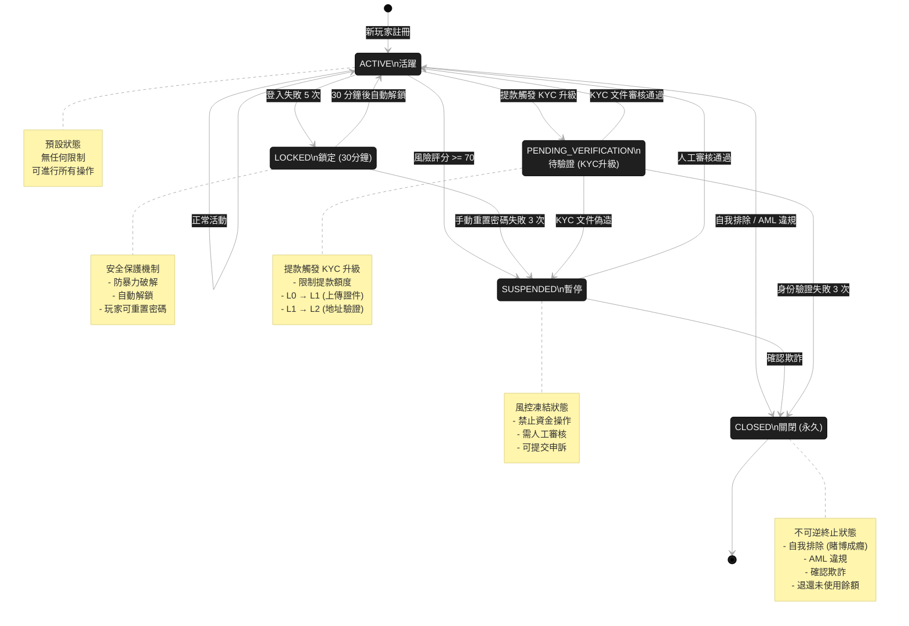
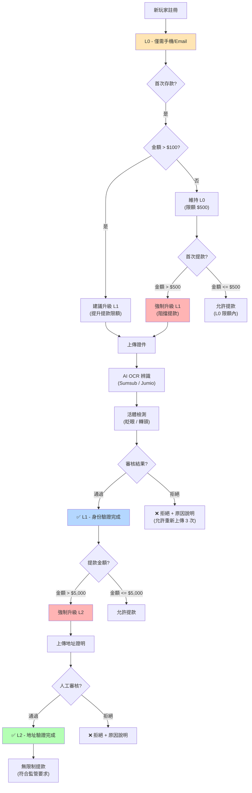
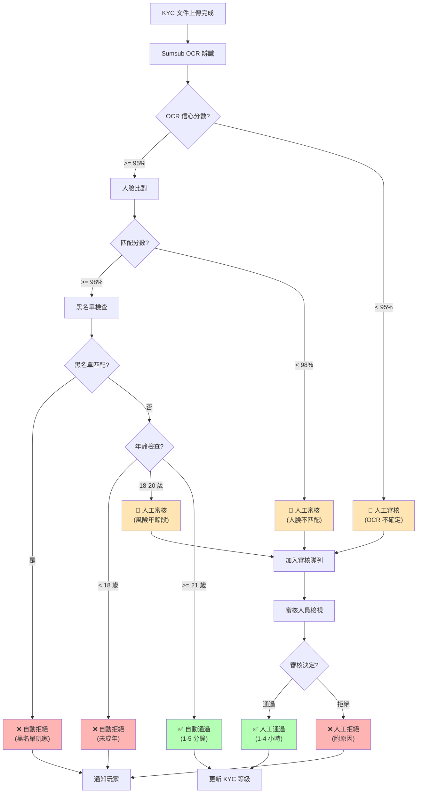

# 01-01 玩家生命週期管理 (Player Lifecycle Management)

> **Version**: 1.0.0 (Week 4-5 Creation)
> **Created From**: Consolidation of 4 source documents
> **Creation Date**: 2026-02-03
> **Maintainers**: Player Center Team & Backend Team

---

## 📋 目錄

- [1. 系統概述](#1-系統概述-system-overview)
- [2. 生命週期階段定義](#2-生命週期階段定義-lifecycle-stage-definition)
- [3. 帳戶狀態狀態機](#3-帳戶狀態狀態機-account-status-state-machine)
- [4. KYC 驗證工作流](#4-kyc-驗證工作流-kyc-verification-workflow)
- [5. 設備指紋與風險評估](#5-設備指紋與風險評估-device-fingerprinting--risk-assessment)
- [6. 恢復路徑設計](#6-恢復路徑設計-recovery-path-design)
- [7. SmartAdmin 架構映射](#7-smartadmin-架構映射-smartadmin-architecture-mapping)
- [8. 相關文檔](#8-相關文檔)

---

## 1. 系統概述 (System Overview)

### 1.1 核心定位

玩家生命週期管理系統 (Player Lifecycle Management, PLM) 是整個 iGaming 平台的基石，負責處理玩家從註冊、登入、身份驗證、狀態轉換、風險評估到帳戶關閉的全生命週期。本模組需支援 **多商戶 (Multi-Tenant)** 架構，確保不同商戶間的玩家數據完全隔離，同時支持集團級別 (Brand) 的統一視圖。

### 1.2 核心功能

**身份與註冊管理**：
- **多種註冊方式**: 帳號/密碼、手機號/OTP、快速註冊、Social Login (Google, Line, Telegram, Facebook)
- **商戶配置項**: 是否強制手機驗證、註冊欄位自定義、預設幣種與允許幣種
- **初始化流程**: 創建 player 記錄 → 初始化錢包 → 設置預設 VIP 等級 (Bronze) → 記錄設備指紋

**安全與風控整合**：
- **多因子認證 (MFA)**: Google Authenticator、簡訊 OTP、Email OTP
- **安全風控**: 異地登入提醒、暴力破解防護、裝置指紋 (Device Fingerprint)、重複帳號處置
- **風險評估**: 0-100 分風險評分系統，整合設備、支付、行為、圖譜四個維度

**生命週期管理**：
- **階段識別**: 新用戶、活躍用戶、沉睡用戶、流失用戶
- **標籤系統**: 系統自動標籤 (高價值、沈睡、套利疑慮) + 手動標籤 (客服備註)
- **狀態轉換**: 5 狀態狀態機 (ACTIVE, LOCKED, SUSPENDED, PENDING_VERIFICATION, CLOSED)

### 1.3 設計原則

**單一數據源 (SSOT)**：
- 玩家帳戶狀態狀態機在本文檔定義，其他模組僅引用
- 風險評分維度定義在 [05-01 風控系統](../04_Risk_Control/04-01_Risk_Framework.md)
- 錢包創建邏輯定義在 [02-06 統一錢包模型](../02_Finance_Center/02-06_Unified_Wallet_Model.md)

**事件驅動架構**：
- 發布事件: `player.registered`, `player.kyc.completed`, `player.status.changed`, `player.risk.flagged`
- 消費事件: `wallet.deposit.completed`, `game.bet.placed`, `vip.tier.changed`

**多租戶隔離**：
- 數據隔離: `tenant_id` 列級隔離 + Row-Level Security (RLS)
- 配置隔離: 每個租戶可自定義註冊欄位、KYC 等級、風險閾值
- 資源隔離: 獨立的風控規則集、黑名單、白名單

---

## 2. 生命週期階段定義 (Lifecycle Stage Definition)

> 💡 **SSOT Marker**: 玩家生命週期階段的完整定義在本章節。其他文檔引用時應鏈接至此。

### 2.1 生命週期階段矩陣

**概述**: 玩家生命週期劃分為 4 個主要階段，基於註冊時間和投注活躍度動態計算。

| 階段 | 定義 | 識別條件 (SQL) | 業務策略 | 平均週期 | 轉化目標 |
|------|------|---------------|---------|---------|---------|
| **新用戶<br/>(New User)** | 註冊後 7 天內 | `DATEDIFF(NOW(), created_at) <= 7` | 首存紅利、新手引導 | 7 天 | 首存轉化率 30-40% |
| **活躍用戶<br/>(Active User)** | 近 30 天有投注 | `last_bet_date >= DATE_SUB(NOW(), INTERVAL 30 DAY)` | VIP 升級、專屬活動 | 30-90 天 | D30 留存率 40-50% |
| **沉睡用戶<br/>(Dormant User)** | 30-90 天未投注 | `last_bet_date BETWEEN DATE_SUB(NOW(), INTERVAL 90 DAY) AND DATE_SUB(NOW(), INTERVAL 30 DAY)` | 喚醒紅利、EDM 營銷 | 60 天 | 喚醒率 20-30% |
| **流失用戶<br/>(Churned User)** | 90 天以上未投注 | `last_bet_date < DATE_SUB(NOW(), INTERVAL 90 DAY)` | 大額回歸優惠、客服致電 | 永久 | 回歸率 5-10% |

### 2.2 生命週期轉化漏斗

```text
註冊用戶 (100%)
    ↓ 首存轉化率 30-40%
首存用戶 (30-40%)
    ↓ 活躍留存率 40-50%
活躍用戶 (15-20%)
    ↓ VIP 轉化率 10-15%
VIP 玩家 (1.5-3%)
```

**關鍵指標 (KPIs)**：
- **首存轉化率**: 註冊後 7 天內首存的比例 (目標: 30-40%)
- **D7 留存率**: 註冊後第 7 天仍活躍的比例 (目標: 20-30%)
- **D30 留存率**: 註冊後第 30 天仍活躍的比例 (目標: 15-20%)
- **流失率**: 90 天未投注的玩家比例 (目標: <40%)
- **月活躍用戶 (MAU)**: 近 30 天有投注的玩家數
- **平均生命週期價值 (LTV)**: 玩家在整個生命週期內的總淨收入

### 2.3 RFM 模型整合

**RFM 分群矩陣** (Recency, Frequency, Monetary):

| 分群 | R (最近消費) | F (消費頻率) | M (消費金額) | 特徵 | 策略 |
|------|-------------|-------------|-------------|------|------|
| **重要客戶<br/>(Champions)** | 5 | 5 | 5 | 最近投注、高頻率、高金額 | VIP 專屬活動、一對一服務、生日禮遇 |
| **潛力客戶<br/>(Potential Loyalists)** | 4-5 | 3-4 | 3-4 | 近期活躍、中等頻率和金額 | VIP 升級激勵、專屬紅利、提升頻率 |
| **需要關注<br/>(At Risk)** | 2-3 | 3-5 | 3-5 | 曾經高價值,但最近不活躍 | 喚醒活動、專屬回歸紅利、客服致電 |
| **流失客戶<br/>(Lost)** | 1 | 1-2 | 1-3 | 長期未活躍、低頻率 | 大額回歸優惠、重新激活廣告 |

**RFM 計算邏輯**:
```sql
-- R (Recency): 最近投注距今天數
R_Score = CASE
  WHEN DATEDIFF(NOW(), last_bet_date) <= 7 THEN 5
  WHEN DATEDIFF(NOW(), last_bet_date) <= 30 THEN 4
  WHEN DATEDIFF(NOW(), last_bet_date) <= 60 THEN 3
  WHEN DATEDIFF(NOW(), last_bet_date) <= 90 THEN 2
  ELSE 1
END

-- F (Frequency): 近 90 天投注次數
F_Score = CASE
  WHEN bet_count_90d >= 100 THEN 5
  WHEN bet_count_90d >= 50 THEN 4
  WHEN bet_count_90d >= 20 THEN 3
  WHEN bet_count_90d >= 5 THEN 2
  ELSE 1
END

-- M (Monetary): 近 90 天累積投注額
M_Score = CASE
  WHEN total_bet_90d >= 10000 THEN 5
  WHEN total_bet_90d >= 5000 THEN 4
  WHEN total_bet_90d >= 1000 THEN 3
  WHEN total_bet_90d >= 100 THEN 2
  ELSE 1
END
```

### 2.4 玩家標籤系統

**價值標籤 (Value Tags)**:
- `VIP_WHALE` - 鯨魚玩家 (月存款 > $50K)
- `HIGH_ROLLER` - 高額玩家 (月存款 $10K-$50K)
- `REGULAR` - 普通玩家 (月存款 $1K-$10K)
- `CASUAL` - 休閒玩家 (月存款 < $1K)

**風控標籤 (Risk Tags)** (詳見 [05-01 §4.2](../04_Risk_Control/04-01_Risk_Framework.md#42-風險標籤)):
- `BONUS_HUNTER` - 獎金獵人 (僅玩高 RTP 遊戲,完成流水後立即提款)
- `ARBITRAGE` - 套利者 (在多平台對沖投注)
- `HEDGER` - 對沖者 (同一平台多賬戶對沖)
- `MULTI_ACCOUNT` - 多賬戶關聯 (設備指紋/IP/支付方式相同)

**行為標籤 (Behavior Tags)**:
- `SLOT_LOVER` - 老虎機愛好者 (90% 投注在老虎機)
- `LIVE_CASINO_FAN` - 真人娛樂愛好者
- `SPORTS_BETTOR` - 體育投注玩家
- `NIGHT_OWL` - 夜貓子 (投注時間集中在 22:00-06:00)

**生命週期標籤 (Lifecycle Tags)**:
- `FIRST_DEPOSIT_PENDING` - 待首存
- `ACTIVE_7D` - 7 天內活躍
- `DORMANT_30D` - 30 天沉睡
- `CHURNED_90D` - 90 天流失

---

## 3. 帳戶狀態狀態機 (Account Status State Machine)

> 💡 **SSOT Marker**: 玩家帳戶狀態的完整定義在本章節。數據模型設計詳見 [00-03 §3.1](../00_Concept_&_Analysis/00-03_Data_Model_Overview.md#31-player-account-state-machine)。

### 3.1 五狀態定義表

**概述**: 玩家帳戶狀態採用狀態機模式，確保狀態轉換邏輯清晰、可追溯，並提供降級保護機制。

| 狀態碼 | 英文名稱 | 中文名稱 | 觸發條件 | 業務影響 | 自動恢復 | 玩家可見性 |
|-------|---------|---------|---------|---------|---------|----------|
| `ACTIVE` | Active | 活躍 | 預設狀態 | 無限制 | N/A | 正常 |
| `LOCKED` | Locked | 鎖定 | 連續登入失敗 5 次 | 禁止登入 30 分鐘 | ✅ 自動 (30 分鐘後) | 顯示倒計時 |
| `SUSPENDED` | Suspended | 暫停 | 風險評分 >= 70 | 禁止充值/提款/投注 | ❌ 需人工審核 | 顯示申訴入口 |
| `PENDING_VERIFICATION` | Pending Verification | 待驗證 | 提款觸發 KYC 升級 | 限制提款額度 | ✅ KYC 完成後 | 顯示待辦事項 |
| `CLOSED` | Closed | 關閉 | 自我排除 OR AML 違規 | 永久關閉 | ❌ 不可逆 | 顯示關閉原因 |

### 3.2 狀態轉換 Mermaid 圖



### 3.3 狀態轉換詳細邏輯

#### 3.3.1 ACTIVE → LOCKED (登入失敗觸發)

**觸發條件**:
```java
IF consecutive_failed_logins >= 5 AND last_failed_login_time >= NOW() - 5 MINUTES
THEN TRANSITION TO LOCKED
```

**SQL 實現** (PostgreSQL):
```sql
-- Step 1: 增加失敗計數
UPDATE players
SET failed_login_attempts = failed_login_attempts + 1,
    last_failed_login_at = NOW(),
    updated_at = NOW()
WHERE player_id = ?
  AND account_status = 'ACTIVE';

-- Step 2: 檢查是否需要鎖定
UPDATE players
SET account_status = 'LOCKED',
    locked_until = NOW() + INTERVAL '30 MINUTE',
    locked_reason = 'CONSECUTIVE_LOGIN_FAILURES',
    updated_at = NOW()
WHERE player_id = ?
  AND account_status = 'ACTIVE'
  AND failed_login_attempts >= 5
  AND last_failed_login_at >= NOW() - INTERVAL '5 MINUTE';
```

**業務規則**:
- **鎖定時長**: 30 分鐘 (可配置: 15/30/60 分鐘)
- **自動解鎖**: `locked_until` 時間到達後,下次登入嘗試自動解鎖
- **玩家操作**: 可通過 "忘記密碼" 流程立即解鎖 (需驗證 Email/手機)
- **風控升級**: 若在鎖定期間嘗試重置密碼失敗 3 次 → SUSPENDED

#### 3.3.2 ACTIVE → SUSPENDED (風險評分觸發)

**觸發條件** (詳見 [05-01 §4.6](../04_Risk_Control/04-01_Risk_Framework.md#46-風險評分規則)):
```java
IF risk_score >= 70 AND risk_level IN ('HIGH', 'CRITICAL')
THEN TRANSITION TO SUSPENDED
```

**風險評分維度** (0-100 分制):

| 維度 | 權重 | 評分範圍 | 觸發閾值 | 示例 |
|------|------|---------|---------|------|
| **設備維度** | 30% | 0-180 | 同設備 5+ 帳號 (+80) | 模擬器/VM (+60) |
| **支付維度** | 35% | 0-210 | 同支付方式 3+ 帳號 (+90) | 卡 BIN 地區與 IP 不匹配 (+30) |
| **行為維度** | 20% | 0-110 | ML 欺詐概率 > 0.8 (+50) | 獎金濫用模式 (+40) |
| **圖譜維度** | 15% | 0-180 | 多帳號資金流聚集 (+90) | 同步投注行為 (+60) |

**總分計算公式**:
```text
Risk_Score = (Device_Score × 0.30) + (Payment_Score × 0.35)
           + (Behavior_Score × 0.20) + (Graph_Score × 0.15)

IF Risk_Score >= 86 THEN Risk_Level = 'CRITICAL'  → Auto Block
IF Risk_Score >= 61 THEN Risk_Level = 'HIGH'      → Manual Review
IF Risk_Score >= 31 THEN Risk_Level = 'MEDIUM'    → Enhanced Monitoring
IF Risk_Score <= 30 THEN Risk_Level = 'LOW'       → Normal Flow
```

**SQL 實現**:
```sql
-- Step 1: 計算風險評分 (由風控服務完成)
-- Step 2: 更新狀態
UPDATE players
SET account_status = 'SUSPENDED',
    suspended_at = NOW(),
    suspended_reason = 'HIGH_RISK_SCORE',
    risk_score = ?,
    risk_level = ?,
    updated_at = NOW()
WHERE player_id = ?
  AND account_status = 'ACTIVE'
  AND ? >= 70;  -- risk_score 參數

-- Step 3: 發布 Kafka 事件
-- Kafka Topic: risk.player.flagged
-- Payload: { player_id, risk_score, risk_level, risk_factors }
```

**業務規則**:
- **立即生效**: 凍結所有資金操作 (充值/提款/投注)
- **保留權益**: 保留 VIP 等級和積分 (避免法律糾紛)
- **申訴機制**: 玩家可通過 CS 提交申訴 (附上證明文件)
- **審核 SLA**:
  - CRITICAL (>= 86 分): 2 小時內審核
  - HIGH (61-85 分): 24 小時內審核

#### 3.3.3 ACTIVE → PENDING_VERIFICATION (提款觸發 KYC)

**觸發條件** (KYC 分級詳見 [§4.2](#42-kyc-分級認證體系)):
```java
IF withdrawal_amount > kyc_limit[current_kyc_level]
THEN TRANSITION TO PENDING_VERIFICATION
```

**KYC 等級限制矩陣**:

| KYC 等級 | 單筆提款限額 | 累積提款限額 | 升級要求 | 審核時間 |
|---------|------------|------------|---------|---------|
| **L0** (未驗證) | $500 | $1,000 / 月 | 僅需手機/Email | N/A |
| **L1** (身份驗證) | $5,000 | $50,000 / 月 | 上傳證件 (Passport/ID) + 人臉比對 | 1-4 小時 |
| **L2** (地址驗證) | $50,000 | 無限制 | 上傳水電單/銀行對帳單 | 4-24 小時 |

**SQL 實現**:
```sql
-- Step 1: 檢查提款額度
SELECT
  current_kyc_level,
  CASE current_kyc_level
    WHEN 'L0' THEN 500
    WHEN 'L1' THEN 5000
    WHEN 'L2' THEN 999999999
  END AS single_withdrawal_limit
FROM players
WHERE player_id = ?;

-- Step 2: 若超限,更新狀態
UPDATE players
SET account_status = 'PENDING_VERIFICATION',
    pending_verification_reason = 'WITHDRAWAL_LIMIT_EXCEEDED',
    required_kyc_level = ?,  -- 需要升級到的等級
    updated_at = NOW()
WHERE player_id = ?
  AND account_status = 'ACTIVE';

-- Step 3: 創建 KYC 升級任務
INSERT INTO kyc_verification_tasks (player_id, current_level, target_level, status, created_at)
VALUES (?, 'L0', 'L1', 'PENDING', NOW());
```

**業務規則**:
- **限制範圍**: 僅限制提款額度,不影響充值和投注
- **緊急通道**: VIP Diamond 玩家可申請加急審核 (1 小時內完成)
- **過期機制**: KYC 任務 7 天內未完成 → 自動降回 ACTIVE (限額恢復)

#### 3.3.4 ACTIVE/SUSPENDED → CLOSED (永久關閉)

**觸發條件**:
1. **自我排除** (Self-Exclusion): 玩家主動申請 (賭博成癮保護)
2. **AML 違規**: 洗錢、資恐、嚴重欺詐
3. **多次欺詐**: SUSPENDED 狀態下確認欺詐

**SQL 實現**:
```sql
-- Step 1: 更新狀態為 CLOSED
UPDATE players
SET account_status = 'CLOSED',
    closed_at = NOW(),
    closed_reason = ?,  -- 'SELF_EXCLUSION', 'AML_VIOLATION', 'FRAUD_CONFIRMED'
    closed_by_user_id = ?,  -- 操作人員 ID (若為系統自動則為 NULL)
    updated_at = NOW()
WHERE player_id = ?;

-- Step 2: 退還未使用餘額 (可選)
-- 根據關閉原因決定:
-- - SELF_EXCLUSION: 全額退還
-- - AML_VIOLATION: 扣除可疑金額後退還
-- - FRAUD_CONFIRMED: 僅退還本金 (沒收盈利)
INSERT INTO withdrawal_requests (player_id, amount, type, status, created_at)
SELECT player_id, cash_balance, 'ACCOUNT_CLOSURE_REFUND', 'APPROVED', NOW()
FROM player_wallets
WHERE player_id = ?
  AND cash_balance > 0;

-- Step 3: 發布 Kafka 事件
-- Kafka Topic: player.account.closed
-- Payload: { player_id, closed_reason, refund_amount }
```

**業務規則**:
- **不可逆**: CLOSED 狀態無法恢復,玩家需重新註冊 (需更換 Email/手機)
- **冷靜期**: 自我排除可設定冷靜期 (7 天/30 天/180 天/永久)
- **退款規則**:
  - 自我排除: 退還全部餘額 (現金 + 未使用紅利)
  - AML 違規: 凍結可疑金額,退還合法本金
  - 欺詐確認: 僅退還本金,沒收所有盈利

### 3.4 狀態轉換監控與告警

**關鍵監控指標**:

| 指標 | 計算公式 | 正常範圍 | 告警閾值 | 處理建議 |
|------|---------|---------|---------|---------|
| **鎖定率** | LOCKED / ACTIVE | < 2% | > 5% | 檢查是否有暴力破解攻擊 |
| **暫停率** | SUSPENDED / ACTIVE | < 1% | > 3% | 檢查風控規則是否過嚴 |
| **待驗證率** | PENDING_VERIFICATION / ACTIVE | < 5% | > 10% | 檢查 KYC 限額是否過低 |
| **關閉率** | CLOSED / TOTAL | < 0.5% | > 2% | 檢查是否有異常批量關閉 |
| **平均鎖定時長** | AVG(unlocked_at - locked_at) | < 30 分鐘 | > 2 小時 | 檢查自動解鎖機制 |

**Grafana 告警配置** (Prometheus Query):
```promql
# 告警: 5 分鐘內鎖定率超過 5%
rate(player_status_transitions{to_status="LOCKED"}[5m])
  / on() group_left()
sum(player_status_count{status="ACTIVE"})
> 0.05
```

---

## 4. KYC 驗證工作流 (KYC Verification Workflow)

> 💡 **SSOT Marker**: KYC 分級認證體系在本章節定義。提款限額整合詳見 [01-05 §3.1](./01-05_Withdrawal_Risk.md#31-kyc-等級與提款限額)。

### 4.1 系統概述

**KYC (Know Your Customer)** 與 **AML (Anti-Money Laundering)** 是 iGaming 平台的法律合規基礎。本系統採用 **分級認證體系**，平衡合規要求與用戶體驗:
- **L0 (註冊)**: 低門檻,快速註冊
- **L1 (身份驗證)**: 證件上傳 + AI 辨識
- **L2 (地址驗證)**: 居住證明 + 資金來源證明

### 4.2 KYC 分級認證體系

**分級矩陣**:

| KYC 等級 | 驗證內容 | 技術方案 | 單筆提款限額 | 累積提款限額 | 審核 SLA | 完成率 |
|---------|---------|---------|------------|------------|---------|--------|
| **L0** (註冊) | 手機號 OR Email | OTP 驗證 | $500 | $1,000 / 月 | 即時 | 100% |
| **L1** (身份驗證) | 證件 (Passport/ID) + 人臉 | OCR + Liveness Detection | $5,000 | $50,000 / 月 | 1-4 小時 | 85-90% |
| **L2** (地址驗證) | 水電單 / 銀行對帳單 | 人工審核 + OCR | $50,000 | 無限制 | 4-24 小時 | 70-80% |

**升級觸發條件**:



### 4.3 KYC 文件要求

**L1 (身份驗證) - 接受的證件類型**:

| 證件類型 | 必須包含資訊 | OCR 提取欄位 | 常見拒絕原因 |
|---------|------------|------------|------------|
| **護照 (Passport)** | 姓名、出生日期、護照號碼、照片 | `full_name`, `date_of_birth`, `document_number`, `expiry_date` | 過期、照片模糊、反光 |
| **身份證 (National ID)** | 姓名、出生日期、身份證號、照片 | 同上 | 僅上傳單面、翻拍螢幕 |
| **駕照 (Driver License)** | 姓名、出生日期、駕照號碼、照片 | 同上 | 臨時駕照不接受 |

**L2 (地址驗證) - 接受的證明文件**:

| 文件類型 | 必須包含資訊 | 有效期限 | 常見拒絕原因 |
|---------|------------|---------|------------|
| **水電單 (Utility Bill)** | 姓名、地址、發單日期 | 3 個月內 | 姓名不匹配、超過期限 |
| **銀行對帳單 (Bank Statement)** | 姓名、地址、對帳單日期 | 3 個月內 | 僅顯示部分地址 |
| **租約 (Lease Agreement)** | 姓名、地址、簽署日期 | 6 個月內 | 非正式租約 |

### 4.4 第三方 KYC 整合

**推薦服務商**:

| 服務商 | 覆蓋國家 | OCR 準確率 | Liveness 準確率 | 月費 | API 調用費 |
|--------|---------|-----------|----------------|------|-----------|
| **Sumsub** | 240+ | 98.5% | 99.2% | $500 | $0.50 / 次 |
| **Jumio** | 200+ | 97.8% | 98.9% | $800 | $0.70 / 次 |
| **Onfido** | 195+ | 98.1% | 99.0% | $600 | $0.60 / 次 |

**Sumsub API 整合範例** (Java):

```java
@Service
@RequiredArgsConstructor
public class KycVerificationService {
    private final SumsubApiClient sumsubClient;
    private final PlayerDao playerDao;
    private final ApplicationEventPublisher eventPublisher;

    /**
     * 創建 KYC 驗證會話
     *
     * @param playerId 玩家 ID
     * @param targetLevel 目標 KYC 等級 (L1 or L2)
     * @return Sumsub 會話 URL (玩家跳轉至此 URL 上傳文件)
     */
    public Option<String> createKycSession(Long playerId, String targetLevel) {
        return playerDao.findById(playerId)
            .flatMap(player -> {
                // 創建 Sumsub Applicant
                ApplicantRequest request = ApplicantRequest.builder()
                    .externalUserId(player.getPlayerId().toString())
                    .email(player.getEmail())
                    .phone(player.getPhoneNumber())
                    .build();

                return sumsubClient.createApplicant(request)
                    .map(applicant -> {
                        // 生成會話 Token
                        String sessionUrl = sumsubClient.generateAccessToken(
                            applicant.getId(),
                            targetLevel.equals("L1") ? "basic-kyc" : "advanced-kyc"
                        );

                        // 更新玩家記錄
                        player.setPendingKycLevel(targetLevel);
                        player.setSumsubApplicantId(applicant.getId());
                        playerDao.updateById(player);

                        return sessionUrl;
                    });
            });
    }

    /**
     * Webhook: 接收 Sumsub 審核結果
     *
     * @param webhookPayload Sumsub Webhook Payload
     */
    @Transactional(rollbackFor = Throwable.class)
    public void handleKycWebhook(SumsubWebhookPayload webhookPayload) {
        String applicantId = webhookPayload.getApplicantId();
        String reviewStatus = webhookPayload.getReviewStatus();  // "approved", "rejected"

        playerDao.findBySumsubApplicantId(applicantId)
            .forEach(player -> {
                if ("approved".equals(reviewStatus)) {
                    // 審核通過 → 升級 KYC 等級
                    String newLevel = player.getPendingKycLevel();
                    player.setCurrentKycLevel(newLevel);
                    player.setAccountStatus("ACTIVE");  // 若之前是 PENDING_VERIFICATION
                    player.setKycVerifiedAt(LocalDateTime.now());

                    playerDao.updateById(player);

                    // 發布事件: player.kyc.completed
                    eventPublisher.publishEvent(new PlayerKycCompletedEvent(
                        player.getPlayerId(),
                        newLevel,
                        LocalDateTime.now()
                    ));

                } else if ("rejected".equals(reviewStatus)) {
                    // 審核拒絕 → 記錄原因
                    String rejectReason = webhookPayload.getRejectLabels().stream()
                        .map(RejectLabel::getLabel)
                        .collect(Collectors.joining(", "));

                    player.setKycRejectReason(rejectReason);
                    player.setKycRetryCount(player.getKycRetryCount() + 1);

                    playerDao.updateById(player);

                    // 若重試次數 >= 3 → SUSPENDED
                    if (player.getKycRetryCount() >= 3) {
                        player.setAccountStatus("SUSPENDED");
                        player.setSuspendedReason("KYC_FAILED_3_TIMES");
                        playerDao.updateById(player);
                    }
                }
            });
    }
}
```

### 4.5 KYC 審核流程

**自動審核 vs 人工審核**:

| 審核類型 | 適用場景 | 通過率 | 平均審核時間 | 成本 |
|---------|---------|--------|------------|------|
| **自動審核<br/>(Auto-Approval)** | OCR 信心分數 > 95%<br/>人臉匹配分數 > 98%<br/>無黑名單匹配 | 85-90% | 1-5 分鐘 | $0.50 / 次 |
| **人工審核<br/>(Manual Review)** | OCR 信心分數 < 95%<br/>證件類型罕見<br/>年齡 < 21 歲 | 70-80% | 1-4 小時 | $2.00 / 次 |

**審核決策樹**:



**人工審核 SLA**:

| 優先級 | 玩家類型 | 審核 SLA | 審核人員配置 |
|-------|---------|---------|------------|
| **P0 - 緊急** | VIP Diamond | 30 分鐘 | 專屬審核人員 (24/7) |
| **P1 - 高優先** | VIP Platinum/Gold | 2 小時 | 優先隊列 |
| **P2 - 正常** | 其他玩家 | 4 小時 | 正常隊列 |
| **P3 - 低優先** | L2 升級 (非強制) | 24 小時 | 批次審核 |

---

## 5. 設備指紋與風險評估 (Device Fingerprinting & Risk Assessment)

> 💡 **SSOT Marker**: 設備指紋採集方案在本章節定義。風險評分邏輯詳見 [05-01 §4.2](../04_Risk_Control/04-01_Risk_Framework.md#42-多維欺詐檢測決策樹)。

### 5.1 設備指紋技術

**概述**: 設備指紋 (Device Fingerprint) 是識別唯一設備的技術,用於檢測多帳號套利、防止帳戶接管。業界領先方案如 **JuicyScore** 可收集超過 **65,000 個數據點**,涵蓋 **250+ 信號維度**。

**核心技術**:

| 技術 | 採集維度 | 唯一性 | 防規避能力 | 瀏覽器支持 |
|------|---------|-------|-----------|----------|
| **Canvas 指紋** | HTML5 Canvas 渲染差異 | 89% | 中 (可偽造) | Chrome, Firefox, Safari |
| **WebGL 指紋** | GPU 渲染特徵 | 94% | 高 (難偽造) | Chrome, Firefox |
| **Audio 指紋** | 音頻處理特徵 | 91% | 高 (難偽造) | Chrome, Firefox |
| **Battery API** | 電池容量 + 充電狀態 | 低 (輔助) | 低 (易偽造) | Chrome |
| **User Agent** | 瀏覽器 + OS 版本 | 低 (輔助) | 低 (易偽造) | 所有瀏覽器 |

### 5.2 設備指紋採集方案

**前端 JavaScript SDK** (FingerprintJS Pro):

```javascript
// 1. 初始化 FingerprintJS
import FingerprintJS from '@fingerprintjs/fingerprintjs-pro'

const fpPromise = FingerprintJS.load({
  apiKey: 'YOUR_PUBLIC_API_KEY',
  region: 'ap',  // 亞太地區
  endpoint: 'https://fp.yourdomain.com'  // 自定義端點 (避免被 AdBlock)
})

// 2. 玩家註冊/登入時採集指紋
fpPromise
  .then(fp => fp.get())
  .then(result => {
    const deviceId = result.visitorId;  // 唯一設備 ID
    const confidence = result.confidence.score;  // 信心分數 (0-1)

    // 3. 發送至後端
    fetch('/api/player/register', {
      method: 'POST',
      headers: { 'Content-Type': 'application/json' },
      body: JSON.stringify({
        username: 'player123',
        password: '...',
        deviceId: deviceId,
        deviceFingerprint: {
          confidence: confidence,
          ip: result.ip,
          ipLocation: result.ipLocation,
          browserName: result.browserName,
          browserVersion: result.browserVersion,
          os: result.os,
          osVersion: result.osVersion,
          device: result.device,
          incognito: result.incognito,  // 是否無痕模式
          vpn: result.vpnDetection.result,  // 是否使用 VPN
          proxy: result.proxyDetection.result,  // 是否使用代理
          emulator: result.emulatorDetection.result,  // 是否模擬器
          tampered: result.tamperDetection.result  // 是否被篡改
        }
      })
    });
  });
```

**後端設備指紋存儲** (PostgreSQL):

```sql
CREATE TABLE player_devices (
    device_record_id BIGSERIAL PRIMARY KEY,
    player_id BIGINT NOT NULL REFERENCES players(player_id),
    tenant_id INT NOT NULL,
    device_id VARCHAR(64) NOT NULL,  -- FingerprintJS visitor_id
    device_fingerprint JSONB,  -- 完整指紋數據
    first_seen_at TIMESTAMP NOT NULL DEFAULT NOW(),
    last_seen_at TIMESTAMP NOT NULL DEFAULT NOW(),
    login_count INT DEFAULT 1,
    is_trusted BOOLEAN DEFAULT TRUE,  -- 是否受信任設備
    risk_flags JSONB,  -- { vpn: true, emulator: false, ... }
    created_at TIMESTAMP NOT NULL DEFAULT NOW(),
    updated_at TIMESTAMP NOT NULL DEFAULT NOW()
);

CREATE INDEX idx_player_devices_player_id ON player_devices(player_id);
CREATE INDEX idx_player_devices_device_id ON player_devices(device_id);
CREATE UNIQUE INDEX idx_player_devices_unique ON player_devices(player_id, device_id);
```

### 5.3 多帳號檢測邏輯

**同設備多帳號檢測** (Neo4j 圖分析):

```cypher
-- 查詢同一設備關聯的所有玩家
MATCH (d:Device {device_id: $deviceId})<-[:USES_DEVICE]-(p:Player)
RETURN p.player_id, p.username, p.created_at, p.total_deposit
ORDER BY p.created_at DESC

-- 查詢關聯帳號網絡 (深度 3)
MATCH path = (p1:Player {player_id: $playerId})
  -[:USES_DEVICE|:USES_IP|:USES_PAYMENT*1..3]-(p2:Player)
WHERE p1 <> p2
RETURN DISTINCT p2.player_id, p2.username,
       LENGTH(path) AS relationship_depth,
       [rel IN relationships(path) | type(rel)] AS relationship_types
ORDER BY relationship_depth ASC
LIMIT 50
```

**風險評分規則** (詳見 [05-01 §4.2](../04_Risk_Control/04-01_Risk_Framework.md#42-多維欺詐檢測決策樹)):

| 檢測項目 | 低風險 (0-30) | 中風險 (31-60) | 高風險 (61-85) | 嚴重 (86-100) |
|---------|--------------|---------------|--------------|--------------|
| **同設備帳號數** | 1-2 個 (+0) | 3-4 個 (+40) | 5+ 個 (+80) | 黑名單 (+100) |
| **模擬器/VM** | 否 (+0) | - | - | 是 (+60) |
| **VPN/代理** | 否 (+0) | - | 是 (+40) | - |
| **設備指紋信心分數** | >= 0.9 (+0) | 0.7-0.9 (+20) | < 0.7 (+50) | - |

### 5.4 異地登入提醒

**觸發條件**:

```java
IF (current_ip_country != last_ip_country)
   AND (time_diff < 2 hours)  // 短時間內跨國登入
THEN SEND ALERT
```

**通知方式**:
- **Email**: 發送至註冊 Email,包含登入時間、地點、設備類型
- **SMS**: 發送至註冊手機,包含驗證碼 (需輸入才能繼續)
- **站內信**: 登入後彈窗提示,確認是否本人操作

**SQL 實現**:

```sql
-- Step 1: 記錄登入日誌
INSERT INTO player_login_logs (player_id, ip_address, country_code, device_id, created_at)
VALUES (?, ?, ?, ?, NOW());

-- Step 2: 檢查是否異地登入
WITH last_login AS (
  SELECT country_code, created_at
  FROM player_login_logs
  WHERE player_id = ?
  ORDER BY created_at DESC
  LIMIT 1 OFFSET 1  -- 上一次登入
)
SELECT
  CASE
    WHEN ? <> last_login.country_code  -- 當前國家 vs 上次國家
         AND EXTRACT(EPOCH FROM (NOW() - last_login.created_at)) < 7200  -- 2 小時內
    THEN TRUE
    ELSE FALSE
  END AS is_abnormal_login
FROM last_login;
```

### 5.5 重複帳號處置 SOP

**情境 A: 誤操作** (相同 IP/Device,無獎金濫用):
- **Action**: `Merge` 合併帳戶
- **流程**:
  1. 保留最早註冊帳號 (Primary Account)
  2. 將新帳號餘額轉移至舊帳號
  3. 標記新帳號為 `CLOSED (Duplicate)`
  4. 通知玩家合併完成

**情境 B: 惡意套利** (領取多次首存紅利):
- **Action**: `Ban All` 封禁所有關聯帳號
- **流程**:
  1. 凍結關聯的所有帳號 (設置為 `SUSPENDED`)
  2. 沒收紅利與盈利
  3. 僅退還本金 (視條款而定)
  4. 加入黑名單 (Device ID + IP + Email)

---

## 6. 恢復路徑設計 (Recovery Path Design)

### 6.1 LOCKED → ACTIVE (自動解鎖)

**恢復路徑 1: 時間自動解鎖**
- **觸發**: `locked_until` 時間到達
- **實現**: Cron Job 每 5 分鐘掃描一次

```sql
-- Cron Job: 每 5 分鐘執行
UPDATE players
SET account_status = 'ACTIVE',
    locked_until = NULL,
    failed_login_attempts = 0,
    updated_at = NOW()
WHERE account_status = 'LOCKED'
  AND locked_until <= NOW();
```

**恢復路徑 2: 忘記密碼流程**
- **觸發**: 玩家點擊 "忘記密碼"
- **流程**:
  1. 發送 OTP 至註冊 Email/手機
  2. 玩家輸入 OTP + 新密碼
  3. 系統驗證 OTP → 重置密碼 → 解鎖帳號

```java
@Service
@RequiredArgsConstructor
public class PasswordResetService {
    private final PlayerDao playerDao;
    private final OtpService otpService;

    @Transactional(rollbackFor = Throwable.class)
    public Try<Void> resetPasswordAndUnlock(String email, String otp, String newPassword) {
        return otpService.verifyOtp(email, otp)
            .flatMap(isValid -> {
                if (!isValid) {
                    return Try.failure(new InvalidOtpException("OTP 驗證失敗"));
                }

                return playerDao.findByEmail(email)
                    .map(player -> {
                        // 重置密碼
                        player.setPasswordHash(BCrypt.hashpw(newPassword, BCrypt.gensalt()));

                        // 解鎖帳號
                        if ("LOCKED".equals(player.getAccountStatus())) {
                            player.setAccountStatus("ACTIVE");
                            player.setLockedUntil(null);
                            player.setFailedLoginAttempts(0);
                        }

                        playerDao.updateById(player);
                        return null;
                    })
                    .toTry(() -> new PlayerNotFoundException("玩家不存在"));
            });
    }
}
```

### 6.2 SUSPENDED → ACTIVE (人工審核)

**恢復路徑: 申訴流程**
- **觸發**: 玩家提交申訴 (附上證明文件)
- **流程**:
  1. 玩家提交申訴表單 (說明原因 + 上傳證明)
  2. CS 團隊審核 (2-24 小時)
  3. 若申訴成功 → 解除 SUSPENDED 狀態
  4. 若申訴失敗 → 維持 SUSPENDED (可再次申訴)

```java
@Service
@RequiredArgsConstructor
public class AppealManager {
    private final PlayerDao playerDao;
    private final AppealDao appealDao;

    @Transactional(rollbackFor = Throwable.class)
    public Try<Void> approveAppeal(Long appealId, Long reviewerUserId, String reviewNote) {
        return appealDao.findById(appealId)
            .flatMap(appeal -> {
                // 更新申訴狀態
                appeal.setStatus("APPROVED");
                appeal.setReviewerUserId(reviewerUserId);
                appeal.setReviewNote(reviewNote);
                appeal.setReviewedAt(LocalDateTime.now());
                appealDao.updateById(appeal);

                // 解除玩家 SUSPENDED 狀態
                return playerDao.findById(appeal.getPlayerId())
                    .map(player -> {
                        player.setAccountStatus("ACTIVE");
                        player.setSuspendedAt(null);
                        player.setSuspendedReason(null);
                        playerDao.updateById(player);
                        return null;
                    })
                    .toTry(() -> new PlayerNotFoundException("玩家不存在"));
            })
            .toTry(() -> new AppealNotFoundException("申訴記錄不存在"));
    }
}
```

### 6.3 PENDING_VERIFICATION → ACTIVE (KYC 完成)

**恢復路徑: 完成 KYC 升級**
- **觸發**: Sumsub Webhook 通知審核通過
- **流程** (詳見 [§4.4](#44-第三方-kyc-整合)):
  1. Sumsub 審核完成 → 發送 Webhook
  2. 後端接收 Webhook → 更新 `current_kyc_level`
  3. 若當前狀態為 `PENDING_VERIFICATION` → 恢復為 `ACTIVE`

### 6.4 CLOSED → 無法恢復

**不可逆狀態**: CLOSED 狀態無法恢復,玩家需重新註冊 (需更換 Email/手機)。

**例外情況**:
- **誤操作**: 若為系統錯誤或 CS 誤操作,可通過 DB 直接修改 (需高層審批)
- **自我排除到期**: 若玩家設定了冷靜期 (如 180 天),到期後可申請重新開啟帳號

```sql
-- 重新開啟帳號 (需高層審批)
UPDATE players
SET account_status = 'ACTIVE',
    closed_at = NULL,
    closed_reason = NULL,
    reopened_at = NOW(),
    reopened_by_user_id = ?  -- 審批人員 ID
WHERE player_id = ?
  AND account_status = 'CLOSED'
  AND closed_reason = 'SELF_EXCLUSION'
  AND closed_at <= NOW() - INTERVAL '180 DAY';  -- 冷靜期已過
```

---

## 7. SmartAdmin 架構映射 (SmartAdmin Architecture Mapping)

### 7.1 層架構概覽

**SmartAdmin 嚴格遵循四層架構**,玩家生命週期模組實現如下:

```
Controller Layer (控制器層)
    ↓ 調用
Service Layer (服務層 - 業務邏輯)
    ↓ 調用 (單表查詢) OR 調用 Manager (複雜事務)
Manager Layer (管理器層 - 事務協調)
    ↓ 調用
Dao Layer (數據訪問層 - MyBatis Plus)
    ↓ 操作
Entity Layer (實體層 - 數據庫表映射)
```

**關鍵約束** (ArchUnit 強制):
- ✅ Controller 只能調用 Service,不能直接調用 Dao/Manager
- ✅ Service 可直接調用 Dao (單表 CRUD),需事務時調用 Manager
- ✅ `@Transactional` 只能在 Manager 層,Service/Controller 絕不使用
- ✅ Service 層使用 `io.vavr.control.Option`,不用 `java.util.Optional`
- ✅ 依賴注入: `@RequiredArgsConstructor` + `private final`,禁止 `@Autowired` 字段注入

### 7.2 Entity - PlayerEntity

```java
package net.lab1024.sa.admin.module.player.domain.entity;

import com.baomidou.mybatisplus.annotation.*;
import com.baomidou.mybatisplus.extension.handlers.JacksonTypeHandler;
import lombok.Data;
import net.lab1024.sa.admin.module.player.domain.vo.DeviceFingerprintVO;
import net.lab1024.sa.admin.module.player.domain.vo.RiskFlagsVO;

import java.math.BigDecimal;
import java.time.LocalDateTime;

/**
 * 玩家實體
 *
 * 數據庫表: t_players
 * SSOT: 玩家帳戶狀態的權威定義 (01-01 §3)
 *
 * @author Player Center Team
 * @date 2026-02-03
 */
@Data
@TableName(value = "t_players", autoResultMap = true)
public class PlayerEntity {

    /**
     * 玩家 ID (主鍵)
     */
    @TableId(type = IdType.AUTO)
    private Long playerId;

    /**
     * 租戶 ID (多租戶隔離)
     */
    private Integer tenantId;

    /**
     * 用戶名 (登入帳號)
     */
    private String username;

    /**
     * 密碼雜湊 (BCrypt)
     */
    private String passwordHash;

    /**
     * Email
     */
    private String email;

    /**
     * 手機號碼
     */
    private String phoneNumber;

    /**
     * 帳戶狀態 (ACTIVE, LOCKED, SUSPENDED, PENDING_VERIFICATION, CLOSED)
     * SSOT: 01-01 §3.1 五狀態定義表
     */
    private String accountStatus;

    /**
     * 生命週期階段 (NEW_USER, ACTIVE_USER, DORMANT_USER, CHURNED_USER)
     * SSOT: 01-01 §2.1 生命週期階段矩陣
     */
    private String lifecycleStage;

    /**
     * KYC 等級 (L0, L1, L2)
     * SSOT: 01-01 §4.2 KYC 分級認證體系
     */
    private String currentKycLevel;

    /**
     * 待升級的 KYC 等級 (當狀態為 PENDING_VERIFICATION 時有值)
     */
    private String pendingKycLevel;

    /**
     * KYC 驗證完成時間
     */
    private LocalDateTime kycVerifiedAt;

    /**
     * KYC 拒絕原因
     */
    private String kycRejectReason;

    /**
     * KYC 重試次數
     */
    private Integer kycRetryCount;

    /**
     * Sumsub Applicant ID (第三方 KYC 服務)
     */
    private String sumsubApplicantId;

    /**
     * 風險評分 (0-100)
     * Reference: 05-01 §4.2 風險評分維度
     */
    private Integer riskScore;

    /**
     * 風險等級 (LOW, MEDIUM, HIGH, CRITICAL)
     */
    private String riskLevel;

    /**
     * 風險標籤 (BONUS_HUNTER, ARBITRAGE, MULTI_ACCOUNT, etc.)
     */
    @TableField(typeHandler = JacksonTypeHandler.class)
    private RiskFlagsVO riskFlags;

    /**
     * VIP 等級 (BRONZE, SILVER, GOLD, PLATINUM, DIAMOND)
     * Reference: 01-02 §2.1.1 VIP 等級轉換狀態機
     */
    private String vipTier;

    /**
     * 設備指紋 (JSON)
     */
    @TableField(typeHandler = JacksonTypeHandler.class)
    private DeviceFingerprintVO deviceFingerprint;

    /**
     * 連續登入失敗次數
     */
    private Integer failedLoginAttempts;

    /**
     * 上次登入失敗時間
     */
    private LocalDateTime lastFailedLoginAt;

    /**
     * 鎖定至 (自動解鎖時間)
     */
    private LocalDateTime lockedUntil;

    /**
     * 鎖定原因
     */
    private String lockedReason;

    /**
     * 暫停時間
     */
    private LocalDateTime suspendedAt;

    /**
     * 暫停原因
     */
    private String suspendedReason;

    /**
     * 關閉時間
     */
    private LocalDateTime closedAt;

    /**
     * 關閉原因 (SELF_EXCLUSION, AML_VIOLATION, FRAUD_CONFIRMED)
     */
    private String closedReason;

    /**
     * 關閉操作人 ID
     */
    private Long closedByUserId;

    /**
     * 上次投注時間 (用於計算生命週期階段)
     */
    private LocalDateTime lastBetDate;

    /**
     * 註冊時間
     */
    private LocalDateTime createdAt;

    /**
     * 更新時間
     */
    private LocalDateTime updatedAt;

    /**
     * 樂觀鎖版本號
     */
    @Version
    private Integer version;

    /**
     * 邏輯刪除標記 (0: 未刪除, 1: 已刪除)
     */
    @TableLogic
    private Integer deleted;
}
```

### 7.3 Manager - PlayerLifecycleManager

```java
package net.lab1024.sa.admin.module.player.manager;

import io.vavr.control.Try;
import lombok.RequiredArgsConstructor;
import lombok.extern.slf4j.Slf4j;
import net.lab1024.sa.admin.module.player.dao.PlayerDao;
import net.lab1024.sa.admin.module.player.dao.PlayerLoginLogDao;
import net.lab1024.sa.admin.module.player.domain.entity.PlayerEntity;
import net.lab1024.sa.admin.module.player.domain.entity.PlayerLoginLogEntity;
import net.lab1024.sa.admin.module.player.domain.event.PlayerStatusChangedEvent;
import net.lab1024.sa.foundation.redis.lock.DistributedLock;
import org.springframework.context.ApplicationEventPublisher;
import org.springframework.stereotype.Service;
import org.springframework.transaction.annotation.Transactional;

import java.time.LocalDateTime;
import java.util.concurrent.TimeUnit;

/**
 * 玩家生命週期管理器
 *
 * 職責: 複雜事務協調 (狀態轉換 + 日誌記錄 + 事件發布)
 *
 * @author Player Center Team
 * @date 2026-02-03
 */
@Slf4j
@Service
@RequiredArgsConstructor
public class PlayerLifecycleManager {

    private final PlayerDao playerDao;
    private final PlayerLoginLogDao playerLoginLogDao;
    private final DistributedLock redisLock;
    private final ApplicationEventPublisher eventPublisher;

    /**
     * 轉換帳戶狀態 (事務保證)
     *
     * SSOT: 01-01 §3.3 狀態轉換詳細邏輯
     *
     * @param playerId 玩家 ID
     * @param targetStatus 目標狀態 (ACTIVE, LOCKED, SUSPENDED, PENDING_VERIFICATION, CLOSED)
     * @param reason 轉換原因
     * @return Try<PlayerEntity> 成功返回更新後的玩家實體,失敗返回異常
     */
    @Transactional(rollbackFor = Throwable.class)
    public Try<PlayerEntity> transitionAccountStatus(
        Long playerId,
        String targetStatus,
        String reason
    ) {
        return Try.of(() -> {
            String lockKey = "player:status:transition:" + playerId;

            return redisLock.executeWithLock(lockKey, 5, TimeUnit.SECONDS, () -> {
                // Step 1: 查詢玩家當前狀態
                PlayerEntity player = playerDao.selectById(playerId);
                if (player == null) {
                    throw new IllegalArgumentException("玩家不存在: " + playerId);
                }

                String currentStatus = player.getAccountStatus();

                // Step 2: 驗證狀態轉換合法性
                validateStatusTransition(currentStatus, targetStatus);

                // Step 3: 更新玩家狀態
                player.setAccountStatus(targetStatus);

                switch (targetStatus) {
                    case "LOCKED":
                        player.setLockedUntil(LocalDateTime.now().plusMinutes(30));
                        player.setLockedReason(reason);
                        break;

                    case "SUSPENDED":
                        player.setSuspendedAt(LocalDateTime.now());
                        player.setSuspendedReason(reason);
                        break;

                    case "CLOSED":
                        player.setClosedAt(LocalDateTime.now());
                        player.setClosedReason(reason);
                        break;

                    case "ACTIVE":
                        // 清除鎖定/暫停相關字段
                        player.setLockedUntil(null);
                        player.setLockedReason(null);
                        player.setSuspendedAt(null);
                        player.setSuspendedReason(null);
                        player.setFailedLoginAttempts(0);
                        break;
                }

                player.setUpdatedAt(LocalDateTime.now());
                playerDao.updateById(player);

                // Step 4: 記錄狀態轉換日誌
                PlayerLoginLogEntity log = new PlayerLoginLogEntity();
                log.setPlayerId(playerId);
                log.setActionType("STATUS_TRANSITION");
                log.setFromStatus(currentStatus);
                log.setToStatus(targetStatus);
                log.setReason(reason);
                log.setCreatedAt(LocalDateTime.now());
                playerLoginLogDao.insert(log);

                // Step 5: 發布 Kafka 事件
                eventPublisher.publishEvent(new PlayerStatusChangedEvent(
                    playerId,
                    currentStatus,
                    targetStatus,
                    reason,
                    LocalDateTime.now()
                ));

                log.info("玩家狀態轉換成功 - playerId: {}, {} -> {}, reason: {}",
                    playerId, currentStatus, targetStatus, reason);

                return player;
            });
        });
    }

    /**
     * 驗證狀態轉換合法性
     *
     * SSOT: 01-01 §3.2 狀態轉換 Mermaid 圖
     */
    private void validateStatusTransition(String currentStatus, String targetStatus) {
        // ACTIVE 可以轉換到任何狀態
        if ("ACTIVE".equals(currentStatus)) {
            return;
        }

        // LOCKED 只能轉換到 ACTIVE 或 SUSPENDED
        if ("LOCKED".equals(currentStatus)) {
            if (!"ACTIVE".equals(targetStatus) && !"SUSPENDED".equals(targetStatus)) {
                throw new IllegalStateException(
                    String.format("LOCKED 狀態不能直接轉換到 %s", targetStatus)
                );
            }
            return;
        }

        // SUSPENDED 只能轉換到 ACTIVE 或 CLOSED
        if ("SUSPENDED".equals(currentStatus)) {
            if (!"ACTIVE".equals(targetStatus) && !"CLOSED".equals(targetStatus)) {
                throw new IllegalStateException(
                    String.format("SUSPENDED 狀態不能直接轉換到 %s", targetStatus)
                );
            }
            return;
        }

        // PENDING_VERIFICATION 只能轉換到 ACTIVE, SUSPENDED, CLOSED
        if ("PENDING_VERIFICATION".equals(currentStatus)) {
            if (!"ACTIVE".equals(targetStatus)
                && !"SUSPENDED".equals(targetStatus)
                && !"CLOSED".equals(targetStatus)) {
                throw new IllegalStateException(
                    String.format("PENDING_VERIFICATION 狀態不能直接轉換到 %s", targetStatus)
                );
            }
            return;
        }

        // CLOSED 不可轉換 (終止狀態)
        if ("CLOSED".equals(currentStatus)) {
            throw new IllegalStateException("CLOSED 狀態不可轉換 (終止狀態)");
        }
    }

    /**
     * 處理登入失敗 (增加失敗計數,必要時鎖定帳號)
     *
     * SSOT: 01-01 §3.3.1 ACTIVE → LOCKED
     *
     * @param playerId 玩家 ID
     * @return Try<Boolean> 是否已鎖定帳號
     */
    @Transactional(rollbackFor = Throwable.class)
    public Try<Boolean> handleLoginFailure(Long playerId) {
        return Try.of(() -> {
            String lockKey = "player:login:failure:" + playerId;

            return redisLock.executeWithLock(lockKey, 3, TimeUnit.SECONDS, () -> {
                // Step 1: 增加失敗計數
                PlayerEntity player = playerDao.selectById(playerId);
                if (player == null) {
                    throw new IllegalArgumentException("玩家不存在: " + playerId);
                }

                player.setFailedLoginAttempts(player.getFailedLoginAttempts() + 1);
                player.setLastFailedLoginAt(LocalDateTime.now());
                playerDao.updateById(player);

                // Step 2: 檢查是否需要鎖定
                if (player.getFailedLoginAttempts() >= 5
                    && player.getLastFailedLoginAt().isAfter(LocalDateTime.now().minusMinutes(5))) {

                    // 鎖定帳號
                    transitionAccountStatus(playerId, "LOCKED", "CONSECUTIVE_LOGIN_FAILURES");

                    log.warn("玩家帳號已鎖定 - playerId: {}, failedAttempts: {}",
                        playerId, player.getFailedLoginAttempts());

                    return true;
                }

                return false;
            });
        });
    }
}
```

### 7.4 Service - PlayerLifecycleService

```java
package net.lab1024.sa.admin.module.player.service;

import io.vavr.control.Option;
import io.vavr.control.Try;
import lombok.RequiredArgsConstructor;
import lombok.extern.slf4j.Slf4j;
import net.lab1024.sa.admin.module.player.dao.PlayerDao;
import net.lab1024.sa.admin.module.player.domain.entity.PlayerEntity;
import net.lab1024.sa.admin.module.player.domain.vo.PlayerLifecycleStageVO;
import net.lab1024.sa.admin.module.player.manager.PlayerLifecycleManager;
import org.springframework.stereotype.Service;

import java.time.LocalDateTime;
import java.time.temporal.ChronoUnit;

/**
 * 玩家生命週期服務
 *
 * 職責: 業務邏輯處理 (不含事務)
 *
 * @author Player Center Team
 * @date 2026-02-03
 */
@Slf4j
@Service
@RequiredArgsConstructor
public class PlayerLifecycleService {

    private final PlayerDao playerDao;
    private final PlayerLifecycleManager playerLifecycleManager;

    /**
     * 查詢玩家生命週期階段
     *
     * SSOT: 01-01 §2.1 生命週期階段矩陣
     *
     * @param playerId 玩家 ID
     * @return Option<PlayerLifecycleStageVO> 玩家生命週期資訊 (使用 Vavr Option)
     */
    public Option<PlayerLifecycleStageVO> getPlayerLifecycleStage(Long playerId) {
        return playerDao.findById(playerId)
            .map(player -> {
                String stage = calculateLifecycleStage(player);

                PlayerLifecycleStageVO vo = new PlayerLifecycleStageVO();
                vo.setPlayerId(player.getPlayerId());
                vo.setUsername(player.getUsername());
                vo.setLifecycleStage(stage);
                vo.setAccountStatus(player.getAccountStatus());
                vo.setKycLevel(player.getCurrentKycLevel());
                vo.setVipTier(player.getVipTier());
                vo.setRiskScore(player.getRiskScore());
                vo.setRiskLevel(player.getRiskLevel());
                vo.setLastBetDate(player.getLastBetDate());
                vo.setCreatedAt(player.getCreatedAt());

                return vo;
            });
    }

    /**
     * 計算生命週期階段
     *
     * SSOT: 01-01 §2.1 生命週期階段矩陣
     */
    private String calculateLifecycleStage(PlayerEntity player) {
        LocalDateTime now = LocalDateTime.now();
        LocalDateTime createdAt = player.getCreatedAt();
        LocalDateTime lastBetDate = player.getLastBetDate();

        // 規則 1: 註冊後 7 天內 → NEW_USER
        long daysSinceRegistration = ChronoUnit.DAYS.between(createdAt, now);
        if (daysSinceRegistration <= 7) {
            return "NEW_USER";
        }

        // 規則 2: 近 30 天有投注 → ACTIVE_USER
        if (lastBetDate != null) {
            long daysSinceLastBet = ChronoUnit.DAYS.between(lastBetDate, now);

            if (daysSinceLastBet <= 30) {
                return "ACTIVE_USER";
            }

            // 規則 3: 30-90 天未投注 → DORMANT_USER
            if (daysSinceLastBet <= 90) {
                return "DORMANT_USER";
            }

            // 規則 4: 90 天以上未投注 → CHURNED_USER
            return "CHURNED_USER";
        }

        // 若從未投注,且註冊超過 7 天 → CHURNED_USER
        return "CHURNED_USER";
    }

    /**
     * 檢查帳戶是否可登入
     *
     * @param playerId 玩家 ID
     * @return Try<Boolean> 可登入返回 true,不可登入返回 false + 原因
     */
    public Try<Boolean> canLogin(Long playerId) {
        return Try.of(() ->
            playerDao.findById(playerId)
                .map(player -> {
                    String status = player.getAccountStatus();

                    // CLOSED → 永久無法登入
                    if ("CLOSED".equals(status)) {
                        throw new IllegalStateException("帳號已關閉");
                    }

                    // SUSPENDED → 暫時無法登入
                    if ("SUSPENDED".equals(status)) {
                        throw new IllegalStateException("帳號已暫停,請聯繫客服");
                    }

                    // LOCKED → 檢查鎖定時間
                    if ("LOCKED".equals(status)) {
                        LocalDateTime lockedUntil = player.getLockedUntil();
                        if (lockedUntil != null && lockedUntil.isAfter(LocalDateTime.now())) {
                            long minutesLeft = ChronoUnit.MINUTES.between(LocalDateTime.now(), lockedUntil);
                            throw new IllegalStateException(
                                String.format("帳號已鎖定,請 %d 分鐘後重試或重置密碼", minutesLeft)
                            );
                        }

                        // 鎖定時間已過 → 自動解鎖 (委託給 Manager)
                        playerLifecycleManager.transitionAccountStatus(playerId, "ACTIVE", "AUTO_UNLOCK");
                    }

                    // PENDING_VERIFICATION → 可登入,但部分功能受限
                    // ACTIVE → 正常登入
                    return true;
                })
                .getOrElseThrow(() -> new IllegalArgumentException("玩家不存在"))
        );
    }

    /**
     * 鎖定玩家帳號 (供風控系統調用)
     *
     * @param playerId 玩家 ID
     * @param reason 鎖定原因
     * @return Try<Void> 成功或失敗
     */
    public Try<Void> lockPlayer(Long playerId, String reason) {
        return playerLifecycleManager.transitionAccountStatus(playerId, "LOCKED", reason)
            .map(player -> null);
    }

    /**
     * 暫停玩家帳號 (供風控系統調用)
     *
     * @param playerId 玩家 ID
     * @param reason 暫停原因
     * @return Try<Void> 成功或失敗
     */
    public Try<Void> suspendPlayer(Long playerId, String reason) {
        return playerLifecycleManager.transitionAccountStatus(playerId, "SUSPENDED", reason)
            .map(player -> null);
    }
}
```

### 7.5 Controller - PlayerLifecycleController

```java
package net.lab1024.sa.admin.module.player.controller;

import io.swagger.v3.oas.annotations.Operation;
import io.swagger.v3.oas.annotations.tags.Tag;
import lombok.RequiredArgsConstructor;
import net.lab1024.sa.admin.module.player.service.PlayerLifecycleService;
import net.lab1024.sa.foundation.domain.response.ResponseDTO;
import org.springframework.web.bind.annotation.*;

/**
 * 玩家生命週期控制器
 *
 * @author Player Center Team
 * @date 2026-02-03
 */
@RestController
@RequestMapping("/api/player/lifecycle")
@RequiredArgsConstructor
@Tag(name = "玩家生命週期管理")
public class PlayerLifecycleController {

    private final PlayerLifecycleService playerLifecycleService;

    /**
     * 查詢玩家生命週期階段
     *
     * @param playerId 玩家 ID
     * @return ResponseDTO<PlayerLifecycleStageVO>
     */
    @GetMapping("/{playerId}/stage")
    @Operation(summary = "查詢玩家生命週期階段")
    public ResponseDTO<?> getLifecycleStage(@PathVariable Long playerId) {
        return playerLifecycleService.getPlayerLifecycleStage(playerId)
            .map(ResponseDTO::ok)
            .getOrElse(ResponseDTO.error("玩家不存在"));
    }

    /**
     * 鎖定玩家帳號 (管理後台使用)
     *
     * @param playerId 玩家 ID
     * @param reason 鎖定原因
     * @return ResponseDTO<Void>
     */
    @PostMapping("/{playerId}/lock")
    @Operation(summary = "鎖定玩家帳號")
    public ResponseDTO<?> lockPlayer(
        @PathVariable Long playerId,
        @RequestParam String reason
    ) {
        return playerLifecycleService.lockPlayer(playerId, reason)
            .map(v -> ResponseDTO.ok())
            .getOrElse(ResponseDTO.error("鎖定失敗"));
    }

    /**
     * 暫停玩家帳號 (風控系統使用)
     *
     * @param playerId 玩家 ID
     * @param reason 暫停原因
     * @return ResponseDTO<Void>
     */
    @PostMapping("/{playerId}/suspend")
    @Operation(summary = "暫停玩家帳號")
    public ResponseDTO<?> suspendPlayer(
        @PathVariable Long playerId,
        @RequestParam String reason
    ) {
        return playerLifecycleService.suspendPlayer(playerId, reason)
            .map(v -> ResponseDTO.ok())
            .getOrElse(ResponseDTO.error("暫停失敗"));
    }
}
```

### 7.6 Foundation 模組依賴

**玩家生命週期模組使用的 Foundation 模組**:

| Foundation 模組 | 使用場景 | 調用位置 |
|---------------|---------|---------|
| **foundation.redis-lock** | 防並發狀態轉換 (分佈式鎖) | Manager 層 `transitionAccountStatus()` |
| **foundation.mq** | 發布狀態變更事件 (Kafka) | Manager 層 `PlayerStatusChangedEvent` |
| **foundation.cache** | 緩存玩家生命週期階段 (Redis) | Service 層 `getPlayerLifecycleStage()` |
| **foundation.audit-log** | 記錄狀態轉換審計日誌 | Manager 層 `PlayerLoginLogEntity` |

### 7.7 ArchUnit 架構測試

```java
package net.lab1024.sa.admin.architecture;

import com.tngtech.archunit.core.domain.JavaClasses;
import com.tngtech.archunit.core.importer.ClassFileImporter;
import com.tngtech.archunit.lang.ArchRule;
import org.junit.jupiter.api.Test;
import org.springframework.transaction.annotation.Transactional;

import static com.tngtech.archunit.lang.syntax.ArchRuleDefinition.*;
import static com.tngtech.archunit.library.Architectures.layeredArchitecture;

/**
 * 玩家生命週期模組架構測試
 *
 * 驗證 SmartAdmin 架構規則
 */
class PlayerLifecycleArchitectureTest {

    private final JavaClasses importedClasses = new ClassFileImporter()
        .importPackages("net.lab1024.sa.admin.module.player");

    @Test
    void controllersShould NotAccessDaoDirectly() {
        ArchRule rule = noClasses()
            .that().resideInAPackage("..controller..")
            .should().dependOnClassesThat().resideInAPackage("..dao..");

        rule.check(importedClasses);
    }

    @Test
    void transactionalOnlyInManager() {
        ArchRule rule = methods()
            .that().areAnnotatedWith(Transactional.class)
            .should().beDeclaredInClassesThat().resideInAPackage("..manager..");

        rule.check(importedClasses);
    }

    @Test
    void serviceShouldUseVavrOption() {
        ArchRule rule = noClasses()
            .that().resideInAPackage("..service..")
            .should().dependOnClassesThat().haveFullyQualifiedName("java.util.Optional");

        rule.check(importedClasses);
    }

    @Test
    void layeredArchitecture() {
        layeredArchitecture()
            .consideringAllDependencies()
            .layer("Controller").definedBy("..controller..")
            .layer("Service").definedBy("..service..")
            .layer("Manager").definedBy("..manager..")
            .layer("Dao").definedBy("..dao..")

            .whereLayer("Controller").mayNotBeAccessedByAnyLayer()
            .whereLayer("Service").mayOnlyBeAccessedByLayers("Controller", "Manager")
            .whereLayer("Manager").mayOnlyBeAccessedByLayers("Service")
            .whereLayer("Dao").mayOnlyBeAccessedByLayers("Service", "Manager")

            .check(importedClasses);
    }
}
```

---

## 8. 相關文檔

### 8.1 前置知識

**核心概念**:
- [00-02 行業術語表](../00_Concept_&_Analysis/00-02_Industry_Terminology.md) - KYC, AML, RFM 等術語定義
- [00-03 數據模型總覽](../00_Concept_&_Analysis/00-03_Data_Model_Overview.md) - Player State Machine 數據模型

### 8.2 核心依賴

**業務整合**:
- [02-06 統一錢包模型](../02_Finance_Center/02-06_Unified_Wallet_Model.md) - 註冊時錢包創建
- [05-01 風控系統](../04_Risk_Control/04-01_Risk_Framework.md) - 風險評分、多帳號檢測、設備指紋
- [01-02 VIP 系統](./01-02_VIP_&_Loyalty_System.md) - VIP 等級初始化、積分系統
- [01-05 提款風控](./01-05_Withdrawal_Risk.md) - KYC 等級與提款限額

**技術實現**:
- [09-01 管理後台 RBAC](../05_Platform_Governance/05-02_RBAC_Permissions.md) - 玩家權限初始化、角色分配
- [09-03 數據安全標準](../09_System_Security/09-03_Data_Security_Standard.md) - 個人資料加密、Blind Index
- [09-04 審批工作流系統](../05_Platform_Governance/05-04_Approval_Workflow.md) - KYC 人工審核流程
- [12-03 網關架構](../07_Technical_Infrastructure/07-02-01_Gateway_Core.md) - 登入 API 安全、暴力破解防護

### 8.3 延伸閱讀

**運營優化**:
- [04-01 活動系統設計](../03_Player_Journey/03-03_Activity_Bonus.md) - 基於生命週期的精準營銷
- [10-01 報表與 BI 架構](../06_Analytics_Operations/06-01_Reporting_BI.md) - 玩家生命週期分析報表
- [11-01 客服平台設計](../06_Analytics_Operations/06-02_Customer_Service.md) - 玩家 360 視圖整合

**平台配置**:
- [07-01 多租戶架構](../05_Platform_Governance/05-01_Multi_Tenant.md) - 租戶級配置
- [07-02 租戶配置管理](../07_Platform_Management/07-02_Tenant_Configuration.md) - 註冊開關、IP 限制配置
- [08-05 本地化系統](../08_Frontend_CMS/08-05_Localization_System.md) - 多語言註冊頁面

---

**文檔版本**: 1.0.0 (Week 4-5 Creation)
**創建日期**: 2026-02-03
**最後更新**: 2026-02-03
**維護團隊**: Player Center Team & Backend Team

**變更歷史**:
- 1.0.0 (2026-02-03): 初始版本 - 整合 4 個來源文檔 (01-01, 01-03, 01-02, 05-01)
  - § 3: 帳戶狀態狀態機 (SSOT)
  - § 4: KYC 驗證工作流
  - § 5: 設備指紋與風險評估
  - § 7: SmartAdmin 架構映射 (Entity, Manager, Service, Controller)
