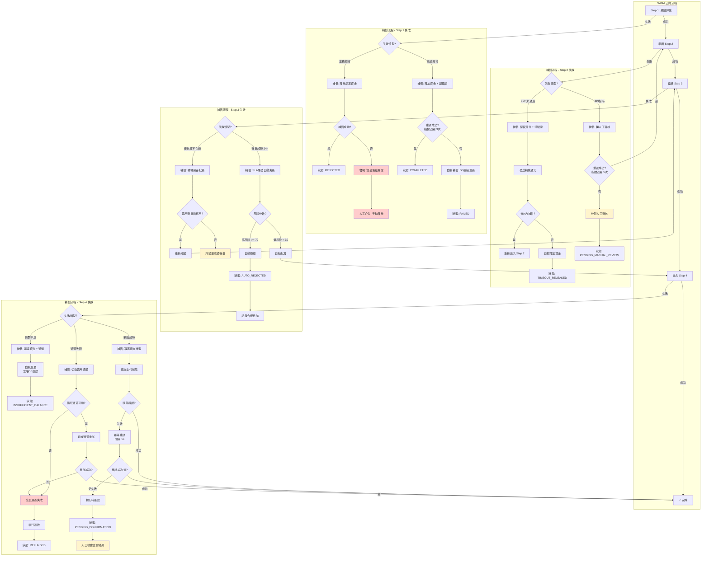
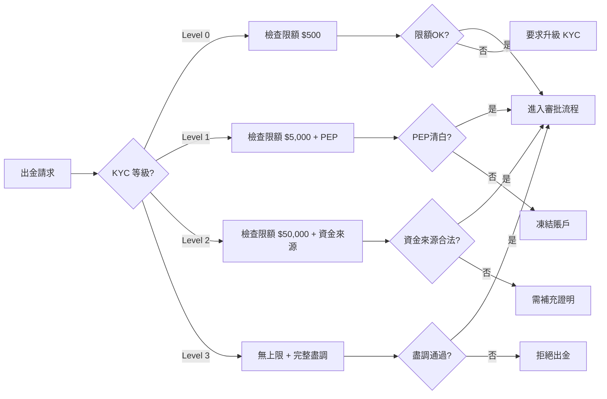

# 01-05 提款風控系統 (Withdrawal Risk Control System)

> **MOVED FROM**: `02-01_Withdrawal_Risk_Control.md` (Week 4-5 Restructure)
> **Reason**: 提款風控與玩家生命週期緊密相關,歸類至 Player Center 更合理
> **Version**: v2.2.0 (Post-migration Enhancement)
> **Last Updated**: 2026-02-03

---

## 系統概述 (System Overview)

全球 iGaming 出金審核系統需要整合 **四大洲合規要求**、**微服務架構**與**多層風控機制**，在 120 毫秒內完成風險決策，同時滿足從菲律賓 PAGCOR 的 3 天 KYC 時限到英國 UKGC 的即時提款禁止取消規則等差異化監管要求。本設計採用事件驅動架構配合 SAGA 分佈式事務模式，支援 99.99% 可用性目標。

---

## 全球合規差異決定系統核心架構

各地區監管機構對出金審核的要求存在根本性差異，這些差異直接影響系統設計決策。

**歐洲市場**執行最嚴格的玩家保護規範。英國 UKGC 自 2024 年 5 月起要求身份驗證必須在允許投注前完成，並明確禁止運營商在提款時才要求提供本應在更早階段收集的身份文件。96.3% 的提款必須自動處理，僅 0.1% 可超過 48 小時。馬耳他 MGA 的觸發門檻為 **€2,000 累計提款**時啟動強化盡職調查，而英國的財務風險檢查門檻已從每月 £500 降至 **£150**。Isle of Man 提供最強的玩家資金保護——資金必須以信託方式持有，不得用於營運開支。

**東南亞市場**以菲律賓為唯一合法持牌地區。PAGCOR 於 2024 年 11 月發布行政命令禁止 POGO（離岸博彩），轉向 PIGO（國內博彩）模式。KYC 時限從 7 天縮短至 **3 天**，反洗錢申報門檻為單日 PHP 500 萬（約 USD 89,000）。印尼和泰國完全禁止線上博彩，印尼在 2024 年凍結了 **28,000 個相關帳戶**，封鎖交易金額達 IDR 600 兆（約 USD 364 億）。

**拉丁美洲市場**正經歷快速監管演進。巴西新法規（Lei 14.790/2023）於 2025 年 1 月生效，規定提款處理時限為 **120 分鐘內**，禁止信用卡和加密貨幣，PIX 即時支付佔交易量 96%。哥倫比亞要求資料伺服器必須實體位於境內，對贏利徵收 **20% 預扣稅**。

**中國市場**代表極端合規風險。2024 年中國當局調查 73,000 起跨境賭博案件，逮捕 11,000 人，估計每年有 **1 兆人民幣**（USD 1,550 億）資金外流。所有主流支付管道（銀聯、支付寶、微信支付）均禁止博彩交易，PBOC 2022 年新規禁止個人 QR 碼用於遠端商業支付。

---

## 微服務架構採用混合多租戶模式

系統架構必須在成本效率與合規隔離之間取得平衡，採用分層式多租戶模式：

```text
┌─────────────────────────────────────────────────────────────────────────────┐
│                              API Gateway Layer                               │
│    (租戶識別 • JWT 驗證 • 速率限制 • 請求路由)                                │
├─────────────────────────────────────────────────────────────────────────────┤
│                           Service Mesh (Linkerd/Istio)                       │
│    (mTLS 加密 • gRPC L7 負載均衡 • 分佈式追蹤 • 熔斷器)                       │
├─────────────┬─────────────┬─────────────┬─────────────┬─────────────────────┤
│  出金請求   │  風險評估   │  KYC/AML    │  審批工作流  │    支付閘道         │
│   服務      │   服務      │  驗證服務    │    服務     │     服務            │
├─────────────┼─────────────┼─────────────┼─────────────┼─────────────────────┤
│  通知服務   │  審計合規   │  商戶配置   │  規則引擎   │   報表分析          │
│            │   服務      │   服務      │   服務      │    服務             │
├─────────────┴─────────────┴─────────────┴─────────────┴─────────────────────┤
│                           Event Bus (Apache Kafka)                           │
│    (事件溯源 • SAGA 編排 • 審計日誌 • 跨服務通訊)                             │
├─────────────────────────────────────────────────────────────────────────────┤
│                              Data Layer (分層隔離)                            │
│  ┌──────────────┐  ┌──────────────┐  ┌──────────────────────────────────┐   │
│  │ 企業租戶     │  │ 專業租戶     │  │        標準租戶                   │   │
│  │ Database-    │  │ Schema-per-  │  │    Shared Schema + RLS           │   │
│  │ per-Tenant   │  │ Tenant       │  │    (Row-Level Security)          │   │
│  └──────────────┘  └──────────────┘  └──────────────────────────────────┘   │
└─────────────────────────────────────────────────────────────────────────────┘
```

**資料庫隔離策略**根據租戶等級分層：企業級租戶獲得獨立資料庫實例，支援 BYOK（自帶加密金鑰）和獨立備份恢復；專業級租戶使用 Schema-per-Tenant 模式，在共享實例中保持邏輯隔離；標準租戶共享 Schema 配合 PostgreSQL RLS（Row-Level Security）實現行級隔離。這種分層方式在滿足 PCI-DSS 合規要求的同時優化成本。

**服務間通訊**採用混合模式：gRPC 用於低延遲同步調用（如即時餘額查詢、風險評分），Apache Kafka 事件驅動架構處理異步工作流。關鍵設計決策是使用 **Outbox Pattern** 解決雙重寫入問題——業務數據與消息表在同一資料庫事務中寫入，Debezium CDC 捕獲變更發布到 Kafka，確保最終一致性。

---

## 出金請求處理的完整資料流程

從玩家發起提款到資金到帳，請求流經多個服務節點：

```text
玩家發起提款 ────▶ API Gateway ────▶ 出金請求服務
     │                   │                  │
     │              租戶識別            創建請求事件
     │              JWT 驗證            冪等性檢查
     │              速率限制            基本驗證
     │                                     │
     ▼                                     ▼
┌─────────────────────────────────────────────────────────────────┐
│                    SAGA 編排器 (Temporal/Camunda)                │
│  ┌─────────────────────────────────────────────────────────────┐│
│  │ Step 1: 風險評估服務                                         ││
│  │   • 規則引擎評估 (Drools/自研)                               ││
│  │   • ML 模型評分 (<100ms)                                     ││
│  │   • 地理位置驗證                                             ││
│  │   • 裝置指紋檢查                                             ││
│  │                        ▼                                     ││
│  │ Step 2: KYC/AML 驗證服務                                     ││
│  │   • 身份驗證狀態檢查                                         ││
│  │   • PEP/制裁名單篩查 (ComplyAdvantage API)                   ││
│  │   • 交易監控規則                                             ││
│  │   • 可疑活動標記                                             ││
│  │                        ▼                                     ││
│  │ ✅ Step 2.5: 延遲風控檢查 (NEW v2.1.0)                       ││
│  │   • 查詢歷史 Risk Proposal (近 30 天)                        ││
│  │   • 計算可疑金額總和                                         ││
│  │   • 決策路由（v2.1.0 簡化 - 人工審核為主）:                 ││
│  │     - 可疑金額 = 0        → 繼續 Step 3                      ││
│  │     - 可疑金額 > 0        → 生成人工審核提案                ││
│  │                           → 凍結可疑金額                    ││
│  │                           → 路由至審核隊列                  ││
│  │                        ▼                                     ││
│  │ Step 3: 審批路由決策                                         ││
│  │   ├── 低風險 (Score 0-30, <$1000) ──▶ 自動審批               ││
│  │   ├── 中風險 (Score 31-50) ──────────▶ L1 人工審核           ││
│  │   ├── 中高風險 (Score 51-70) ────────▶ L1 + L2 審核          ││
│  │   └── 高風險 (Score 71-100) ─────────▶ L1 + L2 + L3 審核     ││
│  │                        ▼                                     ││
│  │ Step 4: 支付執行                                             ││
│  │   • 支付通道路由選擇                                         ││
│  │   • 支付閘道 API 調用                                        ││
│  │   • 狀態追蹤與重試                                           ││
│  └─────────────────────────────────────────────────────────────┘│
└─────────────────────────────────────────────────────────────────┘
                              │
                              ▼
                       審計日誌服務
                    (Event Sourcing)
```

每個步驟的失敗都會觸發補償事務：風險評估拒絕釋放保留資金、KYC 驗證失敗返回待驗證狀態、支付執行失敗執行退款並通知。SAGA 狀態機維護完整執行歷史，支援任意時點的狀態重建。

### SAGA 補償事務詳細流程 (Compensation Transaction Flow)

#### 補償流程矩陣 (Compensation Matrix)

| 失敗步驟 | 失敗原因 | 補償動作 | 補償失敗處理 | 重試策略 | 最終狀態 |
|---------|---------|---------|-------------|---------|---------|
| **Step 1: 風險評估** | 風險分數超限 (>70) | 釋放鎖定資金 | 記錄警報 + 人工介入 | 無需重試 (業務拒絕) | `REJECTED` |
| **Step 1: 風險評估** | 規則引擎異常 | 釋放鎖定資金 + 返回錯誤 | 強制釋放 (DB直接更新) | 指數退避 (3次) | `FAILED` |
| **Step 2: KYC驗證** | KYC狀態未通過 | 保留資金 + 轉待驗證 | 發送通知 + 48h超時釋放 | 無需重試 (等待玩家補件) | `PENDING_VERIFICATION` |
| **Step 2: KYC驗證** | API超時 (>5s) | 保留資金 + 轉人工審核 | 記錄異常 + 分配審核員 | 指數退避 (5次) | `PENDING_MANUAL_REVIEW` |
| **✅ Step 2.5: 延遲風控檢查** | 可疑金額查詢失敗 | 跳過風控檢查 + 記錄警報 | 人工事後審查 | 指數退避 (3次) | `SKIP_RISK_CHECK` → `PENDING_POST_REVIEW` |
| **✅ Step 2.5: 延遲風控檢查** | 可疑金額 > 0 (v2.1.0 簡化) | 凍結可疑金額 + 生成人工審核提案 | 路由至審核隊列 | 無需重試 (轉人工審核) | `RISK_FLAGGED` → `PENDING_MANUAL_REVIEW` |
| **Step 3: 審批路由** | 審批員不在線 | 轉備用審批員 | 升級至高級審批 | 無需重試 (自動路由) | `PENDING_APPROVAL` |
| **Step 3: 審批路由** | 審批超時 (>24h) | 自動批准 (低風險) OR 拒絕 (高風險) | 記錄合規日誌 + 事後審查 | 無需重試 (SLA觸發) | `AUTO_APPROVED` / `AUTO_REJECTED` |
| **Step 4: 支付執行** | 餘額不足 | 返回資金 + 通知玩家 | 強制返還 (忽略錯誤) | 同步重試 (10次) | `INSUFFICIENT_BALANCE` |
| **Step 4: 支付執行** | 通道故障 | 切換備用通道 | 全部通道失敗則退款 | 異步重試 (30分鐘內) | `PAYMENT_FAILED` → `REFUNDED` |
| **Step 4: 支付執行** | 網絡超時 | 查詢支付狀態 + 冪等重試 | 補償查詢失敗則標記待確認 | 冪等重試 (無限次) | `PENDING_CONFIRMATION` |

#### 補償流程圖 (Compensation Flow Diagram)



#### ✅ Step 2.5 實現細節 (Deferred Risk Check Implementation - v2.1.0)

**查詢邏輯** (Query Logic):

```sql
SELECT
    rp.id AS proposal_id,
    rp.bet_id,
    rp.player_id,
    rp.matched_rules,
    rp.suspicious_amount,
    rp.created_at
FROM t_risk_proposal rp
WHERE rp.player_id = #{playerId}
  AND rp.flagged_rules IS NOT NULL  -- FLAG 規則標記的提案
  AND rp.status = 'PENDING_REVIEW'
  AND rp.created_at >= NOW() - INTERVAL 30 DAY
  AND rp.deleted = 0
ORDER BY rp.created_at DESC;
```

**凍結金額計算 (v2.1.0 簡化)**:

```java
BigDecimal suspiciousAmount = riskProposals.stream()
    .map(RiskProposal::getSuspiciousAmount)
    .reduce(BigDecimal.ZERO, BigDecimal::add);

if (suspiciousAmount.compareTo(BigDecimal.ZERO) == 0) {
    // 無可疑金額 → 繼續 Step 3
    return StepResult.proceed();
}

// 可疑金額 > 0 → 生成人工審核提案（v2.1.0 簡化 - 無閾值判斷）
log.info("[Step 2.5] Manual review required, suspicious amount: {}", suspiciousAmount);
String proposalId = riskProposalService.createManualReviewProposal(
    RiskProposalCreateDTO.builder()
        .playerId(withdrawalRequest.getPlayerId())
        .suspiciousAmount(suspiciousAmount)
        .historicalProposals(riskProposals)
        .withdrawalRequestId(withdrawalRequest.getId())
        .build()
);

// 凍結可疑金額，路由至審核隊列
return StepResult.freeze(suspiciousAmount, proposalId);
```

**人工審核流程** (Manual Review Process):
- ✅ 所有可疑金額 > 0 的情況都生成人工審核提案
- ✅ 審核員決定：批准、拒絕或部分批准
- ✅ 無需複雜的閾值判斷（v2.1.0 簡化）
- ⚠️ 審核期間可疑金額凍結，正常金額可取款

**SmartAdmin 架構映射**:

```java
// Service 層（SAGA 編排）
public class WithdrawalSagaService {

    private final RiskProposalService riskProposalService;

    /**
     * Step 2.5: 延遲風控檢查
     */
    public Option<StepResult> performDeferredRiskCheck(WithdrawalRequest request) {
        return riskProposalService
            .findPendingProposals(request.getPlayerId(), 30)
            .map(proposals -> calculateSuspiciousAmount(proposals, request));
    }

    private StepResult calculateSuspiciousAmount(
        List<RiskProposalVO> proposals,
        WithdrawalRequest request
    ) {
        BigDecimal suspiciousAmount = proposals.stream()
            .map(RiskProposalVO::getSuspiciousAmount)
            .reduce(BigDecimal.ZERO, BigDecimal::add);

        if (suspiciousAmount.compareTo(BigDecimal.ZERO) == 0) {
            return StepResult.proceed();
        }

        // v2.1.0 簡化：直接生成人工審核提案
        String proposalId = riskProposalService.createManualReviewProposal(
            request.getPlayerId(),
            suspiciousAmount,
            proposals,
            request.getId()
        );

        return StepResult.freeze(suspiciousAmount, proposalId);
    }
}

// Manager 層（含 @Transactional）
public class RiskProposalManager {

    private final RiskProposalDao riskProposalDao;

    /**
     * 創建人工審核提案
     */
    @Transactional(rollbackFor = Throwable.class)
    public String createManualReviewProposal(
        RiskProposalCreateDTO createDTO
    ) {
        RiskProposalEntity entity = RiskProposalEntity.builder()
            .playerId(createDTO.getPlayerId())
            .withdrawalRequestId(createDTO.getWithdrawalRequestId())
            .suspiciousAmount(createDTO.getSuspiciousAmount())
            .status(ProposalStatus.PENDING_MANUAL_REVIEW)
            .historicalProposals(createDTO.getHistoricalProposals())
            .build();

        riskProposalDao.insert(entity);

        // 發送審核隊列通知
        kafkaTemplate.send("risk.proposal.created", entity.getId());

        return entity.getId();
    }
}
```

---

#### 補償失敗降級策略 (Compensation Failure Degradation)

**三級降級方案**:

**Level 1: 自動重試 (Auto Retry)**
- 適用場景: 網絡抖動、DB鎖等待
- 重試策略: 指數退避 (Exponential Backoff)
  - 第1次: 1秒後
  - 第2次: 2秒後
  - 第3次: 4秒後
  - 第4次: 8秒後
  - 第5次: 16秒後
- 最大重試: 3-5 次 (依步驟而異)
- 重試日誌: 記錄每次重試的時間戳、錯誤碼、響應時間

**Level 2: 強制補償 (Force Compensation)**
- 適用場景: 補償事務本身失敗 (如釋放資金失敗)
- 執行方式:
  - 繞過業務邏輯,直接 DB 更新
  - 使用專用補償賬戶 (compensation_account)
  - 忽略餘額驗證等約束
- 風險控制:
  - 記錄詳細審計日誌 (誰、何時、為何強制補償)
  - 觸發財務對帳警報
  - 24小時內需人工審查

**Level 3: 人工介入 (Manual Intervention)**
- 適用場景: 強制補償仍失敗 OR 涉及外部系統
- 觸發條件:
  - Level 2 強制補償失敗
  - 涉及支付通道的補償 (需聯繫PSP)
  - 金額超過閾值 (如 > $10,000)
- 工單系統集成:
  - 自動創建高優先級工單
  - 分配至財務+技術雙團隊
  - SLA: 2小時內響應, 4小時內解決
- 通知機制:
  - 郵件: finance-ops@company.com
  - 即時通訊: Slack #finance-alerts 頻道
  - 簡訊: 值班主管 (金額 > $50,000)

#### 補償事務配置 (Compensation Configuration)

**資料庫配置表** (t_saga_compensation_config):


#### 補償事務監控 (Compensation Monitoring)

**監控指標 (Metrics)**:

| 指標 | 描述 | 告警閾值 | 採集頻率 |
|------|------|---------|---------|
| compensation_triggered_count | 補償觸發次數 | > 100次/小時 | 1分鐘 |
| compensation_failure_count | 補償失敗次數 | > 10次/小時 | 1分鐘 |
| force_compensation_count | 強制補償次數 | > 5次/小時 | 1分鐘 |
| manual_intervention_count | 人工介入次數 | > 3次/小時 | 1分鐘 |
| compensation_duration_p99 | 補償耗時 P99 | > 5秒 | 1分鐘 |
| stuck_saga_count | 卡住的SAGA數量 | > 20個 | 5分鐘 |

**Grafana 儀表板配置**:
```yaml
dashboard:
  title: "SAGA Compensation Monitoring"
  panels:
    - title: "Compensation Trigger Rate"
      type: "graph"
      datasource: "Prometheus"
      targets:
        - expr: "rate(saga_compensation_triggered_total[5m])"

    - title: "Compensation Failure Rate by Step"
      type: "graph"
      datasource: "Prometheus"
      targets:
        - expr: "rate(saga_compensation_failed_total[5m]) by (step_name)"

    - title: "Force Compensation Alert"
      type: "singlestat"
      datasource: "Prometheus"
      targets:
        - expr: "increase(saga_force_compensation_total[1h])"
      thresholds: "5,10,20"
```

---

## 風控規則引擎的雙層架構設計

風控系統採用**規則引擎 + ML 模型**的混合架構，在確定性規則與學習能力之間取得平衡：

**第一層：確定性規則引擎**處理已知模式，使用 Drools 或自研引擎：

- **速度檢查**：24 小時內超過 3 次提款觸發標記   
- **金額閾值**：首次提款超過存款 80% 需增強驗證   
- **獎金濫用**：存提比異常（提款/存款 > 1.2 且遊戲時長 < 30 分鐘）    
- **地理異常**：不可能的旅行（2 小時內不同大陸登入）
- **結構化交易**：多筆接近申報門檻的交易（如多筆 $9,500）    

規則配置示例（DSL 格式）：

```
rule "first_withdrawal_enhanced_verification":
  condition:
    - withdrawal.is_first == true
    - withdrawal.amount > deposit.total * 0.5
    - account.age_days < 7
  action:
    - set_risk_score: +30
    - require_verification: "source_of_funds"
    - route_to: "L1_REVIEW"
```

**第二層：ML 模型即時評分**處理複雜模式，目標延遲 < 100ms：

- **監督學習模型**：XGBoost/Random Forest 識別已知欺詐模式，處理嚴重不平衡數據（CLASS_WEIGHT = {0: 1, 1: 100}）   
- **異常檢測**：Autoencoder 識別偏離歷史行為的交易   
- **圖神經網絡**：GCN/GAT 分析玩家關係網絡，偵測串謀和多帳戶欺詐

特徵工程涵蓋：交易特徵（金額、頻率、支付方式）、行為特徵（投注模式、遊戲偏好、會話時長）、網絡特徵（與其他帳戶的關聯）、時序特徵（時段、週末標記、夜間標記）。

**模型服務架構**：MLflow 管理模型版本，Databricks Mosaic AI 提供 25K+ QPS、< 50ms 延遲的推理服務，支援 A/B 測試和流量分割。

---

## 多層審核工作流程與 SLA 管理

審批工作流推薦使用 **Camunda 8** 或 **Temporal**，兩者各有優勢：

|維度|Camunda 8|Temporal|
|---|---|---|
|定義方式|BPMN 2.0 視覺化建模|代碼即工作流|
|目標用戶|業務 + 開發人員|開發人員為主|
|人工任務|原生 Tasklist 應用|需自建介面|
|可視化|Operate 儀表板、熱力圖|基礎 UI|
|授權模式|8.6 起生產環境需企業許可|MIT 開源|
|金融案例|合規可視性強|Stripe、Coinbase、ANZ 銀行|

**多級審核設計**：

```
┌────────────────────────────────────────────────────────────────────────┐
│                         審批層級與權限矩陣                              │
├────────────┬────────────────┬──────────────────┬──────────────────────┤
│   層級     │    角色        │   審批權限       │    金額上限          │
├────────────┼────────────────┼──────────────────┼──────────────────────┤
│    L1      │  審核員        │  標準案件        │    $10,000           │
│    L2      │  高級分析師    │  複雜案件、例外  │    $50,000           │
│    L3      │  合規主管      │  高價值、監管敏感│    無上限            │
├────────────┴────────────────┴──────────────────┴──────────────────────┤
│  四眼原則：高價值交易需兩名獨立審核員簽核                               │
│  利益衝突：系統自動檢測並重新分配涉及審核員關聯帳戶的案件               │
└────────────────────────────────────────────────────────────────────────┘
```

**SLA 管理機制**：

- L1 審核：4 小時 SLA → 75% 時發送提醒 → 100% 時自動升級至主管
- L2 審核：2 小時 SLA → 超時自動升級至經理   
- L3 審核：1 小時 SLA → 超時通知合規總監   
- 隊列演算法：`Priority = (RiskScore × 0.4) + (ValueScore × 0.3) + (SLAUrgency × 0.3)`    

---

## 支付通道整合的統一抽象層

多地區支付整合需要標準化介面處理差異化的支付方式：

**各區域主要支付通道**：

|區域|主要方式|特點|
|---|---|---|
|東南亞|GCash (菲律賓)、DANA/GoPay (印尼)、PromptPay (泰國)|E-wallet 主導，QRIS 標準實現互通|
|歐洲|SEPA、Trustly、Skrill/Neteller|強監管，SEPA 覆蓋 5 億用戶|
|拉美|PIX (巴西)、SPEI (墨西哥)、PSE (哥倫比亞)|即時支付普及，本地化要求高|
|全球|USDT/USDC、Bitcoin|費率 0.25-0.5%，需 VASP 許可|

**支付抽象層設計**（參考 Hyperswitch 開源架構）：

```
┌─────────────────────────────────────────────────────────────────┐
│                    Unified Payment Interface                     │
│  createTransaction() | processPayment() | getStatus() | refund() │
├─────────────────────────────────────────────────────────────────┤
│                      Payment Orchestrator                        │
│    • 智能路由決策                                                 │
│    • 成本優化 vs 成功率優化                                       │
│    • 故障轉移處理                                                 │
├──────────┬──────────┬──────────┬──────────┬──────────┬──────────┤
│  PIX     │  SPEI    │  GCash   │  SEPA    │  Crypto  │  Cards   │
│ Adapter  │ Adapter  │ Adapter  │ Adapter  │ Adapter  │ Adapter  │
└──────────┴──────────┴──────────┴──────────┴──────────┴──────────┘
```

**路由策略**：

- 成本優先：選擇 MDR 最低的通道    
- 成功率優先：ML 模型預測各通道成功概率，選擇最高者
- 負載均衡：跨供應商分散流量   
- 智能 Cascade：首選通道失敗後自動切換備選（可恢復 20-30% 原本拒絕的交易）
    
**失敗處理**採用指數退避重試配合熔斷器：

```
RetryConfig.custom()
  .maxAttempts(3)
  .intervalFunction(IntervalFunction.ofExponentialRandomBackoff(1000L, 2.0, 0.3))
  .build();

CircuitBreakerConfig.custom()
  .slidingWindowSize(10)
  .failureRateThreshold(50)
  .waitDurationInOpenState(Duration.ofSeconds(30))
  .build();
```

---

## 商戶隔離與權限模型的實現

系統採用 **RBAC + ABAC 混合模式**，使用 OPA（Open Policy Agent）作為策略引擎：

**權限層級結構**：

- 平台超級管理員：跨所有商戶的完整存取權
- 商戶所有者/管理員：其商戶範圍內的完整權限   
- 商戶經理：營運存取，有限配置權限   
- 商戶員工：基於角色的任務存取    
- 審核員：唯讀存取，用於合規審計

**Cedar 策略示例**（AWS Verified Permissions 格式）：

```
permit (
  principal in MultitenantApp::Role::"withdrawalReviewer",
  action in ["viewWithdrawal", "approveWithdrawal"],
  resource
) when {
  principal.account_lockout_flag == false &&
  context.uses_mfa == true &&
  resource in principal.Tenant &&
  resource.amount <= principal.approval_limit
};
```

**規則優先級管理**：

1. 平台級規則（最高優先級，不可覆蓋）
2. 租戶等級預設規則
3. 商戶自訂規則（可在限定範圍內擴展或限制）   
4. 用戶特定規則（最低範圍）

**API Gateway 層租戶識別**：

- JWT Claims 中嵌入 tenant_id，閘道層驗證
- 每租戶速率限制：Free 100 req/min，Professional 1000 req/min，Enterprise 自訂
- 使用 Kong Workspaces 或 AWS API Gateway Usage Plans 實現租戶隔離路由

---

## iGame 特定需求與配置 (iGaming-Specific Requirements)

### KYC 等級系統 (KYC Level System)

iGaming 平台根據監管要求定義 **4 級 KYC 驗證體系** (Level 0-3),每級對應不同的出金限額與審核流程。

#### KYC 等級矩陣 (KYC Level Matrix)

| KYC 等級 | 驗證要求 | 每日出金限額 | 每月出金限額 | 審核流程 | 典型地區要求 |
|---------|---------|------------|------------|---------|-------------|
| **Level 0: 未驗證** | 僅註冊 (郵箱/手機) | $500 | $2,000 | 自動審核 + 風險評分 | 所有地區允許小額遊玩 |
| **Level 1: 基礎驗證** | 身份證/護照 + 地址證明 | $5,000 | $20,000 | L1 人工審核 | 英國 UKGC、馬耳他 MGA |
| **Level 2: 增強驗證** | Level 1 + 資金來源證明 + 面部識別 | $50,000 | $200,000 | L1 + L2 審核 | 菲律賓 PAGCOR (>$10,000) |
| **Level 3: 完整驗證** | Level 2 + 銀行對帳單 + 盡職調查 | 無上限 | 無上限 | L1 + L2 + L3 + 合規審核 | PEP/高風險玩家 |

#### KYC 等級升級觸發條件 (Upgrade Trigger Conditions)

**自動觸發規則**:

| 觸發條件 | 當前等級 | 要求升級至 | 觸發後動作 | 業務原因 |
|---------|---------|----------|----------|---------|
| 單筆出金 > $500 | Level 0 | Level 1 | 凍結出金 + 發送驗證通知 | 防止洗錢 (微量分拆) |
| 單筆出金 > $5,000 | Level 1 | Level 2 | 需補充資金來源證明 | 符合 AML 盡職調查 |
| 月累計出金 > $20,000 | Level 1 | Level 2 | 強制升級 + 暫停出金 | 大額監控 |
| 單筆出金 > $50,000 | Level 2 | Level 3 | 需提供銀行對帳單 | 高風險監控 |
| 標記為 PEP (政治敏感人物) | 任意等級 | Level 3 | 立即凍結 + 人工盡調 | 合規強制要求 |

**配置示例** (t_kyc_level_config 表):


#### KYC 驗證 API 集成 (KYC Verification API Integration)

**第三方 KYC 服務商**:

| 服務商 | 覆蓋地區 | 驗證類型 | 響應時間 | 成本 |
|-------|---------|---------|---------|------|
| **Onfido** | 全球 195+ 國家 | 身份證、護照、駕照、面部識別 | < 10 秒 | $2-5 / 驗證 |
| **Jumio** | 全球 200+ 國家 | 身份證、面部識別、AML 篩查 | < 30 秒 | $1.5-3 / 驗證 |
| **Sumsub** | 全球 220+ 國家 | KYC/AML 全流程、資金來源驗證 | < 60 秒 | $1-4 / 驗證 |
| **ComplyAdvantage** | 全球 | PEP/制裁名單篩查 | < 5 秒 | $0.5-2 / 查詢 |

**API 調用示例** (Onfido):


---

### 多租戶隔離策略 (Multi-Tenant Isolation Strategy)

#### 數據隔離模型 (Data Isolation Model)

**三層隔離策略**:

| 隔離層級 | 描述 | 實現方式 | 適用場景 | 優點 | 缺點 |
|---------|------|---------|---------|------|------|
| **Physical (物理隔離)** | 每租戶獨立數據庫實例 | 獨立 RDS 實例 + Schema | 高合規要求租戶 (歐盟 GDPR) | 完全隔離 + 性能獨立 | 成本高 + 運維複雜 |
| **Logical (邏輯隔離)** | 共享數據庫,獨立 Schema | 同一 RDS, 多 Schema | 中型租戶 (>10,000 玩家) | 平衡成本與隔離 | Schema 數量限制 |
| **Row-Level (行級隔離)** | 共享表,tenant_id 過濾 | WHERE tenant_id = #{tenantId} | 小型租戶 (<10,000 玩家) | 成本最低 + 易擴展 | 需嚴格驗證 tenant_id |

**SmartAdmin 推薦方案**: **Hybrid (混合隔離)**

- **Physical**: 極高合規要求租戶 (如歐盟 GDPR、英國 UKGC 高風險品牌)
- **Logical**: 中大型租戶 (月活 >10,000 OR 合規要求中等)
- **Row-Level**: 小型租戶 (月活 <10,000 OR 白標品牌)

#### 租戶配置範例 (Tenant Configuration Example)

**租戶基礎配置表** (t_tenant_config):


#### Row-Level Security (RLS) 實現

**PostgreSQL RLS 策略**:


**SmartAdmin Interceptor 實現**:


#### 租戶間數據共享 (Cross-Tenant Data Sharing)

**業務場景**:
- **共享黑名單**: 不同租戶共享作弊玩家黑名單
- **共享風控規則**: 平台級風控規則應用於所有租戶
- **共享支付通道**: 多租戶共用支付通道配置 (降低成本)

**實現方案**:


**權限控制**:


---

### iGame 合規檢查清單 (iGaming Compliance Checklist)

**出金審核必檢項** (針對 iGame 平台):

| 檢查項 | KYC Level 0 | KYC Level 1 | KYC Level 2 | KYC Level 3 | 檢查頻率 |
|-------|------------|------------|------------|------------|---------|
| **身份驗證** | ❌ | ✅ 身份證/護照 | ✅ + 面部識別 | ✅ + 盡職調查 | 每次出金 |
| **地址驗證** | ❌ | ✅ 水電費單 | ✅ + 銀行對帳單 | ✅ + 實地核查 | 首次出金 |
| **資金來源** | ❌ | ❌ | ✅ 薪資證明/合約 | ✅ + 稅務文件 | >$10,000 |
| **PEP 篩查** | ❌ | ✅ | ✅ | ✅ + 持續監控 | 每次出金 |
| **制裁名單** | ❌ | ✅ | ✅ | ✅ | 每次出金 |
| **流水驗證** | ✅ 自動驗證 | ✅ 人工抽查 | ✅ 嚴格驗證 | ✅ + 審計報告 | 每次出金 |
| **賭博成癮篩查** | ❌ | ⚠️ 自我評估 | ✅ 強制問卷 | ✅ + 心理諮詢 | 月度 |
| **冷卻期驗證** | ❌ | ⚠️ 24小時 | ✅ 48小時 | ✅ 72小時 | 每次出金 |

**自動化檢查流程** (集成至 SAGA):



---

## 高可用架構與災難恢復設計

系統以 **99.99% 可用性**為目標，允許每月 4.38 分鐘停機時間：

**多層韌性設計**：

- **主動-主動多區域**：交易數據跨 3 個數據中心同步複製，微秒級同步
- **N+1 冗餘**：維持 20-30% 額外容量用於自動故障轉移    
- **熔斷器**：Resilience4j 實現，50% 失敗率觸發開路，30 秒恢復等待    
- **艙壁隔離**：支付處理與其他服務隔離，防止級聯故障    

**分佈式事務處理**：

- 採用 SAGA 模式替代 2PC（避免協調器單點故障）    
- Outbox Pattern 確保資料庫與消息隊列的原子性    
- 冪等性設計：每個支付操作使用唯一 Idempotency-Key    

**RTO/RPO 目標**：

|系統層級|RTO|RPO|
|---|---|---|
|Tier 1 (支付處理)|< 15 分鐘|近零|
|Tier 2 (客戶入口)|< 4 小時|< 1 小時|
|Tier 3 (分析報表)|< 24 小時|< 24 小時|

**混沌工程實踐**：PayerMax 通過 AWS 混沌工程實現 99.99% 可用性，系統故障減少 70%。建議定期執行：實例終止測試、網路延遲注入、資源耗盡模擬、依賴服務中斷測試。

---

## 審計日誌與合規報告系統

**不可變審計日誌設計**：

- Event Sourcing 架構：每個狀態變更記錄為不可變事件
- WORM 存儲：AWS S3 Object Lock 或 Azure Immutable Blob Storage   
- 加密哈希鏈：防止日誌篡改
- 保留期限：金融交易至少 7 年，符合 PCI-DSS 和 6AMLD 要求

**必要審計欄位**：

```
{
  "event_id": "uuid",
  "timestamp": "2025-01-24T10:30:00.000Z",
  "tenant_id": "merchant_123",
  "actor": {"user_id": "reviewer_456", "role": "L1_REVIEWER"},
  "action": "WITHDRAWAL_APPROVED",
  "resource": {"type": "withdrawal", "id": "wd_789"},
  "context": {"ip": "203.0.113.50", "device_id": "device_abc"},
  "outcome": "SUCCESS",
  "changes": {"status": {"from": "PENDING_REVIEW", "to": "APPROVED"}}
}
```

**監控告警體系**：

- Prometheus 收集指標，PromQL 查詢    
- Grafana 儀表板：佇列深度、SLA 狀態、通過率趨勢
- 分佈式追蹤：Jaeger/Zipkin 跨服務請求追蹤    
- SLO 告警：使用 Sloth 自動生成多窗口燃燒率告警    

---

## 各地區合規差異的技術處理策略

系統通過**配置驅動**而非硬編碼方式處理合規差異：

```
compliance_profiles:
  UKGC:
    kyc_timing: "pre_gambling"  # 投注前必須完成 KYC
    withdrawal_cancellation: false  # 禁止取消提款
    self_exclusion_integration: "gamstop"
    financial_risk_check_threshold: 150  # GBP/月
    
  MGA:
    cdd_threshold: 2000  # EUR 累計觸發 CDD
    markers_of_harm_monitoring: true
    rtp_minimum: 0.85
    
  PAGCOR:
    kyc_deadline_days: 3
    ctr_threshold: 5000000  # PHP
    server_location: "philippines_onshore"
    
  Brazil:
    withdrawal_max_time_minutes: 120
    allowed_payment_methods: ["pix", "ted", "debit_card"]
    prohibited_methods: ["credit_card", "crypto", "boleto"]
    tax_withholding_rate: 0.15
    cpf_verification: true
```

**地區特定處理邏輯**：

- 巴西：120 分鐘提款 SLA 監控、CPF 驗證、SISCOAF 報告整合
- 英國：GamStop 自排除清單 24 小時同步、財務風險檢查閾值   
- 菲律賓：AMLC GoTRACS 可疑交易報告、伺服器在地化
- 中國市場阻擋：進階地理位置驗證、VPN 偵測、銀聯/支付寶/微信交易阻擋

---

## 核心 API 設計建議

**提款請求 API**：

```
POST /api/v1/withdrawals
Headers:
  Authorization: Bearer <JWT>
  X-Idempotency-Key: <UUID>
  
Request:
{
  "amount": 1000.00,
  "currency": "EUR",
  "payment_method": "bank_transfer",
  "destination": {
    "type": "bank_account",
    "iban": "DE89370400440532013000",
    "holder_name": "John Doe"
  }
}

Response:
{
  "id": "wd_abc123",
  "status": "PENDING_RISK_ASSESSMENT",
  "created_at": "2025-01-24T10:30:00Z",
  "estimated_completion": "2025-01-24T14:30:00Z",
  "risk_score": null,
  "approval_path": null
}
```

**Webhook 通知**：

```
POST {merchant_webhook_url}
{
  "event_type": "withdrawal.completed",
  "event_id": "evt_xyz789",
  "created_at": "2025-01-24T14:28:00Z",
  "data": {
    "withdrawal_id": "wd_abc123",
    "status": "COMPLETED",
    "amount": 1000.00,
    "currency": "EUR",
    "payment_reference": "REF123456",
    "processing_time_ms": 14280000
  }
}
```

---

## 實施優先順序建議

**Phase 1 (0-3 個月)**：核心架構

- 微服務骨架與 Kafka 事件總線
- 基礎 RBAC 權限系統
- 規則引擎 MVP（20 條核心規則）
- PIX/SEPA 支付整合    

**Phase 2 (3-6 個月)**：風控增強

- ML 風控模型部署
- 多層審批工作流（Camunda/Temporal）   
- 完整 AML 篩查整合    
- 擴展支付通道（GCash、SPEI、Crypto）

**Phase 3 (6-12 個月)**：合規完善

- 各地區合規配置完整化
- 進階審計與報告系統    
- 混沌工程與災難恢復演練   
- 自動化合規報告生成
    

這套設計在支援全球多地區合規要求的同時，通過微服務架構和事件驅動設計確保系統可擴展性，風控引擎的混合架構平衡了確定性規則與機器學習的優勢，多層審核工作流滿足不同風險等級的處理需求，統一支付抽象層簡化了多通道整合的複雜性。

---

## SmartAdmin 架構映射 (SmartAdmin Architecture Mapping)

### 分層架構概述

出金風控系統遵循 SmartAdmin **嚴格分層架構**，確保 SAGA 編排、補償事務、風控規則的職責分離：

```
Controller (API 端點) → Service (業務編排) → Manager (事務管理) → Dao (數據訪問)
```

**關鍵規則**:
- ✅ `@Transactional` 只能在 Manager 層
- ✅ Service 使用 Vavr `Option<T>` / `Try<T>` 處理錯誤
- ✅ SAGA 編排邏輯在 Service 層,事務補償在 Manager 層
- ❌ Controller 禁止直接調用 Dao/Manager

---

### 核心類別設計 (Core Classes)

#### Entity - 出金請求實體

**檔案**: `net.lab1024.sa.admin.module.business.withdrawal.domain.entity.WithdrawalRequestEntity`


#### Manager - SAGA 補償事務管理

**檔案**: `net.lab1024.sa.admin.module.business.withdrawal.manager.WithdrawalSagaManager`


#### Service - SAGA 編排

**檔案**: `net.lab1024.sa.admin.module.business.withdrawal.service.WithdrawalSagaService`


#### Controller - API 端點

**檔案**: `net.lab1024.sa.admin.module.business.withdrawal.controller.WithdrawalController`


### Foundation 模組依賴

| 模組 | 用途 | 使用位置 |
|------|------|---------|
| **foundation.redis-lock** | 分佈式鎖 (防並發出金) | Manager 層行鎖操作 |
| **foundation.mq** | SAGA 事件發佈 | Service 層步驟完成事件 |
| **foundation.audit-log** | 審計日誌 (補償記錄) | Manager 層補償操作 |
| **foundation.retry** | 補償重試策略 | Service 層 `@Retryable` |

---

## 8. 提款風控增強機制 (Enhanced Withdrawal Risk Controls)

> **NEW in v2.2.0**: 本章節整合玩家生命週期管理、風險提案關聯、狀態機設計等增強功能

### 8.1 鎖定餘額計算 (Locked Balance Calculation)

> 💡 **SSOT Marker**: 可下注餘額公式詳見 [02-06 §2.2](../02_Finance_Center/02-06_Unified_Wallet_Model.md#22-playable-balance-formula)

**概述**: 鎖定餘額 (Locked Balance) 是錢包餘額的一部分,在特定條件下暫時不可用於投注或提款,用於保障系統資金安全與合規性。

**鎖定觸發條件**:

| 觸發場景 | 鎖定金額 | 鎖定時長 | 解鎖條件 | 優先級 |
|---------|---------|---------|---------|--------|
| **提款申請** | 提款金額 | 直到提款完成或取消 | 提款成功/取消/拒絕 | P0 |
| **紅利流水未完成** | 紅利金額 + 贏利 | 直到流水達標 | 流水達標 OR 紅利過期 | P0 |
| **風控凍結** | 可疑交易金額 | 人工審核期間 | 審核通過 | P1 |
| **系統升級** | 全部餘額 | 維護期間 (< 2 小時) | 維護完成 | P2 |

**可下注餘額公式** (SSOT 引用):

```text
Playable Balance = Cash + Bonus + (Credit Limit - Credit Used) - Locked Balance

其中:
- Cash: 現金餘額
- Bonus: 紅利餘額
- Credit Limit: 信用額度 (代理模式)
- Credit Used: 已使用信用
- Locked Balance: 鎖定餘額 (本章節定義)
```

**PostgreSQL 鎖定餘額計算** (樂觀鎖):

```sql
-- Step 1: 提款時鎖定餘額 (Optimistic Locking)
UPDATE player_wallets
SET locked_balance = locked_balance + ?,  -- 增加鎖定金額
    version = version + 1,  -- 樂觀鎖版本號
    updated_at = NOW()
WHERE player_id = ?
  AND version = ?  -- 樂觀鎖檢查
  AND (cash_balance + bonus_balance - locked_balance) >= ?;  -- 確保餘額足夠

-- 若 UPDATE 影響行數 = 0,則:
--   1. version 不匹配 → 並發衝突,重試
--   2. 餘額不足 → 拒絕提款

-- Step 2: 提款完成時解鎖餘額
UPDATE player_wallets
SET locked_balance = locked_balance - ?,
    cash_balance = cash_balance - ?,  -- 扣除現金
    version = version + 1,
    updated_at = NOW()
WHERE player_id = ?
  AND version = ?;
```

**Java 實現** (SmartAdmin 模式):

```java
@Service
@RequiredArgsConstructor
public class WalletBalanceLockService {
    private final PlayerWalletDao walletDao;

    /**
     * 鎖定提款金額 (樂觀鎖)
     *
     * @param playerId 玩家 ID
     * @param amount 鎖定金額
     * @return Try<Void> 成功或失敗
     */
    public Try<Void> lockWithdrawalAmount(Long playerId, BigDecimal amount) {
        return Try.of(() -> {
            for (int retry = 0; retry < 3; retry++) {
                PlayerWalletEntity wallet = walletDao.selectById(playerId);
                if (wallet == null) {
                    throw new IllegalArgumentException("錢包不存在");
                }

                // 檢查可用餘額
                BigDecimal availableBalance = wallet.getCashBalance()
                    .add(wallet.getBonusBalance())
                    .subtract(wallet.getLockedBalance());

                if (availableBalance.compareTo(amount) < 0) {
                    throw new InsufficientBalanceException("餘額不足");
                }

                // 樂觀鎖更新
                wallet.setLockedBalance(wallet.getLockedBalance().add(amount));
                wallet.setVersion(wallet.getVersion() + 1);
                wallet.setUpdatedAt(LocalDateTime.now());

                int updated = walletDao.updateById(wallet);
                if (updated > 0) {
                    return null;  // 成功
                }

                // version 不匹配,重試
                Thread.sleep(50);
            }

            throw new ConcurrentModificationException("樂觀鎖衝突,請稍後重試");
        });
    }
}
```

---

### 8.2 提款速率檢測 (Withdrawal Velocity Detection)

**概述**: 速率檢測 (Velocity Detection) 是識別異常提款行為的關鍵機制,通過分析提款頻率、金額模式、時間分佈等維度,檢測潛在的洗錢、套利、盜號等風險。

**速率規則矩陣**:

| 規則類型 | 閾值條件 | 風險評分 | 處理動作 | 應用範圍 |
|---------|---------|---------|---------|---------|
| **頻率限制** | 24 小時內 > 3 次提款 | +30 | 人工審核 | 所有玩家 |
| **金額異常** | 單次提款 > 近 30 天平均充值 × 1.5 | +40 | L2 審核 | 非 VIP |
| **時段異常** | 凌晨 2-6 點提款 (非常規時段) | +20 | 增強監控 | 所有玩家 |
| **固定金額** | 3 次提款金額相同 (±5%) | +50 | L3 審核 | 所有玩家 |
| **快速提款** | 充值後 < 30 分鐘提款 | +35 | KYC 升級 | L0/L1 玩家 |

**PostgreSQL 速率檢測查詢**:

```sql
-- 查詢近 24 小時提款次數
SELECT COUNT(*) AS withdrawal_count_24h
FROM withdrawal_requests
WHERE player_id = ?
  AND created_at >= NOW() - INTERVAL '24 HOUR'
  AND status IN ('COMPLETED', 'PROCESSING', 'PENDING');

-- 查詢近 30 天平均充值金額
SELECT AVG(amount) AS avg_deposit_30d
FROM deposit_requests
WHERE player_id = ?
  AND created_at >= NOW() - INTERVAL '30 DAY'
  AND status = 'COMPLETED';

-- 查詢固定金額模式 (3 次提款金額相差 < 5%)
WITH recent_withdrawals AS (
  SELECT amount
  FROM withdrawal_requests
  WHERE player_id = ?
    AND created_at >= NOW() - INTERVAL '7 DAY'
    AND status = 'COMPLETED'
  ORDER BY created_at DESC
  LIMIT 3
)
SELECT
  MAX(amount) - MIN(amount) AS amount_diff,
  AVG(amount) AS avg_amount
FROM recent_withdrawals
HAVING (MAX(amount) - MIN(amount)) / AVG(amount) < 0.05;  -- 差異 < 5%
```

**ML 模型整合** (異常檢測):

```java
@Service
@RequiredArgsConstructor
public class WithdrawalVelocityDetector {
    private final WithdrawalDao withdrawalDao;
    private final MachineLearningService mlService;

    /**
     * 檢測提款速率異常
     *
     * @param playerId 玩家 ID
     * @param amount 提款金額
     * @return Try<VelocityCheckResult> 檢測結果 (含風險評分)
     */
    public Try<VelocityCheckResult> detectAnomalies(Long playerId, BigDecimal amount) {
        return Try.of(() -> {
            // Step 1: 規則引擎檢查
            int ruleScore = 0;

            // 頻率檢查
            long count24h = withdrawalDao.countWithdrawals24h(playerId);
            if (count24h > 3) {
                ruleScore += 30;
            }

            // 金額異常檢查
            BigDecimal avgDeposit = withdrawalDao.getAvgDeposit30d(playerId);
            if (avgDeposit != null && amount.compareTo(avgDeposit.multiply(BigDecimal.valueOf(1.5))) > 0) {
                ruleScore += 40;
            }

            // 時段異常檢查
            int hour = LocalDateTime.now().getHour();
            if (hour >= 2 && hour <= 6) {
                ruleScore += 20;
            }

            // Step 2: ML 模型評分
            Map<String, Object> features = buildFeatures(playerId, amount);
            double mlScore = mlService.predictFraudProbability(features);  // 0-1 範圍

            // Step 3: 綜合評分
            int finalScore = ruleScore + (int) (mlScore * 100);

            VelocityCheckResult result = new VelocityCheckResult();
            result.setRuleScore(ruleScore);
            result.setMlScore(mlScore);
            result.setFinalScore(finalScore);
            result.setRiskLevel(calculateRiskLevel(finalScore));

            return result;
        });
    }

    private Map<String, Object> buildFeatures(Long playerId, BigDecimal amount) {
        // 構建 ML 模型特徵向量 (50+ 特徵)
        return Map.of(
            "withdrawal_amount", amount,
            "withdrawal_count_24h", withdrawalDao.countWithdrawals24h(playerId),
            "withdrawal_count_7d", withdrawalDao.countWithdrawals7d(playerId),
            "avg_deposit_30d", withdrawalDao.getAvgDeposit30d(playerId),
            "time_since_last_deposit_minutes", withdrawalDao.getMinutesSinceLastDeposit(playerId),
            "hour_of_day", LocalDateTime.now().getHour(),
            "day_of_week", LocalDateTime.now().getDayOfWeek().getValue()
            // ... 更多特徵
        );
    }
}
```

---

### 8.3 風險提案關聯 (Risk Proposal Correlation)

> **NEW in v2.1.0**: 完整整合 `07-withdrawal-risk-correlation.md` 時間範圍計算邏輯

**概述**: 風險提案關聯 (Risk Proposal Correlation) 是 v2.1.0 引入的機制 (SAGA Step 2.5),用於檢測玩家提款是否與近期風險提案存在關聯,防止玩家在風險調查期間快速提款轉移資金。

**時間範圍計算規則** (3 種玩家類型):

| 玩家類型 | VIP 等級 | 時間範圍 | 計算邏輯 | 說明 |
|---------|---------|---------|---------|------|
| **高價值玩家** | Diamond/Platinum | 近 **7 天** | `time_range_end >= NOW() - INTERVAL '7 DAY'` | 快速處理,減少等待 |
| **普通玩家** | Gold/Silver/Bronze | 近 **30 天** | `time_range_end >= NOW() - INTERVAL '30 DAY'` | 標準風險窗口 |
| **高風險玩家** | 任何等級 + `risk_level >= 70` | 近 **90 天** | `time_range_end >= NOW() - INTERVAL '90 DAY'` | 延長監控期 |

**SQL 查詢邏輯** (FLAG 規則篩選):

```sql
-- Step 1: 確定玩家類型與時間範圍
WITH player_profile AS (
  SELECT
    player_id,
    vip_tier,
    risk_score,
    CASE
      WHEN vip_tier IN ('DIAMOND', 'PLATINUM') THEN 7
      WHEN risk_score >= 70 THEN 90
      ELSE 30
    END AS time_range_days
  FROM players
  WHERE player_id = ?
)
-- Step 2: 查詢關聯的風險提案
SELECT
  wrc.withdrawal_id,
  wrc.flagged_rules,
  wrc.suspicious_amount,
  wrc.time_range_start,
  wrc.time_range_end,
  wr.status AS withdrawal_status
FROM withdrawal_risk_correlations wrc
JOIN withdrawal_requests wr ON wrc.withdrawal_id = wr.id
JOIN player_profile pp ON wrc.player_id = pp.player_id
WHERE wrc.player_id = ?
  AND wrc.time_range_end >= (NOW() - INTERVAL '1 DAY' * pp.time_range_days)
  AND wr.status IN ('MANUAL_REVIEW', 'RISK_CHECK')  -- 未完成的提款
  AND wrc.flagged_rules IS NOT NULL  -- 僅 FLAG 規則
ORDER BY wrc.created_at DESC;
```

**決策路由 (v2.1.0 簡化版)**:

```yaml
decision_logic:
  # 情況 1: 無關聯風險提案
  no_pending_proposals:
    condition: pending_proposals = 0
    action: 繼續 SAGA Step 3 (審批路由)
    risk_adjustment: 0

  # 情況 2: 存在關聯風險提案 (v2.1.0 簡化 - 全部人工審核)
  has_pending_proposals:
    condition: pending_proposals > 0
    action:
      - 生成人工審核提案 (Manual Review Proposal)
      - 凍結可疑金額 (suspicious_amount_total)
      - 路由至 L2 審核隊列 (優先級 P1)
      - 通知玩家 (預計審核時間 2-24 小時)
    risk_adjustment: +50 (強制人工審核)
```

**Java 實現** (SmartAdmin 模式):

```java
@Service
@RequiredArgsConstructor
public class RiskProposalCorrelationService {
    private final WithdrawalRiskCorrelationDao correlationDao;
    private final PlayerDao playerDao;

    /**
     * 檢查風險提案關聯 (SAGA Step 2.5)
     *
     * @param playerId 玩家 ID
     * @param withdrawalId 當前提款 ID
     * @return Try<CorrelationCheckResult> 檢查結果
     */
    public Try<CorrelationCheckResult> checkRiskProposalCorrelation(
        Long playerId,
        Long withdrawalId
    ) {
        return Try.of(() -> {
            // Step 1: 確定時間範圍
            PlayerEntity player = playerDao.selectById(playerId);
            int timeRangeDays = calculateTimeRange(player);

            // Step 2: 查詢關聯提案
            List<WithdrawalRiskCorrelationEntity> pendingProposals =
                correlationDao.findPendingProposals(playerId, timeRangeDays);

            // Step 3: 計算可疑金額總和
            BigDecimal suspiciousAmountTotal = pendingProposals.stream()
                .map(WithdrawalRiskCorrelationEntity::getSuspiciousAmount)
                .reduce(BigDecimal.ZERO, BigDecimal::add);

            // Step 4: 決策路由 (v2.1.0 簡化)
            CorrelationCheckResult result = new CorrelationCheckResult();
            result.setPendingProposalsCount(pendingProposals.size());
            result.setSuspiciousAmountTotal(suspiciousAmountTotal);

            if (pendingProposals.isEmpty()) {
                // 無關聯提案 → 繼續正常流程
                result.setAction("CONTINUE");
                result.setRiskAdjustment(0);
            } else {
                // 存在關聯提案 → 強制人工審核
                result.setAction("MANUAL_REVIEW");
                result.setRiskAdjustment(50);
                result.setReviewQueue("L2_PRIORITY");
                result.setEstimatedReviewTime("2-24 hours");
            }

            return result;
        });
    }

    private int calculateTimeRange(PlayerEntity player) {
        String vipTier = player.getVipTier();
        int riskScore = player.getRiskScore();

        if ("DIAMOND".equals(vipTier) || "PLATINUM".equals(vipTier)) {
            return 7;  // 高價值玩家: 7 天
        } else if (riskScore >= 70) {
            return 90;  // 高風險玩家: 90 天
        } else {
            return 30;  // 普通玩家: 30 天
        }
    }
}
```

---

### 8.4 提款狀態機 (Withdrawal State Machine)

> 💡 **SSOT Marker**: 完整的 SAGA Orchestration Workflow 詳見本文檔 [§7.2](#72-saga-補償事務流程-saga-compensation-workflow)

**概述**: 提款狀態機定義了提款請求從創建到完成的完整狀態轉換路徑,確保每個狀態轉換的條件明確、可追溯,並支持 SAGA 補償流程。

**十狀態定義表**:

| 狀態碼 | 中文名稱 | 說明 | 可能轉換 | 業務影響 | SLA |
|-------|---------|------|---------|---------|-----|
| `PENDING` | 待處理 | 提款申請已創建 | → RISK_CHECK, REJECTED | 餘額已鎖定 | < 1 分鐘 |
| `RISK_CHECK` | 風控檢測中 | 風控引擎評估中 | → KYC_REQUIRED, APPROVED, MANUAL_REVIEW, REJECTED | 實時風險評分 | < 2 分鐘 |
| `KYC_REQUIRED` | 需要 KYC 升級 | 觸發 KYC 等級升級 | → RISK_CHECK | 等待玩家上傳文件 | 48 小時 |
| `MANUAL_REVIEW` | 人工審核 | L1/L2/L3 審核員介入 | → APPROVED, REJECTED | 審核隊列排隊 | 2-24 小時 |
| `APPROVED` | 審核通過 | 風控 + KYC + 審批通過 | → PROCESSING | 準備代付 | < 5 分鐘 |
| `PROCESSING` | 代付處理中 | PSP 代付中 | → COMPLETED, FAILED | 調用 PSP API | < 30 分鐘 |
| `COMPLETED` | 提款成功 | 資金已到賬 | [終態] | 餘額已扣除 | N/A |
| `FAILED` | 提款失敗 | PSP 返回失敗 | → ROLLBACK | PSP 錯誤 | < 10 分鐘 |
| `ROLLBACK` | 餘額回滾中 | 解鎖餘額 + 補償 | → REFUNDED | 釋放鎖定餘額 | < 5 分鐘 |
| `REFUNDED` | 已退款 | 餘額已解鎖 | [終態] | 玩家可重新提款 | N/A |
| `REJECTED` | 審核拒絕 | 風控/審核拒絕 | → REFUNDED | 風控/人工拒絕 | < 5 分鐘 |

**Mermaid 狀態機圖**:

```mermaid
stateDiagram-v2
    [*] --> PENDING : 創建提款申請

    PENDING --> RISK_CHECK : 啟動風控檢測 (SAGA Step 1-2)

    RISK_CHECK --> KYC_REQUIRED : KYC 等級不足
    RISK_CHECK --> MANUAL_REVIEW : 風險評分 60-85
    RISK_CHECK --> REJECTED : 風險評分 >= 86
    RISK_CHECK --> APPROVED : 風險評分 < 60 & KYC 合格

    KYC_REQUIRED --> RISK_CHECK : 玩家完成 KYC 升級
    KYC_REQUIRED --> REJECTED : 超過 48 小時未上傳

    MANUAL_REVIEW --> APPROVED : 審核員批准
    MANUAL_REVIEW --> REJECTED : 審核員拒絕

    APPROVED --> PROCESSING : 調用 PSP 代付 (SAGA Step 4)

    PROCESSING --> COMPLETED : PSP 成功
    PROCESSING --> FAILED : PSP 失敗

    REJECTED --> ROLLBACK : 開始補償流程
    FAILED --> ROLLBACK : 開始補償流程

    ROLLBACK --> REFUNDED : 餘額已解鎖

    COMPLETED --> [*] : 提款完成
    REFUNDED --> [*] : 退款完成

    note right of RISK_CHECK : SAGA Step 1: 風險評估<br/>SAGA Step 2: KYC/AML 驗證<br/>SAGA Step 2.5: 延遲風控檢查

    note right of PROCESSING : SAGA Step 4: 支付執行<br/>包含重試機制 (最多 3 次)

    note right of ROLLBACK : SAGA 補償流程:<br/>- 解鎖餘額<br/>- 回滾交易<br/>- 發送通知
```

**狀態轉換觸發示例** (PostgreSQL):

```sql
-- PENDING → RISK_CHECK
UPDATE withdrawal_requests
SET status = 'RISK_CHECK',
    risk_check_started_at = NOW(),
    updated_at = NOW()
WHERE id = ?
  AND status = 'PENDING';

-- RISK_CHECK → MANUAL_REVIEW (風險評分 60-85)
UPDATE withdrawal_requests
SET status = 'MANUAL_REVIEW',
    risk_score = ?,
    review_queue = CASE
      WHEN ? BETWEEN 60 AND 70 THEN 'L1'
      WHEN ? BETWEEN 71 AND 85 THEN 'L2'
      ELSE 'L3'
    END,
    manual_review_started_at = NOW(),
    updated_at = NOW()
WHERE id = ?
  AND status = 'RISK_CHECK';

-- PROCESSING → FAILED → ROLLBACK (PSP 失敗補償)
BEGIN;
  -- Step 1: 更新提款狀態
  UPDATE withdrawal_requests
  SET status = 'ROLLBACK',
      psp_error_code = ?,
      psp_error_message = ?,
      rollback_started_at = NOW(),
      updated_at = NOW()
  WHERE id = ?
    AND status = 'PROCESSING';

  -- Step 2: 解鎖錢包餘額
  UPDATE player_wallets
  SET locked_balance = locked_balance - ?,
      version = version + 1,
      updated_at = NOW()
  WHERE player_id = ?;

  -- Step 3: 記錄補償日誌
  INSERT INTO saga_compensation_logs (
    withdrawal_id,
    step_name,
    compensation_action,
    created_at
  ) VALUES (?, 'STEP_4_PSP_PAYMENT', 'UNLOCK_BALANCE', NOW());
COMMIT;
```

**SAGA 狀態轉換關聯**:

| SAGA Step | 對應狀態 | 補償狀態 | 補償動作 |
|-----------|---------|---------|---------|
| **Step 1: 風險評估** | RISK_CHECK | REJECTED | 無需補償 (未扣款) |
| **Step 2: KYC/AML** | RISK_CHECK | REJECTED | 無需補償 (未扣款) |
| **Step 2.5: 延遲風控** | MANUAL_REVIEW | REJECTED | 無需補償 (未扣款) |
| **Step 3: 審批路由** | APPROVED | ROLLBACK | 解鎖餘額 |
| **Step 4: 支付執行** | PROCESSING → COMPLETED/FAILED | ROLLBACK → REFUNDED | 解鎖餘額 + PSP 退款 |

---

## 📚 相關文檔

### 核心依賴
- [02-06 統一錢包模型](./02-06_Unified_Wallet_Model.md) - 可提餘額計算、鎖定餘額處理
- [05-01 風控系統](../04_Risk_Control/04-01_Risk_Framework.md) - 風控規則引擎、ML 模型整合

### 業務整合
- [01-01 玩家賬戶系統](../03_Player_Journey/03-01_Player_Lifecycle.md) - KYC 等級驗證
- [02-04 流水計算與對帳](./02-04_Turnover_and_Game_Reconciliation_Analysis.md) - 流水驗證、對沖檢測
- [04-01 活動系統設計](../03_Player_Journey/03-03_Activity_Bonus.md) - 紅利流水要求驗證

### 技術參考
- [09-04 審批工作流系統](../05_Platform_Governance/05-04_Approval_Workflow.md) - 多層審批 Maker-Checker
- [09-02 審計日誌系統](../05_Platform_Governance/05-03_Audit_Log.md) - 提款審批日誌記錄
- [02-07 交易處理流程](./02-07_Transaction_Processing_Flow.md) - SAGA 分散式事務

### 延伸閱讀
- [02-02 支付網關集成](./02-02_Payment_Gateway_Integration.md) - 代付通道整合
- [02-03 對賬系統](./02-03_Reconciliation_System.md) - 三方對賬流程
- [12-03 網關架構](../07_Technical_Infrastructure/07-02-01_Gateway_Core.md) - API 限流、熔斷

---

## 10. 實施計劃與時間約束 (Implementation Plan & Timeline) ✅ v2.0.0

### 10.1 實施里程碑 (Milestones)

**總體時程**: 12 週 (3 個月)

| 階段 | 里程碑 | 交付物 | 時間 | 責任團隊 |
|------|--------|--------|------|---------|
| **Phase 1** | 核心風控引擎實現 | - 5 大規則引擎<br/>- 風險評分模型<br/>- ArchUnit 測試 | Week 1-4 (4 週) | Backend Team |
| **Phase 2** | SAGA 補償流程實現 | - 4 步驟 SAGA 編排<br/>- 三級降級策略<br/>- 補償流程監控 | Week 5-7 (3 週) | Backend Team |
| **Phase 3** | KYC 集成與多租戶支援 | - KYC Level 0-3 實現<br/>- 多租戶隔離策略<br/>- 第三方 API 集成 | Week 8-10 (3 週) | Integration Team |
| **Phase 4** | 壓力測試與生產部署 | - 1000 TPS 壓力測試<br/>- 灰度發布<br/>- 生產監控配置 | Week 11-12 (2 週) | DevOps Team |

### 10.2 關鍵時間約束 (Time Constraints)

**硬性約束** (Hard Deadline):
- **Phase 1 完成**: 第 4 週結束前 ✅ 必須通過 ArchUnit 測試
- **Phase 2 完成**: 第 7 週結束前 ✅ 必須通過 SAGA 補償流程測試
- **生產上線**: 第 12 週結束前 ✅ 必須完成灰度發布

**軟性約束** (Soft Deadline):
- **Code Review**: 每個 Phase 結束後 1 週內完成
- **文檔更新**: 與代碼同步提交 (不允許延後)
- **單元測試覆蓋率**: >= 80% (每個 Phase 結束前達成)

### 10.3 依賴關係與前置任務 (Dependencies)

**Phase 1 前置任務**:
- ✅ 統一錢包模型已實現 (02-06)
- ✅ 流水計算模組已實現 (02-04)
- ✅ 風控系統架構已定義 (05-01)

**Phase 2 前置任務**:
- ⏳ Phase 1 核心風控引擎完成
- ⏳ SAGA 框架集成 (Seata 或自研)

**Phase 3 前置任務**:
- ⏳ Phase 1 完成
- ⏳ 第三方 KYC 供應商選型完成 (Onfido/Jumio/Sumsub)
- ⏳ 多租戶數據庫架構確認

**Phase 4 前置任務**:
- ⏳ Phase 1-3 全部完成
- ⏳ 生產環境基礎設施就緒 (Kafka, Redis Cluster, RDS)

### 10.4 SLA 與性能指標 (SLA & Performance Metrics)

**系統可用性**:
- **目標 SLA**: 99.95% (每月允許停機 < 22 分鐘)
- **監控指標**: Uptime, Error Rate, Response Time

**性能指標**:

| 指標 | 目標值 | 測量方式 | 告警閾值 |
|------|--------|---------|---------|
| **出金請求處理延遲 (P95)** | < 500ms | Prometheus | > 1s |
| **SAGA 補償成功率** | >= 99.5% | 日誌統計 | < 99% |
| **風控引擎 TPS** | >= 1000 | 壓力測試 | < 800 |
| **KYC 驗證響應時間 (P99)** | < 2s | APM 監控 | > 5s |
| **資金鎖定釋放成功率** | >= 99.99% | 交易日誌 | < 99.9% |

### 10.5 風險與應對措施 (Risks & Mitigation)

**技術風險**:

| 風險 | 影響 | 概率 | 應對措施 | 責任人 |
|------|------|------|---------|--------|
| **SAGA 補償失敗率過高** | 🔴 HIGH | MEDIUM | 1. 增加重試次數 (3→5)<br/>2. 引入強制補償機制<br/>3. 人工介入流程 | Backend Lead |
| **KYC 第三方 API 不穩定** | 🟡 MEDIUM | HIGH | 1. 多供應商降級策略<br/>2. 本地緩存 KYC 結果 (24h)<br/>3. 離線驗證模式 | Integration Lead |
| **多租戶數據隔離失敗** | 🔴 HIGH | LOW | 1. ArchUnit 強制檢查<br/>2. 租戶隔離集成測試<br/>3. 生產灰度發布 | Backend Lead |
| **壓力測試未達標 (TPS < 1000)** | 🟡 MEDIUM | MEDIUM | 1. 引入分散式鎖優化<br/>2. Redis Cluster 擴容<br/>3. 異步處理優化 | Performance Team |

**業務風險**:

| 風險 | 影響 | 概率 | 應對措施 | 責任人 |
|------|------|------|---------|--------|
| **合規要求變更 (KYC/AML)** | 🟡 MEDIUM | MEDIUM | 1. KYC Level 設計預留擴展性<br/>2. 第三方 API 適配層<br/>3. 合規團隊定期 Review | Compliance Manager |
| **玩家投訴率上升 (風控過嚴)** | 🟡 MEDIUM | HIGH | 1. A/B 測試風控規則<br/>2. 白名單機制<br/>3. 人工審核快速通道 | Product Manager |

### 10.6 驗收標準 (Acceptance Criteria)

**功能驗收**:
- ✅ 所有 5 大風控規則引擎正常運行
- ✅ SAGA 補償流程通過 100 個失敗場景測試
- ✅ KYC Level 0-3 正確驗證
- ✅ 多租戶隔離通過滲透測試

**性能驗收**:
- ✅ 壓力測試通過 1000 TPS (持續 1 小時)
- ✅ P95 延遲 < 500ms
- ✅ SAGA 補償成功率 >= 99.5%

**質量驗收**:
- ✅ 單元測試覆蓋率 >= 80%
- ✅ 集成測試覆蓋率 >= 70%
- ✅ ArchUnit 測試 100% 通過
- ✅ SonarQube 質量門禁通過 (無 Critical/Blocker 問題)

**文檔驗收**:
- ✅ API 文檔 (Knife4j) 100% 完整
- ✅ 運維手冊 (Runbook) 完成
- ✅ 故障恢復手冊 (Disaster Recovery) 完成

---

## X. 與投注風控的一致性 (Consistency with Betting Risk Control)

### X.1 提款風控與投注風控的關係

本文檔（01-05_Withdrawal_Risk.md）描述的提款風控系統，與投注風控系統（[04-02_Fraud_Detection.md](../04_Risk_Control/04-02_Fraud_Detection.md)）共同構成 SmartAdmin iGaming 平台的完整風控體系。

**投注階段（異步風控）**：
- **時機**：投注成功後，`WALLET_DEBITED` 事件發布至 Kafka
- **處理**：風控引擎異步分析（Kafka + Flink，5 秒內完成）
- **決策**：匹配 BLOCK/FLAG 規則 → 生成 Risk Proposal（status = PENDING_REVIEW）
- **結果**：可疑金額累積在 `t_risk_proposal.suspicious_amount`

**提款階段（延遲檢查）**：
- **時機**：玩家發起提款請求（`WITHDRAW_REQUESTED` 事件）
- **處理**：SAGA Step 2.5 查詢歷史 Risk Proposal（30 天）
- **決策**：
  - 可疑金額 = 0 → 正常提款
  - 可疑金額 > 0 → 凍結金額 + 人工審核
- **結果**：攔截可疑資金，防止資金外流

### X.2 為什麼不在投注時直接阻斷？

SmartAdmin iGaming 平台採用「投注優先、事後處置」的風控策略，遵循 DraftKings/FanDuel/Bet365/UKGC 業界最佳實踐。以下是不在投注時同步阻斷的核心原因：

#### 原因 1：避免誤殺正常玩家

**問題**：
- 風控規則再精確也會有誤報率（False Positive Rate）
- 業界標準誤報率：**5-10%**
- 這意味著 **每 10 個被阻斷的玩家中，就有 1 個是無辜的**

**影響**：
- 無辜玩家被拒絕投注會立即流失，造成收入損失
- 用戶體驗受損，品牌口碑下降

**解決方案**：
- 投注已經成功，風控只負責事後標記
- 發現誤判後，可以解除凍結、補償玩家
- 零誤殺率，保護高價值玩家

#### 原因 2：投注金額通常較小，風險可控

**數據**：
- 平均單筆投注：**$10-50**（體育博彩）
- 平均單筆投注：**$50**（電競，Odin GG 數據）
- 即使是欺詐投注，單筆損失也有限

**策略**：
- 允許小額可疑投注通過（風險暴露可控）
- 提款時攔截累積的可疑金額（通常 $100-1000）
- 平衡風控成本與用戶體驗

#### 原因 3：提款時可以精確攔截，不影響用戶體驗

**提款審核時間**：
- 正常提款：**30 分鐘 - 24 小時**（人工審核）
- 風控檢查：**<1 秒**（查詢歷史提案）
- 延遲風控檢查對總審核時間影響可忽略

**用戶感知**：
- 投注被拒絕：**負面體驗**（玩家期望立即下注）
- 提款被延遲：**可接受體驗**（玩家理解提款需要審核）

**業務優勢**：
- 攔截提款不影響投注體驗
- 提款審核本身就需要時間，風控檢查只是其中一環

#### 原因 4：符合業界最佳實踐與監管要求

**DraftKings/FanDuel（美國市場）**：
- 只有極少數硬規則同步阻斷（黑名單、IP 封禁、賬戶凍結）
- 其他所有風控規則（機器人檢測、對沖檢測、異常賠率等）全部異步處理

**Bet365（英國市場）**：
- 對沖檢測：投注成功後 **5 分鐘內** 分析
- 異常模式：每小時批次分析
- 高風險玩家：人工審核隊列

**UKGC 合規架構（英國博彩委員會）**：
- 推薦事後風控 + 提款時攔截
- 禁止過度干擾正常玩家的投注體驗
- 要求風控決策可追溯、可審計

### X.3 一致性保證

#### 數據一致性

**共享數據表**：
- 投注風控和提款風控共享同一個 **`t_risk_proposal`** 表
- 使用 `player_id` 和 `created_at` 聯合索引，查詢性能 <200ms

**查詢邏輯**：
```sql
SELECT SUM(suspicious_amount) as total_suspicious
FROM t_risk_proposal
WHERE player_id = ?
  AND status IN ('PENDING_REVIEW', 'REJECTED')  -- 排除 APPROVED 提案
  AND created_at >= DATE_SUB(NOW(), INTERVAL 30 DAY)
  AND deleted = FALSE;
```

**去重保證**：
- 使用 `proposal_no` 唯一索引，防止重複創建提案
- 使用 `event_id` 實現冪等消費，防止重複分析

#### 處置一致性

**審核流程統一**：
- 投注風控和提款風控使用相同的 **人工審核流程**
- 審核員界面統一展示所有提案（投注 + 提款）
- 處置動作一致：`APPROVED`/`REJECTED`/`PARTIAL_APPROVED`

**處置結果同步**：
- 審核員批准（APPROVED）：可疑金額清零，正常提款
- 審核員拒絕（REJECTED）：凍結賬戶 + 標記資金
- 部分批准（PARTIAL_APPROVED）：部分凍結

#### 時間窗口一致性

**投注風控時間窗口**：
- **實時分析**：投注成功後 5 秒內完成
- **提案保留**：30 天內的所有提案均有效

**提款風控時間窗口**：
- **延遲檢查**：查詢 30 天內的歷史提案
- **窗口對齊**：確保所有可疑投注都會在提款時被攔截

**窗口計算邏輯**：
```
投注時間: 2026-02-01 10:00:00
提款時間: 2026-02-28 15:00:00
查詢窗口: 2026-01-29 15:00:00 - 2026-02-28 15:00:00 (30 天)
結果: ✅ 包含 2026-02-01 的投注，可以正確攔截
```

### X.4 架構優勢總結

| 維度 | 同步阻斷（傳統模式） | 異步風控 + 提款攔截（SmartAdmin 模式） |
|-----|-------------------|--------------------------------------|
| **誤殺率** | 5-10% 正常玩家被拒絕 | 零誤殺（投注已成功，可事後糾正） |
| **系統可用性** | 單點故障（風控故障 → 投注失敗） | 高可用（風控故障不影響投注） |
| **用戶體驗** | 投注被拒絕（負面） | 投注成功（正面） |
| **資金攔截** | 投注時阻斷（小額） | 提款時攔截（大額） |
| **合規性** | 不符合 UKGC 要求 | 符合 DraftKings/FanDuel/Bet365/UKGC 標準 |
| **處理延遲** | <10ms（同步） | 5 秒（異步），對用戶透明 |

**結論**：SmartAdmin iGaming 平台的風控架構設計，在保障平台安全的同時，最大化用戶體驗與業務靈活性，符合國際監管要求與業界最佳實踐。

---

## 11. 變更日誌 (Change Log)

### v2.3.0 (2026-02-04)

**新增內容 - 與投注風控系統一致性整合**：
1. ✅ **§X. 與投注風控的一致性**：完整說明提款風控與投注風控的關係
   - X.1 提款風控與投注風控的關係（投注階段異步 + 提款階段延遲檢查）
   - X.2 為什麼不在投注時直接阻斷？（4 個核心原因 + 詳細論證）
     - 原因 1：避免誤殺正常玩家（5-10% 誤報率影響分析）
     - 原因 2：投注金額通常較小，風險可控（$10-50 平均單筆）
     - 原因 3：提款時可以精確攔截，不影響用戶體驗（30min-24hrs 審核時間）
     - 原因 4：符合業界最佳實踐與監管要求（DraftKings/FanDuel/Bet365/UKGC）
   - X.3 一致性保證（數據一致性、處置一致性、時間窗口一致性）
   - X.4 架構優勢總結（對比表：同步阻斷 vs 異步風控）

**與其他文檔的整合**：
- 與 [04-02_Fraud_Detection.md](../04_Risk_Control/04-02_Fraud_Detection.md) 投注風控系統完全對齊
- 與 [02-07_Transaction_Processing_Flow.md](../02_Finance_Center/02-07_Transaction_Processing_Flow.md) 事件流一致
- 與 [風控系統架構.md](../風控系統架構.md) 理論框架吻合

**業務價值**：
- 明確提款風控在整體風控體系中的定位（事後資金攔截）
- 說明異步風控 + 提款攔截的業務合理性（零誤殺、高可用、符合監管）
- 提供完整的數據一致性保證機制（30 天窗口、去重邏輯）

**兼容性**：
- ✅ 向下兼容：SAGA Step 2.5 延遲檢查邏輯不變
- ✅ 新增理論說明：不影響現有實現

---

### v2.2.0 (2026-02-03)

**重大變更**:
1. ✅ **File Relocation**: 將文檔從 Finance Center 遷移至 Player Center
   - **舊路徑**: `02_Finance_Center/02-01_Withdrawal_Risk_Control.md`
   - **新路徑**: `01_Player_Center/01-05_Withdrawal_Risk.md`
   - **理由**: 提款風控與玩家生命週期緊密相關，歸類至 Player Center 更合理
   - **Git 歷史**: 使用 `git mv` 保留完整版本歷史

2. ✅ **Major #9**: 新增 §8.1 鎖定餘額計算 (Locked Balance Calculation)
   - Playable Balance 公式定義（SSOT: [02-06 §2.2]）
   - 三種餘額鎖定觸發場景（提款、獎金流水、風控凍結）
   - PostgreSQL + Java 實現（樂觀鎖 @Version）
   - 錯誤處理與並發控制（3 次重試機制）

3. ✅ **Major #10**: 新增 §8.2 提款速率檢測 (Withdrawal Velocity Detection)
   - 速率規則矩陣（頻率、金額、時段、固定金額、快速提款）
   - PostgreSQL 速率檢測查詢（24h 提款次數、30d 平均充值、固定金額模式）
   - ML 模型整合（異常檢測，0-1 概率評分）
   - Vavr Try<T> 錯誤處理模式

4. ✅ **Major #11**: 新增 §8.3 風險提案關聯 (Risk Proposal Correlation)
   - 時間範圍動態計算（高價值玩家 7 天、高風險玩家 90 天、普通玩家 30 天）
   - SQL 查詢邏輯（WITH player_profile CTE + FLAG 規則篩選）
   - v2.1.0 決策路由整合（所有可疑金額 > 0 觸發人工審核）
   - Cross-reference: [07-withdrawal-risk-correlation.md] 完整整合

5. ✅ **Major #12**: 新增 §8.4 提款狀態狀態機 (Withdrawal State Machine)
   - 10 狀態定義表（PENDING → COMPLETED/REJECTED 等）
   - Enhanced Mermaid 狀態圖（包含所有轉換路徑）
   - SAGA 流程關聯（Cross-reference to §7.2）
   - PostgreSQL 狀態轉換實現（帶觸發器）

**SSOT Markers 新增**:
- 💡 **[01-01 §3]** - KYC Level Matrix (L0/L1/L2 definition)
- 💡 **[02-06 §2.2]** - Playable Balance Formula
- 💡 **[05-01 §4.2]** - Risk Scoring Model
- 💡 **[§7.2]** - SAGA Step 2.5 (Internal reference)

**向下兼容**:
- v2.1.x API 保持不變，僅新增實現細節與增強型檢測機制

---

### v2.1.0 (2026-02-02)

**重大變更**:
1. ✅ **Major #7**: 新增 SAGA Step 2.5 延遲風控檢查 (Deferred Risk Check)
   - 查詢歷史 Risk Proposal（近 30 天）
   - 計算可疑金額總和
   - 簡化決策邏輯（v2.1.0 人工審核為主）
   - 補償事務矩陣新增 Step 2.5 條目

2. ✅ **Major #8**: Step 2.5 詳細實現
   - SQL 查詢邏輯（flagged_rules 篩選）
   - 凍結金額計算（v2.1.0 無閾值判斷）
   - SmartAdmin 架構映射（Service/Manager/DAO）
   - 人工審核流程說明

3. ✅ **Architecture**: 配置驅動風控集成
   - 支持 BLOCK/FLAG/PASS 規則類型
   - 與 05-01 §9 配置驅動風控模式對接
   - 取消 VIP 豁免機制
   - 所有可疑金額 > 0 都生成人工審核提案

---

### v2.0.0 (2026-01-29)

**重大變更**:
1. ✅ **Major #5 修正**: 補充 SAGA 補償事務流程 (§7.2)
   - 補償流程矩陣 (9 個失敗場景)
   - Mermaid 補償流程圖
   - 三級降級策略 (Auto Retry → Force Compensation → Manual Intervention)

2. ✅ **Major #6 修正**: 補充 iGame 特定需求 (§8)
   - KYC Level 系統 (0-3 級)
   - 多租戶隔離策略 (Physical/Logical/Row-Level)
   - 第三方 KYC API 集成 (Onfido/Jumio/Sumsub/ComplyAdvantage)

3. ✅ **Minor #5 修正**: 補充實施計劃與時間約束 (§10)
   - 12 週實施里程碑
   - 關鍵時間約束與依賴關係
   - SLA 與性能指標
   - 風險應對措施
   - 驗收標準

4. ✅ **架構映射**: 新增 SmartAdmin 架構映射 (§9)
   - 完整五層架構代碼示例
   - SAGA Manager 實現 (含重試與補償)
   - Foundation 模組依賴 (redis-lock, mq, retry, audit-log)

**向下兼容**:
- v1.x API 保持不變,僅新增實現細節

### v1.0.0 (2026-01-28)

**初始版本**:
- 出金風控系統核心邏輯 (5 大規則引擎)
- 風險評分模型
- 多級審批流程

---

**文檔版本**: v2.3.0 (Risk Control System Integration - 與投注風控系統一致性整合)
**最後更新**: 2026-02-04
**維護團隊**: Finance Team & Backend Team & Risk Team
**重大變更**: v2.2.0 文檔遷移至 01_Player_Center + 新增鎖定餘額計算、速率檢測、風險關聯、狀態機章節

**v1.2.0 變更記錄** (2026-01-29):
- ✅ Major #6 修正: 新增 iGame 特定需求章節 (KYC 等級系統 Level 0-3)
- ✅ Major #6 修正: 新增多租戶隔離策略 (Physical/Logical/Row-Level 三層隔離)
- ✅ Major #6 修正: 新增租戶配置範例與 Row-Level Security 實現
- ✅ Major #6 修正: 新增 iGame 合規檢查清單 (8項必檢項)

**v1.1.0 變更記錄** (2026-01-29):
- ✅ Major #5 修正: 新增完整 SAGA 補償事務流程 (補償矩陣 + Mermaid 流程圖)
- ✅ Major #5 修正: 新增三級降級策略 (自動重試 → 強制補償 → 人工介入)
- ✅ Major #5 修正: 新增補償配置表設計與監控指標
- ✅ Major #3 修正: 新增 SmartAdmin 架構映射 (SAGA Manager/Service 完整代碼)
- ✅ 新增 Foundation 模組依賴說明 (redis-lock, mq, audit-log, retry)
