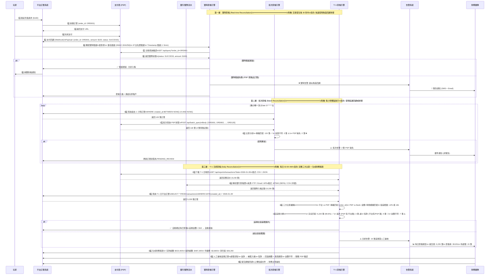

# 02-03 對帳中心系統 (Reconciliation System)

## 1. 系統概述
對帳是確保平台資金安全與數據準確性的最後一道防線。
本系統負責比對「平台內部帳 (Internal Ledger)」與「外部渠道帳 (External Statement)」，並生成財務報表。

## 2. 核心功能需求

### 2.1 三方對帳 (Three-Way Matching)
需比對以下三方數據：
1. **平台訂單 (Platform Orders)**：玩家存款/提款記錄。
2. **支付商報表 (PSP Reports)**：實際資金進出記錄。
3. **銀行/錢包實際流水 (Bank Statement)**：最終資金落地記錄 (若有)。

#### 2.1.1 三層對帳流程架構圖 (Three-Tier Reconciliation Architecture)

**概述**：對帳系統採用三層防禦架構，從實時驗證到日終批次處理，確保資金安全與數據一致性。



**三層對帳特性對比表**：

| 對帳層級 | 執行頻率 | 數據來源 | 比對方式 | 延遲時間 | 主要目的 | 自動化程度 |
|---------|---------|---------|---------|---------|---------|-----------|
| **第一層<br/>實時對帳** | 交易發生後 30 秒 | 平台 ↔ PSP API | 主動查詢驗證 | < 1 分鐘 | 防偽造回調攻擊 | 100% 自動 |
| **第二層<br/>批次對帳** | 每小時一次 | 平台 ↔ PSP API | 批次查詢比對 | 1 小時 | 發現延遲/掉單 | 95% 自動 (異常人工) |
| **第三層<br/>T+1 對帳** | 每日 02:00 AM | 平台 ↔ PSP ↔ Bank | 完整三方比對 | 1 天 | 財務報表 + 審計 | 80% 自動 (差異人工) |

**關鍵設計決策**：

1. **為何需要三層？**
   - **第一層（實時）**：防禦性驗證，阻斷攻擊於第一時間
   - **第二層（批次）**：彌補實時驗證的遺漏（如 PSP 回調延遲）
   - **第三層（日終）**：完整性保證，滿足財務合規要求

2. **容差範圍設計**：
   - **金額容差**：2% 或 $1（取較小值）
   - **時間容差**：10 分鐘（模糊匹配）
   - **自動通過閾值**：差異 < $10 且在容差內

3. **告警優先級**：
   - **P0 (緊急)**: 實時驗證失敗（疑似攻擊）→ SMS + Email
   - **P1 (高)**: 短款（平台有/PSP 無）→ Email + 凍結帳戶
   - **P2 (中)**: 批次異常 / 長款 → Email
   - **P3 (低)**: 金額小差異（< $10）→ 日報彙總

4. **性能優化**：
   - **實時對帳**: 異步執行，不阻塞主流程（30 秒超時）
   - **批次對帳**: 多執行緒並行查詢 PSP（線程池: 10 threads）
   - **T+1 對帳**: 分片處理大批量數據（每批 1000 筆）

---

### 2.2 差異處理 (Discrepancy Handling)
- **長款 (Over)**：外部有錢，平台無訂單 (可能是掉單或玩家誤轉)。-> 需人工補錄。
- **短款 (Short)**：平台有成功訂單，外部無錢 (極高風險，可能是虛假回調攻擊)。-> 需立即報警並凍結玩家帳號。
- **金額不符**：平台訂單 $100，實際入帳 $90 (可能是手續費扣除差異)。-> 需配置容差範圍。

### 2.3 日結流程 (Daily Closing)
- **自動化排程**：每日 02:00 自動下載前一日 PSP 報表 (CSV/API)。
- **自動比對**：系統自動進行 Key-Value 比對 (Order ID)。
- **生成日報**：包含 總存款、總提款、手續費、差異筆數、差異金額。

### 2.4 報表中心 (Report Center)
- **商戶報表**：各商戶每日盈虧 (PNL)、充提差。
- **渠道報表**：各支付渠道的成功率、手續費成本分析。

### 2.5 代理信用對帳 (Agent Settlement Reconciliation)
*   **針對信用網模式的核心對帳流程**。
*   **公式更新**:
    `Net Payable = (Total Win/Loss - Commission) + Adjustment (Late Settlement)`
*   **輸入數據**：
    1.  **System Report**: 系統生成的週結單 (Weekly Statement)。
    2.  **Manual Input / Bank Statement**: 財務收到的實際匯款憑證 (USDT TxID 或 銀行流水)。
*   **核銷邏輯 (Write-off Logic)**：
    *   財務人員在後台輸入 "實收金額"。
    *   系統自動比對 `Net Payable` vs `Actual Received`。
    *   若 **Match** (差異 < $10)：系統自動執行 `Credit Reset`，恢復代理額度。
    *   若 **Mismatch**：生成 `Outstanding Debt` 工單，代理額度維持凍結，直到補齊差額。


## 3. 對賬算法詳解

### 3.1 數據匹配邏輯

**匹配層級（按優先順序）**：
1. **精確匹配（Exact Match）**：
   - 條件：`Platform.order_id = PSP.merchant_order_id`
   - 狀態：✅ 自動標記為已對帳

2. **金額+時間匹配（Fuzzy Match）**：
   - 條件：`ABS(Platform.amount - PSP.amount) < $1 AND ABS(Platform.time - PSP.time) < 10 minutes`
   - 狀態：⚠️ 需人工審核確認

3. **未匹配（Unmatched）**：
   - 條件：在 PSP 報表中找不到對應記錄
   - 狀態：❌ 標記為差異，觸發警報

**SQL 實現範例**：

### 3.2 自動化對賬腳本

**每日對帳定時任務（Cron: 0 2 * * *）**：

---

## 4. 差異處理 SOP

### 4.1 長款處理流程（外部有錢，平台無訂單）

**Step 1: 驗證數據來源**
```
檢查 PSP 交易 ID → 查詢是否為測試交易
若是測試環境數據誤入生產 → 忽略
```

**Step 2: 查詢玩家帳戶**
```
根據 PSP 報表中的 player_email/phone 查找玩家
若找到玩家 → 檢查是否有相同金額的 Pending 訂單
```

**Step 3: 補單操作**

### 4.2 短款處理流程（平台有訂單，外部無錢）

**🚨 高風險警報**：可能是偽造回調攻擊！

**Step 1: 立即凍結**

**Step 2: 調查**
```
1. 檢查 PSP Callback 日誌（IP、時間戳、簽名）
2. 聯繫 PSP 客服確認是否收到款項
3. 若 PSP 確認未收款 → 回滾玩家餘額
```

**Step 3: 回滾操作**

### 4.3 金額不符處理（手續費差異）

**容差範圍配置**：

**處理邏輯**：

---

### 4.4 異常處理決策矩陣 (Discrepancy Handling Decision Matrix)

**概述**：本圖表整合所有對帳差異類型的檢測、分級與處理邏輯，提供統一的異常處理決策視圖。

```mermaid
flowchart TD
    START[對帳比對完成] --> ANALYZE{差異分析\n━━━━━━━━}

    ANALYZE -->|無差異| PERFECT_MATCH[✅ 完全匹配\norder_id 一致\namount 一致\nstatus 一致]
    PERFECT_MATCH --> AUTO_MARK[自動標記: RECONCILED\n更新 reconciliation_status]
    AUTO_MARK --> REPORT_OK[計入對帳成功統計]

    ANALYZE -->|有差異| CLASSIFY{差異類型分類}

    %% 差異類型 A: 長款 (Over)
    CLASSIFY -->|類型 A: 長款| OVER_PAYMENT[✓ 長款檢測\n━━━━━━━━━━━━\nPSP 有交易記錄\n平台無對應訂單]

    OVER_PAYMENT --> OVER_AMOUNT{金額檢查}
    OVER_AMOUNT -->|金額 < $10| OVER_SMALL[小額長款\n可能是測試交易]
    OVER_SMALL --> VERIFY_TEST{驗證測試環境?}
    VERIFY_TEST -->|是測試交易| IGNORE[忽略 + 標記 TEST\n不計入財務報表]
    VERIFY_TEST -->|非測試交易| OVER_SMALL_REAL[真實小額長款]

    OVER_AMOUNT -->|$10 ≤ 金額 < $1000| OVER_MEDIUM[中額長款\n需調查但非緊急]
    OVER_AMOUNT -->|金額 ≥ $1000| OVER_LARGE[大額長款\n高優先級調查]

    OVER_SMALL_REAL --> FIND_PLAYER{查詢玩家資訊}
    OVER_MEDIUM --> FIND_PLAYER
    OVER_LARGE --> FIND_PLAYER

    FIND_PLAYER -->|找到玩家| CHECK_PENDING{檢查 Pending 訂單?}
    CHECK_PENDING -->|有相同金額 Pending| LIKELY_DROPPED[✓ 疑似掉單\n時間窗口: ±30 分鐘\n金額匹配]
    CHECK_PENDING -->|無匹配訂單| MANUAL_CREDIT_NEEDED[需財務判斷是否補單]

    FIND_PLAYER -->|找不到玩家| UNKNOWN_SOURCE[來源不明\n可能是誤轉帳]

    LIKELY_DROPPED --> AUTO_CREDIT{自動補單條件檢查}
    AUTO_CREDIT -->|金額 < $100 且玩家可信| AUTO_SUPPLEMENT[✅ 自動補單\n創建 manual_order\n增加玩家餘額\n標記: AUTO_CREDITED]
    AUTO_CREDIT -->|金額 ≥ $100 或玩家風險| MANUAL_REVIEW_OVER[提交人工審核\n需佐證文件]

    MANUAL_CREDIT_NEEDED --> MANUAL_REVIEW_OVER
    UNKNOWN_SOURCE --> MANUAL_REVIEW_OVER

    MANUAL_REVIEW_OVER --> FINANCE_REVIEW_OVER[財務專員審核\n━━━━━━━━━━━━\n1️⃣ 聯繫 PSP 查詢來源\n2️⃣ 檢查玩家歷史記錄\n3️⃣ 上傳佐證文件]

    FINANCE_REVIEW_OVER --> APPROVAL_OVER{審批流程}
    APPROVAL_OVER -->|金額 < $1000| MANAGER_APPROVE_OVER[財務主管審批]
    APPROVAL_OVER -->|金額 ≥ $1000| CFO_APPROVE_OVER[CFO 審批]

    MANAGER_APPROVE_OVER -->|通過| EXECUTE_CREDIT[執行補單\nwallet_service.credit]
    CFO_APPROVE_OVER -->|通過| EXECUTE_CREDIT
    EXECUTE_CREDIT --> AUDIT_LOG_OVER[記錄審計日誌\n包含操作者、原因、佐證]

    MANAGER_APPROVE_OVER -->|拒絕| REJECT_OVER[拒絕補單\n標記: REJECTED\n原因: 無法確認來源]
    CFO_APPROVE_OVER -->|拒絕| REJECT_OVER

    %% 差異類型 B: 短款 (Short)
    CLASSIFY -->|類型 B: 短款| SHORT_PAYMENT[✓ 短款檢測\n━━━━━━━━━━━━\n平台有成功訂單\nPSP 無交易記錄]

    SHORT_PAYMENT --> CRITICAL_ALERT[🚨 嚴重告警\n━━━━━━━━━━━━\n可能是偽造回調攻擊\n立即觸發 P0 告警]

    CRITICAL_ALERT --> FREEZE_ACCOUNT[1️⃣ 凍結玩家帳戶\nUPDATE players SET status='frozen']
    FREEZE_ACCOUNT --> CHECK_CALLBACK{2️⃣ 檢查回調日誌}

    CHECK_CALLBACK --> CALLBACK_ANALYSIS[分析回調數據\n━━━━━━━━━━━━\n• IP 來源\n• 簽名驗證結果\n• Timestamp\n• Request Body]

    CALLBACK_ANALYSIS --> CONTACT_PSP[3️⃣ 緊急聯繫 PSP\nEmail + 電話\n查詢訂單真實狀態]

    CONTACT_PSP --> PSP_RESPONSE{PSP 回覆?}
    PSP_RESPONSE -->|確認未收款| CONFIRMED_FRAUD[✓ 確認欺詐\n偽造回調攻擊]
    PSP_RESPONSE -->|確認已收款| PSP_DATA_ISSUE[PSP 數據延遲\n需同步報表]
    PSP_RESPONSE -->|48h 無回應| TIMEOUT_ESCALATE[升級至高級管理層\nCTO + CFO 介入]

    CONFIRMED_FRAUD --> ROLLBACK_FRAUD[4️⃣ 執行回滾\nwallet_service.debit\n扣除已入帳金額]
    ROLLBACK_FRAUD --> RISK_ALERT_FRAUD[5️⃣ 觸發風控調查\nrisk_alert.create\nseverity: CRITICAL]
    RISK_ALERT_FRAUD --> POLICE_REPORT{金額 > $10,000?}
    POLICE_REPORT -->|是| REPORT_TO_POLICE[6️⃣ 報案處理\n準備法律文件]
    POLICE_REPORT -->|否| BAN_PLAYER[6️⃣ 永久封禁玩家\n加入黑名單]

    PSP_DATA_ISSUE --> WAIT_SYNC[等待 PSP 數據同步\n24-48 小時]
    WAIT_SYNC --> RECHECK[重新比對\n若仍短款 → 升級處理]

    %% 差異類型 C: 金額不符 (Amount Mismatch)
    CLASSIFY -->|類型 C: 金額不符| AMOUNT_DIFF[✓ 金額不符檢測\n━━━━━━━━━━━━\nplatform_amount ≠ psp_amount]

    AMOUNT_DIFF --> CALC_DIFF[計算差異\n━━━━━━━━━━━━\ndiff = |platform - psp|\ndiff_pct = diff / platform × 100%]

    CALC_DIFF --> TOLERANCE_CHECK{容差範圍檢查}

    TOLERANCE_CHECK -->|diff < $1 OR diff_pct < 2%| WITHIN_TOLERANCE[✓ 差異在容差內\n可能是匯率波動/手續費]
    WITHIN_TOLERANCE --> AUTO_APPROVE_AMOUNT[自動通過\n標記: AUTO_APPROVED\n記錄差異金額]
    AUTO_APPROVE_AMOUNT --> REPORT_APPROVED[計入財務報表\n註記: 手續費差異]

    TOLERANCE_CHECK -->|$1 ≤ diff < $10| SMALL_DIFF[小額差異\n需記錄但可自動調整]
    TOLERANCE_CHECK -->|$10 ≤ diff < $100| MEDIUM_DIFF[中額差異\n需人工審核]
    TOLERANCE_CHECK -->|diff ≥ $100| LARGE_DIFF[大額差異\n需詳細調查]

    SMALL_DIFF --> AUTO_ADJUST{自動調整規則}
    AUTO_ADJUST -->|平台多 (platform > psp)| ADJUST_DOWN[自動調減\nUPDATE amount = psp_amount\n記錄調整原因]
    AUTO_ADJUST -->|平台少 (platform < psp)| ADJUST_UP[自動調增\n補發差額給玩家]

    MEDIUM_DIFF --> MANUAL_REVIEW_AMOUNT[財務專員審核\n━━━━━━━━━━━━\n1️⃣ 對照 PSP 原始憑證\n2️⃣ 檢查匯率/手續費設定\n3️⃣ 聯繫 PSP 確認]
    LARGE_DIFF --> MANUAL_REVIEW_AMOUNT

    MANUAL_REVIEW_AMOUNT --> DETERMINE_CAUSE{確定原因}
    DETERMINE_CAUSE -->|手續費扣除| FEE_ADJUST[標記: 手續費差異\n調整財務科目\n不影響玩家餘額]
    DETERMINE_CAUSE -->|匯率換算| FOREX_ADJUST[標記: 匯率差異\n重新計算實際金額]
    DETERMINE_CAUSE -->|PSP 錯誤| PSP_ERROR[聯繫 PSP 修正\n等待對方調帳]
    DETERMINE_CAUSE -->|平台錯誤| PLATFORM_ERROR[內部系統錯誤\n需技術團隊修復]

    FEE_ADJUST --> APPROVAL_AMOUNT{審批流程}
    FOREX_ADJUST --> APPROVAL_AMOUNT
    PSP_ERROR --> APPROVAL_AMOUNT
    PLATFORM_ERROR --> APPROVAL_AMOUNT

    APPROVAL_AMOUNT -->|diff < $100| MANAGER_APPROVE_AMOUNT[財務主管審批]
    APPROVAL_AMOUNT -->|diff ≥ $100| CFO_APPROVE_AMOUNT[CFO 審批]

    MANAGER_APPROVE_AMOUNT -->|通過| EXECUTE_ADJUSTMENT[執行調帳\nmanual_adjustment.create\n上傳佐證文件]
    CFO_APPROVE_AMOUNT -->|通過| EXECUTE_ADJUSTMENT
    EXECUTE_ADJUSTMENT --> AUDIT_LOG_AMOUNT[記錄審計日誌\n包含調整金額、原因、審批人]

    %% 最終匯總
    REPORT_OK --> DAILY_SUMMARY[每日對帳彙總報告]
    REPORT_APPROVED --> DAILY_SUMMARY
    AUDIT_LOG_OVER --> DAILY_SUMMARY
    REJECT_OVER --> DAILY_SUMMARY
    BAN_PLAYER --> DAILY_SUMMARY
    REPORT_TO_POLICE --> DAILY_SUMMARY
    AUDIT_LOG_AMOUNT --> DAILY_SUMMARY
    IGNORE --> DAILY_SUMMARY

    DAILY_SUMMARY --> EMAIL_FINANCE[發送財務團隊\n━━━━━━━━━━━━\n• 總交易數: 5,235\n• 對帳成功: 5,220 (99.7%)\n• 長款待處理: 3 筆\n• 短款調查中: 2 筆\n• 金額差異: 10 筆]

    %% 樣式定義
    style PERFECT_MATCH fill:#C8E6C9
    style OVER_PAYMENT fill:#FFF9C4
    style SHORT_PAYMENT fill:#FFCDD2
    style AMOUNT_DIFF fill:#E1BEE7
    style CRITICAL_ALERT fill:#FF5252,color:#FFF
    style CONFIRMED_FRAUD fill:#D32F2F,color:#FFF
    style AUTO_APPROVE_AMOUNT fill:#C8E6C9
    style AUTO_SUPPLEMENT fill:#C8E6C9
    style FREEZE_ACCOUNT fill:#FF6B6B
    style ROLLBACK_FRAUD fill:#FF6B6B
    style REPORT_TO_POLICE fill:#B71C1C,color:#FFF
```

**異常處理分級矩陣表**：

| 差異類型 | 金額範圍 | 風險等級 | 處理時效 | 審批權限 | 自動化程度 | 典型原因 |
|---------|---------|---------|---------|---------|-----------|---------|
| **長款 (Over)** | < $10 | 🟢 LOW | 24 小時 | 財務專員 | 80% 自動 | 測試交易、掉單 |
| | $10-$1000 | 🟡 MEDIUM | 4 小時 | 財務主管 | 50% 自動 | 玩家誤轉、掉單 |
| | ≥ $1000 | 🟠 HIGH | 1 小時 | CFO | 0% (全人工) | 大額掉單、異常匯款 |
| **短款 (Short)** | 任意金額 | 🔴 CRITICAL | 立即 | CTO + CFO | 0% (全人工) | 偽造回調、欺詐攻擊 |
| **金額不符 (Mismatch)** | < $1 (容差內) | 🟢 LOW | 自動通過 | 系統自動 | 100% 自動 | 匯率波動、精度誤差 |
| | $1-$10 | 🟢 LOW | 24 小時 | 系統自動 | 100% 自動 | 手續費扣除、小額差異 |
| | $10-$100 | 🟡 MEDIUM | 4 小時 | 財務主管 | 0% (全人工) | 匯率錯誤、手續費設定錯 |
| | ≥ $100 | 🟠 HIGH | 1 小時 | CFO | 0% (全人工) | 系統錯誤、PSP 計算錯誤 |

**升級路徑矩陣**：

| 場景 | 初始處理人 | 升級條件 | 升級至 | 最終決策人 | SLA 時效 |
|------|-----------|---------|--------|-----------|---------|
| 小額長款 | 系統自動 | 金額 ≥ $100 | 財務專員 | 財務主管 | 24h |
| 中額長款 | 財務專員 | 金額 ≥ $1000 | 財務主管 | CFO | 4h |
| 大額長款 | 財務主管 | 金額 ≥ $10000 | CFO | Board | 1h |
| 短款 | 系統自動告警 | 立即升級 | CTO + CFO | Board | 立即 |
| 小額金額不符 | 系統自動 | 差異 ≥ $10 | 財務專員 | 財務主管 | 24h |
| 大額金額不符 | 財務專員 | 差異 ≥ $100 | 財務主管 | CFO | 4h |
| PSP 48h 無回應 | 財務專員 | 超時 | CTO | Legal Team | 72h |

**告警通知規則表**：

| 差異類型 | 告警等級 | 通知渠道 | 通知對象 | 通知頻率 | 持續告警條件 |
|---------|---------|---------|---------|---------|-------------|
| 短款 | 🔴 P0 | SMS + Email + Slack | CTO, CFO, Risk Team | 立即 + 每 30 分鐘 | 未處理 |
| 大額長款 (≥$10k) | 🟠 P1 | Email + Slack | CFO, Finance Manager | 立即 + 每 2 小時 | 未審批 |
| 中額長款 ($1k-$10k) | 🟡 P2 | Email | Finance Manager | 立即 + 每日彙總 | 24h 未處理 |
| 小額長款 (<$1k) | 🟢 P3 | Email | Finance Specialist | 每日彙總 | 不持續 |
| 大額金額不符 (≥$100) | 🟡 P2 | Email + Slack | Finance Manager | 立即 + 每 4 小時 | 未審批 |
| 小額金額不符 (<$100) | 🟢 P3 | Email | Finance Specialist | 每日彙總 | 不持續 |
| PSP API 故障 | 🟠 P1 | SMS + Slack | DevOps, Backend Team | 立即 + 每 15 分鐘 | 服務未恢復 |

**審計追溯要求**：


**合規要求清單**：

- ✅ 所有人工調帳必須經過雙重審批（提交者 ≠ 審批者）
- ✅ 調帳金額 ≥ $1000 必須上傳佐證文件（銀行截圖、PSP 郵件等）
- ✅ 短款事件必須在 24 小時內完成調查並出具報告
- ✅ 審計日誌必須保留 7 年（滿足稅務法規要求）
- ✅ 每月必須生成對帳報告提交給外部審計（若有）
- ✅ 差異處理 SOP 必須每年審查並更新（合規部門負責）

---

## 5. 銀行對賬文件解析

### 5.1 常見銀行報表格式

**中國銀行 CSV 範例**：
```csv
交易日期,交易時間,對方帳號,對方戶名,交易金額,幣種,交易類型,備註
2026-01-26,10:30:15,62170000012345,張三,1000.00,CNY,轉入,存款
2026-01-26,14:22:33,62170000067890,李四,5000.00,CNY,轉出,提款
```

**解析器實現**：

### 5.2 SEPA 銀行報表解析（歐洲）

**MT940 格式範例**：
```
:20:REFERENCE123
:25:NL12ABNA0123456789
:28C:00001/001
:60F:C260125EUR1000,00
:61:2601260126C500,00NTRF//TRANSACTION_REF
:86:/TRTP/SEPA CREDIT TRANSFER/NAME/John Doe/REMI/Deposit for player_12345
:62F:C260126EUR1500,00
```

**解析器（使用 mt940 庫）**：

---

## 6. 對賬報表模板

### 6.1 每日對賬報表

**Excel 輸出範例**：

### 6.2 月度財務報表

**報表維度**：
1. **按商戶分組**：各商戶的總存款、總提款、淨充值
2. **按支付渠道分組**：各PSP的交易量、成功率、手續費成本
3. **按幣種分組**：USD、EUR、CNY等各幣種的資金流動

**SQL 查詢範例**：

---

## 7. 審批與權限

### 7.1 人工調帳（Manual Adjustment）

**操作流程**：
1. 財務人員發現差異，提交調帳申請
2. 填寫調帳原因（必填，至少 20 字）
3. 上傳佐證文件（如銀行截圖、PSP 郵件回覆）
4. **強制審批**：調帳金額 > $0，必須經由財務主管審核通過（引用 09-04 審批工作流系統）

**資料表設計**：

### 7.2 權限控制（RBAC）

**角色權限矩陣**（引用 09-01 RBAC）：
| 操作 | 財務專員 | 財務主管 | CTO | 超級管理員 |
|------|---------|---------|-----|-----------|
| 查看對帳報表 | ✅ | ✅ | ✅ | ✅ |
| 提交調帳申請 | ✅ | ✅ | ❌ | ✅ |
| 審批調帳（< $1000）| ❌ | ✅ | ✅ | ✅ |
| 審批調帳（≥ $1000）| ❌ | ❌ | ✅ | ✅ |
| 修改對帳規則 | ❌ | ❌ | ✅ | ✅ |

---

## 📚 相關文檔

### 業務邏輯參考
- [02-02 支付網關集成](./02-02_Payment_Gateway_Integration.md) - PSP 交易數據來源
- [02-04 流水計算與對賬](./02-04_Turnover_and_Game_Reconciliation_Analysis.md) - 遊戲對帳流程
- [02-06 統一錢包模型](./02-06_Unified_Wallet_Model.md) - 餘額調整邏輯

### 技術架構參考
- [09-02 審計日誌系統](../09_System_Security/09-02_Audit_Log_System.md) - 調帳操作審計
- [09-04 審批工作流系統](../09_System_Security/09-04_Approval_Workflow_System.md) - 調帳審批工作流
- [09-01 管理後台RBAC](../09_System_Security/09-01_Admin_RBAC.md) - 對帳系統權限控制
- [12-05 API 設計標準](../12_Technical_Operations/12-05_API_Design_Standard.md) - PSP API 規範

---

**文檔版本**: 1.1.0
**最後更新**: 2026-01-27
**維護團隊**: Finance Team & Backend Team
