# IGaming 流水計算流程圖與時序圖

> **文檔目標**: 可視化展示 IGaming 平台流水計算的完整流程，包含三層驗證架構的詳細交互。
>
> **重要更新 (v2.0.0 - 2026-01-28)**:
> - ✅ 修正 Layer 2 邏輯: 移除 status_factor 動態修改 valid_bet 的錯誤設計
> - ✅ 採用「標準本金法」: valid_bet = bet_amount (不論結算狀態)
> - ✅ 增加風控標記機制: risk_status, filter_reason, risk_rules_applied
> - ✅ 增加審計追溯支持: calculation_version, 回推重算機制
> - ✅ 術語標準化: 統一使用 Bet Amount, Valid Bet, Wagering Requirement
>
> **創建日期**: 2026-01-27
> **最後更新**: 2026-01-28
> **版本**: 2.0.0
>
> **參考文檔**:
> - [00-03 術語標準化定義](../../00_Concept_&_Analysis/00-03_Terminology_Standards.md) - **必讀**
> - [05-01 風控系統](IGaming需求框架/05_Risk_Management/05-01_Risk_Control_System.md)
> - [02-04 流水與對帳](IGaming需求框架/02_Finance_Center/02-04_Turnover_and_Game_Reconciliation_Analysis.md)
> - [04-01 活動系統](IGaming需求框架/04_Activity_Center/04-01_Activity_System_Design.md)

---

## 📊 目錄

1. [架構概覽圖](#1-架構概覽圖)
2. [完整時序圖](#2-完整時序圖)
3. [詳細流程圖](#3-詳細流程圖)
4. [Layer 1: 風控驗證流程](#4-layer-1-風控驗證流程)
5. [Layer 2: 財務驗證流程](#5-layer-2-財務驗證流程)
6. [Layer 3: 活動驗證流程](#6-layer-3-活動驗證流程)
7. [注單狀態機](#7-注單狀態機)
8. [實際計算範例](#8-實際計算範例)

---

## 1. 架構概覽圖

### 1.1 三層驗證架構 (Three-Layer Validation Architecture)

> **圖表複雜度**: 24 個節點（已使用 subgraph 分組優化）
> **閱讀建議**: 按數據流順序閱讀（玩家投注 → Layer 1 → Layer 2 → Layer 3 → 應用場景）
> **關鍵要點**:
> - Layer 1 風控驗證決定 valid_bet
> - Layer 2 僅記錄狀態，不修改 valid_bet
> - Layer 3 應用遊戲權重計算活動貢獻

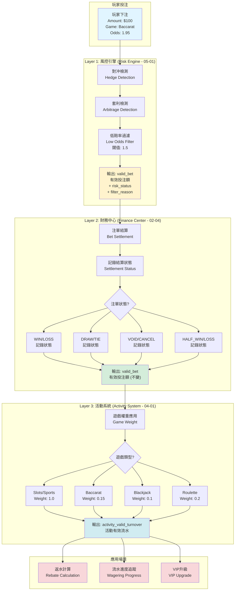

---

## 2. 完整時序圖

### 2.1 流水計算完整時序 (End-to-End Turnover Calculation Sequence)

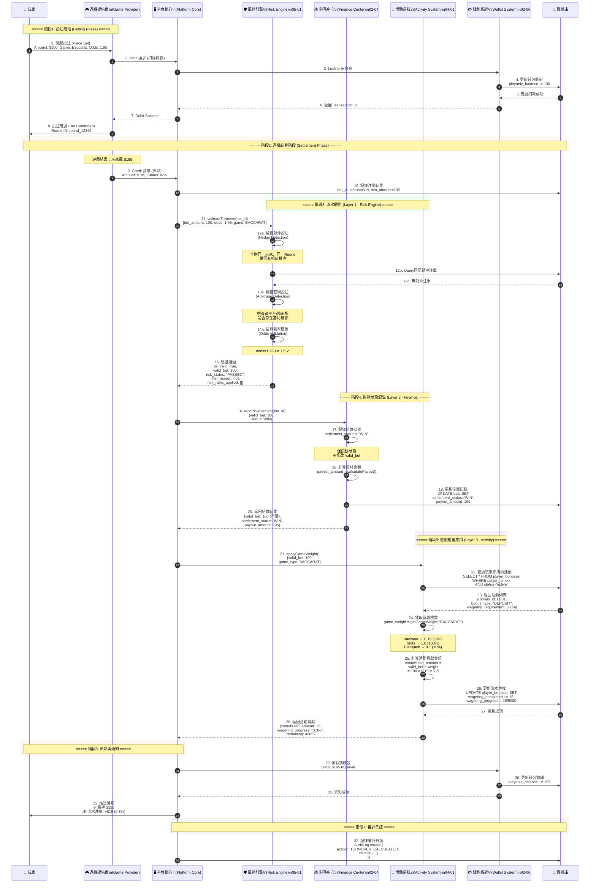

---

## 3. 詳細流程圖

### 3.1 流水計算主流程 (Main Turnover Calculation Flow)

> **圖表複雜度**: 26 個節點（已使用 subgraph 分組優化）
> **閱讀建議**: 按照三層架構順序閱讀（Input → Layer 1 → Layer 2 → Layer 3 → Update）
> **關鍵決策點**:
> - Layer 1: 是否對沖/套利/低賠率 → 決定 valid_bet 是否為 0
> - Layer 2: 注單狀態分支（WIN/LOSS/DRAW/VOID/HALF）→ 僅記錄狀態
> - Layer 3: 遊戲類型分支（Slots/Baccarat/Blackjack/Roulette）→ 應用對應權重
> - Update: 流水是否達標 → 決定是否解鎖提款

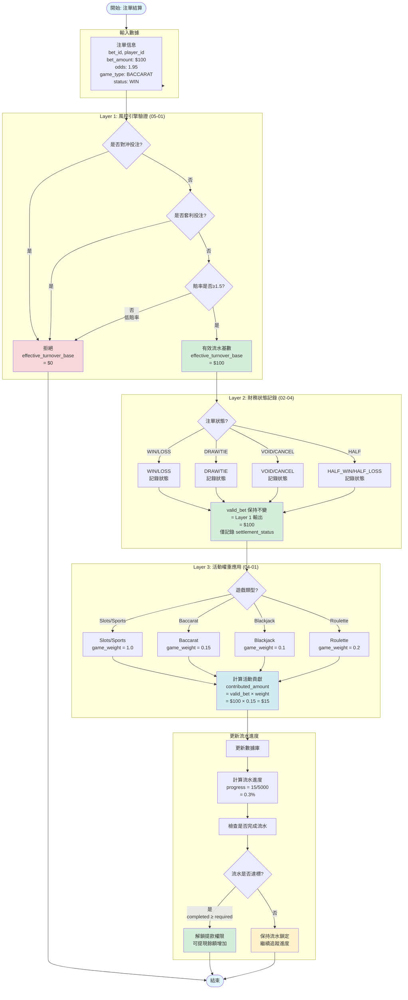

---

## 4. Layer 1: 風控驗證流程

### 4.1 對沖檢測流程 (Hedge Detection Flow)

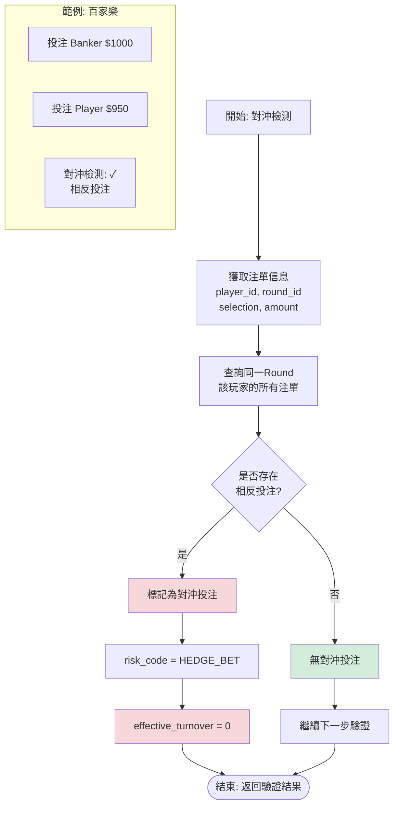

### 4.2 賠率閾值檢測 (Odds Threshold Check)

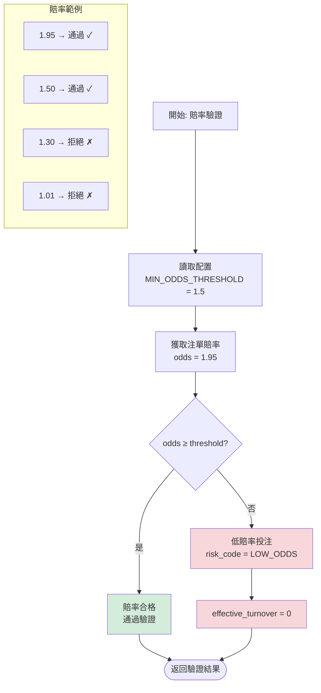

---

## 5. Layer 2: 財務狀態記錄流程

### 5.1 結算狀態記錄流程 (Settlement Status Recording)

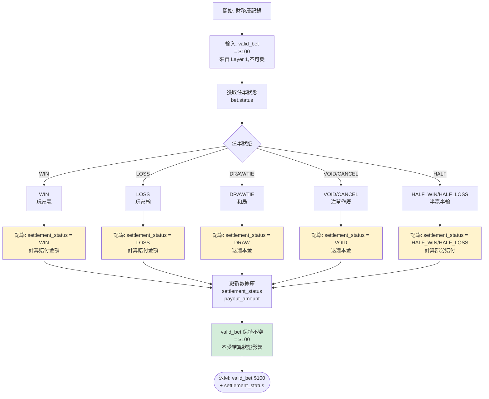

### 5.2 結算狀態與 Valid Bet 關係對照表

> **重要原則**: Valid Bet 由 Layer 1 風控引擎一次性判定,Layer 2 僅記錄結算狀態,**不修改** Valid Bet 值。

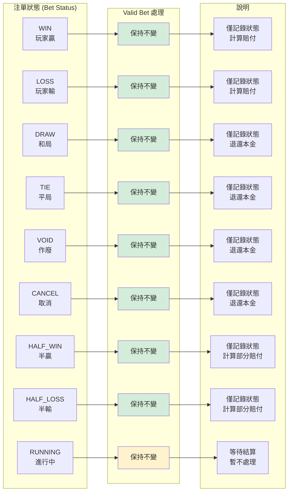

---

## 6. Layer 3: 活動驗證流程

### 6.1 遊戲權重應用流程 (Game Weight Application)

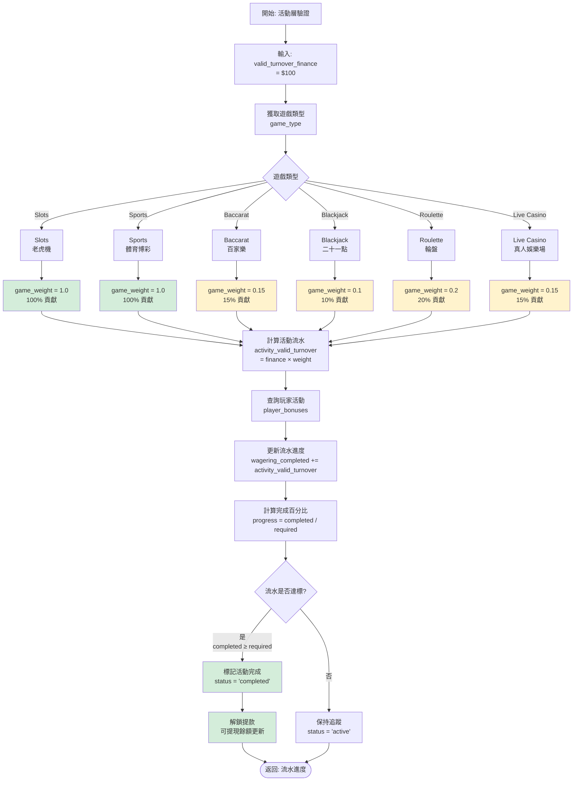

### 6.2 遊戲權重配置表

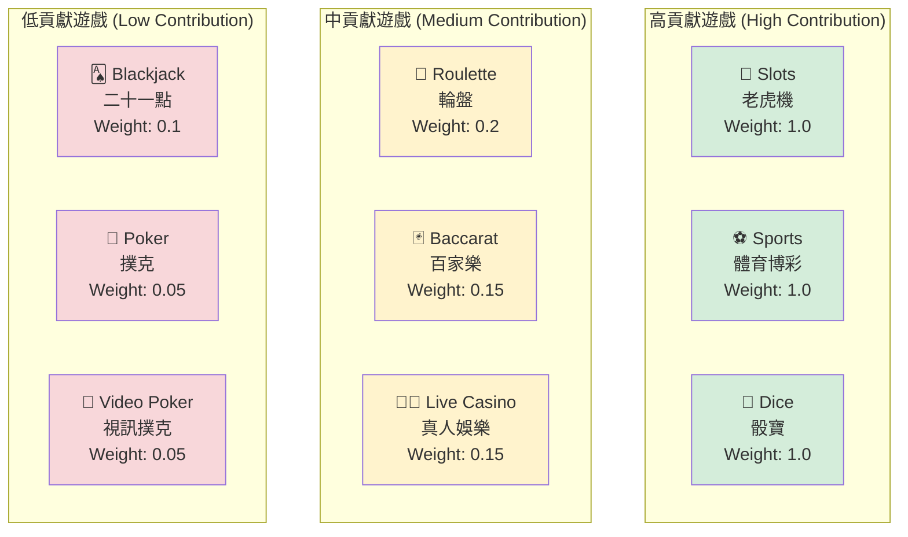

---

## 7. 注單狀態機

### 7.1 注單生命週期 (Bet Lifecycle State Machine)

```mermaid
%%{init: {
  "theme": "base",
  "themeVariables": {
    "primaryColor": "#2d2d2d",
    "primaryTextColor": "#fff",
    "primaryBorderColor": "#00d4ff",
    "lineColor": "#00ff00",
    "secondaryColor": "#006100",
    "tertiaryColor": "#fff",
    "darkMode": true,
    "background": "#1e1e1e"
  }
}}%%

stateDiagram-v2
    direction TB

    %% 狀態定義：使用別名 (Alias) %%
    state "Pending (待處理)" as S_Pending
    state "Running (進行中)" as S_Running
    state "Settlement (結算中心)" as S_Settlement
    state "Turnover Calc (流水計算)" as S_Turnover

    %% 1. 初始階段
    [*] --> S_Pending : 玩家下注\n(扣除餘額)

    %% 修復點：將筆記移到 state 定義之外，並明確指向 S_Pending
    note right of S_Pending : Status: PENDING\nTurnover: 0\nReason: 等待GP確認

    S_Pending --> S_Running : GP確認接受\n(遊戲開始)

    %% 2. 進行階段
    note right of S_Running : Status: RUNNING\nTurnover: 0\nReason: 賽果未出

    S_Running --> S_Settlement : 接收賽果

    %% 3. 結算複合狀態
    state S_Settlement {
        direction TB
        state "WIN (贏)" as Res_Win
        state "LOSS (輸)" as Res_Loss
        state "DRAW (和)" as Res_Draw
        state "VOID (作廢)" as Res_Void
        state "CANCEL (取消)" as Res_Cancel

        [*] --> Res_Win
        [*] --> Res_Loss
        [*] --> Res_Draw
        [*] --> Res_Void
        [*] --> Res_Cancel
        
        %% 內部狀態的筆記
        note right of Res_Win : 賠付因子 > 1.0\n流水 100%
        note right of Res_Draw : 賠付因子 1.0\n流水 0%
    }

    %% 4. 資金流向與流水計算
    S_Settlement --> Paid : WIN (派彩)
    S_Settlement --> Completed : LOSS (結算)
    S_Settlement --> Refunded : DRAW/VOID (退款)

    state S_Turnover {
        state "Valid Turnover (有效流水)" as TO_Yes
        state "Ignored Turnover (無效流水)" as TO_No
        
        Paid --> TO_Yes : 贏單計入
        Completed --> TO_Yes : 輸單計入
        Refunded --> TO_No : 退款不計
    }

    TO_Yes --> [*]
    TO_No --> [*]
```

---

## 8. 實際計算範例

### 8.1 範例1: 百家樂投注 (Baccarat Bet)

**場景**: 玩家參與「首存100%紅利」活動，需完成 5x 流水要求 (Wagering Requirement)。

**投注詳情**:
- **存款金額**: $1,000
- **紅利金額**: $1,000 (100% Match)
- **流水要求**: ($1,000 + $1,000) × 5 = **$10,000**
- **當前投注**: 百家樂投注 $100，賠率 1.95，結果 WIN

**計算流程**:

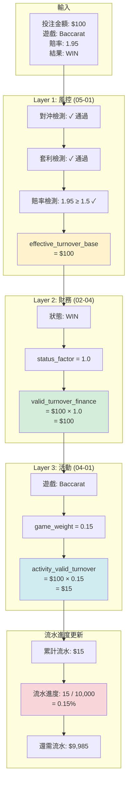

**結論**:
- ✅ 風控驗證通過
- ✅ 財務流水: $100
- ⚠️ 活動流水: $15 (僅15%貢獻)
- ⚠️ 需要更多投注才能完成流水要求

---

### 8.2 範例2: 老虎機投注 (Slots Bet)

**場景**: 同一玩家改玩老虎機，期望更快完成流水。

**投注詳情**:
- **當前流水進度**: $15 / $10,000 (0.15%)
- **當前投注**: 老虎機投注 $100，結果 LOSS

**計算流程**:

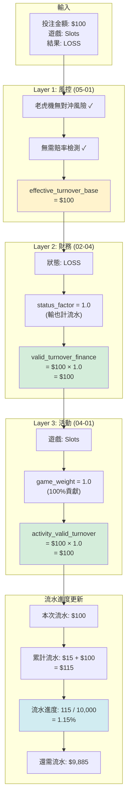

**對比分析**:

| 維度 | 百家樂 (Baccarat) | 老虎機 (Slots) |
|------|------------------|---------------|
| 投注金額 | $100 | $100 |
| 風控驗證 | 需檢查對沖/賠率 | 簡化驗證 |
| 財務流水 | $100 | $100 |
| 遊戲權重 | 0.15 (15%) | 1.0 (100%) |
| **活動流水** | **$15** | **$100** |
| 流水效率 | 低 (6.67倍投注才完成) | 高 (1倍投注完成) |

**結論**:
- ✅ 老虎機流水貢獻率高 (100%)
- ✅ 適合快速完成流水要求
- ⚠️ 但老虎機 RTP 較高，玩家期望值更好

---

### 8.3 範例3: 對沖投注被拒 (Hedge Bet Rejected)

**場景**: 玩家嘗試在同一局百家樂同時投注 Banker 和 Player。

**投注詳情**:
- **投注1**: Banker $1,000 (賠率 1.95)
- **投注2**: Player $950 (賠率 2.00)
- **遊戲結果**: Banker 贏

**計算流程**:

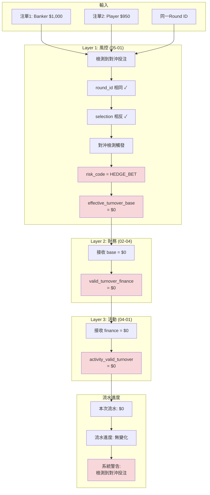


**結論**:
- ❌ 對沖投注被風控拒絕
- ❌ 兩筆投注流水均為 $0
- ⚠️ 可能觸發風控標籤 (Risk Tag: HEDGE_BETTOR)

---

## 9. Layer 2 不修改 Valid Bet 的設計原則

### 9.1 核心原則

> **關鍵設計決策**: Layer 2 (財務中心) 僅記錄結算狀態,**不修改** Layer 1 (風控引擎) 確定的 Valid Bet 值。

### 9.2 為什麼財務層不應該修改 Valid Bet?

#### 9.2.1 違反「風控完全獨立」原則

**問題**:
- 如果 Layer 1 已經確定了 valid_bet,為何 Layer 2 還要根據結算狀態動態修改?
- 這意味著風控判定並非最終決策,存在邏輯矛盾

**正確做法**:
```
Layer 1 (風控引擎): 一次性判定 valid_bet
  ├─ 通過 → valid_bet = bet_amount, risk_status = "PASSED"
  └─ 拒絕 → valid_bet = 0, risk_status = "FILTERED", reason = "對沖投注"

Layer 2 (財務中心): 僅記錄結算狀態,不修改 valid_bet
  ├─ settlement_status = "WIN/LOSS/HALF_WIN/HALF_LOSS/DRAW"
  └─ payout_amount = calculatePayout(bet, status)
```

#### 9.2.2 違反公平性原則 (Error #3 - 實際風險法)

**問題場景**:
```
兩位玩家都投注 100 元在體育博彩「讓 -0.25」:
- 玩家 A 的比賽結果: 全贏 → valid_bet = 100 元 ✓
- 玩家 B 的比賽結果: 平局(輸半) → valid_bet = 50 元 ❌ (錯誤)

矛盾:
- 相同的投注行為
- 相同的風險暴露 (100 元)
- 但 valid_bet 不同 → 違反公平性原則
```

**正確做法 (標準本金法 - 業界標準)**:
```
玩家 A: 投注 100 元 → 全贏 → valid_bet = 100 元
玩家 B: 投注 100 元 → 輸半 → valid_bet = 100 元 (不是 50!)

理由:
- 玩家下注時承擔的風險都是 100 元
- Valid Bet 應該反映投注行為,而非結算結果
- 簡化計算,不需要等結算才知道 valid_bet
```

#### 9.2.3 業界標準對照

| 營運商 | Valid Bet 計算方法 | 結算狀態影響 | 說明 |
|-------|------------------|------------|------|
| **Pinnacle** | 標準本金法 | 無影響 | Valid Bet = 投注本金 |
| **Betfair** | 標準本金法 | 無影響 | 不論輸贏,全額計入 |
| **Pragmatic Play** | 標準本金法 | 無影響 | 業界遊戲提供商標準 |
| **Evolution Gaming** | 標準本金法 | 無影響 | 真人娛樂業界標準 |
| **❌ 實際風險法** | 動態調整 | 受影響 | 已廢棄,違反公平性 |

### 9.3 Settlement Status 與 Valid Bet 的分離

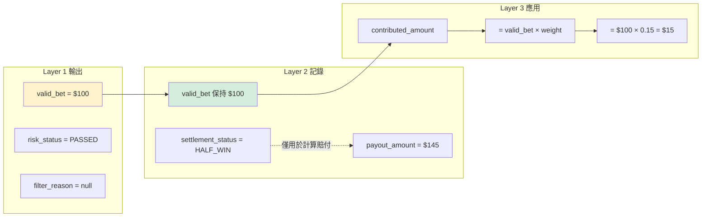

### 9.4 實施建議


---

## 10. 風控標記機制

### 10.1 為什麼需要風控標記?

**問題**:
- 當前設計僅記錄最終的 valid_bet 值
- 缺失: 沒有記錄「為什麼」流水是這個值
- **影響**: 無法審計追溯、無法回推重算

**解決方案**:
增加四個風控標記字段:
1. `risk_status`: 風控檢查結果 (PASSED/FILTERED/PENDING)
2. `filter_reason`: 過濾原因文字說明
3. `risk_rules_applied`: 應用的風控規則 (JSON數組)
4. `calculation_version`: 計算規則版本號

### 10.2 風控標記字段定義

#### 10.2.1 risk_status (風控狀態)

| 狀態 | 說明 | valid_bet | 使用場景 |
|------|------|-----------|---------|
| **PASSED** | 風控檢查通過 | = bet_amount | 正常投注 |
| **FILTERED** | 風控過濾拒絕 | = 0 | 對沖、套利、低賠率 |
| **PENDING** | 等待人工審核 | = 0 (暫不計入) | 可疑交易、高額投注 |

#### 10.2.2 filter_reason (過濾原因)

| risk_status | filter_reason 範例 | 說明 |
|-------------|------------------|------|
| PASSED | null | 無過濾 |
| FILTERED | "對沖投注: 同時投注 Banker/Player" | 具體原因 |
| FILTERED | "低賠率投注: odds=1.30 < 閾值 1.50" | 具體原因 |
| FILTERED | "套利投注: 跨平台賠率差異 > 5%" | 具體原因 |
| PENDING | "高額投注需人工審核: 金額 > $10,000" | 等待審核 |

#### 10.2.3 risk_rules_applied (應用的規則)

**JSON 格式範例**:
```json
{
  "risk_rules_applied": [
    {
      "rule_id": "HEDGE_001",
      "rule_name": "百家樂對沖檢測",
      "action": "FILTER",
      "confidence": 0.95
    },
    {
      "rule_id": "ODDS_001",
      "rule_name": "賠率閾值檢查",
      "action": "PASS",
      "threshold": 1.5,
      "actual_odds": 1.95
    }
  ]
}
```

#### 10.2.4 calculation_version (計算版本)

**用途**: 支持規則調整後的回推重算

| 版本 | 變更內容 | 生效日期 |
|------|---------|---------|
| v1.0.0 | 初始版本,使用實際風險法 | 2026-01-01 |
| v1.1.0 | 修正為標準本金法 | 2026-01-28 |
| v1.2.0 | 調整賠率閾值 1.3 → 1.5 | 2026-02-01 |

### 10.3 審計追溯示例

**查詢: 為什麼這筆投注 valid_bet = 0?**


**結果**:
```
bet_id: BET_12345
bet_amount: 100.00
valid_bet: 0.00
risk_status: FILTERED
filter_reason: "對沖投注: 同時投注 Banker (1000元) 和 Player (950元)"
risk_rules_applied: [{"rule_id": "HEDGE_001", "action": "FILTER"}]
```

**結論**: 該投注被風控系統識別為對沖投注,因此 valid_bet = 0。

### 10.4 回推重算支持

**場景**: 風控規則調整後,需要重新計算歷史數據


---

## 11. 總結

### 11.1 核心設計原則

1. **三層驗證架構** (Three-Layer Architecture)
   - Layer 1 (風控引擎): 一次性判定 valid_bet,標記 risk_status
   - Layer 2 (財務中心): 僅記錄結算狀態,**不修改** valid_bet
   - Layer 3 (活動系統): 應用遊戲權重,計算活動貢獻

2. **風控完全獨立原則**
   - Layer 1 確定 valid_bet 後,後續層級不再修改
   - 採用「標準本金法」: valid_bet = bet_amount (不論結果)
   - 結算狀態僅用於計算賠付金額,與流水計算分離

3. **關注點分離** (Separation of Concerns)
   - 風控關注: 對沖、套利、賠率過濾
   - 財務關注: 結算狀態、賠付金額計算
   - 活動關注: 遊戲權重應用

4. **審計追溯支持**
   - 記錄原始數據 + 計算結果 + 版本號
   - 提供回推重算接口
   - 完整的風控標記 (risk_status, filter_reason)

### 11.2 關鍵術語定義

> **術語標準化**: 見 [術語標準化定義](../../00_Concept_&_Analysis/00-03_Terminology_Standards.md)

| 中文 | 英文 | 定義 | 單位 | 用途 |
|------|------|------|------|------|
| **投注額** | Bet Amount | 單筆原始投注金額 | 單筆 | API 交互、資金扣除 |
| **流水** | Turnover | 投注額的時間累積總和 | 累積 | GGR 計算、財務報表 |
| **有效投注額** | Valid Bet | 經風控過濾的單筆金額 | 單筆 | 流水要求、返水、VIP |
| **流水要求** | Wagering Requirement | 必須達成的有效投注總額 | 累積 | 活動驗證、取款限制 |

### 11.3 數據流關鍵指標

| 階段 | 指標 | 計算公式 | 說明 |
|------|------|---------|------|
| **Layer 1 輸出** | valid_bet | 風控判定 (bet_amount or 0) | 一次性確定,不可變 |
| **Layer 2 記錄** | settlement_status | 記錄結算狀態 | 不影響 valid_bet |
| **Layer 3 輸出** | contributed_amount | valid_bet × game_weight | 活動貢獻金額 |
| **進度追蹤** | wagering_progress | Σ contributed / requirement × 100% | 流水完成百分比 |

### 11.4 常見問題 (FAQ)

**Q1: 為什麼 DRAW/TIE 不計流水?**
- A: 和局時玩家本金返還,無實際風險,因此不計入流水要求。

**Q2: 為什麼百家樂權重只有15%?**
- A: 百家樂 RTP 高 (98.94%),平台風險低,為防止流水濫用,降低權重。

**Q3: 對沖投注如何檢測?**
- A: 系統檢查同一玩家在同一局遊戲中是否有相反投注 (如同時投注 Banker/Player)。

**Q4: 流水計算是實時的嗎?**
- A: 是的,每筆注單結算後立即計算流水並更新進度。

---

## 📚 相關文檔

### 核心參考
- [05-01 風控系統](IGaming需求框架/05_Risk_Management/05-01_Risk_Control_System.md) - Layer 1 基礎驗證
- [02-04 流水與對帳](IGaming需求框架/02_Finance_Center/02-04_Turnover_and_Game_Reconciliation_Analysis.md) - Layer 2 狀態因子
- [04-01 活動系統](IGaming需求框架/04_Activity_Center/04-01_Activity_System_Design.md) - Layer 3 遊戲權重

### 相關系統
- [02-06 統一錢包](IGaming需求框架/02_Finance_Center/02-06_Unified_Wallet_Model.md) - 流水鎖定機制
- [03-01 遊戲整合](IGaming需求框架/03_Game_Center/03-01_Game_Integration_Standard.md) - 注單結算流程

---

**文檔版本**: 1.0.0
**創建日期**: 2026-01-27
**維護團隊**: Product Team & Tech Architecture Team
