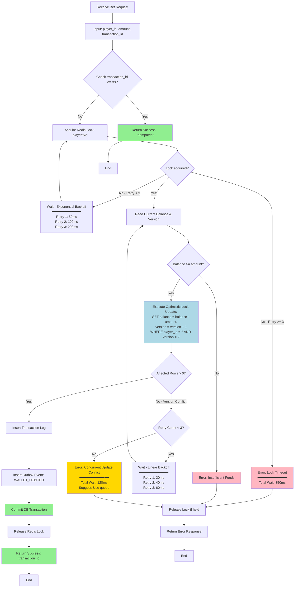

# 02-07 交易處理流程與鎖機制 (Transaction Processing Flow & Locking Strategy)

## 1. 系統概述 (System Overview)

在統一錢包 (Unified Wallet) 架構下，單筆交易可能同時涉及 **Cash (資產)** 扣除與 **Credit (負債)** 增加。
本模組定義了在高併發 (High Concurrency) 場景下，如何保證 **交易原子性 (Atomicity)** 與 **數據一致性 (Consistency)**，防止「扣了錢卻沒增加額度」或「超額透支」的情況發生。

---

## 2. 併發控制策略 (Concurrency Control)

### 2.1 樂觀鎖 (Optimistic Locking)
適用於絕大多數的 **Wallet Balance Update** 場景。

*   **機制**：在 `player_wallet` 表中增加 `version` 欄位。
*   **SQL 範例**：
*   **重試機制**：若 `Affected Rows = 0` (表示餘額不足或版本號過期)，Service 層應進行 **Backoff Retry** (最多 3 次)。

#### 2.1.1 樂觀鎖併發處理流程圖

以下流程圖展示了樂觀鎖在高併發場景下的完整處理邏輯，包括冪等性檢查、餘額驗證、版本衝突重試機制：



**關鍵路徑說明**:
- 🟢 **成功路徑**: 冪等性檢查 → 鎖獲取 → 餘額驗證 → 樂觀鎖更新 → 提交事務
- 🔴 **失敗路徑**: 餘額不足、鎖超時、版本衝突超過重試次數
- 🟡 **重試路徑**: 版本衝突時採用指數退避重試（最多 3 次）
- 🔒 **鎖保護**: Redis 分散式鎖防止同一玩家的並發請求競爭

### 2.2 悲觀鎖 (Pessimistic Locking)
僅用於 **"結算歸零 (Settlement Reset)"** 或 **"強制平倉 (Liquidation)"** 等高風險管理操作。

*   **機制**：使用 `SELECT ... FOR UPDATE` 鎖定該行記錄。
*   **注意**：務必依序鎖定 (如按 `player_id` 排序)，避免 Deadlock。

---

## 3. 混合支付原子性設計 (Hybrid Payment Atomicity)

當一筆 $100 的下注需要由 $20 Bonus + $30 Cash + $50 Credit 組成時，交易流程如下：

### 3.1 兩階段提交 (2PC / TCC) - 微服務內部
若 Wallet Service 是單體或模組化單體，可透過 DB Transaction 解決。但若跨服務 (如 Game Service -> Wallet Service)，建議採用 **TCC (Try-Confirm-Cancel)** 模式。

#### Phase 1: Try (預扣)
*   檢查 Bonus >= 20, Cash >= 30, (Limit - Outstanding) >= 50。
*   **Action**: 凍結資源 (Frozen Balance)。
    *   `Frozen_Bonus += 20`
    *   `Frozen_Cash += 30`
    *   `Frozen_Credit += 50`

#### Phase 2: Confirm (實扣)
*   遊戲回合確認成立。
*   **Action**: 
    *   `Bonus -= 20`, `Frozen_Bonus -= 20`
    *   `Cash -= 30`, `Frozen_Cash -= 30`
    *   `Outstanding += 50`, `Frozen_Credit -= 50`
    *   寫入 `Transaction Log`。

#### Phase 3: Cancel (回滾)
*   若遊戲回合失敗或 Timeout。
*   **Action**: 釋放凍結資源。

#### 3.1.1 TCC 完整時序圖 (Try-Confirm-Cancel Flow)

以下時序圖展示了跨服務場景下的 TCC 事務處理流程，包括正常確認路徑與異常回滾路徑：

```mermaid
sequenceDiagram
    participant Player
    participant GameService
    participant WalletService
    participant PlayerWallet
    participant TransactionLog
    participant OutboxPublisher
    participant Kafka

    Note over Player,Kafka: TCC Phase 1: Try (預扣凍結資源)

    Player->>GameService: POST /game/bet {amount: 100, bonus: 20, cash: 30, credit: 50}
    GameService->>GameService: Generate transaction_id: UUID

    GameService->>WalletService: tryTransaction(transaction_id, player_id, breakdown)
    WalletService->>PlayerWallet: BEGIN TRANSACTION

    WalletService->>PlayerWallet: SELECT balance, bonus, outstanding, credit_limit<br/>WHERE player_id = ? FOR UPDATE
    PlayerWallet-->>WalletService: {bonus: 50, cash: 100, outstanding: 200, limit: 1000}

    WalletService->>WalletService: Validate:<br/>✓ bonus(50) >= 20<br/>✓ cash(100) >= 30<br/>✓ (limit-outstanding) >= 50

    WalletService->>PlayerWallet: UPDATE player_wallet SET<br/>frozen_bonus = frozen_bonus + 20,<br/>frozen_cash = frozen_cash + 30,<br/>frozen_credit = frozen_credit + 50,<br/>version = version + 1

    WalletService->>TransactionLog: INSERT tcc_transaction (id, status, phase, expires_at)<br/>VALUES (transaction_id, 'PENDING', 'TRY', NOW() + 5min)

    WalletService->>PlayerWallet: COMMIT
    WalletService-->>GameService: {status: TRY_SUCCESS, try_token: transaction_id}

    GameService->>GameService: Start game round (async)
    GameService-->>Player: 200 OK {round_id, try_token}

    Note over Player,Kafka: TCC Phase 2: Confirm (實際扣款) - Happy Path

    GameService->>GameService: Game round completed<br/>(Player loses: amount=100)

    GameService->>WalletService: confirmTransaction(try_token, round_result)
    WalletService->>PlayerWallet: BEGIN TRANSACTION

    WalletService->>TransactionLog: SELECT status FROM tcc_transaction<br/>WHERE id = try_token FOR UPDATE
    TransactionLog-->>WalletService: {status: 'PENDING'}

    alt Status = PENDING (Normal Path)
        WalletService->>PlayerWallet: UPDATE player_wallet SET<br/>bonus = bonus - 20,<br/>frozen_bonus = frozen_bonus - 20,<br/>cash = cash - 30,<br/>frozen_cash = frozen_cash - 30,<br/>outstanding = outstanding + 50,<br/>frozen_credit = frozen_credit - 50,<br/>version = version + 1

        WalletService->>TransactionLog: UPDATE tcc_transaction SET<br/>status = 'CONFIRMED',<br/>confirmed_at = NOW()

        WalletService->>TransactionLog: INSERT wallet_transaction<br/>(player_id, type, amount, balance_after, ref_id)<br/>VALUES (?, 'BET', -100, new_balance, try_token)

        WalletService->>OutboxPublisher: INSERT outbox_event<br/>(aggregate_id, type, payload, status)<br/>VALUES (player_id, 'WALLET_DEBITED', {amount: 100}, 'PENDING')

        WalletService->>PlayerWallet: COMMIT
        WalletService-->>GameService: {status: CONFIRMED}

        OutboxPublisher->>Kafka: Async: Publish WALLET_DEBITED event
        Kafka-->>OutboxPublisher: ACK
        OutboxPublisher->>OutboxPublisher: UPDATE outbox_event SET status='SENT'

    else Status = CONFIRMED (Idempotent)
        WalletService-->>GameService: {status: ALREADY_CONFIRMED}
    end

    GameService-->>Player: Game result: -$100

    Note over Player,Kafka: TCC Phase 3: Cancel (異常回滾) - Exception Path

    alt Timeout or Game Round Failed
        GameService->>WalletService: cancelTransaction(try_token, reason)
        WalletService->>PlayerWallet: BEGIN TRANSACTION

        WalletService->>TransactionLog: SELECT status FROM tcc_transaction<br/>WHERE id = try_token FOR UPDATE
        TransactionLog-->>WalletService: {status: 'PENDING'}

        WalletService->>PlayerWallet: UPDATE player_wallet SET<br/>frozen_bonus = frozen_bonus - 20,<br/>frozen_cash = frozen_cash - 30,<br/>frozen_credit = frozen_credit - 50,<br/>version = version + 1<br/>(Release frozen resources)

        WalletService->>TransactionLog: UPDATE tcc_transaction SET<br/>status = 'CANCELLED',<br/>cancelled_at = NOW(),<br/>reason = ?

        WalletService->>PlayerWallet: COMMIT
        WalletService-->>GameService: {status: CANCELLED}

        GameService-->>Player: Bet cancelled (refund to wallet)
    end

    Note over WalletService,Kafka: Scheduled Job: Timeout Recovery (每分鐘執行)

    rect rgb(255, 230, 230)
        WalletService->>TransactionLog: SELECT * FROM tcc_transaction<br/>WHERE status='PENDING'<br/>AND expires_at < NOW()
        TransactionLog-->>WalletService: [expired_tx_1, expired_tx_2, ...]

        loop For each expired transaction
            WalletService->>GameService: GET /game/round/{try_token}/status

            alt Round exists and completed
                GameService-->>WalletService: {status: COMPLETED, result: WIN/LOSE}
                WalletService->>WalletService: Retry confirmTransaction()<br/>(Compensation)
            else Round not found or failed
                GameService-->>WalletService: {status: NOT_FOUND}
                WalletService->>WalletService: Execute cancelTransaction()<br/>(Rollback)
            end
        end
    end

    style WalletService fill:#ADD8E6
    style PlayerWallet fill:#90EE90
    style TransactionLog fill:#FFE4B5
    style OutboxPublisher fill:#DDA0DD
```

**關鍵設計要點**:

1. **Try 階段鎖定**:
   - 使用 `frozen_*` 欄位凍結資源（而非直接扣款）
   - 寫入 `tcc_transaction` 記錄並設定 5 分鐘過期時間
   - 採用悲觀鎖 `FOR UPDATE` 防止並發衝突

2. **Confirm 階段冪等性**:
   - 查詢 `tcc_transaction.status` 避免重複扣款
   - 若已 CONFIRMED，直接返回成功（冪等處理）
   - 原子性：餘額更新 + 日誌寫入 + Outbox 事件寫入同一事務

3. **Cancel 階段補償**:
   - 釋放凍結資源（`frozen_* -= amount`）
   - 記錄取消原因（便於審計）
   - 若已 CONFIRMED 則拒絕 Cancel

4. **超時恢復機制**:
   - 定時任務掃描 `PENDING` 且 `expires_at < NOW()` 的事務
   - 主動查詢 Game Service 確認回合狀態
   - 自動補償：存在則 Confirm，不存在則 Cancel

5. **Outbox Pattern**:
   - 確保錢包變動與事件發布的最終一致性
   - 異步發布者讀取 Outbox 並發送至 Kafka
   - 下游服務使用 `event_id` 實現冪等消費

### 3.2 冪等性設計 (Idempotency)
所有涉及資金變動的 API 必須支援冪等性，防止網絡重發導致重複扣款。

*   **Idempotency Key**: 使用 `Manage_Transaction_UUID` (由遊戲商提供或平台生成)。
*   **Check**: 執行前查詢 `wallet_transaction` 表，若 `reference_id` 已存在，直接返回上次結果。

#### 3.2.1 TCC 事務狀態機

以下狀態機圖展示了 TCC 事務的所有可能狀態轉換路徑：

```mermaid
stateDiagram-v2
    [*] --> PENDING: Try Phase<br/>(Freeze Resources)

    PENDING --> CONFIRMING: Confirm Request<br/>(Game Round Completed)
    CONFIRMING --> CONFIRMED: Debit Success<br/>(Update Balance + Log)

    PENDING --> CANCELLING: Cancel Request<br/>(Timeout / Round Failed)
    CANCELLING --> CANCELLED: Rollback Success<br/>(Release Frozen)

    PENDING --> EXPIRED: Timeout<br/>(expires_at < NOW)
    EXPIRED --> CANCELLING: Recovery Job<br/>(Auto Cancel)

    PENDING --> PENDING: Retry Try<br/>(Idempotent - Same UUID)
    CONFIRMING --> CONFIRMED: Retry Confirm<br/>(Idempotent)
    CANCELLING --> CANCELLED: Retry Cancel<br/>(Idempotent)

    CONFIRMED --> [*]: Settlement<br/>(T+1 Batch)
    CANCELLED --> [*]: Cleanup<br/>(Archive)

    note right of PENDING : Status: PENDING<br/>expires_at: NOW() + 5min<br/>frozen_bonus: +20<br/>frozen_cash: +30<br/>frozen_credit: +50

    note right of CONFIRMED : Status: CONFIRMED<br/>confirmed_at: timestamp<br/>balance updated<br/>outbox event sent<br/>version += 1

    note right of CANCELLED : Status: CANCELLED<br/>cancelled_at: timestamp<br/>reason: TIMEOUT | ROUND_FAILED<br/>frozen resources released

    note right of EXPIRED : Scheduled Job Trigger:<br/>SELECT * FROM tcc_transaction<br/>WHERE status='PENDING'<br/>AND expires_at < NOW()
```

**狀態轉換規則**:

| 當前狀態 | 允許的下一狀態 | 觸發條件 | 禁止的轉換 |
|---------|-------------|---------|-----------|
| **PENDING** | CONFIRMING | 遊戲回合完成 | ❌ PENDING → CONFIRMED (必須經過 CONFIRMING) |
| **PENDING** | CANCELLING | Timeout / 回合失敗 | ❌ PENDING → CANCELLED (必須經過 CANCELLING) |
| **PENDING** | EXPIRED | 超過 expires_at | ❌ EXPIRED → CONFIRMING (只能 Cancel) |
| **CONFIRMING** | CONFIRMED | DB 更新成功 | ❌ CONFIRMING → CANCELLED (已鎖定為 Confirm) |
| **CANCELLING** | CANCELLED | 凍結資源釋放成功 | ❌ CANCELLING → CONFIRMED (已鎖定為 Cancel) |
| **CONFIRMED** | [終態] | 不可再變更 | ❌ CONFIRMED → CANCELLED (單向不可逆) |
| **CANCELLED** | [終態] | 不可再變更 | ❌ CANCELLED → CONFIRMED (單向不可逆) |

**並發安全保證**:
- 使用 `SELECT ... FOR UPDATE` 鎖定 `tcc_transaction` 記錄
- 狀態轉換必須通過 CAS (Compare-And-Swap) 驗證
- 若狀態已變更（如並發的 Confirm 與 Cancel），後到達的請求拋出 `ConcurrentModificationException`

---

## 4. 異常處理與補單 (Exception Handling)

### 4.1 超時未決 (Timeout / Pending)
若 Phase 1 成功但 Phase 2 超時：
*   **Job**: 每分鐘掃描 `Pending TCC Transactions`。
*   **Action**: 向 Game Service 查詢回合狀態。
    *   若回合存在：重試 Confirm。
    *   若回合不存在：執行 Cancel。

### 4.2 餘額負值保護 (Negative Balance Protection)
*   **硬性限制**：`Cash` 與 `Bonus` 絕對不可小於 0。
*   **彈性限制**：`Outstanding` 允許在極端併發下微幅超過 `Credit Limit` (如 < 0.1%)，但需立即觸發風控警報。

---

## 5. 數據一致性檢核
*   **每日校驗 Job**：
    `Sum(Transaction Logic) == Current Balance`
    若不一致，自動標記帳號為 `Risk Locked` 並通知技術團隊。
    若不一致，自動標記帳號為 `Risk Locked` 並通知技術團隊。

---

## 6. 非同步事件廣播 (Async Event Publishing)

為了驅動 **活動系統 (04)** 與 **風控系統 (05)**，Wallet Service 必須在交易完成後發出 Domain Event。
採用 **Transactional Outbox Pattern** 確保資金變動與事件發送的 "最終一致性"。

### 6.1 Outbox Table 設計
在與 `wallet_transaction` 同一個 DB Transaction 中寫入：

### 6.2 關鍵事件列表
*   `WALLET_DEBITED`: 用於計算流水 (Turnover Contribution)、觸發 "投注任務"。
*   `WALLET_CREDITED`: 用於觸發 "贏分任務"、更新排行榜。
*   `DEPOSIT_SUCCESS`: 用於觸發 "首存紅利"。
*   `WITHDRAW_REQUESTED`: 用於觸發 "提款審核"。

### 6.3 消息不丟失保證
*   **CDC / Polling Publisher**: 獨立進程讀取 `outreach_event_outbox` -> 發送至 Kafka -> 更新 Status='SENT'。
*   **Consumer Idempotency**: 下游服務 (Activity Service) 必須利用 `event_id` 實現冪等處理。

---

**文檔版本**: 1.0.0
**最後更新**: 2026-01-28
**維護團隊**: Finance Team & Backend Team

---

## 📚 相關文檔

### 前置依賴
- [02-06 統一錢包模型](./02-06_Unified_Wallet_Model.md) - 錢包架構

### 核心依賴
- [03-03 無縫錢包分析](../03_Game_Center/03-03_Seamless_Wallet_Analysis.md) - GP API 規範

### 延伸閱讀
- [Seamless Wallet 專題](./seamless-wallet/00_INDEX.md) - 深度技術分析
