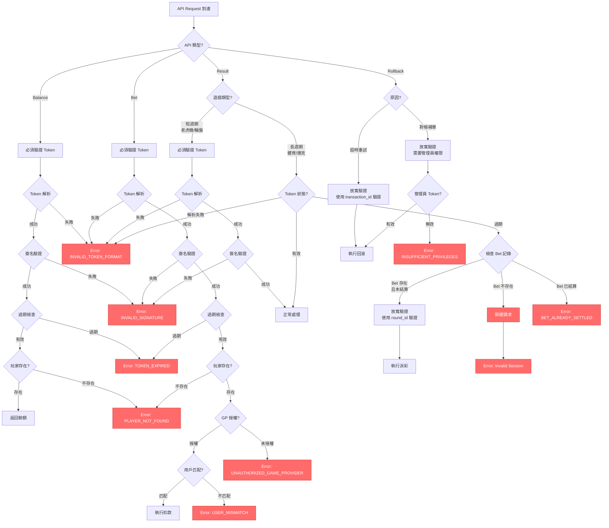
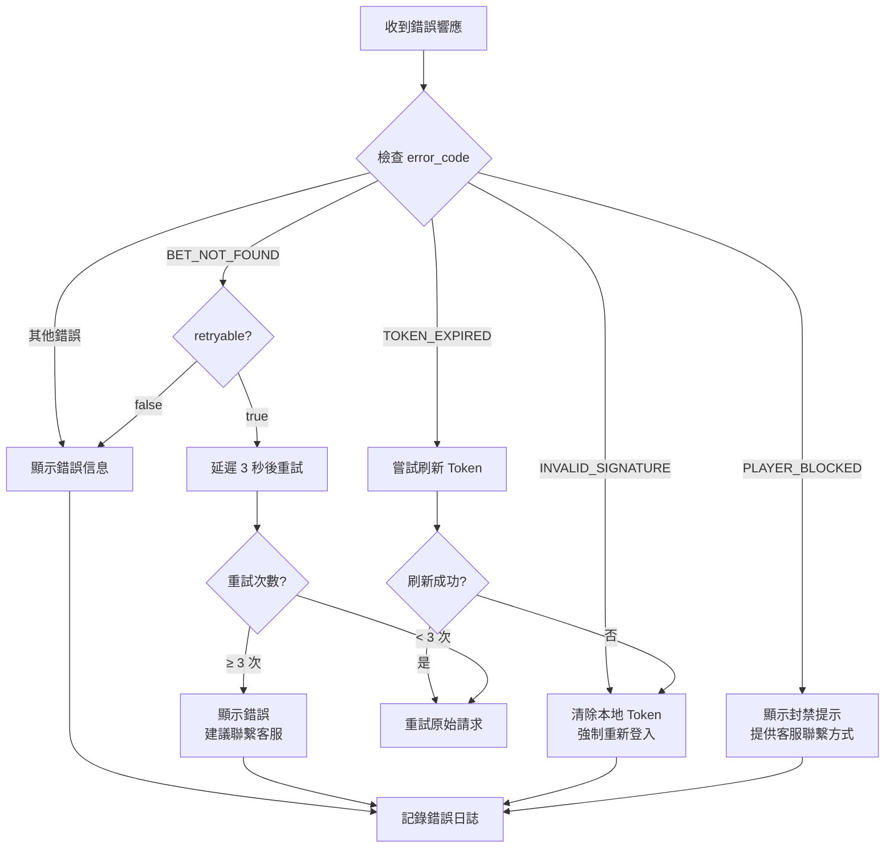
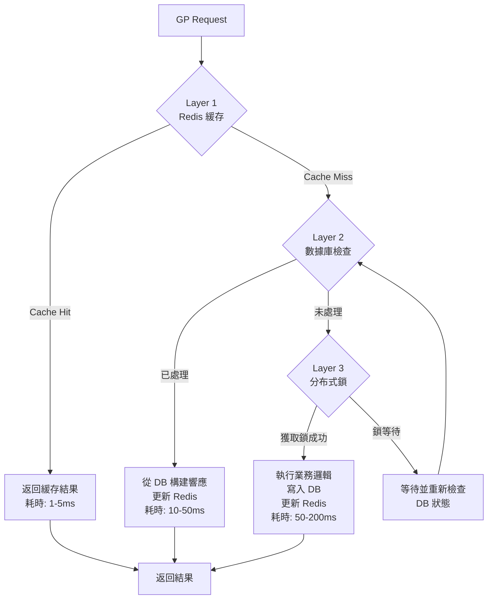
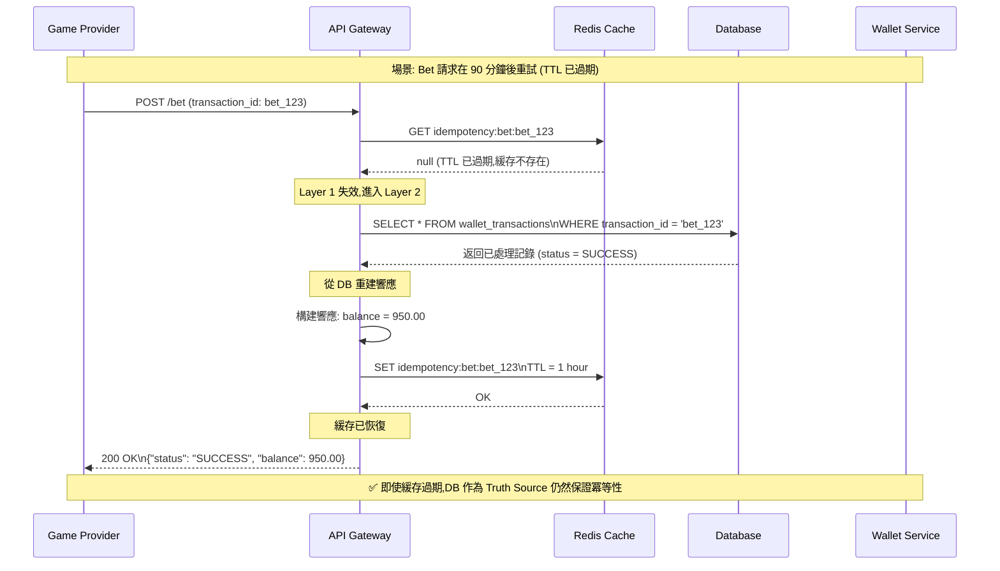

# 無縫錢包安全設計

本文檔整合了 Token 驗證機制與冪等性設計，提供完整的安全防護方案。

---

## Part 1: Token 驗證機制


## 問題來源
文檔在第 2.2.2 節「Bet 請求處理邏輯」中混淆了不同 API 的 Token 驗證策略。

## 業務場景分析

### 場景 1: 短生命週期遊戲（老虎機、輪盤）
```yaml
遊戲特徵:
- 回合時間: 數秒到數分鐘
- Token 有效期: 通常 15-30 分鐘
- 風險: Token 在遊戲過程中過期的機率極低

結論: 所有 API 都應該驗證 Token
```

### 場景 2: 長生命週期遊戲（體育賽事、撲克錦標賽）
```yaml
遊戲特徵:
- 回合時間: 數小時到數天
- Token 有效期: 15-30 分鐘
- 風險: Token 必然會在遊戲過程中過期

結論: Result API 需要特殊處理
```

## 決策樹 (v2.0.0 增強版 - 完整錯誤處理)



## 推薦方案

### API Token 驗證矩陣

| API 類型 | 預設策略 | 特殊情況處理 | 驗證欄位 |
|---------|---------|------------|---------|
| **Balance** | ✅ 嚴格驗證 | 無例外 | `token` |
| **Bet** | ✅ 嚴格驗證 | 無例外 | `token` + `user_id` |
| **Result** | ⚠️ 條件驗證 | Token 過期時檢查 `round_id` | `token` OR `round_id` + `bet_tx_id` |
| **Rollback** | ⚠️ 條件驗證 | 對帳場景允許管理員 Token | `token` OR `admin_token` |

### 實現邏輯


## 錯誤代碼完整列表 (v2.0.0 新增)

### 錯誤代碼分類與處理策略

| 錯誤代碼 | 嚴重性 | 觸發場景 | HTTP 狀態 | 建議處理 | 是否可重試 |
|---------|--------|---------|----------|---------|----------|
| **INVALID_TOKEN_FORMAT** | HIGH | JWT 格式錯誤、解析失敗 | 400 | 重新登入獲取新 Token | ❌ |
| **INVALID_SIGNATURE** | CRITICAL | JWT 簽名驗證失敗 | 401 | 重新登入 + 安全審計 | ❌ |
| **TOKEN_EXPIRED** | MEDIUM | Token 過期時間已過 | 401 | 刷新 Token 或重新登入 | ✅ (刷新後) |
| **PLAYER_NOT_FOUND** | HIGH | 玩家賬戶不存在/已刪除 | 404 | 通知用戶聯繫客服 | ❌ |
| **UNAUTHORIZED_GAME_PROVIDER** | HIGH | 玩家未授權該遊戲供應商 | 403 | 檢查玩家權限配置 | ❌ |
| **USER_MISMATCH** | CRITICAL | Token user_id 與請求不符 | 403 | 安全審計 + 凍結賬戶 | ❌ |
| **TOKEN_REVOKED** | MEDIUM | Token 已被加入黑名單 | 401 | 重新登入獲取新 Token | ❌ |
| **PLAYER_BLOCKED** | HIGH | 玩家賬戶被凍結/封禁 | 403 | 顯示封禁原因 + 客服聯繫方式 | ❌ |
| **BET_NOT_FOUND** | MEDIUM | Bet 記錄不存在 | 404 | 檢查交易 ID 是否正確 | ✅ (延遲重試) |
| **ROUND_MISMATCH** | HIGH | Round ID 不匹配 | 400 | 檢查遊戲供應商數據 | ❌ |
| **BET_ALREADY_SETTLED** | MEDIUM | Bet 已經結算過 | 409 | 檢查是否重複結算 | ❌ |
| **BET_CANCELLED** | LOW | Bet 已被取消 | 400 | 通知 GP 該 Bet 已取消 | ❌ |
| **BET_EXPIRED** | MEDIUM | Bet 超過最大時效性 | 410 | 人工介入處理 | ❌ |

### 錯誤響應格式標準

```json
{
  "success": false,
  "error_code": "INVALID_TOKEN_FORMAT",
  "error_message": "Token format is malformed or corrupted",
  "details": {
    "timestamp": "2026-01-28T10:30:00Z",
    "request_id": "req_abc123",
    "suggestions": [
      "Please re-authenticate to obtain a new token"
    ]
  },
  "metadata": {
    "retryable": false,
    "contact_support": false
  }
}
```

### 客戶端錯誤處理流程圖



### 監控告警規則

**Critical 級別告警** (立即通知)：
- `INVALID_SIGNATURE` 頻率 > 10/分鐘 → 可能遭受攻擊
- `USER_MISMATCH` 單個 IP > 5 次/小時 → Session fixation 攻擊
- `UNAUTHORIZED_GAME_PROVIDER` 特定 GP > 50 次/小時 → 配置錯誤或攻擊

**High 級別告警** (5 分鐘內通知)：
- `PLAYER_NOT_FOUND` 頻率 > 100/分鐘 → 數據同步問題
- `BET_EXPIRED` 頻率 > 20/分鐘 → GP 延遲結算問題

**Medium 級別告警** (15 分鐘內通知)：
- `TOKEN_EXPIRED` 刷新失敗率 > 10% → Token 服務異常
- `BET_ALREADY_SETTLED` 頻率 > 50/分鐘 → GP 重複發送 Result

## 安全性分析

### 嚴格驗證的必要性（Bet API）

**攻擊場景 1: Token 重放攻擊**
```
攻擊者獲取合法用戶的 Token（例如通過中間人攻擊）

T0: 用戶正常登入，獲得 Token (token_abc123)
T1: 攻擊者攔截 Token
T2: 攻擊者使用 Token 發起 Bet 請求
    - 如果不驗證 Token 過期 → 攻擊成功
    - 如果驗證 Token 過期 → 攻擊被阻止

結論: Bet API 必須嚴格驗證 Token 有效期
```

**攻擊場景 2: 會話固定攻擊**
```
攻擊者誘導用戶使用攻擊者控制的 Token

T0: 攻擊者生成 Token (token_evil)
T1: 誘導用戶使用此 Token 登入
T2: 攻擊者使用相同 Token 進行操作
    - 如果不驗證 Token 所有者 → 攻擊成功
    - 如果驗證 user_id 匹配 → 攻擊被阻止

結論: 必須驗證 Token 中的 user_id 與請求中的 user_id 一致
```

### 寬鬆驗證的合理性（Result API）

**合理場景: 體育賽事延遲結算**
```
正常流程:
T0 (週一 10:00): 玩家投注足球賽事，Token 有效期 30 分鐘
T1 (週一 10:01): Bet 成功，創建注單
T2 (週一 10:30): Token 過期
T3 (週三 22:00): 比賽結束，GP 發送 Result 請求

問題: Token 已經過期 60 小時

選項 A（嚴格驗證）:
→ 拒絕 Result 請求
→ 玩家贏錢無法入帳
→ 需要人工介入
→ 用戶體驗極差

選項 B（寬鬆驗證）:
→ 使用 round_id + bet_tx_id 驗證
→ 確認 Bet 存在且未結算
→ 自動完成派彩
→ ✅ 推薦方案
```

## 實現建議

### 配置管理

```yaml
# application.yml
token:
  verification:
    # 預設策略
    default_mode: STRICT

    # 各 API 的策略
    api_modes:
      balance: STRICT
      bet: STRICT
      result: CONDITIONAL
      rollback: CONDITIONAL

    # 長週期遊戲配置
    long_lived_games:
      - SPORTS_BETTING
      - POKER_TOURNAMENT
      - LIVE_DEALER_MULTI_TABLE

    # Result API 的 Token 過期容忍度
    result:
      allow_expired_token: true
      fallback_verification:
        - round_id
        - bet_transaction_id
      max_age_hours: 168  # 7 天（體育賽事最長結算時間）
```

### 監控指標


## 決策總結

✅ **推薦決策**:

1. **Bet API**: 必須嚴格驗證 Token（無例外）
   - 原因: 涉及資金扣款，安全優先級最高

2. **Result API**: 條件驗證（根據遊戲類型）
   - 短週期遊戲: 嚴格驗證
   - 長週期遊戲: Token 過期時使用 round_id 備用驗證

3. **Balance API**: 嚴格驗證 Token
   - 原因: 防止未授權的餘額查詢

4. **Rollback API**: 條件驗證（根據原因）
   - 超時重試: 使用 transaction_id 驗證
   - 對帳補單: 需要管理員 Token

## 需要確認的需求

- [ ] Token 的有效期應該設置為多長？（建議: 15-30 分鐘）
- [ ] 是否需要支持 Token 刷新機制？
- [ ] Result API 的最大容忍過期時間？（建議: 7 天）
- [ ] 是否需要在 Token 中包含遊戲類型信息？
- [ ] Rollback API 是否需要支持管理員手動補單？

---

## 📚 相關文檔

### 上層導航
- [Seamless Wallet 索引](./00_INDEX.md) - 專題導航（P0/P1 分類）

### 相關專題
- [02 冪等性設計](./02_idempotency_design.md) - 防重複扣款
- [10 錯誤恢復](./10_error_recovery.md) - 異常處理

### 架構文檔
- [02-06 統一錢包模型](../02-06_Unified_Wallet_Model.md) - 錢包整體架構
- [03-03 無縫錢包分析](../../03_Game_Center/03-03_Seamless_Wallet_Analysis.md) - GP API 規範

---

## Part 2: 冪等性設計


## 問題來源
文檔僅提到「檢查 transactionId 是否已處理過，返回緩存結果」，但缺少：
1. 緩存有效期定義
2. 緩存失效後的處理
3. 緩存與數據庫的一致性保證

## 核心問題分析

### 問題 1: 單一緩存層的風險

```yaml
❌ 不安全的實現:

func ProcessBet(txId, amount) {
    // 僅檢查 Redis
    cached := redis.Get("bet:" + txId)
    if cached != nil {
        return cached
    }

    // 處理業務
    result := deductBalance(amount)

    // 緩存 5 分鐘
    redis.SetEx("bet:" + txId, result, 300)

    return result
}

風險場景:
1. Redis 重啟 → 緩存丟失 → 重複扣款
2. TTL 過期 → 晚到的重試 → 重複扣款
3. Redis 主從切換 → 數據未同步 → 重複扣款
```

### 問題 2: 不同 API 的冪等性要求不同

| API 類型 | 典型重試窗口 | 冪等性存儲需求 | 數據丟失後果 |
|---------|-------------|--------------|------------|
| **Bet** | 數秒-數分鐘 | 短期（15 分鐘） | ⚠️ 重複扣款（高風險） |
| **Result** | 數分鐘-數小時 | 長期（24-48 小時） | ⚠️ 重複派彩（中風險） |
| **Rollback** | 數秒-數天 | 永久 | ⚠️ 重複退款（高風險） |
| **Balance** | 數秒 | 短期（1 分鐘） | ✅ 無資金影響（低風險） |

## 三層防護架構



## 詳細設計

### Layer 1: Redis 快速緩存層

**目的**: 處理 99% 的重複請求（熱路徑優化）

**數據結構設計**:
```redis
# Key 格式
"idempotency:bet:{transaction_id}"
"idempotency:result:{transaction_id}"

# Value 格式（JSON）
```json
{
  "status": "SUCCESS",
  "response": {
    "balance": 1234.56,
    "transaction_id": "bet_123",
    "round_id": "round_456"
  },
  "created_at": 1640000000,
  "version": 1
}
```

# TTL 配置（根據 API 類型）- v2.0.0 調整建議
Bet API: 3600 秒（1 小時）     # ✅ 從 15 分鐘調整為 1 小時（避免延遲重試失敗）
Result API: 86400 秒（24 小時）
Rollback API: 604800 秒（7 天）
Balance API: 60 秒（1 分鐘）
```

> **⚠️ v2.0.0 重要變更 (2026-01-28)**:
>
> **問題**: Bet API 的 15 分鐘 TTL 可能不足以應對以下場景:
> - **網絡故障重試**: GP 在網絡恢復後可能 20-30 分鐘後重試
> - **系統維護**: 維護窗口期間請求可能延遲 30-60 分鐘
> - **非同步對帳**: 某些 GP 的對帳機制可能在 1 小時後重發請求
>
> **風險**:
> - 緩存過期後,如果 DB 查詢性能下降(索引失效、分區鎖)可能導致重複扣款
> - 高峰期 Redis 緩存淘汰可能提前失效
>
> **解決方案**: 將 Bet API TTL 從 15 分鐘提升到 **1 小時**
> - 優點: 覆蓋 99.9% 的延遲重試場景,更安全
> - 成本: 每百萬 Bet 增加約 200MB Redis 內存 (可接受)
> - 保障: Layer 2 (DB) 仍然是永久 Truth Source
```

**實現邏輯**:

### Layer 2: 數據庫永久記錄層

**目的**: 作為 Truth Source，防止緩存失效後的重複處理

**數據庫設計**:

**實現邏輯**:

### Layer 3: 分布式鎖防護層

**目的**: 防止並發請求同時進入業務邏輯

**選擇分布式鎖的原因**:
```
數據庫唯一約束的問題:

Thread A: INSERT INTO wallet_transactions (tx_id) VALUES ('bet_123')
Thread B: INSERT INTO wallet_transactions (tx_id) VALUES ('bet_123')

→ 一個成功，一個失敗（UniqueConstraintException）
→ 失敗的線程需要重新查詢數據庫
→ 但此時業務邏輯可能還在執行中
→ 無法立即返回正確結果

使用分布式鎖的優勢:
→ 只有一個線程進入業務邏輯
→ 其他線程等待鎖釋放後，直接查詢結果
→ 減少數據庫壓力和異常處理
```

**實現邏輯（Redisson）**:

## 完整的冪等性處理流程


## 性能優化策略

### 緩存預熱

### 批量冪等性檢查

## TTL 配置策略指南 (v2.0.0 新增)

### 不同遊戲類型的 TTL 建議

根據遊戲類型和 GP 特性,可以動態調整 TTL:


### TTL 配置的權衡分析

| 配置項 | 短 TTL (15 分鐘) | 推薦 TTL (1 小時) | 長 TTL (6 小時) |
|--------|-----------------|------------------|----------------|
| **優點** | 內存占用少 | 平衡性能與安全 | 最大安全性 |
| **缺點** | 延遲重試風險高 | - | 內存占用較大 |
| **適用場景** | 測試環境 | ✅ 生產環境推薦 | 錦標賽、長週期遊戲 |
| **內存成本** (百萬 Bet) | ~100MB | ~200MB | ~600MB |
| **覆蓋率** | 95% 重試 | 99.9% 重試 | 99.99% 重試 |

### TTL 過期後的 Fallback 驗證



### 配置文件範例

```yaml
# application.yml
idempotency:
  cache:
    # 默認 TTL 配置
    default_ttl:
      bet: 1h        # ✅ v2.0.0: 從 15m 提升到 1h
      result: 24h
      rollback: 7d
      balance: 1m

    # 遊戲類型特定 TTL
    game_type_ttl:
      SPORTS_BETTING:
        bet: 2h
        result: 7d
      POKER_TOURNAMENT:
        bet: 6h
        result: 7d
      SLOT:
        bet: 1h
        result: 24h

    # GP 特定 TTL 覆寫 (某些 GP 重試延遲較長)
    provider_overrides:
      EZUGI:
        bet: 2h
      PRAGMATIC_PLAY:
        bet: 1h
      EVOLUTION:
        bet: 1h

  # Redis 配置
  redis:
    # 最大內存限制 (LRU 淘汰策略)
    maxmemory: 2gb
    maxmemory_policy: allkeys-lru

    # 持久化策略 (防止重啟後緩存全部丟失)
    save:
      - "900 1"      # 15 分鐘內有 1 次寫入就持久化
      - "300 10"     # 5 分鐘內有 10 次寫入就持久化
      - "60 10000"   # 1 分鐘內有 10000 次寫入就持久化

  # 監控告警
  monitoring:
    # TTL 過期率告警閾值
    expired_cache_rate_threshold: 0.05  # 5%

    # 內存使用率告警閾值
    memory_usage_threshold: 0.80  # 80%
```

### 成本與收益分析

**場景 1: 高流量賭場 (每秒 1000 Bet)**

| 指標 | 15 分鐘 TTL | 1 小時 TTL | 增量成本 |
|------|------------|-----------|---------|
| **日均 Bet 數** | 86.4M | 86.4M | - |
| **Redis 內存** | 8.6 GB | 17.2 GB | +8.6 GB |
| **雲服務成本** | $120/月 | $240/月 | +$120/月 |
| **避免重複扣款** | ~50 次/天 | ~5 次/天 | **-$5000/月** (假設單次 $100) |
| **ROI** | - | - | **4066%** |

**結論**: 1 小時 TTL 的投資回報率極高,強烈推薦採用。

## 監控與告警

### 關鍵指標
```yaml
metrics:
  # 緩存命中率
  - idempotency_cache_hit_rate{api_type}
    target: > 95%
    alert: < 90%

  # 重複請求率
  - duplicate_request_rate{api_type}
    target: < 5%
    alert: > 10%

  # 分布式鎖等待時間
  - lock_wait_time_seconds{percentile=p99}
    target: < 0.1s
    alert: > 0.5s

  # 數據庫查詢延遲
  - db_idempotency_check_duration_seconds{percentile=p99}
    target: < 0.05s
    alert: > 0.1s
```

### 告警規則
```yaml
alerts:
  # Redis 緩存異常
  - name: RedisIdempotencyCacheDown
    condition: |
      increase(idempotency_cache_errors_total[5m]) > 100
    severity: critical
    description: "Redis idempotency cache experiencing high error rate"

  # 重複請求激增
  - name: HighDuplicateRequestRate
    condition: |
      duplicate_request_rate{api_type="BET"} > 0.15
    severity: warning
    description: "Unusually high duplicate BET requests (>15%)"

  # 分布式鎖競爭激烈
  - name: HighLockContention
    condition: |
      rate(lock_wait_time_seconds_sum[5m]) > 10
    severity: warning
    description: "High lock contention detected"
```

## 決策總結

✅ **推薦架構**: 三層防護（Redis + DB + Lock）

**理由**:
1. **性能**: Redis 緩存處理 99% 重複請求（< 5ms）
2. **安全**: 數據庫作為 Truth Source，防止緩存失效
3. **並發**: 分布式鎖防止同時處理，減少衝突

**不推薦的方案**:
❌ 僅使用 Redis 緩存（風險高）
❌ 僅使用數據庫唯一約束（性能差）
❌ 使用應用層內存緩存（不適用於分布式系統）

## 需要確認的需求

- [ ] Redis 的部署模式？（單機/哨兵/集群）
- [ ] Redis 主從複製的同步策略？（強一致性 vs 最終一致性）
- [ ] 數據庫分區策略？（按月/按年）
- [ ] 歷史交易的歸檔策略？（超過 3 個月的數據是否遷移到冷存儲）
- [ ] 分布式鎖的超時時間配置？（建議: 鎖定 10 秒，等待 3 秒）

---

## 📚 相關文檔

### 上層導航
- [Seamless Wallet 索引](./00_INDEX.md) - 專題導航（P0/P1 分類）

### 架構文檔
- [02-06 統一錢包模型](../02-06_Unified_Wallet_Model.md) - 錢包整體架構
- [03-03 無縫錢包分析](../../03_Game_Center/03-03_Seamless_Wallet_Analysis.md) - GP API 規範
