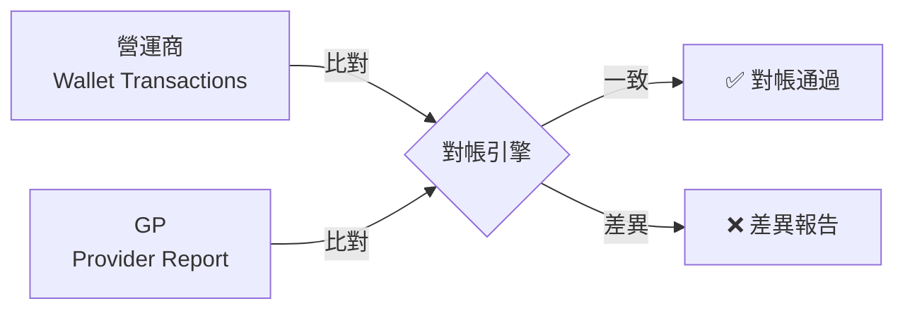
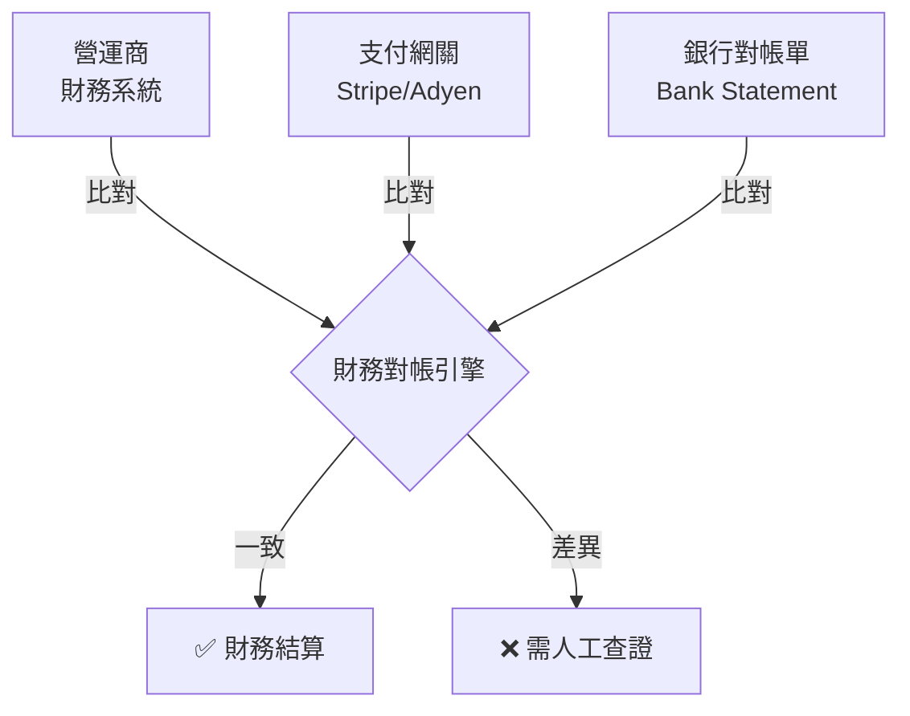

# 無縫錢包財務對帳與流水管理

本文檔整合了對帳模型、投注要求追蹤和促銷錢包轉帳，提供完整的財務管理方案。

---

## Part 1: 對帳模型

## 問題來源
文檔第 5.2 節第 315-323 行將「遊戲交易對帳」和「存提款對帳」混為一談。

**原文**:
> 三方對帳模型：
> - 方 1：營運商帳本
> - 方 2：供應商報表
> - 方 3：支付網關/銀行（針對存提款的實際資金流動）

## 核心問題

### 概念混淆
將兩個**完全不同**的業務場景混在一起：

| 對比項 | 遊戲交易對帳 | 存提款對帳 |
|-------|------------|----------|
| **涉及方數量** | 2 方 | 3 方 |
| **對帳對象** | 營運商 ←→ GP | 營運商 ←→ 支付網關 ←→ 銀行 |
| **資金性質** | 虛擬貨幣 | 真實貨幣（法幣） |
| **對帳頻率** | 實時/每小時 | 每日/每週 |
| **匹配欄位** | transaction_id | 金額 + 時間 |
| **差異原因** | API 超時、掉單 | 銀行延遲、手續費 |

## 正確的對帳模型

### 模型 1: 遊戲交易對帳（雙方對帳）

### 模型 2: 存提款對帳（三方對帳）

## 正確的文檔結構

文檔應該分成兩節：

### 5.2.1 遊戲交易對帳（雙方對帳）
- 涉及: 營運商 + GP
- 資金: 虛擬貨幣（遊戲積分）
- 頻率: 實時/每小時
- 方法: transaction_id 匹配

### 5.2.2 存提款對帳（三方對帳）
- 涉及: 營運商 + 支付網關 + 銀行
- 資金: 真實貨幣（法幣）
- 頻率: 每日/每週
- 方法: 金額 + 時間匹配

## 決策總結

✅ **正確理解**:
- 遊戲交易 = 雙方對帳（不涉及銀行）
- 存提款 = 三方對帳（涉及銀行）
- 兩者是獨立的對帳流程

❌ **錯誤理解**:
- 將支付網關/銀行納入遊戲交易對帳
- 混淆虛擬貨幣和真實貨幣的對帳邏輯

---

## 📚 相關文檔

### 上層導航
- [Seamless Wallet 索引](./00_INDEX.md) - 專題導航（P0/P1 分類）

### 架構文檔
- [02-06 統一錢包模型](../02-06_Unified_Wallet_Model.md) - 錢包整體架構
- [03-03 無縫錢包分析](../../03_Game_Center/03-03_Seamless_Wallet_Analysis.md) - GP API 規範

---

## Part 2: 投注要求追蹤

---

## Part 3: 促銷錢包轉帳

