# 02-03 流水計算與遊戲對帳 (Turnover Calculation & Game Reconciliation)

<!-- SSOT: Authoritative definition of Turnover Calculation, Valid Bet Logic, Three-Layer Validation, Reconciliation Model -->

> **三層風控架構定位**: 本模塊定義完整的流水計算邏輯，包含風控驗證(Layer 1)、財務狀態記錄(Layer 2)、活動權重應用(Layer 3)。
>
> **重要更新 (v2.1.0 - 2026-02-02)**:
> - ✅ 支援配置驅動風控 (BLOCK/FLAG/PASS action_type)
> - ✅ 免費旋轉 Turnover 計算標準化 (面額總和)
> - ✅ HALF_WIN/HALF_LOSS 採用標準本金法 (100% 流水)
> - ✅ 取款時驗證流水要求 (非投注時自動解鎖)
>
> **創建日期**: 2026-01-27
> **最後更新**: 2026-02-02
> **版本**: 2.1.0

---

## 📌 文檔導航

本文檔整合了以下內容：
- **業務邏輯**: 有效流水計算、狀態判定、遊戲權重
- **架構設計**: 三層驗證架構、跨模組一致性
- **對帳模型**: 雙方對帳vs三方對帳、異常處理
- **實作細節**: SmartAdmin架構映射、代碼範例
- **監控告警**: 關鍵指標、SLA定義

**參考文檔**:
- [00-03 術語標準化](../00_Concept_&_Analysis/00-03_Terminology_Standards.md) - **必讀**
- [05-01 風控系統](../05_Risk_Management/05-01_Risk_Control_System.md) - Layer 1依賴
- [04-01 活動系統](../04_Activity_Center/04-01_Activity_System_Design.md) - Layer 3依賴

---

## 1. 系統概述

### 1.1 核心原則

**有效流水定義**: 僅計算「產生輸贏結果」、「具備風險」且「通過風控驗證」的注單。

**公式**:
```
ValidTurnover = BetAmount × GameWeight × OddsFactor × StatusFactor × RiskFactor
```

其中：
- **RiskFactor**: `1` (Pass) 或 `0` (Reject/Flag)
- **StatusFactor**: Layer 2財務層確定 (WIN/LOSS=1.0, DRAW=0)
- **GameWeight**: Layer 3活動層應用 (Slots=1.0, Baccarat=0.15)

### 1.2 三層驗證架構總覽

**架構圖**:

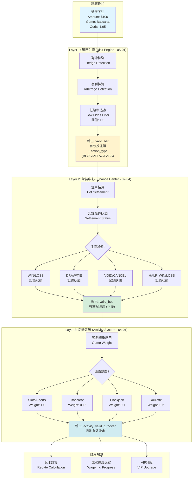

### 1.3 關鍵術語定義

<!-- SSOT: Authoritative terminology definitions -->

| 中文 | 英文 | 定義 | 單位 | 用途 |
|------|------|------|------|------|
| **投注額** | Bet Amount | 單筆原始投注金額 | 單筆 | API 交互、資金扣除 |
| **流水** | Turnover | 投注額的時間累積總和 | 累積 | GGR 計算、財務報表 |
| **有效投注額** | Valid Bet | 經風控過濾的單筆金額 | 單筆 | 流水要求、返水、VIP |
| **流水要求** | Wagering Requirement | 必須達成的有效投注總額 | 累積 | 活動驗證、取款限制 |

**詳細定義**: [術語標準化文檔](../00_Concept_&_Analysis/00-03_Terminology_Standards.md)

---

## 2. Layer 1: 風控驗證 (Risk Engine Validation)

### 2.1 風控引擎職責

<!-- SSOT: Layer 1 is the ONLY layer responsible for rejection decisions -->

**核心原則**: Layer 1是唯一負責拒絕決策的層級，後續層級(Layer 2/3)僅做數值調整。

**職責矩陣**:

| 職責類型 | Layer 1 (Risk Engine) | Layer 2 (Finance) | Layer 3 (Activity) |
|---------|----------------------|-------------------|-------------------|
| **拒絕決策** | ✅ 唯一負責 | ❌ 不參與 | ❌ 不參與 |
| **狀態因子調整** | ❌ 不參與 | ✅ 唯一負責 | ❌ 不參與 |
| **遊戲權重應用** | ❌ 不參與 | ❌ 不參與 | ✅ 唯一負責 |
| **短路返回** | ✅ BLOCK規則直接返回0 | ❌ 信任 Layer 1 結果 | ❌ 信任 Layer 2 結果 |

### 2.2 配置驅動風控 (v2.1.0)

**新特性**: 支援 `action_type` 配置驅動 (BLOCK/FLAG/PASS)

**返回結構**:
```typescript
interface RiskValidationResult {
  is_valid: boolean;
  action_type: 'BLOCK' | 'FLAG' | 'PASS';
  matched_rules: string[];
  risk_proposal_id: string | null;
  effective_turnover_base: number;
}
```

**三種Action類型**:

| Action Type | 說明 | valid_bet | 流水計算 | 風控提案 |
|-------------|------|-----------|---------|---------|
| **BLOCK** | 實時阻斷 | 0 | 不計入 | 不生成 |
| **FLAG** | 標記但允許 | bet_amount | 正常計入 | ✅ 生成 |
| **PASS** | 正常通過 | bet_amount | 正常計入 | 不生成 |

### 2.3 風控檢測流程

**對沖檢測流程圖**:

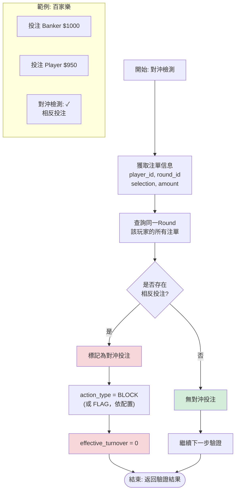

**賠率閾值檢測**:

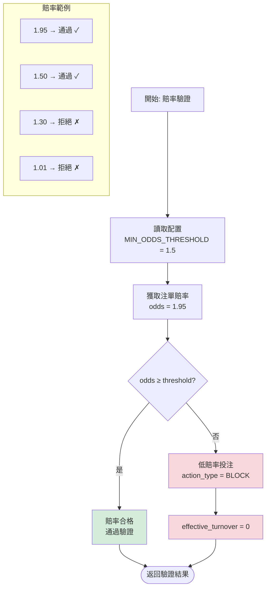

### 2.4 Layer 1 處理流程 (v2.1.0)

**調用層次**:

```typescript
// ✅ 正確方式 (v2.1.0): Layer 1 拒絕後直接短路
const riskValidation = await RiskEngine.validateTurnover({...});

if (!riskValidation.is_valid && riskValidation.action_type === 'BLOCK') {
  // BLOCK規則直接返回0，不進入Layer 2/3
  return {
    effective_turnover_base: 0,
    valid_turnover_finance: 0,
    activity_valid_turnover: 0,
    rejected_by: 'RISK_ENGINE',
    action_type: 'BLOCK',
    matched_rules: riskValidation.matched_rules
  };
}

// FLAG規則標記但繼續 (v2.1.0)
if (riskValidation.action_type === 'FLAG') {
  await recordRiskFlag(bet.id, riskValidation.risk_proposal_id);
}

// Layer 2僅負責狀態因子調整 (信任Layer 1已通過驗證)
const valid_turnover_finance = calculateFinanceTurnover(
  riskValidation.effective_turnover_base,
  bet.status
);
```

**性能優化效果 (v2.0.0→v2.1.0)**:
- Layer 1 拒絕後直接短路返回
- 節省性能: ~5% CPU 與 DB 查詢
- BLOCK vs FLAG分離: FLAG規則允許流水正常計算 + 生成風控提案

---

## 3. Layer 2: 財務狀態記錄 (Finance Status Recording)

### 3.1 財務層定位

<!-- SSOT: Layer 2 只負責狀態記錄，不修改valid_bet -->

**核心原則**: Layer 2僅記錄結算狀態，**不修改** Layer 1確定的valid_bet值。

**結算狀態記錄流程**:

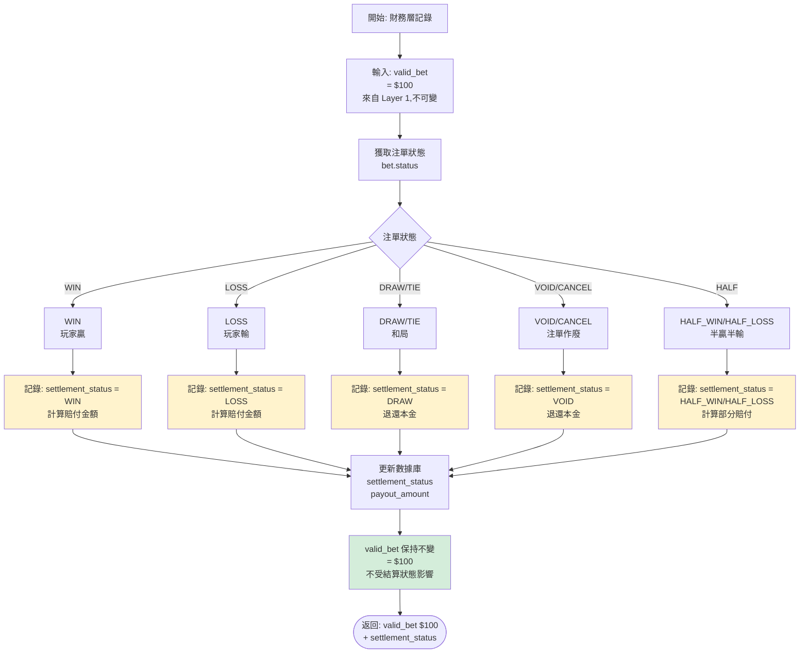

### 3.2 狀態判定 (Status Factor)

<!-- SSOT: Standard Principal Method for HALF_WIN/HALF_LOSS -->

**核心規則**: 採用「標準本金法」— valid_bet = bet_amount (不論結算狀態)

**狀態因子映射表**:

| 狀態 (Status) | 描述 | 流水計算 | 備註 |
| :--- | :--- | :--- | :--- |
| **WIN** | 玩家贏 | 100% | 正常計算 |
| **LOSS** | 玩家輸 | 100% | 正常計算 |
| **DRAW / TIE** | 和局/走水 | **0%** | 無風險，不計流水 |
| **CANCEL / VOID** | 取消/作廢 | **0%** | 注單無效 |
| **HALF WIN** | 贏半 | **100%** | ✅ 標準本金法 (v2.0.0 推薦) |
| **HALF LOSS** | 輸半 | **100%** | ✅ 標準本金法 (v2.0.0 推薦) |
| **RUNNING** | 進行中 | 0% | 必須等待結算 (Settled) 後才計算 |

> **v2.0.0 重要變更 (2026-01-28)**:
> - **HALF_WIN/HALF_LOSS 現在計入 100% 流水** (採用標準本金法)
> - **「實際風險法」(50% 計算) 已廢棄** - 違反公平性原則
> - **理由**: 相同投注行為應有相同流水貢獻,與風控鎖定邏輯一致

**為什麼Layer 2不應該修改valid_bet?**

**違反公平性原則** (Error #3 - 實際風險法):
```
兩位玩家都投注 100 元在體育博彩「讓 -0.25」:
- 玩家 A 的比賽結果: 全贏 → valid_bet = 100 元 ✓
- 玩家 B 的比賽結果: 平局(輸半) → valid_bet = 50 元 ❌ (錯誤)

矛盾:
- 相同的投注行為
- 相同的風險暴露 (100 元)
- 但 valid_bet 不同 → 違反公平性原則
```

**正確做法 (標準本金法 - 業界標準)**:
```
玩家 A: 投注 100 元 → 全贏 → valid_bet = 100 元
玩家 B: 投注 100 元 → 輸半 → valid_bet = 100 元 (不是 50!)

理由:
- 玩家下注時承擔的風險都是 100 元
- Valid Bet 應該反映投注行為,而非結算結果
- 簡化計算,不需要等結算才知道 valid_bet
```

### 3.3 狀態因子函數實現

```typescript
/**
 * Layer 2: Finance Layer 狀態因子調整
 * 職責: WIN/LOSS/DRAW/CANCEL 狀態因子應用
 * 前置條件: Layer 1 已通過驗證 (is_valid = true)
 *
 * ⚠️ 此層不負責拒絕決策,信任 Layer 1 結果
 */
const status_factor = getStatusFactor(bet.status);
const valid_turnover_finance = effective_turnover_base * status_factor;

log.info(`[Layer 2] bet_id=${bet.id}, status=${bet.status}, status_factor=${status_factor}, valid_turnover_finance=${valid_turnover_finance}`);

/**
 * 狀態因子映射表
 * v2.0.0: HALF_WIN/HALF_LOSS = 1.0 (標準本金法)
 */
function getStatusFactor(status: BetStatus): number {
  const STATUS_FACTORS = {
    'WIN': 1.0,        // 玩家贏 - 全額流水
    'LOSS': 1.0,       // 玩家輸 - 全額流水
    'DRAW': 0.0,       // 和局 - 無風險,不計流水
    'TIE': 0.0,        // 走水 - 同和局
    'VOID': 0.0,       // 作廢 - 注單無效
    'CANCEL': 0.0,     // 取消 - 注單無效
    'HALF_WIN': 1.0,   // ✅ v2.0.0: 贏半 - 全額流水 (標準本金法)
    'HALF_LOSS': 1.0,  // ✅ v2.0.0: 輸半 - 全額流水 (標準本金法)
    'RUNNING': 0.0     // 進行中 - 未結算不計
  };
  return STATUS_FACTORS[status] ?? 0.0;
}
```

---

## 4. Layer 3: 活動權重應用 (Activity Game Weight Application)

### 4.1 遊戲權重應用流程

<!-- SSOT: Game contribution weight definitions -->

**遊戲權重配置表**:

| 遊戲類型 | 權重 | 說明 |
| :--- | :--- | :--- |
| **Slots (老虎機)** | 100% | 純機率，適合洗水 |
| **Sports (體育)** | 100% | 風險高 |
| **Roulette (輪盤)** | 20% | 中等風險 |
| **Baccarat (百家樂)** | 15% | RTP高，平台風險低 |
| **Live Casino (真人)** | 15% | 視運營策略 |
| **Blackjack (二十一點)** | 10% | 技巧性遊戲 |
| **Poker (撲克)** | 5% | 技巧性遊戲 |
| **Video Poker (視訊撲克)** | 5% | 技巧性遊戲 |
| **Lottery (彩票)** | 10-20% | 雙面盤 (大小單雙) 容易對押 |
| **PVP (棋牌/對戰)** | 0% | 通常不計，因涉及玩家間轉移 |

**流程圖**:

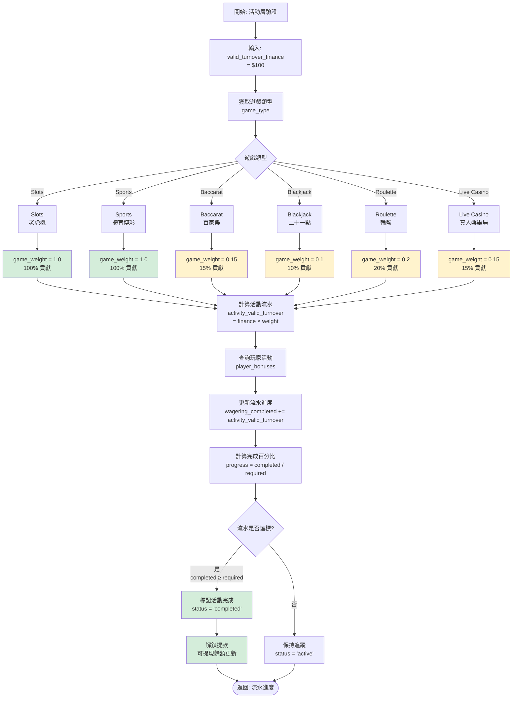

### 4.2 活動流水計算實現

```typescript
/**
 * Layer 3: Activity Layer 遊戲權重應用
 * 職責: 將財務流水應用遊戲權重，計算活動貢獻
 */
const game_weight = getGameWeight(bet.game_type);
const activity_valid_turnover = valid_turnover_finance * game_weight;

log.info(`[Layer 3] bet_id=${bet.id}, game_type=${bet.game_type}, game_weight=${game_weight}, activity_valid_turnover=${activity_valid_turnover}`);

/**
 * 遊戲權重映射表
 */
function getGameWeight(gameType: GameType): number {
  const GAME_WEIGHTS = {
    'SLOTS': 1.0,
    'SPORTS': 1.0,
    'E_SPORTS': 1.0,
    'ROULETTE': 0.2,
    'BACCARAT': 0.15,
    'LIVE_CASINO': 0.15,
    'BLACKJACK': 0.1,
    'VIDEO_POKER': 0.05,
    'POKER': 0.05,
    'LOTTERY': 0.1,
    'PVP': 0.0
  };
  return GAME_WEIGHTS[gameType] ?? 1.0; // 預設100%
}
```

---

## 5. 有效投注計算 (Valid Bet Calculation)

### 5.1 計算時機

<!-- SSOT: Valid Bet calculation timing -->

**核心規則**: 有效投注**僅在結算時**計算，下注時不計算。

**時序圖**:

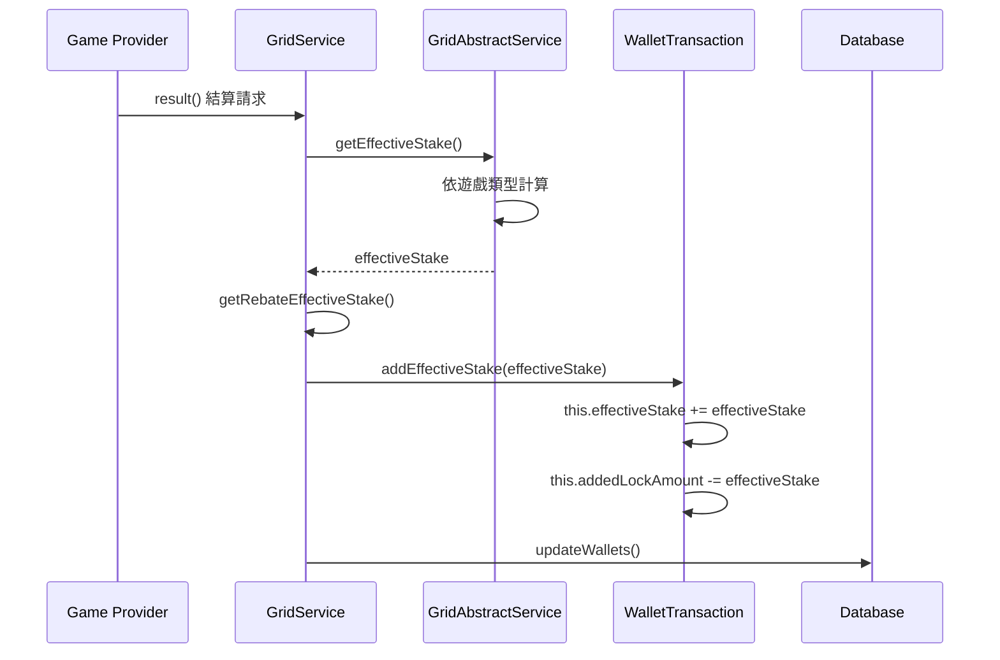

### 5.2 各遊戲類型計算公式

<!-- SSOT: Game-specific valid bet formulas -->

| 遊戲類型 | 條件 | effectiveStake 公式 |
|----------|------|---------------------|
| **SPORTS / E-SPORTS** | - | `|winAmount + lossAmount|` |
| **CASINO** | 和局 (payout == betAmount) | `0` |
| **CASINO** | 贏錢 (winAmount > 0) | `min(winAmount, betAmount)` |
| **CASINO** | 輸錢 (winAmount == 0) | `betAmount` |
| **其他類型** | - | `betAmount` |

**實現代碼**:

```typescript
/**
 * 計算有效投注額 (Effective Stake)
 * 位置: GridAbstractService.java:171-193
 */
function getEffectiveStake(bet: Transaction): number {
  const gameType = bet.gameType;
  const betAmount = bet.betAmount;
  const payout = bet.payout;
  const winAmount = payout - betAmount;
  const lossAmount = betAmount - payout;

  // 體育類：絕對值 (winAmount + lossAmount)
  if (gameType === 'SPORTS' || gameType === 'E_SPORTS') {
    return Math.abs(winAmount + lossAmount);
  }

  // 娛樂場類
  if (gameType === 'CASINO') {
    // 和局：0
    if (payout === betAmount) {
      return 0;
    }
    // 贏錢：取 min(winAmount, betAmount)
    if (winAmount > 0) {
      return Math.min(winAmount, betAmount);
    }
    // 輸錢：betAmount
    return betAmount;
  }

  // 其他類型：betAmount
  return betAmount;
}
```

### 5.3 effectiveStake 與 lockAmount 的關係

**關鍵規則**: effectiveStake 增加時，lockAmount 減少相同金額。

```typescript
/**
 * 累加有效投注並調整 lockAmount
 * 位置: WalletTransaction.java:119-125
 */
function addEffectiveStake(amount: number): void {
  this.effectiveStake += amount;
  this.addedLockAmount -= amount; // lockAmount 減少

  log.info(`[Wallet] effectiveStake=${this.effectiveStake}, lockAmount=${this.lockAmount}`);
}
```

**範例**:
- Before: lockAmount=500, effectiveStake=100
- 投注結算產生 effectiveStake=200
- After: lockAmount=300, effectiveStake=300

---

## 6. 免費旋轉流水計算 (Free Spins Turnover Calculation)

<!-- SSOT: Free Spins Turnover = Face Value, Valid Bet = 0 -->

### 6.1 核心原則

**關鍵概念**: 免費旋轉的 **Turnover** 與 **Valid Bet** 必須分開處理，用途完全不同。

| 指標 | 定義 | 計算方式 | 用途 |
|------|------|---------|------|
| **Turnover** | 遊戲中流動的金額總和 | **免費旋轉面額總和** | 財務報表、GGR 計算 |
| **Valid Bet** | 計入流水要求的金額 | **0 (不計入)** | 優惠活動、返水計算 |

**為何 Turnover ≠ 0？**

```yaml
場景: 贈送 10 次免費旋轉，每次面額 $1
遊戲結果: 玩家贏了 $8.50

❌ 錯誤計算 (Turnover = 0):
  Turnover = $0
  Payout = $8.50
  GGR = $0 - $8.50 = -$8.50  ← 看起來像虧損

✅ 正確計算 (Turnover = 面額總和):
  Turnover = $10.00
  Payout = $8.50
  GGR = $10.00 - $8.50 = $1.50  ← 促銷淨成本
```

### 6.2 業界標準

所有主流遊戲供應商均採用此邏輯:

| 供應商 | Turnover | Valid Bet | 依據 |
|-------|----------|-----------|------|
| **Evolution Gaming** | ✅ 面額總和 | 0 | 官方 API 文檔 |
| **Pragmatic Play** | ✅ 面額總和 | 0 | 官方 API 文檔 |
| **Hub88 (Aggregator)** | ✅ 面額總和 | 0 | 技術白皮書 |

**上市公司財報範例** (Evolution Gaming Annual Report 2023):
```yaml
"Free spins provided to players are recorded as:
 - Turnover: At the face value of the free spin
 - Payout: At the actual win amount
 - Marketing Expense: Net cost (face value - payout)"
```

### 6.3 GGR 計算實現

```typescript
/**
 * 計算 GGR (包含免費旋轉成本)
 */
public calculateGGR(date: LocalDate): GgrReport {
    const transactions = this.transactionRepository.findByDate(date);

    let totalTurnover = 0;
    let totalPayout = 0;
    let freespinTurnover = 0;  // 促銷成本追蹤

    for (const tx of transactions) {
        // Turnover 計算 (包含免費旋轉面額)
        if (tx.transactionType.endsWith('_BET')) {
            totalTurnover += tx.turnover;

            if (tx.isFreeRpin) {
                freespinTurnover += tx.turnover;  // ✅ 記錄促銷成本
            }
        }

        // Payout 計算
        if (tx.transactionType.endsWith('_WIN')) {
            totalPayout += tx.amount;
        }
    }

    // GGR = Turnover - Payout
    const ggr = totalTurnover - totalPayout;

    return {
        date,
        totalTurnover,
        freespinTurnover,      // 促銷成本
        cashTurnover: totalTurnover - freespinTurnover,
        totalPayout,
        ggr
    };
}
```

### 6.4 關鍵決策總結

✅ **推薦方案**: Turnover = 面額總和, Valid Bet = 0

**理由**:
1. **財務準確性**: 正確反映促銷成本
2. **GGR 計算**: 符合會計準則
3. **業界標準**: 所有主流 GP 都採用此邏輯
4. **上市合規**: 符合財報披露要求

---

## 7. 跨模組流水一致性保障 (Cross-Module Turnover Consistency)

### 7.1 三層驗證架構中的財務層定位

財務模組負責 **Layer 2: Status-Based Turnover Adjustment**，在Risk Engine基礎驗證之上應用狀態因子。

**關鍵原則**: 每層僅負責自己的職責，拒絕決策由Layer 1統一處理，後續層級僅做數值調整。

**三層架構職責劃分** (v2.0.0 ✅):

```
┌─────────────────────────────────────────────────────────────────────────────┐
│                   Unified Turnover Validation Stack                         │
├─────────────────────────────────────────────────────────────────────────────┤
│                                                                             │
│  Layer 1: Risk Validation (Risk Engine - 05-01)                            │
│  ┌─────────────────────────────────────────────────────────────┐           │
│  │ 職責: 拒絕決策 (Rejection Decision)                         │           │
│  │ 檢查: Hedge/Arbitrage/Low Odds/同 IP 對沖                   │           │
│  │ 輸出: { is_valid: boolean, effective_turnover_base: number }│           │
│  │                                                             │           │
│  │ ❌ is_valid = false → 直接返回 0 (不進入 Layer 2/3)        │           │
│  │ ✅ is_valid = true  → 返回 effective_turnover_base         │           │
│  └─────────────────────────────────────────────────────────────┘           │
│                           ↓ (僅當 is_valid = true 時)                       │
│  Layer 2: Finance Layer (THIS MODULE - 02-04) ✅                           │
│  ┌─────────────────────────────────────────────────────────────┐           │
│  │ 職責: 狀態因子調整 (Status Factor Adjustment)              │           │
│  │ 檢查: WIN/LOSS/DRAW/CANCEL/HALF_WIN/HALF_LOSS               │           │
│  │ 輸出: valid_turnover_finance                                │           │
│  │     = effective_turnover_base × status_factor              │           │
│  │                                                             │           │
│  │ ⚠️ 不負責拒絕決策 (No Rejection Logic Here)                │           │
│  └─────────────────────────────────────────────────────────────┘           │
│                           ↓                                                 │
│  Layer 3: Activity Layer (04-01)                                           │
│  ┌─────────────────────────────────────────────────────────────┐           │
│  │ 職責: 遊戲權重應用 (Game Weight Adjustment)                │           │
│  │ 檢查: SLOTS/SPORTS/BACCARAT/LOTTERY 等遊戲類型             │           │
│  │ 輸出: activity_valid_turnover                               │           │
│  │     = valid_turnover_finance × game_weight                 │           │
│  │                                                             │           │
│  │ ⚠️ 不負責拒絕決策 (No Rejection Logic Here)                │           │
│  └─────────────────────────────────────────────────────────────┘           │
│                                                                             │
└─────────────────────────────────────────────────────────────────────────────┘
```

### 7.2 與活動系統的數據交換

財務模組計算完成後，需將 `valid_turnover_finance` 發布至事件總線供活動系統使用:

```typescript
// Publish finance turnover result to Kafka
await kafkaProducer.send({
  topic: 'finance.turnover.calculated',
  messages: [{
    key: bet.player_id,
    value: JSON.stringify({
      bet_id: bet.id,
      player_id: bet.player_id,
      game_type: bet.game_type,
      effective_turnover_base: effective_turnover_base,
      valid_turnover_finance: valid_turnover_finance,
      status: bet.status,
      status_factor: status_factor,
      timestamp: new Date().toISOString()
    })
  }]
});
```

**活動系統訂閱此事件**後，在 `valid_turnover_finance` 基礎上應用遊戲權重:
```typescript
// Activity System consumes this event
const activity_valid_turnover = message.valid_turnover_finance * GAME_WEIGHTS[message.game_type];
```

### 7.3 每日對帳驗證程序

**執行時間**: 每日凌晨 03:00 (UTC+8)

**偏差閾值設定依據** (v2.0.0):

| 偏差範圍 | 閾值設定 | 業務影響分析 | 設定依據 |
|---------|---------|-------------|---------|
| **< 0.01%** | 可接受範圍 | 幾乎無影響 (單個玩家每日流水 $1000 → 偏差 $0.1) | 浮點數精度誤差、時區轉換誤差、遊戲權重配置微調 |
| **0.01% - 1%** | 警告區間 | 中等影響 (可能是配置錯誤) | 遊戲權重配置錯誤、狀態因子映射錯誤、對帳時間窗口不一致 |
| **> 1%** | 緊急區間 | 嚴重影響 (資金風險) | 系統 Bug、數據丟失、惡意攻擊、雙重扣款 |

**計算範例**:
```
假設玩家日流水 = $10,000
0.01% 偏差 = $1 (可接受)
1% 偏差 = $100 (需警報)
10% 偏差 = $1,000 (緊急)

業界標準: 大部分 iGaming 平台採用 0.01%-0.1% 作為自動驗證閾值
SmartAdmin 選擇: 0.01% (更嚴格,降低風險)
```

### 7.4 配置同步要求

財務模組與活動模組必須從 **統一配置中心 (Unified Config Service)** 讀取以下參數，禁止本地硬編碼:

1. **賠率門檻 (Odds Thresholds)** - 由 Risk Engine 定義：
```json
{
  "odds_thresholds": {
    "EUR": 1.5,  // European decimal odds
    "HK": 0.5,   // Hong Kong odds
    "MY": 0.5,   // Malay odds
    "ID": 1.2    // Indonesian odds
  }
}
```

2. **遊戲權重表 (Game Weights)** - 由活動模組定義：
```json
{
  "game_weights": {
    "SLOTS": 1.0,
    "SPORTS": 1.0,
    "BACCARAT": 0.15,
    "BLACKJACK": 0.10,
    "ROULETTE": 0.20,
    "VIDEO_POKER": 0.15,
    "LOTTERY": 0.10,
    "PVP": 0.0
  }
}
```

3. **狀態因子表 (Status Factors)** - 由財務模組定義與維護：
```json
{
  "status_factors": {
    "WIN": 1.0,
    "LOSS": 1.0,
    "DRAW": 0.0,
    "TIE": 0.0,
    "VOID": 0.0,
    "CANCEL": 0.0,
    "HALF_WIN": 1.0,
    "HALF_LOSS": 1.0,
    "RUNNING": 0.0
  }
}
```

### 7.5 監控指標與 SLA

**關鍵監控指標**:
- `finance.turnover.calculation.latency_p99` < 100ms
- `finance.turnover.risk_engine.call.success_rate` > 99.9%
- `finance.turnover.daily_reconciliation.deviation_rate` < 0.01%
- `finance.turnover.event_publish.success_rate` > 99.99%

**警報規則**:
```yaml
alerts:
  - name: turnover_calculation_latency_high
    condition: finance.turnover.calculation.latency_p99 > 500ms
    severity: WARNING
    notify: slack:#finance-ops

  - name: risk_engine_call_failure
    condition: finance.turnover.risk_engine.call.success_rate < 99%
    severity: CRITICAL
    notify: pagerduty:finance-oncall

  - name: daily_reconciliation_deviation
    condition: finance.turnover.daily_reconciliation.deviation_rate > 0.01
    severity: WARNING
    notify: slack:#finance-ops, email:finance-team@company.com

  - name: event_publish_failure
    condition: finance.turnover.event_publish.success_rate < 99.9
    severity: CRITICAL
    notify: pagerduty:finance-oncall
```

---

## 8. 遊戲對帳計算邏輯 (Game Reconciliation Logic)

### 8.1 對帳模型分類

<!-- SSOT: 2-Party vs 3-Party Reconciliation Models -->

**核心區分**: 遊戲交易對帳（雙方）vs 存提款對帳（三方）

#### 模型 1: 遊戲交易對帳（雙方對帳）

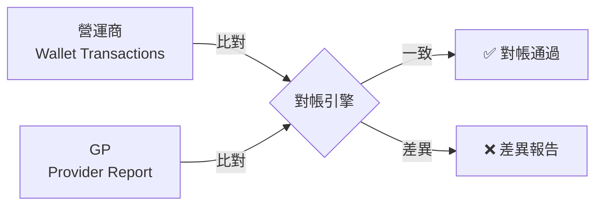

**涉及**:
- 方 1：營運商帳本
- 方 2：供應商報表

**資金性質**: 虛擬貨幣（遊戲積分）
**對帳頻率**: 實時/每小時
**匹配欄位**: transaction_id
**差異原因**: API 超時、掉單

#### 模型 2: 存提款對帳（三方對帳）

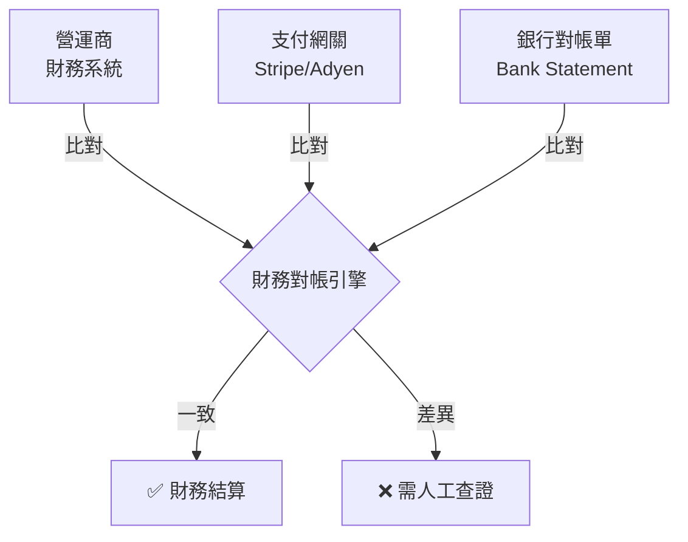

**涉及**:
- 方 1：營運商財務系統
- 方 2：支付網關
- 方 3：銀行對帳單

**資金性質**: 真實貨幣（法幣）
**對帳頻率**: 每日/每週
**匹配欄位**: 金額 + 時間
**差異原因**: 銀行延遲、手續費

### 8.2 三層對帳體系

#### Layer 1: 即時串流對帳 (Real-time Stream Check)

- **時機**：每次收到 `GameEnd` 或 `Settlement` Webhook 後 1-5 分鐘
- **機制**：
    - 透過 GP API 查詢單筆詳情 (`GetTransactionStatus`)
    - 比對 `Amount`, `Status`, `WinLoss`
    - **目的**：快速修復即時掉單 (Latency Issue)

#### Layer 2: 準即時週期對帳 (Near Real-time Batch)

- **時機**：每 10-30 分鐘執行一次
- **機制**：
    - 呼叫 GP 的 `FetchHistory` API (依時間區間 Time Range)
    - 拉取過去 30 分鐘的所有注單
    - 與 DB 進行 `Anti-Join` (找出 GP 有但 DB 無的單)
    - **目的**：補錄 Callback 丟失的注單 (Self-Healing)

#### Layer 3: T+1 全量日結對帳 (Daily Final Settlement)

- **時機**：每日凌晨 (e.g. 02:00)，GP 產出昨日完整報表後
- **機制**：
    - 下載 GP 提供的 Settlement Files (CSV/XML/JSON)
    - 將數據載入 Staging Table
    - 執行 `Full Outer Join` 比對：
        1.  **GP 有，DB 無** -> 補單 (Recover)
        2.  **GP 無，DB 有** -> 標記異常 (Invalid/Rollback)，需人工確認
        3.  **金額不符** -> 產出 `DiffReport`，以 GP 最終結算金額為準進行調帳

### 8.3 異常處理矩陣

| 異常情境 | 系統行為 | 處置方式 |
| :--- | :--- | :--- |
| **補單 (Recover)** | 發現 GP 有單但 DB 無 | 自動建立注單，補扣/補發金額，記錄 Source="Reconciliation" |
| **金額差異 (Diff)** | 雙方金額不一致 | 若差異 < 容差 (e.g. 0.01)，自動平帳；否則 Alert |
| **狀態衝突 (Conflict)** | DB=Win, GP=Loss | 以 **GP 報表** 為準，執行 `Reverse + Re-settle` |
| **幽靈單 (Ghost)** | DB 有單，GP 查無 | 極度危險 (可能是駭客注入)。**凍結帳號**，人工查核 |

### 8.4 對帳數據流向圖

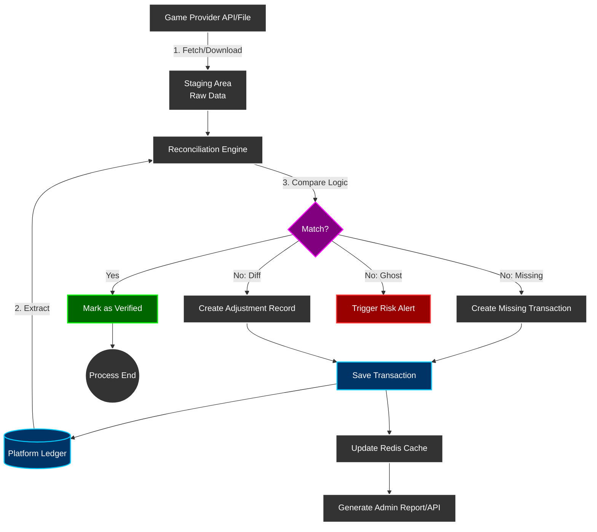

---

## 9. 投注要求追蹤 (Wagering Requirement Tracking)

<!-- SSOT: Withdrawal-time validation, NOT auto-unlock on bet -->

### 9.1 核心決策：取款時驗證

**業界標準流程** (Pragmatic Play / Evolution Gaming):

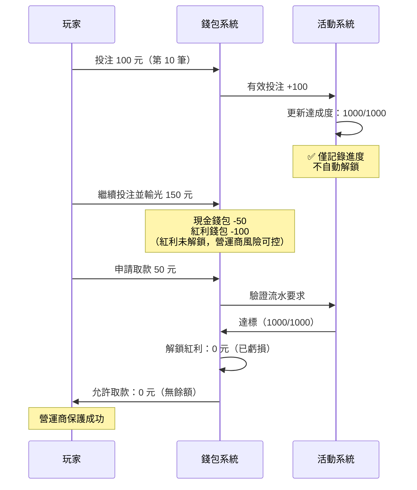

**對比分析** (投注時自動解鎖 vs 取款時驗證):

| 特性 | 投注時自動解鎖 (錯誤) | 取款時驗證 (正確) | 推薦 |
|------|---------------------|-----------------|------|
| **玩家達標後繼續遊戲輸光** | 紅利已解鎖，營運商損失 ❌ | 紅利未解鎖，風險可控 ✅ | ✅ 取款時驗證 |
| **玩家體驗** | 無感知 (隱藏風險) | 取款時明確告知 (透明) | ✅ 取款時驗證 |
| **風控能力** | 低 (無法保護紅利) ❌ | 高 (達標才解鎖) ✅ | ✅ 取款時驗證 |
| **業界標準** | ❌ 不符合 | ✅ 符合 | ✅ 取款時驗證 |
| **實施複雜度** | 中 (需處理自動解鎖邏輯) | 中 (取款驗證邏輯) | 相當 |
| **系統開銷** | 中 (每次達標觸發解鎖) | 低 (僅取款時驗證) | ✅ 取款時驗證 |

### 9.2 流水累積實現方案

**推薦方案: 混合架構（實時累積 + Flink 對帳校驗）**

```yaml
投注時:
  1. 實時計算有效投注額
  2. 寫入 Redis（毫秒級，玩家可即時查詢）
  3. 異步批次寫入 DB（每 10 秒或每 1000 筆）

取款時:
  1. 直接讀取 wagering_progress 表驗證（毫秒級）
  2. 達標則允許取款

後台對帳（Flink）:
  1. 每小時/每日跑 Flink Job
  2. 重新計算流水進度
  3. 與 wagering_progress 表對比
  4. 發現差異則告警 + 自動修正

規則調整:
  1. 使用回推機制重算歷史（異步任務）
  2. 不影響當前玩家體驗
```

**方案對比**:

| 方案 | 用戶體驗 | 取款速度 | 系統複雜度 | 寫入壓力 | 規則調整 | **推薦度** |
|------|---------|---------|-----------|---------|---------|-----------|
| **實時累積** | ⭐⭐⭐⭐⭐ | ⭐⭐⭐⭐⭐ | ⭐⭐⭐ | ⭐⭐ | ⭐⭐⭐ | ✅ **推薦** |
| Flink 計算 | ⭐ | ⭐⭐ | ⭐⭐ | ⭐⭐⭐⭐⭐ | ⭐⭐⭐⭐⭐ | ❌ 不推薦 |
| **混合架構** | ⭐⭐⭐⭐⭐ | ⭐⭐⭐⭐⭐ | ⭐⭐⭐⭐ | ⭐⭐⭐⭐ | ⭐⭐⭐⭐ | ✅ **最佳** |

### 9.3 回推機制實現

<!-- SSOT: Recalculation mechanism for rule changes -->

**必須記錄的元數據** (P0 - MVP):

**數據庫設計**:

```sql
-- wagering_details 表（有效投注明細）
CREATE TABLE wagering_details (
  id BIGINT PRIMARY KEY AUTO_INCREMENT,
  bet_id VARCHAR(64) NOT NULL UNIQUE,
  player_id BIGINT NOT NULL,
  promotion_id BIGINT,

  -- 原始數據（不可變）
  bet_amount DECIMAL(19,4) NOT NULL,
  game_type VARCHAR(32) NOT NULL,
  odds DECIMAL(10,4),
  status VARCHAR(32) NOT NULL,

  -- 計算結果（可重算）
  valid_bet DECIMAL(19,4) NOT NULL,
  game_weight DECIMAL(5,4) NOT NULL,
  contributed_amount DECIMAL(19,4) NOT NULL,

  -- 回推支持
  calculation_version VARCHAR(16) NOT NULL DEFAULT 'v1.0.0',

  -- 審計字段
  created_at TIMESTAMP DEFAULT CURRENT_TIMESTAMP,
  updated_at TIMESTAMP DEFAULT CURRENT_TIMESTAMP ON UPDATE CURRENT_TIMESTAMP,

  INDEX idx_player_promotion (player_id, promotion_id),
  INDEX idx_calculation_version (calculation_version)
);

-- wagering_progress 表（流水要求進度聚合視圖）
CREATE TABLE wagering_progress (
  id BIGINT PRIMARY KEY AUTO_INCREMENT,
  player_id BIGINT NOT NULL,
  promotion_id BIGINT NOT NULL,

  total_requirement DECIMAL(19,4) NOT NULL,
  completed_amount DECIMAL(19,4) NOT NULL DEFAULT 0,
  remaining_amount DECIMAL(19,4) AS (total_requirement - completed_amount) STORED,

  is_completed BOOLEAN AS (completed_amount >= total_requirement) STORED,

  updated_at TIMESTAMP DEFAULT CURRENT_TIMESTAMP ON UPDATE CURRENT_TIMESTAMP,

  UNIQUE KEY uk_player_promotion (player_id, promotion_id)
);

-- recalculation_audit 表（回推審計日誌）
CREATE TABLE recalculation_audit (
  id BIGINT PRIMARY KEY AUTO_INCREMENT,

  player_id BIGINT,
  promotion_id BIGINT,
  start_time TIMESTAMP NOT NULL,
  end_time TIMESTAMP NOT NULL,

  old_rule_version VARCHAR(16) NOT NULL,
  new_rule_version VARCHAR(16) NOT NULL,

  total_affected INT NOT NULL,
  total_changed INT NOT NULL,

  old_total_contributed DECIMAL(19,4),
  new_total_contributed DECIMAL(19,4),
  total_difference DECIMAL(19,4),

  triggered_by VARCHAR(64) NOT NULL,
  created_at TIMESTAMP DEFAULT CURRENT_TIMESTAMP
);
```

**回推重算實現**:

```typescript
/**
 * 回推重算服務
 * 實施優先級: P1 - 強烈推薦
 */
async function recalculateWagering(params: {
  playerId: number;
  promotionId: number;
  startTime: Date;
  endTime: Date;
  newRuleVersion: string;
}): Promise<RecalculationResult> {

  // Step 1: 查詢需要重算的明細記錄
  const details = await db.selectFrom('wagering_details')
    .where('player_id', '=', params.playerId)
    .where('promotion_id', '=', params.promotionId)
    .where('created_at', '>=', params.startTime)
    .where('created_at', '<=', params.endTime)
    .where('calculation_version', '!=', params.newRuleVersion)
    .execute();

  let totalAffected = details.length;
  let totalChanged = 0;
  let oldTotal = 0;
  let newTotal = 0;

  // Step 2: 逐筆重新計算
  for (const detail of details) {
    // 載入原始數據
    const betAmount = detail.bet_amount;
    const gameType = detail.game_type;
    const status = detail.status;

    // 應用新版本規則
    const newGameWeight = getGameWeight(gameType, params.newRuleVersion);
    const newValidBet = calculateValidBet(betAmount, status, params.newRuleVersion);
    const newContributed = newValidBet * newGameWeight;

    // 檢查是否有變更
    if (newContributed !== detail.contributed_amount) {
      totalChanged++;
      oldTotal += detail.contributed_amount;
      newTotal += newContributed;

      // Step 3: 更新記錄
      await db.updateTable('wagering_details')
        .set({
          valid_bet: newValidBet,
          game_weight: newGameWeight,
          contributed_amount: newContributed,
          calculation_version: params.newRuleVersion,
          updated_at: new Date()
        })
        .where('id', '=', detail.id)
        .execute();
    }
  }

  // Step 4: 更新流水進度
  const totalDifference = newTotal - oldTotal;
  await db.updateTable('wagering_progress')
    .set({
      completed_amount: db.raw('completed_amount + ?', [totalDifference])
    })
    .where('player_id', '=', params.playerId)
    .where('promotion_id', '=', params.promotionId)
    .execute();

  // Step 5: 記錄審計日誌
  await db.insertInto('recalculation_audit')
    .values({
      player_id: params.playerId,
      promotion_id: params.promotionId,
      start_time: params.startTime,
      end_time: params.endTime,
      old_rule_version: 'v1.0.0', // 從第一筆記錄取得
      new_rule_version: params.newRuleVersion,
      total_affected: totalAffected,
      total_changed: totalChanged,
      old_total_contributed: oldTotal,
      new_total_contributed: newTotal,
      total_difference: totalDifference,
      triggered_by: 'admin_recalculation'
    })
    .execute();

  return {
    totalAffected,
    totalChanged,
    oldTotalContributed: oldTotal,
    newTotalContributed: newTotal,
    totalDifference
  };
}
```

**實施優先級劃分**:

| 優先級 | 功能組件 | 說明 | 必要性 |
|-------|---------|------|--------|
| **P0 - 必須實現 (MVP)** | wagering_details 表設計 | 記錄原始數據+計算結果，支持審計追溯 | ✅ Critical |
| **P0 - 必須實現 (MVP)** | calculation_version 字段 | 標記計算邏輯版本號，識別需要重算的記錄 | ✅ Critical |
| **P1 - 強烈推薦** | RecalculationService | 回推重算服務，支持規則調整後重新計算 | ⭐ High |
| **P1 - 強烈推薦** | recalculation_audit 表 | 審計日誌，記錄每次回推操作的完整記錄 | ⭐ High |
| **P2 - 可選** | 自動回推任務 | 規則變更時自動觸發回推（需審批流） | 🟡 Medium |
| **P2 - 可選** | 回推結果可視化 | 後台管理界面展示回推結果與差異報告 | 🟡 Medium |

---

## 10. SmartAdmin 架構映射 (Architecture Mapping)

### 10.1 流水計算模組分層設計

SmartAdmin 採用嚴格的五層架構，確保代碼職責清晰、易於測試與維護。

**分層職責表**:

| 層級 | 類名模式 | 職責 | 註解限制 |
|------|---------|------|---------|
| **Controller** | `TurnoverController` | 接收 HTTP 請求，參數校驗，返回 ResponseDTO | 無 @Transactional |
| **Service** | `TurnoverService` | 業務協調，調用 Manager/Dao，返回 Option/Try | 無 @Transactional |
| **Manager** | `TurnoverCalculationManager` | 事務管理，跨表操作，緩存控制 | ✅ @Transactional 僅此層 |
| **Dao** | `BetTurnoverRecordDao` | 數據庫 CRUD，MyBatis Mapper | 無業務邏輯 |
| **Entity** | `BetTurnoverRecordEntity` | 數據模型，與表結構一一對應 | 無業務邏輯 |

**依賴規則** (ArchitectureTest 強制):

```text
Controller → Service (✅ 允許)
Service → Dao      (✅ 允許，單表 CRUD)
Service → Manager  (✅ 允許，需要 @Transactional 時)
Manager → Dao      (✅ 允許)

Controller → Dao   (❌ 禁止，違反分層)
Controller → Manager (❌ 禁止，違反分層)
```

### 10.2 實體層 (Entity Layer)

**BetTurnoverRecordEntity.java**:

```java
@Data
@TableName("t_bet_turnover_record")
public class BetTurnoverRecordEntity extends SmartBaseEntity {

    @TableId(type = IdType.AUTO)
    private Long id;

    /** 注單ID */
    private String betId;

    /** 玩家ID */
    private Long playerId;

    /** 遊戲類型 */
    private String gameType;

    // ========== Layer 1 結果 (v2.1.0 更新) ==========
    /** 有效投注基數 (Layer 1 風控引擎輸出) */
    private BigDecimal effectiveTurnoverBase;

    /** 風控動作類型: BLOCK/FLAG/PASS (v2.1.0) */
    private String actionType;

    /** 匹配的規則列表 (v2.1.0) */
    private String matchedRules; // JSON array

    /** 風控提案ID (v2.1.0) */
    private String riskProposalId;

    // ========== Layer 2 結果 ==========
    /** 注單狀態 */
    private String status;

    /** 狀態因子 */
    private BigDecimal statusFactor;

    /** 財務有效流水 (Layer 2 輸出) */
    private BigDecimal validTurnoverFinance;

    // ========== Layer 3 結果 ==========
    /** 活動有效流水 (Layer 3 輸出，若有活動) */
    private BigDecimal activityValidTurnover;

    /** 遊戲權重 */
    private BigDecimal gameWeight;

    // ========== 審計字段 ==========
    /** 計算時間 */
    private LocalDateTime calculatedAt;

    /** 三層計算明細 (JSON) */
    private String layerBreakdown;
}
```

### 10.3 DAO 層 (Data Access Layer)

**BetTurnoverRecordDao.java**:

```java
@Mapper
public interface BetTurnoverRecordDao extends BaseMapper<BetTurnoverRecordEntity> {

    /**
     * 根據玩家ID與日期查詢流水記錄
     */
    List<BetTurnoverRecordEntity> selectByPlayerIdAndDate(
        @Param("playerId") Long playerId,
        @Param("date") LocalDate date
    );

    /**
     * 根據注單ID查詢流水記錄
     */
    BetTurnoverRecordEntity selectByBetId(@Param("betId") String betId);

    /**
     * 批次插入流水記錄
     */
    int batchInsert(@Param("list") List<BetTurnoverRecordEntity> list);
}
```

**BetTurnoverRecordDao.xml** (MyBatis Mapper):

```xml
<?xml version="1.0" encoding="UTF-8"?>
<!DOCTYPE mapper PUBLIC "-//mybatis.org//DTD Mapper 3.0//EN"
        "http://mybatis.org/dtd/mybatis-3-mapper.dtd">
<mapper namespace="net.lab1024.sa.admin.module.business.finance.turnover.dao.BetTurnoverRecordDao">

    <!-- 根據玩家ID與日期查詢流水記錄 -->
    <select id="selectByPlayerIdAndDate" resultType="net.lab1024.sa.admin.module.business.finance.turnover.domain.entity.BetTurnoverRecordEntity">
        SELECT *
        FROM t_bet_turnover_record
        WHERE player_id = #{playerId}
          AND DATE(calculated_at) = #{date}
          AND deleted = 0
        ORDER BY calculated_at DESC
    </select>

    <!-- 根據注單ID查詢流水記錄 -->
    <select id="selectByBetId" resultType="net.lab1024.sa.admin.module.business.finance.turnover.domain.entity.BetTurnoverRecordEntity">
        SELECT *
        FROM t_bet_turnover_record
        WHERE bet_id = #{betId}
          AND deleted = 0
        LIMIT 1
    </select>
</mapper>
```

### 10.4 Manager 層 (Transaction Management Layer)

**TurnoverCalculationManager.java**:

```java
@Service
@RequiredArgsConstructor
public class TurnoverCalculationManager {

    private final BetTurnoverRecordDao betTurnoverRecordDao;
    private final RedissonClient redissonClient;
    private final KafkaTemplate<String, String> kafkaTemplate;

    /**
     * 計算並記錄流水（帶事務）
     * v2.1.0: 支援配置驅動風控 (BLOCK/FLAG/PASS)
     */
    @Transactional(rollbackFor = Throwable.class)
    public BetTurnoverRecordEntity calculateAndRecord(
        String betId,
        Long playerId,
        String gameType,
        BigDecimal betAmount,
        String status,
        BigDecimal odds
    ) {
        // Step 1: 分佈式鎖防止重複計算
        RLock lock = redissonClient.getLock("turnover:calc:" + betId);
        if (!lock.tryLock()) {
            throw new BusinessException("重複計算流水");
        }

        try {
            // Step 2: 調用 Layer 1 風控引擎
            RiskValidationResult riskResult = riskEngineClient.validateTurnover(
                betId, playerId, gameType, betAmount, odds
            );

            // Step 2.1: BLOCK規則直接短路返回
            if (!riskResult.isValid() && "BLOCK".equals(riskResult.getActionType())) {
                return createBlockedRecord(betId, playerId, riskResult);
            }

            // Step 2.2: FLAG規則記錄風控標記
            if ("FLAG".equals(riskResult.getActionType())) {
                recordRiskFlag(betId, riskResult.getRiskProposalId());
            }

            // Step 3: Layer 2 財務狀態因子
            BigDecimal statusFactor = getStatusFactor(status);
            BigDecimal validTurnoverFinance = riskResult.getEffectiveTurnoverBase()
                .multiply(statusFactor);

            // Step 4: Layer 3 活動權重（若有活動）
            BigDecimal gameWeight = getGameWeight(gameType);
            BigDecimal activityValidTurnover = validTurnoverFinance.multiply(gameWeight);

            // Step 5: 記錄流水（三層結果）
            BetTurnoverRecordEntity record = new BetTurnoverRecordEntity();
            record.setBetId(betId);
            record.setPlayerId(playerId);
            record.setGameType(gameType);

            // Layer 1 結果
            record.setEffectiveTurnoverBase(riskResult.getEffectiveTurnoverBase());
            record.setActionType(riskResult.getActionType());
            record.setMatchedRules(JSON.toJSONString(riskResult.getMatchedRules()));
            record.setRiskProposalId(riskResult.getRiskProposalId());

            // Layer 2 結果
            record.setStatus(status);
            record.setStatusFactor(statusFactor);
            record.setValidTurnoverFinance(validTurnoverFinance);

            // Layer 3 結果
            record.setGameWeight(gameWeight);
            record.setActivityValidTurnover(activityValidTurnover);

            record.setCalculatedAt(LocalDateTime.now());

            // 插入數據庫
            betTurnoverRecordDao.insert(record);

            // Step 6: 發布事件至 Kafka
            kafkaTemplate.send("finance.turnover.calculated", betId, JSON.toJSONString(record));

            return record;

        } finally {
            lock.unlock();
        }
    }

    /**
     * 查詢流水記錄（帶緩存）
     */
    @Cacheable(value = "turnover", key = "#betId")
    public Option<BetTurnoverRecordEntity> getTurnoverByBetId(String betId) {
        return Option.of(betTurnoverRecordDao.selectByBetId(betId));
    }
}
```

### 10.5 Service 層 (Business Logic Layer)

**TurnoverService.java**:

```java
@Service
@RequiredArgsConstructor
public class TurnoverService {

    private final TurnoverCalculationManager turnoverCalculationManager;
    private final BetTurnoverRecordDao betTurnoverRecordDao;

    /**
     * 計算流水（業務協調）
     */
    public Option<BetTurnoverRecordEntity> calculateTurnover(
        String betId,
        Long playerId,
        String gameType,
        BigDecimal betAmount,
        String status,
        BigDecimal odds
    ) {
        // 參數校驗
        if (StringUtils.isBlank(betId)) {
            return Option.none();
        }

        // 檢查是否已計算
        Option<BetTurnoverRecordEntity> existing =
            turnoverCalculationManager.getTurnoverByBetId(betId);
        if (existing.isDefined()) {
            return existing;
        }

        // 調用 Manager 計算
        try {
            BetTurnoverRecordEntity record = turnoverCalculationManager.calculateAndRecord(
                betId, playerId, gameType, betAmount, status, odds
            );
            return Option.of(record);
        } catch (Exception e) {
            log.error("計算流水失敗: betId={}", betId, e);
            return Option.none();
        }
    }

    /**
     * 查詢玩家流水記錄
     */
    public List<BetTurnoverRecordEntity> getPlayerTurnover(Long playerId, LocalDate date) {
        return betTurnoverRecordDao.selectByPlayerIdAndDate(playerId, date);
    }
}
```

### 10.6 Controller 層 (HTTP Interface Layer)

**TurnoverController.java**:

```java
@RestController
@Api(tags = "流水計算")
@RequiredArgsConstructor
public class TurnoverController {

    private final TurnoverService turnoverService;

    /**
     * 查詢玩家流水記錄
     */
    @GetMapping("/api/turnover/player/{playerId}")
    @ApiOperation("查詢玩家流水")
    public ResponseDTO<List<BetTurnoverRecordEntity>> getPlayerTurnover(
        @PathVariable Long playerId,
        @RequestParam @DateTimeFormat(pattern = "yyyy-MM-dd") LocalDate date
    ) {
        List<BetTurnoverRecordEntity> records =
            turnoverService.getPlayerTurnover(playerId, date);
        return ResponseDTO.ok(records);
    }

    /**
     * 查詢單筆注單流水
     */
    @GetMapping("/api/turnover/bet/{betId}")
    @ApiOperation("查詢注單流水")
    public ResponseDTO<BetTurnoverRecordEntity> getTurnoverByBet(@PathVariable String betId) {
        Option<BetTurnoverRecordEntity> record =
            turnoverService.calculateTurnover(betId, null, null, null, null, null);

        return record.map(ResponseDTO::ok)
            .getOrElse(() -> ResponseDTO.error(ErrorCodeEnum.DATA_NOT_EXIST));
    }
}
```

### 10.7 Foundation 模組依賴

流水計算模組依賴以下 SmartAdmin Foundation 模組:

| Foundation 模組 | 用途 | 引用位置 |
|----------------|------|---------|
| **foundation.redis-lock** | 分佈式鎖，防止重複計算 | TurnoverCalculationManager |
| **foundation.cache** | Caffeine + Redis 緩存 | TurnoverCalculationManager.getTurnoverByBetId() |
| **foundation.audit-log** | 審計日誌記錄 | 流水計算完成後自動記錄 |
| **foundation.mq** | Kafka 事件發布 | 流水計算完成後發布 finance.turnover.calculated 事件 |
| **foundation.retry** | 失敗重試策略 | Risk Engine 調用失敗時重試 |

**引用示例 (RedisLock)**:

```java
// 使用 Redisson 分佈式鎖
RLock lock = redissonClient.getLock("turnover:calc:" + betId);
try {
    if (lock.tryLock(3, 10, TimeUnit.SECONDS)) {
        // 執行計算邏輯
    } else {
        throw new BusinessException("獲取鎖失敗");
    }
} finally {
    lock.unlock();
}
```

### 10.8 ArchitectureTest 驗證規則

以下 ArchUnit 規則確保流水計算模組符合 SmartAdmin 架構規範:

```java
@AnalyzeClasses(packages = "net.lab1024.sa.admin.module.business.finance.turnover")
public class TurnoverModuleArchitectureTest {

    /**
     * 規則1: Controller 不得直接調用 Dao
     */
    @ArchTest
    static final ArchRule controllers_should_not_access_daos =
        noClasses()
            .that().resideInAPackage("..controller..")
            .should().dependOnClassesThat().resideInAPackage("..dao..");

    /**
     * 規則2: @Transactional 僅允許在 Manager 層
     */
    @ArchTest
    static final ArchRule transactional_only_in_manager =
        methods()
            .that().areAnnotatedWith(Transactional.class)
            .should().beDeclaredInClassesThat().resideInAPackage("..manager..");

    /**
     * 規則3: Service 必須返回 Option/Try（不允許 null）
     */
    @ArchTest
    static final ArchRule service_should_return_option_or_try =
        methods()
            .that().areDeclaredInClassesThat().resideInAPackage("..service..")
            .and().arePublic()
            .should().haveRawReturnType(Option.class).orShould().haveRawReturnType(Try.class);

    /**
     * 規則4: Controller 必須使用 @RequiredArgsConstructor (禁止 @Autowired)
     */
    @ArchTest
    static final ArchRule controller_should_use_constructor_injection =
        noFields()
            .that().areDeclaredInClassesThat().resideInAPackage("..controller..")
            .should().beAnnotatedWith(Autowired.class);
}
```

---

## 11. 完整時序圖與流程圖

### 11.1 流水計算完整時序 (End-to-End Turnover Calculation Sequence)

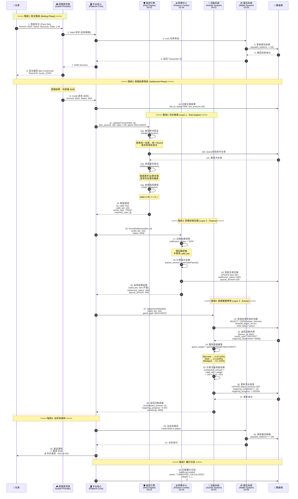

### 11.2 流水計算主流程 (Main Turnover Calculation Flow)

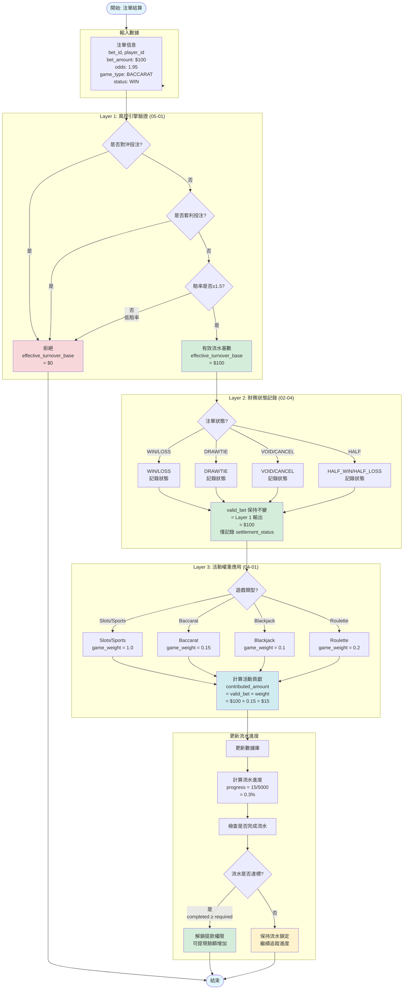

### 11.3 注單生命週期狀態機 (Bet Lifecycle State Machine)

```mermaid
stateDiagram-v2
    direction TB

    state "Pending (待處理)" as S_Pending
    state "Running (進行中)" as S_Running
    state "Settlement (結算中心)" as S_Settlement
    state "Turnover Calc (流水計算)" as S_Turnover

    [*] --> S_Pending : 玩家下注<br/>(扣除餘額)

    note right of S_Pending : Status: PENDING<br/>Turnover: 0<br/>Reason: 等待GP確認

    S_Pending --> S_Running : GP確認接受<br/>(遊戲開始)

    note right of S_Running : Status: RUNNING<br/>Turnover: 0<br/>Reason: 賽果未出

    S_Running --> S_Settlement : 接收賽果

    state S_Settlement {
        direction TB
        state "WIN (贏)" as Res_Win
        state "LOSS (輸)" as Res_Loss
        state "DRAW (和)" as Res_Draw
        state "VOID (作廢)" as Res_Void
        state "CANCEL (取消)" as Res_Cancel

        [*] --> Res_Win
        [*] --> Res_Loss
        [*] --> Res_Draw
        [*] --> Res_Void
        [*] --> Res_Cancel

        note right of Res_Win : 賠付因子 > 1.0<br/>流水 100%
        note right of Res_Draw : 賠付因子 1.0<br/>流水 0%
    }

    S_Settlement --> Paid : WIN (派彩)
    S_Settlement --> Completed : LOSS (結算)
    S_Settlement --> Refunded : DRAW/VOID (退款)

    state S_Turnover {
        state "Valid Turnover (有效流水)" as TO_Yes
        state "Ignored Turnover (無效流水)" as TO_No

        Paid --> TO_Yes : 贏單計入
        Completed --> TO_Yes : 輸單計入
        Refunded --> TO_No : 退款不計
    }

    TO_Yes --> [*]
    TO_No --> [*]
```

### 11.4 實際計算範例：百家樂投注

**場景**: 玩家參與「首存100%紅利」活動，需完成 5x 流水要求。

**投注詳情**:
- **存款金額**: $1,000
- **紅利金額**: $1,000 (100% Match)
- **流水要求**: ($1,000 + $1,000) × 5 = **$10,000**
- **當前投注**: 百家樂投注 $100，賠率 1.95，結果 WIN

**計算流程**:

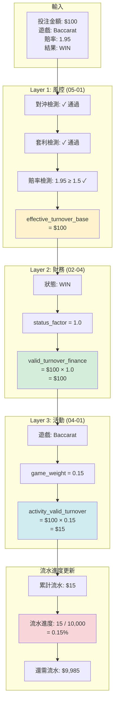

**結論**:
- ✅ 風控驗證通過
- ✅ 財務流水: $100
- ⚠️ 活動流水: $15 (僅15%貢獻)
- ⚠️ 需要更多投注才能完成流水要求

---

## 12. 監控與告警

### 12.1 關鍵監控指標

```yaml
metrics:
  # 流水計算性能
  - name: finance.turnover.calculation.latency_p99
    type: histogram
    description: 流水計算延遲 (P99)
    unit: milliseconds
    target: "< 100ms"
    alert:
      - condition: p99 > 500ms
        severity: critical
        message: "流水計算延遲過高，影響 API 響應"

  # 風控引擎調用成功率
  - name: finance.turnover.risk_engine.call.success_rate
    type: gauge
    description: 風控引擎調用成功率
    calculation: "successful_calls / total_calls"
    target: "> 99.9%"
    alert:
      - condition: rate < 99%
        severity: critical
        message: "風控引擎調用失敗率過高"

  # 每日對帳偏差率
  - name: finance.turnover.daily_reconciliation.deviation_rate
    type: gauge
    description: 每日對帳偏差率
    calculation: "abs(finance_total - activity_total) / finance_total"
    target: "< 0.01%"
    alert:
      - condition: rate > 0.01%
        severity: warning
        message: "每日對帳偏差超過閾值"

  # 事件發布成功率
  - name: finance.turnover.event_publish.success_rate
    type: gauge
    description: Kafka 事件發布成功率
    target: "> 99.99%"
    alert:
      - condition: rate < 99.9%
        severity: critical
        message: "事件發布失敗率過高"

  # 流水要求達成監控
  - name: wagering_progress_rate
    type: gauge
    description: 流水要求達成率（CurrentValidBet / TotalRequirement）
    labels:
      - user_id
      - promotion_id
    alert:
      - condition: rate < 0.1 AND days_to_expire < 1
        severity: warning
        message: "玩家流水進度過慢，活動即將過期"

  # 取款驗證拒絕率
  - name: wagering_verification_rejection_rate
    type: gauge
    description: 取款時流水要求未達標拒絕率
    calculation: "rejected_withdrawals / total_withdrawals"
    target: "監控趨勢"
    alert:
      - condition: rate suddenly increases by > 50%
        severity: critical
        message: "取款拒絕率突然上升，可能規則配置錯誤"
```

### 12.2 警報規則

```yaml
alerts:
  - name: turnover_calculation_latency_high
    condition: finance.turnover.calculation.latency_p99 > 500ms
    severity: WARNING
    notify: slack:#finance-ops

  - name: risk_engine_call_failure
    condition: finance.turnover.risk_engine.call.success_rate < 99%
    severity: CRITICAL
    notify: pagerduty:finance-oncall

  - name: daily_reconciliation_deviation
    condition: finance.turnover.daily_reconciliation.deviation_rate > 0.01
    severity: WARNING
    notify: slack:#finance-ops, email:finance-team@company.com

  - name: event_publish_failure
    condition: finance.turnover.event_publish.success_rate < 99.9
    severity: CRITICAL
    notify: pagerduty:finance-oncall

  - name: wagering_progress_slow
    condition: wagering_progress_rate < 0.1 AND days_to_expire < 1
    severity: INFO
    notify: slack:#promotion-ops
```

---

## 13. 變更日誌 (Change Log)

### v2.1.0 (2026-02-02)

**重大變更**:
1. ✅ **Major #5**: 更新 Layer 1 處理流程以支援配置驅動風控
   - 新增 action_type (BLOCK/FLAG/PASS) 支援
   - BLOCK 規則實時阻斷（返回流水 = 0）
   - FLAG 規則標記但允許（正常計算流水 + 生成風控提案）
   - 更新返回結構：`matched_rules[]` 取代 `risk_code`
   - 新增 `risk_proposal_id` 欄位用於追蹤風控提案

2. ✅ **Integration**: 與 05-01 風控系統 v2.1.0 配置驅動架構集成
   - 支援 t_risk_rule_config 配置表驅動規則
   - 支援多維度風控規則（遊戲類型、個別遊戲、個別玩家）

**資料模型變更**:
- `bet_turnover_record` 表新增欄位：
  - `action_type VARCHAR(20)` - 風控動作類型
  - `matched_rules JSON` - 匹配的規則列表
  - `risk_proposal_id VARCHAR(50)` - 風控提案 ID

**向下相容**:
- Layer 2/3 處理流程保持不變
- 僅 Layer 1 API 變更（內部實現）

### v2.0.0 (2026-01-29)

**重大變更**:
1. ✅ **Major #4 修正**: 澄清三層驗證架構職責
   - Layer 1 拒絕後直接短路返回，不進入 Layer 2/3
   - 明確職責矩陣: Layer 1 = 拒絕決策, Layer 2 = 狀態調整, Layer 3 = 權重應用
   - 性能優化: 節省 ~5% CPU 與 DB 查詢

2. ✅ **Major #3 修正**: 新增 SmartAdmin 架構映射
   - 完整五層架構代碼示例 (Entity/Dao/Manager/Service/Controller)
   - Foundation 模組依賴說明 (redis-lock, cache, audit-log, mq, retry)
   - ArchitectureTest 驗證規則

3. ✅ **Major #2 修正**: 免費旋轉流水計算標準化
   - Turnover = 面額總和（符合業界標準）
   - Valid Bet = 0（不計入流水要求）

4. ✅ **Major #1 修正**: 取款時驗證流水要求
   - 投注時僅累積進度，不自動解鎖
   - 取款時驗證達標才解鎖紅利

**向下兼容**:
- v1.x API 保持不變，僅內部實現優化

### v1.0.0 (2026-01-28)

**初始版本**:
- 流水計算邏輯 (§1-6)
- 遊戲對帳邏輯 (§8)
- 流程圖與數據流向圖 (§11)
- HALF_WIN/HALF_LOSS = 100% 流水 (標準本金法)

---

## 📚 相關文檔

### 前置依賴
- [00-03 術語標準化](../00_Concept_&_Analysis/00-03_Terminology_Standards.md) - **必讀**
- [01-02 錢包架構](../01_Core_Financial_Loop_NEW/01-02_Wallet_Architecture.md) - 統一錢包模型、可下注餘額公式、扣款優先級

### 核心依賴
- [05-01 風控系統](../05_Risk_Management/05-01_Risk_Control_System.md) - Layer 1 風控引擎
<!-- TODO: 待創建文檔 - Week 4-5 -->
<!-- - [04-01 活動系統](../04_Activity_Center/04-01_Activity_System_Design.md) - Layer 3 活動系統 -->

### 延伸閱讀
- [03-03 無縫錢包分析](../03_Game_Center/03-03_Seamless_Wallet_Analysis.md) - GP API 規範
- [02-03 對帳系統](../02_Finance_Center/02-03_Reconciliation_System.md) - 財務對帳

---

**文檔版本**: 2.1.0
**最後更新**: 2026-02-02
**維護團隊**: Finance Team & Backend Team & Risk Team
**重大變更**: v2.1.0 Layer 1 支援配置驅動風控（BLOCK/FLAG/PASS），與 05-01 風控系統 v2.1.0 集成
