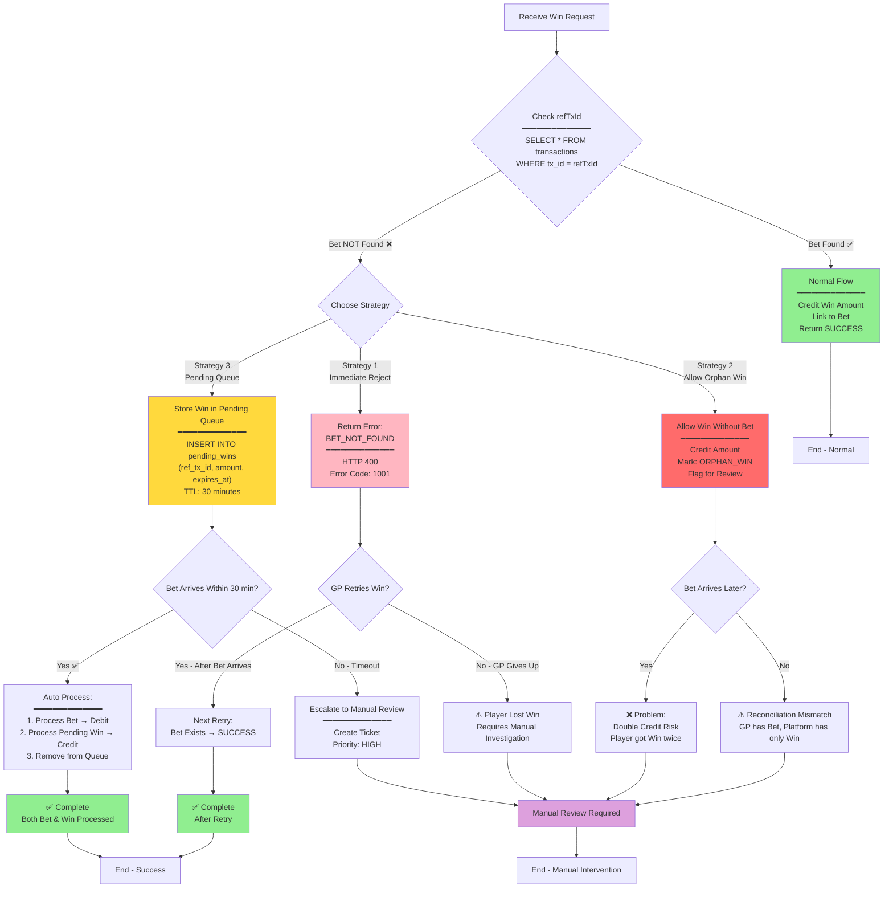
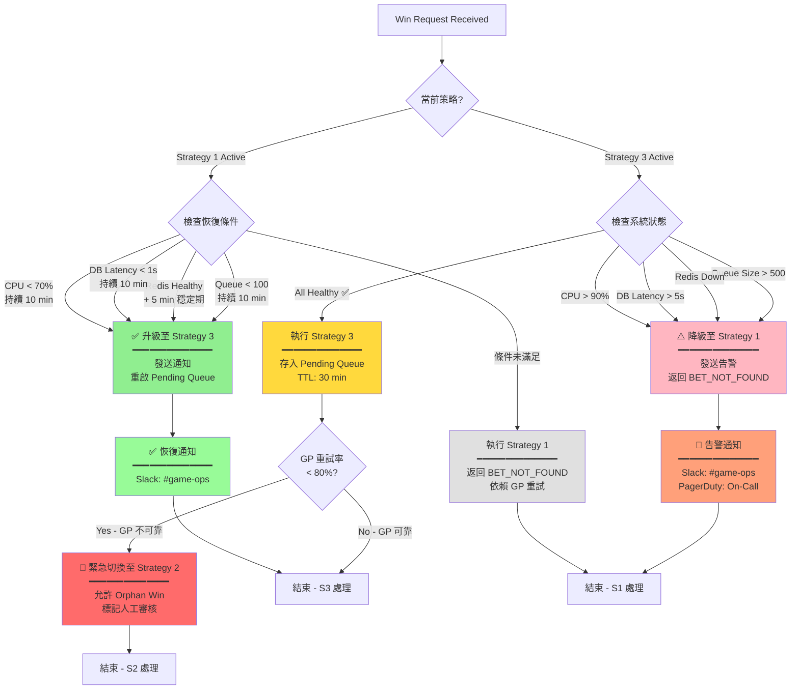
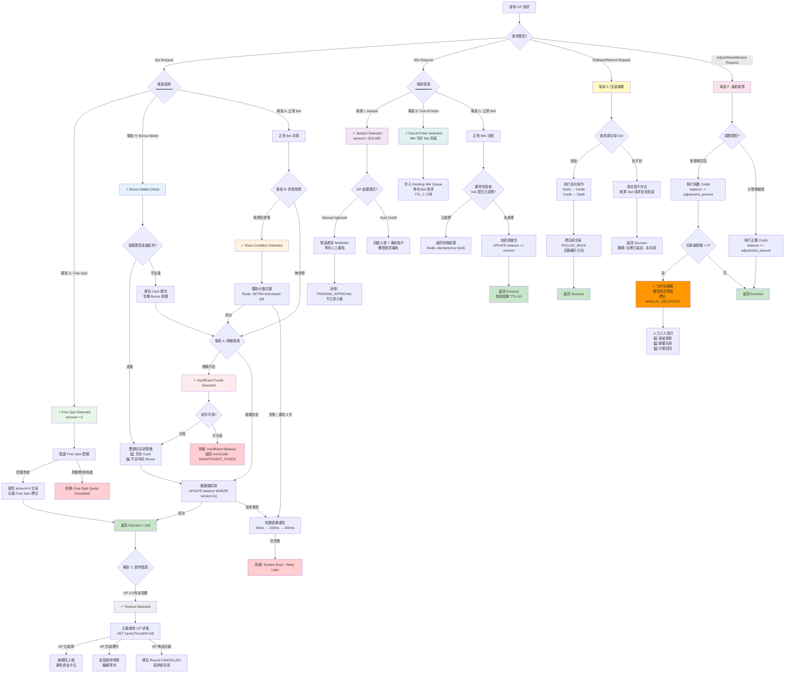

# 03-02 無縫錢包與遊戲商對接分析 (Seamless Wallet & GP Integration Analysis)

這份文件旨在深入分析無縫錢包（Seamless Wallet / Single Wallet）在與各類遊戲供應商（Game Provider, GP）對接時可能遇到的複雜場景、異常處理與設計缺失。

> [!IMPORTANT]
> 本文件僅作為**需求確認與架構分析**，不涉及具體程式碼實作。

## 1. 遊戲商整合類型缺失分析 (Missing Integration Types)

目前的 `03-01` 標準主要覆蓋了通用的 RESTful API 模式，但實際市場上的 GP 對接方式更為多元，現有文檔缺少對以下類型的詳細定義：

### 1.1 交易模型差異
| 類型 | 描述 | 代表廠商 | 潛在問題 |
| :--- | :--- | :--- | :--- |
| **Transaction-Based** | 每次請求都是一筆獨立交易 (Debit/Credit)，包含 `Amount` (正負值) 或 `Type`。 | PG Soft, JILI | 最標準，易於實作。需注意 `TransactionId` 全局唯一性。 |
| **Round-Based** | 請求綁定 `RoundId`。Bet 開啟 Round，Win 關閉 Round。 | Evolution, Pragmatic Play | **狀態一致性**挑戰：若 Bet 成功但 Win 丟失，Round 會卡在 "Open" 狀態。需實作排程檢查 Open Rounds。 |
| **Transfer-Based** | 舊式架構，模擬「轉入/轉出」。API 動作為 `TransferIn` / `TransferOut`。 | 某些老牌體育盤 | 語義混淆，容易與「轉帳錢包」搞混。需確保該動作是自動觸發而非人工。 |
| **Result-Only** | 僅發送遊戲結果 (Win/Loss Amount)，不區分 Bet/Win 動作。 | 某些彩票/棋牌 | **風控困難**：無法在下注當下校驗餘額（可能導致扣成負數後補扣）。 |

### 1.2 錢包行為差異
| 行為 | 描述 | 應對策略 |
| :--- | :--- | :--- |
| **GetBalance Only** | GP 不調用扣款接口，僅查詢餘額。餘額變動完全由 GP 內部記錄，定期 Settlement。 | **極高風險**。通常不建議接入此類，除非是信用盤模式。 |
| **Async Callback** | 平台回覆 HTTP 200 僅代表「收到請求」，實際扣款結果需透過 Callback 通知 GP。 | 需實作**雙向狀態機**，流程複雜度倍增。 |
| **Batch Processing** | GP 將多筆各別玩家的注單合併為一個 HTTP Request 發送。 | 需支援**批量交易處理**，任一筆失敗是否導致全批回滾？(All-or-Nothing vs Partial Success)。 |

#### 1.2.1 Round-Based 狀態機 (Round State Machine)

對於 **Round-Based** 交易模型（如 Evolution, Pragmatic Play），Round 狀態管理是關鍵挑戰。以下狀態機展示了 Round 的完整生命週期：

```mermaid
stateDiagram-v2
    [*] --> IDLE: No Active Round

    IDLE --> OPEN: Bet Request Received\n━━━━━━━━━━━━━━\nAction: Debit Balance\nCreate Round Record\nStatus = OPEN

    state OPEN {
        [*] --> WaitingWin: Bet Success
        WaitingWin --> WaitingWin: Additional Bet (Same Round)\n累加投注額
    }

    OPEN --> CLOSED: Win Request Received\n━━━━━━━━━━━━━━\nAction: Credit Balance\nUpdate Round\nStatus = CLOSED

    OPEN --> CANCELLED: Rollback Request\n━━━━━━━━━━━━━━\nAction: Refund Bet\nStatus = CANCELLED

    OPEN --> TIMEOUT: No Win After 2 Hours\n━━━━━━━━━━━━━━\n⚠️ Orphaned Round\nTrigger: Scheduled Job

    state TIMEOUT {
        [*] --> QueryGP: Query GP API\nGET /round/{id}/status
        QueryGP --> GPClosed: GP Status = CLOSED
        QueryGP --> GPPending: GP Status = PENDING
        QueryGP --> GPError: GP API Error
    }

    GPClosed --> CLOSED: Auto Close Round\n━━━━━━━━━━━━━━\nCredit Win Amount\nSource: GP Query

    GPPending --> PENDING_REVIEW: Manual Review Required\n━━━━━━━━━━━━━━\nNotify CS Team\nEscalate if > $1000

    GPError --> PENDING_REVIEW

    state PENDING_REVIEW {
        [*] --> CSReview: CS Agent Investigation
        CSReview --> ManualClose: Approve Close
        CSReview --> ManualCancel: Approve Cancel
    }

    ManualClose --> CLOSED
    ManualCancel --> CANCELLED

    CLOSED --> ADJUSTED: Resettlement Request\n━━━━━━━━━━━━━━\nAction: Adjust Balance\nStatus = ADJUSTED

    ADJUSTED --> [*]
    CLOSED --> [*]
    CANCELLED --> [*]

    note right of TIMEOUT : Scheduled Job:\n- Run every 15 minutes\n- Check Rounds WHERE status=OPEN\n  AND created_at < NOW() - 2 hours\n- Query GP API for final status

    note right of PENDING_REVIEW : Manual Review Criteria:\n- Round Amount > $1000: HIGH Priority\n- Round Amount < $1000: MEDIUM Priority\n- SLA: 24 hours response
```

**Round 狀態轉換關鍵邏輯**：

| 狀態 | 觸發條件 | 自動化動作 | 人工干預 |
|------|---------|-----------|---------|
| **OPEN** | Bet 請求成功 | 扣款 + 創建 Round 記錄 | 無 |
| **CLOSED** | Win 請求成功 | 加款 + 關閉 Round | 無 |
| **TIMEOUT** | Open > 2 小時無 Win | 查詢 GP API | 若 GP API 失敗則轉 PENDING_REVIEW |
| **PENDING_REVIEW** | GP 狀態未知 | 創建 CS 工單 | 必須（CS 手動關閉或取消） |
| **CANCELLED** | Rollback 請求 | 退款 + 標記取消 | 無 |
| **ADJUSTED** | Resettlement 請求 | 調整餘額（可能為負） | 若導致負餘額則觸發風控鎖定 |

**常見問題處理**：

1. **孤兒 Round (Orphaned Round)**: Bet 成功但 Win 永遠不來
   - **檢測**: 定時任務每 15 分鐘掃描 OPEN 狀態 > 2 小時的 Round
   - **處理**: 查詢 GP API 獲取最終狀態 → 自動關閉或人工審核

2. **重複 Win**: GP 重試發送 Win 請求
   - **防護**: `(roundId, txId)` 唯一約束 + 冪等性檢查
   - **回應**: 返回第一次執行結果，不重複加款

3. **Resettlement 導致負餘額**: GP 扣回多發的派彩
   - **處理**: 允許負餘額 + 自動鎖定帳戶 + 觸發風控告警（參考 §4.2 負餘額處理）

---

## 2. 無縫錢包投注場景矩陣 (Betting Scenario Matrix)

以下是 "Step by Step" 推演的各種情況，從正常流程到極端異常。

### 2.1 正常交易流程 (Happy Path)
1. **Bet (Debit)**:
   - GP 請求 `Debit(user, amount, roundId, txId)`。
   - 平台：檢查餘額 >= amount -> 扣款 -> 記錄 Transaction -> 回傳 New Balance。
2. **Win (Credit)**:
   - GP 請求 `Credit(user, amount, roundId, txId, refTxId)`。
   - 平台：加款 -> 記錄 Transaction -> 回傳 New Balance。 (注意：`refTxId` 關聯到原本的 Bet)。

### 2.2 餘額與並發問題 (Balance & Concurrency)
- **場景 A：餘額不足 (Insufficient Funds)**
    - 玩家餘額 100，下注 200。
    - **平台行為**：回傳特定錯誤碼 (如 `INSUFFICIENT_FUNDS`)。
    - **GP 行為**：顯示餘額不足，阻止遊戲進行。
- **場景 B：並發扣款 (Race Condition)**
    - 玩家餘額 100。同時發送兩個 80 的注單請求 (Thread A, Thread B)。
    - **風險**：若無鎖，讀取餘額都是 100，都判斷足夠，扣款後餘額變成 -60。
    - **解決方案**：
        - Database Row Lock (`SELECT ... FOR UPDATE`)。
        - Redis Lua Script (Atomic Check-and-Set)。
        - Optimistic Lock (`UPDATE wallet SET balance = balance - 80 WHERE id = x AND balance >= 80`)。

### 2.3 網絡異常與冪等性 (Network Internet & Idempotency)

#### 場景 C：超時重試 (Timeout & Retry)

**問題描述**: GP 發送 `Debit` → 平台扣款成功 → 平台回傳 Response 丟失 (Timeout) → GP 未收到回應，認為狀態未知，發起**重試 (Retry)** (帶有相同的 `txId`)。

**平台行為** (關鍵)：
- 檢查 `txId` 是否已存在。
- **存在**：直接回傳該筆交易之前的執行結果 (Success, Balance)，**不可重複扣款**。
- **不存在**：視為新交易執行。

**詳細時序圖**：

```mermaid
sequenceDiagram
    participant GP as Game Provider
    participant GW as API Gateway
    participant Platform as Wallet Service
    participant Redis as Redis Cache
    participant DB as Database

    Note over GP,DB: Scenario C: Timeout & Retry with Idempotency

    rect rgb(255, 230, 230)
        Note over GP,DB: First Attempt - Timeout Occurs

        GP->>GW: POST /debit\n{txId: "TX001", amount: 100}
        GW->>Platform: validateRequest(txId, amount)

        Platform->>Redis: GET idempotency:TX001
        Redis-->>Platform: null (Not Exists)

        Platform->>DB: BEGIN TRANSACTION

        Platform->>DB: SELECT balance FROM wallet\nWHERE player_id = ? FOR UPDATE
        DB-->>Platform: balance = 500

        Platform->>DB: UPDATE wallet\nSET balance = 400\nWHERE player_id = ?
        DB-->>Platform: OK (1 row affected)

        Platform->>DB: INSERT INTO transactions\n(tx_id, type, amount, balance_after)\nVALUES ('TX001', 'DEBIT', 100, 400)
        DB-->>Platform: OK

        Platform->>DB: COMMIT

        Platform->>Redis: SETEX idempotency:TX001\nvalue: {status: SUCCESS, balance: 400}\nTTL: 3600
        Redis-->>Platform: OK

        Platform->>GW: Response: {status: SUCCESS, balance: 400}

        Note over GW,GP: ⚠️ Network Error - Response Lost!
        GW-xGP: TCP Connection Reset / Timeout

        Note over GP: GP receives TIMEOUT<br/>Status Unknown<br/>Decide to RETRY
    end

    rect rgb(230, 255, 230)
        Note over GP,DB: Second Attempt - Idempotent Retry (Same txId)

        GP->>GW: POST /debit\n{txId: "TX001", amount: 100}\n⚠️ SAME txId

        GW->>Platform: validateRequest(txId, amount)

        Platform->>Redis: GET idempotency:TX001
        Redis-->>Platform: {status: SUCCESS, balance: 400}\n✅ EXISTS!

        Note over Platform: Idempotency Check PASSED<br/>Return Cached Response<br/>NO Database Operation!

        Platform-->>GW: Response: {status: SUCCESS, balance: 400}\nSource: CACHED

        GW-->>GP: Response: {status: SUCCESS, balance: 400}

        Note over GP: Retry SUCCESS<br/>Received Response<br/>Player Balance: 400 ✅
    end

    rect rgb(230, 230, 255)
        Note over GP,DB: Third Attempt - Different txId (New Transaction)

        GP->>GW: POST /debit\n{txId: "TX002", amount: 50}\n✅ NEW txId

        GW->>Platform: validateRequest(txId, amount)

        Platform->>Redis: GET idempotency:TX002
        Redis-->>Platform: null (Not Exists)

        Platform->>DB: BEGIN TRANSACTION

        Platform->>DB: SELECT balance FROM wallet\nWHERE player_id = ? FOR UPDATE
        DB-->>Platform: balance = 400

        Platform->>DB: UPDATE wallet\nSET balance = 350\nWHERE player_id = ?
        DB-->>Platform: OK

        Platform->>DB: INSERT INTO transactions\n(tx_id, type, amount, balance_after)\nVALUES ('TX002', 'DEBIT', 50, 350)
        DB-->>Platform: OK

        Platform->>DB: COMMIT

        Platform->>Redis: SETEX idempotency:TX002\nvalue: {status: SUCCESS, balance: 350}\nTTL: 3600
        Redis-->>Platform: OK

        Platform->>GW: Response: {status: SUCCESS, balance: 350}
        GW-->>GP: Response: {status: SUCCESS, balance: 350}

        Note over GP: New Transaction SUCCESS<br/>Player Balance: 350 ✅
    end

    style Platform fill:#E6E6FA
    style Redis fill:#FFE4B5
    style DB fill:#ADD8E6
```

**冪等性關鍵設計**：

| 組件 | 實現策略 | 關鍵參數 |
|------|---------|---------|
| **唯一性保證** | `txId` 作為 Redis Key + DB 唯一約束 | `UNIQUE INDEX (tx_id)` |
| **緩存 TTL** | Redis SETEX，避免永久佔用記憶體 | 3600 秒 (1 小時) |
| **響應一致性** | 緩存完整響應（包含 balance, status）| JSON 格式存儲 |
| **併發保護** | Redis SETNX 或 Lua Script | 原子性操作 |
| **清理策略** | TTL 自動過期 + 定期批次清理 | 每日清理 > 24 小時的記錄 |

**錯誤處理**：

1. **Redis 不可用**: 降級為僅 DB 唯一約束檢查（性能下降但不影響正確性）
2. **DB 唯一約束衝突**: 捕獲異常 → 查詢原記錄 → 返回原結果
3. **txId 格式錯誤**: 400 Bad Request，拒絕請求

---

#### 場景 D：亂序到達 (Out of Order)

**問題描述**: GP 發送 `Bet`，隨後發送 `Win`。但因網路問題，平台先收到 `Win`，後收到 `Bet`。

**挑戰**: 收到 `Win` 時，找不到 `refTxId` (Bet 交易記錄)。

**3 種處理策略決策樹**：



**策略比較與推薦**：

| 策略 | 優點 | 缺點 | 適用場景 | 推薦度 |
|------|------|------|---------|--------|
| **Strategy 1<br/>Immediate Reject** | • 簡單實作<br/>• 無狀態<br/>• 依賴 GP 重試 | • GP 若不重試則 Win 丟失<br/>• 玩家體驗差（需等待重試） | • 可靠的 GP（有重試機制）<br/>• 低併發場景 | ⭐⭐⭐ |
| **Strategy 2<br/>Allow Orphan Win** | • 玩家不丟失 Win<br/>• 快速響應 | • **高風險**：可能重複加款<br/>• 對帳困難<br/>• 需人工核查 | • **不推薦**<br/>僅在緊急情況下臨時使用 | ⭐ |
| **Strategy 3<br/>Pending Queue** | • 自動化處理<br/>• 避免重複加款<br/>• 完整審計追蹤 | • 實作複雜度高<br/>• 需定期清理 Pending 表<br/>• 增加系統負載 | • **生產環境推薦**<br/>• 高併發場景<br/>• 嚴格合規要求 | ⭐⭐⭐⭐⭐ |

**生產環境推薦配置** (Strategy 3 + Strategy 1 組合)：


**監控指標**：

- **亂序頻率**: `(pending_wins_count / total_wins) × 100%` → 目標 < 0.1%
- **Pending Queue 大小**: 實時監控 → 異常閾值 > 100
- **超時率**: `(escalated_to_manual / pending_wins) × 100%` → 目標 < 1%

---

#### 策略切換決策樹 (Strategy Switching Decision Tree) ✅ v2.0.0

**問題**: 何時從 Strategy 3 (Pending Queue) 降級至 Strategy 1 (Immediate Reject)?

**策略切換觸發條件矩陣**:

| 觸發條件 | 檢測指標 | 閾值 | 切換策略 | 恢復條件 |
|---------|---------|------|---------|---------|
| **Pending Queue 積壓** | `pending_win_queue_size` | > 500 | S3 → S1 | Queue < 100 持續 10 分鐘 |
| **Redis 不可用** | `redis_connection_status` | DISCONNECTED | S3 → S1 | Redis 恢復 + 5 分鐘穩定期 |
| **數據庫延遲過高** | `db_query_latency_p99` | > 5s | S3 → S1 | Latency < 1s 持續 10 分鐘 |
| **系統 CPU 使用率過高** | `system_cpu_usage` | > 90% | S3 → S1 | CPU < 70% 持續 10 分鐘 |
| **GP 重試率過低** | `gp_retry_success_rate` | < 80% | S1 → S2 (緊急) | 手動恢復 (不自動) |

**策略切換流程圖**:



**策略切換實現**:


**策略切換告警配置**:

```yaml
# Prometheus AlertManager Rules
alerts:
  - name: out_of_order_strategy_degraded
    expr: out_of_order_strategy != 3
    for: 5m
    labels:
      severity: warning
    annotations:
      summary: "Out-of-Order 策略已降級至 Strategy {{ $value }}"
      description: "當前策略: {{ if eq $value 1 }}Immediate Reject{{ else if eq $value 2 }}Orphan Win (緊急){{ end }}"

  - name: out_of_order_emergency_mode
    expr: out_of_order_strategy == 2
    for: 1m
    labels:
      severity: critical
    annotations:
      summary: "⚠️ Out-of-Order 進入緊急模式 (Strategy 2 - Orphan Win)"
      description: "GP 重試率過低,允許孤兒 Win,需立即人工介入"
```

**實施建議**:
1. **預設策略**: Strategy 3 (Pending Queue)
2. **自動降級**: 當系統壓力過大時自動降級至 Strategy 1
3. **緊急模式**: 當 GP 重試率 < 80% 時切換至 Strategy 2 (需手動恢復)
4. **自動恢復**: 當系統狀態恢復穩定後自動升級至 Strategy 3
5. **告警通知**: 所有策略切換必須發送 Slack 告警 + 記錄審計日誌

---

### 2.4 極端場景綜合決策矩陣 (9 Extreme Scenarios Comprehensive Decision Matrix)

**概述**：本圖表整合所有極端場景（A-I）的檢測、決策與處理邏輯，提供統一的異常處理視圖。



**場景優先級矩陣**：

| 場景 | 檢測點 | 優先級 | 處理時間 | 風險等級 | 自動化程度 |
|------|--------|--------|----------|----------|------------|
| **A - 餘額不足** | Bet Request | P0 | < 100ms | 🟢 LOW | 100% 自動 |
| **B - 併發競態** | Bet Request | P0 | < 200ms | 🟡 MEDIUM | 100% 自動 (分散式鎖) |
| **C - 超時重試** | Win Timeout | P1 | 2 hours | 🟡 MEDIUM | 90% 自動 (主動查詢) |
| **D - 亂序請求** | Win Request | P1 | < 2 hours | 🟡 MEDIUM | 95% 自動 (Pending Queue) |
| **E - 回滾補償** | Rollback Request | P1 | < 500ms | 🟡 MEDIUM | 100% 自動 |
| **F - 重新結算** | Adjust Request | P2 | < 1s | 🔴 HIGH | 50% 自動 (負餘額需人工) |
| **G - 免費遊戲** | Bet Request | P0 | < 100ms | 🟢 LOW | 100% 自動 |
| **H - 獎金錢包** | Bet Request | P0 | < 150ms | 🟢 LOW | 100% 自動 |
| **I - Jackpot** | Win Request | P0 | 人工審核 | 🔴 HIGH | 0-50% 自動 (依協議) |

**異常處理決策表**：

| 異常類型 | 檢測方式 | 降級策略 | 補償機制 | 人工介入閾值 |
|---------|---------|---------|---------|-------------|
| **Redis 鎖超時** | 3 次重試失敗 | 返回 System Busy | 玩家重試 | 併發鎖等待 > 10s |
| **GP 超時** | 2 小時無回應 | 主動查詢 GP | 補償性入帳/退款 | 查詢 3 次仍失敗 |
| **Out-of-Order 積壓** | Pending Queue > 100 | 告警 + 擴容 | 延長 TTL 至 4 小時 | Queue > 500 |
| **負餘額** | 扣款後 balance < 0 | 允許負餘額 | 凍結提款 + 人工追討 | 負餘額 < -$1000 |
| **Jackpot 異常** | 金額 > $50k | 強制人工審核 | 暫不入帳 | 所有 Jackpot |
| **冪等性快取失效** | Redis 快取過期 | 查詢資料庫 | 重建快取 TTL=1h | 資料庫查無記錄 |

**監控告警規則**：

```yaml
# Prometheus AlertManager Rules
groups:
  - name: seamless_wallet_alerts
    rules:
      # 場景 A: 餘額不足率異常
      - alert: HighInsufficientFundsRate
        expr: (rate(bet_rejected_insufficient_funds_total[5m]) / rate(bet_requests_total[5m])) > 0.3
        for: 5m
        labels:
          severity: warning
        annotations:
          summary: "餘額不足拒絕率 > 30%，可能是玩家群體資金枯竭或充值異常"

      # 場景 B: 併發鎖競爭激烈
      - alert: HighLockContentionRate
        expr: rate(redis_lock_timeout_total[5m]) > 10
        for: 2m
        labels:
          severity: critical
        annotations:
          summary: "Redis 鎖超時頻率過高，系統併發壓力過大"

      # 場景 C: GP 超時率異常
      - alert: HighGPTimeoutRate
        expr: (rate(gp_timeout_total[1h]) / rate(bet_requests_total[1h])) > 0.01
        for: 10m
        labels:
          severity: warning
        annotations:
          summary: "GP 超時率 > 1%，檢查 GP 服務健康狀況"

      # 場景 D: Out-of-Order 積壓
      - alert: PendingWinQueueBacklog
        expr: pending_win_queue_size > 100
        for: 5m
        labels:
          severity: warning
        annotations:
          summary: "Pending Win Queue 積壓 > 100，可能是 Bet 請求延遲或丟失"

      # 場景 F: 負餘額累積
      - alert: NegativeBalanceAccumulation
        expr: sum(player_negative_balance) < -10000
        for: 1m
        labels:
          severity: critical
        annotations:
          summary: "負餘額累積超過 $10,000，觸發財務風控審核"

      # 場景 I: Jackpot 異常頻率
      - alert: UnusualJackpotFrequency
        expr: rate(jackpot_win_total[1h]) > 5
        for: 5m
        labels:
          severity: critical
        annotations:
          summary: "1 小時內 Jackpot 觸發 > 5 次，疑似遊戲邏輯異常或欺詐"
```

**關鍵實作要點**：

1. **場景優先級**: 決策樹按 P0 → P1 → P2 順序檢測，確保高優先級場景優先處理
2. **冪等性保護**: 所有 Credit/Debit 操作必須經過 `idempotency:{txId}` 檢查
3. **分散式鎖**: 併發場景使用 Redis SETNX + TTL=5s，防止鎖永久持有
4. **降級策略**: 當 Redis/GP 不可用時，優先保證資金安全（寧可拒絕也不錯誤扣款）
5. **審計日誌**: 所有異常場景（負餘額、Jackpot、Rollback）必須記錄完整審計日誌
6. **人工介入**: 預定義明確的人工介入閾值，避免自動化決策失控

---

### 2.4 遊戲特殊狀態 (Game Specific States)
- **場景 E：取消注單 (Refund / Rollback)**
    - 玩家下注後，遊戲回合取消 (如體育賽事中斷、系統故障)。
    - GP 發送 `Rollback(txId)` 或 `Refund(txId)`。
    - **平台行為**：
        - 找到原交易 `txId` -> 執行反向操作 (加回金額) -> 標記原交易為 `Rolled Back`。
        - **異常**：若原交易找不到？ (可能是 Bet 請求根本沒進來)。
        - **處理**：回傳 Success (因為目標是「確保沒扣款」，既然沒扣過也是達成目標)。
- **場景 F：重新結算 (Resettlement / Adjustment)**
    - 派彩後，GP 發現派彩金額錯誤 (如賠率設錯)。
    - GP 發送 `Adjust(amount)` 或先 `Rollback` 再重發 `Win`。
    - **平台行為**：需支援對同一 Round 的多次 Credit 或 負數 Credit (扣回多發的錢)。
    - **風險**：若玩家已將錯誤派彩提款，導致餘額不足扣回？ -> **允許負餘額** (Negative Balance) 並觸發風控警報，人工追討。
- **場景 I：大獎與彩池 (Jackpot & Big Win)**
    - **觸發**：玩家中大獎 (e.g. > $10,000) 或累積彩池 Jackpot。
    - **同步**：某些與 GP 的協議要求大獎不直接入餘額，而是觸發 `NotifyWin`，需人工審核後手動入帳。
    - **非同步**：若直接入餘額，需即時觸發**風控凍結**，防止玩家立刻提領，待核實遊戲 Log 無誤後解凍。

### 2.5 促銷與紅利 (Bonus & Promotion)
- **場景 G：Free Spin / Free Round (GP 端免遊)**
    - GP 通知的 Bet 金額為 0，Win 金額為實際贏分。
    - **平台行為**：需接受 Amount=0 的 Transaction。
- **場景 H：平台端紅利錢包 (Platform Bonus Wallet)**
    - 玩家有「現金 100」+「紅利 50 (限老虎機)」。
    - 玩家玩「真人百家樂」(不支援紅利)。
    - **平台行為**：
        - 識別遊戲類型。
        - 僅扣除現金錢包。若現金不足 (e.g. 下注 120)，即便總資產 150，仍回傳餘額不足。

---

## 3. 系統性風險控制 (Systemic Risk Control)

針對無縫錢包的總體安全設計需求。

### 3.1 驗證與授權 (Authentication & Authorization)
- **Session Expiry**：
    - 玩家 Token 過期或被踢下線 (Kickout)。
    - **策略**：
        - `Bet` 請求：拒絕 (Error: Token Expired)。
        - `Win` 請求：**必須接受**。因為 Bet 發生在 Token 有效期內，這是玩家應得的資產，不能因結算稍晚就沒收。

### 3.2 貨幣與匯率 (Currency & Exchange)
- **多幣種支援**：GP 傳遞的金額單位可能與平台不同 (e.g. 分 vs 元，或者 GP 使用 USD 結算而平台玩家是 TWD)。
- **需求**：
    - **精確度 (Precision)**：需處理 4 位小數，避免 `0.0001` 累積的捨入誤差 (Rounding Error)。
    - **匯率轉換**：若 GP 不支援玩家幣種，需在中間層實作即時匯率轉換 (風險極大，建議 GP端直接設為玩家幣種)。

### 3.3 資料一致性檢核 (Reconciliation)
- **問題**：API 互動即使有重試，仍可能發生「GP 認為成功，平台認為失敗」的極端情況 (e.g. Database Commit 失敗但 Response 成功 - 少見但理論存在; 或者 Response 成功但在網路上被截斷)。
- **需求**：
    - **每日對帳**：下載 GP 的 Transaction Report，與平台 DB 比對。
    - **異常報表**：自動產出 `Diff Report` (單號不符、金額不符)。

## 4. 系統標準決策 (System Standards & Decisions)

根據業務確認，以下為無縫錢包核心邏輯標準：

### 4.1 錢包扣款順序 (Wallet Deduction Order)
- **決策**：**基於遊戲配置 (Game Configuration)** + **系統預設**。
- **邏輯**：
    - **系統預設**: `Bonus -> Cash -> Credit` (參見 [02-06 統一錢包模型 §3.1](../../02_Finance_Center/02-06_Unified_Wallet_Model.md#31-優先級配置-priority-configuration))
    - **遊戲覆蓋**: 每個遊戲或遊戲廠商 (GP) 可獨立配置 `DeductionSequence` 覆蓋預設值。
    - **資料結構示意**：
      ```json
      {
        "game_code": "slot_001",
        "wallet_priority": ["BONUS_WALLET", "CASH_WALLET"], // 覆蓋預設
        "use_system_default": false  // 明確標記覆蓋
      }
      ```text
    - **執行流程**：
      1.  收到 Bet 請求。
      2.  檢查 `game_config.wallet_priority` 是否存在。
      3.  若存在且 `use_system_default = false` → 使用遊戲配置。
      4.  若不存在 → 使用系統預設 (Bonus -> Cash -> Credit)。
      5.  依序檢查餘額並扣款。
      6.  若第一順位餘額不足，是否允許混合扣款？(通常允許，需記錄 split details)。

### 4.2 負餘額處理 (Negative Balance Handling)
- **決策**：**允許負餘額 + 自動鎖定 + 人工介入**。
- **觸發場景**：GP發起 `Rollback` 或 `Resettlement` 扣回資金，但玩家錢包餘額不足時。
- **狀態機流程**：
  ```mermaid
  stateDiagram-v2
      [*] --> Normal
      Normal --> Deduction : GP Request (Debit/Rollback)
      Deduction --> Normal : Balance >= Amount
      Deduction --> NegativeLocked : Balance < Amount (Force Deduct)
      
      state NegativeLocked {
          [*] --> UpdateBalance : Set Balance < 0
          UpdateBalance --> LockAccount : Status = SUSPENDED_RISK
          LockAccount --> CreateTicket : Notify Risk Team
      }
      
      NegativeLocked --> Normal : Manual Deposit / Debt Cleared (Admin Unlock)
  ```sql
- **處置細節**：
    - **帳號狀態**：立即變更為 `LOCKED` 或 `SUSPENDED`，阻止任何新的登入、投注或提款。
    - **通知**：發送高優先級 Alert 至風控後台。
    - **解鎖**：僅限擁有 `RISK_MANAGER` 權限的管理員手動解鎖。

### 4.3 冪等性要求 (Idempotency Standard)
- **決策**：**強制要求 TransactionId**。
- **規範**：
    - 所有介接的 GP **必須** 在請求 Header 或 Body 中提供全域唯一的 `transaction_id` (或 `request_id`)。
    - 拒絕未帶 ID 的交易請求 (HTTP 400 Bad Request)。
    - **平台實作**：
        - 使用 `transaction_id` 作為資料庫 Unique Key 或 Redis Key。
        - 針對重複 ID，直接回傳 `Cached Response` (之前的執行結果)，嚴禁重複執行業務邏輯。

---

## 5. 架構影響分析 (Architecture Impact)

1.  **Game Config Service**: 需擴充 Schema 以支援 `wallet_priority` 設定。
2.  **Wallet Service**: 
    - `debit()` 方法需支援傳入 `priority_list`。
    - 需處理 "Split Transaction" (e.g. 20 from Bonus, 80 from Cash)。
3.  **Risk Engine**: 需監聽 `BALANCE_CHANGE` 事件，當 `NewBalance < 0` 時觸發鎖定。

---

## 6. 整合流程圖 (Integrated Process Flow)

以下流程圖展示了上述標準如何整合至單一交易請求中。

```mermaid
flowchart TD

    Req["GP Request (Debit/Credit)"] --> CheckID{"Has TransactionId?"}

    CheckID -- No --> Err400["Error 400: Missing ID"]

    CheckID -- Yes --> CheckCache{"Idempotency Check\n(Redis Key Exists?)"}

    CheckCache -- Yes --> ReturnCache["Return Cached Response"]

    CheckCache -- No --> LoadConfig["Load Game Config\n(Get Wallet Priority)"]

    LoadConfig --> TypeCheck{"Request Type?"}

    TypeCheck -- Debit (Bet) --> CalcDeduction["Calculate Deduction Order\n(e.g. Bonus -> Cash)"]

    CalcDeduction --> CheckBal{"Balance Sufficient?"}

    CheckBal -- No --> ErrFund["Error: Insufficient Funds"]

    CheckBal -- Yes --> ExecDebit["Execute Debit on Wallets"]

    TypeCheck -- Credit (Win/Rollback) --> ExecCredit["Execute Credit/Adjustment"]

    ExecCredit --> CheckNeg{"Result Balance < 0?"}

    CheckNeg -- Yes --> LockAcc["Update Balance &\nSET STATUS = LOCKED"]

    LockAcc --> AlertRisk["Trigger Risk Alert"]

    CheckNeg -- No --> NormalUpdate["Update Balance"]

    ExecDebit --> SaveTx["Save Transaction Log"]

    ErrFund --> SaveTx

    LockAcc --> SaveTx

    NormalUpdate --> SaveTx

    SaveTx --> CacheRes["Cache Response to Redis"]

    CacheRes --> Resp["Return API Response"]
```java

---

## 📚 相關文檔

### 核心依賴
- [02-06 統一錢包模型](../02_Finance_Center/02-06_Unified_Wallet_Model.md) - 錢包餘額更新、鎖定機制
- [03-01 遊戲集成標準](./03-01_Game_Integration_Standard.md) - GP API 規格、安全設計

### 業務整合
- [02-04 流水計算與對帳](../02_Finance_Center/02-04_Turnover_and_Game_Reconciliation_Analysis.md) - 遊戲對帳、注單驗證
- [05-01 風控系統](../05_Risk_Management/05-01_Risk_Control_System.md) - 異常投注檢測、負餘額告警

### 技術參考
- [02-07 交易處理流程](../02_Finance_Center/02-07_Transaction_Processing_Flow.md) - 分散式事務、TCC 模式
- [12-03 網關架構](../12_Technical_Operations/12-03_Gateway_Architecture.md) - API 限流、冪等性保證

### 延伸閱讀
- [03-02 遊戲大廳管理](./03-02_Game_Lobby_Management.md) - 遊戲入口管理
- [12-04 維護程序](../12_Technical_Operations/12-04_Maintenance_Procedure.md) - 遊戲維護與餘額同步

---

## 7. SmartAdmin 架構映射 (Architecture Mapping) ✅ v2.0.0

### 7.1 無縫錢包模組分層設計

SmartAdmin 採用嚴格的五層架構,確保無縫錢包對接邏輯職責清晰、易於測試與維護。

#### 分層職責表

| 層級 | 類名模式 | 職責 | 註解限制 |
|------|---------|------|---------|
| **Controller** | `SeamlessWalletController` | 接收 GP HTTP 請求,參數校驗,返回 ResponseDTO | 無 @Transactional |
| **Service** | `SeamlessWalletService` | 業務協調,冪等性檢查,調用 Manager | 無 @Transactional |
| **Manager** | `SeamlessWalletTransactionManager` | 事務管理,分散式鎖,錢包扣款/加款 | ✅ @Transactional 僅此層 |
| **Dao** | `GameTransactionRecordDao` | 數據庫 CRUD,MyBatis Mapper | 無業務邏輯 |
| **Entity** | `GameTransactionRecordEntity` | 數據模型,與表結構一一對應 | 無業務邏輯 |

#### 依賴規則 (ArchitectureTest 強制)

```text
Controller → Service (✅ 允許)
Service → Dao      (✅ 允許,查詢冪等性記錄)
Service → Manager  (✅ 允許,需要 @Transactional 時)
Manager → Dao      (✅ 允許)

Controller → Dao   (❌ 禁止,違反分層)
Controller → Manager (❌ 禁止,違反分層)
```

---

### 7.2 實體層 (Entity Layer)

#### GameTransactionRecordEntity.java


#### RoundStateEntity.java (Round-Based GP)


---

### 7.3 DAO 層 (Data Access Layer)

#### GameTransactionRecordDao.java


#### RoundStateDao.java


---

### 7.4 Manager 層 (Transaction Management Layer)

#### SeamlessWalletTransactionManager.java


---

### 7.5 Service 層 (Business Logic Layer)

#### SeamlessWalletService.java


---

### 7.6 Controller 層 (HTTP Interface Layer)

#### SeamlessWalletController.java


---

### 7.7 Foundation 模組依賴

無縫錢包模組依賴以下 SmartAdmin Foundation 模組:

| Foundation 模組 | 用途 | 引用位置 |
|----------------|------|---------|
| **foundation.redis-lock** | 分散式鎖,防止並發扣款 (場景 B) | SeamlessWalletTransactionManager.processBet/processWin/processRollback() |
| **foundation.cache** | Caffeine + Redis 緩存,冪等性快取 | SeamlessWalletService.checkIdempotency() |
| **foundation.audit-log** | 審計日誌記錄 | 所有交易完成後自動記錄 |
| **foundation.retry** | 失敗重試策略 | GP API 調用失敗時重試 |

#### 冪等性 TTL 標準化 (v2.0.0 ✅)

從 v2.0.0 開始,統一冪等性 TTL 為 **3600 秒 (1 小時)**:


**理由**: 與 02-04 流水計算模組保持一致,便於運維與監控。

---

### 7.8 ArchitectureTest 驗證規則

以下 ArchUnit 規則確保無縫錢包模組符合 SmartAdmin 架構規範:


---

## 📚 相關文檔

### 上層架構
- **[02-06 統一錢包模型](../02_Finance_Center/02-06_Unified_Wallet_Model.md)** - 錢包整體架構、可下注餘額公式
- **[02-07 交易處理流程](../02_Finance_Center/02-07_Transaction_Processing_Flow.md)** - 事件驅動架構、Outbox Pattern

### 深度技術分析
詳細的無縫錢包專題分析（13 個專題），提供更細緻的實作指引：

- **[Seamless Wallet 專題索引](../02_Finance_Center/seamless-wallet/00_INDEX.md)** - 完整導航與學習路徑
  - [Token 驗證](../02_Finance_Center/seamless-wallet/01_token_verification.md) - API 身份驗證決策樹（Bet vs Result API 驗證策略）
  - [冪等性設計](../02_Finance_Center/seamless-wallet/02_idempotency_design.md) - 三層防護（Redis→DB→分散式鎖）、防重複扣款
  - [體育博彩邏輯](../02_Finance_Center/seamless-wallet/03_sports_betting_logic.md) - Valid Bet 計算、HALF WIN/LOSS 處理
  - [流水並發累積](../02_Finance_Center/seamless-wallet/07_turnover_concurrency.md) - Lua 腳本原子性、TOCTOU 攻擊防護
  - [錯誤恢復](../02_Finance_Center/seamless-wallet/10_error_recovery.md) - 異常處理、補償事務、回滾策略

### 風控整合
- **[05-01 風控系統](../05_Risk_Management/05-01_Risk_Control_System.md)** - 交易風控檢查、對沖檢測

---

## 8. 變更日誌 (Change Log)

### v2.0.0 (2026-01-29)

**重大變更**:
1. ✅ **Major #3 修正**: 新增 SmartAdmin 架構映射 (§7)
   - 完整五層架構代碼示例 (Entity/Dao/Manager/Service/Controller)
   - 無縫錢包核心邏輯實現 (Bet/Win/Rollback)
   - 分散式鎖 (RedisLock) 與冪等性 (Redis Cache) 集成
   - Round 狀態管理 (Round-Based GP 支援)
   - Foundation 模組依賴說明 (redis-lock, cache, audit-log, retry)
   - ArchitectureTest 驗證規則

2. ✅ **Minor #6 修正**: 統一冪等性 TTL 為 3600 秒 (1 小時)
   - 與 02-04 流水計算模組保持一致
   - 移除文檔中的不一致描述 (1-2h)

**向下兼容**:
- v1.x API 保持不變,僅新增實現細節

### v1.0.0 (2026-01-28)

**初始版本**:
- 無縫錢包對接場景分析 (§1-2)
- 9 種極端場景綜合決策矩陣 (§2.4)
- 冪等性、並發控制、Out-of-Order 處理 (§2.3-2.4)
- Round-Based 狀態機 (§1.2.1)
- 負餘額處理、錢包扣款順序 (§4)

---

**文檔版本**: 2.0.0
**最後更新**: 2026-01-29
**維護團隊**: Game Integration Team & Backend Team
