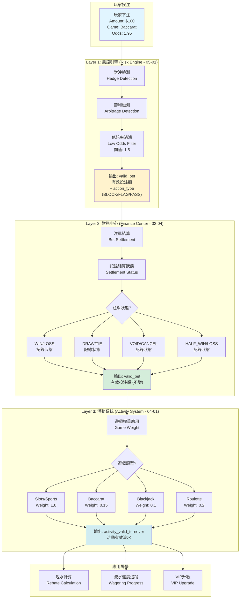
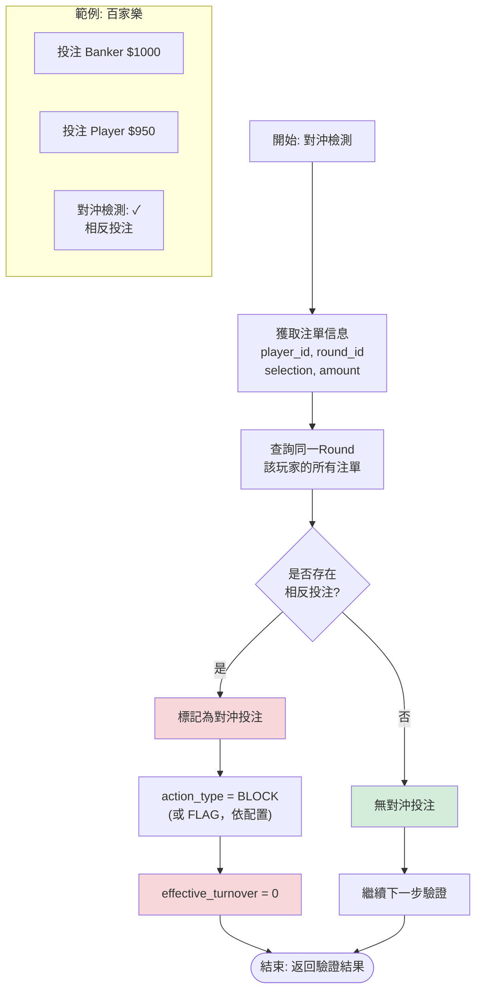
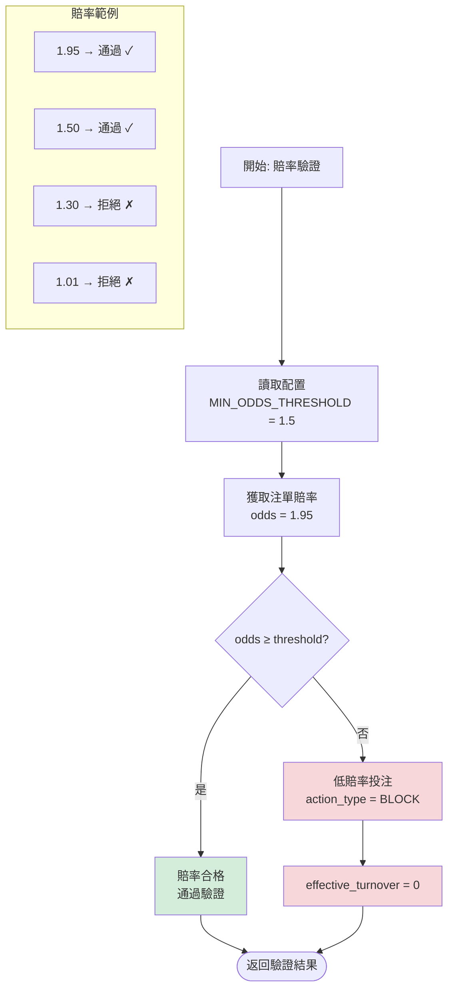

# 03-04-01 流水計算核心邏輯 (Turnover Core Logic)

<!-- SSOT: Authoritative definition of Turnover Core Logic and Layer 1 Risk Validation -->

> **父文檔**: [03-04 流水計算與遊戲對帳](./03-04_Turnover_Calculation.md)
>
> **三層風控架構定位**: 本子文檔定義流水計算的核心概念與 Layer 1 風控驗證邏輯。
>
> **創建日期**: 2026-02-07
> **最後更新**: 2026-02-07
> **版本**: 4.0.0

---

## 1. 系統概述

### 1.1 核心原則

**有效流水定義**: 僅計算「產生輸贏結果」、「具備風險」且「通過風控驗證」的注單。

**公式**:
```
ValidTurnover = BetAmount × GameWeight × OddsFactor × StatusFactor × RiskFactor
```

其中：
- **RiskFactor**: `1` (Pass) 或 `0` (Reject/Flag)
- **StatusFactor**: Layer 2財務層確定 (WIN/LOSS=1.0, DRAW=0)
- **GameWeight**: Layer 3活動層應用 (Slots=1.0, Baccarat=0.15)

### 1.2 三層驗證架構總覽

**架構圖**:



### 1.3 關鍵術語定義

<!-- SSOT: Authoritative terminology definitions -->

| 中文 | 英文 | 定義 | 單位 | 用途 |
|------|------|------|------|------|
| **投注額** | Bet Amount | 單筆原始投注金額 | 單筆 | API 交互、資金扣除 |
| **流水** | Turnover | 投注額的時間累積總和 | 累積 | GGR 計算、財務報表 |
| **有效投注額** | Valid Bet | 經風控過濾的單筆金額 | 單筆 | 流水要求、返水、VIP |
| **流水要求** | Wagering Requirement | 必須達成的有效投注總額 | 累積 | 活動驗證、取款限制 |

**詳細定義**: [術語標準化文檔](../00_Foundation/concepts/00-03_Terminology_Standards.md)

---

## 2. Layer 1: 風控驗證 (Risk Engine Validation)

### 2.1 風控引擎職責

<!-- SSOT: Layer 1 is the ONLY layer responsible for rejection decisions -->

**核心原則**: Layer 1是唯一負責拒絕決策的層級，後續層級(Layer 2/3)僅做數值調整。

**職責矩陣**:

| 職責類型 | Layer 1 (Risk Engine) | Layer 2 (Finance) | Layer 3 (Activity) |
|---------|----------------------|-------------------|-------------------|
| **拒絕決策** | ✅ 唯一負責 | ❌ 不參與 | ❌ 不參與 |
| **狀態因子調整** | ❌ 不參與 | ✅ 唯一負責 | ❌ 不參與 |
| **遊戲權重應用** | ❌ 不參與 | ❌ 不參與 | ✅ 唯一負責 |
| **短路返回** | ✅ BLOCK規則直接返回0 | ❌ 信任 Layer 1 結果 | ❌ 信任 Layer 2 結果 |

### 2.2 配置驅動風控 (v2.1.0)

**新特性**: 支援 `action_type` 配置驅動 (BLOCK/FLAG/PASS)

**返回結構**:
```typescript
interface RiskValidationResult {
  is_valid: boolean;
  action_type: 'BLOCK' | 'FLAG' | 'PASS';
  matched_rules: string[];
  risk_proposal_id: string | null;
  effective_turnover_base: number;
}
```

**三種Action類型**:

| Action Type | 說明 | valid_bet | 流水計算 | 風控提案 |
|-------------|------|-----------|---------|---------|
| **BLOCK** | 實時阻斷 | 0 | 不計入 | 不生成 |
| **FLAG** | 標記但允許 | bet_amount | 正常計入 | ✅ 生成 |
| **PASS** | 正常通過 | bet_amount | 正常計入 | 不生成 |

### 2.3 風控檢測流程

**對沖檢測流程圖**:



**賠率閾值檢測**:



### 2.4 Layer 1 處理流程 (v2.1.0)

**調用層次**:

```typescript
// ✅ 正確方式 (v2.1.0): Layer 1 拒絕後直接短路
const riskValidation = await RiskEngine.validateTurnover({...});

if (!riskValidation.is_valid && riskValidation.action_type === 'BLOCK') {
  // BLOCK規則直接返回0，不進入Layer 2/3
  return {
    effective_turnover_base: 0,
    valid_turnover_finance: 0,
    activity_valid_turnover: 0,
    rejected_by: 'RISK_ENGINE',
    action_type: 'BLOCK',
    matched_rules: riskValidation.matched_rules
  };
}

// FLAG規則標記但繼續 (v2.1.0)
if (riskValidation.action_type === 'FLAG') {
  await recordRiskFlag(bet.id, riskValidation.risk_proposal_id);
}

// Layer 2僅負責狀態因子調整 (信任Layer 1已通過驗證)
const valid_turnover_finance = calculateFinanceTurnover(
  riskValidation.effective_turnover_base,
  bet.status
);
```

**性能優化效果 (v2.0.0→v2.1.0)**:
- Layer 1 拒絕後直接短路返回
- 節省性能: ~5% CPU 與 DB 查詢
- BLOCK vs FLAG分離: FLAG規則允許流水正常計算 + 生成風控提案

---

## 相關文檔

### 子文檔導航
- **下一篇**: [03-04-02 三層驗證架構](./03-04-02_Three_Layer_Validation.md) - Layer 2 財務狀態 + Layer 3 活動權重
- [03-04-03 對帳模型](./03-04-03_Reconciliation_Model.md) - 有效投注計算 + 免費旋轉流水 + 遊戲對帳
- [03-04-04 SmartAdmin 架構映射](./03-04-04_SmartAdmin_Mapping.md) - 投注要求追蹤 + 代碼實現 + 監控

### 外部依賴
- [00-03 術語標準化](../00_Foundation/concepts/00-03_Terminology_Standards.md) - **必讀**
- [05-01 風控系統](../05_Risk_Control/05-01_Risk_Framework.md) - Layer 1 風控引擎

---

**文檔版本**: 4.0.0
**最後更新**: 2026-02-07
**維護團隊**: Finance Team & Backend Team & Risk Team
