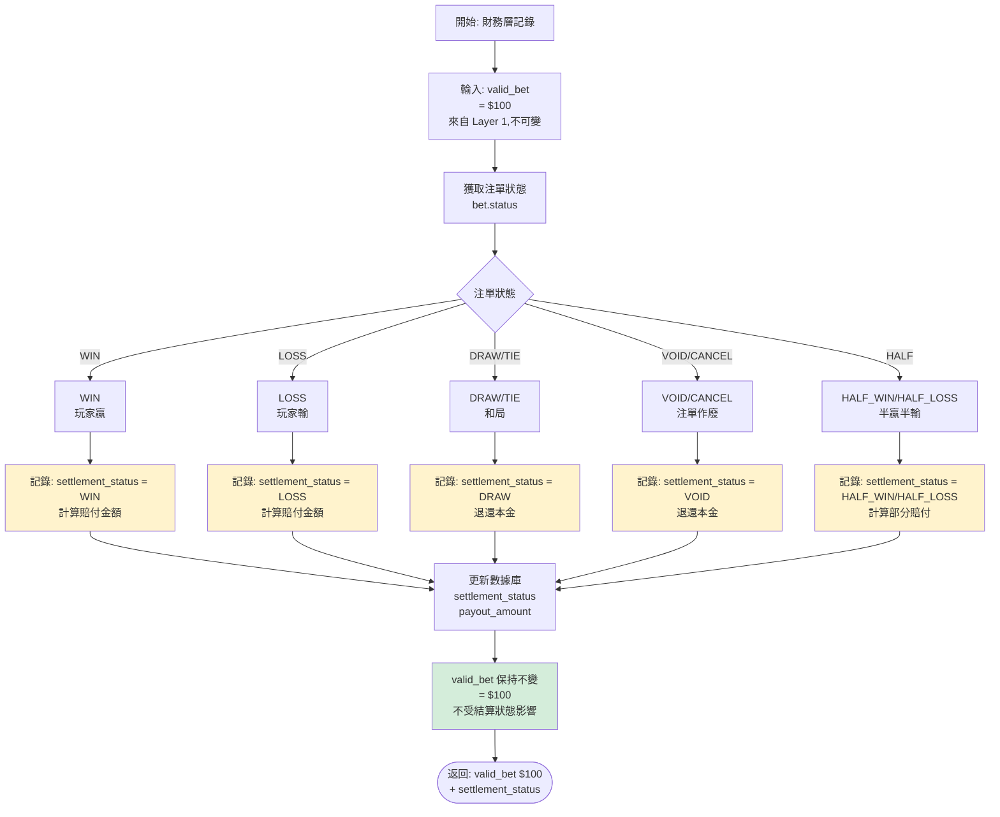
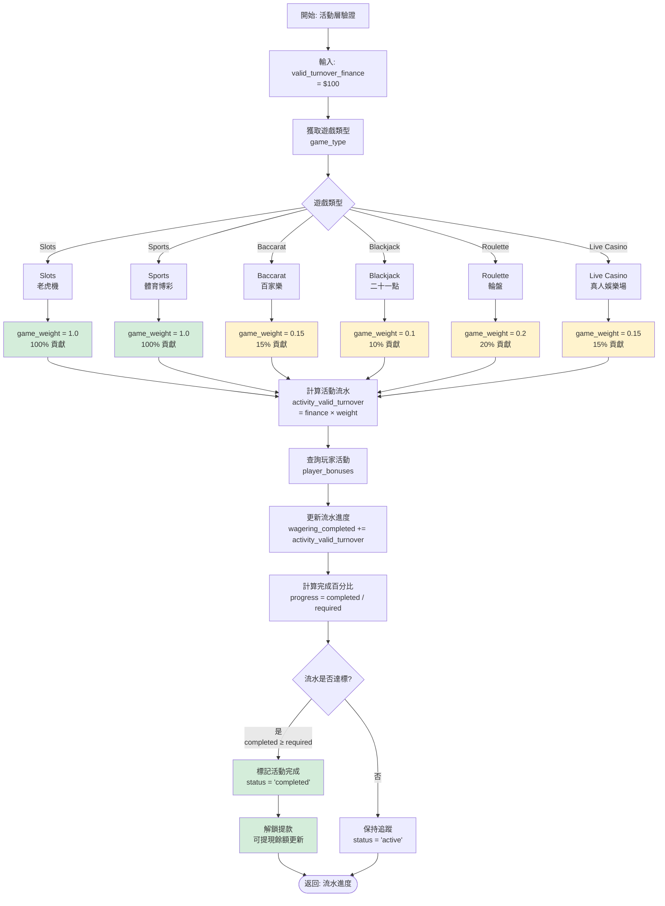

# 03-04-02 三層驗證架構 (Three-Layer Validation)

<!-- SSOT: Authoritative definition of Layer 2 Finance Status and Layer 3 Activity Weight -->

> **父文檔**: [03-04 流水計算與遊戲對帳](./03-04_Turnover_Calculation.md)
>
> **三層風控架構定位**: 本子文檔定義 Layer 2 財務狀態記錄與 Layer 3 活動權重應用邏輯。
>
> **創建日期**: 2026-02-07
> **最後更新**: 2026-02-07
> **版本**: 4.0.0

---

## 3. Layer 2: 財務狀態記錄 (Finance Status Recording)

### 3.1 財務層定位

<!-- SSOT: Layer 2 只負責狀態記錄，不修改valid_bet -->

**核心原則**: Layer 2僅記錄結算狀態，**不修改** Layer 1確定的valid_bet值。

**結算狀態記錄流程**:



### 3.2 狀態判定 (Status Factor)

<!-- SSOT: Standard Principal Method for HALF_WIN/HALF_LOSS -->

**核心規則**: 採用「標準本金法」— valid_bet = bet_amount (不論結算狀態)

**狀態因子映射表**:

| 狀態 (Status)       | 描述    | 流水計算     | 備註                    |
| :---------------- | :---- | :------- | :-------------------- |
| **WIN**           | 玩家贏   | 100%     | 正常計算                  |
| **LOSS**          | 玩家輸   | 100%     | 正常計算                  |
| **DRAW / TIE**    | 和局/走水 | **0%**   | 無風險，不計流水              |
| **CANCEL / VOID** | 取消/作廢 | **0%**   | 注單無效                  |
| **HALF WIN**      | 贏半    | **100%** | ✅ 標準本金法 (v2.0.0 推薦)   |
| **HALF LOSS**     | 輸半    | **100%** | ✅ 標準本金法 (v2.0.0 推薦)   |
| **RUNNING**       | 進行中   | 0%       | 必須等待結算 (Settled) 後才計算 |

> **v2.0.0 重要變更 (2026-01-28)**:
> - **HALF_WIN/HALF_LOSS 現在計入 100% 流水** (採用標準本金法)
> - **「實際風險法」(50% 計算) 已廢棄** - 違反公平性原則
> - **理由**: 相同投注行為應有相同流水貢獻,與風控鎖定邏輯一致

**為什麼Layer 2不應該修改valid_bet?**

**違反公平性原則** (Error #3 - 實際風險法):
```
兩位玩家都投注 100 元在體育博彩「讓 -0.25」:
- 玩家 A 的比賽結果: 全贏 → valid_bet = 100 元 ✓
- 玩家 B 的比賽結果: 平局(輸半) → valid_bet = 50 元 ❌ (錯誤)

矛盾:
- 相同的投注行為
- 相同的風險暴露 (100 元)
- 但 valid_bet 不同 → 違反公平性原則
```

**正確做法 (標準本金法 - 業界標準)**:
```
玩家 A: 投注 100 元 → 全贏 → valid_bet = 100 元
玩家 B: 投注 100 元 → 輸半 → valid_bet = 100 元 (不是 50!)

理由:
- 玩家下注時承擔的風險都是 100 元
- Valid Bet 應該反映投注行為,而非結算結果
- 簡化計算,不需要等結算才知道 valid_bet
```

### 3.3 狀態因子函數實現

```typescript
/**
 * Layer 2: Finance Layer 狀態因子調整
 * 職責: WIN/LOSS/DRAW/CANCEL 狀態因子應用
 * 前置條件: Layer 1 已通過驗證 (is_valid = true)
 *
 * ⚠️ 此層不負責拒絕決策,信任 Layer 1 結果
 */
const status_factor = getStatusFactor(bet.status);
const valid_turnover_finance = effective_turnover_base * status_factor;

log.info(`[Layer 2] bet_id=${bet.id}, status=${bet.status}, status_factor=${status_factor}, valid_turnover_finance=${valid_turnover_finance}`);

/**
 * 狀態因子映射表
 * v2.0.0: HALF_WIN/HALF_LOSS = 1.0 (標準本金法)
 */
function getStatusFactor(status: BetStatus): number {
  const STATUS_FACTORS = {
    'WIN': 1.0,        // 玩家贏 - 全額流水
    'LOSS': 1.0,       // 玩家輸 - 全額流水
    'DRAW': 0.0,       // 和局 - 無風險,不計流水
    'TIE': 0.0,        // 走水 - 同和局
    'VOID': 0.0,       // 作廢 - 注單無效
    'CANCEL': 0.0,     // 取消 - 注單無效
    'HALF_WIN': 1.0,   // ✅ v2.0.0: 贏半 - 全額流水 (標準本金法)
    'HALF_LOSS': 1.0,  // ✅ v2.0.0: 輸半 - 全額流水 (標準本金法)
    'RUNNING': 0.0     // 進行中 - 未結算不計
  };
  return STATUS_FACTORS[status] ?? 0.0;
}
```

---

## 4. Layer 3: 活動權重應用 (Activity Game Weight Application)

### 4.1 遊戲權重應用流程

<!-- SSOT: Game contribution weight definitions -->

**遊戲權重配置表**:

| 遊戲類型 | 權重 | 說明 |
| :--- | :--- | :--- |
| **Slots (老虎機)** | 100% | 純機率，適合洗水 |
| **Sports (體育)** | 100% | 風險高 |
| **Roulette (輪盤)** | 20% | 中等風險 |
| **Baccarat (百家樂)** | 15% | RTP高，平台風險低 |
| **Live Casino (真人)** | 15% | 視運營策略 |
| **Blackjack (二十一點)** | 10% | 技巧性遊戲 |
| **Poker (撲克)** | 5% | 技巧性遊戲 |
| **Video Poker (視訊撲克)** | 5% | 技巧性遊戲 |
| **Lottery (彩票)** | 10-20% | 雙面盤 (大小單雙) 容易對押 |
| **PVP (棋牌/對戰)** | 0% | 通常不計，因涉及玩家間轉移 |

**流程圖**:



### 4.2 活動流水計算實現

```typescript
/**
 * Layer 3: Activity Layer 遊戲權重應用
 * 職責: 將財務流水應用遊戲權重，計算活動貢獻
 */
const game_weight = getGameWeight(bet.game_type);
const activity_valid_turnover = valid_turnover_finance * game_weight;

log.info(`[Layer 3] bet_id=${bet.id}, game_type=${bet.game_type}, game_weight=${game_weight}, activity_valid_turnover=${activity_valid_turnover}`);

/**
 * 遊戲權重映射表
 */
function getGameWeight(gameType: GameType): number {
  const GAME_WEIGHTS = {
    'SLOTS': 1.0,
    'SPORTS': 1.0,
    'E_SPORTS': 1.0,
    'ROULETTE': 0.2,
    'BACCARAT': 0.15,
    'LIVE_CASINO': 0.15,
    'BLACKJACK': 0.1,
    'VIDEO_POKER': 0.05,
    'POKER': 0.05,
    'LOTTERY': 0.1,
    'PVP': 0.0
  };
  return GAME_WEIGHTS[gameType] ?? 1.0; // 預設100%
}
```

---

## 相關文檔

### 子文檔導航
- **上一篇**: [03-04-01 流水計算核心邏輯](./03-04-01_Turnover_Core_Logic.md) - 系統概述 + Layer 1 風控驗證
- **下一篇**: [03-04-03 對帳模型](./03-04-03_Reconciliation_Model.md) - 有效投注計算 + 免費旋轉流水 + 遊戲對帳
- [03-04-04 SmartAdmin 架構映射](./03-04-04_SmartAdmin_Mapping.md) - 投注要求追蹤 + 代碼實現 + 監控

### 外部依賴
- [02-04 財務中心](../02_Finance_Center/02-04_Finance_Center.md) - Layer 2 財務中心
- [04-01 活動系統](../04_Activity_Center/04-04_Activity_Bonus.md) - Layer 3 活動系統

---

**文檔版本**: 4.0.0
**最後更新**: 2026-02-07
**維護團隊**: Finance Team & Backend Team & Risk Team
